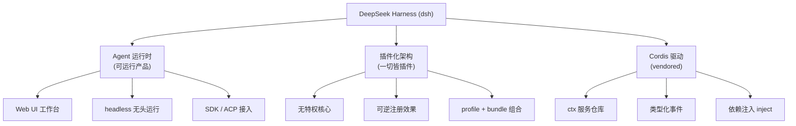
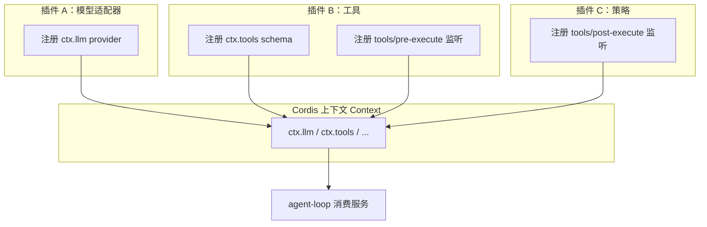
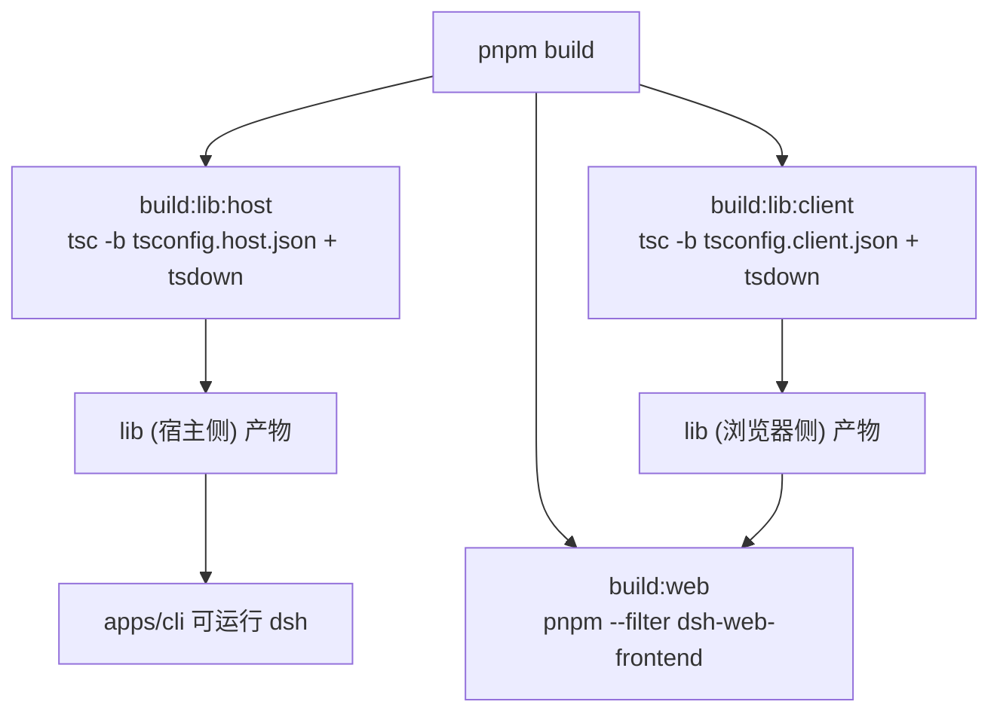
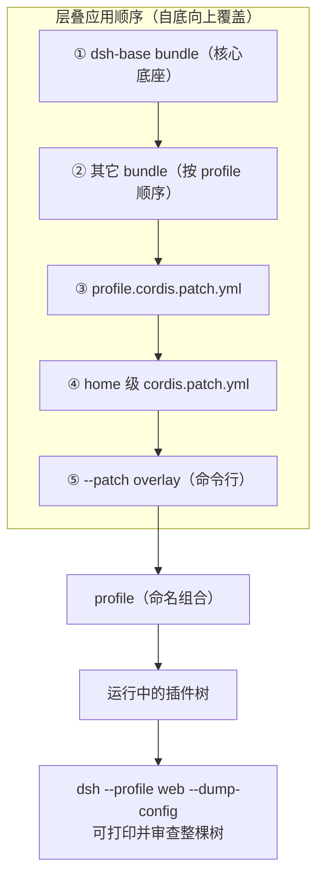
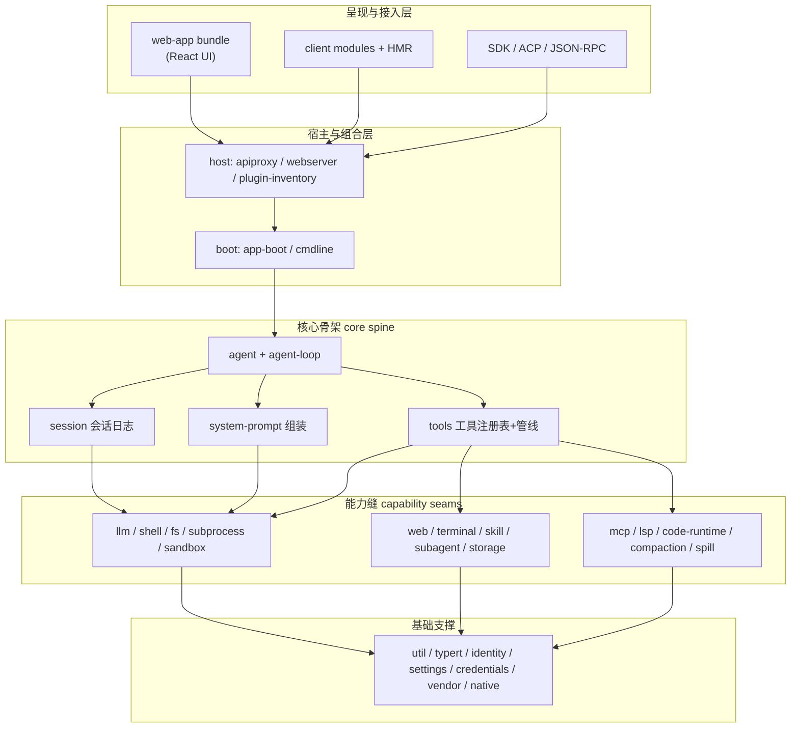
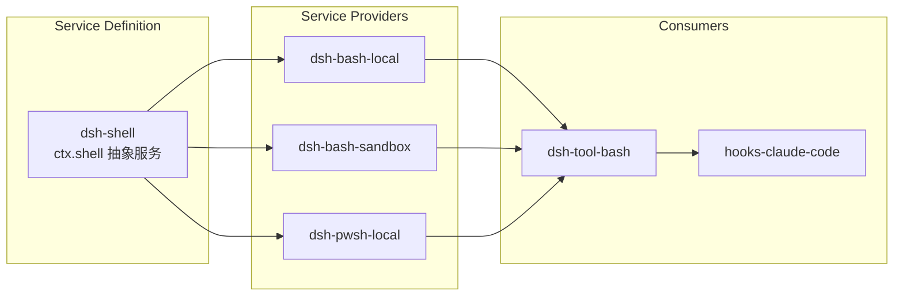
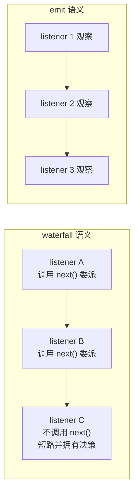
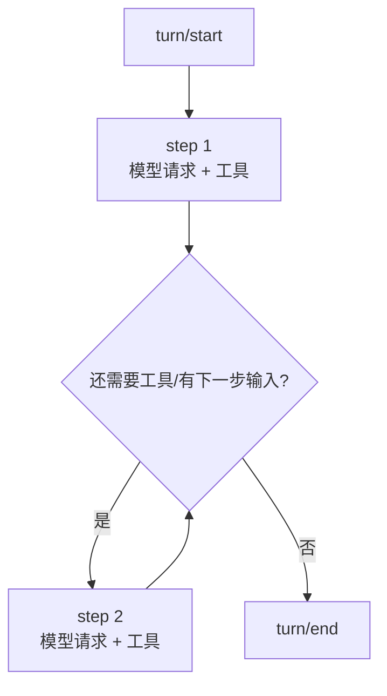
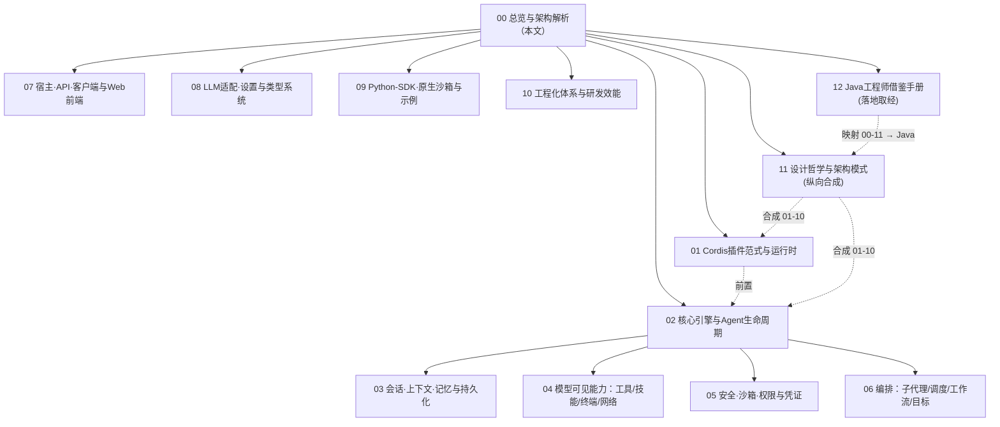

> **定位**：本文是 DeepSeek Harness（`dsh`）全量代码分析的入口篇。面向想要理解「业界最前沿的插件化 Agent 框架如何从零设计」的中高级开发者。读完本文你将建立对该框架的全局心智模型——设计哲学、仓库结构、分层架构、事件模型、运行机制，并据此决定深入阅读本系列的哪个分册。前置阅读：无（本文自带全量背景）；建议先通读 `docs/architecture.md` 再对照本文。
> **代码版本**：本系列基于仓库 `deepseek-harness` 快照 `master`（`package.json` 版本 `0.1.0-rc.5`）撰写。项目处于 *developer preview*，破坏性变更频繁，阅读源码时以当下代码为准。

## 一、项目简介

DeepSeek Harness 是 **DeepSeek AI** 于 2026 年开源的一款 **agent harness（智能体框架）**。与 LangChain / Spring AI 这类「函数库 + 适配器」式框架不同，它的定位更接近一个**可直接运行的 Agent 运行时产品**：`npx @deepseek-ai/dsh web` 一行命令就能启动一个带 Web UI 的完整 Agent 工作台（默认 `http://127.0.0.1:3080`），支持模型调用、工具执行、Shell、终端、文件系统、子代理、后台任务、定时调度、持久化会话、安全沙箱等全部能力。

其核心卖点与独特性在于三句话：

1. **一切皆插件（everything is a plugin）**——包括模型适配器、工具注册表、会话日志、乃至 Agent 主循环本身，都是可替换的插件。不存在需要打补丁的「特权核心」。
2. **由 Cordis 驱动**——基于 vendored 的 [Cordis](https://github.com/cordiverse/cordis) 插件框架，其设计哲学来自论文 *[A Programming Paradigm for Spatiotemporal Composability](https://github.com/cordiverse/paper)*（面向时空可组合性的编程范式）。
3. **可逆注册（reversible effects）**——插件卸载时，其注册的工具、Prompt 片段、监听器、适配器全部按序回滚，热更新与灰度替换成为内置能力而非工程技巧。



### 为什么这个项目值得 Java Agent 架构师精读

对以 Spring AI 为主要技术栈的 Java 开发者而言，DeepSeek Harness 是一座「他山之石」的富矿，本系列文档的目的就是把它拆开讲透。以下是它能带给你的视角：

| 维度 | Spring AI（你的主线） | DeepSeek Harness（本文分析对象） |
|---|---|---|
| 架构形态 | 库 + 约定，能力通过 `ChatClient` / `Advisor` 组合 | 可运行运行时，能力通过插件组合 |
| 扩展方式 | Bean + Advisor 链 + `@Tool` | 事件监听 + 服务注册 + 可逆效果 |
| 核心抽象 | ChatClient → ChatModel → Tool → VectorStore | ctx 服务 → Agent 循环 → 工具管线 → 会话日志 |
| 会话真相 | 内存 + 持久化方案自选 | 单一追加式 SessionEvent 日志，一切可重放 |
| 安全模型 | 需自行设计 | 原生沙箱 + 审批 + 凭证 + 防御模式 |
| 可观测 | Micrometer / OTel 集成 | 会话遥测缝 + 事件矩阵 + 生成式文档目录 |

读完后你会发现：**「一切皆事件、可逆注册、会话日志为唯一真相、能力缝可整体替换」**这套组合拳，正是生产级 Agent 系统在管控分离与可扩展性上追求的终极形态。它与 [教程 29-管控分离架构] 的 Control/Data Plane 思想、[教程 28-流式工具调用与事件协议] 的事件协议设计高度同构。

> 想深入本体系的对应知识？→ [教程 29-管控分离架构] [教程 28-流式工具调用与事件协议] [教程 89-SpringAI2-Agentic架构]

## 二、设计哲学：一切皆插件

`docs/architecture.md` 开篇即定调：「**There is no privileged core to patch: you extend dsh by mounting a plugin beside the others, and registrations are effects that unwind when their plugin unloads.**」——没有需要打补丁的特权核心；你通过在其它插件旁挂载一个插件来扩展 dsh，注册是效果，插件卸载时按序回滚。

这套哲学由三个机制落地（详见 [本系列 01-Cordis插件范式与运行时]）：

1. **服务仓库（Service repository）**：`ctx.<key>` 是服务的稳定坐标。如 `ctx.tools`（工具注册表）、`ctx.llm`（模型适配器注册表）、`ctx.sessions`（会话存储）。插件通过 key 找服务，而不是 import 具体实现。
2. **类型化事件（Typed Events）**：服务通过 TS 声明合并声明事件名，按 `emit` / `waterfall` / `parallel` / `serial` 四种模式分发（见下文「事件模型」）。
3. **可逆效果（Reversible effects）**：Prompt 片段、工具 schema、适配器、provider、监听器都通过 `ctx.effect()` / `ctx.on()` 安装，卸载按序回滚。



> 思想对照：这与 Java 生态的「依赖倒置 + 策略模式」等价，但 Cordis 用「服务 key + 事件 + 可逆效果」把插件边界提升为一等公民——插件之间零静态依赖，全部通过运行时的 ctx 与事件解耦。这正是 [教程 29-管控分离架构] 中 Control Plane 与 Data Plane 解耦的运行时实现。

### 五条核心设计哲学总览

「一切皆插件」只是五条相互咬合哲学的第一条。完整的五条（本系列 [11-设计哲学与架构模式] 是它们的专篇）共同回答了生产级 Agent 的四个诉求（可扩展/可重放/可治理/可编排）：

| # | 哲学 | 一句话 | 主要解决 | 专篇 |
|---|---|---|---|---|
| 1 | **一切皆插件** | 无特权核心，注册是可逆效果 | 可扩展不乱 | [01-Cordis插件范式与运行时] |
| 2 | **日志即真相** | Model-visible means logged，一切派生状态是投影 | 可重放可信 | [03-会话·上下文·记忆与持久化] |
| 3 | **能力可整体替换** | 定义/提供者/消费者三分离 | 演进不破 | [04-模型可见能力] |
| 4 | **状态由数据推导** | 不维护第二套状态机 | 重放自洽 | [06-编排] |
| 5 | **fail-closed 安全** | 无法保证安全就拒绝执行 | 默认安全 | [05-安全·沙箱·权限与凭证] |

> 阅读建议：先读本文建立全局，再按需下钻分册；**最后务必读 [11-设计哲学与架构模式]**——它把五条哲学、四大架构模式与「一条消息的完整旅程」纵向合成，是本系列的设计主线。

## 三、仓库结构全景

仓库是 pnpm workspace monorepo。`AGENTS.md` 的 Repository layout 给出了分组的官方注解：

| 路径 | 内容 | 数量 |
|---|---|---|
| `packages/core/` | **产品 API 脊柱**：session、system-prompt、tools、agent、agent-loop、scope | 8 包 |
| `packages/api/` | Remote BFF 组装与 Typert RPC 网关 | 2 包 |
| `packages/typert/` | 类型图生成器、loader、运行时注册表 | 4 包 |
| `packages/llm/` | LLM 能力：服务定义 + DeepSeek/Pi AI 提供者 | 5 包 |
| `packages/shell/` | bash 能力：定义 + local/pwsh 提供者 + 工具消费 | 9 包 |
| `packages/subprocess/` | 子进程能力 + 本地进程树提供者 | 2 包 |
| `packages/terminal/` | 持久终端会话 | 3 包 |
| `packages/fs/` | 文件系统能力 + 策略 | 7 包 |
| `packages/lsp/` | 语言服务能力 | 3 包 |
| `packages/skill/` | 技能提供者注册表 + 目录/加载工具 | 4 包 |
| `packages/web/` | Web 能力：定义 + 搜索/抓取提供者 + 工具 | 6 包 |
| `packages/compaction/` | 上下文压缩能力 + 基本提供者 | 4 包 |
| `packages/context/` | 请求上下文插件 | 4 包 |
| `packages/subagent/` | 子代理能力：定义 + 提供者 + 委托消费 | 11 包 |
| `packages/bundle/` | 可安装的 `dsh --profile` patch-layer bundle | 3 包 |
| `packages/workflow/` | 工作流能力 + worker-thread 提供者 + 工具 | 4 包 |
| `packages/goal/` | 同一会话目标领域 | 4 包 |
| `packages/jobs/` | 后台任务注册表 | 3 包 |
| `packages/schedule/` | 定时调度 | 1 包 |
| `packages/session/` | 会话持久化/投影/标题/遥测 | 13 包 |
| `packages/session-query/` | 会话读取/检索 | 4 包 |
| `packages/spill/` | 溢出存储（大文本落盘） | 3 包 |
| `packages/storage/` | 非会话存储枢纽 | 4 包 |
| `packages/feedback/` | 消息反馈 | 2 包 |
| `packages/attachment/` | 附件存储 | 2 包 |
| `packages/sandbox/` | 进程沙箱缝 | 4 包 |
| `packages/guard/` | 超时/重复提醒守护 | 2 包 |
| `packages/credentials/` | 凭证缝 | 2 包 |
| `packages/interaction/` | 命令/审批/询问用户 | 5 包 |
| `packages/hooks/` | 外部 CLI（Claude Code/Codex）桥接 | 3 包 |
| `packages/e2b/` | E2B 远程沙箱 POC | 3 包 |
| `packages/host/` | apiproxy / webserver / 插件清单 | 8 包 |
| `packages/boot/` | app-boot 组合 + cmdline | 2 包 |
| `packages/client/` | 浏览器端运行时 + ui-* 模块 | ~40 模块 |
| `packages/acp/` | Agent Client Protocol 桥接 | 1 包 |
| `packages/sdk/` | TS SDK（client/protocol/server） | 3 包 |
| `packages/plan/` | 规划模式 | 1 包 |
| `packages/preset/` | agent 预设 + persona | 2 包 |
| `packages/settings/` | 设置缝 | 2 包 |
| `packages/identity/` | 匿名用户 ID | 1 包 |
| `packages/workspace/` | 工作区实体注册表 | 1 包 |
| `packages/todo/` | 待办工具 | 1 包 |
| `packages/mcp/` | MCP 客户端 | 1 包 |
| `packages/code-runtime/` | 代码执行缝 | 2 包 |
| `packages/runtime-diagnostics/` | invariants 运行时不变式 | 1 包 |
| `packages/util/` | 原子写/品牌/路径/超时等 | 7 包 |
| `packages/test-support/` | 测试支持（mock/replay/testkit） | 6 包 |
| `packages/examples/` | 包内示例 | 3 包 |
| `apps/cli`、`apps/web` | CLI 与 Web 应用 | — |
| `examples/` | 端到端示例（acp/headless/jsonrpc/mcp-memory/web-*） | 6 个 |
| `native/landlock-run` | 原生 Landlock 沙箱执行器 | — |
| `python/` | Python SDK 与运行时 | — |
| `vendor/` | vendored 的 Cordis 及其依赖（cosmokit/schemastery/loader 等） | — |
| `scripts/` | 构建/门禁/生成器/校验器（约 150 个） | — |
| `docs/` | 架构、子系统、catalog、教程、user 指南 | 60+ 篇 |

> 全文共 49 个一级包、223 个二级包/模块。命名规范：`packages/<group>/<pkg>`，发布名 `@deepseek-ai/dsh-<pkg>`。

## 四、技术栈与构建

| 项 | 值 |
|---|---|
| 包管理器 | pnpm `11.7.0`（`package.json#packageManager`） |
| 运行时 | Node `^22.19.0 || >=24.0.0` |
| 语言 | TypeScript（`type: module`，ESM） |
| 构建 | `tsc -b` 类型检查 + **tsdown**（打包），分 host/client 双面（`tsconfig.host.json` / `tsconfig.client.json`） |
| 测试 | Vitest（unit / snapshot / web / e2e / stress / perf 多套配置） |
| Lint | oxlint（`.oxlintrc.json`）、jscpd 重复检测、knip 未用检测 |
| 代码检查 | lefthook（git hooks） |
| CI | GitLab CI（`.gitlab-ci.yml`），Linux/Windows（Wine）矩阵 |

构建与运行（`package.json#scripts`）：

```sh
pnpm install
pnpm run build        # build:lib (host+client) + build:web
pnpm dsh web          # 启动 Web UI（默认 127.0.0.1:3080）
```



> 架构师视角：host/client **双面构建**是把「宿主进程逻辑」与「浏览器运行时逻辑」在编译期就隔离的设计。`client` 面代码不依赖 Node，可在浏览器直接运行；两侧通过 `Connection`（RPC carrier）通信。这直接服务于「浏览器端 Agent 运行 + 宿主端能力执行」的管控分离形态。

## 五、分层架构：从 profile 到能力缝

一个运行中的 `dsh` 是一棵插件树，由启动时按序叠加的层组成。官方 `docs/architecture.md` 定义了这套「组合」模型：

- **Profile**：命名组合，存于 Harness home。列出它叠加的 bundles、安装的树外插件，以及用户自己的 `cordis.patch.yml`。`web` 与 `headless` 作为模板随仓库提供。
- **Bundle**：Cordis 配置行 + 其挂载代码的分发格式。`dsh-base` 是每个 profile 的第一层（模型适配器、工具、持久化、沙箱与审批策略、设置、凭证、遥测）；`dsh-web-app` 叠加浏览器应用；`dsh-headless` 提供无服务器的单次运行器。
- **Patch**：层叠式覆盖。按「每个 bundle（按 profile 列出顺序）→ profile 的 `cordis.patch.yml` → home 级 → `--patch` overlay」的顺序应用到空条目列表。patch 按 id 定位一行并整行替换，或插入新行。



这个「profile/bundle/patch」三层组合，本质是**声明式 + 声明式的增量覆盖**——任何一行配置都可被上层 patch 替换。`dsh --profile web --dump-config` 让你看到机器实际启动的整棵树，打印出来的任何一行都能用你自己的 patch 替换。这是配置可审计、可灰度、可回滚的工程基础。

在这一底座之上，是两条轴线构成的核心架构（详见 [本系列 02-核心引擎与Agent生命周期] 与 [本系列 01-Cordis插件范式与运行时]）：



> 注意：上图中每个方块都是一个**插件**。所谓「层」，只是我们在阅读时对「服务依赖方向」的分组，不是进程边界。核心骨架（session/system-prompt/tools/agent/agent-loop）本身就是插件——官方称之为 **core spine（产品 API 脊柱）**，注册在固定的 ctx key 上。

### 能力缝（Capability Seam）：本框架最关键的抽象

官方 `docs/capability-seams.md` 给出了本框架最核心的概念：

> **seam（能力缝）** = 一个**可整体替换的能力**，包含三个角色：
> - **Service Definition（服务定义）**：声明接口的 Cordis `Service`（拥有 `ctx.<key>` 与词汇表类型；是抽象类如 `ShellExecutor`，或具体注册表如 `WebRuntime`，**绝不是 TS interface**）
> - **Service Provider（服务提供者）**：实现该接口的一个或多个后端
> - **Consumer（消费者）**：注入该服务的使用方，通常是模型可见的工具

典型范例是 `packages/shell`：`dsh-shell`（定义）→ `dsh-bash-local` / `dsh-bash-sandbox`（提供者）→ `dsh-tool-bash`（消费者）。

**缝的价值在于：换一个提供者，整个产品随之改变，而消费者零改动。** 例如文件系统与子进程提供者共享同一执行世界——把它们指向远程沙箱，Bash、PTY、LSP 会跟着一起移过去，无需为每个消费者 fork 一份实现。子代理提供者也一样，在同一个接口后变化极大（从进程内子代理到另一个产品里委托回合）。



> 与 Java 生态对照：这相当于「SPI + 策略注入」的完整工程化——但 Cordis 用「抽象类继承 + 事件声明合并」把定义、提供者、消费者的关系在类型系统层面锁死，且「一个角色不足以构成缝」的约束保证了不会出现半个接口被替换的烂尾。

## 六、事件模型：框架的扩展点

事件是扩展点，而选对事件域是大多数改动做出的第一个决策。官方把事件分成三个域（详见 [本系列 02-核心引擎与Agent生命周期]）：

- **会话事件（Session events）**：追加到日志的**持久事实**，通过 `session/event` 广播。需要跨重载存活的事实用它（`turn/*`、`step/*`、`user/message`、`assistant/*`、`tool/*`）。
- **Agent 事件（`agent/*`）**：携带活跃 `Agent` 的**实时协调**：inbox、step、status、request、validation、continuation。观察或拦截进行中的工作用它。
- **能力事件（Capability events）**：给缝挂策略与适配器（`fs/*`、`tools/*`、`telemetry/*`），不 import 主循环。

### 四种分发模式

Cordis 事件有四种分发模式（`docs/cordis-primer.md`）：

| 模式 | 是否 await | 分发顺序 | 有返回值 |
|---|---|---|---|
| `emit` | 否 | 按注册顺序观察 | 无 |
| `waterfall` | 否 | 按注册顺序观察（`next()` 委派） | 有 |
| `parallel` | 是 | 全部并行 | 无 |
| `serial` | 是 | 按注册顺序 | 有 |

`waterfall` 是 around-中间件语义：监听器收到 `(...args, next)`，调用 `next()` 把「可能被包装的结果」委派给下一个服务，不调用 `next()` 则短路。策略监听器短路（拥有决策权），观察/注解监听器必须委派。



> 关键事件示例（完整矩阵见官方 `docs/event-producer-consumer.md`，本系列 [02] 会逐条展开）：`agent/pre-step`（决定模型看到什么，waterfall）、`llm/stream`（流式请求，waterfall）、`tools/pre-execute` / `tools/execute` / `tools/post-execute`（工具执行三阶段 waterfall）、`agent/turn-stopping`（回合终止串行检查点）、`session/event`（持久日志广播）、`fs/write-intent`（写意图检查 waterfall）。

## 七、运行机制速览：Turn 与 Step

本框架的循环单位有严格的三层定义（`docs/glossary.md`）：

- **step（步）**：一次模型请求 + 其响应的工具执行。
- **turn（回合）**：零或多个 step。在其第一个输入被认领前开启，在没有欠账时关闭。
- **round（轮）**：包含 turn 的外层策略迭代（如 goal round 或 Ralph 的一次尝试）。



输入通过**一个 inbox** 到达驱动（agent-loop）。有些消息立即唤醒驱动；注入的上下文在另一条消息到来前在 inbox 中等待。`agent/pre-step` 决定模型看到什么：监听器可以改写认领的消息，或直接拒绝；被拒绝或空的首个认领仍会关闭一个不消耗 step 的持久回合（日志会记录这次尝试）。

> 完整时序（`docs/agent-lifecycle.md` 的 sequenceDiagram）与工具执行管线（`docs/tool-execution-pipeline.md`）本系列 [02] 将全文移植并加注。

## 八、本系列文档路线图

本系列共 13 篇，按「自顶向下、先骨架后细节、再纵向合成、再落地取经」组织：



| 分册 | 主题 | 核心包/目录 |
|---|---|---|
| [01-Cordis插件范式与运行时] | 插件框架、ctx、事件、可逆效果、profile/bundle | `vendor/`、`packages/boot/`、`packages/bundle/` |
| [02-核心引擎与Agent生命周期] | session/system-prompt/tools/agent/agent-loop、turn/step、inbox、invariants | `packages/core/` |
| [03-会话·上下文·记忆与持久化] | 日志持久化、投影、压缩、溢出、反馈、遥测、标题 | `packages/session/`、`context/`、`compaction/`、`spill/`、`storage/` |
| [04-模型可见能力] | 工具管线、技能、Shell、终端、Web、MCP、LSP、代码执行 | `packages/skill/`、`shell/`、`terminal/`、`web/`、`mcp/`、`lsp/`、`code-runtime/` |
| [05-安全·沙箱·权限与凭证] | 沙箱缝、Landlock、审批、凭证、权限预设、外部 CLI 桥接 | `packages/sandbox/`、`guard/`、`credentials/`、`interaction/`、`hooks/`、`e2b/` |
| [06-编排] | 子代理六提供者、后台任务、定时调度、工作流/Ralph、目标、规划 | `packages/subagent/`、`jobs/`、`schedule/`、`workflow/`、`goal/`、`plan/` |
| [07-宿主·API·客户端·Web] | apiproxy/webserver、boot/bundle、Connection、client 模块、ACP、SDK | `packages/host/`、`api/`、`boot/`、`client/`、`acp/`、`sdk/` |
| [08-LLM适配·设置·类型系统] | llm seam、DeepSeek/Pi AI 提供者、retry、token-meter、settings、typert | `packages/llm/`、`settings/`、`identity/`、`preset/`、`typert/` |
| [09-Python-SDK·原生·示例] | Python SDK、landlock-run、examples 全家 | `python/`、`native/`、`examples/` |
| [10-工程化体系与研发效能] | 构建/门禁/生成器/校验器/CI/测试/vendor 策略 | `scripts/`、`vitest.*`、`.gitlab-ci.yml`、`vendor/` |
| [11-设计哲学与架构模式] | **五条哲学 + 四大架构模式 + 一条消息的完整旅程（纵向合成）** | 全系统（设计主线） |
| [12-Java工程师借鉴手册] | **全部知识点逐条映射 Java/Spring AI 落地 + 8 步移植路线图** | 全系统（落地篇） |

## 九、对 Java Agent 架构师的启示（桥接小结）

把这套 TypeScript 框架的设计转译为 Java/Spring AI 语境，本系列每篇都会在结尾给出「转译到 Spring AI」小节。这里先给出总纲：

1. **会话日志即真相（Session log as source of truth）**：所有模型可见的输入必须能由日志重建（官方 runtime invariant）。对应 Java 侧「历史记录持久化与合规」[教程 58-历史记录持久化与合规]。Spring AI 的 ChatMemory 只是内存态，deepseek-harness 把「可重放」做成了编译期不变式。
2. **事件矩阵即扩展点目录**：Java 侧对应 [教程 28-流式工具调用与事件协议] 的事件协议与 [教程 23-Advisor链与拦截器]。但这里的事件域（session/agent/capability）划分更细，且带 dispatch 模式契约。
3. **能力缝 = 可整体替换的 SPI**：对应 [教程 29-管控分离架构] 的 Control/Data Plane。换一个 fs/subprocess 提供者，整个沙箱世界随之迁移——这正是「管控分离」在运行时层级的终极表达。
4. **可逆注册 = 优雅卸载**：Java 生态里 Bean 生命周期管理做不到「卸载即回滚全部注册」；这里用 effect 把「注册/注销」成对化，为插件热装、灰度替换提供地基。
5. **四层事件分发 = 策略插入点**：`emit`（观察）/`waterfall`（around 中间件）/`parallel`/`serial` 四种模式，对应 Java 里「监听器 / 责任链 / 并行流 / 顺序执行」四种策略形态，但被类型系统统一建模。

> **适用场景**：想深度理解「插件化 Agent 运行时」如何做到生产级（沙箱/持久化/编排/可观测一应俱全）的架构师；想为自己的 Spring AI 系统引入事件化架构、可逆注册、会话日志真相的开发者。
> **不适用场景**：只想快速写一个 demo Agent 的入门者（应先读 [教程 00-Agent核心概念] [教程 02-ChatClient与对话模型]）；想直接抄代码而非吸收设计的开发者（本系列是分析文档，不提供完整可用源码）。

## 十、总结

本文建立了 DeepSeek Harness 的全局框架：**一切皆插件**的哲学、由 Cordis 驱动的 ctx/事件/可逆效果三机制、49 组 223 个包构成的分层仓库、profile/bundle/patch 组合的声明式启动、事件三域与四分发模式、turn/step/round 的循环层级、以及能力缝这一「可整体替换」的核心抽象。

接下来，沿着 [01] → [02] → … → [10] 的顺序，我们将逐层下钻：先看 Cordis 这个地基，再进入核心引擎，随后铺开会话记忆、能力全家、安全、编排、宿主前端、LLM 与类型系统、Python 与原生，最后以工程化体系收尾。每一篇都会给出代码级证据（file:line）、Mermaid 图、以及与 Spring AI 生态的转译对照。

> **定位回顾**：本文作为系列入口，覆盖「为什么、是什么、怎么构成、怎么运行」。后续各篇回答「每个子系统怎么实现、为什么这样设计、我能转译什么」。
