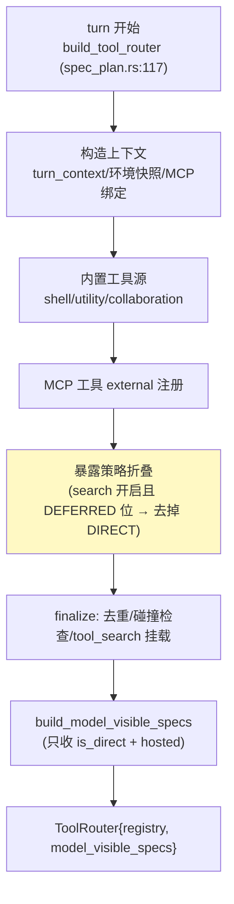
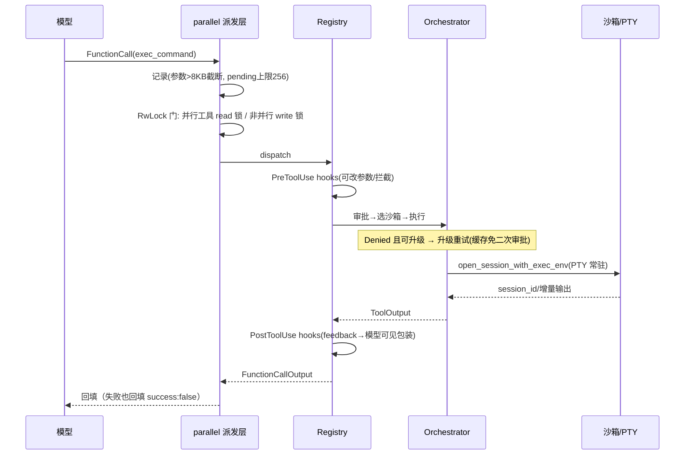
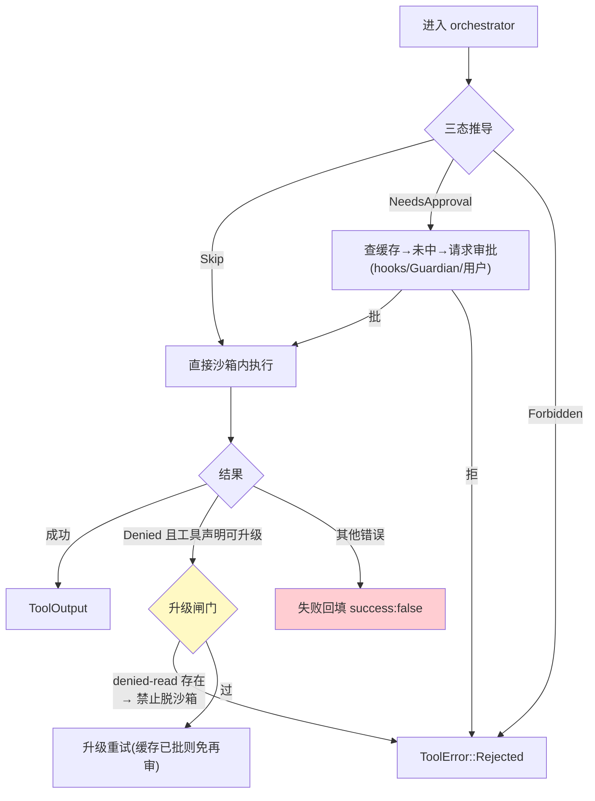

# 01-Codex 工具子系统与审批沙箱：三分离 / 失败回填 / 三态审批

> **定位**：解析 codex 工具子系统全链路——定义（三层原语）→ 装配（每 turn 重算）→ 派发（并行门/取消）→ 编排（审批→沙箱→升级重试），以及审批三态推导表与结构化 key 缓存。读者画像：要设计企业级工具治理/审批体系的 Java 架构师。锚点：[教程 00-基础与核心/03-工具调用]、[教程 04-企业级架构主干/08-Human-in-the-Loop与审批流]、[教程 04-企业级架构主干/11-安全与权限控制]。行号基于分析时版本。

---

## 一、三层定义原语：spec / executor / exposure 三分离

| 原语 | 位置 | 职责 |
|------|------|------|
| `ToolDefinition` | `tools/src/tool_definition.rs:7-13` | 最小元数据：name/description/input_schema/output_schema/defer_loading |
| `ToolSpec` | `tools/src/tool_spec.rs:20-56` | 模型可见形态，五变体（Function/Namespace/ToolSearch/WebSearch/Freeform），serde 直接映射模型 API 的 tool JSON |
| `ToolExecutor` trait | `tools/src/tool_executor.rs:106-127` | 执行契约：`tool_name()/spec()/exposure()/supports_parallel_tool_calls()/handle()` |

**三分离的价值**：工具自描述（schema、暴露面、并行性、延迟加载），策略全在装配层——工具实现不关心"谁可见/是否并行/要不要审批"。`ToolExposure` 六种暴露面（Direct/Deferred/DeferredModelOnly/DirectModelOnly/CodeModeOnly/Hidden）由 bitflags 正交组合后折叠：**同一注册表，按宿主形态与特性门控投影出不同工具面**。

## 二、装配链：每 turn 组装（不是启动时一次性）

注册语义分信任级（`registry.rs`）：**trusted**（内置）重名 fail-fast；**external**（MCP/插件）冲突降级为记录。**保留名守卫**（`registry.rs:346-355`）：外部工具不得注册 `exec_command`/`shell_command`——防 MCP 工具冒充内置 shell（对照 [教程 04-企业级架构主干/11-安全与权限控制] 的工具投毒防护）。

## 三、端到端一次 tool call

四条核心纪律：
1. **失败回填而非抛异常**（`parallel.rs:216-236`）：任何工具错误转 `success:false` 输出——模型参与错误恢复，**会话永不因工具崩**；
2. **RwLock 并行门**（`parallel.rs:47`）：同 runtime 共享一把 `Arc<RwLock<()>>`——声明支持并行的工具拿 read 锁（互相并发），非并行工具拿 write 锁（互斥一切）；
3. **恰好一次通知**：`AtomicBool` 保证 terminal outcome 只通知一次（`registry.rs:756-767`）；
4. **PTY 常驻会话 + 增量轮询**（`handlers/shell_spec.rs:113-155`）：`session_id/chunk_id/yield_time_ms` 三件套支持交互式命令（vim、watch 模式）——工具执行不是"一问一答"而是"会话续航"。

## 四、审批：三态推导表 + 结构化 key 缓存

`ExecApprovalRequirement` 三态（`sandboxing.rs:152-230`）：

| 策略 \ FS | Restricted | 非 Restricted |
|-----------|-----------|---------------|
| Never | Skip | Skip |
| OnRequest | NeedsApproval | Skip |
| Granular(g) | !g.allows_sandbox_approval() → **Forbidden** | Skip |
| UnlessTrusted | NeedsApproval | NeedsApproval |

**"何时问用户"是纯函数**（策略 × 请求 → 三态）——不是散落在各工具里的 if。

**ApprovalStore**（`sandboxing.rs:39-116`）：key 是结构化 JSON，按资源粒度设计：

| 工具 | key 结构 | 粒度 |
|------|---------|------|
| unified_exec | `{environment_id, executable, canonicalize命令, cwd, tty, permissions}` | 命令级 |
| apply_patch | `{environment_id, path}` 每个 patch 路径一个 key | 文件级 |
| 网络访问 | `(environment_id, host小写, protocol, port)` | host+port 级 |

命中条件"**全部 key 均已批**"、用户选"本会话"时**逐 key 写入**——因此"未来任何 key 子集的请求"自然免提示。同 host 并发请求经 `PendingHostApprovalOwner` 去重（只弹一次审批框）。

## 五、沙箱与升级重试

**失败升级而非直接拒绝**：先最小权限（沙箱内）尝试，被拒后带上下文升级——安全与体验兼得。**安全不变量五条**（迁移必保）：denied-read 只能活在沙箱里；保留名防冒充；网络审批 fail-closed（异常路径全落 Deny）；升级重试需新审批（缓存已批除外）；apply_patch 的 follow_symlinks 仅在"要求沙箱却 bypass"时禁止（防符号链接逃逸）。

## 六、转译到 Spring AI / Java 生态

| codex 机制 | Spring AI / Java 对应 | 转译要点 |
|-----------|----------------------|---------| 
| ToolExecutor 三分离 | `ToolCallback`（已实证基准）+ 自研 Registry（元数据：exposure/parallel/escalate） | Spring AI 只有 name/description/call——暴露面/并行性/升级意愿作为注册表侧 car data |
| 失败回填 | ToolCallback 返回错误 JSON 而非抛异常 | Spring AI 工具抛异常会中断流；返回 `{"success":false,"error":...}` 文本让模型自纠（[教程 00-基础与核心/03-工具调用] 的错误传播对比） |
| 审批三态表 | 纯函数 `ApprovalRequirement decide(policy, request)` + 结构化 key 缓存（ConcurrentHashMap<ApprovalKey,Decision>） | key 按资源粒度：命令 canonical 化后哈希 / 文件 path / host+port；HIT 条件=全 key 已批（[教程 04-企业级架构主干/08-Human-in-the-Loop与审批流] HITL 的缓存层答案） |
| 升级重试 | ToolCallingManager 装饰器内两段尝试（受限→全权） | 与审批缓存联动：升级不重复弹审批 |
| RwLock 并行门 | `ReentrantReadWriteLock` 或响应式信号量按工具粒度 | 虚拟线程时代 read/write 锁仍正确 |
| PTY 常驻会话 | Java 侧 `Process` + pty 库；Web 侧改 WebSocket 会话续航 | `yield_time_ms` 增量轮询协议可直接照搬为事件协议字段 |

**对照自查**：你的工具审批是"每次都问"还是"永不问"？codex 答案是结构化 key + 会话级缓存 + 三态纯函数——既不骚扰用户也不裸奔。

## 七、检验方式

- PoC：把审批三态表实现成纯函数，单元测试覆盖 4×2 推导矩阵全分支；
- 缓存测试：批准 `git status`（key=canonical 命令）后，同命令不同 cwd 再来——应重新审批（key 含 cwd）。

**下一篇**：[02-上下文压缩与持久化恢复](02-上下文压缩与持久化恢复.md)。

## 设计哲学与适用边界

**为什么这样设计**：

1. **失败回填而非抛异常**：工具失败对模型是"可修复的信息"，对 harness 是"无法消化的事故"。转成 `success:false` 回填后，错误恢复的主体从代码里的 if-else 转移给模型本身——失败是信息不是事故，会话永不因工具崩。
2. **spec/executor/exposure 三分离**：谁可见/是否并行/要不要审批是**全局策略**，不该散进每个工具的实现；策略变化改装配层，工具代码零改动。`ToolExposure` 六暴露面用 bitflags 正交组合而非枚举，正是为了策略可独立演化。
3. **审批三态是纯函数**：`ExecApprovalRequirement` 推导表让"何时问用户"从散落的 if 变成 4×2 可全分支单测、可审计的决策逻辑——安全决策必须可解释，纯函数是最强形式。
4. **最小权限先行**：先沙箱内执行，被拒且工具声明可升级才脱沙箱重试；网络审批 fail-closed（异常路径全落 Deny）保证未知故障不放大权限。

**好处**：审批行为可预测、可缓存（结构化 key 按"全 key 已批"命中，未来子集请求自然免提示）、可迁移；少打扰（`PendingHostApprovalOwner` 去重只弹一次）与不裸奔兼得。

**代价**：错误被吞进正常输出流，调用方必须显式识别 `success:false`——与"抛异常断流"是两种必须区分的失败语义；三分离抬高注册表/装配层复杂度；审批缓存 key 粒度即安全边界，粒度设计错了就是越权免审（同命令不同 cwd 必须重新审批，正是 key 含 cwd 的原因）。

**适用边界**：企业级工具治理、带 HITL 审批的生产 Agent——必学；内部只读工具链（无副作用、无审批需求）可省审批缓存与升级重试，但"失败回填"一条任何形态都值得保留——它不依赖安全策略，只依赖"会话不该崩"。
