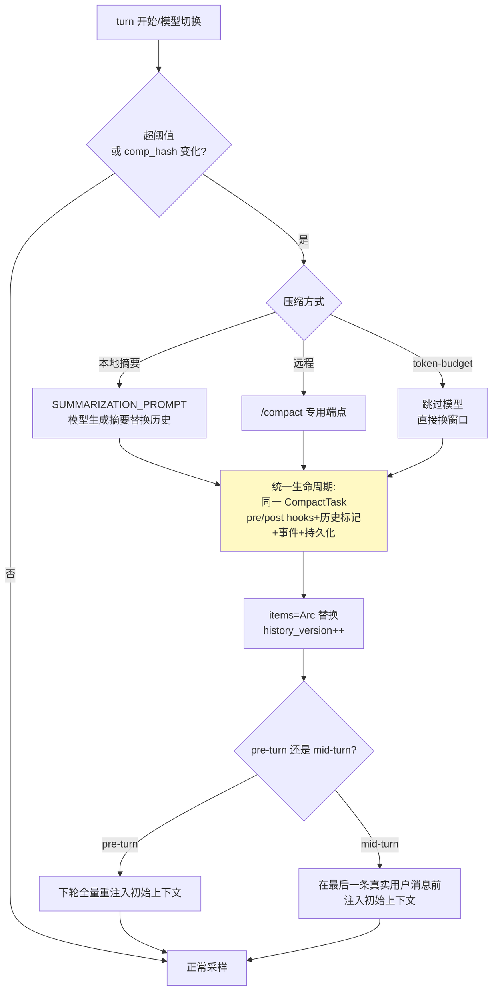

# 02-Codex 上下文压缩与持久化恢复：版本号历史 / 三路径压缩 / JSONL 回放

> **定位**：解析 codex 的上下文管理（版本号化历史、三条压缩路径、pre/mid-turn 重注入、世界状态差异注入）与持久化恢复（append-only JSONL、投影方法族、TurnContext 快照）。读者画像：要解决"长会话上下文爆炸"与"崩溃恢复"的 Java 架构师。锚点：[教程 08-架构师进阶/00-上下文工程]、[教程 08-架构师进阶/06-长任务持久化与中断恢复]、[教程 04-企业级架构主干/05-历史记录持久化与合规]。行号基于分析时版本。

---

## 一、ContextManager：版本号化的不可变历史

`core/src/context_manager/history.rs:48`，四个字段一个思想：

| 字段 | 作用 |
|------|------|
| `items: Arc<Vec<ResponseItemEnvelope>>` | 只读消费者**零拷贝**共享；压缩/回滚 = 整体替换 Arc |
| `history_version: u64` | 每次重写递增——持有旧快照的读者可检测失效 |
| `token_info` | 服务器上报的真实 token 用量 |
| `world_state_baseline` | 差异注入基线（见 §四） |

**为什么不用可变 List**：可变历史要处理"读者读到一半被改"的并发地狱；`Arc` 整体替换 + 版本号让读路径零锁零拷贝、写路径天生原子（对照 [教程 02-SpringAI核心机制/02-Agent状态管理] 的快照思想）。

**token 计数混合策略**：字节启发式估算只做**粗下界与预警**（`history.rs:247`）；截断/压缩决策用服务器上报值（`history.rs:415`，并区分服务器是否已把历史 reasoning tokens 计入）。工具输出按 `TruncationPolicy` 截断（32KB/输出预算）。

## 二、压缩触发与三路径

触发两类（`session/turn.rs:1080` 附近）：① token 超阈值（scope 分 Total 与 BodyAfterPrefix——扣除系统前缀后的正文）② **模型切换**（`comp_hash` 变化——不同模型上下文格式不兼容，必须重压）。窗口编号推进供遥测（"这是第几次压缩"）。

**两条最容易被忽略的纪律**：
1. **压缩策略可插拔、生命周期统一**：三条路径全走同一 `CompactTask`（SessionTask 之一），前端/持久化/事件零感知差异——加算法不动框架；
2. **mid-turn 压缩的重注入位置**：模型被训练为"摘要是历史末项"，因此初始上下文（环境信息/AGENTS.md）必须注入在**最后一条真实用户消息之前**——不懂这条，压缩后模型行为明显劣化。

## 三、持久化：append-only JSONL + 投影方法族

rollout 文件的恢复入口是一个枚举方法族（`08 篇`结论）：

| 设计 | 含义 |
|------|------|
| **append-only JSONL，每行自完整** | 崩溃恢复的最简正确格式——损坏最多丢尾行，无级联解析失败 |
| **后台单写者 + pending 确认后才移除 + 幂等 persist** | 写入可靠性三件套 |
| **恢复入口=投影方法族枚举** | 重放规则是纯函数（New/Cleared/Resumed/Forked 四种 InitialHistory），恢复逻辑可单测 |
| **TurnContext 作为 durable baseline** | 每 turn + 每次压缩后落一次配置快照 |
| **Fork 继承源格式而非目标默认** | "看起来可以随便选"的地方恰是 bug 高发区 |

## 四、世界状态差异注入：控制膨胀的核心

`context/world_state.rs` 快照动态状态（时间/cwd/git 状态），ContextManager 记录上次注入 baseline，每轮比较：无变化不注入、有变化只注入 **diff**（RFC7386 patch 持久化 + 增量渲染）。与静态指令（AGENTS.md 层级发现、一次注入）配合成完整纪律：

> **静态一次注入，动态最小化重注入**——这一句就是上下文工程的预算哲学（对照 [教程 08-架构师进阶/00-上下文工程] 的五层拼接与 Token 预算分配）。

## 五、Prompt 组装的确定顺序

（`09 篇`结论）初始上下文束有固定顺序：developer 聚合 → 独立 developer → user contextual → 用户输入。系统提示**顶层每轮重发**，环境/指令以带标记 user 消息入 history——两者缓存语义与演化方式完全不同，不可混。流处理用"按 item_id 的解析器表 + FuturesOrdered 工具回收"聚合乱序增量；turn 计时分桶（六相位+TTFT）为性能归因提供标准词汇表。

## 六、转译到 Spring AI / Java 生态

| codex 机制 | Java/Spring AI 对应 | 转译要点 |
|-----------|--------------------|---------| 
| `Arc<Vec>`+版本号 | `record HistorySnapshot(List<Item> items, long version)` + `AtomicReference<HistorySnapshot>` | 读零拷贝（不可变 record 共享）、写 CAS 替换；读者比对 version 检测失效 |
| 三路径压缩统一生命周期 | `interface CompactionStrategy { Mono<Compacted> compact(ctx); }` + 统一 `CompactTask` 包装（事件/落盘/hooks 不因算法不同而分叉） | 本地摘要=ChatClient 摘要调用；token-budget=直接裁剪最旧工具输出；远程端点=模型供应商特有 |
| pre/mid-turn 注入位置 | 压缩后重注入初始上下文时：turn 间隙→下轮头部；turn 中→插在最后 user 消息前 | 纯插入顺序问题，Spring AI 侧自组 Prompt 即可实现 |
| world_state diff | 自研 `WorldStateSnapshot`（时间/cwd/git）+ baseline 比较，变化才生成增量 user 消息 | 与 [教程 08-架构师进阶/00-上下文工程] 五层拼接的第二层（环境层）对应 |
| JSONL rollout | 事件溯源式追加日志（对照项目板块事件溯源篇的方法论）；Jackson 每行一 JSON；恢复=按 InitialHistory 类型重放 | 幂等写入：`(id, replay)` 唯一约束或去重表 |
| token 服务器优先 | `Usage.getPromptTokens()/getTotalTokens()`（已实证方法名）做决策；本地估算只做预警 | [教程 03-React前端与AgenticUI/03-Agentic-UI设计] 同口径 |

## 七、检验方式

- 压缩 PoC：三策略任选两实现，前端事件流验证无差异；
- 恢复演练：写一半 kill -9，重启重放 JSONL——只丢尾行、状态一致；
- 差异注入：同 cwd 连续三轮，验证第 2/3 轮无环境重注入（token 计数不涨）。

**下一篇**：[03-模型客户端-协议层与进阶机制](03-模型客户端-协议层与进阶机制.md)。
