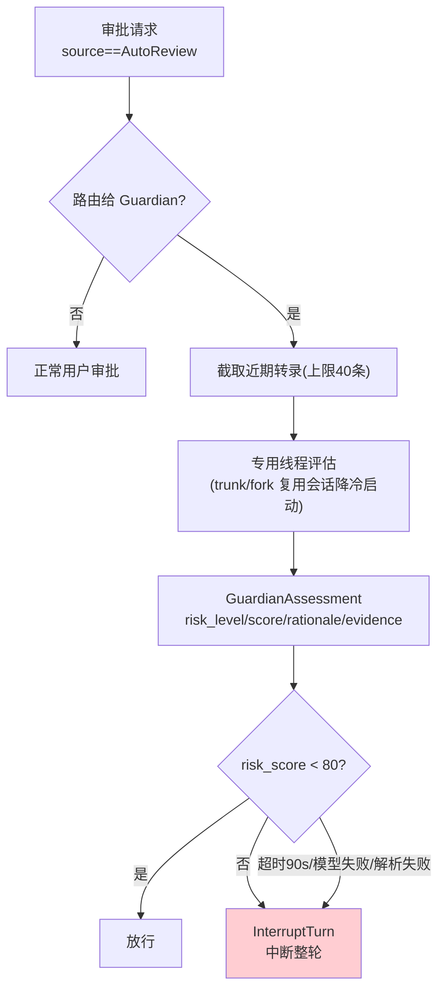

# 03-Codex 模型客户端、协议层与进阶机制：双层客户端 / 投影层 / Guardian / Code Mode

> **定位**：解析 codex 的模型客户端（双层/重试状态机/多 provider）、前端协议（方法枚举/版本化/投影层）、以及四个进阶机制——Guardian 自动审阅、Code Mode、shell 快照、托管 MITM 网络。读者画像：要构建多前端 Agent 平台与"AI 审 AI"能力的 Java 架构师。锚点：[教程 04-企业级架构主干/12-模型路由与降级]、[教程 08-架构师进阶/10-多模型协作与供应策略]、[教程 04-企业级架构主干/11-安全与权限控制]。行号基于分析时版本。

---

## 一、模型客户端：双层 + 集中重试

| 层 | 持有状态 | 职责 |
|----|---------|------|
| 连接级 | auth、降级决策**粘性持有** | 会话生命周期内一致的连接选择 |
| 请求级 | 参数显式传递 | 每次请求的 model/温度/工具集 |

**重试集中在一个状态机**（`responses_retry.rs`）：指数退避 5s 起、上限 60s、**按请求类别区分**（流式采样 vs 工具回填 vs 压缩，容忍度不同）。多 provider 用 `WireApi` 枚举区分线协议，内置 provider 表与用户配置合并（`model-provider-info/` crate）。

> 对照 [教程 04-企业级架构主干/12-模型路由与降级]：降级粘性是关键——同一会话中途在 provider 间抖动会导致上下文格式不兼容（呼应 02 篇"模型切换触发压缩"）。

## 二、前端协议：方法枚举 + 版本化 + 投影层

app-server 协议（`app-server-protocol/src/rpc.rs`）：**非严格 JSON-RPC** + 以 thread 为中心的方法枚举 + v1/v2 版本化 + 按域拆 request processors。最重要的设计是**投影层**：内部 rollout（完整历史）≠ 前端视图（按需投影）——多前端（TUI/IDE/Web）复用一个后端进程，各自消费不同投影。

## 三、Guardian：AI 审 AI 的标准形态

strict auto-review 四步法（`core/src/guardian/`）：**转录截取 → 模型评估 → 结构化裁决 → 回接审批**。

五条纪律：**fail-closed 状态机**（一切异常落"不批准"）；**拒绝即中断整轮**（防模型换个写法重试同一危险操作）；trunk/fork 会话复用；`is_guardian_reviewer_source` 防审阅者套娃；Guardian 自身工具面裁剪为 `exec_command/write_stdin/view_image` 且强制 Managed 权限——**自动审阅者 = 受限子会话**，这套组合可搬到任何"AI 审 AI"场景（红队/代码评审/内容审核）。

## 四、Code Mode：工具调用可以不是 JSON 表单

模型侧工具是**语法而非函数定义**：`ToolSpec::Freeform` 的 lark 语法允许模型在自由文本代码里内嵌 `// @exec:` 指令调用工具——复杂编排能力上一个台阶。执行回路：模型 exec(代码) → V8 runtime 执行 cell → 代码内 `call_nested_tool` 走**正常审批/沙箱管线** → 结果回注 → 模型用 `wait(cell_id, yield_time_ms)` 轮询续取。

**`cell + wait/yield` 是通用"长任务让出"协议**——与 PTY 会话的 yield 协议同构（01 篇）：执行单元主动让出、调用方增量轮询、双方都可终止。

## 五、Shell 快照与环境净化

- **shell snapshot**（`shell_snapshot.rs`）：login-shell 子进程导出 aliases/functions/exports 落盘，工具执行前读取——解决"模型看到的 shell 与用户 login shell 不一致"；验证用 `set -e; . file`，3 天清理陈旧项。
- **环境构造六步算法**（`protocol/src/shell_environment.rs::populate_env`）：继承基集（PATH 首位）→ 默认排除 `*KEY*/*SECRET*/*TOKEN*` → 自定义排除 → set 覆盖 → include_only 白名单收窄 → 注入会话标记。**子进程 env 的标准净化顺序**——Java 侧 `ProcessBuilder.environment()` 同样适用。

## 六、托管 MITM 网络：安全清单

沙箱内进程流量经 NetworkProxy（本地根 CA + 按主机临时签叶证书）：**SNI 预判 → 明文 Host 复核 → 证书一致性 → DNS rebinding 二次校验（解析结果须与策略时一致）→ 头剥除/注入 → 方法钳制（仅 GET/HEAD/OPTIONS）→ 拒绝全记审计**。做网络代理类安全组件的直接 checklist。

## 七、转译到 Spring AI / Java 生态

| codex 机制 | Java/Spring AI 对应 | 转译要点 |
|-----------|--------------------|---------| 
| 双层客户端 | ChatClient（请求级，已实证）+ 自研 ProviderSession（连接级粘性：auth/降级记忆） | 降级后同会话锁定该 provider，切换时触发压缩（02 篇） |
| 集中重试状态机 | `Retry.backoff(...)` + 按请求类别 filter（采样/工具/压缩不同策略） | [教程 08-架构师进阶/08-响应式错误处理] retryWhen 的分类版 |
| 方法枚举+投影层 | WebSocket 消息 sealed interface（Op/Event，[教程 03-React前端与AgenticUI/04-流式工具调用与事件协议] 同构）+ 前端视图服务（内部全量事件 → 各前端投影） | 多端复用一个会话后端 |
| Guardian | 受限子 ChatClient（裁剪工具集 + 独立 System Prompt + 结构化输出 entity() 裁决 record）+ fail-closed 包装 + 拒绝即中断 | 「AI 审 AI」四件套：受限面/结构化裁决/fail-closed/整轮中断 |
| Code Mode | Java 侧不引 V8：等价形态=工作流 DSL/表达式引擎工具；`wait/yield` 协议映射 SSE 增量事件 | cell 思想可用于"Agent 写脚本批调工具"场景 |
| 环境六步 | `ProcessBuilder.environment()` 按同序净化；密钥默认排除表 | 沙箱类工具必备 |

## 八、检验方式

- Guardian PoC：用结构化输出（已实证 `entity(Class, spec)`）实现 `GuardianAssessment` record，注入超时与坏 JSON 验证 fail-closed；
- 投影层：同一会话事件流，TUI 投影（紧凑）与 Web 投影（全量）各自消费测试。

**下一篇**：[04-Java工程师借鉴手册](04-Java工程师借鉴手册.md)。

## 设计哲学与适用边界

**为什么这样设计**：

1. **降级粘性**：会话中途换 provider 会导致上下文格式不兼容（02 篇：comp_hash 变化必须重压）——连接级层宁可粘性锁定次优 provider，也不拿会话一致性换单次请求最优。这是"会话正确性 > 局部最优"在供应策略上的落点。
2. **Guardian fail-closed**：自动审阅者自己也会失败（超时 90s/模型失败/解析失败），异常路径全部落"不批准"并 InterruptTurn 中断整轮——失败被当作未知风险而非放行理由；拒绝即中断整轮，同时堵死"换个写法重试同一危险操作"。
3. **投影层**：内部 rollout 全量历史 ≠ 前端视图——多前端复用一个后端的前提是各端各自投影，完整状态永不直接暴露给宿主。
4. **Guardian = 受限子会话**：`is_guardian_reviewer_source` 防审阅者套娃 + 工具面裁剪为三工具 + 强制 Managed 权限——"AI 审 AI"不是多调一次模型，而是**造一个权限更小的 Agent**。

**好处**：重试集中一个状态机、按请求类别（采样/工具回填/压缩）分别调容忍度；Guardian 四件套可整体搬到红队/代码评审/内容审核；`cell + wait/yield` 与 PTY 增量轮询同构。

**代价**：粘性降级可能长期锁定次优模型，需运维侧补偿（监控降级原因）；Guardian 每次审批多付一次模型调用的延迟与成本；Code Mode 依赖 V8 runtime，Java 生态落地成本高。

**适用边界**：多模型/多 provider 供应策略、多前端（IDE/Web/TUI）平台——必学；Guardian 只在危险操作审批量大、人工审核成本高的场景才值得上（审批量小直接人工）；单模型单前端的内部工具可省投影层与双层客户端，但环境净化六步（`*KEY*/*SECRET*/*TOKEN*` 默认排除）在一切 spawn 子进程的工具里都是底线。
