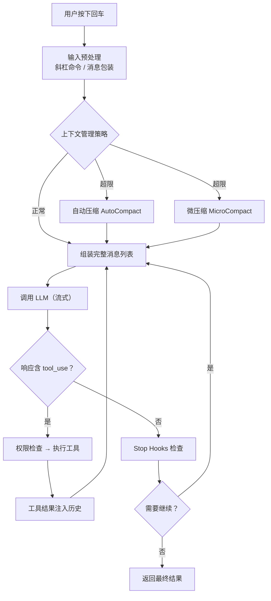
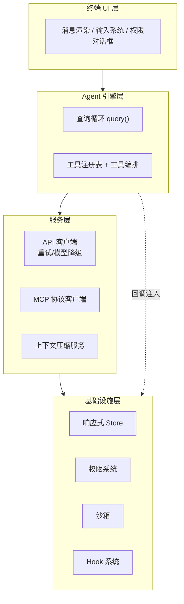
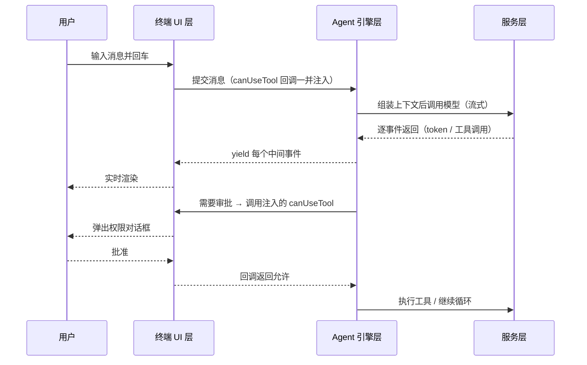
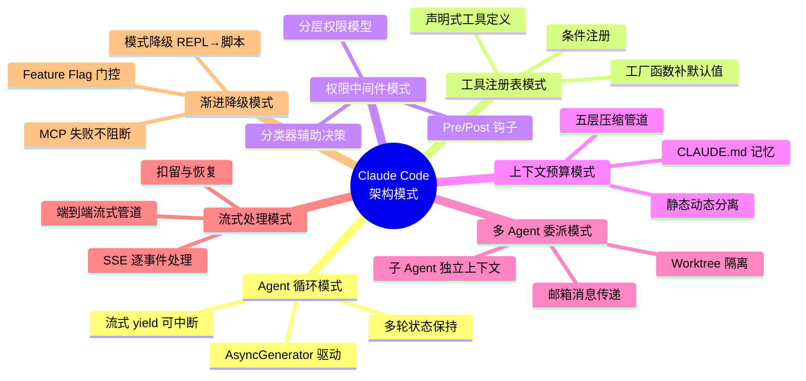

# 00-总览与架构全景

> **定位**：本篇是《Claude Code 源码架构》系列的第一篇，基于对 Claude Code（Anthropic 官方终端 AI Agent）源码的 45 章深度分析整理而成。本篇回答三个问题：一次用户请求如何流过整个系统（请求旅程）、系统如何分层（四层架构）、哪些设计原则贯穿始终（七原则 + 技术选型权衡）。读者画像：刚开始学习 Agent 架构的 Java 工程师——所有概念都会从零讲起，并在每节末尾给出与 Spring AI 生态的对照。前置阅读：无（本篇即入口）。想看每个子系统的细节，请按 01-08 篇顺序深入；想直接看 Java 落地，跳到 10-Java工程师借鉴手册。

## 0.1 为什么要研究 Claude Code

Claude Code 是目前工业界被验证最充分的终端 AI Agent 之一：它每天处理数百万次 Agent 交互，具备执行 Shell 命令、读写文件、搜索代码、调用外部工具（MCP）、多 Agent 协作等全部核心能力。**它的价值不在于功能多，而在于它把一个"会思考但不稳定的 LLM"包进了确定性的工程边界里**——这正是 Java Agent 架构师最需要学习的能力：不是写更好的提示词，而是设计让模型可靠工作的系统结构。

学习本系列的正确姿势：每篇先看"它解决了什么问题"，再看"它怎么解决"，最后问自己"Spring AI / Java 里怎么做同样的事"。

## 0.2 一次请求的完整旅程

理解复杂系统最好的方式，是追踪一条消息流过全程。用户在终端按下回车后：

1. **输入预处理**：解析斜杠命令（`/compact`、`/clear` 等本地命令不经过 LLM，直接处理），把普通文本包装成结构化的用户消息对象。
2. **上下文组装**：把系统提示词（分静态/动态两层）、对话历史、工具结果、CLAUDE.md 记忆、Git 状态快照等拼装成完整的请求上下文。
3. **上下文管理管道**：发送前执行五层压缩检查（工具结果预算 → 历史裁剪 → 微压缩 → 上下文折叠 → 自动压缩），确保不超 token 上限。
4. **API 调用**：流式调用 LLM，逐 token 接收响应。
5. **工具调用检测与执行**：响应中的 `tool_use` 块被实时检测；只读工具在流式接收的同时就开始执行（流水线化）；写操作串行执行。
6. **结果回传循环**：工具结果注入对话历史，再次调用 LLM，直到模型不再请求工具（自然终止）或触发轮次/预算/中断等终止条件。
7. **渲染**：每个中间事件实时推给 UI 层渲染，用户全程看到流式输出。

**给初学者的关键洞察**：这个循环（调 LLM → 执行工具 → 结果回传 → 再调 LLM）就是所谓 **Agentic Loop（Agent 循环）**，是所有 Agent 系统的心脏。Spring AI 中的对应物是 `ToolCallingManager` 驱动的工具执行循环——概念完全一致。想深入循环内部，见 01 篇。

## 0.3 四层架构

Claude Code 的代码分为四层，依赖方向严格自上而下：

| 层次 | 职责 | 关键组件 |
|------|------|----------|
| 终端 UI 层 | 渲染与用户交互，**不含业务逻辑** | React/Ink 定制渲染引擎、消息组件、权限对话框 |
| Agent 引擎层 | AI 推理编排 | 查询循环（AsyncGenerator）、工具注册表（30+ 工具）、工具编排器 |
| 服务层 | 外部系统交互 | API 客户端（重试/降级）、MCP 协议客户端、上下文压缩服务 |
| 基础设施层 | 通用基础能力 | 极简响应式 Store（34 行）、权限系统、沙箱、Hook 系统 |

为什么这样分？三个理由：

1. **UI 与引擎分离**：引擎可以在无 UI 模式下运行（脚本调用、SDK 嵌入），UI 也可以独立演进。
2. **引擎与服务分离**：查询循环只关心"调模型/执行工具/压缩上下文"这些抽象操作，不关心 API 的认证方式和传输协议——将来换模型供应商只需替换服务层。
3. **基础设施横向复用**：状态、权限、沙箱是所有上层都需要的通用能力，放最底层避免重复。

**转译到 Spring**：这四层在 Spring 微服务架构里天然对应——UI 层≈SSE 推送的前端/网关，引擎层≈Agent 服务（ChatClient + 编排），服务层≈LLM 网关/检索服务/MCP 网关等独立微服务，基础设施层≈配置中心、权限服务、沙箱执行环境。这正是 CLAUDE.md 中「管控分离」架构的雏形：Claude Code 的权限系统、Hook 系统、Feature Flag 本质上就是一个进程内的 Control Plane。

## 0.4 七条核心设计原则

这七条原则不是文档里的口号，而是每一个函数、每一个数据结构里都能找到对应实现的行为准则：

| 原则 | 一句话 | 源码中最典型的体现 |
|------|--------|-------------------|
| 流式优先 | 数据产生后立即传递，不攒批 | 查询循环用 AsyncGenerator，每个事件立即 yield |
| 默认隔离 | 副作用操作默认在沙箱中执行 | 沙箱运行时、`--dangerously-skip-permissions` 只允许在无网络的容器内使用 |
| 权限最小化 | 只授予完成操作所需的最小权限 | 多层权限决策引擎、deny 规则最先检查且不可覆盖 |
| 渐进增强 | 基础功能可用，高级能力按需加载 | Feature Flag 编译期门控、工具条件注册 |
| 用户始终可控 | 用户可随时中断和覆盖 | AbortController 级联中断、权限对话框、Hook 系统 |
| 优雅降级 | 静默恢复优先，错误展示兜底 | Token 超限分层恢复、模型自动降级、压缩失败熔断 |
| 可观测性 | 重要行为都产生可追踪记录 | 全生命周期遥测事件、启动/查询性能探针 |

七条原则之间存在张力（例如"流式优先"要求立即转发，而"优雅降级"要求先扣留错误等待恢复），Claude Code 的解法是"**扣留（withhold）机制**"：可恢复的错误事件不立即 yield 给消费者，先尝试自动恢复，恢复失败才释放。张力不是缺陷，而是设计边界——好的架构是在张力中找到平衡点，而非消除张力。

**转译到 Spring AI**：这些原则可以直接映射——流式优先≈`Flux<ChatResponse>` 全链路响应式（见 [教程 01-WebFlux与响应式编程]）；可观测性≈Observation 体系（见 [教程 05-Observation可观测]）；优雅降级≈模型路由与降级（见 [教程 08-架构师进阶] 相关篇）；用户可控≈HITL 审批（见 [教程 09-前沿专题] 及项目 06 金融风控的落地）。

## 0.5 技术选型与权衡

Claude Code 的选型表本身就是一堂"选型即取舍"的课：

| 选了什么 | 为什么 | 放弃了什么 |
|----------|--------|-----------|
| TypeScript | 官方 SDK 原生支持、类型驱动接口设计、迭代快 | Go 的原生并发与单二进制分发 |
| React + Ink（终端版 React） | 声明式 UI 管理复杂状态；深度 fork 加了选择/搜索/点击能力 | 命令式终端渲染的可控性 |
| Bun 运行时 | 启动快数倍；`feature()` 编译期条件消除死代码 | Node.js 的生态成熟度 |
| 自研 34 行 Store | 简单、零依赖、完全可控 | Redux 的 DevTools 与中间件生态 |
| Commander.js | 数十个 CLI 选项与子命令的复杂度管理 | 手写解析的"轻" |

给初学者的方法论启示：**没有"最好"的选型，只有互相加强的技术栈组合**。TypeScript 的类型系统支撑了工具接口的声明式设计；Bun 的 `feature()` 支撑了渐进发布；34 行 Store 之所以够用，是因为终端 UI 的重渲染成本模型和浏览器不同。选型要回到自己的约束（团队、部署形态、变更频率）做判断。

**Java 侧对照**：Java 生态里这些角色的对应物——类型驱动接口≈接口 + `record` 定义工具契约（Spring AI 的 `@Tool`/`@ToolParam` 正是声明式工具定义）；编译期门控≈Maven Profile / `@ConditionalOnProperty`；自研 Store≈Spring 的 `ApplicationEventPublisher` + 状态 Bean。Java 工程师不需要 envy Bun 的启动速度，但应该学习它"编译期消除死代码"的思路：未启用的功能连 Bean 都不注册。

## 0.6 层间通信的三种模式

四层之间不是只有"调用"，Claude Code 用了三种不同的通信模式，各自解决不同方向的依赖问题：

1. **生成器管道（引擎 → UI）**：查询循环 yield 事件、UI 在自己的节奏消费——推拉混合，UI 慢时生产者自动暂停（背压）。
2. **回调注入（UI → 引擎）**：引擎需要与用户交互时（如权限确认），UI 层把"怎么问用户"作为回调函数（`canUseTool`）传进来。引擎不需要知道 UI 的存在，只调用函数并等待结果——**依赖倒置**让引擎可独立测试。
3. **Store 订阅（基础设施 → UI）**：状态变化通过发布-订阅驱动组件重渲染。

给初学者的判断口诀：**数据往外流用生成器，请求往里调用用回调注入，状态广播用订阅**。三种模式在 Spring 技术栈里分别对应 `Flux` 推流、接口回调/SseEmitter、事件监听（`ApplicationEvent`）。

## 0.7 给初学者的三个常见误区

结合本篇的全景认知，提前排掉三个学习 Agent 架构时最常见的误区：

1. **"Agent = 提示词 + 一堆工具"**。错。提示词和工具只是输入，真正决定质量的是循环的终止条件、上下文的预算管理、权限的边界设计——这些"看不见的工程"才是工业级与玩具级的分水岭。
2. **"先跑起来再补安全"**。Claude Code 的经验恰恰相反：权限系统、沙箱、信任链从第一版就是架构的一部分，事后补安全等于重写。Java 侧落地时至少先做三件事：deny 预过滤工具池、写操作审批门、权限元数据不可被 Agent 修改。
3. **"上下文窗口很大，不用管"**。200K 甚至 1M 窗口在多轮工具调用的消耗速度下远比想象中小，且成本与延迟随上下文线性增长。预算管理（02 篇）要从第一个版本就设计。

## 0.8 设计模式全景（预告）

系列后面各篇会展开的七大架构模式，这里先给全景认知：

## 0.9 本篇小结与阅读地图

- **一次请求旅程** = 输入预处理 → 上下文组装 → 压缩管道 → 流式调用 → 工具执行 → 结果回传循环。这个循环是一切的核心。
- **四层架构** = UI / 引擎 / 服务 / 基础设施，严格单向依赖，UI 层零业务逻辑。
- **七原则**是判断"这个设计好不好"的标尺，后续每一篇都能看到它们的影子。
- **选型的本质是取舍**，组合的一致性比单项最优更重要。

后续阅读建议：初学者按 01 → 02 → 03 → 04 → 05 顺序读核心主线（循环 → 上下文 → 提示词 → 工具 → 安全）；06-08 是进阶主题（多 Agent、状态与扩展性、韧性成本）；09 是哲学总结，10 是 Java 落地手册。
