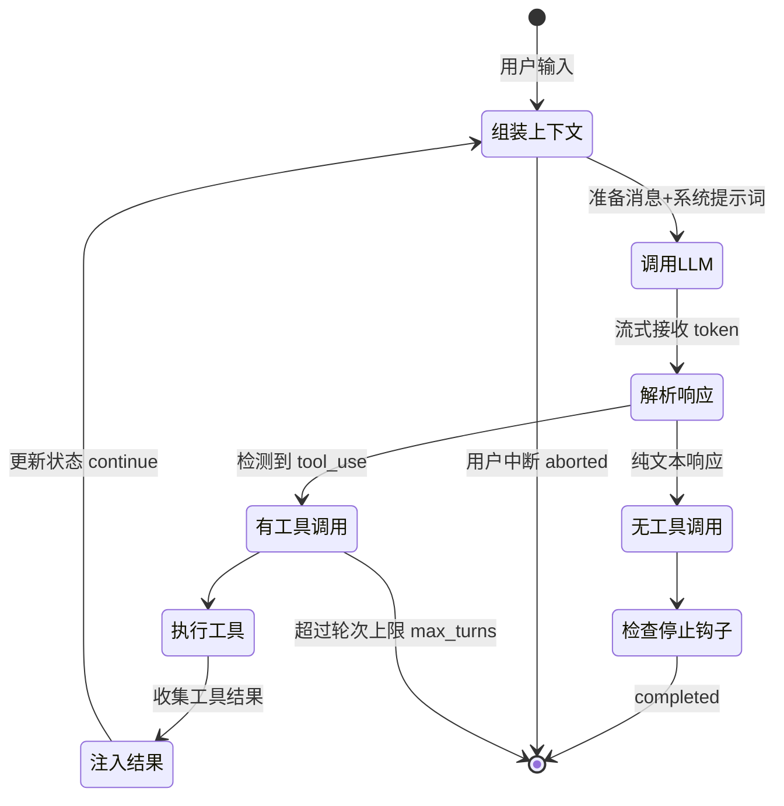
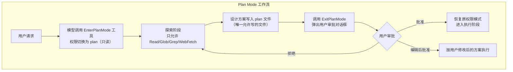

# 01-Agent引擎与核心循环

> **定位**：本篇拆解 Claude Code Agent 引擎的三大核心：Agentic Loop（循环本体与状态机、终止条件、中断机制）、流式响应架构（含扣留机制、背压、错误恢复）、工具调度与并发执行（含动态安全判定、Plan Mode 思考/行动分离、QueryEngine 编排层）。读者画像：已读完 00 篇的初学者。前置阅读：[00-总览与架构全景]。Java 对照以 Spring AI 2.0 的 ChatClient / ToolCallingManager 体系展开。

## 1.1 Agentic Loop：Agent 的心脏

Agent 的本质不是 LLM 调用，而是**一个循环**：接收消息 → 调 LLM → 解析响应 → 执行工具 → 结果注入上下文 → 再调 LLM，直到模型认为任务完成。每次迭代称为一个 **turn（轮次）**，复杂任务可能需要 10-50 个 turn。

Claude Code 用 **AsyncGenerator（异步生成器）** 实现这个循环，这是一个值得记住的架构选择。传统设计返回一个 Promise 的问题：用户在整个 turn 期间（可能 30 秒到几分钟）面对空白屏幕。生成器通过 `yield` 解决了三个问题：

1. **流式传输**：每收到一个事件立即 yield，UI 实时渲染。
2. **状态保持**：生成器闭包天然保留消息历史、工具上下文等跨迭代状态。
3. **可中断性**：调用者可通过生成器的 `.return()` 中断，取消信号传播到 API 调用和工具执行。

另一个隐藏收益是**天然背压**：消费者处理不过来时生成器自动暂停，不会内存溢出。

循环状态机：



**循环状态的设计启示**：Claude Code 不用零散的 boolean 标志追踪循环状态，而是一个结构化 `State` 对象，其中 `transition` 字段记录**上一次 continue 的原因**——这不是调试信息，而是逻辑门控。例如上次尝试过"上下文折叠恢复"仍失败，这次就不再走同一路径，避免无限重试。给初学者：任何多轮循环的状态机，都要给"继续"这个动作带上原因标签。

### 五个终止路径

| 终止原因 | 触发条件 | 语义 |
|----------|----------|------|
| completed | 模型输出纯文本、无工具调用 | 自然完成 |
| max_turns | 达到调用方设置的轮次上限 | 防失控 |
| aborted | 用户 Ctrl+C / 发送新消息 | 人为中断 |
| max_budget | 累计美元花费超过预算上限 | 经济护栏 |
| error / blocking_limit | 模型错误、上下文超硬上限 | 异常终止 |

每个 Agent 循环都必须有**全部五类终止路径**——缺了 max_turns 或预算上限的循环，就是生产事故的温床。这与 [教程 08-架构师进阶] 中"长任务预算控制（最大轮次/Token/时长）"的结论完全一致。

### 中断机制的三个层次

中断不是"杀进程"，而是三层精细设计：

1. **AbortController 级联**：父控制器中断 → 所有子控制器（每个工具执行一个）被中断；中断子控制器不影响父。还有"兄弟控制器"——一个 Bash 工具出错时取消兄弟工具，但整个查询继续。
2. **合成错误消息**：API 要求每个 `tool_use` 必须有配对的 `tool_result`。中断时系统为所有未完成的工具调用生成合成的错误 `tool_result`（"被用户中断"），否则下次调用 API 会报错。这是初学者最容易踩的坑：**消息配对完整性是 API 的硬不变量**。
3. **优雅 vs 强制**：用户"发新消息"导致的中断与"按 Esc"的中断语义不同——前者不需要额外的"被中断"占位消息，因为新消息本身提供了上下文。

**Java 转译**：Reactor 里对应 `Flux` 的取消传播——下游取消（`dispose()`）会沿订阅链向上传播并触发 `doOnCancel` 清理。实现 Spring AI 的自定义 `ToolCallingManager` 装饰器时，要在取消路径上为已发出的 tool call 补齐"取消态"结果，否则会话记录会出现孤儿 tool_use。（概念代码，需按实际 ToolExecutionResult 结构实证后落地。）

## 1.2 流式响应架构

### 为什么流式是架构约束而非性能优化

一个 Agent turn 可持续 5 秒到 5 分钟，且**工具调用嵌在流式响应里**——必须实时检测 `tool_use` 块的出现，才能在模型仍在输出时就并行执行工具。Claude Code 的关键决策：**在每个 content block 完成时（而非整条消息完成时）yield**。这使工具执行与模型输出并行——模型输出 5 个工具调用、每个执行 10 秒的场景，传统"收完再执行"需要 50 秒，流式流水线只需约 10 秒。

```mermaid
sequenceDiagram
    participant API as LLM API
    participant Loop as 查询循环
    participant Exe as 流式工具执行器
    API->>Loop: 流式事件: text block
    API->>Loop: 流式事件: tool_use block 1 完成
    Loop->>Exe: addTool(Read) → 立即开始执行
    API->>Loop: 流式事件: tool_use block 2 完成
    Loop->>Exe: addTool(Grep) → 与 Read 并行执行
    Exe-->>Loop: 轮询到 Read 已完成 → yield 结果
    API->>Loop: 消息结束
    Exe-->>Loop: 等待剩余工具完成 → yield Grep 结果
```

### 扣留（Withhold）机制

不是所有流式数据都该立刻到达消费者。当出现**可恢复错误**（输出 token 超限、上下文过长 413、媒体过大）时，错误消息被"扣留"——推入内部数组但不 yield 给消费者，先尝试自动恢复：

- **输出超限**：第一次重试时把输出上限从 8K 静默升到 64K（零成本）；仍不够则注入一条元消息"从断点直接继续，不要道歉不要回顾"，最多恢复 3 次。
- **上下文过长**：先尝试上下文折叠排水（便宜、保留粒度），不够再做响应式压缩（贵、生成完整摘要），全失败才释放错误给用户。

给初学者的设计原则：**大多数错误是暂时性的**。Token 超限可以通过扩容/压缩解决（暂时性，静默恢复）；认证失败重试无意义（永久性，直接暴露）。区分二者，是"能用"和"好用"的分界线。

### 模型回退时的流式清理

流式系统不能回滚已发出的数据。当主模型过载需切换备用模型时：已 yield 的消息发送 **tombstone（墓碑）标记**，通知消费者"从 UI 和记录中移除这条"；正在执行的工具被 `discard()` 丢弃并重建执行器，防止旧请求的 tool_use_id 泄漏到重试；同时必须**剥离 thinking 块签名**——不同模型的思考块加密签名不兼容，混用会被 API 拒绝。

### 依赖注入：可测试性的保障

查询循环不直接调用 API，而是通过一个仅含 4 个函数的极窄依赖接口（`callModel`、`microcompact`、`autocompact`、`uuid`）注入实现。测试直接注入模拟实现，不需要 mock 网络。**依赖注入的接口越窄，测试越稳**——这是 Agent 引擎这种最复杂逻辑保持可测试的关键。

**Java 转译**：Spring 的 DI 天然支持这个模式——把"调用模型"抽象为接口 Bean（`ChatModel` 就是这么做的），把"压缩"抽象为策略 Bean，循环逻辑只依赖接口。Spring AI 的 `ChatClient` + `Advisor` 链本身就是"循环逻辑与横切关注点分离"的实现：`CallAdvisorChain` 让压缩、记忆、RAG 都以装饰器方式挂在调用路径上，而不侵入循环本体。

## 1.3 工具调度与并发执行

### 动态安全判定：isConcurrencySafe

核心问题：模型同时请求读三个文件、搜一个模式、跑一个命令，怎么办？答案：**不是所有工具都该并发，但能并发的必须并发**。每个工具声明 `isConcurrencySafe(input)` 方法，安全性是**工具 + 输入级别的动态判定**——`Bash(ls)` 安全，`Bash(rm -rf)` 不安全。默认值是 **false（不安全）**：新工具忘记声明时系统按最保守方式对待（fail-closed）。

并发控制三规则：

1. 没有工具在执行 → 任何工具可启动。
2. 当前执行的都是并发安全工具 → 新的安全工具可并行。
3. 有任何非安全工具在执行，或新工具不安全 → 排队等待。

**并发执行 + 有序输出**是核心矛盾：执行可以乱序，但结果必须按添加顺序 yield（API 要求 tool_result 与 tool_use 顺序一致）。实现：按顺序遍历工具，遇到未完成的**非安全工具**就停止输出——因为非安全工具可能通过 `contextModifier` 修改全局执行上下文，其结果可能影响后续工具的行为。

错误级联策略也是分工具类型的：**Bash 错误级联取消兄弟**（shell 命令常有隐式依赖，`mkdir` 失败后 `cp` 无意义）；**Read/Grep 错误只隔离自身**（相互独立）。给初学者：并发系统的错误策略不能一刀切，要问"后续操作是否依赖前一步的副作用"。

### Plan Mode：思考与行动的分离

Plan Mode 是 Claude Code 最精妙的设计之一：**通过权限系统（而非提示词）强制分离只读探索阶段和读写执行阶段**。



三个值得记住的设计决策：

1. **进入 Plan Mode 是模型的工具调用**，不是用户强制的模式切换。进入后模型收到的不是系统提示词，而是一条 `tool_result` 反馈："彻底探索代码库理解既有模式 → 识别相似功能与架构方案 → 考虑多个方案及权衡 → 需要澄清时用提问工具 → 设计具体实现策略 → 就绪后用 ExitPlanMode 提交方案审批。记住：现在还**不要写或编辑任何文件**，这是只读的探索与规划阶段。"——把阶段指导放在工具结果里而非系统提示里，模型不会开局被指令淹没，只在真正进入该阶段时才收到详细指导，且作为对话的一部分更容易遵守。
2. **三道防护**而非一道：语义校验（不在 plan 模式直接拒绝）→ 用户确认（退出必须审批）→ UI 行为声明（非交互模式下的自动批准判定）。
3. **恢复逻辑处理边界情况**：进入前保存原模式（`prePlanMode`），退出时恢复；若原是 auto 模式但期间触发了熔断器，降级为 default 并通知用户为什么。

给初学者的深层启示：**Agent 可靠性不应是概率问题（模型足够聪明就不出错），而应是结构问题（在错误的阶段物理上做不了错误的事）**。这是从"软约束（提示词）"到"硬约束（权限系统）"的转变。Java 落地见 [教程 04-企业级架构主干] 与项目 06 金融风控的 HITL 审批——Spring AI 中可用 `ToolCallingManager` 装饰器在写操作工具前插入"审批门"，原理同构。

### QueryEngine：循环之上的编排层

`query()` 只管循环，**一次用户提交的完整生命周期**由 QueryEngine 管理：会话状态、消息持久化、成本追踪、权限审计、SDK 消息格式规范化。分工表：

| 职责 | 编排层（QueryEngine） | 循环层（query） |
|------|----------------------|----------------|
| Agent 循环 | 消费 `for await` | 实现循环 |
| 持久化 | 每条消息落盘 | 不关心持久化 |
| 成本追踪 | 累积 token 用量、检查美元预算 | 通过流式事件上报 |
| 权限审计 | 包装 `canUseTool` 记录每次拒绝 | 发起权限请求 |
| 中断 | 管理中断控制器 | 检测信号并清理 |

两个可复用的模式：

- **副本输入 + 增量回流**：循环接收消息数组的副本，每个有意义的产出同时回流到内部状态和 yield 给消费者。消费者只看到规范化后的消息。
- **包装模式添加横切关注点**：权限审计 = 在原始 `canUseTool` 外包一层记录拒绝事件的 wrapper。核心逻辑保持纯粹，编排逻辑通过包装叠加。Java 里这就是 AOP / 装饰器——Spring AI 的 Advisor 就是这个思想的框架化。

## 1.4 本篇小结

- **循环**是 Agent 的心脏：AsyncGenerator/响应式流实现"流式 + 状态保持 + 可中断"三位一体；五类终止路径一个都不能少；中断要保证消息配对完整性。
- **流式**不是优化是架构：在 content block 粒度 yield 使工具执行与模型输出并行；扣留机制让可恢复错误静默自愈；流式失败用 tombstone 而非回滚。
- **工具调度**的精髓是动态安全判定 + 并发执行/有序输出 + 分类型的错误级联。
- **Plan Mode** 证明了硬约束优于软约束：可靠性靠架构边界，不靠模型自觉。
- **循环与编排分离**让循环逻辑可在 REPL/SDK/子 Agent 三种场景复用。

下一篇 [02-上下文管理与记忆] 讲循环每次迭代"喂给模型什么"——这是 Agent 最稀缺资源的 management 艺术。
