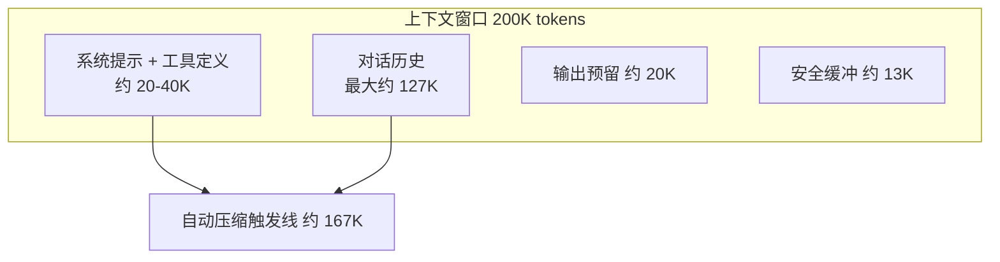
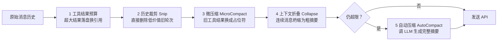
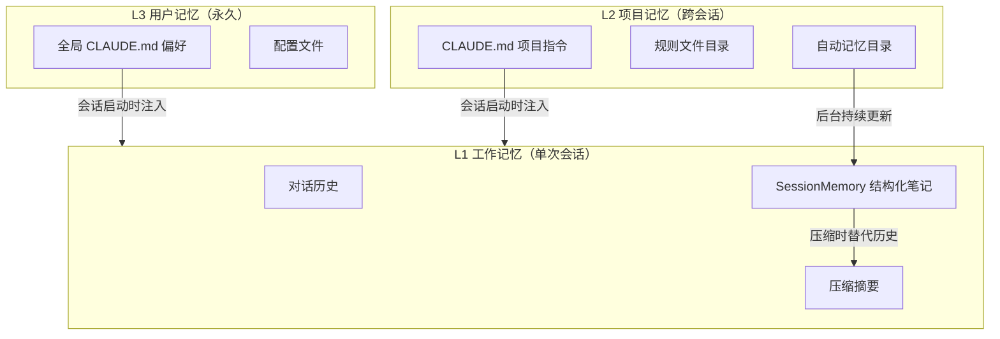

# 02-上下文管理与记忆

> **定位**：本篇讲清 Agent 最稀缺资源——上下文窗口——的完整管理体系：窗口预算怎么算、五层压缩管道如何渐进式回收 token、压缩提示词如何工程化、三层记忆架构（工作记忆/项目记忆/用户记忆）如何让 Agent 越用越聪明。读者画像：初学者。前置阅读：[00-总览与架构全景]、[01-Agent引擎与核心循环]。Java 对照落在 Spring AI 的 ChatMemory 与上下文工程实践上。

## 2.1 上下文窗口：被忽视的硬约束

LLM 的上下文窗口是有限的，而 Agent 每次调用都要往里塞四类东西：系统提示词、工具定义、对话历史、附加信息。这是一场零和博弈——系统提示词占多了，"记忆"就短；工具定义多了，工具结果就留不下。

Claude Code 以 200K token 为默认窗口，但**不能全用**：要预留约 20K 给模型输出（压缩摘要本身也需要输出空间），再减去 13K 安全缓冲（防止突然的工具输出激增），实际可用约 167K。

预算分配的核心思维：**固定成本最小化，可变成本可控化**。

- 系统提示词是**固定成本**（对话再长它也基本恒定）→ 模块化组装、静态/动态分离以利缓存、工具延迟加载（不常用的工具只出现名称，需要时才加载完整 Schema）。
- 对话历史是**可变成本**（增长最快）→ 靠五层压缩管道治理。
- 输出预留是**必要成本**，不可压缩。

**Java 转译**：Spring AI 中"输出预留"对应 `maxOutputTokens`/`maxTokens` 参数的预留思想；"工具延迟加载"对应工具池的动态组装（`ToolCallback` 按场景注选）；"静态/动态分离"直接对应 Prompt Cache 的设计——系统提示的稳定前缀越长，缓存命中越省（缓存 token 价格约为普通输入的十分之一，见 08 篇成本治理）。

## 2.2 五层压缩管道：渐进式回收

每次循环迭代发送 API 前，消息历史要经过五层处理，**顺序即正确性**：

| 层 | 手段 | 成本 | 原理 |
|----|------|------|------|
| 1 工具结果预算 | 单个工具输出超限时持久化到磁盘，上下文只留文件路径引用 | 零 LLM 调用 | 工具结果是膨胀最大来源：一次 `grep -r` 可能几十万字符，模型往往只需要前几行 |
| 2 历史裁剪 | 不生成摘要，直接删除旧的中间轮次 | 零 LLM 调用 | 多次文件搜索、逐步调试的中间过程对最终决策没有长期价值 |
| 3 微压缩 | 把**已消费**的旧工具结果替换为 `[旧工具结果内容已清除]` 占位符 | 零 LLM 调用 | 只有"一次性"工具（Read/Bash/Grep/Glob/搜索）结果可清；Edit/Write 结果含变更摘要，保留 |
| 4 上下文折叠 | 连续消息坍缩为更粗粒度摘要，比完全压缩保留更多细节 | 低 | 介于微压缩与全量压缩之间的中间档；413 错误时作为"紧急制动"先排水 |
| 5 自动压缩 | 用一个子 Agent 生成全对话的结构化摘要 | 一次 LLM 调用 | 最终防线；连续失败 3 次触发熔断停止重试 |

**设计哲学：渐进式回收**——先用最便宜的手段，不够再用更贵的。每一层都比下一层更快、更便宜、对上下文破坏更小。当系统每天处理数百万次交互时，这种分层节省的成本是巨大的。

**顺序为什么重要**（初学者必看）：工具结果预算必须先于微压缩——微压缩按 `tool_use_id` 做缓存匹配，先做内容替换会让它匹配失效；裁剪释放的 token 数要传给自动压缩的阈值计算，否则重复计算。**多个阶段修改同一份数据时，执行顺序本身就是正确性的一部分**，要用显式管道组织，不要散落在代码各处。

### 触发机制与递归防护

自动压缩的触发基于多级阈值（警告区 → 压缩区 → 危险区 → 阻塞区）。两个关键防护：

1. **递归防护**：压缩本身要调 LLM（生成摘要），如果压缩过程的 LLM 调用又触发压缩就死循环了。解法：给每次 LLM 调用标记来源（`querySource`），来源为"压缩"或"记忆提取"的调用跳过压缩检查。
2. **熔断器**：连续失败 3 次停止重试。背景数据很惊人：曾有 1279 个会话出现 50+ 次连续压缩失败（最高 3272 次），全球每天浪费约 25 万次 API 调用——熔断器是必须的。

### 压缩提示词的工程化（提示词中文翻译）

压缩摘要的提示词是严格工程化的文本，值得全文学习。首先是一段**防工具调用的前置指令**：

> **【中文翻译】关键要求：仅用纯文本回复。不要调用任何工具。
> - 不要使用读取、终端、搜索、文件编辑、写入或任何其他工具。
> - 工具调用将被拒绝，并且会浪费你唯一的一次机会。
> - 你的整个回复必须是纯文本：一个 `<analysis>` 分析块，后跟一个 `
` 摘要块。**

为什么这么"啰嗦"？源码注释解释：压缩请求会复用主对话的完整工具集（为了共享缓存前缀），而模型有时会无视末尾的弱指令尝试调用工具；把这条指令**放在最前面**并明确告知后果（拒绝+浪费轮次），才能阻止浪费。

摘要必须覆盖 **9 个标准化段落**：①用户的主要请求与意图 ②关键技术概念 ③文件与代码段 ④错误与修复 ⑤问题解决过程 ⑥所有用户消息 ⑦待办任务 ⑧当前工作 ⑨可选的下一步。结构化的输出格式保证了压缩后的信息可预测、可解析——这是"提示词即接口契约"的典范。

### 压缩后的状态恢复

压缩不仅是丢弃历史，还要**恢复关键运行时状态**，且全部受预算控制：最近访问的文件（最多 5 个、每个 ≤5K token、总预算 50K）、plan 文件、技能内容（总预算 25K）、计划模式状态、MCP 指令等。预算制防止"压缩完立刻又触发下一轮压缩"的陷阱。

还有一个巧妙优化：**Prompt Cache 共享**——压缩请求通过 fork 子 Agent 复用主对话的缓存前缀（系统提示 + 工具定义 + 已有消息），实验数据表明不走此路径的缓存未命中率高达 98%。

## 2.3 三层记忆架构

**不同时间尺度的信息需要不同的管理策略**——单一"记忆系统"无法同时满足"快而短暂""结构化可变""稳定手动维护"三种需求。

### SessionMemory：会话内的结构化笔记

设计：一个后台 fork 子 Agent 在对话过程中**实时提取**关键信息到结构化 Markdown 文件（非事后整理）。模板含 10 个段落（中文译名）：会话标题、当前状态、任务规格、文件与函数、工作流命令、错误与纠正、代码库要点、经验教训、关键结果、工作日志。段落各有意图："当前状态"让压缩后的 Agent 第一时间知道"现在在做什么"；"错误与纠正"防止重复犯错；"经验教训"是元认知积累。

提取的触发基于**双重阈值**：token 增长达标 **且** 工具调用 ≥3 次（或最后一轮无工具调用的自然断点）——防止"只是变长但没有实质操作"就触发提取。

执行的安全设计堪称教科书：

- **Fork 子 Agent 后台运行**，不阻塞主对话；
- **最小权限**：`canUseTool` 被限制为"只允许编辑指定记忆文件这一个操作"，即使模型幻觉也伤不到别的文件；
- **串行化**：同一时刻只有一个提取操作；
- **容量控制**：每段 ≤2000 token、总量 ≤12000 token，超限动态提醒 LLM 压缩。

SessionMemory 的最大回报在压缩时：当记忆文件已有足够内容，压缩可以**跳过 LLM 摘要**，直接用记忆替代旧历史——零 LLM 成本、极低延迟。这就是"平时持续积累、关键时刻零成本兑现"的设计。

### 记忆即文件

所有记忆都以 Markdown 文件存储（CLAUDE.md、记忆索引、SessionMemory 文件），影响深远：用户可读可改、可提交 Git 团队共享、可用标准文件工具操作。比键值存储或向量库更简单透明。同时有严格防御：记忆目录权限仅限当前用户、路径校验拒绝相对路径/根路径/含空字节路径。

**Java 转译**：Spring AI 的 `ChatMemory` + 自研 `ChatMemoryRepository`（2.0.0 官方仅内置内存实现，持久化需自行 `implements ChatMemoryRepository`）承担 L1；L2/L3 在 Java 系统中通常是"用户偏好表 + 项目知识库"。SessionMemory 的等价物：**后台异步任务周期性把当前会话摘要写入结构化文档**，压缩时直接取用。注意 2026-08-22 的教训：持久化 `Message` 对象必须存可序列化 Map 再按 `MessageType` 重建，不能直接 JSON 序列化多态 SDK 对象（见 [附录 00-Java21新特性] 或 API 基线 §2.3）。

### 压缩失败时的五级降级阶梯

自动压缩不是总能成功（上下文本身就可能已经大到摘要请求都放不下）。完整的降级阶梯值得记住，每一级都是上一级的后备：

1. **第一级**：会话记忆压缩（零 LLM 成本，直接用 SessionMemory 替代历史）。
2. **第二级**：缓存共享的 LLM 摘要压缩（fork 复用缓存前缀，低成本）。
3. **第三级**：独立 LLM 摘要压缩（无缓存共享，高成本兜底）。
4. **第四级**：压缩请求自身超限（PTL）时按轮次截断重试——有损但可用，最多 3 次。
5. **第五级**：熔断放弃——保持原消息不压缩，保护系统不陷入重试死循环。

配套两个防御细节：压缩请求超限时从错误消息里**解析出超限 token 缺口**，按缺口丢弃最早的整轮对话（一轮 = 用户消息 + 助手回复 + 工具结果），缺口解析不出就按 20% 轮次丢弃；截断位置由 `adjustIndexToPreserveAPIInvariants` 回溯调整，**绝不拆散 tool_use/tool_result 配对**（API 不变量优先于效率）。Hook 体系在压缩全程有三个介入点（压缩前注入指令 / 压缩后恢复上下文 / 完成后处理摘要），为外部扩展留口子。

## 2.4 Token 计量的三层模型

计量是预算决策的基础，Claude Code 分三层：

1. **API 精确计量**：每次响应的 usage 字段（注意：缓存创建/读取的 token 也占窗口空间，要计入）→ 用于压缩触发决策与成本计算。
2. **本地快速估算**：字符数 ÷ 每字符 token 数（默认 4，JSON 因大量单字符 token 取 2）→ 用于实时阈值检查，不精确但够用。
3. **上下文尸检分析**：分解每个工具调用/结果/消息各占多少 token → 不用于实时，用于遥测与优化，回答"上下文被谁吃掉了"。

**Java 转译**：Spring AI 的 `gen_ai.client.token.usage` 指标（Micrometer）对应第一层；`Usage` 接口从响应取真实值。本地估算可用字符密度近似——中文语境下约 1.5-2 字符/token，与英文的 4 字符/token 不同，做预算时要按语种校准。

## 2.5 本篇小结

- 窗口预算 = 总窗口 − 输出预留 − 安全缓冲；**固定成本（系统提示）最小化、可变成本（历史）管道化治理**。
- **五层渐进式回收**：预算裁剪 → 直接删除 → 占位符替换 → 粗粒度折叠 → LLM 全量摘要；先便宜后昂贵；管道顺序即正确性。
- 压缩提示词要**工程化**：防工具调用前置指令、9 段结构化模板、缓存共享降成本。
- **三层记忆**对应三种时间尺度；SessionMemory"后台结构化提取 + 最小权限 fork + 容量硬限"是可复制的模式；"记忆即文件"带来透明与可控。
- 计量分三层：API 精确值做决策、本地估算做实时检查、尸检分析做优化。

下一篇 [03-系统提示词与上下文组装全解] 深入"每次请求的上下文到底怎么拼"——包括全部系统提示词的中文翻译与缓存分水岭设计。

## 2.6 设计哲学小结与适用场景

**本篇哲学一句话**：上下文是零和博弈的稀缺资源——固定成本最小化、可变成本管道化、贵的手段留给最后。**适用场景**：长对话（几十轮以上）、成本敏感、会话需跨天续存的系统。**不适用场景**：短会话（<20 轮）——五层管道前三层足够，后两层是过度设计。**选型建议**：工具结果预算（第 1 层）与失败回填并列"性价比之王"，第一天就做；缓存分水岭在接入支持 Prompt Cache 的模型（DeepSeek/Anthropic）后立刻回本；SessionMemory 后台提取等有富余工程预算再上。
