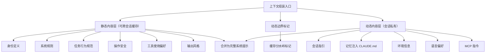
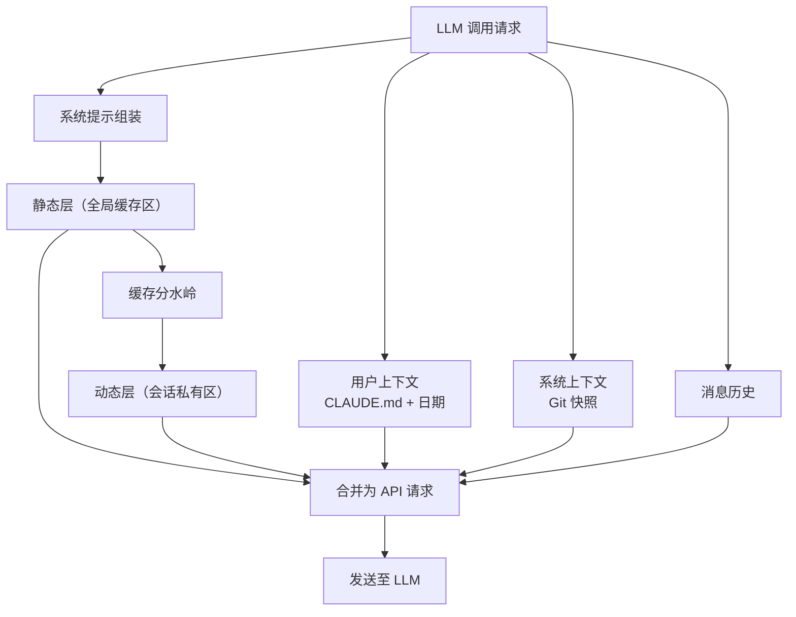

# 03-系统提示词与上下文组装全解

> **定位**：本篇是全系列的"提示词专篇"——完整拆解 Claude Code 的系统提示词模块化体系（systemPromptSections）、静态/动态缓存分水岭、各提示词段的内容与设计意图（原文已全部译为中文），以及特殊场景（自主模式/子代理/压缩）的差异化提示策略。读者画像：初学者。前置阅读：[02-上下文管理与记忆]。本篇与 [教程 02-Prompt调优工程]（教程 10 分类夹）互为参照：那边讲方法论，这边看工业级实物。

## 3.1 上下文组装的本质挑战

Agent 与普通 LLM 调用的根本区别：**Agent 是循环，每次循环都要重新组装一份完整上下文**。这份上下文包含系统身份、行为规则、工具描述、项目环境、对话历史、工具结果、动态附件。组装机制设计不良的后果：缓存命中率低、token 浪费严重、关键信息丢失、上下文溢出。

Claude Code 的答案是一个**分层流水线**：

## 3.2 Section 注册表：提示词从"拼字符串"到"管理模块"

系统提示词被拆分为多个独立 **Section（段落）**，每个 Section 有名称、计算函数和缓存策略。只有两种类型：

- **可缓存 Section**：计算一次后缓存，直到 `/clear` 或 `/compact` 才失效——适合会话内不变的内容（语言偏好、环境信息）。
- **不可缓存 Section**（命名里带 DANGEROUS 警告）：每轮重新计算，**会打破缓存**——只用于真正会变的内容（如 MCP 指令，服务器可能在会话中连断）。每个不可缓存 Section 必须附一个原因字符串（如"MCP 服务器会在轮次间连接/断开"），给未来的维护者看。

核心思想：**不是所有提示都同等重要，也不是所有提示都在变化**。把 Section 分为缓存型/非缓存型，在信息准确性和 Prompt Cache 命中率之间取得最优平衡。

**Java 转译**：把系统提示词做成 Spring 的 `SystemPromptSection` Bean 列表（接口含 `name()`、`compute()`、`cacheable()` 三个方法），按序聚合。这就是"提示词配置化 + 模块化"的落地——改某个行为规则只需改对应 Bean，不必在巨大字符串里大海捞针。（概念代码，实现直白。）

## 3.3 缓存分水岭：一个标记字符串救了成千上万 token

静态层与动态层之间有一个特殊标记字符串把系统提示一分为二：

- **边界之前**：静态内容，可跨组织复用的全局缓存。
- **边界之后**：含用户/会话特定信息，不能跨会话缓存。

为什么这条边界是全篇最关键的设计？因为 **Prompt Cache 的效率取决于缓存前缀的稳定性**。若把动态内容（MCP 指令、语言偏好）放在静态内容之前，动态内容一变，整个缓存失效——数万 token 全部重建。把动态内容放到边界之后，静态部分的缓存永远不会因动态部分变化而失效。这是**关注点分离在缓存层面的应用**。

还有一个更微妙的约束：即使某个 Section 本身不常变，只要内容依赖运行时状态（当前可用工具列表、是否启用某子代理），也必须放边界之后。源码注释道破天机：**N 个运行时变量会产生 2^N 种缓存变体**，会严重碎片化全局缓存。

源码注释原文（中文翻译）："边界标记：分离静态内容（可跨组织缓存）与动态内容。系统提示数组中位于此标记**之前**的一切可使用全局缓存作用域；**之后**的内容包含用户/会话特定信息，不应缓存。警告：不要在没有同步修改缓存逻辑的情况下移除或重排此标记。"

**给初学者的三条缓存铁律**（同样适用于 Java 侧调 DeepSeek/Anthropic 兼容接口）：

1. 稳定内容放前、易变内容放后——请求前缀越稳定，缓存命中越多。
2. 依赖运行时状态的段落即使"看起来稳定"也要归入易变侧。
3. 工具定义列表要**排序稳定**（Claude Code 按名称排序且内置工具保持连续前缀、MCP 工具追加在后）——列表顺序抖动 = 缓存全灭。

## 3.4 静态内容层逐段解析（提示词内容中文翻译）

静态层按"做什么 → 怎么做 → 做的时候注意什么"分层组织，每层职责边界独立，改一层不影响其他层。

### 3.4.1 身份定义

> **【中文翻译】你是一个帮助用户完成软件工程任务的交互式 Agent。**

一句话身份，后面全部规范都从这个身份展开。

### 3.4.2 任务行为规范（Doing Tasks）

定义处理任务哲学的三个"不要"：

> **【中文翻译】（要点译述）不要过度工程化；不要添加未被要求的功能；不要创建不必要的抽象。不要为一次性操作创建辅助函数——三行相似代码好过一个过早的抽象。（内部用户附加）默认不写注释，只在"为什么"不明显时才写；不要删除已有注释，它们可能编码了历史教训；如果发现用户的请求基于误解、或发现相邻的 bug，主动指出——你是协作者，不只是执行者；完成任务前必须验证结果确实工作。**

注意内部用户与外部用户**差异化**：内部（Anthropic 员工）获得更严格的代码质量指令；外部获得更简洁直接的默认体验。**不同用户群体需要不同的行为指导**——按用户专业程度动态调整提示词构成，是值得学的实践。

### 3.4.3 操作安全（Actions）

> **【中文翻译】（要点译述）本地可逆操作可自由执行；不可逆或影响他人的操作必须先确认。需要确认的场景包括：删除文件（rm -rf）、强制推送（force-push）、修改 CI/CD 管道配置、向外部服务发送消息。**

这段对应"用户始终可控"原则——把"哪些操作危险"白纸黑字写进提示词，与权限系统的硬约束形成软硬两层。

### 3.4.4 工具使用偏好（Using Tools）

> **【中文翻译】（要点译述）优先使用专用工具而非终端命令：读文件用读取工具而非 cat/头部/尾部命令；搜索用专用搜索工具而非终端文本工具；查找文件用专用查找工具。同时：最大化并行工具调用——独立操作在同一块中同时发起，不要等待。**

两条都极重要：前者是**工具路由引导**（专用工具比 shell 命令更可控、更可观测）；后者是**并行激发**——明确告诉模型可以并行，能显著降低多工具任务的端到端延迟（配合 01 篇的并发安全调度）。

### 3.4.5 输出风格与效率

> **【中文翻译】（要点译述）简洁、直接、不使用表情符号。直奔主题，跳过填充词和过渡语——一句话能说清的不用三句。（内部用户则是完全不同的要求：完整散文式写作、语义回溯避免、倒金字塔结构。）**

## 3.5 动态内容层

| 段落 | 内容 | 缓存策略 | 设计点 |
|------|------|----------|--------|
| 会话指引 | 子代理使用指引、技能说明 | 动态（在边界后） | 依赖运行时工具列表，必须每轮评估 |
| 记忆注入 | CLAUDE.md 内容 + 当前日期 | 会话内 memoize 一次 | `getUserContext` 整个会话只算一次，性能与一致性双保障 |
| 环境信息 | 工作目录、是否 Git 仓库、平台、Shell、操作系统版本、模型、知识截止日期 | 可缓存 | 会话内不变 |
| MCP 指令 | 已连接 MCP 服务器的自定义指令 | **不可缓存** + Delta 增量路径 | 服务器可能中途连断；增量注入只发改动部分，从数千 token 降到几百 |
| Git 状态快照 | 当前分支、主分支名、工作区状态、最近 5 次提交 | 会话开始取一次 | 刻意不随对话更新——更新会破坏缓存且增加延迟；需要新鲜状态时由模型主动跑 Git 命令 |

**给初学者的启示**：Git 状态"过期就过期"是有意的取舍。上下文里塞一个快照让模型知道"大概在什么分支、最近改了什么"，足够做决策；精确状态靠工具按需获取。**上下文里的信息只需"够决策"，不需要"永远新鲜"**。

## 3.6 特殊场景的差异化提示

### 3.6.1 自主模式（无人值守）

自主模式的提示完全不同且更精简：

> **【中文翻译】（要点译述）你是一个自主 Agent。使用可用的工具去做有价值的工作。（附加指令的要点）偏执于行动、不要等待确认、用休眠工具控制节奏。**

无人值守场景下，"每步确认"的交互规范整体替换为"自主推进"规范——**提示词要跟运行模式配套**，一套提示打天下是提示词工程的常见反模式。

### 3.6.2 子代理增强

子代理通过环境增强获得额外注意事项：

> **【中文翻译】（要点译述）注意：子代理线程的每次命令之间工作目录会被重置；最终回复中要给出文件路径（一律绝对路径，绝不用相对路径）；必须避免使用表情符号。**

### 3.6.3 阶段引导放在工具结果里

01 篇讲过 Plan Mode 的例子，这里从提示词视角再看一次：进入计划模式后的详细阶段指导（"彻底探索代码库 → 识别相似方案 → 考虑权衡 → 设计时用提问工具澄清 → 就绪后退出并提交审批"）不放在系统提示词，而是作为**进入动作的 tool_result 即时反馈**返回。收益：①系统提示不膨胀（省固定成本）；②模型只在真正进入该阶段时才看到指导（按时注入）；③作为对话历史的一部分，遵守率更高。**提示词注入的时机与位置，和提示词内容本身同等重要。**

同理，压缩恢复的元消息也是即时注入："输出 token 达到上限。直接继续——从断点接上，不要道歉，不要回顾。"

### 3.6.4 会话记忆的提示词模板

SessionMemory 的更新提示词包含动态大小提醒（中文翻译要点）："关键：会话记忆文件目前约 N token，已超过上限，你**必须**压缩文件。以下段落超限：……每段上限 2000 token。"——**把约束违反的现状量化后回喂给模型**，比一句"请保持简洁"有效得多。这就是 [教程 10-调优实战与方法论] 里"badcase 驱动的 Prompt 迭代"的工程化形态：错误不是被吞掉，而是变成下一轮提示词的输入。

## 3.7 上下文组装完整流水线

## 3.8 转译到 Spring AI / Java 生态

1. **Section 化提示词**：定义 `SystemPromptSection` 接口（name/compute/cacheable），用 `List<SystemPromptSection>` Bean 聚合成系统提示；把 Spring AI 的 `ChatClient` 默认 system 参数改为从聚合器获取。（概念代码。）
2. **缓存友好排序**：系统提示固定前缀 + 工具列表稳定排序，是调用任何支持 Prompt Cache 的模型（DeepSeek 上下文缓存、Anthropic Prompt Caching）的通用前提。项目里"五层拼接策略"（System Prompt→工具 Schema→记忆摘要→RAG→用户输入，见 [教程 08-架构师进阶] 上下文工程篇）与分水岭思想同构——静态的放前、动态的放后。
3. **按模式/人群差异化**：用 `@Profile` / 配置开关切换不同 Section 组合（交互模式 vs 无人值守、内部 vs 外部用户），而不是改字符串。
4. **量化回喂**：校验失败、超限告警要"算出数字再喂回去"（如"当前记忆 14K token 超限 2K"），这是 Prompt 版本管理与回归门禁（教程 10/02）里最有性价比的技巧之一。

## 3.9 本篇小结

- 系统提示词 = **模块化 Section 注册表**（缓存型 + 显式标注的非缓存型），不是一坨字符串。
- **缓存分水岭**：稳定前缀 vs 动态后缀；运行时依赖段落一律归动态侧（2^N 变体陷阱）；工具列表排序稳定。
- 静态层内容（身份/任务哲学/操作安全/工具偏好/输出风格）每一层都可独立演进、独立翻译学习。
- **注入时机与位置**和内容同等重要：阶段指导放 tool_result、恢复指令即时注入、超限告警量化回喂。
- 差异化提示按"用户群体 × 运行模式"两个维度切换，是工业级 Prompt 体系的标准形态。

## 3.10 设计哲学小结与适用场景

**本篇哲学一句话**：提示词不是字符串是模块——Section 化给可维护性，分水岭给缓存经济性，注入时机与内容同等重要。**适用场景**：多租户/多模式（交互 vs 无人值守）产品、使用支持 Prompt Cache 的模型、提示词版本化管理。**不适用场景**：单一场景小应用——Section 注册表是杀鸡用牛刀，但"稳定前缀 + 稳定排序"两条仍然免费可抄。**选型建议**：Section 化聚合器（10 篇 §10.4）+ 按用户群体×运行模式差异化，是提示词从"能跑"到"工业级"的分水岭。
