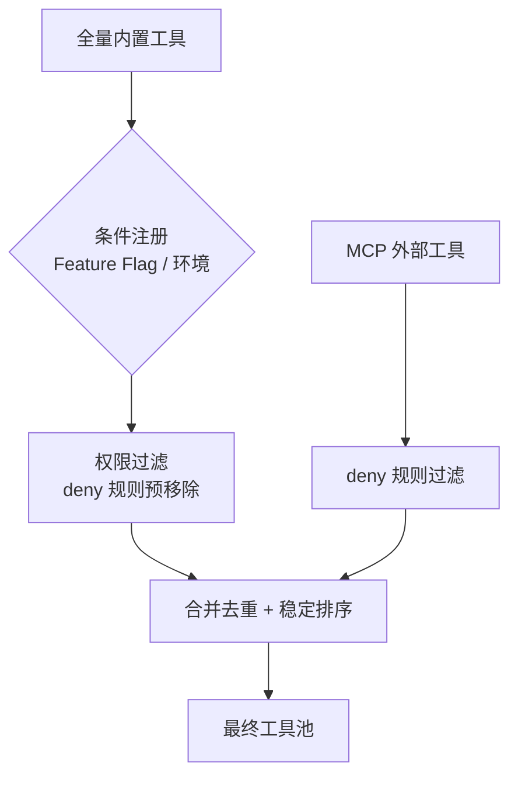
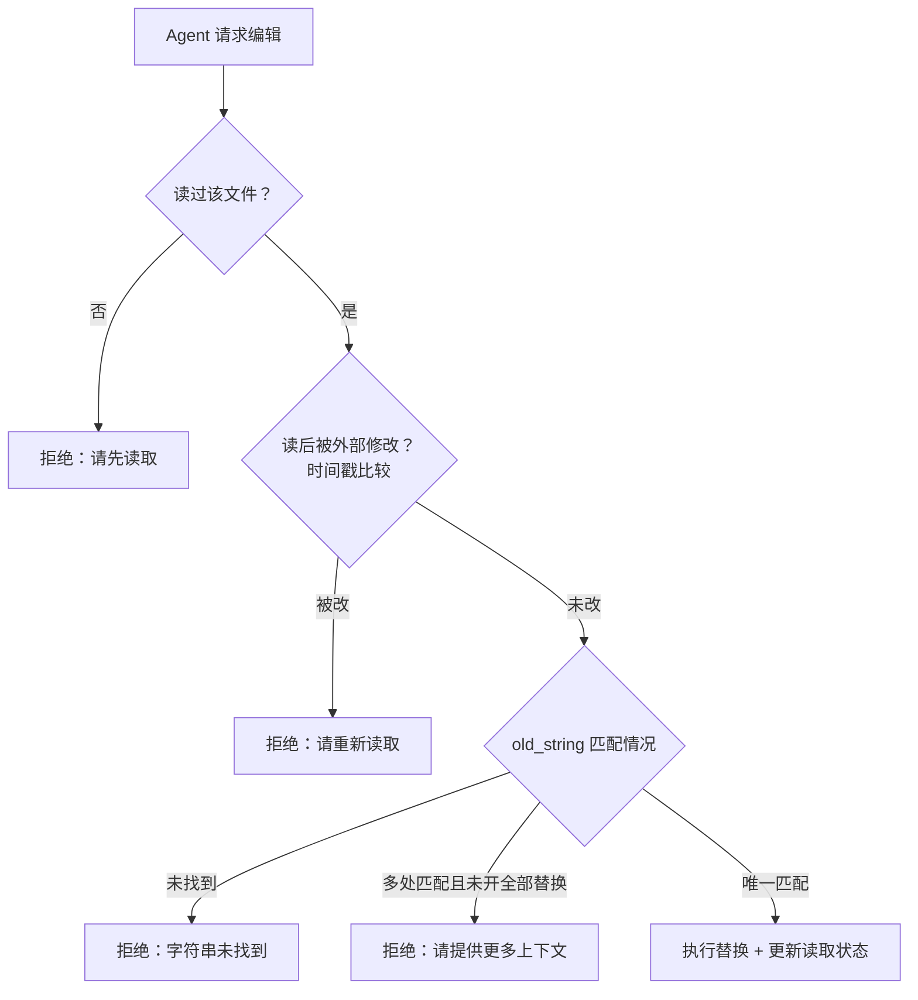
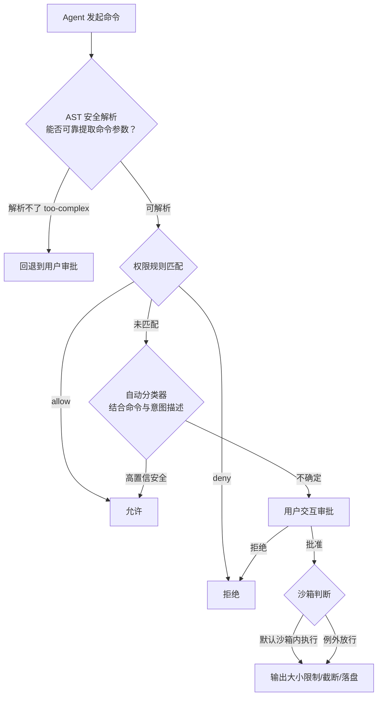

# 04-工具系统

> **定位**：本篇拆解 Claude Code 工具系统的完整链条：统一工具接口与注册表、三个代表性工具的设计哲学（文件编辑的"精确字符串替换"、Shell 的纵深安全链、搜索的 LLM 友好封装）、子 Agent 委派（上下文隔离/Fork 缓存优化/Worktree）、MCP 开放协议（传输抽象/动态工具/命名空间）。读者画像：初学者。前置阅读：[01-Agent引擎与核心循环]。Java 对照锚定 Spring AI 2.0 的 `@Tool`/`@ToolParam` 与 MCP 客户端体系。

## 4.1 统一工具接口：自描述的能力单元

一个工具不只是"执行函数"。Claude Code 的 `Tool` 接口要求每个工具自述：

- **我是谁**：名称、描述
- **我需要什么**：输入 Schema（Zod 定义，同时生成 JSON Schema 给模型 + 运行时校验）
- **我安全吗**：`isConcurrencySafe(input)`、`isReadOnly(input)`、`isDestructive(input)`
- **如何检查权限**：`checkPermissions`、`validateInput`
- **如何执行**：`call`

当所有能力遵循同一接口，系统就能在**工具层面施加统一的横切关注点**——权限、并发、输入验证、结果缓存、渲染——而不需要每个工具自己操心。工厂函数为未显式声明的属性补**安全优先的默认值**：并发安全默认 false、只读默认 false。新工具忘了声明？系统按最保守方式对待。

注册表的组装链条：全量内置工具 → 条件注册（Feature Flag / 环境判断决定哪些工具进入构建）→ 权限过滤（**被 deny 的工具在展示给模型之前就移除**——模型看不到自然不会调用，这是"最小权限"的第一道落实）→ 与 MCP 工具合并（内置工具排序后作为**连续前缀**，MCP 工具排序后追加——保证 MCP 变化时不破坏内置部分的缓存键）。

**Java 转译**：Spring AI 2.0 的 `@Tool`/`@ToolParam` 就是声明式工具定义（注意 `@ToolParam` 只有 `required()`/`description()` 属性）；`ToolCallback` 接口 + `ToolCallbackProvider` 对应统一接口与注册表；按场景动态组装工具池可用配置驱动的 `List<ToolCallback>` 注入。deny 预过滤对应"工具权限分级"——高危工具根本不注册进低权限租户的工具池。

## 4.2 FileEditTool：为什么用"精确字符串替换"而不是行号编辑

Agent 读写文件是最基础也最容易出错的能力。Claude Code 的文件编辑选择**精确字符串替换**（old_string → new_string）而非"第 N 行到 M 行替换"，原因有三层：

1. **LLM 的行号不可靠**：模型对"第几行"的判断经常错，多轮对话中文件已变、模型记忆中的行号早过时。字符串匹配锚定内容而非位置——内容变了匹配自然失败，**失败比默默改错行安全**。
2. **唯一性检查提供隐式原子性**：old_string 匹配到多处且未开 replace_all 时，编辑被拒绝并要求提供更多上下文消歧——防止"改了不该改的地方"。
3. **"读后写"强制一致性**：必须先读过文件才能编辑（没读过直接拒绝）；且检查读之后文件是否被外部修改（乐观锁：读时记时间戳，写时验证）。文件被用户或 linter 改过？拒绝，要求重新读取。

还有工程细节：**引号归一化**——文件里是弯引号（'）而 LLM 只能生成直引号（'）时，先归一化匹配再保留原引号风格替换。**容忍 LLM 输出与文件实际内容的"合理差异"**，是区分"能用"和"好用"的关键。大文件读取则有多层截断（字节上限/Token 上限/行范围参数）、重复读取去重（同一轮重复读未变更文件返回"文件未变化"存根）、设备文件防护（拒绝读取会挂起的 `/dev/zero` 等）。

**Java 转译**：如果给 Java Agent 做文件编辑工具，直接抄这套：old/new 字符串对 + 唯一性校验 + 读后写乐观锁 + 引号/空白归一化。工具的"参数 Schema 设计学"见 [教程 10-调优实战与方法论/03-工具调优上]。

## 4.3 BashTool：最危险工具的纵深安全链

让 Agent 执行 Shell 是最强也最危险的能力。安全链五环节：

四个关键设计：

1. **AST 解析而非正则**：`r''m'' -rf /` 在 shell 里等于 `rm -rf /`，能逃过字符串匹配，逃不过语法树解析。解析的目的**不是判断危险，而是判断"能否可靠提取每条子命令的参数"**——能则交给规则精确匹配，不能则宁可多问用户（fail-closed）。
2. **意图描述参与安全决策**：命令的 `description` 参数不只是给用户看的注释，还是自动分类器的输入信号——模型自己解释意图，系统用它辅助判断。
3. **沙箱默认开启**：沙箱启用时所有命令默认在沙箱内执行（文件系统读/写白名单 + 网络域名过滤），显式绕过参数用 `dangerously` 前缀命名——**命名即安全**，让代码审查者一眼看到风险。
4. **sed 拦截**：`sed -i` 修改文件会绕过文件编辑工具的安全检查（用户确认修改内容），因此被拦截转为标准编辑流程；防绕过的内部参数从暴露给模型的 Schema 中移除——**模型无法利用它感知不到的东西**。

**Java 转译**：Java Agent 执行命令用 `ProcessBuilder` + 超时 + 输出截断是底线；企业级应配合容器/沙箱执行环境（见 [附录 16-Agent沙箱与执行环境]）。`dangerously` 前缀命名法可直接引入 Java API 设计规范。

## 4.4 搜索工具：把 ripgrep 封装成 LLM 友好接口

GrepTool/GlobTool 底层是极速搜索工具 ripgrep，但直接暴露给 LLM 有四个问题：参数不直觉（`-l`/`-c` 单字母）、输出不可控、绝对路径浪费 token、结果未排序。封装策略：

- **语义化参数**：`output_mode: files_with_matches | content | count` 替代单字母旗标；保留 `-A`/`-i` 等与 ripgrep 对应的参数但用宽松类型包装。
- **默认有界，显式放松**：默认结果上限 250（文件名搜索更保守取 100）；`head_limit: 0` 是"逃生舱"供显式请求无界。**默认安全、显式放宽**是所有可能返回大量数据的工具的设计原则。
- **排序即隐式相关性**：文件列表按修改时间排序——最近改的文件更可能与当前任务相关。不完美但远好于文件系统顺序。
- **路径压缩**：绝对路径转相对路径，广域搜索一次省上千字符；且**先截断再转换**，不处理将被丢弃的行。
- **防污染细节**：`--max-columns 500` 防单行 base64/超长 JSON 淹没结果；自动排除版本控制目录；pattern 以 `-` 开头时用 `-e` 保护。

给初学者：**工具接口设计的第一性问题不是"暴露什么能力"，而是"降低模型的认知负担"**。参数名语义化、默认值有界、结果即用——每一个都是给下游 LLM 降本。

## 4.5 子 Agent 委派（AgentTool）

**为什么需要子 Agent**：单 Agent 串行受限于一个上下文窗口；委派把"过宽的问题拆成多个边界清晰的小问题"。委派契约：父 Agent 用 `prompt` 传任务，子 Agent 返回结果报告；`description` 只用于 UI 展示不影响行为（接口层与展示层分离）。

### 上下文隔离：默认隔离、显式共享

子 Agent 获得一个受限上下文：克隆父的文件读取缓存（避免重复读，但子读不影响父的去重）、**空消息历史**（不污染父上下文）、子取消控制器（父中断级联到子）、全局状态更新被替换为 no-op（但任务注册保留——否则后台任务变孤儿进程）。**"默认隔离，显式共享"远比"默认共享，显式隔离"安全**。

### 同步与异步

同步委派阻塞等待结果（快速探索）；异步委派后台运行+完成通知（跑测试套件等长任务）。关键设计：**异步的触发条件不只来自模型**——Agent 定义标记为后台、协调器模式、助手模式等系统条件都会强制异步。**在某些场景下，系统比模型更清楚应该异步。**

### Fork 路径：缓存感知的委派

Fork 是特殊子 Agent：继承父的完整系统提示与消息历史，为非当前工具构造"虚拟结果"，使子 Agent 的 API 请求前缀与父**完全相同** → 服务器端 Prompt Cache 直接命中 → 委派的增量 token 成本极小。有递归防护（fork 内不能再 fork）。**多 Agent 系统的主要运营成本是 token，任何缓存感知设计都值得。**

### Worktree 隔离

`isolation: 'worktree'` 时子 Agent 在独立 Git worktree（工作目录副本）中工作：文件修改不影响主工作区、多个子 Agent 并行互不干扰、完成后按分支合并。解决的根本问题：**认知隔离必须配上物理隔离**——多个 Agent 在同一目录落盘，再好的上下文隔离也会被文件冲突打破。Worktree 创建有快速恢复路径（已存在时读文件取 HEAD，跳过数秒级的 git fetch）、退出有 fail-closed 安全门（有未提交变更必须显式确认丢弃）、崩溃残留由垃圾回收兜底（只清理匹配临时命名模式的、且 30 天以上、且状态干净的）。

**Java 转译**：Spring AI 中的子 Agent = 一次递归的 ChatClient 调用 + 独立的会话 ID/记忆空间/工具池（见 [教程 00-基础与核心/09-多Agent协作]）。Worktree 隔离思想可推广为"并行执行环境隔离"：Docker 容器每任务一容器、或独立工作副本目录。

## 4.6 MCP：开放的工具协议

MCP（Model Context Protocol）让 Agent 连接外部工具服务器，是**架构级能力扩展机制**而非普通插件。

### 传输抽象：五种通信方式

stdio（子进程标准输入输出，最常用）、SSE、HTTP、WebSocket、SDK 内嵌。上层代码（发现、调用、权限）完全不感知传输差异。连接是有生命周期的状态机（连接中/已连接/失败/需认证/已禁用），带指数退避重连（1s 起步翻倍、上限 30s、最多 5 次）。

### 动态工具创建

发现到的每个 MCP 工具被包装成统一的 `Tool` 对象：**参数校验交给 MCP 服务器**（客户端透传，降低耦合）；协议的注解（`readOnlyHint`/`destructiveHint`）映射为本地行为标记，使 MCP 工具**无缝融入**内置的权限与并发系统。工具名带命名空间（`mcp__服务器__工具`）：防冲突 + 支持按服务器前缀的 deny 规则（`mcp__github*` 一条规则拒绝全部 GitHub 工具）。

### 配置合并与审批

配置来源有严格优先级：**企业策略排他模式**（企业配置存在则忽略一切其他来源）> 用户 > 项目（`.mcp.json` 可提交版本库，恶意项目可借此注入服务器，故**必须用户审批**）> 本地 > 插件，重复配置按内容签名去重。**Elicitation** 机制进一步打破"工具是单向的"：服务器可在工具执行中请求用户交互（如"确认要执行的 SQL"），Hook 可程序化响应以支持 CI 场景——"请求-确认-响应"三步交互让危险操作的审批发生在执行过程中。

### 动态更新

服务器工具集变化时推送通知，工具池自动重组——**Agent 的能力可以在对话中途增长**，不需要重启会话。

**Java 转译**：Spring AI 2.0 的 MCP 客户端坐标为 `spring-ai-starter-mcp-client`（无 webflux 变体，WebFlux 传输走 `mcp-spring-webflux`），客户端类型是 `io.modelcontextprotocol.client.McpSyncClient`，用 `McpClient.sync(transport)` 工厂创建；`@Tool` 方法暴露为 MCP 工具需显式 `SyncMcpToolCallbackProvider` Bean。企业排他模式、项目配置审批、命名空间 deny 规则三点，在 Java 中台做"工具网关治理"时应完整保留（见 [教程 04-企业级架构主干] 与 [附录 06-企业级架构模式]）。

## 4.7 本篇小结

- **统一接口 + 工厂默认值（fail-closed）+ deny 预过滤 + 缓存友好排序** = 工具注册表四件套。
- 文件编辑：内容锚定优于位置锚定；读后写乐观锁；容忍合理差异。
- Shell 执行：AST 解析判断"可解析性"而非"危险性"；意图描述参与决策；沙箱默认开；命名即安全。
- 搜索工具：语义化参数、默认有界、隐式排序、路径压缩——为 LLM 降认知负担。
- 子 Agent：默认隔离显式共享；异步条件由系统参与决定；Fork 用缓存摊薄委派成本；Worktree 让认知隔离落地为文件系统隔离。
- MCP：传输抽象、注解映射融入权限体系、企业排他 + 项目审批、Elicitation 执行中确认、工具池可中途增长。
