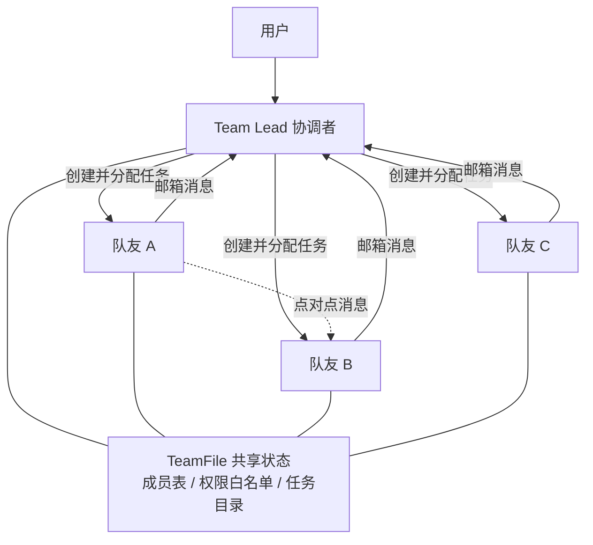
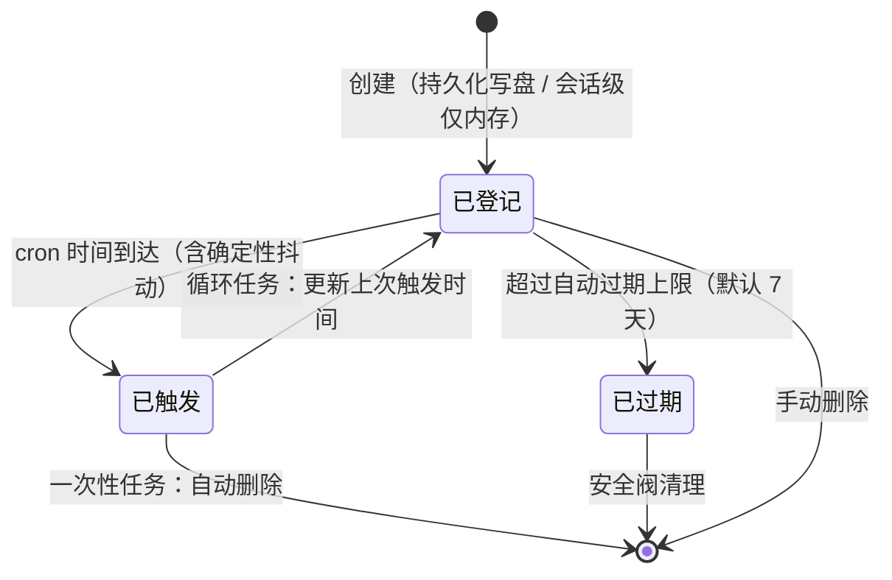

# 06-多Agent协作与后台任务

> **定位**：本篇覆盖 Claude Code 的"组织学"：Swarm 多 Agent 协调架构（协调者模式/TeamFile/邮箱通信/跨 Agent 权限同步）、Worktree 并行工作流、Teleport 跨机迁移会话、后台任务与 Cron 调度。核心论点：多 Agent 的难点不是并发，是**组织结构设计**。读者画像：初学者。前置阅读：[01-Agent引擎与核心循环]、[04-工具系统]。Java 对照锚定 [教程 00-基础与核心/09-多Agent协作] 与项目 12 研发效能的多 Agent 实践。

## 6.1 Swarm：多 Agent 协调架构

### 为什么需要多 Agent

单个 Agent 的真正瓶颈不是 CPU，而是**上下文窗口、注意力和决策连贯性**：上下文过载后开始遗忘前提、混淆任务边界、把不同目标揉成一团。多 Agent 的意义是把过宽的问题拆成多个仍保持清晰边界的小问题——**Swarm 不是并行库，而是组织结构设计**：如何让多个有限理性的执行体，在不共享大脑的前提下为同一目标协同。

### 协调者模式（而非对等模式）

- **Team Lead（领导者）**：与用户直接交互的主 Agent，负责建队、派活、审批。
- **Teammates（队友）**：领导者创建的从属 Agent，通过**邮箱**与领导通信。

为什么不用对等拓扑？两个理由：**权限安全**（用户只与 Lead 交互，敏感操作审批都经 Lead 的 UI——队友互相触发操作就会绕过审批）与**责任归属**（对等模式模糊了"谁对结果负责"；协调者模式天然有汇总点：谁拆任务、谁裁决冲突、谁向用户解释）。对一个要把改动落到代码上的系统，**中心化责任比分布式优雅更重要**。

### TeamFile：文件系统作为轻量控制面

团队状态（成员、颜色、工作目录、worktree 路径、订阅关系）存在一个 JSON 文件里。关键洞察：**文件系统是最简单的跨进程通信机制**——tmux pane 里的独立进程和同进程队友都能读写同一个文件，不需要服务发现或消息队列。TeamFile 扮演**轻量控制面**：只描述"谁存在、谁负责什么、消息怎么路由"，真正的工作产物在各自的会话与 worktree 里。控制面信息天生适合朴素介质——出问题时人能直接打开看。

### 三种执行后端的统一抽象

队友可以在 tmux 分屏、iTerm2 原生分屏、或**同进程内**运行，三者由统一执行器接口抽象（spawn/sendMessage/terminate/kill/isActive）。InProcess 后端最特别：同一进程内用上下文本地存储（Java 里等价于 ThreadLocal 的响应式替代/显式 Context）为每个队友提供独立身份。检测优先级实用主义：在 tmux 里就用 tmux，iTerm2 有 CLI 就原生分屏，否则回退，非交互环境用进程内。

### 邮箱模式：Agent 间通信

每个 Agent 有专属邮箱目录，别人投递消息、自己轮询读取。为什么不用同步 RPC？**LLM 驱动的 Agent 响应时间不可预测**，同步等待可能阻塞数分钟；邮箱让各方按自己节奏处理，天然支持优先级、批量、离线缓冲。消息类型表：普通文本、广播、关闭请求/响应、计划审批请求/响应、权限请求/响应。设计哲学：**宁可最终一致，不强求瞬时一致**——延迟、乱序、离线是 Agent 通信的现实条件，应纳入协议本身。

### 跨 Agent 权限同步

队友需要审批的操作（跑命令、改文件）无法自己弹窗——它可能在另一个进程里。双路径：**快速路径**（进程内队友直接把审批请求插入 Lead 的 UI 队列，零序列化开销，对话框带队友颜色徽章）；**邮箱路径**（通用：请求写入 pending 目录 → Lead 轮询 → 结果写入 resolved 目录 → 队友轮询取回，文件锁保证原子性）。沙箱的网络审批同样走这条路。**多 Agent 系统里，权限审批的"交互能力"是一种要被路由的资源。**

### 生命周期与优雅关闭

Leader 不能强杀队友：发送关闭请求，队友由模型决定是否同意（正在关键操作时可拒绝并说明理由），同意后才执行终止。所有团队注册到会话清理列表，用户 Ctrl+C 退出时自动清理孤儿 pane、worktree 与目录。**优雅关闭比强制终止更能保护工作成果**——Agent 可能正做不可中断的文件操作。

**Java 转译**：Java 中 Swarm ≈ Lead/Worker 两个 Agent 服务 + 消息队列做邮箱（Kafka 天然匹配：见 [教程 07-Kafka事件骨干]）+ 数据库表做 TeamFile + 权限请求经消息路由回有 UI 的网关。责任归属 = 链路里必须存在一个聚合点对用户负责——这正是项目 12 多 Agent 评审流的组织原则。

## 6.2 Worktree：把认知隔离变成物理隔离

Git worktree 允许同一仓库检出多个分支到不同目录。Swarm 中每个队友在自己的 worktree 工作：独立文件视图、互不冲突、完成后按分支 PR 合并。**分支即隔离，PR 即合并**——Agent 负责生成变更，但**不负责定义真相**；代码库的最终真相仍由 Git 历史与人的合并决定。

两条创建路径的粒度分离值得学习：**会话级**（主 Agent"搬进去"：切换全局工作目录、保存会话快照、清缓存）与 **Agent 级**（子 Agent 需要隔离空间，但主 Agent 留在原地：不触碰任何全局状态）。共享创建基础设施但隔离副作用范围——**把"资源创建"和"上下文切换"分开**，很多系统把这两件事绑死，导致副作用范围过大。

工程细节三则：快速恢复（worktree 已存在时读文件取 HEAD，把秒级 fetch 降到毫秒）；创建后环境配置（复制本地设置、指向主仓库的 Git hooks、符号链接 node_modules 等大目录、按 `.worktreeinclude` 复制被 gitignore 但必需的文件如 `.env.local`、稀疏检出）——**好的隔离方案应该让 Agent 忘记自己身处隔离环境**；垃圾回收 fail-closed（只清理临时命名模式 + 超 30 天 + 状态干净三者同时满足；状态查不清 = 不安全 = 跳过）。

## 6.3 Teleport：迁移的不是进程，是工作上下文

场景：在开发机上花了 30 分钟让 Agent 理解项目，回家要用笔记本继续。Teleport 提供上传（本地会话 → 云端）与恢复（云端 → 任意机器）。

关键认知：**Teleport 迁移的不是进程，而是"让另一台机器足以继续这个会话的最小充分条件"**——Agent 的核心不是进程 ID，而是上下文连续性。这与远程桌面/tmux attach 有本质区别。

核心技术选型与设计：

1. **Git Bundle 作传输格式**：原生打包格式、离线可创建、单文件原子上传、恢复不需网络。**三级回退链**：全量打包（含所有分支）→ 仅当前分支 → 无历史单提交快照——仓库过大时逐级降级，每级取舍明确。这是"语义保真而非形式保真"：远端不必有与本地完全相同的仓库形态，只要恢复后对"我在做什么"的理解一致。
2. **恢复前先验证仓库匹配**：主机（GitHub vs 企业版）与仓库路径都要一致，四种验证结果（匹配/不匹配/不在仓库中/无需仓库）。看似保守，实则维护关键不变量：**会话里的语义必须绑定到正确的现实对象**——恢复到错误仓库，模型会"说得很像对的"但文件与分支身份全部错位，这是"貌似连续、实则漂移"。
3. **不完整工具调用的清理** + 注入恢复告知消息："本会话从另一台机器继续，应用状态可能已变化。"——模型不会盲目信任旧的文件系统状态。
4. **元数据用小模型生成**：标题与分支名用快速小模型生成——"用合适的工具做合适的事"。
5. **只对瞬态错误重试**：网络断开/5xx 指数退避重试；4xx 认证失败立即放弃。

**Java 转译**：跨机/跨环境迁移 Agent 会话 = 会话状态自包含设计（消息可序列化 + 环境相关状态分离 + 恢复时重新绑定）+ 快照传输（Git bundle 思想可换成镜像仓库/镜像制品）+ 恢复前环境一致性校验。项目 13 事件溯源运行时的"会话可重放"是同一思想的持久化形态。

## 6.4 后台任务：对话是控制通道，任务才是执行通道

用户能容忍任务慢，但不能容忍界面被慢任务占住。后台任务体系的本质是把"一次问答"和"一项工作"分开。

### 两层任务模型

- **运行时任务**（内存中，服务 UI 渲染与进度追踪）：Shell 后台任务、子 Agent 任务、进程内队友、远程任务等，统一状态机（running/completed/failed/killed）。
- **协作任务**（文件持久化，服务多 Agent 分配）：JSON 文件 + 自增 ID + 依赖字段（blocks/blockedBy）+ 认领者字段，状态 pending → in_progress → completed。

两者关注点不同不应混淆：前者跟踪**执行单元**的生命周期，后者跟踪**工作单元**的状态。任务创建有 **Hook 扩展点**：Hook 拒绝则任务删除回滚——核心系统不对"什么任务可以创建"做假设。

认领的并发安全：**文件锁 + 锁内双重检查**（拿到锁后重新读取任务状态，确认未被认领、依赖已完成）+ 指数退避重试（10+ 并发 Agent 下临界区约 50-100ms，30 次重试给足 2.6 秒等待）。队友崩溃时其未完成任务自动重置为 pending 供他人认领。**多进程协作场景，文件锁 + 重试就足够，不必上分布式锁服务。**

### Cron 调度：从会话时间到系统时间

Cron 让 Agent 进入"系统时间"——独立于当前对话存在的持续自动化。设计要点：

- **两种存储**：持久化（跨重启存活，适合"每天早上检查 PR"）vs 会话级（进程退出即消失，适合"5 分钟后提醒我"）。队友不能创建持久化 Cron——它的身份不会跨会话存在，语义正确性优先于技术可能性。
- **确定性 Jitter（抖动）**：如果百万实例都设整点触发，请求会在同一秒打爆 API。解法：用任务 ID 哈希做确定性抖动种子——循环任务最多延迟 15 分钟（不可见无感知），一次性任务反而**提前**最多 90 秒（用户说 3 点提醒不能 3:06 才响）。**循环任务的延迟无损、一次性任务的提前无害**——按任务性质选抖动方向，这是调度设计里少见的细密思考。
- **自动过期**：循环任务默认 7 天过期——不是功能需求而是**防御性设计**，防止被遗忘的任务无限积累。
- **调度器锁**：多会话共享同一个任务文件时，文件锁选主（owner 执行触发、waiter 每 5 秒探测、owner 崩溃自动接管）——一个文件锁就覆盖了 leader election，无需 ZooKeeper。而**会话级任务不受锁控制**（各进程内存私有，无双重触发问题）——**协调本身也是成本，只对真正共享的资源加锁**，否则异步系统会被重新做回同步系统。

### Cron 任务的完整生命周期

把持久化/会话级两种存储、触发、抖动、过期、删除全部收进一张状态图，方便对照自查：

三个容易忽略的语义约束：循环任务的抖动是**延迟方向**（最多 15 分钟，用户无感知），一次性任务的抖动是**提前方向**（最多 90 秒，绝不能迟到）——方向由任务性质决定而非随机；持久化任务由文件锁选主后只由 owner 会话触发，会话级任务各进程自治不参与选主——**协调范围与共享范围严格一致**；关联队友的任务不允许持久化，因为队友身份不跨会话存在——**引用不能指向未来不存在的实体**。

**Java 转译**：后台任务 ≈ `@Async`/独立执行器 + 任务表（DB 替代 JSON 文件，乐观锁替代文件锁）；Cron ≈ 分布式调度（Quartz 集群/ShedLock 选主）+ **Jitter 必须自己加**（Java 生态的调度框架默认整点齐射）；过期策略对任何长生命周期调度器都适用。

## 6.5 本篇小结

- 多 Agent 的核心是**组织学**：协调者模式换来权限安全与责任归属；TeamFile 用文件系统做轻量控制面；邮箱通信拥抱最终一致；权限审批是需要跨进程路由的资源。
- Worktree：**资源创建与上下文切换分离**；分支即隔离 PR 即合并；隔离方案要做到"让 Agent 忘记隔离"。
- Teleport：迁移**工作上下文**而非进程；语义保真（三级回退）+ 恢复前校验（防"貌似连续实则漂移"）。
- 后台任务：对话是控制通道、任务是执行通道；运行时任务与协作任务两层分离；文件锁+双重检查足够。
- Cron：区分会话时间与系统时间；确定性 Jitter 按任务性质选方向；自动过期是防御；只对共享资源协调。
