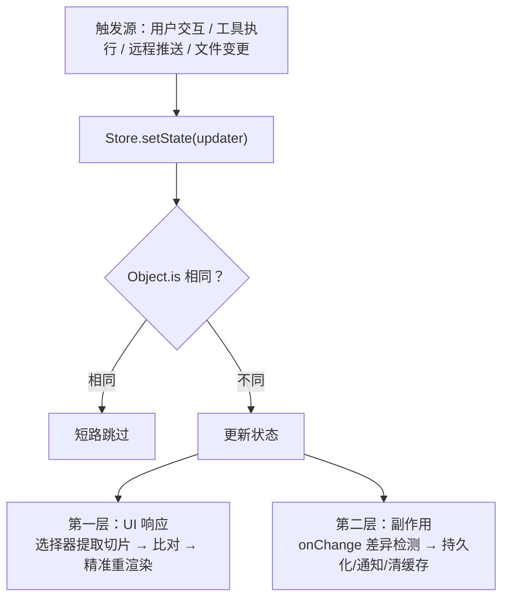
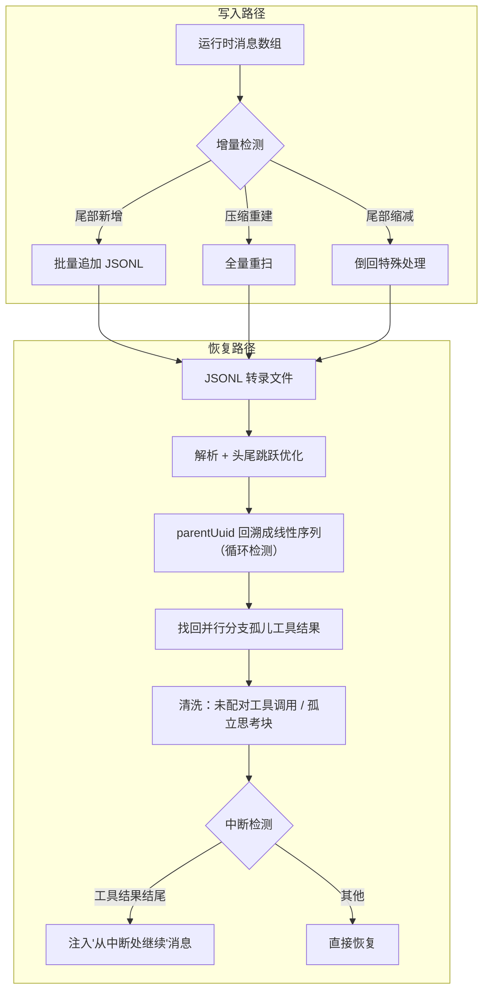

# 07-状态管理-持久化与可扩展性

> **定位**：本篇合并四组主题：全局状态设计（单 Store 与两层响应式管线）、对话历史持久化与恢复（DAG 结构/增量写入/无感恢复）、可扩展性三件套（命令/插件/技能/Feature Flag）、以及终端 UI 架构中对 Java 工程师有迁移价值的部分（渲染性能思想）。读者画像：初学者。前置阅读：[01-Agent引擎与核心循环]。Java 对照锚定 [教程 01-WebFlux与响应式编程] 与 [教程 03-React前端与AgenticUI]。

## 7.1 全局状态：34 行 Store 与"单一事实面"

Claude Code 的全部运行时状态住在一个大对象（AppState，按核心配置/权限/对话/任务/MCP/插件/UI/远程/团队/文件历史等分区，五百多行类型定义），由一个 **34 行的自研 Store** 管理：`getState` / `setState(updater)` / `subscribe`。三个设计关键词：

1. **不可变更新**：`setState` 接收 updater 函数（`prev => ({...prev, key: value})`），类型层面就用 `DeepImmutable` 约束只读——引用相等性检查（`Object.is`）才能正确工作。
2. **短路优化**：updater 返回相同引用时跳过通知。
3. **onChange 副作用回调**：不是给 UI 的，是给**副作用系统**的——拿到新旧两个状态做差异检测。

为什么选集中式而非分布式状态？三个理由：**跨领域状态交互频率极高**（一次工具执行同时影响权限/任务/UI 状态，一次 `setState` 原子更新多个领域字段）；**调试可追溯**（任意时刻 `getState()` 得到完整快照——Agent 行为异常时需要完整状态上下文，而非在五个模块间拼凑）；**持久化恢复的一致性**（会话恢复一次注入即可）。深层论点：**状态架构必须围绕系统最昂贵的不一致来设计**——这里最昂贵的不一致不是组件多渲染一次，而是"UI 认为工具在运行、权限层认为已被拒、任务层认为还活着"这种跨域错位。

### 两层响应式管线

第一层（UI）：组件通过选择器从大状态提取小切片，只在自己关心的切片变化时重渲染。铁律：**选择器必须返回稳定引用**——多字段需求拆成多次调用（每次返回原始值），绝不在选择器里现造对象（新对象永远"变了"，导致无限重渲染）。

第二层（副作用）：`onChange` 集中检测差异并执行副作用。教科书案例：权限模式有 8 个以上的修改路径，集中化之前只有 2 个路径通知外部系统——集中到 onChange 后**所有修改路径自动获得通知能力**。这是横切关注点的最佳解法。为什么不用 React 的 useEffect？时序不可控（渲染后才异步执行）、缺乏全局视角（组件只见自己的切片）、重复执行风险。

**evictAfter 模式**：已完成任务面板的延迟消失不是命令（"删除面板"）而是状态条件（`evictAfter` 时间戳，30 秒宽限期后可清理）。**用状态而非命令控制 UI 生命周期**——状态可见、可序列化、可在任何时刻重新评估。

**Java 转译**：响应式管线在 WebFlux 里就是"状态 Bean（不可变）+ 事件发布 + 订阅者分层"：UI 推送订阅状态切片，副作用监听器做持久化与跨服务通知。`Object.is` 短路 ≈ 发事件前比较新旧引用；evictAfter ≈ 状态里放过期时间而非定时器回调。单 Store vs 分散状态的判断标准（跨域交互频率）同样适用于"Agent 会话状态放一个聚合根还是拆多个服务"的决策。

## 7.2 对话历史持久化与恢复

### DAG 而非数组

转录文件是 JSONL（每行一个 JSON 对象），消息用 `uuid` + `parentUuid` 链成**有向无环图**而非线性数组——因为并行工具调用会产生分支（每个工具的调用与结果各自成链，在下一个用户消息处汇合），压缩边界是新链的起点。**数据结构要匹配真实语义，线性数组表达不了分支与汇合。**

### 写入路径的三个机制

1. **延迟物化**：第一条真正对话消息到来前文件不落盘——后台任务/短暂会话不会留下空文件。
2. **队列化批量写入**：按文件分组的写队列 + 批量刷盘，减少系统调用；工具执行产生的多条消息（调用/结果/进度）作为整体持久化。
3. **关键节点阻塞写**：交互模式下，进入下一轮 LLM 调用**前**阻塞等待消息写盘——进程崩溃后可从断点恢复。assistant 消息则 fire-and-forget（阻塞会卡住后续流式事件处理）。**哪些写要等、哪些不等，取决于崩溃后恢复语义的需要。**

### 恢复路径

`--continue`/`--resume` 的恢复管线：解析 JSONL → 沿 parentUuid 从最新叶子回溯成线性序列（带循环检测防损坏文件死循环）→ **找回并行分支的孤儿工具结果**（DAG 转线性时只走一条链会丢其他分支）→ 消息清洗（迁移旧格式、过滤未配对的工具调用、过滤孤立 thinking 消息）→ **中断检测**：最后一条是用户消息 = 输入后未获响应；是工具结果 = 工具执行中被中断——后者自动注入"从上次中断处继续"的合成消息。**"无感恢复"（检测中断阶段 + 自动续行）是 Agent 区别于普通聊天应用的核心体验。**

大文件优化：超过阈值的转录只读头尾、跳过最近压缩边界之前的历史（150MB 文件只读 32MB 有效数据）。子 Agent 元数据用 **sidecar 文件**（独立辅助文件）而非扩展主格式——主数据格式保持稳定，新元数据随时加新 sidecar。

**Java 转译**：Spring AI 侧 = 会话消息持久化（`ChatMemoryRepository` 自研实现，注意多态 Message 不能直接 JSON 序列化——存 Map 再按 MessageType 重建）+ parentUuid 链 + 中断检测续行。项目 13 事件溯源运行时的"事件溯源会话日志"就是这套的 Java 工业版：每条消息是一个事件，恢复 = 重放。

### 恢复管线的全景

把写入路径与恢复路径合到一起看，能看清"数据怎么落盘"与"数据怎么回来"的对称关系：

一条值得记住的不变量：**恢复后的消息序列必须能直接通过下一次 API 调用的结构校验**——所以清洗步骤要过滤掉没有结果的工具调用（API 硬约束），中断检测要判断中断发生在哪个阶段（输入后未响应 / 工具执行中 / 正常结束），前两者分别用不同的续行策略。"无感恢复"的体验差距就藏在这几步清洗里。

## 7.3 可扩展性三件套

### 命令系统：三种命令类型

`/xxx` 命令分三类（tagged union）：**提示词命令**（本质是一段提示词模板——命令不实现逻辑，只把 AI 引导到正确方向，实现极轻）；**本地命令**（执行真实代码逻辑，懒加载）；**UI 命令**（渲染交互界面，最重也最懒加载）。三种类型形成天然的**权限分层**：文本注入 < 代码执行 < UI 渲染，远程模式下按类型白名单放行。

懒加载两层：注册时只加载"壳"（元数据），`load()` 动态 import 真正实现；Feature Flag 关闭的命令在**编译期就被死代码消除**——连检查逻辑都不存在于二进制中。

命令发现从七个来源动态聚合（CLI 内置技能 → 内置插件技能 → 用户技能目录 → 工作流 → 插件命令 → 插件技能 → 硬编码内置），过两层过滤（可用性：按认证类型静态过滤；启用状态：运行时动态函数）。

### 插件系统：能力声明而非主权转移

插件能做且只能做**五类事**（命令/Agent/技能/生命周期钩子/输出样式 + MCP/LSP 服务器注册）——**能力白名单而非黑名单**：平台保留最终调度权、渲染权、安全裁决权；插件提供的是能力声明，不是主权转移。

安全五层：官方市场白名单 + 防冒充（含 Unicode 同形字攻击防护——禁止市场名含非 ASCII 字符防西里尔字母伪装）；企业策略可禁任何插件/限制市场来源；依赖声明校验（不满足标错误而非崩溃）；**错误隔离**（加载结果同时含成功列表与错误列表，一个插件失败不影响其他）；执行沙箱（默认拒绝执行内联 Shell，MCP 来源技能绝对禁止）。

**窄腰（narrow waist）原则**：上面是千差万别的第三方需求，下面是不断演进的宿主实现，中间靠 manifest + 约束好的组件类型 + 有限生命周期事件对接。**扩展面越窄，生态越长久**。热重载靠**级联缓存失效**：一条命令清除所有 memoize 缓存并触发连接重建，保证重载后状态与全新启动完全一致。

### 技能系统：可复用的提示词模板

技能 = 结构化的提示词 Markdown + 元数据（描述、工具约束、模型指定、执行上下文、触发路径）。与插件的本质分工：**技能教 AI"如何思考"，插件教 AI"能做什么"**。

精华设计：

- **`whenToUse` 字段**：专门写给模型看的"什么时候该用我"——模型在技能列表中自主选择，这是**给 LLM 的工具描述工程**（呼应 [教程 10-调优实战与方法论/03]）。
- **条件技能**：绑定文件路径模式（如"仅当操作 Python 文件时激活"），不匹配就不出现在模型视野——**按需暴露，防选择过载**。
- **动态发现**：文件操作时检查附近目录有无技能定义，按需加载；跳过 gitignore 目录防依赖包注入恶意技能。
- **元数据即文档即校验**：YAML frontmatter 同时承担文档、运行时校验、类型推导。

### Feature Flag：编译时 + 运行时双层

- **编译时**（打包器函数求值）：关闭即死代码消除——零运行时开销、减小包体积、消除未发布功能的安全面。
- **运行时**（GrowthBook 平台）：五层解析链（环境变量覆盖 → 配置覆盖 → 内存缓存 → 磁盘缓存 → 默认值），支持灰度发布与**不重发版的紧急回滚**。
- 两类读取函数的哲学：阻塞式（等初始化，结果准）已废弃；推荐 `可能过时的缓存读取`——**一个快速但不完美的答案，通常比完美但缓慢的答案更有价值**。函数名直接告知局限（MAY_BE_STALE），让调用者知情选择。
- 磁盘缓存使**离线也能用上次的 Flag 值**正常运行。

**Java 转译**：命令三类 ≈ 提示词模板资源 / `CommandLineRunner` / Web 界面；插件白名单 ≈ SPI + 能力点枚举 + `@ConditionalOnProperty`；技能 ≈ 提示词模板资源包 + whenToUse 进工具描述；Feature Flag ≈ 编译期 Maven Profile + 运行期配置中心（Nacos/Apollo）+ **灰度与紧急回滚必须是一等公民**（见 [教程 04-企业级架构主干] 灰度发布）。

## 7.4 终端 UI 的可迁移思想

Ink/虚拟滚动等细节对 Java 工程师价值有限，但三个思想可迁移：

1. **性能优化针对真实瓶颈**：终端的瓶颈是 stdout 带宽与同步渲染（SSH/tmux 下尤甚），于是有了增量 diff、操作合并、未变化区域直接复制（blit）。Java 侧同理：SSE 推送的瓶颈是网络往返与前端重渲染——增量推送、变更检测、脏区域最小化。
2. **OffscreenFreeze 的框架契约利用**：不可见组件返回相同 ReactElement 引用，框架自动跳过整棵子树的 diff——**理解框架内核的隐式契约，才能做出零成本冻结**。Java/React 混合栈（项目 04 的 React 前端）里同样适用。
3. **渐进式渲染**：先给用户看一点东西再逐步完善（高亮器异步加载时先无高亮渲染、流式 Markdown 先显文本后补格式）。感知性能优先于完整正确性的一次性交付——SSE 前端渲染同理（见 [教程 03-React前端与AgenticUI]）。

## 7.5 本篇小结

- 单 Store 的合理性来自**跨域交互频率**；两层管线（UI 响应 / onChange 副作用）分离关注点；选择器返回稳定引用是性能铁律；用状态而非命令控制生命周期。
- 持久化：DAG 表达分支语义；延迟物化 + 批量写 + 关键节点阻塞写；恢复要**检测中断阶段并自动续行**；元数据用 sidecar 保主格式稳定。
- 可扩展性：命令三类权限分层；插件能力白名单 + 错误隔离 + 窄腰；技能是"教思考"的提示词模板（whenToUse 是给模型的接口文档）；Feature Flag 编译时/运行时互补，"可能过时优于可能阻塞"。
- UI 思想：优化真实瓶颈、利用框架契约、渐进式渲染。
