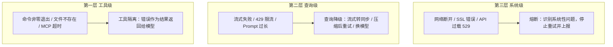
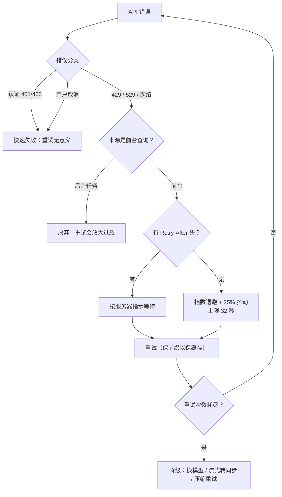

# 08-系统韧性与成本治理

> **定位**：本篇覆盖系统"活着且花得起"的全部机制：三层错误处理与重试策略（含前台/后台差异化、缓存感知重试）、成本控制管线（定价/计量/预算/收益递减检测/速率限制预警）、OAuth 多源认证与多进程 Token 刷新协调、可观测性体系（分层日志/遥测采样/类型系统隐私审计/Agent 自诊断）、启动生命周期（快速路径/并行预取/安全顺序）。读者画像：初学者。前置阅读：[01-Agent引擎与核心循环]。Java 对照锚定 [教程 05-Observation可观测]、[教程 07-Kafka事件骨干]、[教程 08-架构师进阶]。

## 8.1 三层错误处理

普通应用的错误是二元的（成功/失败）；Agent 的错误是光谱。Claude Code 分三层隔离，每层只处理自己关心的错误：

**第一层的关键哲学：工具错误不是异常，而是工具的输出。** 命令失败连同 stdout/stderr/退出码打包返回给模型，让模型自己决定下一步（换命令？查文件？报告用户？）。配套节俭细节：错误堆栈只保留前 5 帧——完整堆栈几百字符多是无关内部帧，浪费上下文。

**第二层是错误分类器**：超时、图片过大、限流（解析限流响应头给出具体配额信息）、Prompt 过长、认证失败、工具结果不匹配……每类映射到**用户和模型最有用的错误信息**，而非原始技术错误。还有一个容易被忽视的设计：**交互模式感知**——同一错误的恢复建议按场景分化（交互式说"按 Esc 重试"；脚本模式说"换一种方式读取文件"）。

**第三层的熔断**：持续 529 过载被识别为系统性问题，停止重试上报用户——不无限重试放大故障。

## 8.2 重试策略：不是一刀切

重试引擎本身是 AsyncGenerator——长时间重试等待中每个阶段 yield 进度（"第 N 次重试，等待 X 秒"），UI 不冻结。

### 前台/后台差异化（最精妙的设计）

529 过载错误**只有前台查询重试**：用户正在等待的主查询、SDK 调用、子 Agent、压缩、分类器在重试白名单里；后台任务（摘要、标题、建议）直接放弃。为什么？过载期间每次重试有 3-10 倍网关放大效应——**所有查询都重试会雪崩式加剧过载**。后台任务的失败用户看不见，但重试的代价全局承担。

### 指数退避 + 抖动

优先遵守服务器的 `Retry-After` 头（服务器最清楚何时恢复）；退避上限 32 秒；25% 随机抖动防雷鸣群效应。整体决策流如下：

### 降级重试优于盲目重试

| 场景 | 降级策略 |
|------|----------|
| 流式失败 | 降级为同步请求 |
| Prompt 过长 | 从错误消息解析超限 token 数，**精确压缩恰好足够的量**（不做不必要的全量压缩） |
| Fast Mode 限流 | 短暂限制（<20s）保持原模式重试保缓存；长期限制进入冷却期降级标准速度 |
| 主模型连续 3 次 529 | 回退备用模型（可用性优先于最优性；回退时剥离不兼容的思考块签名） |
| 输出上限溢出 | 精确计算剩余空间调低输出上限重试 |

**缓存感知重试**值得单独记住：Fast Mode 被短暂限流时宁可等待原样重试（保持同一请求前缀让 Prompt Cache 命中），也不切换参数重发（缓存全灭）——**重试决策要考虑对缓存的影响**。

### 快速失败清单

认证错误（401/403）不重试——同样凭证注定同样结果。唯一例外：托管远程模式下认证由基础设施 JWT 处理，401 更可能是暂态抖动，仍重试。**同样的错误码在不同部署模式下有不同语义**——设计原则要有明确的上下文条件。

**Java 转译**：React 的 `retryWhen(Retry.backoff(...).jitter(0.25).filter(...))` 原生支持指数退避+抖动+错误过滤；Resilience4j 提供熔断器/限流/重试。要点是**按错误类别与查询来源编写不同的重试谓词**，并把"是否值得重试"做成显式策略 Bean 而非散落的 try-catch。

## 8.3 成本控制

### 五维定价与缓存经济学

计费五维度：输入、输出、缓存写入、缓存读取、搜索请求次数。核心经济学事实：**缓存读取价格约为普通输入的十分之一**——因此 Agent 成本优化的最大杠杆不是减少调用次数，而是**保持上下文的可缓存性**（稳定的系统提示前缀、稳定排序的工具列表——回扣 03 篇）。未知模型不崩溃：用默认定价 + 记录遥测 + 在成本展示中标注"可能不准确"。

### 计量、持久化与展示

请求级：从 API 响应 usage 计算本次美元成本（含 advisor 等内部小模型的调用，递归累加）。会话级：按模型细分统计 + 进程退出时持久化完整会话统计（成本、API 时长、工具时长、代码增删行数），恢复时校验会话 ID 防错配。展示级：实时 token 计数、退出汇总、按模型分解、预算阈值警告。

### Token 预算与收益递减检测

子 Agent 可设 token 预算，检查逻辑里最精妙的是**收益递减检测**：模型连续 3 次续跑且每次新增 token 都很少 → 判定在做低价值重复工作 → 即使未达预算上限也停止。**不是"花够了就停"，而是"不再产生价值就停"**——这是成本控制从阈值管理升级为价值管理。

### 速率限制的渐进式预警

从限流响应头解析利用率：低于 70% 不警告（防每周重置后误报）→ 70%+ 早期预警 → 接近超额再警告 → 触顶明确告知配额类型（会话限额/周限额/特定模型限额）与重置时间。**渐进式预警让用户在接近限制时调整行为，而不是突然被中断。**

**Java 转译**：`gen_ai.client.token.usage`（Micrometer）+ 按租户/用户成本归因 + 预算上限拦截（见 [教程 05-Observation可观测/07]）——Claude Code 的"收益递减检测"可直接移植为 Agent 长任务的停止判据之一。

## 8.4 OAuth 与认证

### 多源优先级链

认证来源按优先级：环境变量（CI 注入）→ 文件描述符传递（避免命令行暴露）→ 外部脚本动态获取（企业密钥管理，带 **SWR 缓存**：过期值立即返回 + 后台刷新，用户无感）→ OAuth PKCE → 系统钥匙串 → 配置文件。细节品味：外部脚本失败用**哨兵值**而非 null——null 意味"没配置"（继续尝试其他源），哨兵意味着"配置了但失败"（不回退），**语义区分防止错误的认证源回退**。缓存失效用 epoch 计数防污染：异步刷新完成时若 epoch 已变（中间清除过缓存），结果丢弃。

### OAuth PKCE 与多进程协调

标准 PKCE 流程（本地随机端口回调 + state 防 CSRF）。真正的难点是**多进程**：多个终端共享同一 Token，A 进程刷新会让 B 进程的 Token 失效。三层协调：进程内去重（相同过期 Token 的所有 401 合并为一次刷新）→ 跨进程文件锁（拿锁后**双重检查**——等待期间别的进程可能已刷新）→ 跨进程缓存失效（每次读取前检查凭据文件的修改时间，变了就清内存缓存）。

### 安全边界

项目级配置可注入外部认证脚本（恶意项目攻击面）→ 必须先过**工作目录信任对话框**才允许执行。自定义 OAuth 端点只允许白名单。企业强制登录指定组织时，**组织验证从服务器取权威数据而非本地缓存**（本地配置用户可写）。

**Java 转译**：多租户 Java Agent 平台的等价物 = API Key 池管理 + OAuth on-behalf-of 流（见 [附录 08-Agent安全深度] 的机器身份专篇）+ 多实例 Token 刷新协调（分布式锁 + 双重检查 + 版本号比对，与 Claude Code 三层一一对应）。

## 8.5 可观测性

### 分层日志各司其职

| 通道 | 内容 | 受众 |
|------|------|------|
| 调试日志 | 一切细节，级别过滤，缓冲写（调试模式同步写防退出丢失） | 开发者 |
| 错误日志 | 内存环形缓冲 100 条 + Sink 持久化 | 用户/缺陷报告 |
| 遥测事件 | 结构化，采样收集，双后端路由 | 产品团队 |
| OTel Span | 请求级追踪（含首 token 延迟、重试次数、成本） | 性能工程 |

所有通道共用**队列-Sink 模式**：Sink 未初始化时事件进队列，挂载后排空——启动阶段基础设施未就绪也不丢事件、不阻塞启动。每次 API 调用的遥测极其丰富：token 分布（含缓存命中）、TTFT、按工具名分组的调用长度、压缩标记、查询链 ID 与深度——**这些字段就是性能优化、成本分析和体验改进的原料**。

### 隐私：类型系统强制审计

两个 `never` 类型的哨兵类型（名字直译："我已确认这不是代码或文件路径" / "我已确认这是 PII 标记字段"）：任何遥测字段必须显式 `as` 断言——编译能过，但代码审查时是醒目的强制确认点；普通 string 直接赋值会编译报错。PII 字段带前缀路由到有权限控制的存储，普通遥测后端收到的是剥离后的数据。**隐私设计是架构性的（入口把关），不是事后脱敏。**

### 诊断工具与 Agent 自诊断

`/doctor` 检测六类环境问题（安装残留、PATH 缺失、配置格式错误、沙箱平台限制……）；debug 技能让 **Agent 读取并分析自己的调试日志**（赋予只读工具集，搜索错误模式给出修复建议）——"Agent 诊断 Agent"可能是未来 Agent 可观测性的主流方向。IDE 诊断基线对比解决"Agent 的修改是否引入了新错误"：编辑前捕获编译器/lint 诊断基线，编辑后只报告**新增**诊断并回喂给模型。

**Java 转译**：Observation 体系完整对应（ span 树 / Handler / Convention，见 [教程 05-Observation可观测]）；`tengu_*` 事件表对应自定义业务观测事件；**"编辑后增量诊断回喂模型"强烈建议移植**——Java 里就是编译后增量 `DiagnosticCollector` 差异回喂，让 Agent 知道自己改坏了什么。

## 8.6 启动与生命周期

### 启动同时承担三件事

建立**速度感**（尽快显示系统活着）、建立**信任链**（用户确认前不放大权限）、建立**可工作性**（界面出现即接近可交互）。优化目标不是冷启动，而是**"到首次安全可交互的时间"**。

### 快速路径分流

`--version` 等命令在文件最顶部零导入直接返回；每个特殊模式（守护进程/桥接/脚本）动态导入自己需要的模块——**大多数非交互调用不应承担交互式 REPL 的启动成本**。快速路径定义了系统的"成本边界"：每加一个新模式都应在此分流，而不是拖慢所有人。

### 并行预取与早期输入

副作用导入在模块加载阶段就启动慢 I/O（钥匙串预取、设备管理读取），与后续几百毫秒的模块加载**重叠**；REPL 未就绪前就捕获用户键入，界面就绪后预填充——"用户不会等程序准备好才行动"。值得深思的推论：**用户面对的是被拟人化的执行体，迟钝会被归因为"不够聪明"**——启动优化保护的是系统的整体心理形象。

### 安全顺序 = 状态机

启动不是随手排的步骤，而是一组**必须满足偏序关系的承诺**（DAG）：环境变量分两阶段应用（信任确认前只注入安全的；确认后才注入可能含敏感信息的）；Hook 配置在信任确认前**阻塞式快照冻结**（防确认窗口内被篡改）；MCP 审批在信任确认后、配置错误先修复再审批。**性能工程与安全工程通过顺序编排同时成立**：能早做的并行预取，必须晚做的严格排序。

### 两类全局状态的分离

进程级状态（会话 ID、工作目录、累计成本——"设一次读多次"，模块级变量 + getter/setter，setter 内做不变量检查如"信任一旦接受不可撤销"）与 UI 级响应式状态（AppState）**严格分开**——前者是**进程真相**，后者是**界面真相**，混在一起既不安全也不清晰。进程状态放在导入依赖图的**叶子节点**（几乎不导入别人、被所有人导入），保证最先初始化且无循环依赖。

**Java 转译**：启动 = Spring 的 `ApplicationRunner` 分层 + 懒初始化（`@Lazy`/条件 Bean）+ 预热（连接池/HTTP 客户端提前握手）；安全顺序 = `SmartInitializingString` / `@Order` 显式表达偏序，敏感配置在信任校验 Bean 之后才加载；进程真相 vs 界面真相 ≈ 基础设施配置单例 vs 会话作用域状态。

## 8.7 本篇小结

- 错误三层隔离；工具错误是输出不是异常；重试按错误类别与查询来源差异化；**降级优于重试、缓存感知重试、精确压缩优于全量压缩**。
- 成本：缓存读取是十分之一价 → 可缓存性是最大杠杆；收益递减检测（不再产生价值就停）；渐进式限流预警。
- 认证：SWR 缓存 + 哨兵值语义 + epoch 防污染；多进程刷新 = 去重 + 文件锁双重检查 + mtime 缓存失效。
- 可观测：四通道分层 + 队列-Sink 保启动安全 + 类型系统强制隐私审计 + Agent 自诊断与增量诊断回喂。
- 启动：快速路径定义成本边界；尽早启动延后等待；**启动顺序本身是安全策略**；进程真相与界面真相分离。

## 8.7 设计哲学小结与适用场景

**本篇哲学一句话**：健壮性不在于"全正常时多强大"而在于"部分失败时还能做什么"；成本治理的最高形态不是花够了就停，而是不再产生价值就停。**适用场景**：任何进入生产的 Agent——错误分层与成本可见性没有"太小用不上"一说。**不适用场景**：一次性原型可以只做失败回填，其余后补。**选型建议**：重试按错误类别与查询来源差异化（前台重试/后台放弃）+ 成本台账 + 渐进式限流预警三项优先；"收益递减停止判据"是长任务 Agent 的隐藏必杀；启动安全顺序（敏感配置在信任校验后）在多租户场景是不可谈判项。
