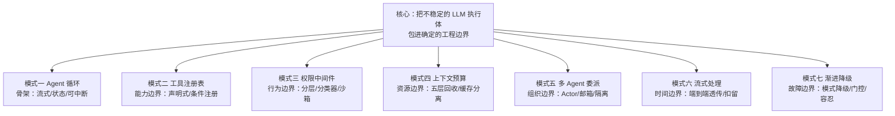
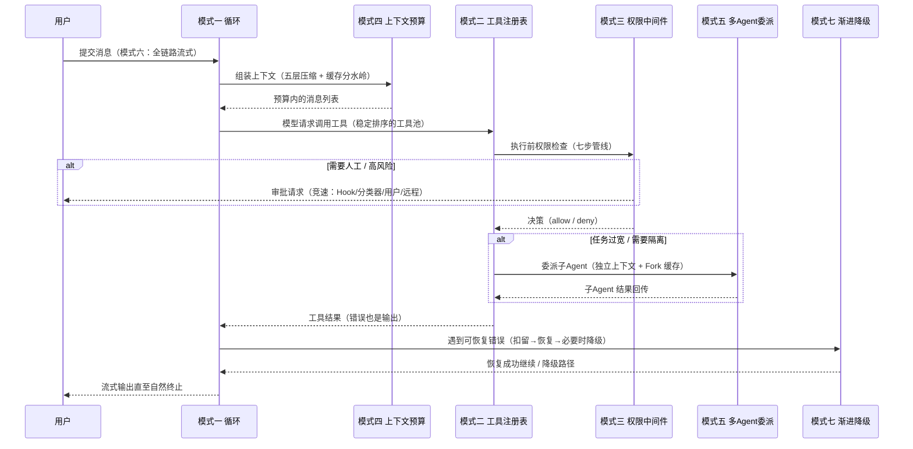

# 09-设计哲学与架构模式

> **定位**：本篇是全系列的合成篇：把 00-08 篇的横向子系统拧成一条设计主线——七个核心架构模式（每个模式回答一个 AI Agent 特有的设计问题）、八条给未来架构师的实践建议、以及对当前架构局限与演进方向的诚实评估。读者画像：已读完前面各篇或想直接取"结论"的读者。前置阅读：建议先读 [00-总览与架构全景]。

## 9.1 一条主线：把不稳定的执行体包进工程边界

如果把全部分析浓缩成一句话：**Claude Code 反复在做的一件事，是把一个本来模糊、不稳定、容易越界的 LLM 执行体，逐步包进可管理的工程边界里。**全书所有设计——状态、权限、上下文预算、恢复协议、插件边界、启动顺序——都在回答同一个问题：**如何让一个会思考但不稳定的系统，像可靠软件一样工作。**

这不是"把提示词写得更强"，而是**边界管理**。模型能力会继续变化，但边界管理能力才是真正可复用的架构资产——这正是 Java Agent 架构师相对于"提示词工程师"的护城河。

## 9.2 七大架构模式

每个模式 = 一个 AI Agent 特有的设计问题 + 被大规模验证的解法 + 可迁移的教训。

### 模式一：Agent 循环模式

**问题**：模型可能零次或多次调用工具，每次结果要回传再决策——循环何时结束、怎么中断、状态怎么保持是根本问题。
**解法**：AsyncGenerator（Java 世界等价物：响应式流 `Flux` + 取消信号）。流式输出、状态保持、可中断三位一体；天然背压。
**教训**：先设计循环原语，再围绕它建工具/权限/上下文系统——循环是骨架，其他一切都是器官。

### 模式二：工具注册表模式

**问题**：工具是动态的（MCP 可中途添加、Feature Flag 可排除、权限可过滤），如何统一注册、发现、调度、验证？
**解法**：声明式自描述接口（名称/Schema/安全属性/权限检查/执行）+ 工厂补 fail-closed 默认值 + 条件注册 + 稳定排序。
**教训**：不要硬编码 `if (toolName == "bash")` 分发表——让工具自描述，调度逻辑通过接口而非具体类型工作。工具接口的宽度应与横切关注点数量成正比。

### 模式三：权限中间件模式

**问题**：Agent 能执行任意代码、读写文件、访问网络——如何既灵活又可控？
**解法**：渐进式多层架构——粗粒度模式（六种）→ 细粒度规则（DSL）→ 运行时七步管线 → AI 分类器 → Hook 扩展 → 沙箱兜底 → 审计收尾。
**教训**：不要试图一次性设计完美权限系统——先有基础保护（Deny 最先、默认拒绝），再通过 Hook 和规则让用户按需扩展。安全的关键不是限制能力，而是**让用户理解并控制正在发生什么**。

### 模式四：上下文预算模式

**问题**：窗口有限，系统提示/工具定义/历史/工具结果在零和博弈。
**解法**：把上下文当内存管理——预算计算、五层渐进式回收、静态/动态分离保缓存、结构化记忆做压缩就绪的"随时可兑现"信息源。
**教训**：分级策略（不压缩 → 自动压缩 → 微压缩 → 折叠 → 截断），默认自动处理大部分情况。**上下文管理是 Agent 系统独有的"操作系统级"资源管理问题。**

### 模式五：多 Agent 委派模式

**问题**：单 Agent 受限于一个上下文窗口与串行执行。
**解法**：子 Agent 独立上下文/工具池/权限 + 消息传递协调（邮箱）+ Worktree 物理隔离 + Fork 缓存摊薄成本 + 强制规划协议（子 Agent 必须先提交方案给 Lead 审批）。
**教训**：遵循 **Actor 模型**而非共享内存——每个 Agent 是独立执行单元，通过消息而非共享状态协调。但多 Agent 不是免费午餐：它扩大吞吐也扩大协调成本。**真正适合的是能自然拆成多个责任边界的任务，而不是把本需统一判断的问题硬拆成多人会议。**

### 模式六：流式处理模式

**问题**：token 逐个到达，且工具调用嵌在流里——如何端到端流式？
**解法**：多层透传管道（SSE → 结构化事件 → 循环 yield → 渲染），任何中间层都不缓冲完整响应；扣留机制处理"不能立即下发的数据"；tombstone 处理"已发出但无效的数据"。
**教训**：流式不是 API 层用 SSE 就完了，而是**从数据源到 UI 每一环节都是流式**；缓冲必须是显式、有理由的。启动流程同样贯彻流式思想——界面未就绪就开始捕获用户输入。

### 模式七：渐进降级模式

**问题**：依赖大量外部服务（API/MCP/插件/OAuth），任何一个都可能失败。
**解法**：模式降级（交互式 → 脚本 → 最小模式）、MCP 失败不阻断启动（标记不可用 + 告知模型改用其他方案）、Feature Flag 门控、配置错误容忍（收集错误但不阻止启动）。
**教训**：健壮性不在于"全正常时多强大"，而在于"部分失败时还能做什么"。**渐进降级的意义不只是保底，而是定义主次关系**——明确知道什么是核心能力、什么是增强能力，系统受损时才能保持身份一致。

## 9.3 一条消息的完整旅程（合成视角）

把七个模式放进一次真实请求，看它们如何协作——这是全系列的"实现逻辑 What"收束：

读法提示：**模式的调用顺序就是可靠性的产生顺序**——循环管"一直转"，预算管"转得久"，注册表管"能做什么"，权限管"该不该做"，委派管"自己做还是派活"，降级管"出错怎么办"。六个子系统全部失效兜底的，是最外层那条朴素的原则：默认拒绝、fail-closed、用户始终可控。

## 9.4 给未来 AI Agent 架构师的八条实践建议

1. **先设计 Agent 循环，再设计其他一切。** 确定循环原语（响应式流/状态机/事件循环），再建外围系统。
2. **工具是 Agent 能力的边界，工具注册表是工具的宪法。** 声明式、自描述、统一调度、可测试。
3. **安全从第一行代码开始。** 信任边界、操作分级、审批点在架构设计期确定，不是事后补丁。
4. **上下文是有限资源，像管理内存一样管理它。** 分级策略 + 计量先行。
5. **流式体验不是优化，是基本要求。** 用户不该盯着空白屏 30 秒；每个中间层缓冲都要有理由。
6. **启动速度是用户留存的第一道关。** 快速路径、并行预取、延迟初始化——目标是"感觉快"，且不牺牲安全顺序。
7. **多 Agent 是 Actor 模型，不是共享内存。** 独立上下文、消息协调、明确故障域；按责任边界拆分而非硬拆。
8. **把可靠性理解成边界管理，而不是模型更聪明。** 这是全书最深的启示：状态、权限、上下文预算、恢复协议、插件边界、启动顺序——这些"确定性外壳"才是可复用的架构资产。

## 9.5 架构局限（诚实的评估）

没有任何架构完美，四个值得讨论的局限：

1. **全局状态单例膨胀**：进程级状态已积累约 100 个字段，文件顶部写着"不要再往这里加状态"但现实是每个新功能都需要存状态。长期需要按功能域拆分。**教训：全局单例的维护警告挡不住组织性的熵增，需要在架构上给出扩展位。**
2. **入口"上帝函数"**：主入口超 3000 行，多模式分支纠缠。改进方向：每种运行模式提取为独立"入口策略"（策略模式替换 if-else 森林）。
3. **工具接口的多样性伪装**：统一接口下，同步文件操作、长时子进程、复合多步工具的实际执行模式差异巨大，靠内部类型字段区分而非类型系统多态——统一接口有它的表达极限。
4. **测试的局部困难**：全局状态 + 副作用（环境变量/文件系统/子进程）使部分单元测试困难，测试间需要重置状态——这是全局可变状态的经典代价。窄接口依赖注入（01 篇）正是对此的补救。

## 9.6 未来方向

四个可能的演进，每个都值得 Java 架构师对照自身路线图：

1. **从单进程到多进程**：子 Agent 目前在进程内隔离，更强的故障隔离需要真多进程 + IPC——对应 Java 微服务化 Agent 拆分（项目 05 中台）。
2. **持久化 Agent 状态**：跨重启保持"记忆"的持久状态层——对应事件溯源会话运行时（项目 13）。
3. **声明式 Agent 定义**：用配置而非代码定义 Agent 行为（类 Kubernetes Operator 模式）——对应 Java 侧的编排 DSL 与低代码 Agent 平台。
4. **更精细的上下文管理**：从"全有或全无"压缩走向分层保留——关键决策永久保留、实现细节按需压缩、错误日志直接丢弃。

## 9.7 转译到 Spring AI / Java 生态（全系列收束）

七个模式在 Java 技术栈的完整映射表：

| 模式 | Claude Code 实现 | Java / Spring AI 2.0 对应 |
|------|-----------------|--------------------------|
| Agent 循环 | AsyncGenerator query() | `ChatClient` 流式调用 + `ToolCallingManager` 工具循环 + `Flux` 取消传播 |
| 工具注册表 | Tool 接口 + buildTool + tools.ts | `@Tool`/`@ToolParam` + `ToolCallback`/`ToolCallbackProvider` + 条件化工具池 Bean |
| 权限中间件 | 七步管线 + 分类器 + 沙箱 | 规则引擎 + HITL 审批流 + 容器沙箱 + 审计事件（项目 05/06 落地） |
| 上下文预算 | 五层压缩 + 分水岭 | `ChatMemory` 自研 Repository + 检索前压缩策略 + Prompt Cache 前缀设计 |
| 多 Agent 委派 | AgentTool + 邮箱 + Worktree | 递归 ChatClient + 消息队列协调（Kafka）+ 每任务隔离工作区/容器 |
| 流式处理 | SSE 全链路透传 | WebFlux `Flux<ServerSentEvent>` 端到端 + 背压 + onError 恢复（教程 01 系列） |
| 渐进降级 | 模式降级 + Flag 门控 | `@ConditionalOnProperty` + 配置中心灰度 + 模型路由降级（教程 08 系列） |

想动手落地的读者：直接进入 [10-Java工程师借鉴手册]，那里按"可以直接抄进 Java 项目"的粒度重新组织了全部结论，并附实现要点与验证方法。

## 9.8 结语

设计 AI Agent 系统不是设计普通应用程序：它要求同时思考模型的能力边界、用户的安全需求、长时运行的资源管理、流式交互的体验质量、多 Agent 协作的复杂性。Claude Code 提供了一个经大规模验证的参考实现——它不完美（9.4 节），但每一个设计选择背后都有清晰的工程推理。

对 Java Agent 架构师而言，最高效的学习路径不是照搬代码，而是**把七条边界（循环/工具/权限/资源/组织/时间/故障）逐条映射到 Spring 技术栈**，在项目实践中把"边界管理"变成肌肉记忆。建议的实践顺序：先用 10 篇的验证清单跑通一个最小闭环（循环 + 工具池 + 权限门），再逐篇补齐上下文预算、委派隔离与降级链——每补一条边界，你的系统就离"工业级"近一步。

## 9.9 适用场景与选型建议

**本篇哲学即全系列哲学**：把会思考但不稳定的执行体包进确定的工程边界——七个模式各守一条边界（循环/工具/权限/资源/组织/时间/故障）。**适用场景**：架构决策期与架构评审期——八条实践建议（§9.4）可直接当评审清单用；每一个"要不要做 X"的争论，先对照"这属于哪条边界、边界内的冠军方案是谁"。**不适用场景**：具体编码期（应转 [10-Java工程师借鉴手册]）。**选型建议**：把 §9.4 的第 8 条（边界管理是可复用资产）作为团队共识基线——它决定了你们雇的是"边界设计师"还是"提示词调参员"。
