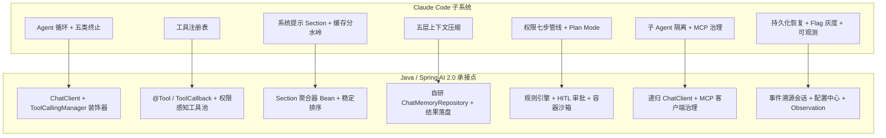
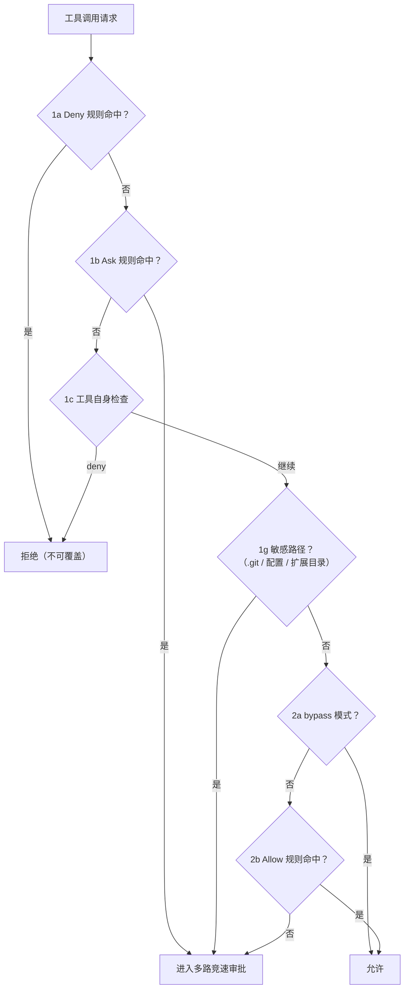

# 10-Java工程师借鉴手册

> **定位**：本篇是全系列的落地篇：把 00-09 篇的全部核心知识点逐条映射为 Java / Spring Boot 4.1 + Spring AI 2.0 的可落地做法，按"知识点 → 为什么要抄 → Java 怎么做（含代码骨架）→ 验证方法"组织。读者画像：准备动手的 Java 工程师。前置阅读：[09-设计哲学与架构模式]（结论地图）。所有代码基于本项目技术栈（Spring Boot 4.1.0 / Spring AI 2.0.0 / WebFlux / Java 21），已实证的 API 直接给出；未实证处显式标注"概念代码"。新增依赖需在 pom.xml 中自行添加（文中给出坐标但不改 pom）。

## 10.1 知识点总映射表

先看一张全系列知识如何装进 Java 系统的结构图——左边是 Claude Code 的子系统，右边是 Spring 技术栈的承接点，后面各节按优先级展开：




| # | Claude Code 知识点 | 详见 | Java 落地优先级 | 本篇节 |
|---|--------------------|------|----------------|--------|
| 1 | AsyncGenerator Agent 循环 + 五类终止路径 | 01 | ★★★ 必抄 | 10.2 |
| 2 | 工具注册表（声明式 + fail-closed 默认值 + deny 预过滤 + 稳定排序） | 04 | ★★★ 必抄 | 10.3 |
| 3 | 工具并发安全判定 + 并行激发 | 01/04 | ★★☆ | 10.3 |
| 4 | 系统提示 Section 化 + 缓存分水岭 | 03 | ★★★ 必抄 | 10.4 |
| 5 | 五层上下文压缩管道 | 02 | ★★☆ | 10.5 |
| 6 | 三层记忆 + SessionMemory 后台提取 | 02 | ★★☆ | 10.5 |
| 7 | 权限七步管线 + deny 最先 + 多路竞速审批 | 05 | ★★★ 必抄 | 10.6 |
| 8 | Plan Mode（硬约束思考/行动分离） | 01 | ★★★ 必抄 | 10.6 |
| 9 | 工具错误是输出不是异常 + 分层重试/降级 | 08 | ★★★ 必抄 | 10.7 |
| 10 | 成本计量 + 收益递减检测 + 缓存经济学 | 08 | ★★☆ | 10.7 |
| 11 | 子 Agent 上下文隔离（默认隔离显式共享） | 04/06 | ★★☆ | 10.8 |
| 12 | MCP 治理（命名空间 deny / 配置审批 / 传输抽象） | 04 | ★★☆ | 10.8 |
| 13 | 会话持久化（增量写 + 中断检测续行） | 07 | ★★☆ | 10.9 |
| 14 | Feature Flag 双层（编译期/运行期）+ 灰度回滚 | 07/08 | ★★☆ | 10.10 |
| 15 | 队列-Sink 可观测 + 增量诊断回喂 | 08 | ★★☆ | 10.11 |
| 16 | 启动安全顺序 + 快速路径 | 08 | ★☆☆ | 10.12 |

## 10.2 Agent 循环的 Java 实现

**为什么要抄**：循环是骨架。五类终止路径（自然完成/轮次上限/用户中断/预算上限/错误）缺一就是生产事故。

**Java 做法**：Spring AI 2.0 的 `ChatClient` 内置了工具执行循环（模型请求工具 → `ToolCallingManager` 执行 → 结果回传 → 再次调用），你不必手写 while(true)。架构师要做的是**在循环外围加护栏**。注意：Spring AI 2.0.0 中不存在 `internalToolExecutionEnabled` 这个配置（已实证），工具执行编排通过 `ToolCallingManager` 与 `ToolCallingChatOptions` 控制。

```java
// 概念代码：Agent 循环护栏（骨架，需按项目实际补充依赖注入）
@Service
public class GuardedAgentService {

    private final ChatClient chatClient;   // Spring AI 2.0.0
    private final CostLedger costLedger;   // 自研：成本台账（10.7）

    public Flux<ChatResponse> run(String conversationId, String userMessage) {
        return chatClient.prompt()
                .user(userMessage)
                .options(buildToolOptions())      // 工具池按权限组装（10.3/10.6）
                .advisors(a -> a.param(ChatMemory.CONVERSATION_ID, conversationId))
                .stream()
                .chatResponse()
                // 护栏 1：轮次/时长上限 —— 工具循环在 ChatClient 内部，
                // 轮次护栏落在 ToolCallingManager 装饰器层统计并抛出终止异常
                .takeUntil(resp -> costLedger.exceeded(conversationId))  // 护栏 2：预算熔断
                // 护栏 3：取消传播 —— WebFlux 下游断开自动沿订阅链向上取消，
                // 在 doOnCancel/doFinally 中为已发出未配对的 tool call 补"取消态"结果
                .doFinally(sig -> costLedger.flush(conversationId));
    }
}
```

**验证方法**：单元测试注入 mock `ChatModel`（返回预编排的工具调用序列），断言：超轮次抛终止信号；取消时每个 tool_use 都有配对结果；预算触及时流被截断且台账落库。**读写两端都验证**：持久化后重放（resume）测试必须跑两遍——首次成功不算数，第二次读回才是真验证。

## 10.3 工具注册表：四件套直接抄

**Java 做法**：

1. **声明式定义**：Spring AI 2.0 的 `@Tool`/`@ToolParam`（注意 `@ToolParam` 只有 `required()`/`description()`，没有 `value()`——已实证）。
2. **fail-closed 默认值**：工具元数据接口提供保守默认（并发安全=false、只读=false），只有显式声明才放宽。
3. **deny 预过滤**：按租户/角色过滤工具池——被禁工具**不注册**进 `ToolCallback` 列表，模型看不到自然不会调用。
4. **稳定排序**：内置工具按名排序为连续前缀，MCP 工具排序后追加——保 Prompt Cache。

```java
// 概念代码：权限感知的工具池组装器
@Component
public class PermissionAwareToolPool {

    private final List<ToolCallback> builtinTools;   // 内置工具（含安全元数据）
    private final ToolCallbackProvider mcpTools;     // MCP 工具（SyncMcpToolCallbackProvider 提供）
    private final ToolRuleEngine ruleEngine;         // 自研 deny/allow 规则引擎（10.6）

    public List<ToolCallback> assemble(ToolPermissionContext ctx) {
        // 1. deny 预过滤：被禁工具不进池
        List<ToolCallback> builtin = builtinTools.stream()
                .filter(t -> !ruleEngine.denied(t.getName(), ctx))
                .sorted(Comparator.comparing(ToolCallback::getName))   // 2. 稳定排序
                .toList();
        List<ToolCallback> mcp = Stream.of(mcpTools.getToolCallbacks())
                .filter(t -> !ruleEngine.denied(t.getName(), ctx))
                .sorted(Comparator.comparing(ToolCallback::getName))
                .toList();
        // 3. 内置连续前缀 + MCP 追加；重名内置优先
        return Stream.concat(builtin, mcp).collect(Collectors.toList());
    }
}
```

**并发安全判定**：为工具定义 `boolean concurrencySafe(ToolInput input)` 元数据接口，自研调度器实现三规则（空闲任意启动/安全+安全可并行/遇不安全排队），结果**按发起顺序**产出。若用 Spring AI 默认串行工具执行可先不做，但**多只读工具并行**对延迟收益巨大，值得自研调度层。并行激发在提示词侧同步加一句（见 10.4 工具偏好段）。

**验证方法**：契约测试每个工具的 Schema 可被模型 JSON Schema 消费；deny 过滤的单测覆盖"规则命中/不命中/规则来源叠加"；排序稳定性测试（MCP 工具集变化后内置前缀字节不变）。

## 10.4 系统提示 Section 化 + 缓存分水岭

**Java 做法**：把系统提示从字符串常量升级为 Section 聚合器。

```java
// 概念代码：Section 化系统提示
public interface SystemPromptSection {
    String name();
    Supplier<String> compute();     // 惰性计算
    boolean cacheable();            // false 必须附 reason
    String reason();                // cacheable=false 时的原因（给维护者）
}

@Component
public class SystemPromptAssembler {
    private final List<SystemPromptSection> sections; // Spring 注入全部实现

    public String assemble() {
        // 铁律：可缓存（稳定）段在前，动态段在后 —— Prompt Cache 前缀稳定性
        // 工具列表顺序已在 10.3 固定；运行时依赖段一律归动态侧
        StringBuilder sb = new StringBuilder();
        sections.stream()
                .sorted(Comparator.comparing(s -> !s.cacheable()))  // 稳定段排前
                .forEach(s -> sb.append(s.compute().get()).append('\n'));
        return sb.toString();
    }
}
```

静态段建议直接翻译采用 Claude Code 的分层内容（见 03 篇中文全文）：身份一句话 / 任务哲学（不过度工程化、三行相似好过过早抽象）/ 操作安全（可逆自由执行、不可逆先确认）/ 工具偏好（专用工具优先、**最大化并行工具调用**）/ 输出风格（简洁、不用 emoji）。按"用户群体 × 运行模式"两维切换 Section 组合（`@Profile`/配置开关）。

**验证方法**：聚合结果的**前缀稳定性测试**——两次组装（中间增删一个动态段）输出 diff 必须只出现在分水岭之后；给调用 DeepSeek/Anthropic 缓存计费的账单核对缓存命中率提升。

## 10.5 上下文压缩与记忆

**Java 做法**（对应五层管道的 Java 简化版，按性价比排序）：

1. **工具结果预算**（零成本，最先做）：工具结果超阈值（如 100K 字符）落盘对象存储，上下文只留路径引用 + 前 N 行预览。在自定义 `ToolCallResultConverter`（Spring AI 2.0 真实扩展点，默认实现是 toString 序列化——已实证）中实现。
2. **微压缩**：`ChatMemoryRepository` 读取时把"已消费"的旧工具结果替换为占位符 `[旧工具结果内容已清除]`。
3. **自动压缩**：token 超阈值时用廉价模型生成 9 段结构化摘要（用户意图/技术概念/文件与代码/错误与修复/解题过程/用户消息/待办/当前工作/下一步），带**递归防护**（摘要调用自身不再触发压缩）与**熔断**（连续失败 3 次停止）。
4. **消息配对不变量**：任何截断不得拆散 tool_use/tool_result 对（API 硬约束）。

**记忆**：`ChatMemory.get(String)` 单参签名（已实证）；持久化自研 `implements ChatMemoryRepository`（2.0.0 官方仅 `InMemoryChatMemoryRepository`——已实证）。**序列化铁律（2026-08-22 教训）**：Spring AI 的 `Message` 及子类是 private final 字段、无 Jackson Creator，任何直接 JSON 持久化都会在读回时炸——**必须存 `Map`（type/content/metadata）+ 按 `MessageType` 用 builder 重建**，并对真实对象做 serialize→deserialize round-trip 验证。SessionMemory 模式：后台定时任务把会话关键信息提取到结构化文档（当前状态/错误与纠正/经验教训），压缩时直接取用实现零 LLM 成本压缩。

## 10.6 权限与 HITL：把七步管线搬进 Java

七步管线的执行顺序在 Java 里就是一串卫语句——**顺序即安全**，画出来对照实现最不容易写错：



**Java 做法**：权限评估做成**无副作用纯函数**，副作用（审批 UI/审计）在后置阶段。

```java
// 概念代码：七步权限管线（顺序即安全）
public PermissionDecision evaluate(ToolCallRequest req, ToolPermissionContext ctx) {
    if (ruleEngine.firstMatchDeny(req, ctx).isPresent())            // 1a Deny 最先，不可覆盖
        return PermissionDecision.deny("rule");
    if (ruleEngine.firstMatchAsk(req, ctx).isPresent())             // 1b Ask 规则
        return requireApproval(req);
    var toolDecision = toolSelfCheck(req);                          // 1c 工具自身检查（可递归拆子命令）
    if (toolDecision.isDeny())  return PermissionDecision.deny("tool");
    if (safetyCheck.hitsSensitivePath(req))                         // 1g 敏感路径：bypass 模式也必须问
        return requireApproval(req);
    if (ctx.mode() == Mode.BYPASS) return PermissionDecision.allow("bypass"); // 2a 在全部检查之后
    if (ruleEngine.firstMatchAllow(req, ctx).isPresent())           // 2b Allow 规则
        return PermissionDecision.allow("rule");
    return requireApproval(req);                                    // 3 默认拒绝
}
```

**多路竞速审批**：需要人工时并行发起四路（审批 UI 推送 / 规则化 Hook 自动应答 / 廉价 LLM 分类器 / 移动端消息渠道），`CompletableFuture.anyOf` 取最先到达者 + 原子抢位保证只采纳一次。**拒绝追踪**：连续拒绝 3 次自动升级强人工——防 Agent 与安全策略系统性冲突时无限重试。

**Plan Mode 等价物**：会话状态机加 `plan` 模式——plan 下工具池**物理移除**全部写工具（只留只读工具 + plan 文件写入白名单），退出必须走审批。落点提示：HITL 正确位置是 `ToolCallingManager` 装饰器或 `ToolCallback` 包装层，**不是 Advisor**（已实证结论）；敏感路径检查在 bypass 模式下仍生效（`.git`、配置文件类操作永不自动放行）。

## 10.7 错误处理与成本治理

**工具错误是输出**：工具执行失败打包 `{stdout/stderr 摘要, 退出码, 简短堆栈(≤5 帧)}` 作为 tool_result 返回模型，不抛异常中断循环。**分层重试**（Reactor 原生）：

```java
// 概念代码：按错误类别与来源差异化的重试
private Retry retrySpec(QuerySource source) {
    return Retry.backoff(3, Duration.ofSeconds(1))
            .maxBackoff(Duration.ofSeconds(32))
            .jitter(0.25)
            .filter(err -> isTransient(err) && isRetryableFor(source, err));
    // isRetryableFor：前台查询重试 529/429；后台任务直接失败（防过载放大）
    //                401/403 一律快速失败；"Retry-After" 头优先于退避计算
}
```

**降级链**：流式失败→同步重试；上下文超长→从错误消息解析超限 token 数做**精确压缩**；主模型连续失败→路由备用模型（见 [教程 08-架构师进阶] 模型路由）。

**成本治理**：Micrometer 计 `gen_ai.client.token.usage`（配置键 `spring.ai.chat.observations.log-prompt|log-completion` 控制内容记录——已实证，不存在 `include-prompt-content`）；按会话/租户归因入台账；**收益递减停止判据**（连续 3 轮增量 token 低于阈值即停）；限流预警分 70%/85%/100% 三档。缓存经济学落地：稳定前缀（10.4）+ 稳定工具排序（10.3）+ 重试保前缀（同参数重试而非改参重发）。

## 10.8 子 Agent 与 MCP 治理

**子 Agent**：递归 `ChatClient` 调用 + **独立会话 ID/记忆空间/工具池**。隔离清单（默认隔离、显式共享）：克隆文件缓存不回传、空消息历史、子取消控制器挂父、全局状态 no-op 但任务注册穿透。异步委派条件由**系统参与决定**（长任务/协调器模式强制异步），不完全信任模型选择。缓存优化（Fork 等价物）：子 Agent 复用父的系统提示与历史前缀，只追加任务后缀——Prompt Cache 命中摊薄委派成本。

**MCP**：坐标 `spring-ai-starter-mcp-client`（无 webflux 变体；WebFlux 走 `mcp-spring-webflux`——已实证）；客户端 `io.modelcontextprotocol.client.McpSyncClient`，工厂 `McpClient.sync(transport)`；`@Tool` 暴露为 MCP 工具需显式 `SyncMcpToolCallbackProvider` Bean。治理三件套直接抄：**工具名命名空间**（`mcp__server__tool`）支持前缀 deny；**项目级配置需用户审批**（`.mcp.json` 类配置是注入攻击面）；连接失败不阻断启动（标记不可用 + 继续服务）。Elicitation（执行中确认）在 Java 侧映射为工具执行中间态的 HITL 回调。

## 10.9 会话持久化与恢复

**Java 做法**：消息表用 `(uuid, parent_uuid, session_id, seq, payload)`——**parentUuid 链表达并行工具调用分支**；写入走"关键节点阻塞 + 其余批量"（下一轮 LLM 调用前必须落盘，进度类消息可异步）；恢复管线四步：沿 parentUuid 回溯成线性序列（带循环检测）→ 找回并行分支孤儿 tool_result → 清洗未配对 tool_use → **中断检测**（末条是 tool_result = 执行中断，自动注入"从中断处继续"消息）。多态序列化铁律见 10.5。

## 10.10 Feature Flag 与灰度

**编译期**：Maven Profile / `@ConditionalOnProperty` 让未启用功能连 Bean 都不注册（等价 Bun 的死代码消除）。**运行期**：配置中心（Nacos/Apollo）+ 五层解析链（环境变量覆盖 → 配置覆盖 → 内存缓存 → 磁盘缓存 → 默认值）；**灰度与紧急回滚是一等公民**——运行期 Flag 关闭新功能不用重发版。API 哲学照抄：`可能过时的缓存读取` 优于隐式阻塞读取，**函数名告知局限**。

## 10.11 可观测性

Observation 体系对号入座：领域上下文 `ToolCallingObservationContext`（非 ToolObservationContext——已实证）；时长用 `ctx.put/get(Object)` 计时、TraceId 用 `Tracer.getCurrentSpan()`（`Observation.Context` 无 getDuration/getTraceId——已实证）。四个可直接抄的点：

1. **队列-Sink**：Sink 未就绪时事件入内存队列，挂载后排空——启动期不丢观测数据。
2. **丰富事件字段**：每次 LLM 调用记录 token 分布（含缓存命中）、TTFT、重试次数、按工具名分组的调用长度、压缩标记、查询链 ID 与深度。
3. **增量诊断回喂**：Agent 修改代码后，编译器增量 `DiagnosticCollector` 差异（只报**新增**错误）作为 tool_result 回喂——让 Agent 知道自己改坏了什么。这是性价比最高的一条。
4. **隐私入口把关**：遥测字段白名单 + 敏感字段显式确认标记（等价于 never 哨兵类型），而非事后脱敏。

## 10.12 启动顺序与进程真相

- **启动 = 偏序 DAG**：敏感配置在信任校验之后加载、Hook 配置信任前冻结快照、审批在配置无错后才执行——用 `@Order`/`SmartInitializingSingleton` 显式表达，**顺序本身是安全策略**。
- **快速路径**：健康检查/版本类端点零依赖直达；非交互模式不承担交互模式的初始化成本。
- **尽早启动延后等待**：慢 I/O（密钥、远端配置）与模块加载并行预热（连接池/HTTP 客户端提前握手）。
- **进程真相 vs 界面真相分离**：基础设施单例（会话 ID、成本累计——设一次读多次，setter 做不变量检查）不放响应式状态里；全局单例放导入图叶子（被所有人导入、不导入别人）防循环依赖。

## 10.13 验证清单（交付前自查）

1. **循环护栏**：超轮次/超预算/取消三类终止测试通过；取消后 tool_use 无孤儿。
2. **缓存稳定性**：动态段变更后请求前缀字节级不变；账单缓存命中率可观测提升。
3. **序列化 round-trip**：`Message` 持久化用独立最小程序做 serialize→deserialize，打印读回真实类型（防 LinkedHashMap 陷阱）。
4. **权限不变量**：Deny 规则在 bypass 模式下仍生效；敏感路径操作 bypass 免疫；权限元数据本身对 Agent 不可写（防自我提权）。
5. **配对不变量**：任何压缩/截断后 tool_use 与 tool_result 一一配对（可用 JSONL diff 脚本批量校验）。
6. **降级链演练**：主模型 5xx→备模型切换、流式→同步、超长→精确压缩，三条路径各有一次真实注入演练记录。
7. **Mermaid 与死链**：本系列所有文档 `scripts/check-mermaid-audit.py` 0 发现、相对链接 0 死链。

---

至此全系列完结。回到起点的那句话：**模型能力会继续变化，边界管理能力才是可复用的架构资产。**愿你把七条边界（循环/工具/权限/资源/组织/时间/故障）一条条搬进自己的 Java Agent 系统。

## 10.14 适用场景与实施顺序建议

**适用场景**：已决定在 Spring AI 2.0 上自建 Agent 平台/会话引擎、需要把本系列分析变成施工顺序的团队。**不适用场景**：还在选型"自研 vs 采用"阶段（先回 [00-总览与架构全景] 做决策）。**实施顺序推荐**（与依赖关系一致，勿跳跃）：①失败回填基类 + 五类终止护栏（第一天，防御底线）→ ②权限感知工具池 + deny 预过滤 → ③七步权限管线 + 审批缓存 → ④五层压缩管道前两层 + 缓存分水岭 → ⑤成本台账 + 收益递减判据 → ⑥子 Agent 与编排 → ⑦Feature Flag 灰度。每步过 §10.13 验证清单再进下一步——**验证清单比代码更重要**，它防止"看起来做完了"。
