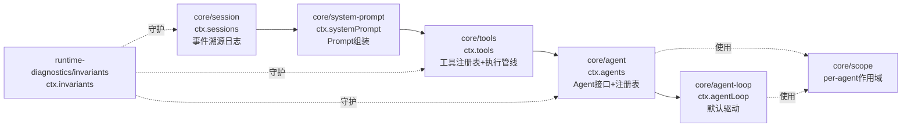
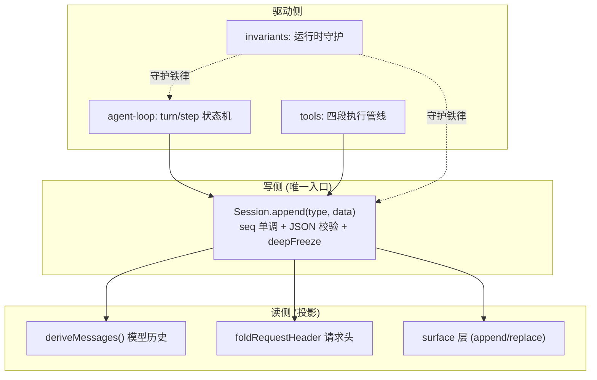
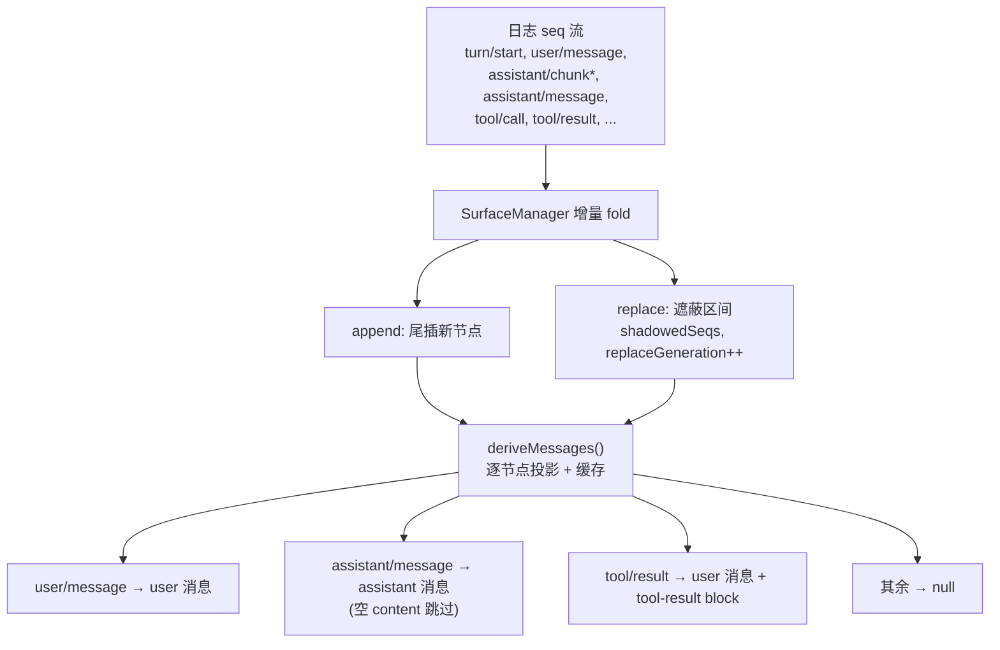
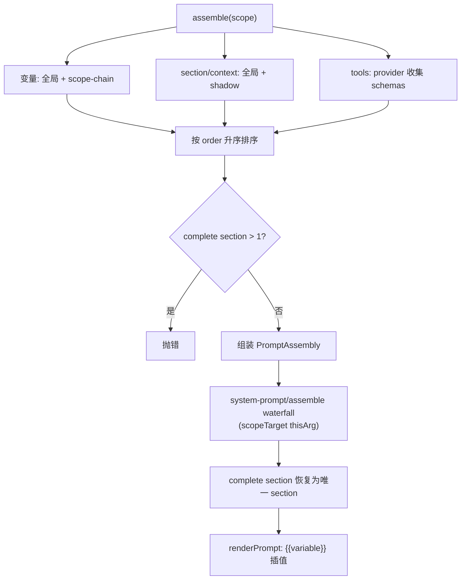
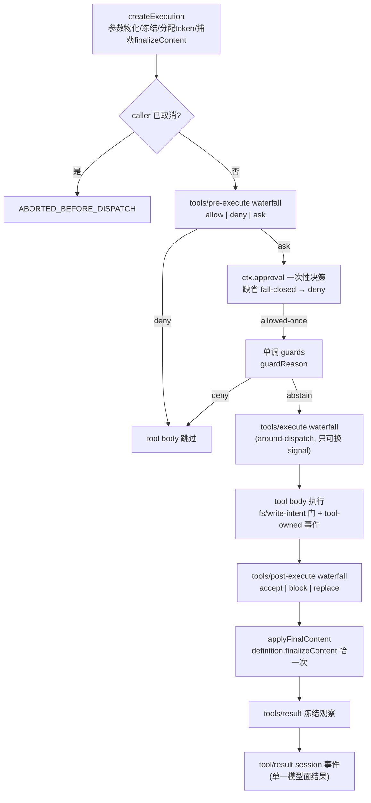
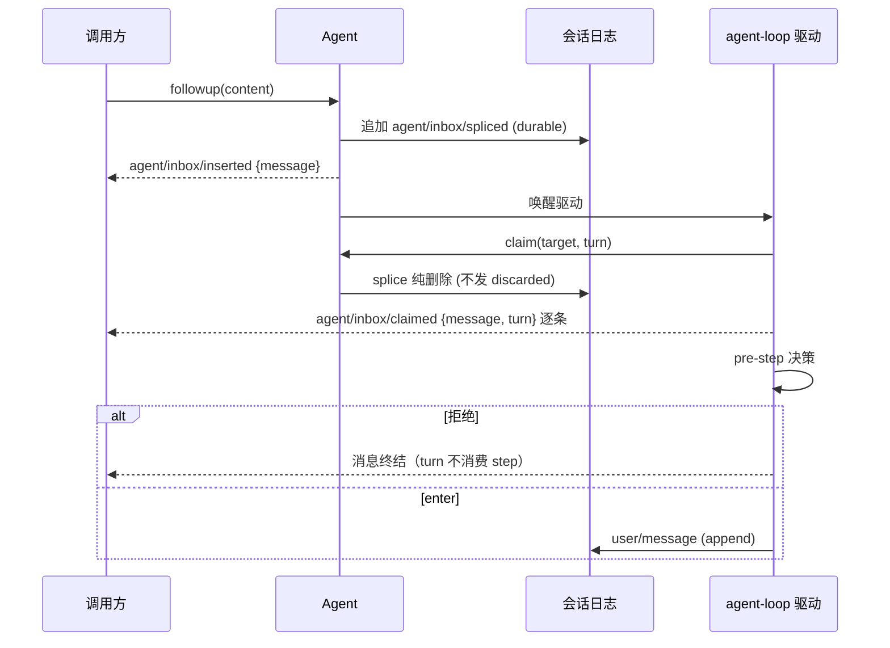
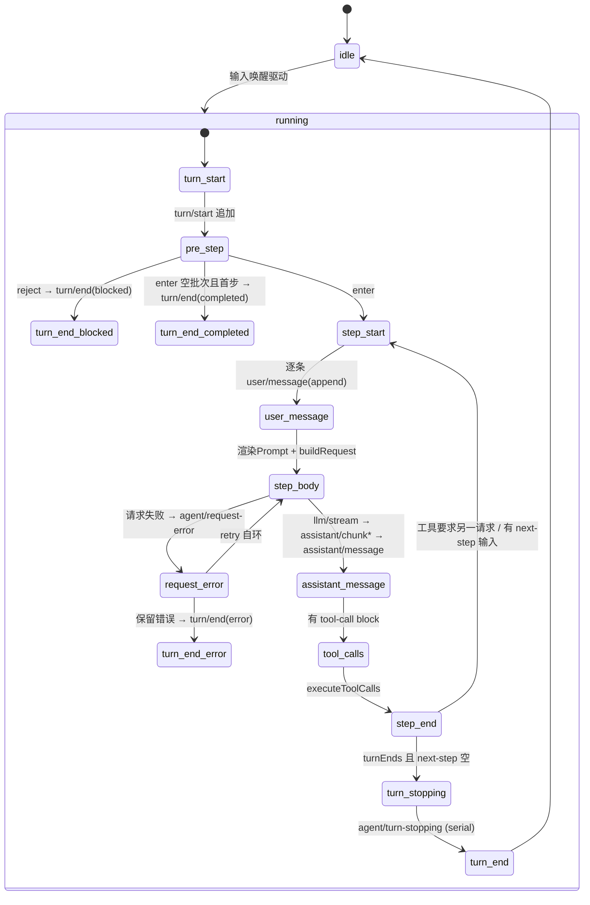

> **定位**：本文深入 DeepSeek Harness 的引擎心脏——`packages/core/` 六个 spine 包与 `runtime-diagnostics/invariants`。读完你将理解「事件溯源会话日志 + 可替换组装/执行管线 + 可替换 Agent 驱动 + per-agent 作用域」这套核心骨架如何运转，以及「Model-visible means logged」这一铁律如何被做进运行时不变式。前置阅读：[00-总览与架构解析]、[01-Cordis插件范式与运行时]。
> **代码位置**：`packages/core/{session,system-prompt,tools,agent,agent-loop,agent-default-model,agent-tool-presentation,scope}`、`packages/runtime-diagnostics/invariants`。

## 一、领域概览：核心引擎在设计上回答什么问题

**设计问题**：一个 Agent 框架的心脏必须同时回答四个问题——**会话怎么被信任**（崩溃后能重建吗）、**扩展点设在哪**（加工具/加策略不动核心吗）、**模型与工具怎么协作**（多轮工具调用怎么循环）、**能力怎么隔离**（每个 Agent 的能力世界怎么划界）。核心引擎的六包 spine 就是这四个问题的答案。

官方 `docs/architecture.md` 的定调一句话：**dsh 没有特权内核**——模型适配器、工具注册表、会话日志、Agent 主循环本身都是插件（`docs/architecture.md:11`）。核心引擎由六个包组成一条 spine：



### 本领域的设计哲学（Why）

本领域是「一切皆插件」与「日志即真相」两条全局哲学（见 [11-设计哲学与架构模式 §二]）的最集中落地点，另有三条领域特有原则：

1. **Model-visible means logged（模型可见即落日志）**——任何进入模型请求的内容必须能从会话日志重建，且由运行时不变式守护。**为什么**：可重放、可审计、可恢复是生产 Agent 会话的地基；没有它，「会话状态」只是进程内存里的易失假设。**代价**：新增模型可见输入必须新增 session 事件，扩展有仪式成本；删除/修改要用 surface `replace` 语义，读侧要 fold。
2. **状态是投影，不是第二份真相**——surface 层、inbox、请求头、派生视图全部从日志折叠。**为什么**：任何「第二份状态」都是状态不一致的温床（内存态和日志态漂移，崩溃后无法恢复）；让数据当唯一权威，重放即自洽。**代价**：折叠有计算成本，系统配套投影缓存、写缓冲、冷读阶梯来摊薄。
3. **工具策略外置，工具不关心策略**——执行管线把 pre/guards/execute/post 分成独立 waterfall，策略插件不 import 工具。**为什么**：治理插桩不污染执行，同一个工具可被不同策略服务；删掉策略插件工具仍能裸跑。**代价**：工具调用多了一层间接，一次调用要穿过四个扩展点。

| 包 | ctx key | 职责 | 类型定位 |
|---|---|---|---|
| `core/session` | `ctx.sessions` | 追加式 `SessionEvent` 日志与内存 store，单一事实源 | 核心骨架 |
| `core/system-prompt` | `ctx.systemPrompt` | Prompt section 与工具 schema 组装 | 核心骨架 |
| `core/tools` | `ctx.tools` | 作用域工具注册表 + 守卫执行管线 | 核心骨架 |
| `core/agent` | `ctx.agents` | `Agent` 接口、活动注册表、initiator 作用域、`agent/*` 事件词表 | 核心骨架 |
| `core/agent-loop` | `ctx.agentLoop` | 实现 `Agent` 接口的默认具体驱动 | 核心骨架 |
| `core/agent-default-model` | `ctx.agentDefaultModel` | 无会话级模型选择时提供部署默认模型 | 支持 |
| `core/agent-tool-presentation` | 无 | agent preset 携带的行：声明该 agent 看到哪种工具形态 | 支持 |
| `core/scope` | 无（库） | per-agent 作用域注册原语 | 库 |
| `runtime-diagnostics/invariants` | `ctx.invariants` | 包属运行时不变式注册服务 | 诊断 |

> 核心包的 `package.json` 均**未声明 `dsh` 字段**（`dsh.profile`/`dsh.bundle` 只出现在 bundle/profile 包上）；每个核心包通过 `exports` 暴露 `./invariant` 伴随子路径（`agent/session/tools` 另暴露 `./types`、`session` 暴露 `./surface`）——**不变式伴随插件挂在包名子路径上**。

### 核心引擎的一句话架构



## 二、session：事件溯源日志（唯一的真相）

### 2.1 数据结构

Session 是**追加式日志**：`seq = log.length`（连续契约）。`SessionEvent` 是以 `type` 为判别键的**真联合**（`session/src/types.ts:404`）：

```ts
export type SessionEvent<T extends SessionEventType = SessionEventType> = {
  [K in SessionEventType]: {
    type: K
    seq: number            // 会话内单调递增
    time: number           // Unix epoch 毫秒
    data: SessionEventMap[K]
    ignorable?: true       // 未知类型时可安全跳过；缺省意味着"必须认识"
  } & (K extends SurfaceEventType ? {
    surfaceOp?: SurfaceOp
    sourceEventSeqs?: number[]
  } : {})
}
```

关键点：

- `SessionEventMap` 是 **merge-extensible 事件词表**（`session/src/types.ts:236`）——插件用 TS declaration merging 追加新事件类型，不触碰源包。核心 12 个：`turn/start`、`turn/end`、`step/start`、`step/end`、`user/message`、`assistant/chunk`、`assistant/message`、`tool/call`、`tool/result`、`todo/write`、`request/header`、`request/context`。
- **`SurfaceEventType`** 仅三个：`user/message | assistant/message | tool/result`（`session/src/types.ts:343`）。只有它们携带 `surfaceOp` / `sourceEventSeqs`，且**编译器在 `append` 调用点强制**——非 surface 事件永远不带 surface 元数据。
- `SurfaceOp`：`'append'`（尾插）或 `{ op: 'replace'; start; end }`（用 compaction 等遮蔽一段 surface 区间）。
- 磁盘格式版本 `SESSION_FORMAT_VERSION = 0`（`session/src/types.ts:56`）——pre-release，无兼容承诺（对应 AGENTS.md 的「foundation over blast radius」立场）。

### 2.2 append 流程（提交即成功）

`Session.append`（`session/src/index.ts:604`）的完整链：

1. `snapshotJsonValue(data)`：**一次递归读取校验 + 深拷贝**——保证 stateful getter 不能骗过校验；
2. `assertSupportedRequestHeader` → surface 元数据快照；
3. `deepFreeze` 组装 event；
4. `surfaceManager.validateNext`（预校验，不提交）；
5. 入 `log` → **同步**回调 `session/event`。

> **提交即成功**：observer 失败逐监听器记日志，不改变返回值。非 JSON 可序列化的值（BigInt/函数/符号/循环引用/Map/Set/Date…）在 append 处抛错，**坏事件进不了日志**。

### 2.3 Surface 层：模型看到的 vs 用户看过的

日志之上叠加 **surface 层**（`surface.ts:398` `SurfaceManager`）：有序投影「产生消息的事件 seq」。「模型看到的」与「用户看过的」刻意分离：

- `append` 尾插；`replace{start,end}` 遮蔽区间并 `replaceGeneration++`；
- `tool/result` 的 replace 只能改 content（`assertToolResultRewrite`，`surface.ts:287`）；
- 人类可读 transcript 读 **append-origin** 事件（replace 会遮蔽用户已见内容，`surface.ts:41-55`）。

`deriveMessages()`（`session/src/index.ts:726`）按纯函数 `deriveEventMessage`（`surface.ts:83`）逐节点投影：`user/message` → 原样 user 消息；`assistant/message` → 空 content 跳过（仅承载 max-tokens usage）；`tool/result` → user 消息带 `tool-result` block；其余（`turn/*`、`step/*`、`assistant/chunk`、log-only）→ `null`。投影有缓存：每个 surface node 只投影一次，`replaceGeneration` 变化才重建。



### 2.4 fork：会话分支

`fork(source, boundary?, childSessionId?)`（`session/src/index.ts:1081`）：选到含 `boundary` 的前缀（默认当前最后事件），**要求前缀不以 open turn 结束**（`_forkSeed` 若最后一个 turn 边界是 `turn/start` 抛 `OPEN_TURN`），然后以 `{ parentSession, seedLength, cwd }` 元数据建 live 子会话。fork 事件深克隆，子会话 `create()` 时 `session/end-seed` 标记种子边界。

> **fork 拒绝静默裁剪**：前缀必须以 turn 外结束才 fork。`subagent-fork-in-process` 保留自己的 completed-prefix 裁剪（tool-time 委派时父 turn 常开着）。

## 三、system-prompt：Prompt 组装管线

四个注册面（`system-prompt/src/index.ts`）：

| 注册面 | 方法 | 语义 |
|---|---|---|
| `section` | `:381` | 具名 Prompt 片段，重复抛错；order 约定 `-100` 身份、`0` persona、工具指引 `100-199` |
| `context` | `:398` | 具名动态运行时上下文（快照为 durable user 消息） |
| `tools(provider)` | `:430` | 匿名 provider 列表，收集工具 schema |
| `variable` | `:446` | `{{name}}` 插值变量（agent-loop 注册 `provider`/`model`/`cwd` 三个） |

**scope 由调用 ctx 决定**：在 `agent.ctx` 上注册即 per-agent，作用域条目 shadow 全局同名（见下文 scope 一节）。

`assemble(context)`（`:467`）的流水线：

1. 变量：全局 + scope-chain（最远祖先先，最近者赢）；
2. section/context：全局具名 + chain shadow；
3. 工具：全局 + chain 的 provider 都参与，`knownNames` 收集 pre-restriction 名域；
4. sections 按 `order` 升序；**>1 个 `complete:true` 抛错**；
5. 组装 `PromptAssembly`；
6. 走 **`system-prompt/assemble` waterfall**（`scopeTarget(this, scope)` 为 thisArg）；
7. **complete section 在 waterfall 之后恢复为唯一 section**——listener 无法增改 complete 作用域的 prompt。



## 四、tools：工具注册表与守卫执行管线

### 4.1 注册与作用域

`ToolRuntime.register(definition)`（`tools/src/index.ts:1037`）全局或 agent 作用域，同层重名抛错，**`run_code` 名在任何模式下都保留**（`:1054-1055`）。`restrict(filter)` 仅限 scoped ctx（全局抛错），filter 快照、可交叠、scope 自身注册豁免（`:1071`）。`guard(guard)` 注册**单调守卫**（`:1110`）——只有 deny 或 abstain，没有 allow 结果（`ToolGuard`：`(execution) => string | undefined`，`:711`）。

### 4.2 执行管线（核心中的核心）

`ToolRuntime.execute`（`:1342`）的完整管线：



关键细节：

- `createExecution`（`:1364`）先**捕获 finalizeContent 快照**——参数 getter 可能替换回调。
- **collapse 判定在 policy 之前**：mode=code 下 model 直呼非 `run_code` 工具直接以 `UNKNOWN_TOOL` 终结，**pre-execute/approval/guard 都看不到它**（`:1380-1444`）。`ToolNotFoundError` 携带 `reachableFrom` 提示模型应走 `run_code`。
- `executionMode` 分类（`:1276`）：只在 `isConcurrencySafe(args)` 恰为 `true` 时返回 parallel；未知/隐藏/未声明/无效/抛异常**一律 exclusive**（fail-closed）。
- **agent-loop 的调度**（`tool-calls.ts:59`）：exclusive 形成屏障（barrier），parallel 用有界滚动池（默认 `maxParallelToolCalls=10`，`constants.ts:6`），组内启动前**重分类**（registry 变更可制造新屏障）。`commitReady` 只推进连续 model-order 槽位，保证结果按模型顺序提交。
- **additionalContexts**：`post-execute` 的 `accept`/`block` 可带 `additionalContexts`，agent-loop 在 `tool/result` 记录之后、下个 step 边界前塞进 next-step inbox（active-batch FIFO）。
- **abort 语义**：`ABORTED_BEFORE_DISPATCH`（未启动）vs `ABORTED`（body 已启动）。abort 时为未启动调用补记合成 error 结果（`appendSkippedToolCall`，code `ABORTED_BEFORE_DISPATCH`），保持 replay 合法；调度器内部失败只 drain 已启动调用，**不伪造结果**。

### 4.3 Code Mode transport

`run_code` 是保留传输名（`code-mode.ts:20`）。`code` 模式只贡献 `run_code` schema + 生成的 `tools:sdk` section（order 150）+ `tools:code-only` 规则。bridge（`code-mode.ts:294`）把 SDK 子调用串行化：确定性 `subCallId = <parent>:code:<n>`（`:470`），记 `tool/code-dispatch-start` / `tool/code-dispatch`（log-only），子调用带 `parent` token，仅带 parent 的调用可执行原生工具名；`tools/code-dispatch-log` waterfall 可改 durable 日志副本的 content（spill 预览）。

## 五、agent：Agent 接口、inbox 与注册表

`Agent` 是**唯一面向插件（UI/hooks/orchestrator）的句柄**（`agent/src/runtime-types.ts:64`）。具体实现 `ReactLoopAgent` 包内私有（`agent-loop/src/agent.ts:64`），外部零 loop 依赖——**可换驱动**。

### 5.1 inbox 机制

两条有序待处理列表 `next-turn` / `next-step`（`agent/src/inbox.ts:25`）：



关键点：`claim(target, turn)`（`:71`）取全部 `next-step` +（turn 边界时）1 条 `next-turn`；`replace(messageId, newMessage)` 跨两条列表定位，可能换身份（旧 discarded + 新 inserted）；durable 投影可从 `session/event` 重放重建。

### 5.2 AgentRegistry 与 initiator

- `register`（`agent/src/index.ts:450`）是组合 effect（yield `enter` 再 `announce`）；`enter`（`:474`）做权威 ID 冲突检查 + 记录 runtime creator 归属；`announce`（`:549`）发 `agent/created`（同步 throw 否决发布）。
- `setFactory`（`:372`）由 agent-loop 注册工厂，消费方只依赖 `ctx.agents`。
- **initiator 作用域**：`AsyncLocalStorage` 携带当前 initiator Agent（`:259-261`）。`withInitiator(agent, op)`（`:341`）建立 process-local 因果归属。initiator 只做因果归属，**不是活性证明也不是授权**。

## 六、agent-loop：Turn/Step 状态机

`AgentLoop extends Service implements AgentFactory`（`agent-loop/src/index.ts:296`），`static inject = ['agents','sessions','llm','tools','systemPrompt']`。私有驱动 `ReactLoopAgent`（`agent-loop/src/agent.ts:64`），Phase 状态机：`idle | maintenance | running`。



关键语义：

- **max-tokens sticky**（`:290`）：一旦某步 max-tokens，后到的正常完成步不得把 turn 结果降级。
- **turn-stopping**（`:295-299`）：turnEnds 且 next-step 为空时走 `agent/turn-stopping`（serial，无 `next()`）——listener 可 `steer()` 使机器重读 inbox。
- **错误恢复**（`:302-323`）：`LlmError` 保留 facts，其余错误 `errorChain` 展平成 `{code:'UNKNOWN'}`；`turn/end` reason=`error`；再抛给 `agent/error` emit。
- **`buildRequest`**（`:407-495`）：走 `agent/request` waterfall（可换 provider/model/effort）；`llm.prepareCall` 绑定同一 adapter；`request/header` 全快照由 `headerEquals` 决定是否写；最终请求 `markAgentLoopRequest(deepFreeze({...}))`——**深冻结，变异即抛错**。

## 七、scope：per-agent 作用域原语

`createScope(ctx, key)`（`scope/src/index.ts:137`）用 `ctx.plugin(scope)` 起一个后台 fiber，`fiber.ctx.extend({ [kScope]: key })` 打标。**注册的可见性与生命周期所有权同源**（同一 ctx）——杜绝「一个作用域可见、另一个作用域销毁」。

- `scopeTarget(base, key)`（`:170`）构造路由 carrier：保留 base 原有 Cordis filter，未打标 listener 全局收，打标 listener 仅收 key 或其祖先（**事件只向上流**）。
- `bindScopeParent` 一次性绑定 + `rebind` 重链（recompose 用），防环。
- `ScopedLayers`（`store.ts:159`）：全局层 eager，scope 层 lazy；`peek` 不建层且 chain-blind，`merge` 才做 shadow，`effect` 返回 Cordis 精确 disposer，**层仅在整层 isEmpty 时回收**。
- **shadowing**：scoped 注册替换同名的全局孪生（per-agent persona、per-agent tool-variant 机制）；`restriction`（`tools.restrict`）过滤全局工具集，被过滤的工具「既不在 prompt 中也拒绝执行，与不存在不可区分」。

## 八、invariants：把铁律做进运行时

`ctx.invariants.register(packageName, installer)`（`invariants/src/index.ts:136`）：包名**始终保留**（即使过滤关闭），启用时在专用子 fiber 跑 installer，`fail(message)` 抛 `InvariantError`（`code:'INVARIANT'`）。选择规则：enabled && (allowlist 空或匹配) && !blocklist 匹配。

每个 workspace 包有 `./invariant` 伴随插件。代表性检查：

- `dsh-session/invariant`：seq 严格递增、turn/step 嵌套、同 step 工具 call/result 配对（`session/src/invariant.ts:190` 起）；
- `dsh-agent/invariant`：`agent/status` 无 no-op 转换；
- `dsh-tools/invariant`：管道 stage 与冻结结果。

这正是「Model-visible means logged」的落地：**任何进入模型请求的内容必须能从会话日志重建**（`docs/architecture.md:94-96`），而可重建性由不变式在运行时守护。

## 九、事件全景（核心引擎）

| 事件 | 模式 | 定义位置 | 生产者 | 消费者示例 |
|---|---|---|---|---|
| `agent/created` | emit | `agent/src/runtime-types.ts:159` | Registry.announce | agent-presets, schedule |
| `agent/disposed` | emit | `:168` | Registry | agent-loop, subagent |
| `agent/status` | emit | `:178` | ReactLoopAgent | apiproxy, goal |
| `agent/inbox/claimed` | emit | `:197` | Inbox.claim | acp, tool-jobs |
| `agent/pre-step` | **waterfall** | `:231` | agent-loop | compaction, plan-mode, hooks |
| `agent/request` | **waterfall** | `:244` | buildRequest | agent (model-selection) |
| `agent/request-error` | **waterfall** | `:260` | step() | compaction, llm-retry |
| `agent/turn-stopping` | **serial** | `:278` | turn() | hooks-claude-code |
| `agent/error` | emit | `:290` | throwError | acp, session-telemetry |
| `session/created` / `session/disposed` | emit | `session/src/index.ts:54/:64` | SessionStore | persistence, telemetry |
| `session/event` | emit | `:76` | Session.append | persistence, token-meter |
| `session/flush` | **parallel** | `:85` | SessionStore.flush | session-persistence |
| `system-prompt/assemble` | **waterfall** | `system-prompt/src/index.ts:31` | SystemPrompt | agent, agent-presets |
| `tools/pre-execute` | **waterfall** | `tools/src/index.ts:152` | ToolRuntime | hooks, tool-jobs |
| `tools/execute` | **waterfall** | `:163` | ToolRuntime | timeout-policy |
| `tools/post-execute` | **waterfall** | `:175` | ToolRuntime | hooks, spill-policy |
| `tools/result` | emit | `:197` | ToolRuntime | agent-instructions |

> 完整 60+ 事件矩阵见官方 `docs/event-producer-consumer.md`，本系列 [00-总览] 亦摘要。

## 十、设计决策（Why / 代价 / 选择依据）

把前文机制升维为设计决策，每个决策回答「为什么、代价、选择依据」：

**D1. 无特权内核 / 一切皆插件**
- **Why**：消灭「核心 vs 扩展」的边界博弈；每个部分（含主循环）都可替换。
- **代价**：抽象成本陡峭，新人须先懂 Cordis。
- **选择依据**：框架层高度复用 + 能力极多的产品适用；小型应用是过度设计。

**D2. 事件溯源 + Map→derived-union 扩展**
- **Why**：`SessionEventMap`/`TurnEndReasonMap` 六张可合并接口让插件用 TS declaration merging 追加事件，**不触碰源包**——扩展既有类型系统安全性（switch 后 `assertNever` 穷尽），又不 fork 源包。
- **代价**：声明合并的跨包可见性需要独立 Program 管理（见 [10-工程化 §二]）。
- **选择依据**：当「会话可重放」是硬需求时，事件溯源是正解；单轮对话则是过度设计。

**D3. Surface 分层：模型看到的 ≠ 用户看过的**
- **Why**：compaction 用 `replace` 遮蔽模型历史时，用户已见的对话不该被改写——transcript 读 append-origin，模型读 surface 投影，两条线各取所需。
- **代价**：surface 的增量 fold 需要校验（`sourceEventSeqs` 覆盖被影节点），append 前有预校验成本。
- **选择依据**：「模型历史可被压缩、人类记录不可篡改」是生产会话的合理预期。

**D4. 双轨事件：durable vs live**
- **Why**：持久事实走 `session/event`（可重放），实时控制走 `agent/*`（携带活 Agent）。SDK 重放读前者、实时协调用后者，互不污染。
- **代价**：两个事件域，初学者容易选错域。
- **选择依据**：区分「事实」与「信号」是生产级事件设计的底线（[教程 28-流式工具调用与事件协议]）。

**D5. 工具策略三段分离 + 单调守卫**
- **Why**：pre/guards/execute/post 分成独立扩展点，且 `ToolGuard` **无 allow 结果**——deny 不可被后续 listener 翻回 allow，保证策略的最强否决权不被绕过。
- **代价**：一次工具调用穿过四个扩展点，间接性增加。
- **选择依据**：当安全策略需要「不可逆否决」时，单调守卫是正确抽象。

**D6. Data decides：数据而非监听顺序决定终态**
- **Why**：tool 结果带 `concludesTurn` 终止 turn、pre-step listener 用 `steer()` 续 turn——**都用数据流决定，不依赖 listener 注册顺序**。
- **代价**：需要约定「数据字段」语义（`concludesTurn` 等）。
- **选择依据**：避免「谁先注册谁生效」的隐式时序耦合，是可扩展框架的纪律。

**D7. 取消语义分层**
- **Why**：`ABORTED_BEFORE_DISPATCH`（body 未启动）vs `ABORTED`（body 已启动）区分「没跑」与「跑一半」；注册表不 abandon 已启动 promise（drain 到静默），保证重放合法。
- **代价**：调用方要读两层取消码。
- **选择依据**：工具调用可任意时长，精确的取消语义是可靠性的前提。

**D8. 运行时上下文去重**
- **Why**：`RuntimeContextProjection` 仅在内容变化时写 `user/message` 快照，未变化零写——避免每 step 重复注入相同上下文污染历史与 Token。
- **代价**：需要比较内容的成本。
- **选择依据**：上下文注入频繁时，去重是 Token 与可读性的双赢。

## 十一、转译到 Spring AI / Java 生态

| DeepSeek Harness | Spring AI 对应物 | 启示 |
|---|---|---|
| `SessionEvent` 追加日志 + `deriveMessages()` | `ChatMemory`（内存态） | 把「可重放」做成不变式：Java 侧可引入事件溯源式会话存储（对应 [教程 58-历史记录持久化与合规]） |
| `tools/pre-execute/execute/post-execute` 三 waterfall | `ToolCallback` + Advisor 链 | 工具执行的三阶段分离比单层 `before/after` 更清晰（对应 [教程 23-Advisor链与拦截器] [教程 32-工具执行可观测与审计]） |
| `agent/*` 实时事件 vs `session/event` 持久事实 | 观察者模式 | 「实时协调」与「持久事实」双轨是生产级事件设计（对应 [教程 28-流式工具调用与事件协议]） |
| `turn/step/round` 三层循环 | `ChatClient` 单次调用 | 显式区分「一次请求 / 一轮迭代 / 外层策略轮次」能让编排更可控（对应 [教程 07-ReAct推理模式] [教程 08-Plan-and-Execute模式]） |
| `scope` per-agent 注册 + shadowing | `@Scope` / ThreadLocal | per-agent 的工具/提示隔离是「会话级能力集」的基础（对应 [教程 59-多租户隔离与资源治理]） |
| `invariants` 运行时不变式 | 断言/契约测试 | 把「会话日志可重建」这类铁律做进运行时，是防御式工程质量（对应 [附录 04-测试策略]） |

> **适用场景**：要理解「事件溯源式 Agent 会话」如何落地；要设计「工具执行三阶段策略管线」；要构建「per-agent 能力隔离」。
> **不适用场景**：快速 demo（应直接用 [教程 02-ChatClient与对话模型]）；不需要可重放/可审计会话的场景。

## 十二、总结

核心引擎 = **事件溯源会话日志（session）+ 可替换的组装/执行管线（system-prompt/tools）+ 可替换的 Agent 驱动（agent/agent-loop）+ per-agent 作用域原语（scope）**，全部挂在 Cordis ctx 服务上，以 `agent/*`、`tools/*`、`system-prompt/*` 事件为扩展点，用「Model-visible means logged」铁律把可重建性做进运行时不变式。下一站 [03-会话·上下文·记忆与持久化]，看日志如何被持久化、压缩、投影、遥测。

> **定位回顾**：本文是系列的「引擎」篇。读完你应能回答：一次用户输入如何变成一个 turn、一个 step 如何驱动模型与工具、per-agent 的能力世界如何被 scope 划界。
