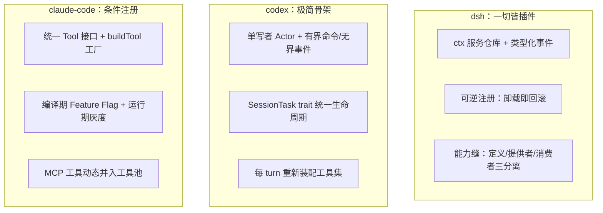
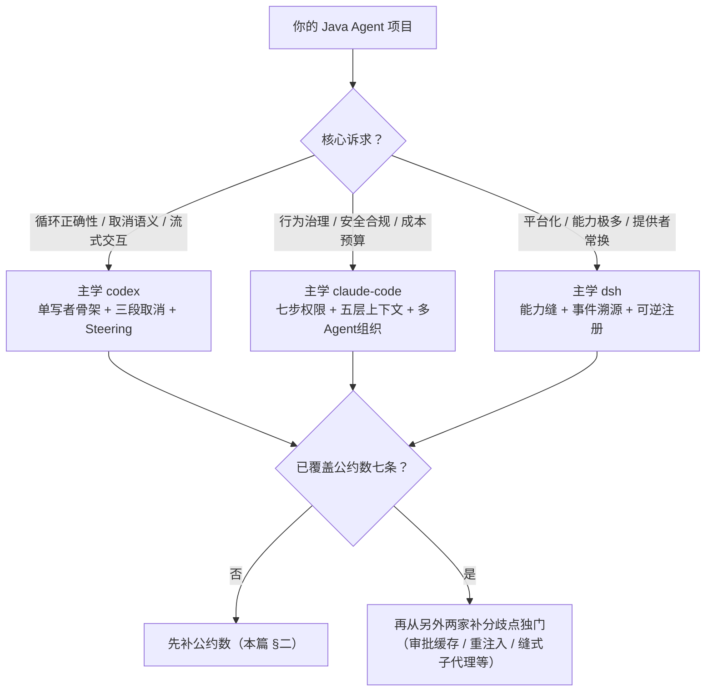

# 00-三大Harness横向对比：总览与选型地图

> **定位**：本篇是「三大 Harness 综合对比」子系列的总览篇。三个被对比对象：[00-deepseek-harness]（DeepSeek Harness，12 篇）、[01-codex-harness]（Codex CLI，5 篇）、[02-claude-code源码架构]（Claude Code，11 篇）——当今最权威的三个开源 Agent Harness 实现。本篇给出三家的设计中心画像、七条公约数、六大分歧点的选型地图；六个维度的**深度机制对比**见本文件夹 01-06 各篇（会话引擎/上下文/工具/安全/编排/持久化，每篇都以"教会读者该维度的知识"为目标），融合后的完整 Java 系统蓝图见 [07-Java融合落地总手册]。读者画像：Java Agent 工程师。前置阅读：无（本篇自带背景，各维度篇自洽）。

## 一、三家一句话画像

先纠正一个容易混淆的点：这三个不是"同一个东西的三个版本"，而是**三种不同的设计重心**：

| | DeepSeek Harness（dsh） | Codex CLI（codex-rs） | Claude Code |
|---|---|---|---|
| **形态** | 可运行的 Agent 运行时产品（Web 工作台 + headless + SDK） | Rust 终端 Agent（TUI/IDE 双宿主复用一个后端） | 终端 Agent + SDK + 多 Agent 平台 |
| **设计中心** | **扩展性**：一切皆插件、可逆注册、能力缝 | **会话引擎的正确性**：单写者 Actor、Turn 生命周期、取消语义 | **行为治理**：权限体系、上下文预算、多 Agent 组织 |
| **语言/栈** | TypeScript（Cordis 插件框架） | Rust（Tokio Actor） | TypeScript（Bun + React/Ink） |
| **会话真相** | 追加式 SessionEvent 日志，**运行时不变式**守护"凡模型可见必落日志" | rollout JSONL + 恢复入口纯函数重放 | DAG 消息链 + 内存 AppState（**双真相**，进程级状态另立） |
| **最强的一项** | 能力可整体替换（换提供者换整个执行世界） | 并发正确性（Steering、三段取消、审批缓存） | 提示词工程与权限治理的精细度 |
| **最弱的一项** | 抽象陡峭（不懂 Cordis 写不了任何插件） | 多 Agent 协作几乎缺席 | 双真相源带来的状态分裂（进程级 100 字段单例） |

给初学者的定位口诀：**学"怎么组织能力"看 dsh，学"怎么把循环写对"看 codex，学"怎么管住行为"看 claude-code。**

## 二、七条公约数：所有成熟 Harness 的必抄清单

三家独立演进却收敛到同一组结论——这组**公约数**比任何一家的独家发明更值得信（交叉验证过的设计）：

| # | 公约数 | dsh 的形态 | codex 的形态 | claude-code 的形态 |
|---|--------|-----------|-------------|-------------------|
| 1 | **fail-closed 默认拒绝** | 沙箱无 backend 抛 SANDBOX_UNAVAILABLE；审批无 answerer 即拒绝 | 一切异常路径落最保守决策 | Deny 最先且不可覆盖；解析不了即回退人工 |
| 2 | **日志/事件是会话唯一真相** | 凡模型可见必落日志（运行时不变式） | rollout 先于终态事件 | 消息配对完整性是 API 硬不变量 |
| 3 | **工具错误是输出不是异常** | tool/result 单一模型面结果落日志 | 失败回填 `{"success":false}` 文本，不抛异常断流 | 错误 + stdout/stderr/短堆栈打包回模型 |
| 4 | **上下文压缩是分层渐进的** | compaction 缝 + 多提供者 + shadow-price 定价 | 三路径压缩统一生命周期 + 重注入位置纪律 | 五层管道：预算→裁剪→微压缩→折叠→全量摘要 |
| 5 | **治理插桩外置于执行** | tools/pre-execute·post-execute waterfall，策略不 import 工具 | 审批三态纯函数 `decide(policy, request)` | 七步权限管线（纯评估）+ 副作用后置 |
| 6 | **持久化先于对外宣布** | 提交即成功，observer 失败不回滚 append | 持久化 flush 之后才发 TurnAborted | 下一轮 LLM 调用前阻塞落盘 |
| 7 | **模型面与机制面分离** | 提供者注册"能力"而非工具，模型 schema 唯一归属消费者 | spec/executor/exposure 三分离 | 统一 Tool 接口 + deny 预过滤（模型看不到被禁工具） |

**Java 取经结论**：如果你的系统七条里缺三条以上，先补公约数，再谈任何高级特性。这七条在 [02-claude-code源码架构/10-Java工程师借鉴手册] 的验证清单里有对应自查项。

## 三、六大分歧点：按场景选学

公约数之外，三家在同一个问题上给出了**不同的最优解**——分歧点才是"取长补短"的主战场。

### 3.1 扩展模型：插件树 vs 极简骨架 vs 条件注册

- **dsh 的答案**：扩展是系统的第一性问题，所以把扩展成本前置到类型系统（Cordis ctx/事件/effect）。适合"能力极多、提供者会频繁替换"的平台型产品。
- **codex 的答案**：扩展点越少越好，把并发正确性做成骨架（单写者免锁、命令有界反压、任务统一收尾）。适合"核心循环必须绝对可靠"的引擎型产品。
- **claude-code 的答案**：中间路线——接口统一 + 条件注册 + Flag 双层灰度，扩展性靠生态协议（MCP）外挂。适合"快速迭代 + 灰度发布"的产品型 Agent。

**Java 判断标准**：扩展点数量 × 提供者变更频率。两者都高才值得学 dsh 的缝三分离（`Service 定义 + @ConditionalOnProperty 提供者族 + tool 消费者`）；大多数 Spring AI 项目学 codex 的"每 turn 重装配工具集 + Feature Flag 灰度"性价比最高。

### 3.2 会话真相：单一日志 vs 恢复重放 vs 双真相

- **dsh 最彻底**：一切派生状态（消息、标题、统计、待办、遥测）都是日志的投影（CQRS 读面），不维护第二套状态机——重放即自洽。
- **codex 最务实**：JSONL rollout + 恢复入口枚举（New/Resumed/Forked）纯函数重放，`TurnContext` 每 turn 快照。
- **claude-code 最分裂**：消息 DAG 是真相，但进程级状态（约 100 字段单例）与 UI 级 AppState 是两套独立真相——这正是它自己承认的头号架构局限。

**Java 取经**：长任务/合规场景直接学 dsh 的事件溯源 + 投影（项目 13 已按此落地）；一般 Web 服务学 codex 的"持久化先于终态 + 恢复入口纯函数"；**永远避免 claude-code 的双真相教训**——会话状态与进程状态混在多处，是状态不一致的温床。

### 3.3 安全治理：缝式沙箱 vs 审批缓存 vs 权限光谱

三家把"管住模型的手"拆成了三个不同的子问题并各自做到极致：

| 子问题 | 最强实现 | 可抄的机制 |
|--------|---------|-----------|
| 执行隔离 | dsh（沙箱缝：Landlock/E2B 提供者可换） | fs/subprocess 共享执行世界——换一个提供者，整组能力一起搬进沙箱 |
| 审批效率 | codex（结构化 key 审批缓存 + 失败升级重试） | 同一命令前缀批过一次不再问；最小权限先试、失败才升级全权重试 |
| 决策精细度 | claude-code（七步管线 + AI 分类器 + 多路竞速） | Deny 免疫 bypass；分类器两阶段降延迟；拒绝追踪自动升级人工 |

**Java 融合公式**：`dsh 的沙箱缝（容器提供者可换） + codex 的审批缓存（key = 命令前缀/path/host 三类） + claude-code 的七步评估管线与拒绝追踪`——三者不冲突，恰好覆盖"隔离、效率、决策"三个正交维度（10.6 篇已给七步管线的 Java 实现，补上另外两块即可）。

### 3.4 上下文工程：claude-code 最精，但两家各有独门

- **claude-code**：五层渐进管道 + 缓存分水岭（静态/动态分离）——预算管理的天花板。
- **codex**：两个被低估的独门——①**重注入位置纪律**（turn 中压缩后的初始上下文插在最后一条真实 user 消息**之前**，模型行为最稳）；②**world_state 差异注入**（环境快照 + baseline，只注 diff，静态指令一次注入）。
- **dsh**：shadow-price 协议——紧邻的替换事件为被压缩范围定价，压缩成本可精确核算（上下文治理的会计学）。

**Java 取经**：以 claude-code 的五层管道为主干（10.5 已给简化版），叠加 codex 的重注入位置与差值注入两条纪律——这两条在 claude-code 里没有，是纯增量收益。

### 3.5 交互与并发：codex 的 Steering 是独门绝技

用户在模型思考中途补充输入，三家答案不同：claude-code 用"中断 + 消息队列"（粗暴但够用）；dsh 用 inbox 事件认领；**codex 用 Steering——不打断也不丢失**：pending_input 队列 + 采样间隙原子合并注入，配套 MailboxDeliveryPhase 裁决迟到消息归属（已展示给用户的消息归下轮，保证模型行为与用户所见一致）。

**Java 取经**：流式对话产品的**必抄项**。落点在 stream 工具循环的采样间隙（`concatMap` 内检查 pendingInput）——见 [01-codex-harness/00] §五的转译表。

### 3.6 多 Agent 组织：claude-code 最完整，dsh 最优雅

- **claude-code**：协调者模式 + TeamFile + 邮箱 + 优雅关闭 + 强制规划协议（子 Agent 必须提交方案给 Lead 审批）——**组织学**最完整。
- **dsh**：子代理做成缝（六种提供者：进程内 one-shot / 可续作 Activation / 甚至"委托给另一个产品"），编排全部是 inbox 之上的外层策略，不改主循环——**机制**最干净。
- **codex**：基本缺席（单 Agent 专注），仅 mailbox 有雏形。

**Java 取经**：组织结构抄 claude-code（协调者 + 审批协议，见 06 篇），执行机制抄 dsh（子代理提供者接口化：进程内 / 独立服务 / 远程沙箱可换）。

## 四、场景选型决策图

## 五、取长补短：Java Agent 融合路线图（V1→V2→V3）

> 六个维度的机制级对比与裁决见 01-06 各篇；本节给路线图，逐步落地细节见 [07-Java融合落地总手册]。

把三家的精华按工程依赖关系排成三阶段，贴合"最小可用 → 生产加固 → 平台化"的演进节奏：

### V1 骨架期（主学 codex，公约数打底）

1. sealed `Op/Event` 契约 + 有界命令队列 + 单写者（虚拟线程）+ Sinks 事件出口（codex #1）
2. `SessionTask` 接口 + `doFinally` 单点收尾 + 三段式取消（codex #2/#3）
3. 持久化先于终态事件（公约数 6）；工具失败回填不抛异常（公约数 3）；fail-closed 默认（公约数 1）
4. append-only JSONL + 恢复重放（codex #30）

### V2 治理期（主学 claude-code，补 codex 独门）

5. 七步权限管线（纯函数评估）+ 多路竞速审批 + 拒绝追踪（claude-code 10.6）
6. 叠加 codex 审批缓存与失败升级重试——审批不再"每问一次"
7. 五层上下文管道 + 缓存分水岭（claude-code 10.4/10.5）+ codex 重注入位置与差值注入
8. Steering（codex #7）：流式循环间隙合并补充输入
9. 成本台账 + 收益递减停止判据（claude-code 10.7）

### V3 平台期（主学 dsh，缝化与事件化）

10. 高频替换能力缝化：`Shell 执行定义 + local/容器/远程三提供者 + tool 消费者`（dsh 哲学三）
11. 会话升级为事件溯源：单一追加日志，标题/统计/审计/检索全部改投影（dsh 哲学二/四）——若 V1 的 JSONL 设计得当，此步是渐进迁移而非重写
12. 子代理提供者接口化 + 权限元数据做成 log-only 事件（dsh 哲学一）
13. Feature Flag 双层灰度与可逆注册收尾（claude-code 10.10 + dsh 可逆效果）

**每阶段验收**：V1 用 codex 手册 §三的 9 项 cold start 清单；V2 用 [02-claude-code源码架构/10] §10.13 验证清单；V3 用"换一个提供者，模型面 schema 与消费者零改动"作为缝化的通过标准。

## 六、转译到 Spring AI / Java 生态（融合版总表）

| 维度 | 融合后的 Java 形态 | 主来源 |
|------|--------------------|--------|
| 会话骨架 | sealed Op/Event + 单写者 + SessionTask + 三段取消 | codex |
| 工具体系 | `@Tool`/`ToolCallback` 统一接口 + 每 turn 权限感知装配 + 失败回填基类 | claude-code + codex |
| 治理 | 七步纯函数管线 + 审批缓存 + 沙箱缝（容器提供者） | claude-code + codex + dsh |
| 上下文 | 五层管道 + 分水岭 + 重注入位置 + 差值注入 + shadow-price 式压缩计量 | claude-code + codex + dsh |
| 交互 | SSe 流式 + Steering 队列 + 迟到消息两态裁决 | codex |
| 多 Agent | 协调者模式 + 邮箱（Kafka）+ 子代理提供者接口 | claude-code + dsh |
| 持久化 | 事件溯源日志 + 投影读取面（渐进迁移自 JSONL） | dsh + codex |
| 发布 | 编译期 Profile + 运行期配置中心灰度 + 紧急回滚 | claude-code |

> **适用场景**：正在设计/加固 Java Agent 会话引擎与平台，想知道"三家到底谁对、抄谁"的架构师。
> **不适用场景**：未读过任何子系列就想要具体代码（先读对应手册篇：deepseek 12 / codex 04 / claude-code 10）。

## 七、总结

三家的关系不是竞争而是**分工**：dsh 回答"系统怎么长不大乱"（扩展性），codex 回答"循环怎么永不出错"（正确性），claude-code 回答"行为怎么不越界"（治理性）。七个公约数是的地板（缺了哪条哪条就会在生产咬你），六个分歧点是天花板（按场景各取独门）。作为 Java Agent 架构师，最经济的路径不是全盘照搬任何一家，而是**V1 抄 codex 把骨架立正、V2 抄 claude-code 把行为管住、V3 抄 dsh 把系统做活**——三步走完，你的 Spring AI 系统就同时拥有了三家的长处。

## 设计哲学要点与场景推荐（本篇内嵌）

**哲学根源**：三家的分歧不是水平差异而是"最怕什么"的差异——dsh 怕演进不动（扩展性哲学）、codex 怕循环出错（正确性哲学）、claude-code 怕行为失控（治理哲学）。因此**选型的第一问不是"哪家最强"而是"你的系统最怕什么"**。速查推荐：内部研发助手/代码 Agent → 主学 claude-code（治理+上下文）；Web 流式对话/客服 → 主学 codex（骨架+Steering）；多能力平台/中台 → 主学 dsh（缝+事件溯源）；合规审计重 → 叠加 dsh 的安全状态入日志；成本敏感 → 叠加 claude-code 的缓存分水岭与成本台账。逐维度的机制级裁决见 01-06 各篇，跨三家哲学总纲见 [08-设计哲学深度解析]。
