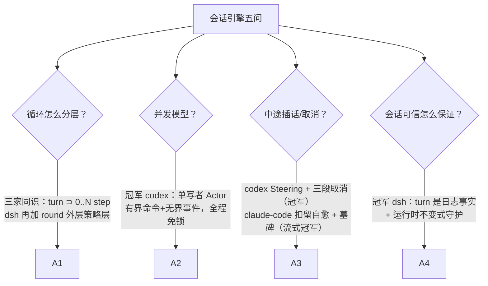
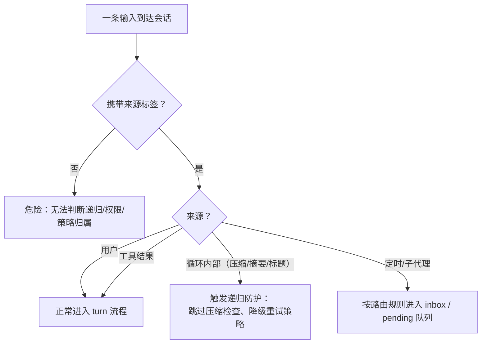

# 01-会话引擎与主循环对比

> **定位**：本篇从"会话引擎与主循环"维度深度对比三大 Harness：Agent 循环怎么驱动、输入怎么到达、轮次怎么分层、并发模型怎么选、用户中途插话与中断怎么处理。这是三个维度对比中最接近"地基"的一篇——其余所有机制（工具/安全/上下文）都跑在这个循环之上。写作目的不是罗列差异，而是教会读者"Agent 会话引擎"这个维度的完整知识。素材来源：[00-deepseek-harness/02-核心引擎与Agent生命周期]、[01-codex-harness/00-总体架构与会话Actor]、[02-claude-code源码架构/01-Agent引擎与核心循环]。

## 一、这个维度到底在解决什么问题

把 LLM 变成 Agent，核心是让一段代码反复做五件事：**接收输入 → 组装上下文 → 调模型 → 执行工具 → 把结果喂回去再调**。这个循环听起来平凡，难的全在细节里，可归纳为五个子问题：

1. **循环怎么分层**：一次"模型调用+工具执行"是一个单位，那多轮工具调用、用户多次输入、更外层的策略迭代怎么分层命名与计数？
2. **输入怎么到达**：用户消息、工具结果、定时任务、子代理来信——都往哪投递？谁决定"下一步处理哪个"？
3. **并发模型**：一个会话的状态同时被 UI、工具、后台任务读写，用什么并发模型才不出错？
4. **中断与取消**：用户按 Ctrl+C 或"发新消息"时，正在流式输出的模型调用和正在执行的工具怎么干净地停下来？
5. **循环与外界的边界**：会话状态、前端渲染、持久化的职责线画在哪里？

先教两个贯穿全篇的术语：**turn（回合）**= 从一次用户输入到 Agent 完成响应的完整过程，可包含零或多次模型调用；**step（步）**= 一次模型请求加其响应的工具执行。turn 与 step 的关系是 1 : 0..N——模型不再要工具，turn 就结束了。

## 二、逐家精讲

### 2.1 codex：单写者 Actor——把并发正确性做成骨架

codex 的答案最有"操作系统课"的气质：**每个会话是一个 Actor（单写者任务）**。`Session::spawn` 建立双通道：

- **命令通道（有界，容量 512）**：前端提交 `Op` 枚举（UserInput/Interrupt/审批应答/Compact/Rollback/Shutdown…）——队列满时提交方挂起而非内存爆炸，**天然反压**；
- **事件通道（无界）**：会话向 UI 推 `Event` 枚举——UI 状态不能缺块，事件绝不因背压丢失。

命令与事件的方向、容量、语义刻意不对称，这是理解 Actor 模型的绝佳教材：**命令是"请求"（必须限流，防打爆），事件是"事实"（不可丢弃）**。单消费者循环里"读当前回合状态 → 决定开始新回合还是合并输入 → 写状态"天然原子——**整个会话引擎不需要一把锁**。

用户中途补充输入（"等等，改用 Rust 写"）是 codex 最精彩的一手——**Steering（转向）**：不打断当前回合（丢工作）也不排队忽略（丢输入），而是写入 `pending_input`，在当前采样的间隙原子合并注入下一轮上下文。配套 `MailboxDeliveryPhase` 状态机裁决迟到消息：答案已经展示给用户的，归下一轮——保证**模型看到的与用户看到的一致**。

取消语义是"三段式"：①协作取消信号（各 await 点检查，优雅退出）→ ②100ms 宽限期等待 → ③强制终止。外加一条铁律：**持久化先于终态事件**——"回合已中止"的宣告必须在该事实落盘之后发出，否则崩溃重放会出现"被中止了却查无此事"的账实不符。所有异构任务（对话/压缩/审查/Shell）实现同一 `SessionTask` trait，在同一个收尾点做统计/落盘/终态事件——开闭原则的直接应用。

### 2.2 dsh：主循环只做三件事，其余全是事件

dsh 把循环的职责压到极简：**认领输入 → 驱动 step → 记录日志**。turn/step/round 三层分明（round 是外层策略迭代，如目标驱动的一次尝试），输入通过**一个 inbox** 到达驱动：`agent/pre-step` waterfall 监听器决定模型看到什么（可改写、可拒绝，拒绝也记录日志且不消耗 step）。

它的两条信念值得单独教。第一，**turn 是"零或多个 step"**，且回合的开启与关闭都是日志事件（`turn/start`/`turn/end`）——回合的边界不是内存里的布尔值，而是可重放的事实。第二，**"凡模型可见必落日志"由运行时不变式守护**（`ctx.invariants`）：任何进入模型请求的内容必须能从会话日志重建，违反即抛错。这是把"会话可信"从工程自觉升级为机器强制——初学者第一次见到"运行时不变式"这个概念时请记住它的价值：**不变式不是测试，是随每次运行在线验证的数学承诺**。

dsh 还有一个"没有特权内核"的激进决策：连 agent-loop 本身都是插件（`ctx.agentLoop` 是可替换的默认驱动）。配合 per-agent 作用域（scope：每个 Agent 可以 shadow 全局的工具/提示词条目），一套主循环服务出形态各异的 Agent。

### 2.3 claude-code：AsyncGenerator 循环 + 扣留机制

claude-code 的循环是一个**异步生成器**（AsyncGenerator）：每个流式事件到达就 `yield` 给上层渲染。这个语言原语一举三得：流式传输（逐事件推 UI）、状态保持（闭包保留消息历史与工具上下文）、可中断（调用方可 `.return()`，取消信号沿 AbortController 父子级联传播到 API 调用与工具执行）——并且生成器天然自带**背压**（消费者慢则生产者暂停）。

它的独门是**扣留（withhold）机制**：可恢复错误（输出超限、上下文过长）不立即 `yield` 给消费者，先静默自愈——升级输出上限重试、注入"从断点直接继续，不要道歉不要回顾"的恢复消息（最多 3 次）；全失败才把错误放行给用户。配套"流式系统不能回滚"的现实：已发出的无效消息用 **tombstone（墓碑）**标记让消费者移除，而不是假装没发过。

五类终止路径缺一不可：自然完成 / 轮次上限（maxTurns）/ 用户中断 / 预算上限（美元）/ 错误。给初学者划重点：**缺了 maxTurns 或预算上限的 Agent 循环，不是功能不全，是生产事故预定**。

## 三、对比与裁决

| 子问题 | dsh | codex | claude-code | 裁决 |
|--------|-----|-------|-------------|------|
| 循环分层 | ★★★ turn/step/round + 回合边界是日志事件 | turn 生命周期清晰 | turn 计数 + transition 原因门控 | **学 dsh**：回合边界入日志，重放才有锚点 |
| 并发模型 | 事件驱动 inbox | ★★★ 单写者 Actor，全程免锁 | 生成器 + AbortController 级联 | **学 codex**：初学者也能写对的并发 |
| 中途插话 | inbox 认领 + pre-step 改写 | ★★★ Steering：不打断不丢失 | 消息队列 + 中断 | **学 codex**：Steering 是体验天花板 |
| 取消语义 | 信号协作 + guard | ★★★ 三段式（协作→宽限→强杀）+ 持久化先于终态 | AbortController 级联 + 合成配对结果 | 学 codex 流程 + claude-code 的配对完整性 |
| 流式与错误 | assistant/chunk 逐块落日志 | 事件分层推送 | ★★★ 扣留自愈 + tombstone | **学 claude-code**：可恢复错误别打扰用户 |
| 会话可信 | ★★★ 运行时不变式 + 无特权内核 | 持久化先于终态 | 消息配对完整性 | **学 dsh**：把铁律做成机器强制 |

## 四、转译到 Spring AI / Java 生态

| 三家机制 | Java 落地 | 关键点 |
|----------|-----------|--------|
| 单写者 Actor | 有界 `ArrayBlockingQueue<Op>`（约 512）+ 单消费者虚拟线程 + `Sinks.Many<Event>` 事件出口；Op/Event 用 Java 21 sealed interface | "读-决策-写"天然原子，免锁（完整骨架见 [07-Java融合落地总手册] §二） |
| turn/step 分层 + 边界入日志 | `turn_started`/`turn_finished` 作为持久化事件写会话日志；轮次计数从日志 fold | 回合计数器不要只存内存 |
| 三段式取消 | ①取消信号（`Flux` 的 dispose 传播 / 标志位）→ ②`block(Duration.ofMillis(100))` 宽限 → ③强制终止 | 全链路 await 点都要可取消，否则协作取消形同虚设 |
| 持久化先于终态 | `persist().then(emitFinal())` 串行保序 | Reactor `concat` 保证顺序 |
| Steering | 会话级 pendingInput 队列；在流式工具循环的采样间隙（`concatMap` 内）检查合并 | Spring AI stream 的工具回填间隙是注入点 |
| 扣留自愈 | 可恢复错误先重试/压缩再放行；WebFlux 下用 `onErrorResume` 分错误类型处理 | 输出超限→升 maxTokens 重试；超长→压缩重试；重试有上限（≤3） |
| 消息配对完整性 | 中断时为所有未完成 tool_use 合成配对的取消态 tool_result | API 硬不变量，漏了下次调用就报错 |

给初学者的一个综合练习建议：用 Spring Boot + 虚拟线程实现一个最小会话引擎（Op/Event sealed 接口 + 有界队列单写者 + 三段取消 + JSONL 落盘），跑通"流式输出中途 Steering 一条新输入"和"kill -9 后恢复续行"两个场景——做完这两个场景，这个维度你就毕业了。

## 五、小结

会话引擎维度的三家分工：**codex 教你并发正确性（单写者 Actor、Steering、三段取消、持久化先于终态），claude-code 教你流式体验（AsyncGenerator 循环、扣留自愈、墓碑、五类终止路径），dsh 教你会话可信（回合边界是日志事件、凡模型可见必落日志、运行时不变式）**。融合答案在 [07-Java融合落地总手册] §二：以 codex 的单写者骨架为地基，装上 claude-code 的扣留与配对纪律，再让 dsh 的"回合入日志"为后续事件溯源留好接口。

### 补充：一个初学者最容易忽略的细节——输入的"来源标签"

三家在输入投递上还有一个共同设计值得单独点出：**每条输入都带来源（querySource / initiator / scope）**。这不是为了日志好看，而是三个实际功能的前提：①**递归防护**——压缩、记忆提取这些"循环内部自己发起的 LLM 调用"必须跳过压缩检查，否则无限递归（claude-code 的 `querySource === 'compact'` 检查就是这一条）；②**权限与作用域**——dsh 的 per-agent scope 靠 initiator 决定哪些条目被 shadow；③**差异化策略**——codex 前台与后台任务对 529 的重试策略不同，靠的就是来源标签。给你的 Java 引擎定规范时，请把"每条输入/每次 LLM 调用必须携带来源"写进第一版接口——事后补这个字段的迁移成本极高。

有了来源标签，前面讨论的 Steering、扣留自愈、递归防护才有实现的挂点——这也是三家源码在会话入口处最先看到的一段防御性代码。

> **最后一点学习建议**：会话引擎是三个维度里"写错最贵"的一个——上下文错了可以调参，权限松了可以收紧，但并发模型错了会在生产上以最难复现的方式爆炸。建议读者把本篇的对比表当作自查清单，逐行问自己的系统"这一行我答得上来吗"；答不上来的那一行，就是你的下一个迭代任务。
