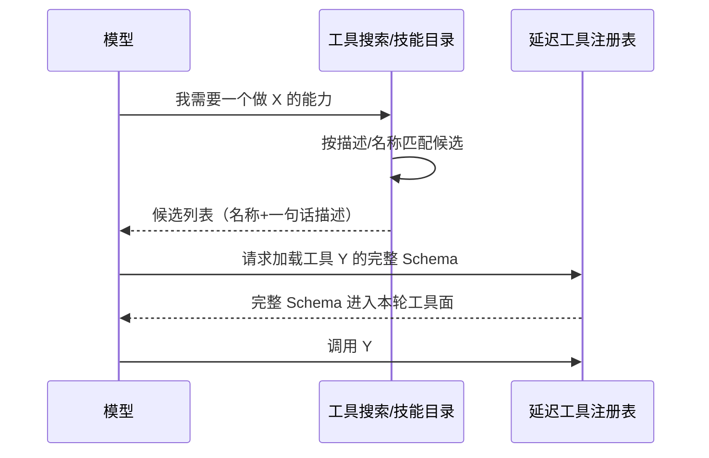
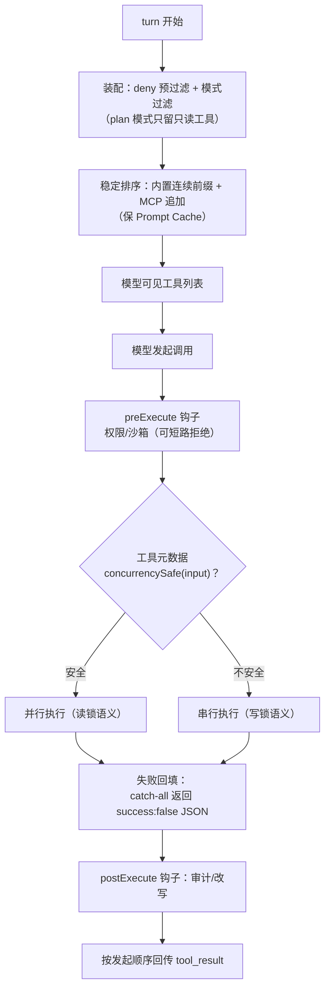

# 03-工具系统与执行管线对比

> **定位**：本篇从"工具系统"维度深度对比三大 Harness：工具如何定义与暴露给模型、何时装配、如何并发调度、失败怎么处理、结果怎么回传。写作目的不是罗列差异，而是教会读者"Agent 工具体系"这个维度的完整知识——读完你应能独立设计一套 Spring AI 工具层，并知道每个设计决策背后三家的答案与取舍。素材来源：[00-deepseek-harness/04-模型可见能力-工具技能终端与网络]、[01-codex-harness/01-工具子系统与审批沙箱]、[02-claude-code源码架构/04-工具系统]。

## 一、这个维度到底在解决什么问题

工具是 Agent 的双手，但设计一套工具系统远不止"写个函数给模型调"。四个层层递进的子问题：

1. **定义与暴露**：工具的元数据（名称/描述/参数 Schema）与实现怎么分离？模型看到的"工具面"与真实执行细节怎么隔离？
2. **装配时机**：一批工具什么时候决定"哪些给这次请求用"？
3. **调度执行**：模型一次要求调多个工具时，哪些能并行、哪些必须串行、怎么保序？
4. **失败与回传**：工具失败是中断会话还是作为信息回给模型？结果格式怎么设计才能让模型自愈？

先教一个贯穿全篇的关键区分：**模型面（wire）与机制面（runtime）**。模型看到的只是"名字 + 描述 + JSON Schema"；Schema 之外的元数据（谁能用、是否并行、要不要审批、超时多久）都属于机制面。三家在这条分界线上的处理方式，决定了各自工具系统的可维护性。

## 二、逐家精讲

### 2.1 dsh：能力缝——provider 注册"能力"而非工具

dsh 把每个能力（Shell/文件/网络/子进程/终端…）拆成**三个角色、通常三个包**：

- **Service Definition**（抽象 Service 子类，注册为 `ctx.shell` 等）：只声明"做什么"；
- **Service Provider**（`dsh-bash-local` / `dsh-bash-sandbox` / `dsh-pwsh-local`）：实现它——注意 bash 的沙箱版是**本地版的子类**，只多了一步"把命令交给沙箱包装再执行"；
- **Consumer**（`dsh-tool-bash`）：**唯一拥有模型面 schema** 的角色——工具的名称、描述、参数定义、结果展示全在这里。

这条"**provider 注册能力而非工具**"的纪律带来一个强力性质：**换一个 provider，整个执行世界随之改变，而模型提问方式一个字不变**。把文件系统与子进程 provider 都指向远程沙箱，Bash、PTY、LSP 全部跟着搬过去——没有任何消费者需要改动。

配套四条领域原则值得记：①**error-as-field**——`ShellRunResult` 把 `timedOut`/`aborted`/`exitCode` 做成正交字段而非异常，模型拿到的是"结果 + 状态"而不是一次拒绝；②**策略以事件门存在**——文件系统策略是 `fs/*` waterfall 监听器，删掉策略插件工具照样裸跑（治理与能力彻底解耦）；③**显式优先**——`ShellExecSpec` 全必填，边界必须显式给；④**敌意 peer 心态**——子进程环境变量先剥掉所有含 KEY/PASSWORD/SECRET/TOKEN 的项再显式合并。

### 2.2 codex：三分离 + 每 turn 重装配

codex 用**三个原语**切分工具定义：

| 原语 | 职责 |
|------|------|
| `ToolDefinition` | 最小元数据：name/description/input_schema/output_schema/defer_loading |
| `ToolSpec` | **模型可见形态**（五种变体，直接映射模型 API 的 tool JSON） |
| `ToolExecutor` trait | 执行契约，附带 `exposure()`（暴露面）与 `supports_parallel_tool_calls()`（并行意愿） |

**exposure 六种暴露面**是精华：Direct / Deferred / DeferredModelOnly / DirectModelOnly / CodeModeOnly / Hidden——按位标志正交组合后折叠。同一个工具注册表，按宿主形态与特性门控**投影出不同的工具面**：IDE 宿主看到的工具集与 CLI 不同，开启工具搜索（ToolSearch）后 Deferred 工具只以名称出现、模型按需"发现"。

**装配时机**是 codex 的第二个独门：**每 turn 开始重新组装**（`build_tool_router`）——构造本轮上下文、合并内置与 MCP 工具、应用暴露折叠、去重与碰撞检查，最后才生成模型可见列表。工具面是**每轮的函数**而不是启动时的常量。注册还分信任级：内置（trusted）重名直接 fail-fast，外部（MCP）冲突只记录；且有**保留名守卫**——外部工具不得注册 `shell_command` 等内置保留名，防止 MCP 工具冒充内置 shell（工具投毒防御）。

**并发调度**用一把共享读写锁：声明支持并行的工具拿**读锁**（互相并发），非并行工具拿**写锁**（互斥一切）——一个 `RwLock` 解决了 claude-code 用状态机解决的同一个问题。**失败处理**是铁律级纪律：任何工具错误转 `success:false` 的输出回填给模型，**会话永不因工具崩溃**（Spring AI 中工具抛异常会中断流，这是 Java 落地时最需要抄的一条）。

### 2.3 claude-code：统一自描述接口 + 动态安全判定

claude-code 的 `Tool` 接口让每个工具**自述一切**：名称、描述、输入 Schema、`isConcurrencySafe(input)`、`isReadOnly(input)`、`checkPermissions`、`validateInput`、执行函数。工厂函数为未声明项补**fail-closed 默认值**（并发安全默认 false、只读默认 false）——新工具忘了声明，系统按最保守方式对待。

三个标志性机制：

1. **动态并发安全**：安全性不是工具级标签而是**工具+输入级判定**——`Bash(ls)` 安全可并行，`Bash(rm -rf)` 不安全必须串行；判定失败按不安全处理。
2. **并发执行 + 有序输出**：执行可乱序，但结果必须按发起顺序回传（API 要求 tool_result 与 tool_use 顺序一致）；遇到未完成的非安全工具就停止输出——它的上下文修改可能影响后续工具行为。
3. **deny 预过滤**：被权限规则拒绝的工具**在展示给模型之前就移除**——模型看不到就不会调用，这是最小权限的第一道落实。

错误处理哲学与 codex 一致但表述不同：**工具错误不是异常而是工具的输出**——失败连同 stdout/stderr/退出码/短堆栈（只留前 5 帧，省上下文）打包返回，让模型自己决定换命令、查文件还是报告用户。

### 2.4 一个跨家的补充话题：工具的延迟加载与技能

三家都意识到"工具列表本身是上下文成本"，给了两种解法。其一是**延迟加载**（codex 的 `defer_loading` 与 Deferred 暴露面、claude-code 的 `shouldDefer` + ToolSearch）：不常用工具只以名称出现在上下文里，模型需要时通过工具搜索"发现"它并加载完整 Schema——省 token 且减少误用。其二是**技能（Skill）**（dsh 的 skill 分层合并 + claude-code 的 SKILL.md）：把"怎么引导模型做某类任务"做成可复用的提示词模板，附带工具约束；dsh 还有一个精妙细节——技能目录以摘要哈希监控，**只在目录变化时**把可用技能信封注入上下文，不变则零开销。两家的一致结论：工具数量增长到几十个之后，"全量塞给模型"就不再是可选项。

## 三、对比与裁决

| 子问题 | dsh | codex | claude-code | 裁决 |
|--------|-----|-------|-------------|------|
| 定义与暴露 | ★★★ 缝三分离：换 provider 不换模型面 | ★★★ ToolSpec 五变体 + exposure 六面投影 | ★★☆ 统一接口但模型面/机制面耦合在一个接口里 | 平台型学 dsh；产品型学 codex 的 exposure 投影 |
| 装配时机 | bundle/patch 声明式组合 | ★★★ **每 turn 重组** + 保留名守卫 | 启动组装 + 条件注册 + deny 预过滤 | **每 turn 重装配**是对的吗？——是，权限随会话变，工具面必须跟着变（claude-code 的 deny 预过滤 + codex 的每 turn 重组 = Java 融合答案） |
| 并发调度 | provider 各自实现 | ★★★ 一把 RwLock：并行=read 锁/非并行=write 锁 | ★★★ 动态判定 + 有序输出 + contextModifier 串行化 | 简单系统抄 codex 的锁模型；需要"按输入判安全性"时学 claude-code |
| 失败处理 | ★★★ error-as-field 正交字段 | ★★★ 失败回填 success:false，会话永不崩 | ★★★ 错误+短堆栈打包回模型 | 三家同识（公约数）：**错误是输出不是异常**；Java 落地必抄 |
| 扩展协议 | MCP 客户端缝 | MCP external 注册 + 保留名守卫 | MCP 命名空间 + 前缀 deny + 中途动态并入 | 保留名守卫（codex）是防投毒的增量细节，建议叠加 |

## 四、转译到 Spring AI / Java 生态

| 三家机制 | Java 落地 | 关键点 |
|----------|-----------|--------|
| 统一自描述接口 | `@Tool`/`@ToolParam`（`@ToolParam` 无 `value()` 属性——已实证）+ `ToolCallback` | 安全元数据（并发性/只读/升级意愿）作为注册表侧附加数据 |
| 每 turn 装配 + deny 预过滤 | 权限感知工具池：每请求按会话权限上下文过滤 + 排序（概念代码见 [02-claude-code源码架构/10] §10.3） | 被禁工具不进池——模型看不到就不会调用 |
| 失败回填 | `SafeToolCallback` 基类：catch-all 返回 `{"success":false,"error":"…"}` | **Spring AI 工具抛异常会断流**——这是 Java 侧必抄的一条 |
| RwLock 并行门 | `ReentrantReadWriteLock` 按工具运行时粒度；或响应式信号量 | 支持 parallel=read 锁、否则 write 锁 |
| error-as-field | 工具结果 record：`{output, timedOut, aborted, exitCode}` 正交字段 | 别把"超时"塞进异常——模型需要结果+状态 |
| 保留名守卫 | MCP 工具注册时校验不与内置工具重名，冲突 fail-fast | 防 MCP 工具冒充内置 shell（工具投毒防御） |
| 策略外置 | 工具执行管线 pre/post 钩子（`ToolCallingManager` 装饰器——HITL/策略落点不是 Advisor，已实证） | 删掉策略 Bean，工具照样能跑 |

## 五、小结

工具维度的三家分工：**dsh 教你把"能力实现"与"模型面"彻底分离（缝三分离，换执行世界不换提问方式）；codex 教你工具面是每轮的函数（exposure 投影 + 每 turn 重装配）以及一把读写锁解决并发；claude-code 教你工具要自述安全属性、并发安全要按输入动态判定**。而三家完全一致的公约数只有一条却最重要：**工具错误是输出不是异常**——你的 Spring AI 工具层第一个该写的基类就是失败回填基类。

## 设计哲学要点与场景推荐（本篇内嵌）

**哲学根源**：工具域的分歧源于"模型面与机制面的缝合位置"——dsh 用缝把两者彻底分开（换执行世界不换提问方式）、codex 用投影让同一注册表变形（每 turn 重装配）、claude-code 用自述接口把安全属性交给工具自己声明。**推荐**：要接 MCP 生态/工具来自多方→claude-code 的 deny 预过滤+codex 的保留名守卫是安全底线，第一天就要；工具执行环境会变（本机→沙箱→远程）→dsh 的缝三分离；工具数量膨胀→codex 的延迟加载。**不推荐**：把权限 if-else 写进工具实现——三家在这一条上罕见地完全一致（治理必须外置），反例的下场是每加一个策略改一遍所有工具。
