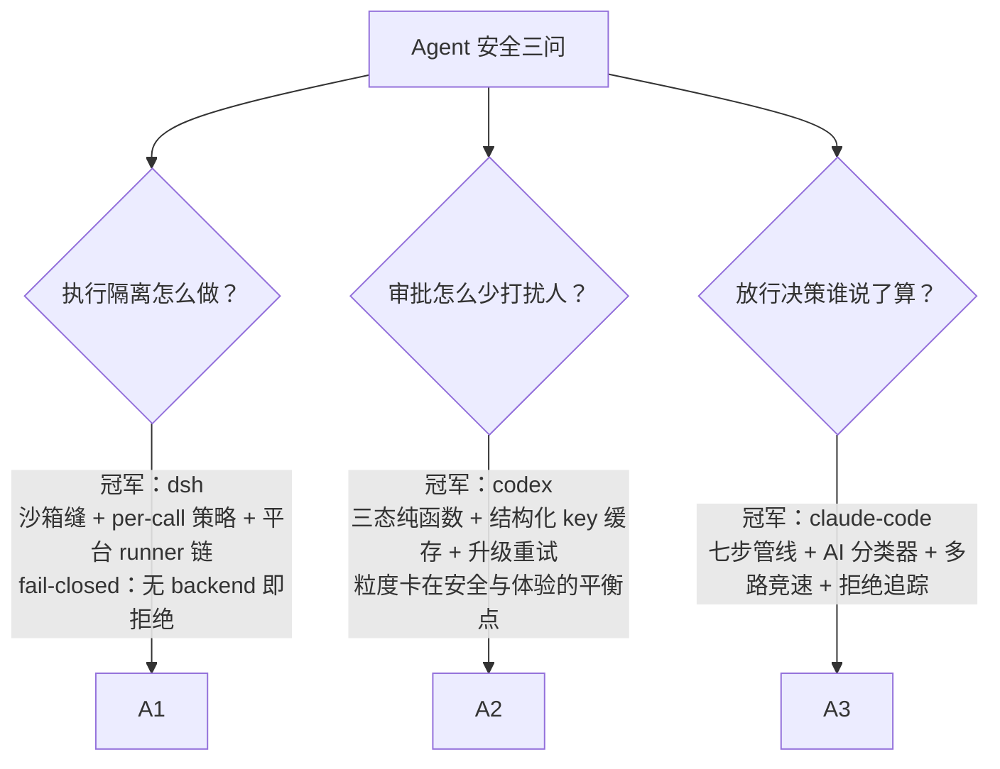
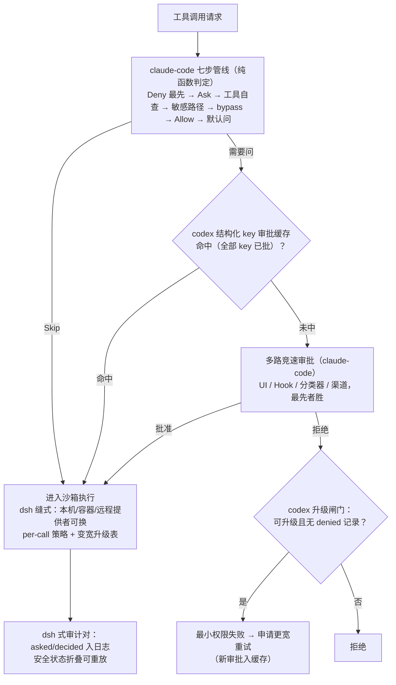

# 04-安全权限审批与沙箱对比

> **定位**：本篇从"安全"维度深度对比三大 Harness：**执行隔离**（沙箱怎么做）、**审批效率**（怎么少打扰人）、**决策精细度**（权限判定管线怎么排）三个子问题各自的冠军方案。写作目的不是罗列差异，而是教会读者"Agent 安全体系"这个维度的完整知识——读完你应能独立设计一套融合三家所长的 Java 权限层。素材来源：[00-deepseek-harness/05-安全-沙箱-权限与凭证]、[01-codex-harness/01-工具子系统与审批沙箱]、[02-claude-code源码架构/05-权限安全与沙箱]。

## 一、这个维度到底在解决什么问题

Agent 与传统程序的根本安全差异在于：**执行者是概率性的**。你可能写出过这样的 bug：工具把生产配置删了、把密钥发到了外网、在死循环里刷爆了 API 账单。传统程序的权限模型假设"代码是确定且可审计的"，这条假设对 Agent 不成立。于是安全体系要同时回答三个互相牵制的子问题：

1. **执行隔离**：就算决策错了，伤害范围能不能被物理限制住？（沙箱）
2. **审批效率**：需要人确认时，怎么既不漏审又不把用户烦死？（审批）
3. **决策精细度**：一次工具调用到底该不该放行，由什么管线说了算？（权限判定）

三家的利害取舍完全不同，正好构成一堂完整的安全设计课。先教一个贯穿全篇的词：**fail-closed（失败即关闭）**——当系统无法确定一个操作是否安全时，默认答案是"拒绝"而不是"放行"。三家在这条上完全一致，它是所有 Agent 安全设计的第一公理。

## 二、逐家精讲

### 2.1 dsh：把安全做成"缝"，fail-closed 贯穿到底

dsh 的独特贡献是把安全能力做成**可整体替换的能力缝**，并用五条子原则贯穿：

- **沙箱缝**：`SandboxMode`（read-only / workspace-write / danger-full-access）+ `confine(argv, policy)` 契约——要么返回受限包装命令，要么抛 `SANDBOX_UNAVAILABLE`，**静默直通永远非法**。平台 runner 链可插拔：Linux 用 `bwrap + Landlock`（内核级 allow-list 强制访问控制，"先自我限制再 exec"，内核不支持就干脆不执行）、macOS 用 Seatbelt、Windows 用 ACL restricted token（且诚实报告自己是 `partial` 强度）。
- **per-call 策略**：沙箱策略每次调用携带而非绑定在提供者上——bash 可以是只读边界、子代理同时是可写边界，一次批准的升级就是"一次更宽的调用"。
- **升级有严格变宽表**：read-only 只能升到 workspace-write 或 full-access，**非变宽的请求永远不打扰人类**——升级路径可穷举、可审计。
- **审批 fail-closed**：`ApprovalOutcome` 四态中 `unavailable`（没有审批应答方）导致拒绝；`never` 策略在一切监听器之前确定性拒绝——后注册的钩子也无法绕过。
- **审计对 + 安全状态入日志**：每次审批产生 `approval/asked`/`approval/decided` 成对事件；沙箱模式、审批策略、权限预设全是日志事件——**安全决策与业务状态同一条真相链，可重放审计**。

最容易被忽视但极精妙的一条：**stderr 方言**。每个沙箱后端维护自己的"拒绝签名"（bwrap 报 EROFS、Landlock 报 EACCES、Seatbelt 报 EPERM），并用退出码门控区分"runner 没跑起来"和"runner 拦住了命令"——把这两者混为一谈会掩盖真实的安全事件。

### 2.2 codex：把"问不问用户"做成纯函数与缓存

codex 的洞察是：**审批体系差就差在两个极端**——"每次都问"（用户第二天就关掉）和"永不问"（裸奔）。它的答案是三件套：

1. **三态推导纯函数**："何时问用户"不是散落在各工具里的 if，而是一个可穷举的推导表：`decide(策略, 请求) → Skip | NeedsApproval | Forbidden`。策略四种（Never/OnRequest/Granular/UnlessTrusted）× 文件系统受限与否，全部组合可单测覆盖。
2. **结构化 key 审批缓存**：批准按**资源粒度**记录——命令按 canonical 化后的完整结构、文件按 path、网络按 host+port 各成一个 key；命中条件是"该请求涉及的全部 key 均已批"。于是"批准过 `git status` 后同命令再来"免审批，而"同命令不同工作目录"因 key 含 cwd 会重新审批——**粒度刚好卡在安全与体验的平衡点**。同 host 的并发请求还会去重，只弹一次审批框。
3. **失败升级重试**：被拒后不是直接放弃，而是带上下文升级（沙箱内最小权限先试 → 被拒 → 申请更宽权限重试），且升级有闸门（如已有 denied-read 记录则禁止脱沙箱）、缓存联动（升级审批过的不再重复问）。

配合两条执行纪律：**保留名守卫**（外部 MCP 工具禁止注册 `shell_command` 等内置保留名——防冒充内置工具）与**符号链接逃逸防护**（apply_patch 的符号链接跟随仅在"要求沙箱却绕过"时禁止）。

### 2.3 claude-code：把"判定"做成七步管线与多路竞速

claude-code 在"一次调用到底听谁的"上做得最深：

- **六种权限模式**构成信任光谱（default / plan / acceptEdits / dontAsk / auto / bypass），配套 DSL 规则（`Bash(npm run:*)` 前缀、`Edit(src/**)` 路径、`mcp__server*` 命名空间）。
- **七步评估管线**，顺序即安全：①Deny 规则（最先、任何后续不可覆盖）→ Ask 规则 → 工具自身检查 → 敏感路径安全检查（`.git`、配置文件——**bypass 模式也必须问**）→ bypass 放行 → Allow 规则 → 默认转询问。三条铁律：Deny 不可覆盖、安全检查独立于模式、默认拒绝。
- **AI 分类器 + 多路竞速**：`auto` 模式下不确定的操作交给廉价小模型两阶段分类（Stage 1 快筛、Stage 2 深思）；需要人工时四路并行竞速（审批 UI / 规则化 Hook / 分类器 / 远程审批），**claim 原子抢位**保证只有第一个到达的决策生效——多数安全命令在 2 秒内被高置信放行，用户根本看不到弹窗。
- **拒绝追踪**：连续拒绝 3 次或累计 20 次 → 强制回退人工。洞察是：分类器持续拒绝说明 Agent 意图与安全策略系统性冲突，该引入人了。

### 2.4 一块容易被忽略的拼图：凭证缝（dsh 独有的完整答案）

密钥管理在三家中的完成度差异很大，dsh 给出了教科书答案，值得单独教：**配置只存引用（`CredentialRef` = 环境变量名），provider 持有值，消费方每操作解析一次**。这条"引用化 + 每操作解析"带来四个性质：轮换密钥零重启（下一次解析就拿到新值）；`describe` 接口永不觉暴露值；错误诊断绝不引用秘密（YAML 解析错误只报 code+行列，因为 parser message 内嵌秘密行）；**空值处处视为不存在**——空白永远不能冒充已配置的密钥。子进程侧配套"先剥后并"：派生进程的环境先剥掉所有含 KEY/PASSWORD/SECRET/TOKEN 的变量，刻意要传的凭据走显式合并。给 Java 工程师的对照：`@ConfigurationProperties` 是启动时快照，轮换要重启——按 dsh 模式应改为"配置存引用 + 运行时从 Secret 管理器按操作解析"。

## 三、对比：三个子问题，三个冠军

| 子问题 | dsh | codex | claude-code | 裁决 |
|--------|-----|-------|-------------|------|
| 隔离强度 | ★★★ 缝式沙箱、内核级 Landlock、诚实报告强度 | ★★☆ 沙箱策略+审批联动 | ★★☆ OS 级沙箱但与权限耦合较深 | **学 dsh**：隔离是独立能力，应可整体替换 |
| 审批效率 | ★★☆ waterfall 审批但无缓存 | ★★★ 结构化 key 缓存 + 升级重试 | ★★☆ 竞速降延迟但规则粒度粗 | **学 codex**：缓存是"少打扰"的根本解 |
| 决策精细度 | ★★☆ 策略外置但判定简单 | ★★☆ 三态表可穷举 | ★★★ 七步管线 + 分类器 + 竞速 | **学 claude-code**：判定管线的顺序即安全 |
| 审计与可重放 | ★★★ 审计对 + 安全状态全部入日志 | ★★☆ 审批有记录 | ★★☆ 权限决策日志丰富但状态不入日志 | **学 dsh**：安全状态也是状态，也要可重放 |
| fail-closed 彻底度 | ★★★ 无 backend 即抛错、never 先于一切监听 | ★★★ 异常路径全落 Deny | ★★★ Deny 不可覆盖、解析失败即人工 | 三家持平——**这本来就该是公理** |

## 四、裁决：融合公式

三家的机制**正交**（分别管隔离、效率、判定），可以全部叠加进同一个 Java 系统：

**为什么要这样叠**：七步管线负责"判得准"，缓存负责"问得少"，竞速负责"等得短"，沙箱缝负责"错得起"，审计对负责"查得到"。去掉任何一层，都会在对应维度退化——没有缓存用户会被烦死，没有管线判定会发散在各个工具里，没有沙箱缝一次误判就是生产事故。

## 五、转译到 Spring AI / Java 生态

| 融合机制 | Java 落地 | 关键点 |
|----------|-----------|--------|
| 七步权限管线 | 纯函数 `PermissionDecision evaluate(req, ctx)`（卫语句串，Deny 最先） | 无副作用——判定与弹窗/审计分离（完整代码见 [02-claude-code源码架构/10-Java工程师借鉴手册] §10.6） |
| 结构化审批缓存 | `ConcurrentHashMap<ApprovalKey, Decision>`；`ApprovalKey` = record（type, canonicalCommand/path/hostPort, cwd） | key 必须 canonical 化（命令规范化、路径规范化），否则缓存被绕过 |
| 多路竞速 | `CompletableFuture.anyOf(ui, hook, classifier, channel)` + AtomicBoolean 抢位 | 最先到达者胜，其余取消 |
| 沙箱缝 | `interface ExecutionEnvironment { ProcessHandle confine(ExecSpec spec); }` + 本机/容器（Docker）/远程三实现 | per-call 策略随 `ExecSpec` 携带；无可用实现抛异常**绝不降级直通** |
| 审计对 | 审批请求/决策两条事件写会话日志（Kafka/DB），成对同 id | 安全状态变更（模式切换/策略修改）也走日志，可重放 |
| 升级重试 | `ToolCallingManager` 装饰器两段尝试（受限→全权）——注意 HITL 落点是装饰器/包装层，**不是 Advisor**（已实证结论） | 变宽表可穷举：只读→可写→全权，非变宽不打扰人 |

给初学者的三个最常犯错误，三家源码都用血泪教训指出过：①把审批写成工具里的 if-else（应做成管线纯函数 + 外置策略）；②审批无缓存（应做结构化 key）；③沙箱不可用时静默降级为直通（**这是最危险的一条**——用户以为有保护实际没有；dsh 的答案是完全相反：不可用就拒绝执行）。

## 六、小结

安全维度的三家分工：**dsh 教你把隔离做成可替换的缝并把 fail-closed 贯彻到底，codex 教你用纯函数与缓存把审批从骚扰变成体验，claude-code 教你把判定排成顺序即安全的管线**。三者叠加就是一套完整的 Java Agent 治理层——判定准、打扰少、错得起、查得到。

## 设计哲学要点与场景推荐（本篇内嵌）

**哲学根源**：安全维度的三家分歧源于对"人"的假设——claude-code 假设"人是最可靠的裁决者"（所以把判定管线做到最精细再交给人）、codex 假设"人会被烦走"（所以发明审批缓存）、dsh 假设"人不在场也要安全"（所以 fail-closed 到无审批方即拒绝）。**推荐**：金融/医疗等强合规→dsh 的审计对+安全状态入日志是合规刚需；高频交互产品→codex 审批缓存是用户体验刚需；Agent 自主性强（多步无人监督）→claude-code 七步管线+拒绝追踪。**不推荐**：把安全寄托在提示词上（"请勿执行危险命令"）——三家用全部篇幅证明软约束在对抗性输入面前不值一提。
