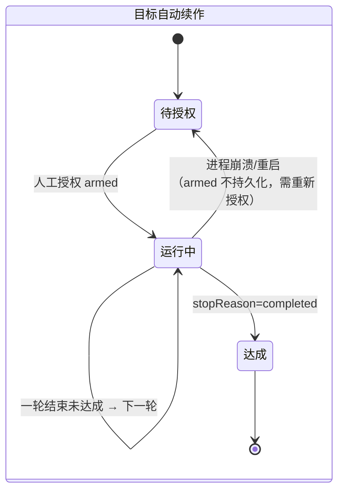
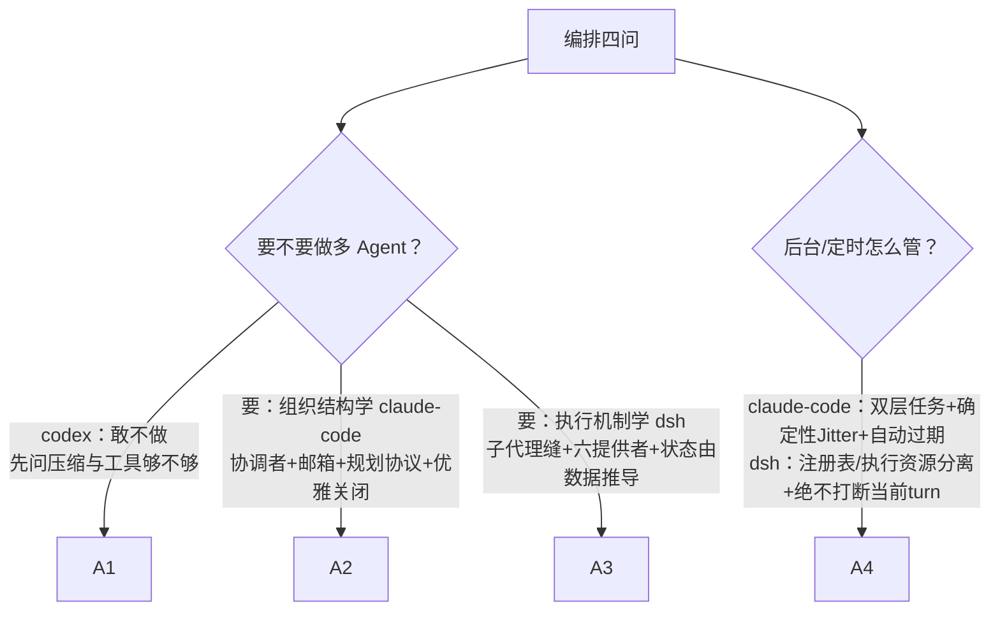

# 05-编排多Agent与后台任务对比

> **定位**：本篇从"编排"维度对比三大 Harness：什么时候才需要多 Agent、委派契约怎么定、Agent 间怎么通信、后台任务与定时怎么管、编排与主循环是什么关系。一个重要的诚实结论先行：**Codex CLI 在多 Agent 上基本缺席**——这本身就是最有教学价值的一行对比。写作目的不是罗列差异，而是教会读者"Agent 编排"这个维度的完整知识。素材来源：[00-deepseek-harness/06-编排-子代理-调度-工作流与目标]、[02-claude-code源码架构/06-多Agent协作与后台任务]、[01-codex-harness/00-总体架构与会话Actor]。

## 一、这个维度到底在解决什么问题，以及"要不要做"

编排层要回答的问题链条是：单个 Agent 不够用时→**委派**（怎么把活交出去、契约是什么）→**隔离**（子 Agent 能看到/改什么）→**通信**（Agent 之间怎么说话）→**生命周期**（后台任务、定时、怎么收尾）。但在这一切之前有一个更根本的问题，初学者最容易跳过：

**到底什么时候才需要多 Agent？** 三家给出了三种态度，这个对比本身就是第一课：

- **codex：基本不做**。它把全部工程预算押在单 Agent 循环的正确性上（单写者 Actor、取消语义、审批缓存），多 Agent 只有 mailbox 雏形。为什么敢不做？因为**单 Agent 的瓶颈是上下文窗口，而压缩机制可以推迟这个瓶颈**；且多 Agent 的协调成本（消息协议、权限路由、状态一致）对终端工具的用户价值不高。
- **claude-code：全量做**，且把它当**组织问题**解决——协调者模式、团队文件、邮箱、优雅关闭，甚至强制规划协议（子 Agent 必须先提交方案给领导者审批）。
- **dsh：机制化地做**——子代理是一个"缝"，六种提供者（进程内 spawn / fork / ACP 协议 / 甚至委托给真实存在的 Claude Code 和 Codex CLI / 完整 Harness 子进程）可插拔。

**教学结论**：先问"压缩 + 更好的工具能不能解决"，再问"任务能否自然拆成责任边界"——两问都通过才做多 Agent。把一个需要统一判断的问题硬拆成多人会议，是多 Agent 项目失败的头号原因。

## 二、逐家精讲

### 2.1 claude-code：编排是组织学

claude-code 的核心判断：多 Agent 的真正难点不是并发，是**组织结构**——怎么让多个有限理性的执行体在不共享大脑的前提下为同一目标工作。四个构件：

1. **协调者模式而非对等模式**：用户只与 Team Lead 交互，所有敏感操作审批经 Lead 的 UI。选协调者不选对等的理由有二：权限安全（队友互相触发就绕过审批）与**责任归属**（谁拆任务、谁裁决冲突、谁向用户解释，必须有明确汇总点）。
2. **TeamFile + 邮箱**：团队状态（成员表/权限白名单/任务目录）存一个 JSON 文件——**文件系统是最简单的跨进程共享状态**；Agent 间通信走**异步邮箱**（各自投递/轮询），因为 LLM 驱动的 Agent 响应时间不可预测，同步 RPC 会卡死。设计哲学：**宁可最终一致，不强求瞬时一致**。
3. **Worktree 物理隔离**：认知隔离必须配上物理隔离——多个 Agent 在同一目录落盘，再好的上下文隔离也会被文件冲突打破；"分支即隔离，PR 即合并"，Agent 负责生成变更但不负责定义真相。
4. **强制规划协议 + 优雅关闭**：需要审批的子 Agent 必须先 EnterPlanMode 只读探索、提交方案、经 Lead 审批后才能执行——把"子 Agent 的可靠性行为"做成协议而非自觉；关闭走协商（shutdown_request，队友可拒绝），不强杀。

后台与定时：任务分两层（内存运行时任务服务 UI vs 文件持久化任务服务多 Agent 认领，文件锁+双重检查防竞态）；Cron 调度有三个可迁移的细节——**确定性 Jitter**（用任务 ID 哈希做抖动种子防整点齐射；循环任务延迟、一次性任务提前——方向由任务性质定）、**自动过期**（7 天防遗忘任务无限积累）、**调度器锁选主**（文件锁 + 探测接管，不用 ZooKeeper）。

### 2.2 dsh：编排不侵入主循环

dsh 的核心判断不同：编排不是组织问题而是**扩展点问题**——编排全部是挂在 `agent/*` 事件与 inbox 之上的外层策略，主循环只做三件事：认领输入 → 驱动 step → 记录日志。委托/后台/定时/目标/规划全是插件，可装卸可替换。

子代理缝的两个精华设计：

1. **一次性与可续作两条路彻底分开**：one-shot 走 `SubagentRun`（结果 promise，前台等或注册为后台 Job）；可续作走 `Activation`（子 Agent 常驻，可执行多个 FIFO turn）。**Activation 的驻留状态（running/waiting/settled）不是存储的状态机，而是从"Agent 静默 + 拥有的子代理集合"推导出来的**——又见"状态由数据推导"哲学，重放永远自洽。
2. **六种提供者同台**：`spawn`（进程内全新子 Agent）、`fork`（继承父对话的平衡前缀做种子——同 claude-code 的缓存优化思想）、`acp`（独立进程走 Agent Client Protocol）、甚至 `claude-code` 和 `codex`（**用别家真实 CLI 当子代理**！）、`dsh-sdk`（完整 Harness 子进程）。这直接证明了一件事：**子代理的"执行位置"完全可以是可替换的**——今天在进程内，明天在远端集群，消费者零改动。

后台任务（`ctx.jobs`）与定时（schedule）也各有纪律：任务注册表拥有身份/访问/生命周期而 producer 拥有执行资源；每 owner 并发任务默认上限 10；**定时绝不打断当前 turn**（只等 Agent 完全空闲时以普通 turn 送回原会话）；周期任务错过不补跑（每记录只贡献一个最新到期事件）——编排层处处是克制的工程师品味。

### 2.3 codex：缺席的智慧

codex 只留下了 mailbox 雏形（子代理来信的 `MailboxDeliveryPhase` 状态机：答案已展示给用户后的迟到消息归下一轮，保证模型行为与用户所见一致——这条**迟到消息裁决**其实被 claude-code 的队列和 dsh 的 inbox 各自以别的形式吸收了）。它的缺席本身教了两课：①**产品形态决定编排需求**——终端工具的交互模型天然单 Agent；②**并发正确性的优先级高于编排能力**——先把单 Agent 循环写对（这正是 01 篇裁决 codex 是骨架冠军的原因），编排才有地基。

### 2.4 dsh 的两个进阶编排原语：工作流与目标

除了委派与后台，dsh 还把"长程自主"拆成两个可装卸的原语，值得初学者认识：

- **工作流引擎（Ralph 模式）**：模型自己编写编排脚本，脚本在 worker 线程的受控沙箱里执行，通过 `agent()/parallel()/pipeline()/phase()` 等钩子扇出子代理。关键纪律是**错误封闭 union**：`stopReason` 只有 completed/cancelled/error 三态，`parallel()/pipeline()` 对致命错误 re-throw、对单个子代理失败只保留占位——编排脚本的失败语义可穷举。
- **目标（goal）的防失控设计**：同一会话的自动续作（一轮轮追目标）有一个容易被忽视的安全细节——**goal 的激活状态（armed/disarmed）永不持久化**，进程崩溃恢复后必须人工重新授权才能继续自动续作。理由：自动续作是危险操作，"重启后悄悄继续跑"不符合任何人的预期。

这两点与 claude-code 的 Cron 自动过期、dsh 自己的"定时绝不打断当前 turn"共同构成一条编排层的元原则：**自主性必须是"每次续期都要重新挣来"的，而不是"给一次就永远有效"的**。

## 三、对比与裁决

| 子问题 | dsh | codex | claude-code | 裁决 |
|--------|-----|-------|-------------|------|
| 要不要做多 Agent | 做且机制化 | **敢不做**（教得最多的一行） | 全量做且组织化 | 先用 codex 的两问自查，再选学 |
| 委派契约 | ★★★ one-shot/可续作分家 + 提供者缝 | 雏形 | ★★☆ prompt 契约 + description 展示分离 | **学 dsh**：委派执行位置可替换 |
| 通信模型 | inbox 事件认领 | mailbox 迟到裁决 | ★★★ 异步邮箱 + 权限请求路由回 Lead | **学 claude-code**：审批是需要路由的资源 |
| 隔离 | fork 继承平衡前缀 | — | ★★★ Worktree 物理隔离 + 默认隔离显式共享 | **学 claude-code**：认知隔离要配物理隔离 |
| 编排与主循环关系 | ★★★ 全在事件层，主循环零感知 | 单循环无编排 | 主循环 + 编排器分离 | **学 dsh**：编排做成外层策略，主循环保持极简 |
| 后台/定时 | ★★★ 注册表/资源分离 + 绝不打断 + 错过不补 | — | ★★★ 双层任务 + Jitter + 过期 + 锁选主 | 两家互补：任务模型学 claude-code，纪律学 dsh |

## 四、转译到 Spring AI / Java 生态

| 三家机制 | Java 落地 | 关键点 |
|----------|-----------|--------|
| 子代理提供者缝 | `interface SubagentProvider { SubagentHandle spawn(SubagentSpec spec); }` + 进程内（递归 ChatClient）/远程微服务/容器三实现 | 换提供者，委派工具与模型面零改动（概念代码见 [07-Java融合落地总手册] §六） |
| 协调者 + 邮箱 | Lead/Worker 两个 Agent 服务 + Kafka 承载邮箱（[教程 07-Kafka事件骨干]）+ DB 表做团队状态 | 消息类型封闭枚举：文本/广播/权限请求/审批响应/关闭协商 |
| 强制规划协议 | 写操作前强制 HITL：子 Agent 方案入审批队列，批准后才装配写工具 | 落点是 ToolCallingManager 装饰器（已实证：HITL 不放 Advisor） |
| Worktree 隔离 | 每任务独立容器工作区或 git worktree 副本 | "分支即隔离、PR 即合并"——合并决策留给人 |
| 双层任务模型 | 运行时任务（内存，服务进度推送）+ 协作任务（DB 表：owner/blocks/blockedBy，乐观锁认领） | 两层关注点不同，勿混一张表 |
| 确定性 Jitter | 调度时间 += hash(taskId) % 窗口；循环任务延迟/一次性任务提前 | Java 调度框架默认整点齐射，必须自己加 |
| Activation 状态推导 | 子代理驻留态不落库，从"进程存活 + 拥有的子任务集合"推导 | 不维护第二状态机，重放自洽 |
| 优雅关闭 | shutdown 请求 → Worker 可拒绝（正在写文件）→ 同意后终止 + 清理注册 | 不做 SIGKILL 式强杀 |

## 五、小结

编排维度的三家分工：**codex 用缺席教了你"先问要不要"；claude-code 教你多 Agent 首先是组织学（协调者、邮箱、审批路由、物理隔离、优雅关闭）；dsh 教你编排应该是主循环之外可装卸的策略层（子代理缝、Activation 状态由数据推导、定时绝不打断当前 turn）**。给 Java 工程师的最短路径：单 Agent 先做对（codex 骨架），组织协议按 claude-code 搭，执行位置按 dsh 缝化——三步之后你的编排层既不失控也不僵化。

最后再强调一次本篇开头的那个"最重要的对比行"：codex 的缺席不是缺陷，而是提醒——**编排是放大器，放大的可以是秩序也可以是混乱**。你的单 Agent 循环还没写对（取消不干净、审批无缓存、压缩会拆散配对）之前，多 Agent 只会把这些缺陷乘以子代理的数量。三家在这一点上用三种方式说了同一句话：先把地基打正，再谈组织。

## 设计哲学要点与场景推荐（本篇内嵌）

**哲学根源**：编排域最深的分歧是对"复杂度"的态度——codex 认为复杂度应被**拒绝**（敢不做多 Agent）、claude-code 认为应被**组织**（协调者+协议）、dsh 认为应被**外置**（编排是主循环外的可装卸策略）。**推荐**：先做"要不要"的判断（压缩+好工具够不够？任务能否自然拆责任边界？）再选机制；需要并行分工→claude-code 的协调者+Worktree+强制规划协议；子代理执行位置会变（本地/远程/甚至别家 CLI）→dsh 的提供者缝；无人值守定时→claude-code 的 Jitter+自动过期+dsh 的"armed 不持久化"叠加。**不推荐**：为架构图好看而上多 Agent——编排是放大器，放大混乱也是它的功能之一。
