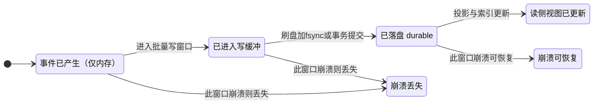
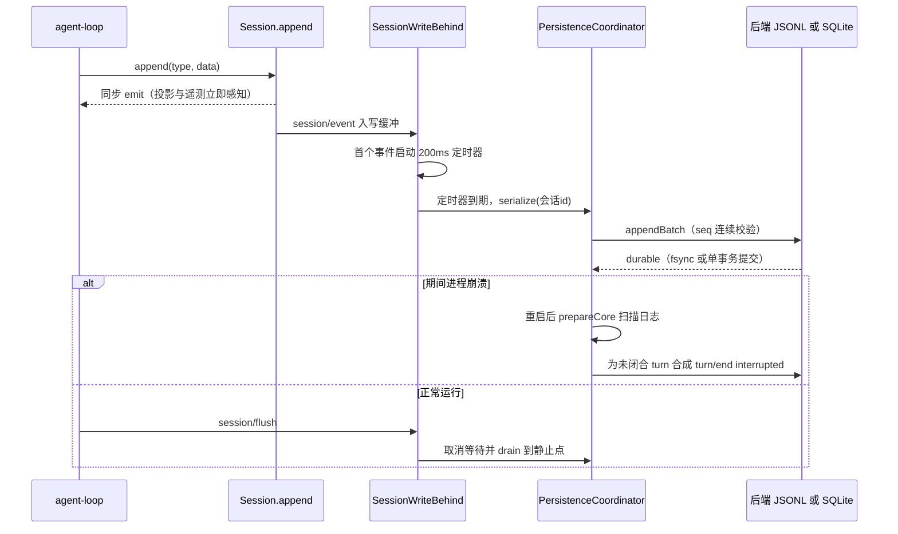
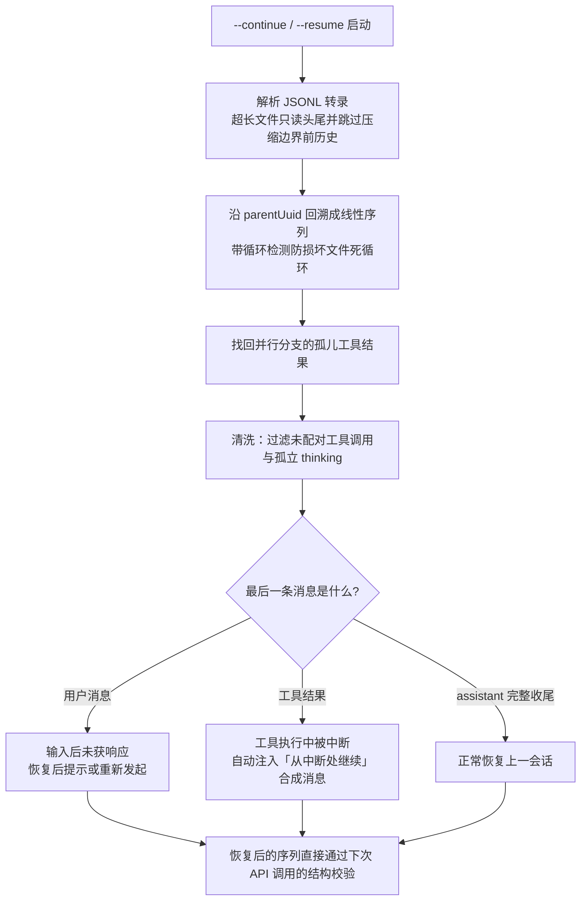
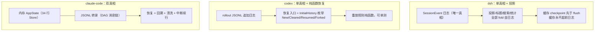

# 06-持久化恢复与可观测对比：会话怎么"记得住、救得回、看得见"

> **定位**：本篇是三大 Harness 横向对比系列的**持久化·崩溃恢复·可观测维度**篇。Agent 会话是长时、多轮、带外部副作用的——进程随时可能崩溃，崩溃后用户期待"回到刚才那一幕继续"，而运营方需要知道每一次调用花了多少钱、慢在哪里。本篇先把这个维度必须回答的**六个设计问题**讲透（顺带教事件溯源、Write-Ahead、环形缓冲等基础概念），再逐家精讲三种截然不同的答案，最后给出对比表、裁决与 Java 转译。读者画像：初学者。前置阅读：[00-总览与选型地图]；精读素材为 [00-deepseek-harness/03-会话-上下文-记忆与持久化]、[01-codex-harness/02-上下文压缩与持久化恢复]、[01-codex-harness/03-模型客户端-协议层与进阶机制]、[02-claude-code源码架构/07-状态管理-持久化与可扩展性]、[02-claude-code源码架构/08-系统韧性与成本治理]。

---

## 一、先讲透维度：Agent 会话持久化必须回答的六个问题

### 1.1 为什么 Agent 的持久化比普通应用难一个量级

普通 Web 应用的"持久化"是把业务数据写进数据库，崩了重启，数据还在表里。Agent 会话难在三点：

1. **会话是"生成中的"**：一条 assistant 消息是几百个流式 delta 拼出来的，崩溃可能发生在 delta 序列的任意中间点——你持久化的对象本身是不完整的。
2. **会话里有外部副作用**：工具调用执行了 shell 命令、改了文件、发了请求。崩溃后"恢复会话"不只是恢复文本，还要处理"这个工具到底执行完没有"的悬而未决状态。
3. **会话是用户资产且可能巨大**：一个跑了几个小时的长任务会话，日志可能几百 MB。恢复不能是"全量加载"，更不能是"丢了重来"。

所以这个维度的设计问题不是"存不存"，而是一连串更细的取舍。下面六个问题，每家 Harness 都必须逐一回答。

### 1.2 问题一：写时机与崩溃窗口——什么时候落盘，崩在半路怎么办

先教三个基础概念：

- **崩溃窗口（crash window）**：一条数据从"产生"到"真正持久化"之间的时间段。窗口内的任何时刻掉电/kill -9，这条数据就丢了。窗口越长性能越好（攒一批一次写），但丢得越多。
- **Write-Ahead Log（WAL，预写日志）**：数据库的经典手法——先把变更作为一条日志**追加**进日志文件（顺序写，快），再慢慢应用到状态。崩溃后重启，重放日志即可恢复到崩溃前状态。追加写 + 重放，正是三家 Harness 会话持久化的共同骨架。
- **fsync**：`write()` 只是把数据交给操作系统页缓存，断电仍会丢；`fsync` 才强制刷到物理磁盘。"durable（持久化完成）"的严格定义必须包含 fsync（或等价的事务提交）。

写时机的两个极端与中间态：

| 策略 | 做法 | 优点 | 代价 |
|---|---|---|---|
| 逐条同步写（write-through） | 每个事件立刻落盘 fsync | 崩溃窗口≈0 | 系统调用开销大，流式 delta 场景撑不住 |
| write-behind（写后批量） | 事件先进内存缓冲，定时/定量批量刷盘 | 高吞吐 | 有崩溃窗口，需要"崩溃后修复"机制兜底 |
| 关键节点阻塞写 | 平时批量写，但在**关键点**（如下一轮 LLM 调用前）阻塞等落盘 | 兼顾性能与恢复语义 | 要想清楚"哪些点是关键" |



这张图还有第二层含义：**E3 → E4 也是一个危险窗口**——如果读侧（投影缓存、搜索索引）先于日志更新，读侧就"读到还没落盘的未来"，一旦崩溃，日志回放出的世界和缓存里的世界对不上。这就是 1.5 节"缓存永不超前日志"的由来。

### 1.3 问题二：日志格式选择——每行自完整的 JSONL vs 事务型 SQLite

会话日志的格式决定崩溃时的"爆炸半径"：

- **JSONL（每行一个 JSON 对象，追加写）**：最简正确的崩溃安全格式。最坏情况是**最后一行被写了一半（撕裂行）**——重放时跳过残尾即可，前面的行不受任何影响，**损坏不级联**。代价是随机读差：想读第 N 条只能顺序解析。
- **SQLite（或任何事务型存储）**：单事务批次提交，失败整体回滚；支持 `WHERE seq >= ?` 的后缀读，恢复速度与日志长度无关。代价是要设计 schema，且事件与表行需要保持 1:1 映射，避免出现"日志 + 平行存储"两份真相。

dsh 两个后端都做了（见 2.1），claude-code 和 codex 都选了 JSONL——**三条腿里两条踩在"行自完整"这一边**，因为它把崩溃恢复的正确性做进了物理格式，而不依赖修复逻辑的完备性。

### 1.4 问题三：恢复语义三档——重放、断点续行、无感恢复

崩溃（或用户关掉终端）之后"恢复会话"，有三档体验，成本递增：

1. **重放（replay）**：把日志从头 fold 一遍重建状态。这是**事件溯源（Event Sourcing）**的标准动作——把状态的变化记录为不可变事件序列，当前状态 = 从初始状态出发逐个 apply 事件。顺带教两个配套词：fold 指把事件流折叠成状态的那个函数；**CQRS** 指"写模型（事件日志）与读模型（投影视图）分离"，投影就是读模型，可任意多、可重建、互不干扰。
2. **断点续行**：不仅恢复历史，还要**检测中断发生在哪个阶段**，并合成一条"从中断处继续"的消息让循环接着跑。比如日志末尾是"工具调用结果"，说明工具执行完但模型还没消化——恢复时自动注入"请从上次中断处继续"。
3. **无感恢复**：用户根本感知不到崩溃发生过。这是第 2 档做彻底之后的结果，也是 Agent 区别于普通聊天应用的核心体验。

三档之间不是互斥而是叠加：底座都是重放，续行和无感是重放之上加"中断检测 + 合成消息"。恢复逻辑还有一条工程铁律：**恢复入口应当是纯函数**（给定日志内容，确定性地给出恢复结果），这样"写一半 kill -9 再重启"可以写成单元测试，而不是靠手测。

### 1.5 问题四：单一真相 vs 双真相——状态住在哪

这是本维度最根本的架构分野：

- **单一真相（single source of truth）**：磁盘上的事件日志是唯一权威，内存里的一切派生状态（当前消息列表、统计、标题、索引）都是日志投影出来的缓存，丢了随时重建。dsh 与 codex 属于此类。
- **双真相（dual truth）**：内存里有一份完整运行时状态（供 UI 高速读写），磁盘上另有一份转录文件（供恢复与审计）。claude-code 属于此类——它换来的是终端 UI 的极致响应，付出的是**两个真相可能不一致**的永久治理成本（07 篇原话：状态架构必须围绕"最昂贵的不一致"设计）。

单一真相阵营内部还有一条关键纪律：**一切派生物（投影缓存、搜索索引、侧车存储）的写入，必须发生在日志落盘之后**——缓存永不超前日志。反例的后果：缓存说"会话有 100 条事件"，日志只落了 98 条，崩溃重启后 fold 出的世界比缓存里的少两条，读侧读到过自己编造的未来。

### 1.6 问题五：错误处理分层与重试降级

Agent 的错误不是二元的成功/失败，而是光谱。成熟做法是**分层隔离**（claude-code 三层的通用化）：

1. **工具级**：工具失败**不是异常而是输出**——把错误信息作为工具结果喂回模型，让模型自己决定下一步。模型 world 里的失败是可以被利用的信息。
2. **查询级（LLM 调用级）**：超时、限流 429、Prompt 超长——按错误类别映射到不同恢复策略：重试、压缩后重试、流式转同步、换模型。
3. **系统级**：持续过载（529）、网络断开——识别为系统性问题，**熔断停止重试**上报用户。盲目重试只会放大故障。

重试的精细化纪律（claude-code 与 codex 共有的公约数）：

- **按请求类别区分容忍度**：主对话采样、工具结果回填、后台压缩，各自不同的重试策略，而不是一个全局 try-catch。
- **前台/后台差异化**：过载（529）期间只有前台查询（用户在等）才重试；后台任务（摘要、标题）直接放弃——过载期每次重试有数倍网关放大效应，全部重试等于雪上加霜。
- **降级优于盲目重试**：流式失败降级为同步；Prompt 过长从错误消息解析超限量、**精确压缩恰好够的量**；主模型连续失败回退备用模型（可用性优先于最优性）。
- **缓存感知重试**：短暂限流时宁可按 `Retry-After` 等待后原样重发（保住 Prompt Cache 前缀命中），也不改参数立刻重发（缓存全灭）。缓存读取价格约为普通输入的十分之一，这个重试决策直接是钱。
- **快速失败清单**：认证错误（401/403）重试无意义，同样的凭证注定同样的结果——不重试。
- **降级粘性（codex 特有）**：一旦本会话降级到某个 provider，**会话生命周期内粘住它**——中途换 provider 意味着上下文格式不兼容，必须触发整轮压缩（见 2.2）。

### 1.7 问题六：遥测与成本计量——采集与交付分离

可观测的通用分工：**harness 只负责 emit（采集），SDK/后端负责 batching、retry、loss（交付）**。dsh 把这条写成公理（2.1），claude-code 用**队列-Sink 模式**实现——Sink 未就绪时事件先入队，挂载后排空，启动阶段一个事件都不丢。成本计量则围绕 token usage 展开：请求级从 API 响应的 usage 计算，会话级按模型细分并持久化，最终对应到 Micrometer 侧的 `gen_ai.client.token.usage` 一类指标（见第五节）。

---

## 二、逐家精讲

### 2.1 DeepSeek Harness：日志即真相，缓存永不超前日志

dsh 的会话体系是**纯事件溯源 + CQRS** 的教科书落地。核心心智模型一句话：内存中一个 append-only `SessionEvent` 日志（`Session`）是唯一真相，一切派生状态——投影、标题、统计、遥测、搜索、反馈——都是从这份日志 fold 出来的只读视图（详见 [00-deepseek-harness/03-会话-上下文-记忆与持久化]）。

**写路径与崩溃窗口**。写侧只有一个入口 `Session.append`，事件同步 emit 给所有消费者（投影、遥测、搜索立即感知），持久化则交给 `PersistenceCoordinator` 的 **write-behind 写缓冲**：首个 pending 事件启动 200ms 定时器，后续事件加入但不重置；到期批量落盘；`flush()` 可随时 drain 到静止点并共享 barrier。同会话操作经 `serialize(id)` **串行化**，绝不交叉。崩溃后由 `prepareCore` 修复：只丢弃撕裂的最后记录，对"完整但未闭合的 turn"**合成 `turn/end {reason: interrupted}` 闭合而非截断**——因为单个 turn 可能巨大，截断丢的是大量有效历史，闭合则保住全部已完成内容，只是给末尾打上"被打断"的语义标记。



**两个后端，一个编排器**。JSONL 后端用 `link()+unlink()` 原子替换 + 目录 fsync，`packChunks` 把连续的流式 delta 无损打包（实测小约 60%）再用 zstd 压帧；SQLite 后端则一行事件一行表记录（1:1，**无平行 schema**），单事务一批次，`WHERE seq >= ?` 直接后缀读。两份"崩溃安全"哲学殊途同归：**崩溃安全优先于实时**。

**三条反直觉纪律**（dsh 最值得抄的部分）：

1. **缓存永不超前日志**。投影缓存的 `write()` 先取 checkpoint、再调 `ctx.sessions.flush`——用持久化屏障保证"缓存记录对应的日志已落盘"；message-feedback 侧车先 flush 目标日志再写侧车。冷读阶梯（零 IO 缓存 → 缓存行+tail replay → 全量重建）让会话列表**永不加载全日志**。
2. **宁可过度拒绝的格式策略**。事件 schema 里 `ignorable` 缺失即视为 required——遇到未识别且非 ignorable 的事件**拒绝读取**，给出方向感知的错误文案（提示升级 harness，而非报"文件损坏"）。理由：静默重建一个被掏空的会话，比拒绝恢复危险得多。
3. **提交即成功**。storage-domain 的写链顺序是 `backend durability → 改内存 → emit 事件`；事件是通知而非事务参与者——emit 时提交点已过，消费者同步抛错只记录、不回滚。被拒的写则内存不动，**读永不偏离介质**。

**遥测边界公理**：harness 止于 `emit()`，SDK 拥有 batching/retry/loss。采集与交付彻底分离，harness 不为遥测自身的可靠性负责。

### 2.2 Codex：append-only JSONL 与纯函数恢复

codex（Rust 实现）的持久化比 dsh 更"素"，但每一条都是深思熟虑的结果（详见 [01-codex-harness/02-上下文压缩与持久化恢复]）：

- **append-only JSONL，每行自完整**——崩溃最坏丢尾行，损坏不级联。
- **写入可靠性三件套**：后台单写者（同一 rollout 文件永远只有一个写者，消灭并发写撕裂）；**pending 确认后才移除**（一条待写事件只有在确认持久化完成后才从 pending 队列清除——**持久化确认先于条目终结**，绝不存在"以为写完了"的中间态）；**幂等 persist**（同一条目重复 persist 不产生重复行，崩溃后重放安全）。
- **恢复入口 = 投影方法族枚举**：重放规则是纯函数——`InitialHistory` 四种枚举（New/Cleared/Resumed/Forked）各自确定性地决定"从 rollout 重放出什么初始状态"。恢复逻辑因此可单测：构造一份写一半的 JSONL，断言重放结果，kill -9 场景变成 CI 用例。
- **TurnContext 作为 durable baseline**：每个 turn 开始、每次压缩完成后落一次配置快照——恢复时不必从第 0 行推断"当时的模型/工具集是什么"，baseline 直接给答案。
- **Fork 继承源格式而非目标默认**：从老格式会话 fork 出新会话时沿用源格式。"看起来可以随便选"的地方恰是 bug 高发区——格式选择必须确定性。

与持久化配对的是**双层模型客户端**（详见 [01-codex-harness/03-模型客户端-协议层与进阶机制]）：连接级层粘性持有 auth 与**降级决策**（会话生命周期内一致），请求级层显式传递每次的 model/温度/工具集。重试集中在一个状态机：指数退避 5s 起步、上限 60s、**按请求类别区分**（流式采样 / 工具回填 / 压缩三类的容忍度不同）。降级粘性是 codex 独有的清醒：同一会话中途换 provider 会导致上下文格式不兼容，所以要么粘住，要么切换时触发整轮压缩（与"模型切换触发压缩"共享同一 `comp_hash` 机制）。

成本侧，codex 的 token 计数用**混合策略**：本地字节启发式估算只做粗下界与预警；截断/压缩等**决策一律用服务器上报的真实值**。遥测侧，压缩窗口编号（"这是第几次压缩"）与 turn 六相位计时（含 TTFT）构成性能归因的标准词汇表。

### 2.3 Claude Code：DAG 消息链与无感恢复

claude-code 是三家里唯一的**双真相架构**（详见 [02-claude-code源码架构/07-状态管理-持久化与可扩展性]）：内存 AppState（一个 34 行自研 Store 管理的大不可变对象）供 UI 高速读写，磁盘 JSONL 转录文件供恢复与审计。它的持久化亮点全在"数据结构匹配真实语义"与"恢复体验"上：

**DAG 而非数组**。转录文件里消息用 `uuid + parentUuid` 链成**有向无环图**——并行工具调用各自成链、在下一个用户消息处汇合，压缩边界是新链起点。线性数组表达不了分支与汇合，硬塞进数组必然丢信息。

**写入路径三机制**，每一条都由恢复语义反推：

1. **延迟物化**：第一条真正对话消息到来前文件不落盘——后台任务不留空文件。
2. **队列化批量写**：按文件分组写队列批量刷盘；工具执行的多条消息（调用/结果/进度）作为**整体**持久化。
3. **关键节点阻塞写**：进入下一轮 LLM 调用**前**，阻塞等待已产生消息写盘——保证崩溃后能从断点恢复；assistant 流式消息则 fire-and-forget（阻塞会卡住流式处理）。**哪些写要等、哪些不等，取决于崩溃后恢复语义的需要**——这是写时机问题（1.2）最好的注脚。

**恢复路径的中断检测**——"无感恢复"的实现核心：



两个容易被忽略的细节：**找回孤儿工具结果**（DAG 转线性时只走一条链会丢掉并行分支）；**清洗必须保证恢复后的消息序列能直接通过下一次 API 调用的结构校验**——没有结果的工具调用会被 API 拒收，所以必须过滤。工程侧还有 sidecar 文件模式（子 Agent 元数据独立存，主格式永不变更）与大文件优化（150MB 转录只读 32MB 有效数据）。

**错误与重试**（详见 [02-claude-code源码架构/08-系统韧性与成本治理]）：三层错误隔离（工具错误是输出 / 查询级分类器降级 / 系统级熔断）；529 只前台重试；`Retry-After` 优先、指数退避 + 25% 抖动上限 32s；缓存感知重试与快速失败清单（见 1.6）。

**可观测与成本台账**——三家里最厚重的：

- **四通道分层日志**：调试日志（缓冲写，调试模式同步写防丢失）、错误日志（**内存环形缓冲 100 条** + Sink 持久化）、遥测事件（结构化采样、双后端路由）、OTel Span（含首 token 延迟、重试次数、成本）。顺带教：**环形缓冲（ring buffer）**是固定容量的循环数组，写满覆盖最旧——用 O(1) 内存永远保留"最近 N 条"，错误日志的完美载体。
- **队列-Sink 模式**：所有通道共用——Sink 未初始化时事件进队列，挂载后排空，启动阶段不丢事件也不阻塞启动。
- **类型系统强制隐私审计**：两个 `never` 哨兵类型，遥测字段必须显式断言"我已确认这不是代码/文件路径"或"我已确认是 PII 标记字段"——隐私把关做在**入口**，不是事后脱敏。
- **成本台账**：计费五维（输入/输出/缓存写入/缓存读取/搜索次数）；请求级成本递归累加（含 advisor 等内部小模型调用）；会话级按模型细分并在进程退出时持久化，**恢复时校验会话 ID 防错配**；未知模型用默认定价并标注"可能不准确"而非崩溃。
- **收益递减检测**：子 Agent 连续 3 次续跑且每次新增 token 很少 → 判定低价值重复工作 → 未达预算也停止。成本控制从"花够了就停"升级为"不再产生价值就停"。

### 2.4 三家真相结构一图对比



---

## 三、全维度对比表

| 维度 | DeepSeek Harness | Codex CLI | Claude Code |
|---|---|---|---|
| **真相模型** | 单一真相：SessionEvent 日志，一切派生皆投影 | 单一真相：rollout JSONL，恢复走纯函数重放 | 双真相：内存 AppState + 磁盘转录（进程级状态另立单例） |
| **日志格式** | JSONL(zstd+delta 打包) 与 SQLite 双后端，共享编排器 | append-only JSONL，每行自完整 | JSONL，消息以 uuid/parentUuid 链成 DAG |
| **写时机** | write-behind 200ms 批量窗口 + flush barrier；同会话串行化 | 后台单写者 + pending 确认后才移除 + 幂等 persist | 延迟物化 + 队列批量写 + 关键节点（下轮 LLM 调用前）阻塞写 |
| **崩溃修复** | 只丢撕裂记录；孤儿 turn 合成 interrupted **闭合而非截断**；孤儿 compaction 锁可检测 | 丢尾行；幂等重放安全；TurnContext baseline 免推断 | 回溯线性化（循环检测）+ 找回孤儿工具结果 + 清洗未配对调用 |
| **恢复语义** | 重放 + 冷读阶梯（列表永不加载全日志） | 断点续行：InitialHistory 四入口纯函数，可 CI 单测 | **无感恢复**：中断阶段检测 + 自动注入续行合成消息 |
| **格式兼容策略** | 「宁可过度拒绝」：未识别非 ignorable 事件拒读 | Fork 继承源格式；TurnContext 落快照 | 清洗迁移旧格式；sidecar 文件保主格式稳定 |
| **错误分层** | 领域化：compaction 溢出恢复、写链失败读不偏离介质 | 按请求类别集中重试状态机（5s 起步上限 60s） | 显式三层：工具错误是输出 / 查询分类降级 / 系统级熔断 |
| **降级与粘性** | 后端可整体替换（能力缝） | **降级粘性**：会话内锁定 provider，切换必须触发压缩 | 529 仅前台重试；主模型连续 3 次失败回退备用模型 |
| **遥测架构** | harness 止于 emit()，SDK 拥有 batching/retry/loss | 压缩窗口编号 + turn 六相位计时（含 TTFT） | 四通道分层 + 队列-Sink + 类型系统强制隐私审计 |
| **成本计量** | shadow-price 协议：纯消费者零状态 Token 归因 | 服务器上报值做决策，本地估算只做预警 | 五维定价台账 + 会话级持久化 + 收益递减检测 |
| **最弱一项** | 抽象陡峭，投影纪律对插件作者要求高 | 无投影缓存，海量会话列表查询乏力 | 双真相一致性治理成本（状态分裂风险） |

---

## 四、裁决：取长补短

**七条公约数（三家都做对了，无脑抄）**：

1. **append-only 日志 + 行自完整**（或等价的单事务批次）——把崩溃正确性做进物理格式；
2. **崩溃时闭合而非截断**——孤儿 turn/孤儿锁打语义标记，不删数据；
3. **持久化确认先于状态终结**——pending 不确认不清除，flush 先于缓存提交；
4. **恢复入口纯函数化**——"写一半 kill -9"必须是单元测试；
5. **工具错误是输出不是异常**——错误信息喂回模型；
6. **重试按错误类别与请求来源差异化**，降级优于盲目重试，快速失败清单明确不重试什么；
7. **采集与交付分离**——harness 止于 emit，队列-Sink 兜启动窗口。

**三个分歧点（按场景选学）**：

- **投影缓存**（dsh）：会话量达到"列表页不可能全量加载"时才需要；小规模上是纯开销。抄它的前提是接受"缓存永不超前日志"的纪律。
- **DAG 消息链**（claude-code）：只要你的 Agent 有**并行工具调用**就必须学——线性数组表达不了分支汇合，这个债迟早要还。
- **无感恢复**（claude-code）：终端/CLI 形态的体验刚需；服务端长任务场景对应的是 checkpoint + 断点续跑（同构思想，见 [教程 08-架构师进阶/06-长任务持久化与中断恢复]）。

**融合配方（若从零造一个 Java Agent 运行时）**：真相层用 dsh 的"单日志 + 投影 + 缓存永不超前日志"；恢复入口学 codex 的"枚举 + 纯函数 + CI 恢复演练"；日志格式在 JSONL 与 SQLite 间按"要不要后缀读/全文搜索"取舍（要，则 dsh 的 SQLite 1:1 方案）；消息结构预埋 claude-code 的 DAG 链字段（哪怕 V1 只有线性）；写时机取 claude-code 的"关键节点阻塞写"并按恢复语义逐点论证；错误/重试层抄 claude-code 三层 + codex 的按类别状态机与降级粘性；遥测用队列-Sink + emit 边界公理；成本台账学 claude-code 的五维 + 收益递减检测，归因机制用 dsh 的 shadow-price。

---

## 五、转译到 Spring AI / Java

| 三家机制 | Java/Spring AI 对应 | 要点 |
|---|---|---|
| SessionEvent 日志 + 投影 | 自研 `ChatMemoryRepository` 实现 + 事件表 | 官方 2.0.0 仅有 `InMemoryChatMemoryRepository` 自动装配，持久化需自研 `implements ChatMemoryRepository`；读取侧用 `ChatMemory.get(String)` 单参签名取回历史 |
| Message 持久化 | 存可序列化 Map，读回按 MessageType 重建 | `Message` 及子类无 property-based Creator，Jackson 直接 round-trip 必失败——先序列化验证再上生产（[附录 00-Advisor与ChatMemory §2.3]） |
| 恢复入口纯函数 | `sealed interface InitialHistory { New, Resumed, Forked }` + 独立恢复器组件 | 恢复器只依赖"日志内容"，不依赖网络/时钟——才能单测 kill -9 |
| 关键节点阻塞写 | WebFlux 下**不许 block**：改写为"写完成信号触发下一轮"（`Mono.then`/`concatMap` 串联） | claude-code 是同步 CLI 可以阻塞；EventLoop 上阻塞是 WebFlux 铁律禁区（[教程 01-WebFlux与响应式编程]） |
| 三层错误 + 分类重试 | `Retry.backoff(...).jitter(0.25).filter(分类谓词)` + Resilience4j 熔断 | 按错误类别与请求来源写不同重试谓词，策略收敛为显式 Bean（[教程 08-架构师进阶/08-响应式错误处理]） |
| 降级粘性 | ProviderSession 组件：会话内记住当前 provider，切换→触发压缩（概念代码） | 对照 [教程 04-企业级架构主干/12-模型路由与降级] |
| 请求级 token 计量 | `Usage.getPromptTokens()/getTotalTokens()`（已实证）做决策 | 本地估算只做预警，决策一律用服务器上报值 |
| 遥测与成本台账 | Micrometer `gen_ai.client.token.usage` + Observation 体系 | Span 树/Convention 见 [教程 05-Observation可观测]；全链路追踪见 [教程 04-企业级架构主干/02-全链路可观测性] 与 [教程 06-TraceId全链路追踪]；成本归因与预算见 [教程 04-企业级架构主干/07-成本治理与Token计量] |
| 队列-Sink / 环形缓冲 | 自研事件缓冲组件（概念代码）；环形缓冲可用 `ArrayDeque` 定容淘汰实现 | 启动期 Sink 未就绪不丢事件；错误最近 N 条常驻内存供诊断 |

一段可直接对照实现的"事件 + 恢复入口"骨架（**概念代码**，非真实 Spring AI API）：

```java
// 概念代码：会话事件与恢复入口的骨架示意
public sealed interface SessionEvent {
    record UserMsg(String text, Instant at) implements SessionEvent {}
    record AssistantMsg(String text, Usage usage) implements SessionEvent {}
    record ToolCall(String callId, String name, String argsJson) implements SessionEvent {}
    record ToolResult(String callId, String resultJson, boolean error) implements SessionEvent {}
    record TurnEnd(TurnEndReason reason) implements SessionEvent {}   // COMPLETED / INTERRUPTED
}

// 恢复入口 = 纯函数：给定事件序列，确定性产出恢复计划（可 CI 单测 kill -9 场景）
public sealed interface RecoveryPlan {
    record Fresh() implements RecoveryPlan {}
    record Resume(List<SessionEvent> folded, String syntheticContinueMsg) implements RecoveryPlan {}
}

public class SessionRecovery {
    public RecoveryPlan recover(List<SessionEvent> log) {
        if (log.isEmpty()) return new RecoveryPlan.Fresh();
        SessionEvent last = log.get(log.size() - 1);
        if (last instanceof SessionEvent.ToolResult tr && !tr.error()) {
            // 中断发生在"工具执行完、模型未消化"——断点续行
            return new RecoveryPlan.Resume(log, "从上次中断的工具结果处继续");
        }
        return new RecoveryPlan.Resume(log, null);
    }
}
```

落地清单按优先级：① 自研 `ChatMemoryRepository` 持久化 + Message Map 往返测试；② 事件日志 append-only + 崩溃闭合（interrupted）；③ 恢复器纯函数 + 恢复演练测试；④ Retry 分类谓词 + Resilience4j 熔断；⑤ `gen_ai.client.token.usage` 成本台账与租户归因；⑥ 投影缓存（会话量上来再做）。诊断与调优的闭环方法，见 [教程 10-调优实战与方法论]。

---

## 六、总结

这个维度三家给出了三种完整自洽的答案：**dsh 用"日志即真相 + 缓存永不超前日志"把可重放性做成体系不变式；codex 用"行自完整 JSONL + 纯函数恢复入口"把崩溃正确性做成可测试的工程事实；claude-code 用"DAG 消息链 + 中断检测续行 + 四通道可观测"把恢复做成用户体验**。把它们拧成一句给 Java Agent 架构师的话：**会话的唯一真相应该是一条 append-only 日志；一切派生状态必须落后于日志半步；恢复逻辑必须是纯函数并通过"崩溃演练"测试；错误按层隔离、重试按类别与来源差异化、遥测采集与交付分离、成本计量从第一版就进台账**——做到这四句，你的 Agent 就同时"记得住、救得回、看得见"。

## 设计哲学要点与场景推荐（本篇内嵌）

**哲学根源**：持久化域的分歧是"真相"的哲学——dsh 相信唯一日志（一切派生皆投影）、codex 相信重放入口（恢复是纯函数）、claude-code 证明双真相的代价（它的进程单例正是它自己承认的头号债）。**推荐**：合规/审计/会话可回放是硬需求→直接按 dsh 事件溯源设计（写侧单入口+投影读面）；一般 Web 服务→codex 的 JSONL+持久化先于终态起步，将来可渐进迁移；所有系统必抄的三条公约数——持久化先于终态、消息配对完整、队列-Sink 保启动期观测。**不推荐**：内存态会话+定时全量快照——崩溃窗口内的丢失不可控，且快照无法回答"中间发生了什么"（审计不可用）。
