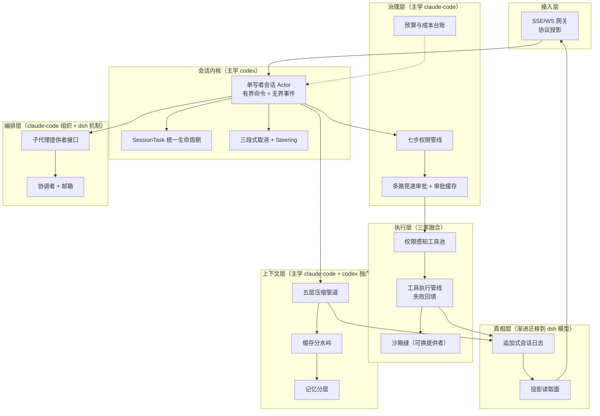
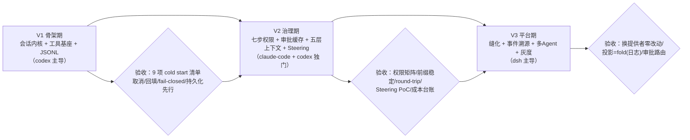

# 07-Java融合落地总手册

> **定位**：本篇是「三大 Harness 综合对比」子系列的落地篇：把 01-06 六个维度的对比裁决（会话引擎/上下文/工具/安全/编排/持久化）合成**一个完整的 Java Agent 系统蓝图**——逐模块教你怎么设计、为什么这么设计、接口长什么样、怎么验证。它不是对比表，而是一份"如果你今天从零建一个 Spring AI Agent 平台，三家精华如何装进同一个系统"的施工图。读者画像：准备动手的 Java 工程师。前置阅读：[00-总览与选型地图]（了解三家画像）；各维度细节随查 01-06 篇。技术栈：Spring Boot 4.1.0 / Spring AI 2.0.0 / WebFlux / Java 21；已实证 API 直接用，自研处标"概念代码"。

## 一、系统全景：七个模块与三家出处



阅读方式：每个模块三段式——**为什么这样设计（三家的教训）→ Java 怎么做（接口草图）→ 怎么验证**。

## 二、模块一：会话内核（出处：codex 为主）

**为什么**：01 篇的裁决——主循环正确性是地基。claude-code 的 AsyncGenerator 循环灵活但双真相源埋了状态分裂的雷；dsh 的 inbox 优雅但抽象门槛高；**codex 的单写者 Actor 是初学者也能写对的并发模型**：所有会话变更经过一个串行消费者，天然免锁，"读状态 → 决策 → 写状态"原子成立。

**Java 做法**（概念代码，骨架）：

```java
// Op/Event = Java 21 sealed interface，契约先行
public sealed interface SessionOp permits UserInput, Interrupt, Approve, CompactOp, SteerInput {}
public sealed interface SessionEvent permits TurnStarted, Delta, ToolBegin, ToolEnd, TurnAborted, Error {}

// 单写者：有界命令队列 + 单消费者（虚拟线程）+ Sinks 事件出口
public class SessionActor {
    private final BlockingQueue<SessionOp> ops = new ArrayBlockingQueue<>(512); // 有界=天然反压
    private final Sinks.Many<SessionEvent> events = Sinks.many().multicast().onBackpressureBuffer();

    public void submit(SessionOp op) { ops.add(op); }  // 队列满时挂起调用方而非 OOM

    // 单消费者循环：串行 match 分发，读-决策-写天然原子
    void run() {
        while (running) {
            var op = ops.take();                              // 阻塞等待
            switch (op) {                                     // sealed 穷尽匹配
                case UserInput u -> startOrSteer(u);          // 空闲=开新turn；忙碌=Steering队列
                case Interrupt i -> interruptTask();          // 三段取消
                case Approve a -> resolveApproval(a);
                // ...
            }
        }
    }
}
```

三条配套纪律（codex 铁律）：①**SessionTask 统一生命周期**——对话/压缩/审查/命令四类任务实现同一接口（`kind()/run()/abort()`），收尾钩子（统计/落盘/终态事件）单点不漏；②**三段式取消**——协作取消信号 → 100ms 宽限 → 强制终止；③**Steering**——运行中的补充输入进 pending 队列，在流式循环的采样间隙原子合并，不打断也不丢失（01 篇 §3.5）。

**验证**：并发注入 100 个交错 Op，断言事件序列无交错错乱；Steering PoC——流式回答中途追加输入，验证不打断且下一间隙合并；取消后每个已发出的 tool call 都有配对的取消态结果。

## 三、模块二：工具系统（出处：三家融合）

**为什么**：03 篇的裁决——**接口学 claude-code（自描述+安全元数据）、装配学 codex（每 turn 重算）、错误处理学 codex（回填不抛异常）、治理外置学 dsh（管线钩子）**。四者分别解决"模型看到什么""何时看到""失败怎么办""策略放哪"四个正交问题。

**Java 做法**：

```java
// 权限感知的每-turn 装配（claude-code 预过滤 + codex 每-turn 装配）
public List<ToolCallback> assembleForTurn(ToolPermissionContext ctx, ToolSpec spec) {
    return allTools.stream()
            .filter(t -> !ruleEngine.denied(t.getName(), ctx))      // deny 预过滤：模型看不到被禁工具
            .filter(t -> t.metadata().exposedIn(spec.mode()))       // plan 模式只暴露只读工具（硬约束）
            .sorted(Comparator.comparing(ToolCallback::getName))    // 稳定排序：保 Prompt Cache
            .toList();
}

// 失败回填基类（codex 铁律：工具错误是输出不是异常——抛异常会断流）
public abstract class SafeToolCallback implements ToolCallback {
    @Override
    public String call(String input) {
        try {
            return doCall(input);
        } catch (Exception e) {
            return "{\"success\":false,\"error\":\"%s\"}"           // 回填结构化错误给模型自愈
                    .formatted(shortMessage(e));                     // 短信息：只留前5帧堆栈
        }
    }
    protected abstract String doCall(String input);
}
```

**执行管线**挂三个外置钩子（dsh 式）：`preExecute`（权限/沙箱策略，可短路拒绝）→ 执行（超时/并发门控：按工具元数据 `concurrencySafe(input)` 判定，安全可并行、写操作串行、结果按发起顺序回传）→ `postExecute`（结果审计/改写）。工具本身不知道策略存在——**治理不污染执行**。

**验证**：契约测试每个工具 Schema 合法；deny 过滤矩阵测试；失败回填测试（抛异常的工具返回错误 JSON 而非中断循环）；并发测试（3 读 1 写：读并行完成、写前后保序）。

## 四、模块三：治理层（出处：claude-code 为主 + codex 审批缓存）

**为什么**：04 篇的裁决——三家安全机制**正交**：claude-code 最会"判断"（七步管线）、codex 最会"少打扰"（审批缓存）、dsh 最会"兜底"（fail-closed 沙箱缝）。融合公式 = 三者叠加。

**Java 做法**：权限评估做成**无副作用纯函数**（完整七步见 [02-claude-code源码架构/10-Java工程师借鉴手册] §10.6），后置阶段做三件事：

1. **多路竞速审批**（claude-code）：需要人工时四路并行——审批 UI / 规则化 Hook 自动应答 / 廉价 LLM 分类器 / 消息渠道，`CompletableFuture.anyOf` + 原子抢位，最先到者胜。
2. **审批缓存**（codex 独门，性价比最高）：批准过的操作按**结构化 key**（命令前缀 / 规范化路径 / host:port）缓存，同 key 再问直接放行；失败升级重试——先用受限权限试，失败才申请全权，缓存联动免二次审批。**没有缓存的审批系统会在第二天被用户关掉。**
3. **拒绝追踪**（claude-code）：分类器/自动决策连续拒绝 3 次 → 强制升级人工——Agent 意图与策略系统性冲突时必须让人类介入。

沙箱按 dsh 的缝式设计：`ExecutionEnvironment` 接口 + 本机/容器/远程三提供者，工具消费者只依赖接口。**铁律不变**：Deny 最先且不可覆盖；敏感路径检查 bypass 免疫；权限元数据本身对 Agent 不可写（防自我提权）。

**验证**：4×2 决策矩阵单测（policy × request）；缓存命中/失效测试；竞速测试（Hook 先回则 UI 不弹）；提权渗透测试（尝试让 Agent 改自己的权限配置必须失败）。

## 五、模块四：上下文层（出处：claude-code 主干 + codex 两条独门）

**为什么**：02 篇的裁决——claude-code 的五层管道是预算管理的天花板；codex 贡献两条 claude-code 没有的纪律：**重注入位置**（turn 中压缩后的初始上下文插在最后一条真实 user 消息之前）与**差值注入**（环境快照只注 diff）。dsh 的贡献是"压缩成本可核算"（shadow-price 思想：压缩事件记录被替换范围）。

**Java 做法**（五层管道简化版，完整见 [02-claude-code源码架构/10] §10.5）：

| 层 | 手段 | 成本 |
|----|------|------|
| 1 工具结果预算 | 超限结果落盘换路径引用（自定义 `ToolCallResultConverter`） | 零 |
| 2 旧结果清除 | `ChatMemoryRepository` 读取时替换占位符 | 零 |
| 3 历史裁剪 | 直接删低价值中间轮次 | 零 |
| 4 粗粒度折叠 | 连续消息坍缩为摘要 | 低 |
| 5 全量摘要 | 廉价模型生成 9 段结构化摘要 + 熔断 | 一次调用 |

配套：**缓存分水岭**（稳定段前/动态段后，工具池稳定排序——账单可验证）；**记忆分层**（会话内 ChatMemory 自研 Repository——**Message 存 Map 再按 MessageType 重建，禁止直接 JSON 序列化**；跨会话偏好/知识库）；压缩的递归防护（摘要调用不再触发压缩）与配对不变量（截断不拆散 tool_use/tool_result）。

**验证**：前缀稳定性测试（动态段变更后请求前缀字节不变）；缓存命中率账单核对；round-trip 序列化测试（独立最小程序打印读回真实类型）；压缩后消息配对完整性校验。

## 六、模块五：编排层（出处：claude-code 组织 + dsh 机制）

**为什么**：05 篇的裁决——**组织结构抄 claude-code**（协调者模式带来权限安全与责任归属、邮箱通信拥抱最终一致、强制规划协议让子 Agent 先交方案再动手），**执行机制抄 dsh**（子代理做成可换提供者：进程内 one-shot / 独立服务 / 远程沙箱，主循环零改动）。

**Java 做法**：

```java
// 子代理提供者缝（dsh 式：换提供者不换消费者）
public interface SubagentProvider {
    SubagentHandle spawn(SubagentSpec spec);          // spec: 目标/工具池/隔离级别/预算
}
// 提供者族：InProcessSubagentProvider（递归 ChatClient）/
//           RemoteSubagentProvider（独立微服务）/  ContainerSubagentProvider（隔离执行）

// 组织协议（claude-code 式）：协调者 + 邮箱（Kafka 承载）
// - 子 Agent 敏感操作 → 权限请求消息路由回有 UI 的协调者（审批是需要路由的资源）
// - 子 Agent 完成方案 → plan_approval_request → 协调者审批后才能进入执行
// - 优雅关闭：shutdown_request → 子 Agent 可拒绝并说明理由 → 同意后才终止
```

定时任务用分布式调度 + **确定性 Jitter**（循环任务延迟最多 15 分钟、一次性任务提前最多 90 秒——方向由任务性质决定）+ 自动过期（防遗忘任务无限积累）。**判断标准**：能自然拆成责任边界的任务才做多 Agent；需要统一判断的问题硬拆只会制造协调成本（05 篇）。

**验证**：审批消息路由测试（子 Agent 请求出现在协调者 UI）；规划协议测试（未审批不得执行）；Jitter 分布测试（同刻任务分散在窗口内）。

## 七、模块六：真相层（出处：codex 起步 → dsh 终态）

**为什么**：06 篇的裁决——**从 codex 的 JSONL 起步，渐进迁移到 dsh 的事件溯源**。claude-code 的双真相（消息 DAG + 进程级 100 字段单例）是反例，引以为戒。

**Java 做法**：

- **V1（起步）**：append-only JSONL（每行自完整 JSON）+ **持久化先于终态事件**（`persist().then(emitFinal())` 保序——崩溃后不会出现"被中止了却查无此事"）+ 恢复入口纯函数（New/Resumed/Forked）重放 + 中断检测续行（末条是工具结果 → 自动注入"从中断处继续"）。
- **V3（平台化）**：日志升级为唯一真相（dsh 哲学：凡模型可见必落日志，运行时不变式守护），标题/统计/审计/检索/前端视图全部改为**日志的投影**（CQRS 读面），不再维护第二套状态机。若 V1 的 JSONL 每行是完整事件，此步是加投影器而非重写。
- **可观测**（claude-code 贡献）：队列-Sink 模式（Sink 未就绪事件入内存队列，挂载后排空）；每次 LLM 调用记录 token 分布（含缓存命中）/TTFT/重试次数/压缩标记；Micrometer `gen_ai.client.token.usage` + 按租户成本归因。

**验证**：kill -9 崩溃恢复测试（恢复后消息可直接过下一次 API 结构校验）；投影一致性测试（投影 = fold(日志) 恒成立）；"缓存永不超前日志"检查（读侧不领先写侧）。

## 八、实施顺序与总体验证



三个阶段各自的"不做清单"同样重要：V1 **不要**做插件框架（dsh 的教训——抽象成本前置会压垮小团队）；V2 **不要**做多 Agent（治理未稳先上编排 = 给失控加速）；V3 **不要**再容忍第二真相源（任何绕过日志直写状态的代码都是回归）。

## 九、总结

七个模块、三家出处、三阶段验收——这张蓝图的本质是把三个权威实现走过的路**压缩成一条可施工的路径**：codex 告诉你会话内核哪三件事必须先做对（单写者、取消语义、持久化先行），claude-code 告诉你行为治理怎么从"能用"做到"好用"（管线、竞速、缓存、预算），dsh 告诉你系统什么时候该"缝化"与"事件化"（提供者可换、日志即真相）。逐模块动手时，遇到细节回 01-06 维度篇查裁决依据；遇到 API 实证问题查 [02-claude-code源码架构/10-Java工程师借鉴手册] §10.13 的验证清单方法论。
