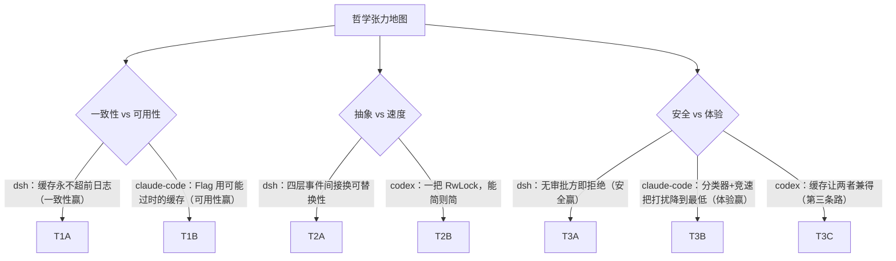

# 08-设计哲学深度解析

> **定位**：本篇回答三个问题：①三家 Harness 的**设计哲学到底是什么**——不是口号，而是从第一性原理推导出来的取舍规则；②四个子系列（[00-deepseek-harness] 12 篇、[01-codex-harness] 5 篇、[02-claude-code源码架构] 11 篇、本系列 00-07）涉及的**每一个子系统**，"为什么这样设计、好处是什么、代价是什么、什么情况下不该学"——逐项补齐，一个不落；③哲学之间的张力怎么理解。读者画像：初学者（每个哲学概念都从零讲）。前置阅读：建议先读 [00-总览与选型地图]；本篇自洽可独立读。需要说明：deepseek 系列的 11 篇与本系列 02-claude-code源码架构 的 09 篇已有各自的哲学专篇，codex 系列哲学散落于各篇——本篇是**跨三家统一收束 + 逐子系统补齐"为什么"**的总纲。

## 一、哲学从哪来：产品形态决定设计哲学

读源码学哲学，最容易犯的错是把某家的选择当成"普世真理"。正确的打开方式是先问：**这家公司的产品形态是什么？形态决定了它最怕什么，最怕什么决定了哲学。**

| | 产品形态 | 最怕的事 | 哲学重心 |
|---|---------|---------|---------|
| dsh | **平台运行时**（要承载极多的能力、极多的提供者、活很多年） | 核心被补丁打烂、能力无法替换、状态不可信 | **扩展性优先**：一切皆插件、日志即真相 |
| codex | **终端会话引擎**（单用户高频交互，每一次响应都要对） | 循环出错、并发状态错乱、把用户的输入搞丢 | **正确性优先**：单写者、持久化先行、少即是多 |
| claude-code | **行为自治的助手**（模型自主执行几十步，每步都可能越界） | 行为不可预测伤害用户、上下文爆掉、成本失控 | **治理优先**：硬约束边界、渐进降级、缓存意识 |

**这就是"哲学从哪来"的第一课**：三家没有任何一家"设计错了"，它们只是对"什么最贵"给出了不同的答案。dsh 认为演进成本最贵（平台要活十年），codex 认为信任成本最贵（错一次用户就走），claude-code 认为失控成本最贵（Agent 自主性是双刃剑）。你的系统最怕什么，你就该学谁的哲学——这是本篇一切结论的总纲。

## 二、三家第一性原理逐家深挖

### 2.1 dsh 的第一性原理："复杂度不会消失，只能被关进笼子"

**推导过程**：平台要支持无限多的能力与提供者 → 每个新能力都要接入 → 如果接入要改核心，核心就会被 N 次补丁毁掉 → 所以**接入必须不碰核心** → 一切皆插件。插件会被卸载/热替换 → 如果注册了不能撤销，卸载就是灾难 → 所以**注册必须是可逆效果**。提供者会换（本机→沙箱→远程）→ 如果消费者绑死实现，换提供者就是全量改造 → 所以**能力缝三分离**。平台活多年、历经崩溃 → 状态漂移不可接受 → 所以**日志即真相、状态由数据推导**。

**这套哲学的好处**：加第 100 个能力与加第 1 个的成本相同；审计与恢复是数学性质（重放）而非工程努力；换提供者消费者零改动。
**代价**（deepseek 11 篇自己承认的）：抽象成本陡峭——不懂 Cordis 的 ctx/事件/effect，你连一个插件都写不了；一次工具调用要穿四层事件间接。
**何时不学**：团队 <10 人、能力 <20 个、生命周期 <2 年的系统——你为用不到的扩展性预付了全部抽象税。

### 2.2 codex 的第一性原理："信任建立在每一次都对的响应上"

**推导过程**：终端产品的用户通道极窄（就是一个终端窗口）→ 一次状态错乱（丢了输入/卡死/重复触发）用户就永远走了 → 所以**正确性 > 一切**。并发是状态错乱的头号来源 → 把可变状态的写者减少到**一个**（单写者 Actor）→ 锁就不需要了，读-决策-写天然原子。崩溃不可避免 → 崩溃后账实必须相符 → **持久化先于终态事件**。工具一定会有失败 → 失败要么中断会话（不可接受）要么变成信息 → **失败回填**。代码越少 bug 越少 → **少即是多**：多 Agent、复杂编排，能不做就不做。

**好处**：初学者也能写对（并发模型简单到没有犯错空间）；每个机制都能用一个"如果不这样会怎样"的反例来论证。
**代价**：扩展性被主动牺牲——想加编排、加插件生态？codex 的答案是"那不是我这个产品"。
**何时不学**：如果你做的是平台（需要生态），纯"少即是多"会卡死你的演进——此时学它的骨架正确性，但扩展模型要向 dsh 借。

### 2.3 claude-code 的第一性原理："模型是不可预测的，系统必须是可预测的"

**推导过程**：模型行为是概率性的，提示词只能软化不能保证 → 可靠性必须从"概率问题"转为"结构问题" → **硬约束优于软约束**（Plan Mode 用权限系统禁写，而不是求模型别写）。自主 Agent 一步走错会级联 → 每一步都要有刹车 → **用户始终可控**（AbortController 级联、五类终止路径、审批纵深）。上下文是零和博弈且缓存价格是十分之一 → 一切设计向缓存低头 → **缓存意识**（分水岭、稳定排序、重试保前缀）。出错不可避免且多数可自愈 → **扣留-自愈-降级**三级响应。整个系统的复杂度来自边界管理 → **把可靠性理解成边界管理，而不是模型更聪明**。

**好处**：它证明了"不可预测的模型 + 确定的系统结构 = 可靠的产品"这条路径走得通，且每条边界都有对应的实现模板可抄。
**代价**：双真相源（消息 DAG + 进程级 100 字段单例）是自己承认的头号架构债；海量防御机制本身成了复杂度来源。
**何时不学**：一次性脚本、演示 demo——治理层的每一层都是纯开销。

## 三、逐子系统哲学解析：为什么这样设计、好处、代价、何时不学

这是本篇的主体——四个子系列涉及的**全部子系统主题**，逐项给出哲学层面的四问答案。按六个域分组，每行都可直接当自查清单用。

### 3.1 会话与并发域

| 子系统设计 | 为什么这样设计 | 好处 | 代价 | 何时不学 |
|-----------|---------------|------|------|---------|
| 单写者 Actor（codex） | 并发 bug 的根源是多写者；把写者减到一，错误类就消失了 | 免锁、读-决策-写原子、初学者可写对 | 吞吐受单消费者限制 | 超高吞吐多写场景（但先证明你真的需要） |
| 有界命令+无界事件双通道（codex） | 命令是请求要限流，事件是事实不可丢 | 反压天然成立、UI 永不缺块 | 两套通道心智 | 无 UI 的纯后端管道可简化 |
| 回合边界入日志（dsh turn/start·end） | 回合计数存内存则崩溃后清零 | 重放可对账、审计有锚点 | 每轮两次落盘 | 单轮问答类应用 |
| 运行时不变式（dsh invariants） | 工程自觉会遗忘，机器强制不会 | "凡模型可见必落日志"变成数学性质 | 每次操作多一次校验 | 任何系统都该学，这是普适的 |
| Steering 采样间隙合并（codex） | 打断丢工作、排队丢输入，只有合并两全 | 体验天花板 | 注入点需流式循环配合 | 无流式的批处理系统 |
| 三段式取消（codex） | 直接强杀会泄漏资源，纯协作取消会卡死 | 优雅与及时兼得 | 三段逻辑要贯穿所有 await 点 | 所有系统必抄（公约数） |
| 扣留自愈（claude-code） | 多数错误是暂时性的，用户不该看到自愈过程 | 错误对用户近乎隐形 | 扣留与释放条件必须严格对齐，否则消息丢失 | 交互要求低的后台管道 |
| 持久化先于终态（codex） | 宣告了的事实的必须有账可查 | 崩溃重放账实相符 | 终态通知多一次落盘延迟 | 所有系统必抄（公约数） |

### 3.2 上下文域

| 子系统设计 | 为什么 | 好处 | 代价 | 何时不学 |
|-----------|--------|------|------|---------|
| 五层渐进压缩（claude-code） | 压缩手段成本差 3 个数量级，贵的手段留给最后 | 成本最优、信息损失最小 | 管道顺序即正确性，写错顺序出隐性 bug | 短会话（<20 轮）用不上 |
| 缓存分水岭（claude-code） | 缓存命中的前提是前缀字节稳定 | 成本直接砍一个量级 | 动态内容必须纪律性地放后段 | 不用支持 Prompt Cache 的模型时可忽略 |
| 重注入位置纪律（codex） | turn 中压缩后注入位置影响模型行为稳定性 | 行为可预期 | 多一条注入规则要维护 | 不做 turn 中压缩可忽略 |
| 差值注入（codex world_state） | 静态环境每轮重注是纯浪费 | 省 token 且不降准确 | 要维护 baseline 与 diff | 环境频繁全变的场景反而不划算 |
| shadow-price 压缩计量（dsh） | 压缩的成本与收益要可核算才能调优 | 压缩策略可数据驱动 | 事件设计更复杂 | 不需要压缩调优的团队可忽略 |
| 记忆分层（claude-code 三层） | 不同时间尺度的信息需要不同管理策略 | 每层各司其职不互相污染 | 层间一致性要设计 | 单会话工具不需要 L2/L3 |
| SessionMemory 后台提取（claude-code） | 压缩时零成本兑现的前提是平时持续积累 | 压缩可跳过 LLM 调用 | 后台提取有 token 成本 | 会话极短的场景纯亏 |
| 工具延迟加载（codex exposure/claude-code ToolSearch） | 工具列表本身是上下文成本 | 几十个工具不再撑爆预算 | 模型多一步"发现" | 工具 <15 个时是过度设计 |

### 3.3 工具域

| 子系统设计 | 为什么 | 好处 | 代价 | 何时不学 |
|-----------|--------|------|------|---------|
| 统一自描述接口 + fail-closed 默认（claude-code） | 忘声明的安全属性按最保守处理 | 漏声明不出事故 | 接口宽（30+ 字段） | 工具极少时可手写分发 |
| 缝三分离（dsh） | 换提供者不应换模型面 | 执行世界整体可替换 | 一能力三包的体积税 | 提供者永远不变的能力别拆缝 |
| spec/executor/exposure 三分离（codex） | 模型面与机制面的生命周期不同 | 同一注册表投影不同工具面 | 三个原语的学习成本 | 单宿主产品可砍 exposure |
| 每 turn 重装配（codex） | 权限随会话变，工具面必须跟着变 | 工具面永远与权限一致 | 每轮一次装配计算 | 权限完全静态的系统可启动时装一次 |
| 失败回填（codex，公约数） | 工具抛异常会断流；失败是信息不是事故 | 模型参与自愈，会话永不因工具崩 | 错误消息要精心设计 | 无——这是公理 |
| error-as-field（dsh） | 模型需要"结果+正交状态"而非一次异常 | 超时/中止不会被误读为成功 | 每个结果类型要设计判别字段 | 与失败回填二选一即可 |
| 保留名守卫（codex） | 外部工具冒充内置 shell 是投毒通道 | 供应链安全兜底 | 注册逻辑多一次校验 | 有外部工具来源就必须有 |
| 动态并发安全判定（claude-code） | `Bash(ls)` 与 `Bash(rm -rf)` 安全性不同 | 并发收益拿到、风险不放大 | 判定器要维护 | 全串行执行的小系统 |

### 3.4 安全域

| 子系统设计 | 为什么 | 好处 | 代价 | 何时不学 |
|-----------|--------|------|------|---------|
| fail-closed（三家公理） | 安全失败的默认值必须是拒绝 | 未知路径不会静默放行 | 更多拒绝、偶尔打扰 | 无——这是公理 |
| 七步权限管线（claude-code） | 判定散在工具里必发散；顺序即安全 | 可穷举、可单测、Deny 不可覆盖 | 管线自身是复杂度 | 无审批需求的封闭系统 |
| 审批三态纯函数（codex） | "问不问"要可穷举可测试 | 4×2 矩阵全覆盖 | 策略建模成本 | 同上 |
| 结构化 key 审批缓存（codex） | 无缓存的审批系统会被用户关掉 | 安全与体验兼得 | key 粒度设计要极仔细 | 无审批的系统 |
| 升级重试（codex） | 最小权限先试，失败才要更大的权限 | 权限被授予得最少 | 两段执行逻辑 | 全权运行的可信环境 |
| 沙箱缝 + per-call 策略（dsh） | 隔离是能力不是属性；两个消费方可不同边界 | 一套执行器服务多安全等级 | 每调用解析策略 | 单一安全等级的内部工具 |
| 变宽升级表（dsh） | 升级路径必须可穷举、非变宽不打扰人 | 升级审计可追踪 | 变宽表要随模式演进 | — |
| 敏感路径 bypass 免疫（claude-code） | 有些底线不能被任何全局开关绕过 | 即使完全信任模式也有兜底 | bypass 不再"完全" bypass | 无——底线设计都该学 |
| 拒绝追踪回退人工（claude-code） | 分类器持续拒绝=系统性冲突 | 防自动决策死循环 | 计数与回退逻辑 | 无自动判定（分类器）的系统 |
| 审计对 + 安全状态入日志（dsh） | 安全决策也是状态，也要可重放 | 安全审计是数学而非搜日志 | 日志量增大 | 合规无要求的个人工具 |
| 凭证引用化+每操作解析（dsh） | 密钥暴露面越小越好、轮换不该重启 | 轮换零重启、describe 不泄值 | 每操作解析开销 | 原型系统可先用静态配置 |

### 3.5 编排域

| 子系统设计 | 为什么 | 好处 | 代价 | 何时不学 |
|-----------|--------|------|------|---------|
| 敢不做多 Agent（codex） | 压缩+好工具能推迟单 Agent 瓶颈 | 工程预算全押正确性 | 真需要时无地基 | ——这是"不学"本身，是判断力 |
| 协调者模式（claude-code） | 权限安全+责任归属需要汇总点 | 审批不绕过、冲突有裁决 | 单点协调成本 | 真正对等的无审批场景 |
| 异步邮箱通信（claude-code） | LLM 响应时间不可预测，同步 RPC 会卡死 | 天然支持离线缓冲与优先级 | 最终一致，编程模型变化 | 强实时的进程内协作 |
| 强制规划协议（claude-code） | 子 Agent 可靠性靠协议不靠自觉 | 危险操作前必有人审 | 多一轮交互 | 完全受信的只读子任务 |
| Worktree 物理隔离（claude-code） | 认知隔离会被文件冲突打破 | 并行互不干扰、合并留给人 | 环境传递的工程量 | 无写操作的子 Agent |
| 子代理提供者缝（dsh） | 委派的执行位置应可替换 | 进程内/远程/甚至别家 CLI 随便换 | 缝抽象成本 | 只有一种执行形态时 |
| Activation 状态由数据推导（dsh） | 第二套状态机是漂移温床 | 重放自洽 | 推导逻辑要严谨 | —（普适原则） |
| 确定性 Jitter + 自动过期（claude-code） | 整点齐射打爆 API；遗忘任务无限积累 | 平滑负载、自防膨胀 | 调度时间不完全精确 | 单实例无定时齐射问题 |
| goal armed 不持久化（dsh） | 自动续作是危险操作 | 重启后不会悄悄继续跑 | 恢复多一步人工 | 所有自动续作系统都该学 |

### 3.6 平台域

| 子系统设计 | 为什么 | 好处 | 代价 | 何时不学 |
|-----------|--------|------|------|---------|
| Feature Flag 双层（claude-code） | 编译期管存在性、运行期管开放性 | 未发布功能零攻击面；紧急回滚不发版 | 两套 Flag 基建 | 无灰度需求的内部工具 |
| 队列-Sink 可观测（claude-code） | 基础设施初始化前事件不能丢 | 启动期观测无盲区 | 队列溢出策略要定 | —（普适） |
| 可逆注册（dsh） | 卸载即回滚是热更新/灰度的地基 | 插件装拔不留残骸 | effect 包装所有注册 | 无热更新需求的系统 |
| 成本台账+收益递减停止（claude-code） | 不再产生价值就停，优于花够了就停 | 长任务费用可控且合理 | 停止判据要调参 | 成本不敏感场景 |
| 双真相源反例（claude-code） | ——这是一个反面教材 | —— | 状态漂移、恢复不一致 | **永远不要学**：进程状态与界面状态必须分清真相链 |
| 上帝入口反例（claude-code main 3000 行） | 同上 | —— | 可维护性崩坏 | 按模式拆入口策略 |

## 四、哲学之间的张力：为什么没有全能哲学

深挖到这一层，你会发现三家哲学**两两冲突**，而且冲突得都有道理：

这三组张力没有裁判。dsh 的"缓存永不超前日志"在它的一致性叙事里是对的；claude-code 的"可能过时优于可能阻塞"在它的体验叙事里也是对的——**分歧的根源不是谁聪明，而是第一问"你最怕什么"的答案不同**。读哲学读到这一步才算入门：不是背诵每家的信条，而是能对任何一条信条说出"它在害怕什么代价、又为此支付了什么新代价"。

## 五、给你自己的八条元原则（跨三家提炼）

1. **先答"你最怕什么"，再选哲学**——扩展/正确/治理，三者不可同时最大化。
2. **把铁律做成机器强制**（dsh 不变式），不做成代码注释。
3. **失败是信息不是事故**（三家公约数）——工具错误回填、可恢复错误扣留自愈。
4. **数据是唯一真相，其余皆投影**——第二套状态机是漂移温床。
5. **硬约束优于软约束**（claude-code）——物理禁用优于提示词恳求。
6. **fail-closed 是公理不是选项**——不确定即拒绝，静默降级是最大的安全 bug。
7. **自主性每次续期都要重新挣来**——armed 不持久化、Flag 自动过期、拒绝追踪回退人工。
8. **边界管理能力是唯一可复用的架构资产**——模型会换，你设计的七条边界（循环/工具/权限/资源/组织/时间/故障）不会。

> **适用场景**：想从"知道三家怎么做的"升级到"理解为什么、并能对自己的系统做出哲学级取舍"的架构师。
> **不适用场景**：还没读过任何一家具体机制就想只读哲学的读者（哲学没有机制作锚点会变成空话）——建议至少配 [00-总览与选型地图] 同读。
