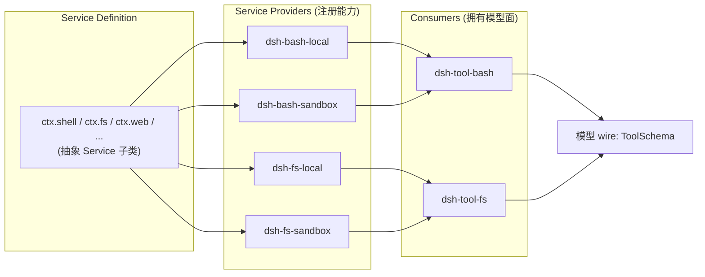
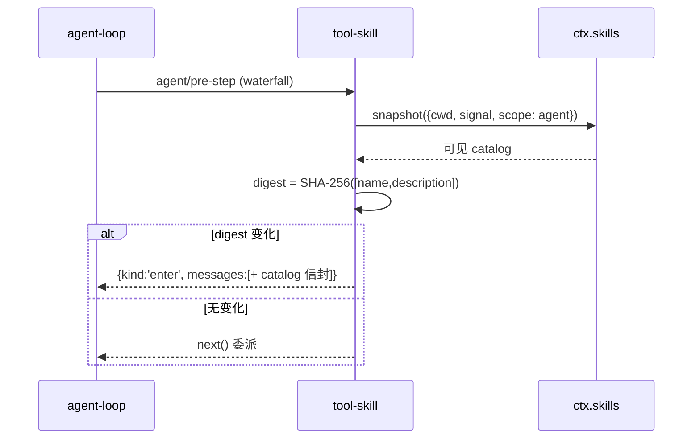
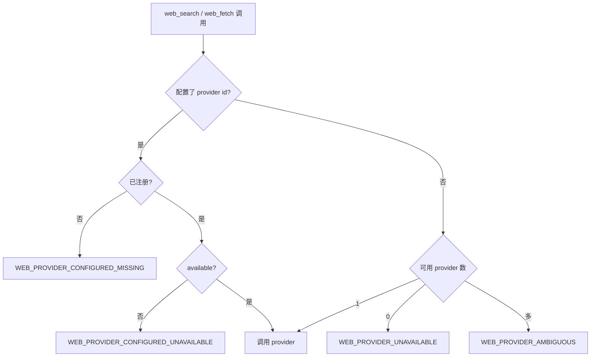
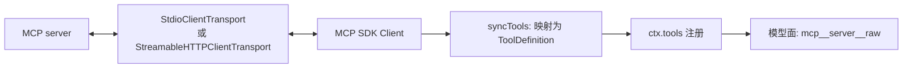
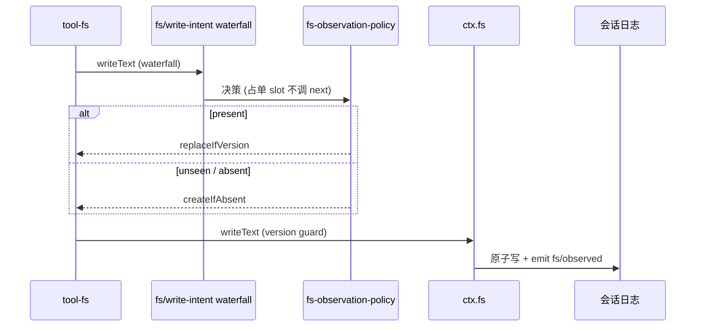

> **定位**：本文深入 DeepSeek Harness 的「模型可见能力」——模型能调用什么、能力如何被组织成「能力缝」、十个能力族（技能/子进程/Shell/终端/Web/MCP/LSP/代码执行/文件/待办）各自的机制与工具 schema。读完你将理解「换 provider 不改变模型提问方式」这一关键设计。前置阅读：[02-核心引擎与Agent生命周期]（工具执行管线是本文的地基）。
> **代码位置**：`packages/skill/`、`packages/subprocess/`、`packages/shell/`、`packages/terminal/`、`packages/web/`、`packages/mcp/`、`packages/lsp/`、`packages/code-runtime/`、`packages/fs/`、`packages/todo/`。

## 一、领域概览：模型可见能力在设计上回答什么问题

**设计问题**：模型能调用什么、怎么被组织？一个生产级 Agent 框架必须回答——**换执行环境不改变模型提问方式**（本机/沙箱/远程随意换）、**工具 schema 不被实现污染**（execute 细节永不漏到 wire）、**策略不硬编码进工具**（审批/沙箱/超时都是外置的）。能力缝的架构模式正是这套问题的答案。

所有「模型可见能力」都遵循同一架构模式（[capability seam](https://github.com/deepseek-ai/deepseek-harness/blob/main/docs/capability-seams.md)）：

- **Service Definition**（抽象 `Service` 子类，注册为 `ctx.*`）只声明「做什么」；
- **Service Provider**（`dsh-*-local/sandbox` 等）实现它；
- **Consumer**（`tool-*` 包）拥有模型面 schema、prompt 指引、展示。

### 本领域的设计哲学（Why）

本领域是「能力可整体替换」哲学（[11-设计哲学与架构模式 §二]）的完整落地，另有四条领域特有原则：

1. **Provider 注册「能力」而非工具**——模型面 `name/schema/description/presentation` 全部唯一归属 `tool-*` 包。**为什么**：换 provider 不改变模型提问方式；`execute/output/presentCall/presentResult/timeoutMs` 永不漏到 wire，模型只见干净的调用面。**代价**：一个能力被拆成定义/提供者/消费者三套包。
2. **error-as-field 而非 rejection**——`ShellRunResult`/`CodeRunResult`/`WebFetchResult`/`FsError` 全是一致契约，`timedOut`/`aborted`/`denied` 等正交结果独立上报。**为什么**：模型需要「结果 + 正交状态」，而不是一次异常；调用方不会把「超时」误读成「成功」。**代价**：每个结果类型都要精心设计判别字段。
3. **策略以事件门存在，而非方法注入**——fs 策略以 `fs/*` waterfall 存在，删掉策略插件工具仍能裸跑。**为什么**：策略与能力解耦，可独立装卸。**代价**：工具调用多一层事件间接。
4. **hostile-peer 心态**——code-runtime worker 消息逐字段重建、binding 名 null-prototype、subprocess env 先 scrub 再显式合并。**为什么**：外部进程/消息可能伪造，默认不信。**代价**：解析代码更防御、更啰嗦。

`ToolDefinition`（schema+execute）经 `ctx.tools.schemas()` allowlist 投影成 wire 类型 `ToolSchema`。

> 默认装配见 `packages/bundle/base/cordis.patch.yml`：`subprocess→subprocess-local`、`bash-sandbox`（win32 禁用）、`shell-env`、`tool-bash`/`tool-pwsh`（平台互斥）、`fs-observation-policy`、`tool-fs`、`skill`+`skill-filesystem`+`tool-skill`+`skill-badge`（disabled）、`web`+`web-search-deepseek`+`tool-web`、`tool-todo`。

## 二、skill：可复用指令

**定位**：技能是「可复用指令」而非会话事件。能力缝只做 provider 目录合并、按名裁决胜者、按需加载正文；来源（本地/打包/远程）归 provider。

- **分层合并**（`skill/src/index.ts:552`）：读时 `collectFresh` 把 `[global, ...chainLayers(scope)]` 逐层 merge，**层间最近层直接遮蔽远层同名校，层内 rank 裁决**（`rank → providerOrder → localOrder`）。
- **本地 provider**（`dsh-skill-filesystem`）：优先级 rank 表 `project-dsh(100) < project-agents(200) < custom(300) < user-dsh(400) < user-agents(500) < bundled(600)`；git-root 行走 `findProjectRoot` 逐级找含 `.git` 的祖先；chokidar watcher 只认 `SKILL.md`/顶层 `.md`/目录增删。
- **frontmatter**：`disable-model-invocation`、`user-invocable`（默认真）控制技能可被谁调用。
- **会话目录机制**（`tool-skill`）：`agent/pre-step` 监听器取可见 catalog，digest = `SHA-256(JSON.stringify([name,description]))`，变化时返回 `{kind:'enter', messages:[...decision.messages, catalog]}` 追加**持久 user-role `<system-reminder>`**（`<available_skills>` 信封）——等价于 `agent.inject()` 的 pre-step 决策注入。

## 三、subprocess：一切进程能力的底座

- `ctx.subprocess`（`SubprocessRuntime`）：同一执行世界的可执行文件查找 + 全显式受管进程树（raw/collected stdio）+ 一个终端原语。**bash/LSP/PTY/ACP 都是它的消费者**。
- **`scrubbedParentEnv()`**（`subprocess/src/index.ts:60`）：剥掉 `*KEY*`/`*PASSWORD*`/`*SECRET*`/`*TOKEN*` 与全部 `DSH_*` 作为每子进程基座（大小写不敏感）；刻意传给子进程的凭据走 `spec.env` 显式合并。
- **kill 升级**（`subprocess-local/spawn.ts:439`）：`terminate()` = `kill('SIGTERM')` → `setTimeout(kill('SIGKILL'), graceMs)`，每次重探 `treeAlive()` 防 pid 复用误杀；Windows `taskkill /T` 树级；宿主同步 `exit` 时同步 SIGKILL 每树。
- `SubprocessOutcome` 只带 `exitCode/signal` 无超时分类——**正交结果独立上报**（呼应 defensive-patterns「Report orthogonal outcomes independently」）。

## 四、shell：前台命令 + 后台进程句柄

- **`ctx.shell`**（`ShellExecutor`，`shell/src/index.ts:65`）：前台命令 + 后台进程句柄执行缝。`ShellExecRequest` → `resolve()` → `ShellExecSpec`（全必填，**explicit > implicit** 边界规则）。`ShellRunResult` 的 `timedOut`/`aborted` 是**首因互斥**分类。
- **`dsh-bash-local`**：`ENV_OVERRIDES={NO_COLOR:'1',TERM:'dumb',PAGER:'cat',GIT_PAGER:'cat'}`；Config 默认 `timeoutMs:120000/maxTimeoutMs:600000/maxOutputBytes:64000`。
- **`dsh-bash-sandbox`**：**local 的子类**，把 `['bash','-c',command]` 交给 `ctx.sandbox.confine` 拿到 `ConfinedArgv` 再 spawn；`danger-full-access` 直通并贴 `sandbox:{mode,denied:false}`；denial 是**保守分类**（从 stderr tail 匹配 bwrap EROFS/Landlock EACCES/Seatbelt EPERM 签名）。
- **`dsh-tool-bash`**：`bash` 工具参数 `command`(req)/`description`(req,5-10 词)/`timeoutMs`/`workdir`/`run_in_background`/`sandbox_permissions`+`justification`（仅沙箱 executor 挂载时）。后台分支 `ctx.jobs.start({kind:'bash', ...})`；升级审批 `approveBashEscalation` 经 `ctx.approval`。
- **`dsh-shell-env`**：受信 `DSH_*` 环境注册表。`collect(execution)` 每次调用重建快照：内置 `DSH_HOME`、`DSH_SHELL='1'`、`DSH_SESSION_ID`；保留键 `RESERVED_BASH_ENV_KEYS`。

## 五、terminal：owner 隔离的持久 PTY

- `ctx.terminals`（`TerminalSessionService`）：持久 PTY 会话注册表；**授权比较精确 owning `Agent`**（`FOREIGN_SESSION`）；每会话单活动 send（`SEND_ACTIVE` 互斥）。
- `dsh-terminal-bash`：经 `ctx.sandboxPolicy.resolve` → `ctx.subprocess.spawnTerminal`；`PROMPT_COMMAND` 写 OSC `133;D;$?` marker；readiness 判定 `stdin_read`/`inferred_idle`/`timeout`/`session_exit` 四种。
- `dsh-tool-terminal` 六工具：`terminal_open`/`terminal_send`/`terminal_read`/`terminal_signal`/`terminal_close`/`terminal_list`；后台发送走 `jobs.start({kind:'pty-send'})`。
- `dsh-tool-bash-persistent`：持久 `bash` 工具，随机 marker 包裹命令并 `printf` start/end marker + `$?`，轮询 viewport 以 prompt 结尾判定完成。

## 六、web：搜索 + 抓取共用一条缝

- `ctx.web`（`WebRuntime`）：搜索+抓取两条操作共用一条能力缝（一个 provider 选择策略、一套 abort/error/配置）。
- **provider 选择**（`resolveProvider`，`web/src/index.ts:172`）：配置 id 未注册→`WEB_PROVIDER_CONFIGURED_MISSING`；注册不可用→`..._CONFIGURED_UNAVAILABLE`；未配置多可用→`WEB_PROVIDER_AMBIGUOUS`；无可用→`WEB_PROVIDER_UNAVAILABLE`。
- **`dsh-web-fetch-http`**：仅 HTTP(S)、拒绝 URL 内嵌凭据、仅同源重定向、字节/字符/超时/跳数上限；**不防内网/SSRF**（注释明示）。
- **`dsh-web-search-deepseek`**：走 Anthropic 兼容 Messages API + `web_search_20250305` 服务端工具；**strict mode**——无 `web_search_tool_result` 块即 `WEB_PROVIDER_ERROR`，绝不散文刮取。
- **`dsh-tool-web`**：`web_search`（参数仅 `query`，`searchMaxResults` 默认 8）、`web_fetch`（参数仅 `url`）。

## 七、MCP 客户端：把 MCP 工具桥进 ctx.tools

- **不是 `@Tool` 注解**——`dsh-mcp-client` 把 MCP 工具 schema 映射为 `ToolDefinition` 注册进 `ctx.tools`（`src/tools.ts` `syncTools`）：`parameters: tool.inputSchema` 直接透传（`assertSupportedJsonSchema` 校验）、`execute` 发 `tools/call`。
- **命名** `publicToolName`：`mcp__<serverName>__<rawName>`；超 64 字符/含非法字符追加 12 位 SHA-256 哈希；rawName 只在线上发送。
- **Transport**：`stdio`（env 复用 `scrubbedParentEnv()`）/ `streamable-http`。
- **Supervisor 重连**：`generation.onclose` → `scheduleReconnect`（指数退避，`maxAttempts` 默认 10 后弃并卸载）；`tools/list_changed` 通知 re-sync。只桥接 Tools（Resources/Prompts 未桥接）。

## 八、LSP：四个语义查询的导航缝

- **`LspOperation` 闭合联合**：`goToDefinition | findReferences | goToImplementation | hover`（`lsp/src/types.ts:17`）——**无 JSON-RPC 逃生舱**，provider 必须翻译成归一化请求。
- `dsh-lsp-stdio`：一张 server 命令表，按 `(server id, canonical workspace)` 懒启动单飞进程；`query` 走 **transient-open**：`ctx.fs` 流式读源 → `didOpen(version:1,full)` → 请求 → `didClose`——**无内容缓存/LRU**。
- `dsh-tool-lsp`：`lsp` 工具参数 `operation/file_path/line/character`（**一基**），进时 `-1` 转零基、出时 `+1`；渲染相对化基于 provider 的 `resolvedWorkspaceUri`；`maxLocations:100`/`maxResultChars:16000`。

## 九、code-runtime：模型写的程序

- `ctx.codeRuntime`：运行一个模型写的程序 + host 提供异步 bindings，报告 `{value, logs, error?}`。**`CodeRunResult.error` 是字段不是 rejection**。
- `dsh-code-runtime-worker-thread`：**每次 run 一个全新 Worker**（`env:{}`、`resourceLimits.maxOldGenerationSizeMb:512`），无池、无跨 run 状态；type-strip 后以 `AsyncFunction` body 执行，顶层 await/return 可用。
- **host 视 port 为敌意 peer**：`parseWorkerMessage` 逐字段重校验重建；binding 解析只用 `Object.hasOwn` own property；命名空间 null-prototype；两个独立预算 `computeMs`（ELU 忙时轮询，`ELU_POLL_INTERVAL_MS=25`）与 `maxWallMs` 兜底。

## 十、fs：文件系统缝 + 事件门

- `ctx.fs`（`FileSystem`，`fs/src/index.ts:86`）：目标身份/含胞/原子写/编辑临界区由 provider 拥有。**三个事件**：`fs/write-intent`（waterfall）、`fs/edit-intent`（waterfall）、`fs/observed`（emit，监听器必须同步）。
- `dsh-fs-local`：`targetKey`=realpath；`versionOf=dev:ino:size:mtimeNs:ctimeNs`；**原子写** `writeFileAtomic`（私有 0700 临时目录 + `wx` 0600 临时文件 → fsync → rename）；`createIfAbsent` 用硬链 no-replace 发布；前 8192 字节含 NUL → `FS_NOT_TEXT`。
- **`fs-observation-policy` 不注册 service，纯 `fs/*` 监听**（`src/index.ts`）：write 决策 present→`replaceIfVersion`、unseen/absent→`createIfAbsent`；edit 决策 unseen→`FS_NOT_OBSERVED`、absent→`FS_NOT_FOUND`、present→version guard。**占单 slot 不调 `next()`**——它拥有策略决策。
- `dsh-tool-fs`：`read`/`write`/`edit`/`read_image`。write/edit 用 `ctx.waterfall('fs/write-intent', target, exec, () => undefined)`——默认 thunk 是裸 provider 无条件写。

- `dsh-tool-fs-search`：`glob`/`grep` **不经 `ctx.fs`**，spawn 打包的 `@vscode/ripgrep` 二进制；argv 前置 `--no-config` 防 `RIPGREP_CONFIG_PATH` 注入 `--pre`；超限结果经可选 `ctx.spillStore` 存文件。
- `dsh-tool-str-replace-editor`：`str_replace_editor` 的 `command` enum `view|create|str_replace|insert`；str_replace 求**唯一**匹配，多处→`FS_AMBIGUOUS_EDIT`。

## 十一、工具 schema 速览

| 包 | 工具 | 必填参数 |
|---|---|---|
| tool-skill | `skill` | `name` |
| tool-bash | `bash` | `command`, `description` |
| tool-pwsh | `pwsh` | 同上 |
| tool-bash-persistent | `bash` | `command` |
| tool-terminal | `terminal_open/send/read/signal/close/list` | 依工具 |
| tool-web | `web_search` / `web_fetch` | `query` / `url` |
| tool-fs | `read` / `write` / `edit` / `read_image` | file_path / +content / +old+new / file_path |
| tool-fs-search | `glob` / `grep` | pattern |
| tool-str-replace-editor | `str_replace_editor` | command + path |
| tool-lsp | `lsp` | operation + file_path + line + character |
| tools(core) | `run_code` | code + description |
| tool-todo | `todo_write` | todos |

## 十二、设计决策（Why / 代价 / 选择依据）

**D1. 能力缝三层分离**
- **Why**：换 provider 不换模型 schema；`tool-*` 包唯一拥有模型面——一个能力的三个关注点（接口/实现/暴露）被物理拆开，各自独立演进。
- **代价**：简单能力也被拆成三套包，前期成本高。
- **选择依据**：「提供者会变」的能力才值得缝；一成不变的能力拆了纯属增加体积。

**D2. error-as-field 而非 rejection**
- **Why**：`ShellRunResult`/`CodeRunResult`/`WebFetchResult`/`FsError` 全是一致契约，`timedOut/aborted/denied` 等正交结果独立上报——调用方不会把「超时」误读成「成功」，模型得到的是「结果 + 状态」而非异常。
- **代价**：每个结果类型都要精心设计判别字段，写起来啰嗦。
- **选择依据**：模型是「读结果」的主体，字段比异常更适合它消费。

**D3. 闭合判别联合（closed discriminated union）**
- **Why**：`WebFetchBody`/`LspQueryResult`/`ToolExecutionResult` 用闭合联合 + `assertNever` 在**类型层强制穷尽**——新增变体时编译器逼你处理所有分支，杜绝「漏处理新返回类型」。
- **代价**：扩展新变体要改所有消费方（这是有意的摩擦）。
- **选择依据**：契约面（缝合口、结果类型）用闭合联合，扩展面（事件 Map）用开放合并——**一收一放，各有其位**。

**D4. hostile-peer 心态**
- **Why**：code-runtime worker 消息逐字段重建、binding 名 null-prototype、subprocess env 先 scrub 再显式 merge——把外部进程/消息当作可能伪造的来源，默认不信。
- **代价**：解析代码更防御、更啰嗦。
- **选择依据**：凡是「模型或远端可提供内容」的边界，都按不可信处理。

**D5. explicit > implicit**
- **Why**：每个 spec（如 `ShellExecSpec`）全必填，默认值属于实现 config——没有「隐式魔法值」，行为可预测。
- **代价**：调用方要填更多字段。
- **选择依据**：框架面向模型这种「不可靠调用方」，显式优于隐含。

## 十三、转译到 Spring AI / Java 生态

| DeepSeek Harness | Spring AI 对应物 | 启示 |
|---|---|---|
| 能力缝三层分离（定义/提供者/消费者） | `ToolCallback` + 实现分离 | 工具 schema 与执行解耦，换实现不换模型面（对应 [教程 03-工具调用]） |
| `fs/*` 事件门策略 | Advisor 拦截 `@Tool` 调用 | 「策略以事件存在、删掉仍能裸跑」比硬编码在工具里更灵活（对应 [教程 23-Advisor链与拦截器]） |
| `scrubbedParentEnv` + 显式合并 | 进程环境传递 | 默认 scrubbed、显式放行是进程安全的黄金法则（对应 [教程 64-安全与权限控制]） |
| MCP 桥 `mcp__server__tool` | Spring AI MCP Client | 与 Spring AI 的 MCP 工具前缀约定同构（对应 [教程 20-MCP协议]） |
| LSP 无逃生舱闭合联合 | 归一化 API | 缝合口用闭合判别联合防 provider 泄漏协议细节 |

> **适用场景**：要设计「模型可见能力」的插件化组织；要理解工具 schema 与执行如何解耦。
> **不适用场景**：只有单一工具、不关心多后端替换的场景。

## 十四、总结

本文覆盖了模型可见的十大能力族。贯穿始终的设计是：**能力缝把「定义/提供者/消费者」三分离**，让换一个 Shell/文件系统/子进程提供者就改变整个执行世界而不动模型提问方式；**工具 schema 唯一归属 `tool-*` 包**；**策略以事件门存在而非硬编码进工具**；**错误以字段而非 rejection 上报**；**对外部输入持 hostile-peer 心态**。这些组合起来，就是「可整体替换的能力层」的完整工程范式。

> **定位回顾**：本文是系列的「能力面」篇。下一站 [05-安全·沙箱·权限与凭证]，看沙箱如何为这些能力筑起防线。
