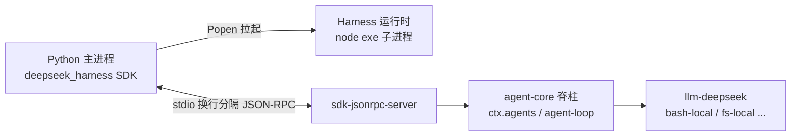
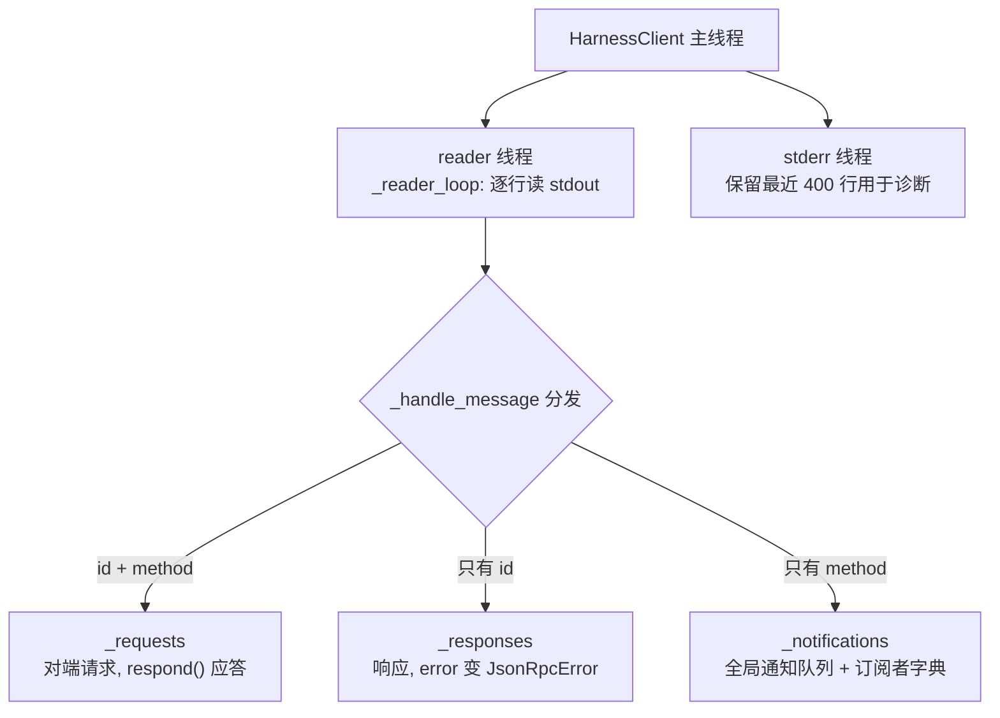
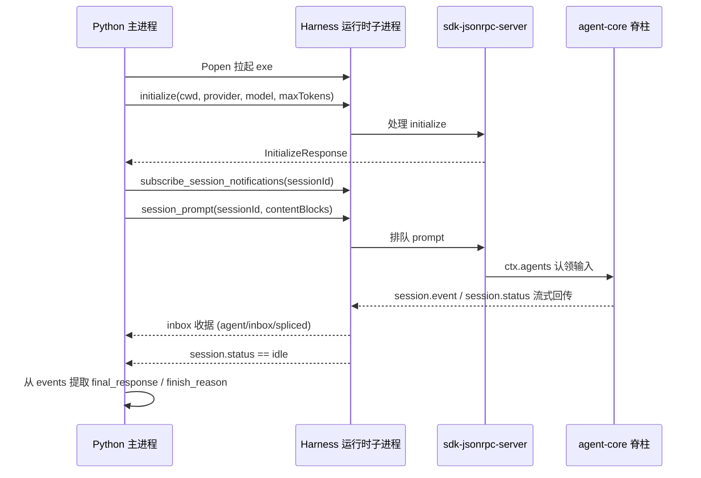
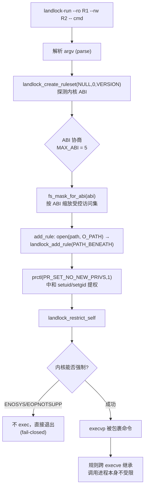
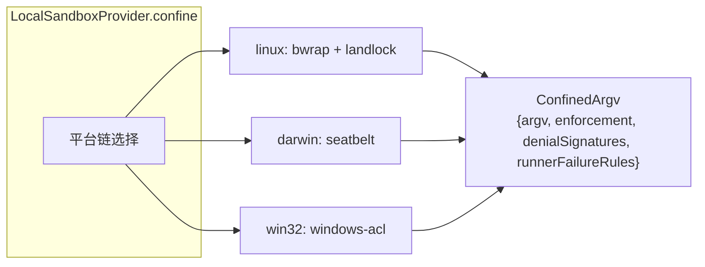

> **定位**：本文深入 DeepSeek Harness 的 Python SDK、sdk-runtime 运行时载体、原生 Landlock 沙箱执行器，以及全部示例工程。读完你将理解「用 Python 驱动一个 TypeScript Agent 运行时」的完整链路（子进程 + stdio JSON-RPC）、Landlock 内核安全机制的最小实现，以及示例工程如何组合插件。前置阅读：[00-总览与架构解析] 建立全局认知。
> **代码位置**：`python/`、`native/landlock-run/`、`examples/`、`packages/examples/`。

## 一、领域概览：Python 接入与原生沙箱在设计上回答什么问题

**设计问题**：一个 TypeScript Agent 运行时如何被其它语言生态驱动？Linux 沙箱如何做到「内核级、可审计、最小实现」？本领域回答两个设计问题：**跨语言接入怎么不重复造协议？原生安全边界怎么做到最小且可信？**

DeepSeek Harness 的主体是 TypeScript monorepo，但它向 Python 生态提供了一个「以子进程方式驱动」的 SDK。整个链路可以一句话概括：

> **Python SDK 把 Harness 运行时当作一个子进程拉起，双方通过 stdio 上的换行分隔 JSON-RPC 2.0 通信。**

### 本领域的设计哲学（Why）

本领域是「协议优先 + fail-closed」哲学的落地，另有四条领域特有原则：

1. **协议优先、双 SDK 孪生**——Python 与 TS 共享同一 `dsh-sdk-protocol`，客户端结构刻意对齐（TS `HarnessClient` 自称 Python 的 *design twin*）。**为什么**：多语言维护只维护一份协议，客户端「长得一样」降低跨语言心智负担。**代价**：两边改动要同步。
2. **独立进程 + 协议驱动，而非库内嵌**——Python SDK 把运行时当子进程拉起来。**为什么**：引擎与调用方隔离，Python 侧崩溃不影响引擎，引擎升级不重编 Python 包；呼应「管控分离」（[教程 29-管控分离架构]）。**代价**：进程间通信有序列化开销。
3. **运行时强制显式配置**——二进制无配置即退出；「zero-config」由 SDK 包装层注入 `DSH_CORDIS_CONFIG` 实现。**为什么**：显式传参而非隐藏回退——运行时永远知道自己要跑什么。**代价**：调用方要显式传配置。
4. **Landlock 极简审计面**——约 300 行 C11 + 静态 musl + 本地定义 UAPI，无交叉工具链。**为什么**：「审计面就是这一个文件加内核稳定 syscall 契约」；本地定义 UAPI 摆脱头文件版本差异。**代价**：不依赖系统库，需自带构建。

这与 Java/Spring AI 侧「把 Agent 引擎作为库内嵌」的形态截然不同——这里是**独立进程 + 协议驱动**的管控分离形态（呼应 [教程 29-管控分离架构]）。

## 二、Python SDK（`python/sdk` → `deepseek_harness`）

### 2.1 包结构与定位

`python/README.md:5` 官方定位：*"Python packages for driving DeepSeek Harness as a subprocess. The client SDK communicates with the bundled runtime over newline-delimited JSON-RPC on stdio."*

`__init__.py:1-19` 导出 9 个符号，分三组：

| 层 | 符号 | 定位 |
|---|---|---|
| 高层 | `DeepSeekHarness`、`DeepSeekHarnessConfig`、`Session`、`RunResult` | 一次「轮次」语义 |
| 低层 | `HarnessClient`、`HarnessConfig` | 原生 JSON-RPC stdio 客户端 |
| 支撑 | `SdkProtocolError`、`IncomingRequest`、`InitializeResponse`、`JsonObject`、`Notification`、`ServerInfo` | 模型与异常 |

依赖：`pydantic>=2.12,<3` + 固定版本 `deepseek-harness-runtime-bin`（`sdk/pyproject.toml:13-16`），要求 Python ≥ 3.10。

### 2.2 高层 API（`api.py`）

- **`DeepSeekHarnessConfig`**（`api.py:13-35`）：核心字段 `provider="deepseek-official"`、`model="deepseek-v4-flash"`、`max_tokens`、`cwd`、`session_root`、`cordis`、`env`、`runtime_bin`、`request_timeout_seconds`、`shutdown_timeout_seconds=1.0`、`base_url`、`api_key` 等。
- **`RunResult`**（`api.py:38-45`）：`session_id` / `final_response` / `finish_reason` / `events` / `notifications` / `session_root`。
- **`DeepSeekHarness`**（`api.py:48`）：**可复用同步客户端**，运行时子进程惰性启动并跨多次 `run()` 复用。`__init__`（`api.py:56-84`）把配置注入子进程环境：`session_root→DSH_SESSION_ROOT`、`cordis→DSH_CORDIS_CONFIG`、`cwd→DSH_CWD`、`base_url→DEEPSEEK_BASE_URL`、`api_key→DEEPSEEK_API_KEY`。
- **`Session.run()`**（`api.py:132-183`）：一次轮次的完整语义：
  1. `normalize_input()` 把字符串包装成 `[{"type":"text","text":...}]`（`api.py:199-202`）；
  2. `subscribe_session_notifications(self.id)` 订阅会话树；
  3. `session_prompt()` 排队；
  4. 循环 `subscription.next()` 直到**先收到 `agent/inbox/spliced` 收据**（`_is_inbox_receipt`，`api.py:186-196`）**再等到 `session.status == "idle"`**（`api.py:169-174`）。

这里体现了官方 `docs/defensive-patterns.md` 的「异步状态不是同步状态」原则：**活动区间**定义为「从 durable inbox 收据到整 agent 空闲」，而不是某条消息因果对应的局部完成。这正是给自动化调用方划出「它真正拥有的运行区间」的官方做法。

### 2.3 低层 JSON-RPC 客户端（`client.py`）

`HarnessClient`（`client.py:37`）是同步 stdio JSON-RPC 客户端，自己 `Popen` 运行时。线程模型：

- **Wire 方法**：`initialize`（`client.py:117-136`，payload：`cwd`/`provider`/`model`/`maxTokens`）；`session_prompt`（`client.py:138-155`，payload：`sessionId`/`contentBlocks`，返回 `messageId`）；`shutdown`（close 时调用，`client.py:92`）。
- **子 agent 血缘**：从 `subagent.started` 通知记录 `_session_parents[child]=parent`（`client.py:460-472`），`_notification_belongs_to_session_tree` 沿父链回溯判定后代（`client.py:474-504`）——所以 SDK 能只收「属于本会话树」的事件，子代理的异步通知被正确归位。

### 2.4 传输协议（与 TS SDK 共享）

Python SDK 与 `packages/sdk/` 是**同一协议的两种客户端**。`packages/sdk/client/src/client.ts:1-13` 自称 Python SDK `HarnessClient` 的 *design twin*（设计孪生）。协议由 `packages/sdk/protocol/src/types.ts` 钉死：

- `HarnessSdkRequestMap`（`types.ts:101-105`）：`initialize` / `session/prompt` / `shutdown`
- `HarnessSdkNotificationMap`（`types.ts:93-98`）：`session.event`、`session.status`、`subagent.started`、`subagent.finished`

## 三、sdk-runtime（`python/sdk-runtime` → `deepseek_harness_runtime`）

**用途**：运行时载体包——定位 Python SDK 要 spawn 的**内置运行时二进制**，并随包附带默认配置（`sdk-runtime/README.md:5`）。与 SDK 的分工：SDK 是客户端协议，sdk-runtime 是被 spawn 的运行时 + 配置。

两种载体：

| 载体 | 用途 | 是否进分发 |
|---|---|---|
| **exe（生产）** | 单文件 Node 可执行 `dsh-jsonrpc-agent-pkg-<linux|macos>-<x64|arm64>`；macOS 额外带 `-spawn-helper`（node-pty 用） | ✅ 仅 wheel 分发（`hatch_build.py:56` 拒绝 sdist） |
| **node（仅开发）** | `runtime/node/` 下完整 deploy closure，要求系统 Node ≥ 22.19 | ❌ 永不自动选择、不进分发 |

解析 API（`__init__.py`）：

- `resolve_bundled_launch_args(mode=None) -> tuple[str, ...]`（`__init__.py:96-116`）：返回 argv；模式选择 = **显式参数 > `DSH_RUNTIME_MODE` 环境变量 > 自动（只找 exe）**。
- `bundled_runtime_path() -> Path`（`__init__.py:70-93`）：平台 exe 路径；macOS 校验 `-spawn-helper` 存在，缺失即 `FileNotFoundError`（README.md:18 称这是「硬启动错误」）。
- `bundled_default_config_path() -> Path`（`__init__.py:55-67`）：检入的 `runtime/cordis.yml`。

**默认配置** `runtime/cordis.yml` 装配 10 个插件：`sdk-jsonrpc-server`（无它 agent 无对外通道）、`agent-core`（= `dsh-agent-spine-demo`，workspaceContext 65536 字节）、`llm-deepseek`（从环境读 `DEEPSEEK_API_KEY`/`DEEPSEEK_BASE_URL`）、`sessions`（JSONL 持久化，`$DSH_SESSION_ROOT ?? './.sessions'`）、`session-checkpoints`、`subprocess`+`bash`（`$DSH_CWD`）、`fs-local`。

> **关键设计**：`README.md:29` 强调 zero-config 是**包装层显式传参**，不是运行时的隐藏回退——运行时二进制始终要求显式配置，无配置即报错退出。这呼应 [05-安全·沙箱·权限与凭证] 的 fail-closed 哲学：默认不信任、默认不隐身。

## 四、原生 Landlock 沙箱执行器（`native/landlock-run`）

这是本仓库最「硬核」的一小块原生代码，也是 Linux 沙箱能力的根基。

### 4.1 实现语言与构建

**C11，约 300 行**（`README.md:7`）：*"~300 lines of C11 over the raw kernel UAPI, statically linked against musl"*。两个关键决策：

- **Landlock UAPI 结构体在本地自行定义**（`main.c:58-65`），刻意不依赖 `<linux/landlock.h>`——摆脱工具链头文件版本差异，同时充当**审计记录**。原始 syscall 号本地兜底（`main.c:101-105`）：`__NR_landlock_create_ruleset=444` / `add_rule=445` / `restrict_self=446`。
- 构建用 `musl-gcc -std=c11 -Os -Wall -Wextra -Werror -static -s`（`scripts/build.ts:76-79`），**每架构原生编译**（无交叉工具链，CI per-arch runner 是「记录在案的构建者」）。

### 4.2 Landlock 规则构建与 ABI 协商

Landlock 是 Linux 内核的 **allow-list** 强制访问控制：`--ro` = 读 + 执行（`LL_FS_EXECUTE|LL_FS_READ_FILE|LL_FS_READ_DIR`，`main.c:244`）；`--rw` = 协商 ABI 能授予的全部 fs 访问；**未授予即拒绝**。

关键点：

- **ABI 协商**（`main.c:230-262`）：先 `landlock_create_ruleset(NULL, 0, VERSION)` 探出内核 ABI，`fs_mask_for_abi(abi)`（`main.c:185-191`）按 ABI 缩放受控访问集，`*partial = abi < MAX_ABI`。
- **非目录 grant**（`main.c:206-209`）：只保留文件兼容位（`EXECUTE|WRITE_FILE|READ_FILE|TRUNCATE|IOCTL_DEV`）——这是 `--rw /dev/null` 这类特殊文件规则的实现机制。
- **`--probe`**（`main.c:269-283`）：在自身短命进程里对 `/` 构建最大规则集并**真强制**，打印 `landlock: fully enforced` 或 `partially enforced (older ABI)`。为什么不用版本检查？因为「有 syscall 但拒绝强制」的内核版本检查会漏掉——真正 restrict 是唯一诚实信号。
- **退出码 125**（`main.c:112`）：一切 launcher 级失败（`EXIT_LAUNCHER_FAILURE`）；exec 成功后子进程状态原样透传。

### 4.3 调用约定（与 sandbox-local 的关系）

**`packages/util/native-command` 不是 landlock 的调用方**——它是零依赖 no-shell execFile runner，消费者是目录选择器 `directory-picker-native` 与网关 `host.openPath`。

landlock-run 的真实消费者是 `packages/sandbox/sandbox-local`：

- `profiles.ts:30-36` `landlockProfileArgs(policy)`：read-write 根默认 `['/dev/null']`，workspace-write 模式加 `['/tmp', workspaceRoot]`，read-only 根 `['/']`。
- `LocalSandboxProvider`：Linux 链 `['bwrap', 'landlock']`（`index.ts:159-166`），`confine()`（`index.ts:316-333`）产出 `[launcher, ...landlockProfileArgs, '--', ...argv]`。
- `RUNNER_FAILURE_RULES.landlock`（`index.ts:234-237`）= `{allowedExitCodes:[125], fatalSignatures:['landlock-run: '], informationalLines:['landlock-run: partial enforcement (older Landlock ABI)']}`；`DENIAL_SIGNATURES.landlock = ['permission denied']`（`index.ts:207`）。

> 这套「denial / runner 失败分类契约」让上层能区分「命令被拒绝」与「命令根本没跑成」——两种失败语义完全不同，混为一谈会掩盖安全事件。

### 4.4 平台矩阵

| 平台 | 沙箱机制 |
|---|---|
| Linux (x64/arm64) | Landlock（+ bwrap 可选链）、内核 5.13+ |
| macOS | Seatbelt |
| Windows | windows-acl runner（`packages/sandbox/sandbox-windows-acl`） |

## 五、示例工程全景

### 5.1 叶子示例（`examples/`）

| 示例 | 演示 | 组合要点 |
|---|---|---|
| **jsonrpc-agent** | Python SDK 驱动的不值守编码 agent | `cordis.yml` 装配 sdk-jsonrpc-server + llm-deepseek + bash-local + agent-spine-demo + JSONL + checkpoint + in-process subagent + todo + fs + token-meter + compaction-basic；`minimal.cordis.yml` 是最小变体 |
| **acp-agent** | Agent Client Protocol 自动化服务器（`pnpm run demo:acp`） | acp-demo 应用 + 沙箱化 bash/fs + 一次性审批 + compaction + subagent + workflow + hooks；`partial-landlock.cordis.yml` 演示 runner 失败分类 |
| **headless-agent** | 一次性 headless 编码 agent（`dsh --profile headless "task"`） | 预创建 `main` agent + JSONL + subagent + workflow + ralph；`e2b.cordis.yml` 是 E2B 沙箱 POC overlay |
| **mcp-memory** | 三个第三方 MCP 记忆服务 overlay（默认关闭） | 都通过 `@deepseek-ai/dsh-mcp-client` 以 stdio 启动，工具以 `mcp__<serverName>__<tool>` 暴露；`dsh web --patch "$PWD/examples/mcp-memory/memorix.cordis.yml"` 启用 |
| **web-cordis / web-schedule** | 自指 agent 与 Web 提醒 overlay | 演示 Web 场景的 agent 组合 |

> `mcp-memory` 展示了 MCP 插件化的**模型面命名约定** `mcp__<serverName>__<tool>`（对应 [教程 20-MCP协议]），以及 `--patch` 命令行 overlay 的用法——无需改任何配置，运行时热拼一个 overlay 就启用新能力。

### 5.2 Demo 包（`packages/examples/`）

- **agent-spine-demo**（`@deepseek-ai/dsh-agent-spine-demo`）：**可复用 agent 脊柱 bundle**，`apply()`（`src/index.ts:212-265`）挂载 Timer/LLM/Session/SystemPrompt/Tools/Skill/Agent/Goal/LocalJobRegistry/Invariants/tool-bash/agent-instructions/tool-skill/tool-jobs/AgentLoop。刻意不装 LLM adapter、bash executor、entry point——**留给叶子**（`README.md:42-52`）。这是「bundle 只给骨架、叶子决定口味」的组合范例。
- **acp-demo**：ACP 应用 bundle，`apply()` 顺序挂 agent-spine → JSONL → checkpoint → sqlite 查询 → ACP bridge；`bin.ts` 是 `dsh-acp-demo [--config path]` 可执行入口，stdout 纯协议。
- **jsonrpc-demo**：外部配置 JSON-RPC 运行时。`runner.ts`（`runner.ts:20-54`）读 `DSH_CORDIS_CONFIG`（env 优先于 argv），`boot()` 后进程生命周期交给 stdin/SIGTERM/SIGINT；`packaged-bin.ts` 是封闭运行时入口（带 bareModuleBaseUrl，供 Python exe 载体使用）。

## 六、设计决策（Why / 代价 / 选择依据）

**D1. 协议优先、双 SDK 孪生**
- **Why**：Python 与 TS 共享同一 `dsh-sdk-protocol`，客户端结构刻意对齐（TS 自称 Python 的 design twin）——多语言维护只维护一份协议，避免「两个 SDK 各讲各的协议」。
- **代价**：两边改动要同步，有协作成本。
- **选择依据**：跨语言 SDK 的头号风险是协议漂移；共享协议 + 孪生结构把漂移变成编译期/一致性可查。

**D2. 运行时强制显式配置**
- **Why**：二进制无配置即退出；「zero-config」由包装层注入 `DSH_CORDIS_CONFIG`——是显式参数传递而非隐藏回退。
- **代价**：调用方要显式传配置。
- **选择依据**：让「看似没配置也能跑」的魔法变成「包装层显式传参」，运行时永远知道自己要跑什么。

**D3. 运行时获取与查找解耦**
- **Why**：`bundled_runtime_path()` 只负责查找；按需下载可日后替换而不碰调用方。
- **代价**：运行时有「没下载」的状态要处理。
- **选择依据**：把「在哪里」与「怎么用」解耦，发布形态变化不破坏调用方。

**D4. wheel-only + 固定平台标签 + 构建钩子校验**
- **Why**：平台 wheel 一次一个 exe，hatch 钩子把「错平台/缺文件/不可执行」变成**构建期硬错误**。
- **代价**：发布矩阵复杂（三平台）。
- **选择依据**：原生二进制的错配是最难诊断的问题；构建期硬错误优于运行时崩溃。

**D5. Landlock 极简审计面 + fail-closed**
- **Why**：约 300 行 C11 + 本地定义 UAPI + 静态 musl——「审计面就是这一个文件加内核稳定 syscall 契约」；Landlock 不能强制就不跑命令；探测用「真限制」而非版本检查（版本检查会漏掉「有 syscall 但拒绝强制」的内核）。
- **代价**：不依赖系统库，需自带构建；`--probe` 要做真实 restrict。
- **选择依据**：安全边界的最小实现 + 真强制探测，是「小而可信」的原生安全设计。

## 七、转译到 Spring AI / Java 生态

| DeepSeek Harness | Spring AI 对应物 | 启示 |
|---|---|---|
| Python SDK 子进程 + stdio JSON-RPC | Java 侧内嵌 `ChatClient` | 「独立进程 + 协议」适合隔离运行、跨语言驱动的管控分离形态；内嵌适合低延迟紧耦合 |
| `session/event` + `session.status` 流式订阅 | WebFlux SSE + `ChatClient.stream()` | 把「运行区间」定义为「inbox 收据 → idle」能避开异步竞态——对应 [教程 85-响应式错误处理] |
| Landlock allow-list 沙箱 | Java 侧 JVM SecurityManager（已弃用）/ seccomp/容器 | allow-list 比 deny-list 更安全；「未授予即拒绝」是沙箱黄金法则 |
| `--patch` overlay 热拼能力 | Spring Boot `additional-spring-configuration-metadata` / Profile | 声明式 overlay 不改核心配置即可启用能力——对应 [教程 62-灰度发布与版本管理] |

> **适用场景**：需要从 Python/外部进程驱动 Agent 引擎；需要理解 Linux 内核级沙箱；需要给 Agent 组合「骨架 + 叶子」的工程范式。
> **不适用场景**：纯 Java 单进程内嵌 Agent 的场景（应直接使用 Spring AI）；不关心跨语言协议的设计。

## 八、总结

本文拆解了 DeepSeek Harness 的 Python 面与原生面：**Python SDK** 以子进程 + stdio JSON-RPC 驱动运行时，`Session.run()` 定义了从 inbox 收据到整 agent 空闲的「运行区间」语义，子代理血缘通过父链回溯精确归位；**sdk-runtime** 是携带 exe 与默认配置的载体包，坚持显式配置、fail-closed；**landlock-run** 用约 300 行 C11 实现 Linux 内核级 allow-list 沙箱，ABI 协商、`--probe` 真强制、退出码 125 分类都是可复用的工程细节；**示例工程**展示了从 Python 无人值守到 ACP 服务器、headless 单次运行、MCP 记忆热拼的完整组合图谱。

> **定位回顾**：本文是系列的「语言/原生边界」篇。下一站 [10-工程化体系与研发效能]，看这套庞大 monorepo 如何用脚本、门禁、生成器与测试矩阵守住质量。
