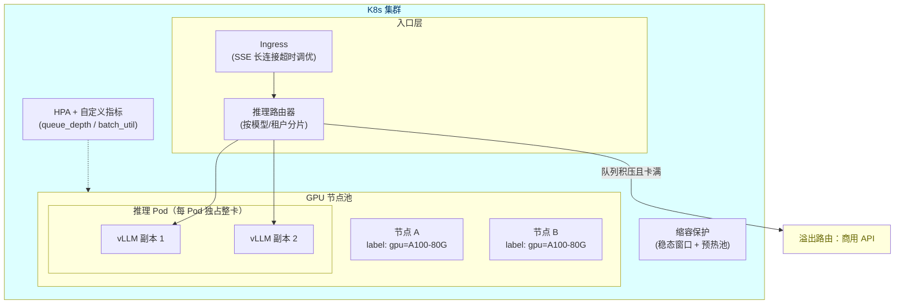

# GPU 调度与 K8s 部署

> **定位**：本文是 [00-vLLM推理服务与SpringAI集成] 的运维侧续篇：推理服务在 Kubernetes 上的资源调度、弹性伸缩与高可用设计。读者画像：需要把自建推理推向生产的架构师。前置阅读：[教程 04-企业级架构主干/13-部署与运维]、[教程 04-企业级架构主干/10-容错与弹性设计]、本附录上一篇。

---

## 1. GPU 调度与 CPU 调度的本质差异

Java 工程师熟悉 K8s 的 CPU/内存调度，但 GPU 调度有三个新约束：

| 维度 | CPU 调度 | GPU 调度 |
|------|----------|----------|
| 共享性 | 时间片共享，多租户天然隔离 | **整卡分配**为主，碎片化严重 |
| 扩容速度 | 秒级拉起新 Pod | 拉起慢（驱动初始化 + 模型加载可达数分钟） |
| 成本结构 | 弹性便宜 | 卡贵且供给紧张，闲置浪费巨大 |

因此推理平台的调度核心目标是：**提高卡利用率（拼载/批处理）+ 缩短扩容反应时间（预热池）+ 削峰（溢出到商用 API）**。

## 2. 生产部署拓扑



## 3. 关键配置要点

### 3.1 Pod 资源声明（独占整卡）

```yaml
apiVersion: apps/v1
kind: Deployment
metadata:
  name: vllm-deepseek
spec:
  replicas: 2
  selector:
    matchLabels: { app: vllm }
  template:
    metadata:
      labels: { app: vllm }
    spec:
      containers:
        - name: vllm
          image: vllm/vllm-openai:latest
          args: ["--model", "/models/deepseek-r1-distill-qwen-32b",
                 "--max-model-len", "16384",
                 "--gpu-memory-utilization", "0.90"]
          resources:
            limits:
              nvidia.com/gpu: 1   # 整卡分配，避免共享干扰
            requests:
              nvidia.com/gpu: 1
              cpu: "8"
              memory: 32Gi
          readinessProbe:          # 模型加载完成才算就绪
            httpGet: { path: /health, port: 8000 }
            initialDelaySeconds: 120
```

### 3.2 弹性伸缩：用对指标

CPU 利用率对推理负载**不敏感**（瓶颈在 GPU），HPA 应挂自定义指标：vLLM 暴露的请求队列深度（`vllm:num_requests_waiting`）、批利用率（活跃 batch 占比）、TTFT 滑动窗口。缩容必须配稳态窗口（如 15 分钟低负载才缩）+ 预热池（保留 1 副本常热，避免冷启动风暴）——这套"慢扩快保"策略与 [教程 04-企业级架构主干/10-容错与弹性设计] 的通用弹性原则一致。

### 3.3 多模型混部

卡供给紧张时用**分时复用**：白天在线推理、夜间跑批量评测/微调任务（K8s CronJob 切换 Deployment 权重）。混部要给两类负载打不同的 PriorityClass，在线任务抢占批量任务（呼应 [教程 04-企业级架构主干/06-多租户隔离与资源治理] 的资源池思想）。

## 4. 可观测与成本归因

GPU 推理的可观测要落到三个自定义维度（接 Micrometer，方法见 [教程 04-企业级架构主干/02-全链路可观测性]）：

- **卡利用率**：SM 占用率、显存水位——判断是否该扩容/换量化版本
- **服务指标**：TTFT/TPOT 分位数、队列深度——判断用户体验
- **成本归因**：按租户/模型统计 Token 消耗 ÷ 卡时成本 = 单位成本，喂给 [教程 04-企业级架构主干/07-成本治理与Token计量] 的账单体系

「想深入评估工具链？→ [附录 11-评估与可观测生态/00-Langfuse与Ragas集成]」

## 5. 小结

GPU 调度的思维模型一句话：**把"卡"当成最贵的资源池来治理**——独占分配防干扰、自定义指标做弹性、预热池防冷启动、溢出商用 API 削峰、分时复用提利用率。这些全部是 Java 架构师已有的治理能力向 GPU 域的平移，与 [教程 04-企业级架构主干/00-管控分离架构] 的 Control Plane 视角天然契合：推理平台本身就是 Agent 中台的 Data Plane 底座。
