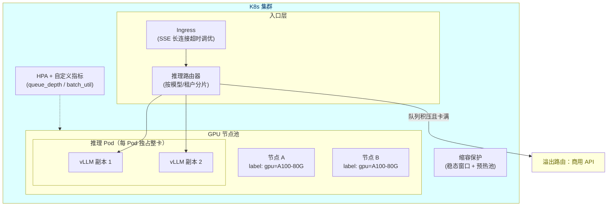
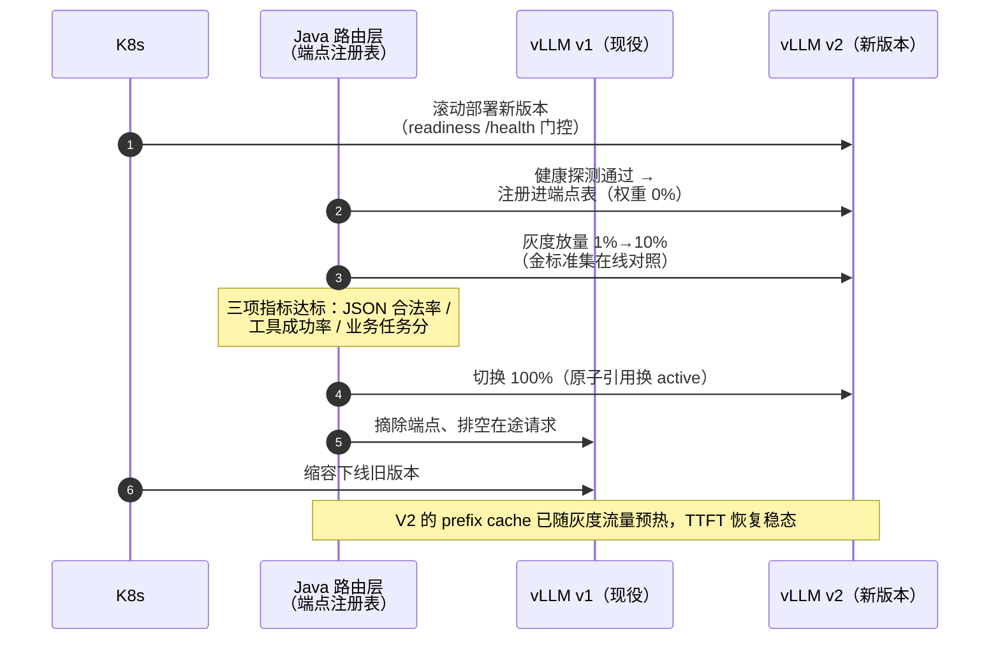

# GPU 调度与 K8s 部署

> **定位**：本文是 [00-vLLM推理服务与SpringAI集成] 的运维侧续篇：推理服务在 Kubernetes 上的资源调度、弹性伸缩、模型热加载换版与高可用设计。读者画像：需要把自建推理推向生产的架构师。前置阅读：[教程 04-企业级架构主干/13-部署与运维]、[教程 04-企业级架构主干/10-容错与弹性设计]、本附录上一篇。

---

## 1. GPU 调度与 CPU 调度的本质差异

Java 工程师熟悉 K8s 的 CPU/内存调度，但 GPU 调度有三个新约束：

| 维度 | CPU 调度 | GPU 调度 |
|------|----------|----------|
| 共享性 | 时间片共享，多租户天然隔离 | **整卡分配**为主，碎片化严重 |
| 扩容速度 | 秒级拉起新 Pod | 拉起慢（驱动初始化 + 模型加载可达数分钟） |
| 成本结构 | 弹性便宜 | 卡贵且供给紧张，闲置浪费巨大 |

因此推理平台的调度核心目标是：**提高卡利用率（拼载/批处理）+ 缩短扩容反应时间（预热池）+ 削峰（溢出到商用 API）**。

## 2. 生产部署拓扑



## 3. 关键配置要点

### 3.1 Pod 资源声明（独占整卡）

```yaml
apiVersion: apps/v1
kind: Deployment
metadata:
  name: vllm-deepseek
spec:
  replicas: 2
  selector:
    matchLabels: { app: vllm }
  template:
    metadata:
      labels: { app: vllm }
    spec:
      containers:
        - name: vllm
          image: vllm/vllm-openai:latest
          args: ["--model", "/models/deepseek-r1-distill-qwen-32b",
                 "--max-model-len", "16384",
                 "--gpu-memory-utilization", "0.90"]
          resources:
            limits:
              nvidia.com/gpu: 1   # 整卡分配，避免共享干扰
            requests:
              nvidia.com/gpu: 1
              cpu: "8"
              memory: 32Gi
          readinessProbe:          # 模型加载完成才算就绪
            httpGet: { path: /health, port: 8000 }
            initialDelaySeconds: 120
```

### 3.2 弹性伸缩：用对指标

CPU 利用率对推理负载**不敏感**（瓶颈在 GPU），HPA 应挂自定义指标：vLLM 暴露的请求队列深度（`vllm:num_requests_waiting`）、批利用率（活跃 batch 占比）、TTFT 滑动窗口。缩容必须配稳态窗口（如 15 分钟低负载才缩）+ 预热池（保留 1 副本常热，避免冷启动风暴）——这套"慢扩快保"策略与 [教程 04-企业级架构主干/10-容错与弹性设计] 的通用弹性原则一致。

### 3.3 多模型混部

卡供给紧张时用**分时复用**：白天在线推理、夜间跑批量评测/微调任务（K8s CronJob 切换 Deployment 权重）。混部要给两类负载打不同的 PriorityClass，在线任务抢占批量任务（呼应 [教程 04-企业级架构主干/06-多租户隔离与资源治理] 的资源池思想）。

## 4. 模型热加载与换版不重启

先说结论：**vLLM 没有进程内权重热加载**——权重在启动时一次性载入显存，"换权重"在 vLLM 语境里就是"换进程"。所以"换模型版本不重启（Java 应用）"的正确实现位置不在推理进程内，而在**部署层（K8s）与 Java 路由层（Spring AI）的接缝上**。

### 4.1 vLLM 场景的有限做法

| 做法 | 本质 | 适用边界 |
|------|------|---------|
| K8s 滚动更新 | 新 Pod（新权重）过 readiness `/health` 门控（§3.1）就绪后，旧 Pod 摘除——**新进程替换旧进程**，Service 负载均衡挡在前面，Java 侧无感 | 常规发版，无需流量对照 |
| 双 Deployment + 权重切换 | 新旧两套 Deployment 并存，路由层按权重切流量，旧版排空后缩容（金丝雀/蓝绿在 GPU 域的投影） | 量化版准入（[02 篇] §3.3 门禁）、微调产物上量前的对照灰度 |
| LoRA 动态加载 | `--enable-lora` 启动后，经 vLLM API **运行中**加载/卸载 LoRA 适配器——唯一真正"进程内热换"的官方能力 | 只换行为不换基座（[附录 15-AIInfra与推理部署/03-微调与数据回流决策] LoRA 路线的产物）；换基座/换量化位宽不适用 |

三个做法共享一条隐含代价：**任何换进程都让 prefix cache 归零**——[02 篇 §2.2] 那笔 Agent 场景的 TTFT 收益（System Prompt+工具 Schema 前缀复用）在新实例上暂时消失，放量前先预热（回放一批真实请求），否则换版瞬间表现为 TTFT 尖刺，容易被误判为"新模型变慢了"。

### 4.2 Java 侧的正确姿势：多端点注册 + 健康探测 + 权重切换

Spring AI 侧不要试图"进程内换权重"——那是把推理引擎的能力面误当 Java 的能力面。2.0.0 的正确抽象是**一个模型版本 = 一个 vLLM 端点 = 一个 `ChatModel` 实例**（`OpenAiChatModel.builder()` 为 2.0.0 真实 API，实例构造走自动装配同款链路：`openAiClient(base-url/api-key)` → `builder().options(...).build()`，字节码实证沉淀于 `scripts/api-baseline-spring-ai-2.0.0.md`），"换版"由此降维成路由表换一个条目：

```java
// Spring AI 2.0.0 —— 模型版本端点注册表（架构示意）
import java.util.Map;
import java.util.concurrent.atomic.AtomicReference;
import org.springframework.ai.chat.model.ChatModel;

public class ModelVersionRegistry {

    record Endpoint(String baseUrl, ChatModel model) {}

    private final Map<String, Endpoint> endpoints;               // "v7b-fp16" / "v7b-int4" / ...
    private final AtomicReference<String> active = new AtomicReference<>("v7b-fp16");

    /** 业务侧唯一入口：换版 = 换一个原子引用，Java 进程零重启 */
    public ChatModel current() {
        return this.endpoints.get(this.active.get()).model();
    }
    // 健康探测：vLLM 原生 GET {base-url}/health，WebClient + Reactor 定时探活、
    // DOWN 即摘除——[教程 04-企业级架构主干/12-模型路由与降级] 的降级思想平移到实例层；
    // 探测调度禁止阻塞 EventLoop（[教程 01-WebFlux与响应式编程/06-线程模型与调度器]）
}
```

这个姿势把两套既有教程能力直接接到推理侧：**路由降级**（[教程 04-企业级架构主干/12-模型路由与降级]——端点即路由条目，探测失败自动摘除）与**灰度发布**（[教程 04-企业级架构主干/09-灰度发布与版本管理]——权重切换就是流量切分，1%→10%→100% 每档跑一遍 [02 篇 §3.3] 的金标准对照，量化版上量即闭环）。



反模式一条：**改模型目录里的权重文件后期望运行中生效**——这在 vLLM 能力面上不存在，等价于"带着缓存不一致风险的重启"；部署侧老老实实滚动，Java 侧老老实实切引用。

## 5. 可观测与成本归因

GPU 推理的可观测要落到三个自定义维度（接 Micrometer，方法见 [教程 04-企业级架构主干/02-全链路可观测性]）：

- **卡利用率**：SM 占用率、显存水位——判断是否该扩容/换量化版本
- **服务指标**：TTFT/TPOT 分位数、队列深度——判断用户体验
- **成本归因**：按租户/模型统计 Token 消耗 ÷ 卡时成本 = 单位成本，喂给 [教程 04-企业级架构主干/07-成本治理与Token计量] 的账单体系

「想深入评估工具链？→ [附录 11-评估与可观测生态/00-Langfuse与Ragas集成]」

## 6. 小结

GPU 调度的思维模型一句话：**把"卡"当成最贵的资源池来治理**——独占分配防干扰、自定义指标做弹性、预热池防冷启动、溢出商用 API 削峰、分时复用提利用率。换版一句话：**vLLM 没有进程内热加载——换版是 K8s 滚动 + Java 路由切引用，不是推理进程内换权重**。这些全部是 Java 架构师已有的治理能力向 GPU 域的平移，与 [教程 04-企业级架构主干/00-管控分离架构] 的 Control Plane 视角天然契合：推理平台本身就是 Agent 中台的 Data Plane 底座。
