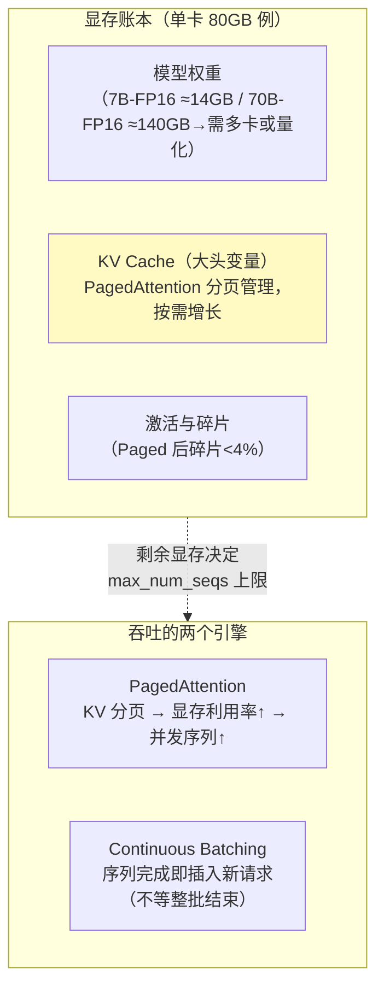
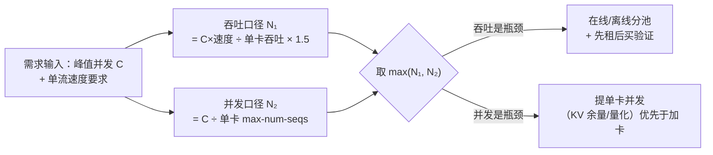

# vLLM 调优与 GPU 容量规划

> **定位**：[附录 15-AIInfra与推理部署/00-vLLM推理服务与SpringAI集成] 讲了"怎么跑起来"，本文讲"怎么跑得好、跑多少卡"——PagedAttention 与连续批处理的机制拆解、吞吐-延迟权衡的关键参数（显存利用率/量化/前缀缓存/并行度）、**QPS→卡数的容量公式与算例**、基准测试方法、Spring AI 侧的配合参数。兑现 [教程 87-多模型协作与供应策略] 审计点名的"GPU 容量规划"缺口。
>
> **读者画像**：自建推理（[教程 44 §6] 自建 vs 商用决策已定）需要压榨单卡吞吐、或要回答"这套 QPS 要买几张卡"的工程师/架构师。
>
> **前置阅读**：[附录 15-AIInfra与推理部署/00-vLLM推理服务与SpringAI集成]；[教程 87-多模型协作与供应策略 §6]。
>
> **版本基准**：vLLM 0.9+/1.x（参数名以所引版本文档为准，演进较快）；GPU 以 A100/H100/L40S/4090 家族讨论。

---

## 1. 机制回顾：钱都花在哪了

[00 篇] 已给概念，这里按"调优视角"重排三件套：



**核心认知：推理吞吐的瓶颈几乎总是"能同时养多少并发序列"**，而并发数由（总显存 − 权重 − 激活）能容纳的 KV Cache 决定——一切调优都在这个等式里做文章。

## 2. 参数调优：按目标组织

### 2.1 吞吐优先（离线批处理/评估管道）

| 参数 | 建议 | 机理 |
|------|------|------|
| `gpu-memory-utilization` | 0.90~0.95 | 留给 KV Cache 的比例；留太低浪费卡，太高 OOM |
| `max-num-seqs` | 128~512 | 并发序列上限（受 KV 余量约束，vLLM 会自动调度） |
| `max-num-batched-tokens` | 8192~32768 | 单步 prefill 预算；越大吞吐越高、首响延迟越抖 |
| 量化 | AWQ/GPTQ INT4 或 FP8（H 系原生） | 权重变小 → 同卡塞更多 KV；质量损失先评估（[教程 80] 离线对比） |

### 2.2 延迟优先（在线交互/Agent 对话）

| 参数 | 建议 | 机理 |
|------|------|------|
| `enable-prefix-caching` | **开** | 共享前缀（System Prompt/工具 Schema，[教程 34 §5]）的 KV 直接复用——Agent 场景收益极大：同租户同工具集的首 Token 延迟可降 30%+ |
| `chunked-prefill` | 开 | 长 prompt 的 prefill 与 decode 交错，避免长输入阻塞在线 decode |
| `max-num-batched-tokens` | 适度调小 | 在线流优先响应平滑 |
| speculative decoding | 草稿模型可用时开 | 小模型起草大模型校验，decode 提速（接受率决定收益） |

### 2.3 权衡曲线（经验形态）

| 配置 | TTFT | 单流 TPOT | 总吞吐 |
|------|------|-----------|--------|
| 小 batch 上限（在线专用） | 低 | 低 | 低 |
| 大 batch + chunked prefill | 中 | 中 | 高 |
| 大 batch 无 chunked + 长输入 | 高（被 prefill 排队） | 中 | 高 |

没有"两全"——**用两个实例池分流**（在线小 batch / 离线大 batch，[教程 65] 模型路由思想平移到实例层）。

## 3. 容量规划：QPS → 卡数

四步公式（全部可代入自己的数）：

```
① 需求侧：峰值并发流 C（Agent 场景 = 峰值会话数 × 每会话并发请求）
          峰值 tokens/s 输出 T_out = C × 单流生成速度需求
② 供给侧：单卡吞吐 = 基准实测（§4）——7B-INT4 单卡 A100/L40S 常见 2000~6000 output tok/s（大 batch）
③ 卡数（吞吐口径）N₁ = T_out / 单卡吞吐 × 冗余 1.5（毛刺+长尾+故障余量）
④ 卡数（并发口径）N₂ = C / 单卡可并发序列数；取 max(N₁, N₂)
```

**算例**（Agent 平台自建 7B 路由档，[教程 44 §3] 分层路由的便宜档）：

```
峰值并发会话 300，每会话 1 请求在途；单流要求 ≥30 tok/s（可读速度）
- 吞吐口径：300 × 30 = 9,000 output tok/s 峰值
- 实测 L40S + 7B-INT4 + 大 batch：≈3,500 tok/s/卡
- N₁ = 9000/3500 × 1.5 ≈ 3.86 → 4 卡
- 并发口径：单卡 max-num-seqs=256 ≥ 300 → N₂ = 2 卡
- 结论：4 卡（吞吐是瓶颈，不是并发）
```

两个必答题：**prefill 也占资源**（输入长的 RAG 场景把 T_in 一并压测，别只测输出）；**解码长度分布**决定吞吐（长输出稀释并发能力——用真实轨迹回放压测，[附录 11-评估与可观测生态/02] 的数据集兼当压测语料）。



## 4. 基准测试：先测后买

```bash
# vLLM 自带基准服务（以所引版本为准）
python benchmarks/benchmark_serving.py \
  --backend vllm --model /models/qwen3-7b-int4 \
  --dataset-name sharegpt --random-input-len 2048 --random-output-len 512 \
  --num-prompts 500 --request-rate 20   # 逐步加压，找到 P99 TTFT 拐点
```

纪律：**用自己分布的 payload**（输入/输出长度、前缀共享率——Agent 工具 Schema 的前缀共享是真实收益）；记录 (参数集, 显存水位, 实测吞吐, P99 TTFT/TPOT) 对照表——容量规划的证据是这张表（[教程 72-性能调优与容量规划] §6] 同款方法论）；变更一个参数跑一轮。

## 5. Spring AI 侧的配合

1. **超时对齐**：WebClient/ChatModel 的 read timeout ≥ 最坏 P99（大 batch 下 TTFT 尖刺到 10s+ 很常见）——[教程 63] 超时预算的推理侧取值来源。
2. **重试与熔断按端点粒度**：自建端点与商用 API 分开熔断（[教程 44 §4]），自建的故障形态是排队慢而不是 429。
3. **观测埋点**：vLLM 暴露 Prometheus 指标（num_requests_running/waiting、KV cache usage、token throughput）——与 [教程 05 §4] 的应用侧 gen_ai 指标拼成全链路（应用看到的延迟 ↔ 服务端排队/计算的归因）。
4. **部署**：K8s + GPU Operator；实例池按 §2.3 分流；HPA 用**队列深度指标**而非 GPU 利用率（利用率恒高不代表过载，队列增长才是）——[教程 66] HPA 误区的推理版。

## 6. GPU 经济性速查（2026 视角，量级参考）

| 卡 | 定位 | 备注 |
|----|------|------|
| H100/H200 | 旗舰训练+高价值推理 | 单位吞吐成本最优（满负载时） |
| A100/A800 | 存量主力 | 70B 级推理仍常用 |
| L40S | 推理甜点卡 | INT8/FP8 推理性价比高，无 NVLink（张量并行受限） |
| RTX 4090/5090 | 开发与小规模 | 24/32GB 显存墙，7B-INT4 单卡可用，密度差 |

**选卡逻辑**：7B~14B 优先 L40S/4090 池（密度换成本），70B 才上 H 系多卡张量并行；**先租后买**（云 GPU 弹性验证容量公式，再决定自购——[教程 44 §6] 自建决策的验证步）。

## 7. 适用场景与不适用场景

### 适用场景

- 自建路由档（便宜模型）+ 商用旗舰档的混合供应（[教程 44 §8]）
- 评估/嵌入批处理的自有吞吐（离线池）
- 高峰可预测且容量公式经过实测校准的在线服务

### 不适用场景

- 每天几千次调用的长尾应用——卡的钱够买十年 API（[教程 87] 自建 vs 商用公式先算）
- 没有实测就拍卡数——§3 公式的每个供给参数都要有基准背书
- 极致低延迟（<200ms TTFT）——vLLM 大 batch 哲学与它冲突，小 batch 专用池或专用推理栈

## 8. 常见误区与反模式

1. **只看 GPU 利用率扩容**——利用率高且队列空 = 健康；队列涨才是过载信号。
2. **`gpu-memory-utilization=0.95` 后又叠长上下文**——`max-model-len` 上限与 KV 余量要联合校验，否则长输入 OOM。
3. **忽略前缀缓存收益**——Agent 的 System Prompt+工具 Schema 是天然共享前缀，不开 prefix caching 白丢 30% TTFT。
4. **量化不评估直接上**——INT4 对中文/结构化输出的影响按任务实测（[教程 80] 回归）。
5. **在线离线混池**——离线批把在线 TTFT 打爆；分流两个池。

## 9. 总结

vLLM 调优一句话：**显存账本决定并发，PagedAttention+连续批处理把并发变吞吐，prefix caching 把 Agent 的共享前缀变成免费加速**。容量规划一句话：**需求侧 tokens/s ÷ 实测单卡吞吐 × 1.5 冗余，取吞吐与并发口径的 max，先租后买**。与 [00 篇]（部署）、[教程 87]（供应决策）、[教程 65]（路由）合成自建推理的完整决策链。

**外部来源**：[vLLM 文档](https://docs.vllm.ai/) · [Efficient Memory Management for LLM Serving with PagedAttention (Kwon et al., 2023)](https://arxiv.org/abs/2309.06180) · [vLLM benchmarks](https://github.com/vllm-project/vllm/tree/main/benchmarks) · [NVIDIA L40S 白皮书](https://www.nvidia.com/en-us/data-center/l40s/)
