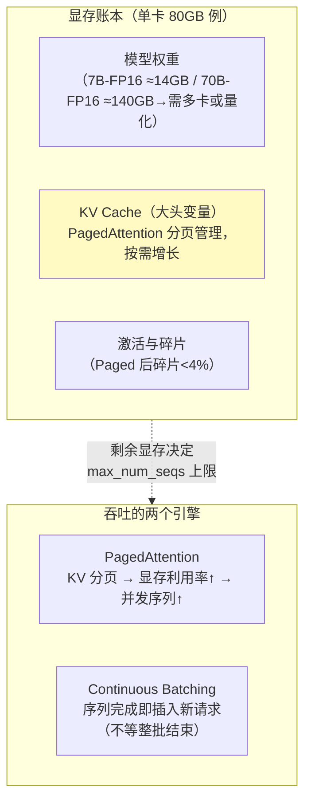
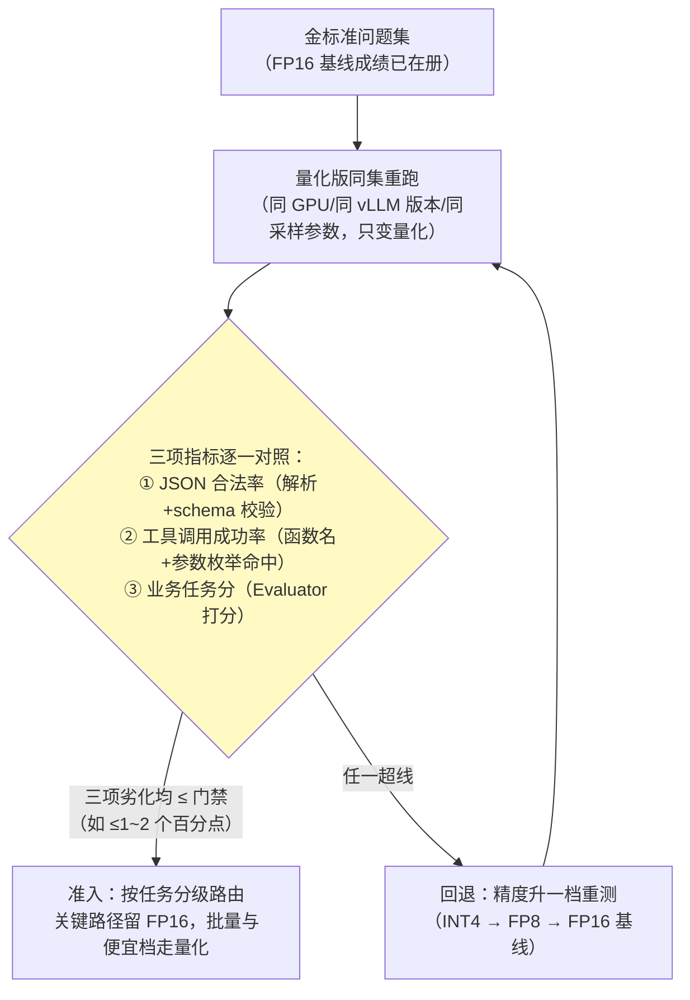
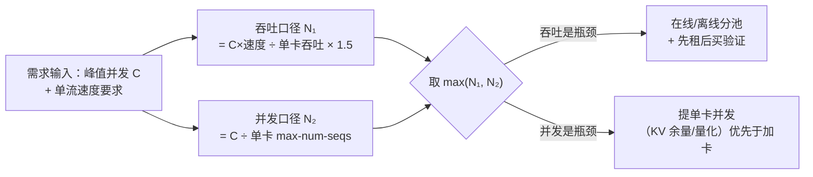

# vLLM 调优与 GPU 容量规划

> **定位**：[附录 15-AIInfra与推理部署/00-vLLM推理服务与SpringAI集成] 讲了"怎么跑起来"，本文讲"怎么跑得好、跑多少卡"——PagedAttention 与连续批处理的机制拆解、吞吐-延迟权衡的关键参数（显存利用率/前缀缓存/并行度）、**模型量化的方式、代价与准入评估**、**QPS→卡数的容量公式与算例**、基准测试方法、Spring AI 侧的配合参数。兑现 [教程 08-架构师进阶/10-多模型协作与供应策略] 审计点名的"GPU 容量规划"缺口。
>
> **读者画像**：自建推理（[教程 05-Observation可观测/11-深度整合：SpringAI2与Observation的完整结合面 §6] 自建 vs 商用决策已定）需要压榨单卡吞吐、或要回答"这套 QPS 要买几张卡"的工程师/架构师。
>
> **前置阅读**：[附录 15-AIInfra与推理部署/00-vLLM推理服务与SpringAI集成]；[教程 08-架构师进阶/10-多模型协作与供应策略 §7]。
>
> **版本基准**：vLLM 0.9+/1.x（参数名以所引版本文档为准，演进较快）；GPU 以 A100/H100/L40S/4090 家族讨论。

---

## 1. 机制回顾：钱都花在哪了

[00 篇] 已给概念，这里按"调优视角"重排三件套：



**核心认知：推理吞吐的瓶颈几乎总是"能同时养多少并发序列"**，而并发数由（总显存 − 权重 − 激活）能容纳的 KV Cache 决定——一切调优都在这个等式里做文章。

## 2. 参数调优：按目标组织

### 2.1 吞吐优先（离线批处理/评估管道）

| 参数 | 建议 | 机理 |
|------|------|------|
| `gpu-memory-utilization` | 0.90~0.95 | 留给 KV Cache 的比例；留太低浪费卡，太高 OOM |
| `max-num-seqs` | 128~512 | 并发序列上限（受 KV 余量约束，vLLM 会自动调度） |
| `max-num-batched-tokens` | 8192~32768 | 单步 prefill 预算；越大吞吐越高、首响延迟越抖 |
| 量化 | AWQ/GPTQ INT4 或 FP8（H 系原生） | 权重变小 → 同卡塞更多 KV；质量损失先评估——完整展开见 §3 |

### 2.2 延迟优先（在线交互/Agent 对话）

| 参数 | 建议 | 机理 |
|------|------|------|
| `enable-prefix-caching` | **开** | 共享前缀（System Prompt/工具 Schema，[教程 05-Observation可观测/01-读懂输出：span树与观测生命周期 §5]）的 KV 直接复用——Agent 场景收益极大：同租户同工具集的首 Token 延迟可降 30%+ |
| `chunked-prefill` | 开 | 长 prompt 的 prefill 与 decode 交错，避免长输入阻塞在线 decode |
| `max-num-batched-tokens` | 适度调小 | 在线流优先响应平滑 |
| speculative decoding | 草稿模型可用时开 | 小模型起草大模型校验，decode 提速（接受率决定收益） |

### 2.3 权衡曲线（经验形态）

| 配置 | TTFT | 单流 TPOT | 总吞吐 |
|------|------|-----------|--------|
| 小 batch 上限（在线专用） | 低 | 低 | 低 |
| 大 batch + chunked prefill | 中 | 中 | 高 |
| 大 batch 无 chunked + 长输入 | 高（被 prefill 排队） | 中 | 高 |

没有"两全"——**用两个实例池分流**（在线小 batch / 离线大 batch，[教程 04-企业级架构主干/12-模型路由与降级] 模型路由思想平移到实例层）。

## 3. 模型量化：方式、代价与评估

§2 的参数表里，量化是唯一"动的是权重本身"的参数——它跨过了调参边界、进入"换模型"领域，质量后果不能沿用调参直觉，值得独立一节。本节是对 §2.1 表格量化行与 §9 误区 4（"量化不评估直接上"）的展开，不重复造轮子。

### 3.1 四种主流方式的机制区分

| 方式 | 一句话机制 | 位宽形态 | vLLM 启动示例 | 硬件要求 | 相对质量风险 |
|------|-----------|---------|--------------|---------|------------|
| **GPTQ** | 训练后量化（PTQ）：基于近似二阶信息的逐层误差补偿，把权重压到低比特 | 权重 INT4、激活 FP16（weight-only） | `--quantization gptq` | 无特殊要求 | 中 |
| **AWQ** | 激活感知量化：按激活分布找出"显著权重"通道做缩放保护，其余压低比特 | 权重 INT4、激活 FP16（weight-only） | `--quantization awq` | 无特殊要求 | 中（生成类任务常略优于 GPTQ） |
| **FP8** | 权重与激活一起压到 8-bit 浮点，由张量核心原生计算——不仅省显存，计算也提速 | 权重+激活均 FP8（W8A8） | `--quantization fp8` | H100/H200/L40S 等原生 FP8 | 低（近无损） |
| **INT4（统称）** | 4-bit 位宽档位的统称，常见实现即 GPTQ-Int4 / AWQ-Int4，显存收益最大 | 权重 INT4 | 同上两种 | 无特殊要求 | 四者中最高 |

三个容易混淆的边界：**weight-only（GPTQ/AWQ）只省显存与带宽、不加速计算**——计算仍走 FP16 激活；**FP8 连计算一起降精度**，所以它需要硬件原生支持，收益也是"显存+速度"双份；**INT4 不是独立算法而是位宽**，选 INT4 时真正的决策是"GPTQ 还是 AWQ"。另有一条生态线：GGUF（llama.cpp/K-quants）是 [附录 15-AIInfra与推理部署/04-Ollama本地模型部署与SpringAI集成] 所在的本地部署生态的量化格式，与 vLLM 的服务端量化是两条路线，不要混用。

### 3.2 代价：Agent 场景的两个特有关切

通用规律一句话：量化扰动采样分布，任务级影响**极不均匀**——闲聊摘要几乎无感，"逐 token 精确"类任务最敏感。而 Agent 恰好把最敏感的两类任务放在主路径上：

**关切一：中文任务。** 各开源模型量化版的公开发布指标多以英文 benchmark 为准，量化噪声对不同语言 token 分布的影响并不均匀——中文高密度字符级 token 对扰动的敏感度通常更高，**英文 benchmark 的"基本无损"不能平移到中文任务**。这是"信 benchmark 不如信自己的金标准集"的推理侧版本。

**关切二：结构化输出与工具调用（Agent 特有）。** JSON mode 的合法性依赖引号/花括号/逗号这类高精度 token 的采样一致性；工具调用要求函数名与参数枚举值逐字正确。量化后，**JSON 合法率、字段完整性、工具名命中率都可能劣化**——这三个恰恰是 Agent 的命门指标（[教程 10-调优实战与方法论/01-环节体检：五环节指标与判病阈值] 的工具环节体检指标）。一个必须点破的误区：vLLM 的受限解码（guided decoding，`guided_json`，新版演进出 structured outputs 系参数名，以所引版本文档为准）能在**语法层**强制合法 JSON，但它治不了"字段值质量差、选错工具"——**别把受限解码当量化劣化的遮羞布**。

### 3.3 准入评估：金标准集量化前后对照

方法直接复用 [教程 08-架构师进阶/03-自我反思与Agent评估] 的金标准问题集与回归门禁——量化版和 FP16 基线跑**同一份题、同一套采样参数**，只变量化这一个变量：



三条纪律：**指标必须是上面三个 Agent 命门，不是通用困惑度**（困惑度降 0.5 看不出 JSON 合法率掉了 8 个百分点）；**评估集与量化候选之间无泄漏**（评测集治理见 [教程 08-架构师进阶/03-自我反思与Agent评估] §评测集资产管理）；**结论绑定参数集**（位宽+量化实现+采样参数），换任何一个都要重跑对照——这与 §5 基准测试的对照表纪律是同一条。

### 3.4 量化与成本帕累托：排在哪里、排不进哪里

[教程 10-调优实战与方法论/05-架构调优] 的成本-效果帕累托排序把候选手段按"预期收益 ÷ 投入"排座次，量化降档在这个座次上位置特殊：

- **它是改动半径最小的一档**——不训练、不动管线、服务级换一个权重文件，投入约等于一轮 §3.3 评估；收益侧是显存账本直接改写（§1：权重减半 = 同卡 KV 余量翻倍 ≈ 并发上限近似翻倍），并同步改写 §4 容量公式的"单卡吞吐"供给参数。
- **它又是收益上限有限的一档**——量化解决"跑得下、跑得快"，不解决"答不对"。当 [教程 10-调优实战与方法论/01-环节体检：五环节指标与判病阈值] 把病判在"模型能力不足"环节时，量化降档不入选（那是升维问题，走 05-架构调优的调优阶梯）；判在"容量不够、成本超支"时，量化才进候选池。
- **帕累托最优常是"两档并存+分级路由"而非"全量一刀切"**：FP16 档与量化档都部署，关键路径（结构化输出/工具调用密集的会话）路由到 FP16，批量任务与便宜档路由到量化版——这正是 [教程 04-企业级架构主干/12-模型路由与降级] 的模型路由思想在"同模型不同精度档"上的应用，成本归因照常走 [教程 04-企业级架构主干/07-成本治理与Token计量] 按档计量。

## 4. 容量规划：QPS → 卡数

四步公式（全部可代入自己的数）：

```
① 需求侧：峰值并发流 C（Agent 场景 = 峰值会话数 × 每会话并发请求）
          峰值 tokens/s 输出 T_out = C × 单流生成速度需求
② 供给侧：单卡吞吐 = 基准实测（§5）——7B-INT4 单卡 A100/L40S 常见 2000~6000 output tok/s（大 batch）
③ 卡数（吞吐口径）N₁ = T_out / 单卡吞吐 × 冗余 1.5（毛刺+长尾+故障余量）
④ 卡数（并发口径）N₂ = C / 单卡可并发序列数；取 max(N₁, N₂)
```

**算例**（Agent 平台自建 7B 路由档，[教程 05-Observation可观测/11-深度整合：SpringAI2与Observation的完整结合面 §3] 分层路由的便宜档）：

```
峰值并发会话 300，每会话 1 请求在途；单流要求 ≥30 tok/s（可读速度）
- 吞吐口径：300 × 30 = 9,000 output tok/s 峰值
- 实测 L40S + 7B-INT4 + 大 batch：≈3,500 tok/s/卡
- N₁ = 9000/3500 × 1.5 ≈ 3.86 → 4 卡
- 并发口径：单卡 max-num-seqs=256 ≥ 300 → N₂ = 2 卡
- 结论：4 卡（吞吐是瓶颈，不是并发）
```

两个必答题：**prefill 也占资源**（输入长的 RAG 场景把 T_in 一并压测，别只测输出）；**解码长度分布**决定吞吐（长输出稀释并发能力——用真实轨迹回放压测，[附录 11-评估与可观测生态/02] 的数据集兼当压测语料）。



## 5. 基准测试：先测后买

```bash
# vLLM 自带基准服务（以所引版本为准）
python benchmarks/benchmark_serving.py \
  --backend vllm --model /models/qwen3-7b-int4 \
  --dataset-name sharegpt --random-input-len 2048 --random-output-len 512 \
  --num-prompts 500 --request-rate 20   # 逐步加压，找到 P99 TTFT 拐点
```

纪律：**用自己分布的 payload**（输入/输出长度、前缀共享率——Agent 工具 Schema 的前缀共享是真实收益）；记录 (参数集, 显存水位, 实测吞吐, P99 TTFT/TPOT) 对照表——容量规划的证据是这张表（[教程 07-Kafka事件骨干/05-性能调优与容量规划] §6] 同款方法论）；变更一个参数跑一轮。

## 6. Spring AI 侧的配合

1. **超时对齐**：WebClient/ChatModel 的 read timeout ≥ 最坏 P99（大 batch 下 TTFT 尖刺到 10s+ 很常见）——[教程 04-企业级架构主干/10-容错与弹性设计] 超时预算的推理侧取值来源。
2. **重试与熔断按端点粒度**：自建端点与商用 API 分开熔断（[教程 05-Observation可观测/11-深度整合：SpringAI2与Observation的完整结合面 §4]），自建的故障形态是排队慢而不是 429。
3. **观测埋点**：vLLM 暴露 Prometheus 指标（num_requests_running/waiting、KV cache usage、token throughput）——与 [教程 00-基础与核心/05-RAG检索增强生成 §4] 的应用侧 gen_ai 指标拼成全链路（应用看到的延迟 ↔ 服务端排队/计算的归因）。
4. **部署**：K8s + GPU Operator；实例池按 §2.3 分流；HPA 用**队列深度指标**而非 GPU 利用率（利用率恒高不代表过载，队列增长才是）——[教程 04-企业级架构主干/13-部署与运维] HPA 误区的推理版。

## 7. GPU 经济性速查（2026 视角，量级参考）

| 卡 | 定位 | 备注 |
|----|------|------|
| H100/H200 | 旗舰训练+高价值推理 | 单位吞吐成本最优（满负载时） |
| A100/A800 | 存量主力 | 70B 级推理仍常用 |
| L40S | 推理甜点卡 | INT8/FP8 推理性价比高，无 NVLink（张量并行受限） |
| RTX 4090/5090 | 开发与小规模 | 24/32GB 显存墙，7B-INT4 单卡可用，密度差 |

**选卡逻辑**：7B~14B 优先 L40S/4090 池（密度换成本），70B 才上 H 系多卡张量并行；**先租后买**（云 GPU 弹性验证容量公式，再决定自购——[教程 05-Observation可观测/11-深度整合：SpringAI2与Observation的完整结合面 §6] 自建决策的验证步）。

## 8. 适用场景与不适用场景

### 适用场景

- 自建路由档（便宜模型）+ 商用旗舰档的混合供应（[教程 05-Observation可观测/11-深度整合：SpringAI2与Observation的完整结合面 §8]）
- 评估/嵌入批处理的自有吞吐（离线池）
- 高峰可预测且容量公式经过实测校准的在线服务

### 不适用场景

- 每天几千次调用的长尾应用——卡的钱够买十年 API（[教程 08-架构师进阶/10-多模型协作与供应策略] 自建 vs 商用公式先算）
- 没有实测就拍卡数——§4 公式的每个供给参数都要有基准背书
- 极致低延迟（<200ms TTFT）——vLLM 大 batch 哲学与它冲突，小 batch 专用池或专用推理栈

## 9. 常见误区与反模式

1. **只看 GPU 利用率扩容**——利用率高且队列空 = 健康；队列涨才是过载信号。
2. **`gpu-memory-utilization=0.95` 后又叠长上下文**——`max-model-len` 上限与 KV 余量要联合校验，否则长输入 OOM。
3. **忽略前缀缓存收益**——Agent 的 System Prompt+工具 Schema 是天然共享前缀，不开 prefix caching 白丢 30% TTFT。
4. **量化不评估直接上**——INT4 对中文/结构化输出的影响按任务实测（[教程 08-架构师进阶/03-自我反思与Agent评估] 回归；方式区分/门禁/帕累托完整展开见 §3）。
5. **在线离线混池**——离线批把在线 TTFT 打爆；分流两个池。

## 10. 总结

vLLM 调优一句话：**显存账本决定并发，PagedAttention+连续批处理把并发变吞吐，prefix caching 把 Agent 的共享前缀变成免费加速**。量化一句话：**量化动的是权重不是参数——动它之前先过金标准门禁（§3.3），动它之后按档分级路由（§3.4）**。容量规划一句话：**需求侧 tokens/s ÷ 实测单卡吞吐 × 1.5 冗余，取吞吐与并发口径的 max，先租后买**。与 [00 篇]（部署）、[教程 08-架构师进阶/10-多模型协作与供应策略]（供应决策）、[教程 04-企业级架构主干/12-模型路由与降级]（路由）合成自建推理的完整决策链。

**外部来源**：[vLLM 文档](https://docs.vllm.ai/) · [Efficient Memory Management for LLM Serving with PagedAttention (Kwon et al., 2023)](https://arxiv.org/abs/2309.06180) · [vLLM benchmarks](https://github.com/vllm-project/vllm/tree/main/benchmarks) · [NVIDIA L40S 白皮书](https://www.nvidia.com/en-us/data-center/l40s/)
