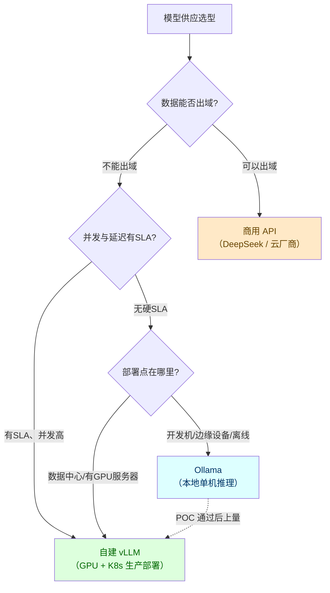
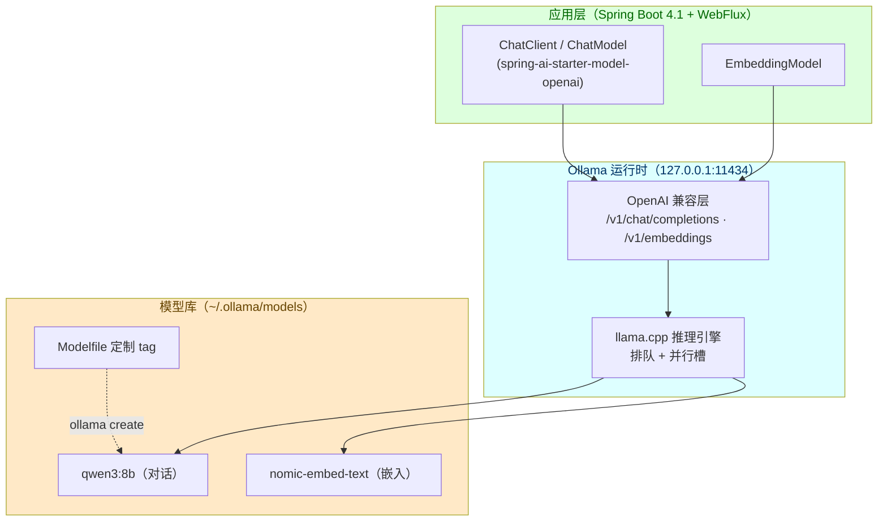
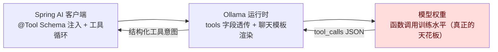
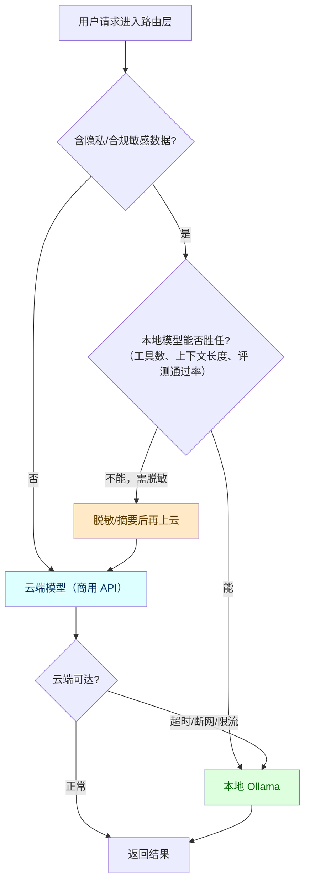

# Ollama 本地模型部署与 Spring AI 集成

> **定位**：本文与 [附录 15-AIInfra与推理部署/00-vLLM推理服务与SpringAI集成] 互补——vLLM 承担「生产高吞吐自建推理」，Ollama 承担「开发/原型/边缘单机」的本地推理；两篇合起来构成自建路线的完整拼图。读者画像：需要在开发环境、离线内网、边缘设备上跑本地模型的 Java 架构师与工程师，以及正在做「商用 API vs 自建」供应策略决策的架构师。前置阅读：[教程 08-架构师进阶/10-多模型协作与供应策略]（供应策略全景）、[附录 15-AIInfra与推理部署/00-vLLM推理服务与SpringAI集成]（生产侧对照）、[附录 01-LLM基础理论/01-Embedding原理]（§4.3 嵌入本地化前置）。

---

## 1. Ollama 是什么：定位与选型

### 1.1 一句话定位

Ollama 把「跑一个开源大模型」压缩成了两行命令：`ollama pull` 拉模型、`ollama run` 起对话，同时在本机 `11434` 端口暴露一个 REST 服务（含 OpenAI 兼容层）。它的角色类比后端工程师熟悉的东西——**Ollama 之于大模型，约等于 Docker 之于应用**：模型注册表（ollama.com 的模型库，类比 Docker Hub）+ 运行时（内置 llama.cpp 推理引擎，类比 containerd）+ CLI 与 API（类比 docker CLI 与引擎 API）。

这个定位决定了它的能力边界：**它为「单机、低并发、开箱即用」优化，不为「高并发、低延迟、高吞吐」优化**。前者正是开发与边缘场景的诉求，后者是 vLLM 的领地。

### 1.2 Ollama vs vLLM 对比表

| 维度 | Ollama | vLLM |
|------|--------|------|
| **定位** | 开发 / 原型 / 边缘单机 | 生产高吞吐推理服务 |
| **推理引擎** | llama.cpp（GGUF 格式，CPU/GPU 混合推理） | 自研引擎（PagedAttention + 连续批处理） |
| **并发模型** | 请求排队 + 少量并行槽（`OLLAMA_NUM_PARALLEL`，默认很小），高并发下吞吐急剧劣化 | 连续批处理（Continuous Batching），请求动态进出批次，GPU 利用率高 |
| **量化体系** | GGUF 量化（q4_K_M、q5_K_M、q8_0 等），模型库直接下载量化版 | AWQ / GPTQ / FP8 等，需自行准备量化权重或用官方适配版 |
| **硬件门槛** | 纯 CPU 可跑（慢），有 GPU 提速；Mac 统一内存天然友好 | 实际生产依赖 NVIDIA GPU，显存规划是硬前提 |
| **API** | 原生 REST（`/api/chat`、`/api/embed`）+ OpenAI 兼容层（`/v1/chat/completions`、`/v1/embeddings`） | OpenAI 兼容 API（`/v1/chat/completions`） |
| **多租户/治理** | 无——没有配额、鉴权、租户隔离的概念 | 需自建网关层，但吞吐与调度基础好 |
| **运维复杂度** | 单二进制（或单容器），几乎零配置 | 需要 GPU 驱动、K8s 调度、显存压测（见 [附录 15-AIInfra与推理部署/01-GPU调度与K8s部署]） |
| **Spring AI 接入** | OpenAI 兼容层直连（本文 §3.2）；原生 starter 需引入依赖后实证（§3.3） | OpenAI starter 直连（[附录 15-AIInfra与推理部署/00-vLLM推理服务与SpringAI集成] §3） |

**一句话记忆**：Ollama 与 vLLM 的关系，类似 H2 与 PostgreSQL——前者让「跑起来」的成本趋近于零，后者承载真实生产的并发与数据量。开发环境用 H2 不丢人，把 H2 当生产库才是事故。

### 1.3 什么时候选 Ollama 而不是 vLLM

五个典型时机，按架构决策的频率排序：

1. **开发与联调环境**：让团队每个人本机跑同一模型，替代「共享一个 dev 推理服务」——省掉 dev 环境的 GPU 排队与 Key 分发，且断网可开发。
2. **数据不能出域的 POC**：客户内网演示、敏感数据验证，用一台笔记本就能完成完整链路闭环（含 RAG 与工具调用），不申请任何外网通道。
3. **边缘与离线部署**：工厂质检机、门店一体机、舰载/车载设备——没有稳定外网，或外网带宽只够传结构化结果（呼应 [教程 09-前沿专题/09-边缘Agent与端云协同部署]）。
4. **嵌入模型的常驻本地化**：RAG 系统的 Embedding 调用量大且模式固定（见 §4.3），本地嵌入既省 Token 费用又消除一次网络往返。
5. ** CI/评测基础设施**：回归评测集时用本地小模型当「判题机」或「被测对象」，保证评测可重复、零 API 成本（评测方法见 [教程 08-架构师进阶/03-自我反思与Agent评估]）。

反过来，满足任一条件就不该选 Ollama：并发用户数上到两位数且延迟有 SLA；需要长上下文（32K+）下的高吞吐；需要 PD 分离、多卡张量并行这类生产级调度——这些请直接看 vLLM 系列（[附录 15-AIInfra与推理部署/02-vLLM调优与GPU容量规划]）。

选型决策的全貌如下：



注意图中最容易被忽略的一条边：**POC 用 Ollama 验证、上量后迁 vLLM** 是一条常见演进路径——因为两条路线对 Spring AI 而言都是同一个 OpenAI 兼容端点，应用层迁移成本约等于改一个 base-url（这正是 §3 要展开的工程红利）。

---

## 2. 部署与模型管理

### 2.1 安装与服务形态

Ollama 是单二进制服务，安装成本几乎为零：

```bash
# macOS（官网安装包，或 Homebrew）
brew install ollama

# Linux（官方脚本）
curl -fsSL https://ollama.com/install.sh | sh

# Docker（服务器/内网统一分发用）
docker run -d -p 11434:11434 -v ollama:/root/.ollama --name ollama ollama/ollama
```

安装后即有一个常驻服务监听 `127.0.0.1:11434`。两个工程上要注意的形态差异：

- **桌面端（macOS/Windows）**：安装包自带菜单栏常驻进程，开箱即用，但默认只监听 loopback。要让局域网内其他机器（比如你跑 Spring Boot 的 Linux 开发机）访问，需设置环境变量 `OLLAMA_HOST=0.0.0.0` 后重启服务——**这意味着服务对局域网开放且无鉴权，只能放在可信内网**，公网暴露必须前置网关（呼应 [教程 04-企业级架构主干/11-安全与权限控制] 的边界原则）。
- **Docker/服务器端**：模型目录挂载成卷（上面 `-v ollama:/root/.ollama`），否则容器重建模型全没；`OLLAMA_MODELS` 环境变量可把模型目录指到大容量磁盘。

### 2.2 模型拉取与版本管理（tag）

Ollama 用 **tag 管理模型版本**，语法与 Docker 镜像高度同构：`模型名:标签`。不写标签默认 `latest`：

```bash
ollama pull qwen3:8b                        # 拉取默认量化档
ollama pull llama3.1:8b-instruct-q4_K_M     # 显式指定量化档位
ollama list                                  # 本地已有模型（含体积与修改时间）
ollama ps                                    # 当前驻留在显存/内存中的模型
ollama show qwen3:8b                         # 查看模型详情：参数量、量化档、上下文长度、能力
ollama rm qwen3:8b-instruct-q4_K_M           # 删除指定 tag
ollama cp qwen3:8b my-agent-base:8b          # 复制出别名（配合 §2.3 定制）
```

架构师视角的版本管理要点：

- **tag 即「模型 + 量化档 + 微调变体」的三元组**。`qwen3:8b` 与 `qwen3:8b-instruct-q4_K_M` 可能是不同量化档的同一权重，行为与体积都不同——**团队开发必须约定完整 tag**，只在文档里写「用 qwen3」会复现出「我这里好好的」经典事故。
- **`ollama list` 应进开发环境文档**：模型库占磁盘以十 GB 计，定期清理无主 tag（类比 CI 上清理 dangling image）。
- **定制模型也走 tag 体系**：§2.3 用 Modelfile `create` 出来的模型就是一个新 tag，可以 `push` 到私有registry（企业内网自建 Ollama registry 分发定制模型，类比私有镜像仓库）。

### 2.3 Modelfile 定制：把系统提示词与参数固化进模型

Modelfile 是 Ollama 的「模型构建脚本」（类比 Dockerfile），最实用的三个指令是 `FROM`（基模型）、`SYSTEM`（预置系统提示词）、`PARAMETER`（固化推理参数）：

```bash
# Modelfile —— 面向 Java Agent 的定制示例
FROM qwen3:8b

# 固化系统提示词：模型级人设（每次请求无需再传）
SYSTEM """
你是一个运行在企业内网的助手。回答必须使用中文。
涉及工具调用时严格按工具的 JSON Schema 生成参数，不要编造字段。
"""

# 固化推理参数：覆盖默认值
PARAMETER temperature 0.3
PARAMETER num_ctx 8192
PARAMETER num_predict 1024
```

```bash
ollama create agent-qwen3:8b -f Modelfile
ollama run agent-qwen3:8b
```

**「模型级 vs 请求级」的分层原则**是这里最重要的架构决策：`SYSTEM` 固化的是**模型级人设**（语言、风格、角色边界——变化频率低），Spring AI 侧 `ChatClient` 的 `.system(...)` 传的是**请求级指令**（任务上下文、RAG 内容——每次请求都变）。把所有提示词都烧进 Modelfile 会让模型无法按租户/场景差异化，把人设全部放请求侧则每个请求都多驮一段 Token。经验分界：**不变的人设进 Modelfile，变化的指令进请求**（上下文预算的五层拼接策略见 [教程 08-架构师进阶/00-上下文工程]）。

`PARAMETER num_ctx`（上下文窗口）尤其值得点名：**Ollama 很多模型的默认上下文只有 4096**，而现代 Agent 单轮请求（系统提示 + 工具 Schema + RAG 片段 + 历史）轻松超过这个数——超出部分被静默截断，症状是「模型突然失忆」。本地部署时按场景把 `num_ctx` 显式调大（调大的代价见 §5.3）。

### 2.4 量化档位选择与显存/内存估算速算表

Ollama 模型库的量化基于 GGUF 格式，命名规则 `q{位数}{变体}`：`q4_K_M`（4.5~5 比特混合量化，社区公认性价比档）、`q5_K_M`、`q8_0`（近无损）、`f16`（全精度基准）。**量化每降一档，体积和显存占用下降、生成质量轻微受损——推理类/代码类任务对量化更敏感，摘要/分类类任务更耐受**。

权重体积速算表（GB，工程估算量级；精确值以 `ollama show` 实测为准）：

| 量化档 | 每权重比特 | 7B | 8B | 14B | 32B |
|--------|-----------|-----|-----|-----|------|
| f16 | 16 | ~14 | ~16 | ~28 | ~64 |
| q8_0 | ~8.5 | ~7.5 | ~8.5 | ~15 | ~34 |
| q5_K_M | ~5.7 | ~5.0 | ~5.7 | ~10 | ~23 |
| q4_K_M | ~4.8 | ~4.2 | ~4.7 | ~8.5 | ~19 |

两条经验法则：

1. **实际占用 = 权重 × 1.2~1.5**：额外部分是运行时开销与 KV Cache。KV Cache 随上下文长度线性增长——把 `num_ctx` 从 4K 调到 32K，KV Cache 可能翻数倍，这是「调大上下文后爆内存」的根因。
2. **CPU 推理看内存带宽**：无 GPU 时，生成速度主要由内存带宽决定，8B 级 q4 档在普通开发机上约有个位数 Token/s——够调试链路，不够做体验演示。Mac 的统一内存架构让 GPU/CPU 共享内存池，M 系列芯片跑 8B~14B 是本地开发体验最好的路线。

选择流程落地到一张表：显存/内存减去系统占用后，对上表找「能装下且留 30% 余量」的最高档位；同档位下优先选参数量更大的模型（8B-q4 通常优于 7B-q8，参数量对质量的影响大于适度量化）。

本地开发环境的整体拓扑如下：



---

## 3. Spring AI 2.0 集成

### 3.1 铁律 0 实证结论：本地仓库没有 spring-ai-ollama

按本项目「先实证后落笔」铁律，写本篇前对本地 Maven 仓库做了全量检索：`/Volumes/data/software/maven/repository/org/springframework/ai/` 下共 38 个 artifact（openai、deepseek、zhipuai、mcp 全家桶、pgvector 等），**`grep -i ollama` 零匹配**——`spring-ai-ollama` 与 `spring-ai-starter-model-ollama` 均未在本地下载，无法 javap 实证其 2.0.0 的类签名与配置键。

因此本节按铁律分两条路线展开：

- **方案 A（推荐，全链路已实证）**：Ollama 的 OpenAI 兼容层 + `spring-ai-starter-model-openai`。所用 API 与配置键全部经本地 2.0.0 jar javap 实证（基准见 [附录 05-SpringAI2-API基准]）。
- **方案 B（概念代码）**：Spring AI 原生 Ollama starter——类名与配置键凭 1.x 记忆不可写，一律标注「需引入依赖后 javap 实证」。

**方案 A 优先的架构理由**不止是「实证可得」：它让本地模型与商用 API、vLLM 共用同一套客户端代码与 Advisor 链，模型路由层的降级链就是改 base-url（见 [教程 04-企业级架构主干/12-模型路由与降级]）。除非需要 Ollama 特有能力（原生 API 的细粒度参数、keep_alive 请求级控制），否则没有理由为本地模型单开一条集成路线。

### 3.2 方案 A（推荐）：OpenAI 兼容层直连

**第一步：curl 验证 Ollama 侧端点**。集成前先用 curl 确认服务与模型就绪（这是「复现真值」习惯在集成场景的应用）：

```bash
curl http://localhost:11434/v1/models
# 期望返回 data 数组，含 "qwen3:8b" 等 tag
curl http://localhost:11434/v1/chat/completions -H "Content-Type: application/json" -d '{
  "model": "qwen3:8b",
  "messages": [{"role": "user", "content": "用一句话介绍你自己"}]
}'
```

**第二步：引入依赖并配置**。依赖与商用 API 完全同款（已在 pom.xml 的技术栈内，无需新增）：

```xml
<!-- 已在项目 pom.xml 中声明，此处仅示意 -->
<dependency>
    <groupId>org.springframework.ai</groupId>
    <artifactId>spring-ai-starter-model-openai</artifactId>
</dependency>
```

配置指向本地 Ollama。以下配置键全部经 javap 实证：`spring.ai.openai` 前缀（`OpenAiCommonProperties` 的 `CONFIG_PREFIX` 常量实测值为 `"spring.ai.openai"`）、`base-url`/`api-key`（继承自 `AbstractOpenAiProperties` 的 `getBaseUrl()/getApiKey()`）、`chat.options.model`（`OpenAiChatProperties$Options.getModel()`）：

```yaml
spring:
  ai:
    openai:
      # 本地 Ollama 地址。Ollama 的 OpenAI 兼容端点挂在 /v1 前缀下；
      # 若调用出现 404，把 base-url 末尾补上 /v1 再测——路径拼接行为以 curl 实测为准
      base-url: ${OLLAMA_BASE_URL:http://localhost:11434}
      # starter 要求非空 key；Ollama 本地无鉴权，占位即可（禁止在配置里提交真实密钥）
      api-key: ${OLLAMA_API_KEY:ollama}
      chat:
        options:
          model: ${OLLAMA_CHAT_MODEL:agent-qwen3:8b}   # 注意：值是 Ollama 的 tag，不是 OpenAI 模型名
          temperature: 0.3
```

两个坑位提前指出：

- **`model` 的值是 Ollama tag**（如 `agent-qwen3:8b`），写 OpenAI 模型名会直接 404/找不到模型——多环境部署时这个键通常要按环境覆盖。
- **api-key 用占位符**：本地无鉴权，任意非空字符串即可，但配置里仍写 `${OLLAMA_API_KEY:ollama}` 形式，避免养成「配置文件里顺手贴真实 Key」的习惯（呼应硬性规则：禁止硬编码密钥）。

**第三步：Java 侧调用**。与商用 API 的代码零差异——同一个 `ChatClient.Builder`、同一条 Advisor 链（以下为可编译的完整类，Spring AI 2.0.0 API）：

```java
// Spring AI 2.0.0 —— 经 OpenAI 兼容层调用本地 Ollama
import org.springframework.ai.chat.client.ChatClient;
import org.springframework.http.MediaType;
import org.springframework.web.bind.annotation.PostMapping;
import org.springframework.web.bind.annotation.RequestBody;
import org.springframework.web.bind.annotation.RequestMapping;
import org.springframework.web.bind.annotation.RestController;
import reactor.core.publisher.Flux;

@RestController
@RequestMapping("/api/local-chat")
public class LocalChatController {

    private final ChatClient chatClient;

    public LocalChatController(ChatClient.Builder builder) {
        this.chatClient = builder
                // 请求级系统指令：与 Modelfile 固化的人设分层（§2.3）
                .defaultSystem("你是一个严谨的工程助手，回答使用中文。")
                .build();
    }

    /** SSE 流式对话：模型在本地，首 Token 延迟主要取决于模型加载与 Prompt 处理 */
    @PostMapping(value = "/stream", produces = MediaType.TEXT_EVENT_STREAM_VALUE)
    public Flux<String> stream(@RequestBody ChatRequest req) {
        return this.chatClient.prompt()
                .user(req.message())
                .stream()
                .content();
    }

    public record ChatRequest(String message) {}
}
```

需要请求级覆盖模型或参数时，用 `OpenAiChatOptions`（真实 API，javap 实证其 `builder()` 与 `model()` 等方法，基线 §10）：

```java
// Spring AI 2.0.0
import org.springframework.ai.openai.OpenAiChatOptions;

// 在某次请求中切换本地模型（多模型混布场景：小模型做分类，大模型做生成）
this.chatClient.prompt()
        .user("对这段用户反馈做情感分类：……")
        .options(OpenAiChatOptions.builder()
                .model("qwen3:4b")
                .temperature(0.1)
                .build())
        .call()
        .content();
```

**关于 2.0.0 的一个底层变化**：javap `AbstractOpenAiProperties` 时可见其持有 `com.openai.credential.Credential` 类型的字段——2.0.0 的 openai 模块底层已切换到 OpenAI 官方 Java SDK 的凭证体系。这解释了一个集成现象：鉴权相关的高级配置（自定义凭证、Azure 路径等）在 2.0 里走的是官方 SDK 的类型，而不是 1.x 的 Spring 自有类型。对 Ollama 场景无感（本地无鉴权），但在做「同一 starter 多后端」的网关层设计时要知道这层存在。

### 3.3 方案 B（概念代码）：原生 Ollama starter

Spring AI 官方提供 Ollama 原生集成（直接对话 Ollama 原生 API，可透传 `keep_alive`、`num_ctx` 等原生参数）。但按铁律 0，**以下内容未经本地 jar 实证，仅作路线示意，禁止照抄进生产代码**：

> **概念代码**（需引入依赖后 javap 实证）：依赖坐标惯例上与 openai starter 平行（`spring-ai-starter-model-ollama`），配置键惯例上为 `spring.ai.ollama.base-url` 与 `spring.ai.ollama.chat.options.*`，核心类型惯例上叫 `OllamaChatModel`/`OllamaOptions`——**这些名称均以引入依赖后 `jar tf` + `javap` 实证为准**；1.x 与 2.0.0 的签名可能完全不同（前车之鉴：`ChatClientRequest`、`ChatMemory.get` 在两代间均不兼容）。

实证流程（引入依赖后执行）：

```bash
JAR=/Volumes/data/software/maven/repository/org/springframework/ai/spring-ai-ollama/<版本>/spring-ai-ollama-<版本>.jar
jar tf "$JAR" | grep -iE 'ChatModel|Options' | sed 's#/#.#g; s#\.class$##'
javap -classpath "$JAR" <全限定类名>     # 核对真实签名后再写文档/代码
```

什么时候值得走方案 B：需要在**请求级**控制 Ollama 原生参数（`keep_alive` 驻留、`num_ctx` 按请求伸缩）且不愿绕到环境变量与 Modelfile 时。纯对话/嵌入场景，方案 A 足够。

### 3.4 嵌入模型接入：配置键已实证

Ollama 同样以 OpenAI 兼容格式暴露嵌入端点（`/v1/embeddings`），因此嵌入本地化也走方案 A。**嵌入专属配置键本轮已 javap 实证**：`OpenAiEmbeddingProperties` 的 `CONFIG_PREFIX` 实测为 `"spring.ai.openai.embedding"`，其嵌套 `Options` 类有 `getModel()` 与 `getDimensions()`——对应：

```yaml
spring:
  ai:
    openai:
      embedding:
        options:
          model: nomic-embed-text      # Ollama 的嵌入模型 tag
          dimensions: 768              # 与向量库表维度严格对齐
```

Java 侧注入的仍是统一的 `EmbeddingModel` 接口（`embed(String)`、`embed(List<String>)` 等方法均为基线实证 API），向量库照常组合（pgvector 维度规划与索引选型见 [附录 19-向量数据库与检索工程/00-索引与检索工程深度]）。**`dimensions` 必须与建表时的向量维度一致**：换成不同维度的嵌入模型 = 全库重新嵌入 + 建表迁移，这是 RAG 系统里最贵的「配置改动」之一。

---

## 4. Agent 场景工程化

### 4.1 工具调用在本地小模型上的现实

工具调用（Function Calling）链路上，Spring AI 侧的能力——`@Tool` 注解生成 Schema（`org.springframework.ai.tool.annotation.Tool`）、`ToolCallingAdvisor` 驱动循环、`ToolCallingManager` 执行工具——全部在**客户端**完成，与模型在哪无关（基线 §6/§20 实证）。真正的变数在模型的函数调用能力上，需要建立一个「三层能力栈」的心智模型：



- **模型层是天花板**：函数调用是被训练出来的能力。qwen3、llama3.1 及以上的 instruct 版本有像样的 tool calling 训练；更小的模型（4B 级以下）或未做函数调用微调的底座模型，会在「该调工具时不调」「参数 JSON 断裂」「编造不存在的字段」上频繁翻车。
- **Ollama 层是透传 + 模板**：它把 OpenAI 格式的 `tools` 字段渲染进聊天模板，模板质量影响输出格式稳定性；这一层不校验、不纠错。
- **Spring AI 层是兜底机会**：Schema 注入、循环驱动、异常与重试都在这层。工具执行错误的失败策略由 `spring.ai.tools.throw-exception-on-error` 控制（该键为 2.0.0 常量池实证存在，基线 §20）。

小模型的三个典型失败模式与工程对策：

| 失败模式 | 症状 | 对策 |
|----------|------|------|
| **Schema 挤占上下文** | 工具一多，模型「忘记」前面的指令或输出截断 | 本地模型只挂 3~5 个以内工具；description 压到一句话；`num_ctx` 显式调大 |
| **参数幻觉** | 生成 Schema 里不存在的字段，或把枚举值编错 | 工具参数设计趋简（少层级、短枚举）；`@ToolParam(description=...)` 写清约束；输出侧用结构化输出约束兜底（[教程 02-SpringAI核心机制/04-结构化输出]） |
| **循环漂移** | 多轮工具调用后重复调同一工具 / 忘记终止 | 轮次上限 + 预算控制（[教程 08-架构师进阶/06-长任务持久化与中断恢复] 的死循环防护） |

一个实用的 `@Tool` 示例（真实 API，为小模型场景刻意收敛了参数复杂度）：

```java
// Spring AI 2.0.0 —— 面向本地小模型的工具设计：少参数、强描述、窄返回
import org.springframework.ai.tool.annotation.Tool;
import org.springframework.ai.tool.annotation.ToolParam;
import java.util.List;

public class OrderQueryTool {

    @Tool(description = "按订单号查询订单状态。仅当用户提供具体订单号时使用。")
    public OrderStatus getOrder(
            @ToolParam(description = "订单号，形如 SO-2026-0001", required = true)
            String orderId) {
        // 真实实现查内部系统；本地演示可返回桩数据
        return new OrderStatus(orderId, "SHIPPED", "2026-08-28");
    }

    public record OrderStatus(String orderId, String status, String updatedAt) {}

    /** 工具对象经 ChatClient.Builder.defaultTools(...) 或 .tools(...) 挂载 */
    public List<Object> asToolObjects() {
        return List.of(this);
    }
}
```

**验收必须用评测集而不是手感**：把「该调工具的输入 + 期望工具名 + 期望参数」整理成几十条用例，换量化档/换模型/改工具描述后跑回归——工具调用成功率就是本地模型选型的第一指标（评测闭环方法见 [教程 08-架构师进阶/03-自我反思与Agent评估]）。

### 4.2 流式 SSE 对接

§3.2 的 Controller 已经是完整的 SSE 通路（`Flux<String>` + `TEXT_EVENT_STREAM_VALUE`），本地模型场景下有三个特有的注意点：

1. **吞吐节奏不同**：本地单机吞吐远低于商用 API，前端打字机效果会更「卡」。这不是 bug，不要在前端用固定节奏动画掩盖——真实反映生成速度，并把「本地推理中」的状态显式传达给用户（SSE 通道设计的完整方法论见 [教程 02-SpringAI核心机制/06-SSE流式通信]）。
2. **背压天然安全**：WebFlux 的 `Flux` 拉取模型天然匹配消费速度，本地慢生成反而让背压几乎不会触发；但一旦前端断开，要确保订阅被取消（`Flux` 取消信号会传播到 HTTP 客户端，中断本次推理），避免「没人看的生成还在烧电」（背压体系见 [教程 01-WebFlux与响应式编程/02-背压与流量控制]）。
3. **可观测不受影响**：ChatModel/Tool 的 Observation 埋点在 Spring AI 客户端侧完成，模型在本地还是云端不改变埋点位置——`gen_ai.*` 标签、Span 层级照常工作（观测体系见 [教程 05-Observation可观测/01-读懂输出：span树与观测生命周期]），这意味着本地模型与云端模型可以出现在同一条 trace 里做延迟对比。

### 4.3 嵌入模型本地化与向量库组合

RAG 系统的 Embedding 调用有两个特征：**量大**（每个入库文档块 + 每次检索查询都要嵌入）、**模式固定**（输入短文本、输出向量，小模型完全胜任）。这两点使嵌入成为「本地化收益最高」的模型负载：消除按量计费、消除一次网络往返、且数据不出域。

Ollama 模型库常用的嵌入模型：

| 模型 tag | 向量维度 | 特点 | 适用 |
|----------|---------|------|------|
| `nomic-embed-text` | 768 | 轻量、英文强、社区基准全面 | 开发/原型默认选择 |
| `bge-m3` | 1024 | 多语言（含中文）、支持长文本 | 中文企业场景首选 |
| `mxbai-embed-large` | 1024 | 英文场景精度较高 | 英文知识库 |

组合建议：**中文企业知识库 = `bge-m3`（1024 维）+ pgvector**。落地时的两个硬约束：pgvector 建表维度必须与模型维度一致（`vector(1024)`），且**全生命周期不换模型**——换嵌入模型意味着全库重嵌入（成本核算与索引重建见 [附录 19-向量数据库与检索工程/00-索引与检索工程深度]；Embedding 原理回顾见 [附录 01-LLM基础理论/01-Embedding原理]）。检索质量优化（混合检索、重排）的完整打法见 [教程 08-架构师进阶/01-高级RAG与AgenticRAG]。

---

## 5. 边缘与混合：端云协同

### 5.1 端云路由：隐私数据走本地，复杂任务走云端

单选「全本地」或「全云端」都是偷懒架构。生产级的主流形态是**端云路由**：按数据敏感度与任务复杂度把请求分派到本地模型或云端模型，本地侧同时充当云端的降级垫。路由决策流如下：



三条架构要点：

- **路由判据要可执行**：「是否敏感」用词表/分类器判定，「能否胜任」用评测集通过率划定模型能力分级——路由表与语义路由的实现见 [附录 17-路由与推理策略/00-路由表与语义路由]，意图路由编排见 [教程 09-前沿专题/04-意图路由与路由编排]。
- **脱敏后再上云是常被遗漏的中间态**：不是所有敏感数据都只能本地处理——识别并替换实体（人名/账号/单号）后，任务的复杂部分仍可交给云端大模型，结果回填时还原。这条「脱敏网关」路径让端云协同的覆盖率大幅提高（数据泄露防护体系见 [附录 08-Agent安全深度]）。
- **本地是云端的天然降级垫**：断网、限流、云厂商故障时，降级链把流量切到本地模型——功能降级（能力弱一点）好过完全不可用。降级链与熔断的实现见 [教程 04-企业级架构主干/10-容错与弹性设计] 与 [教程 04-企业级架构主干/12-模型路由与降级]。

### 5.2 性能调优要点：keep_alive、并发与上下文长度

Ollama 的三个调优轴，全部有明确的工程含义：

| 调优项 | 位置 | 默认 | 工程含义 |
|--------|------|------|---------|
| `keep_alive` | 环境变量 `OLLAMA_KEEP_ALIVE` / 原生 API 请求参数 | 5 分钟 | 模型驻留显存/内存的时长。**超时卸载后，下一次请求要重新加载权重——本地推理的首请求慢，九成是模型刚被卸载**。Agent 服务要求常驻响应时调大（如 `1h`）甚至设 `-1`（永不卸载，注意显存独占） |
| 并行度 | `OLLAMA_NUM_PARALLEL`（并行槽）/ `OLLAMA_MAX_LOADED_MODELS`（同时驻留模型数）/ `OLLAMA_MAX_QUEUE`（排队上限） | 很小 | 每个并行槽都要额外的 KV Cache 内存——并行度调大是「用内存换并发」，不是免费的。多模型同时驻留同样按份占内存 |
| 上下文长度 | `PARAMETER num_ctx`（Modelfile）或原生 API options | 常见 4096 | 上下文 = KV Cache 内存，随长度线性涨。调大前先算 §2.4 的内存账；OpenAI 兼容层对该参数的透传能力有限，**可靠的调法是 Modelfile 固化或环境变量** |

对应到 Spring Boot 服务侧的部署形态：Agent 服务与 Ollama **同机部署**时（开发/边缘最常见），把两者当同一个部署单元做资源规划——内存账 = JVM 堆 + 模型权重 + KV Cache × 并行槽；跨机部署时（Ollama 独立成「推理小节点」，多台机器内网直连），Ollama 无鉴权的特性要求它只能待在可信内网段，边界控制交给前置网关（部署拓扑的通用原则见 [教程 04-企业级架构主干/01-微服务拆分与Agent部署] 与 [教程 04-企业级架构主干/13-部署与运维]）。

最后一条治理提醒：**Ollama 没有多租户概念**。它不知道请求来自哪个租户、不设配额、不做鉴权——这些全部要在 Spring AI 之上的应用层补齐（租户级配额与成本归因见 [教程 04-企业级架构主干/06-多租户隔离与资源治理] 与 [教程 04-企业级架构主干/07-成本治理与Token计量]）。边缘部署的完整架构观（设备侧约束、端云协同、断网策略）见 [教程 09-前沿专题/09-边缘Agent与端云协同部署]。

---

## 适用场景

- **开发与联调环境**：团队本机统一模型，断网可开发，零 API 成本，模型版本用 tag 锁定。
- **数据不出域的 POC 与内网交付**：笔记本级硬件完成含 RAG/工具调用的全链路演示。
- **边缘/离线生产**：工厂、门店、车载等无稳定外网场景，本地推理 + 端云路由（§5.1）。
- **嵌入模型本地化**：高频、模式固定的 RAG 嵌入负载常驻本地（§4.3）。
- **评测与 CI 基础设施**：可重复、零成本的模型回归评测环境。
- **云端降级垫**：断网/限流时的功能降级兜底（§5.1）。

## 不适用场景

- **高并发生产推理**：两位数以上并发 + 延迟 SLA，请用 vLLM（[附录 15-AIInfra与推理部署/00-vLLM推理服务与SpringAI集成]）。
- **长上下文高吞吐**：32K+ 上下文的批量处理，Ollama 的排队模型会明显劣化。
- **需要多租户治理的对外服务**：Ollama 无鉴权、无配额、无租户隔离，对外服务必须前置自建治理层——有这层精力不如直接上 vLLM + 网关。
- **追求极致生成质量且显存充裕**：GGUF 量化体系的天花板低于 vLLM 的 FP8/全精度部署路线。
- **请求级控制原生参数之外的深度定制**：需要改采样细节、调度策略的场景，llama.cpp 的暴露面有限。

## 总结

Ollama 在架构师工具箱里的位置是「**模型供应的开发与边缘端点**」：它把本地推理的部署成本压到两行命令，用 OpenAI 兼容层让 Spring AI 应用**零代码切换**后端——base-url 一改，商用 API、vLLM、本地小模型就是同一条 Advisor 链上的三个可路由节点。三件事决定用得好不好：一是**选型不越界**（并发与 SLA 上来了就迁 vLLM，演进路径已实证平滑）；二是**分层固化**（人设进 Modelfile、指令进请求、上下文长度显式设）；三是**小模型工具调用当评测题做**（schema 收敛 + 评测集回归，不靠手感）。与 vLLM 系列合读，自建路线的「开发-边缘-生产」三个形态就齐了。
