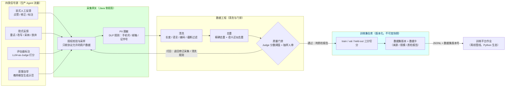
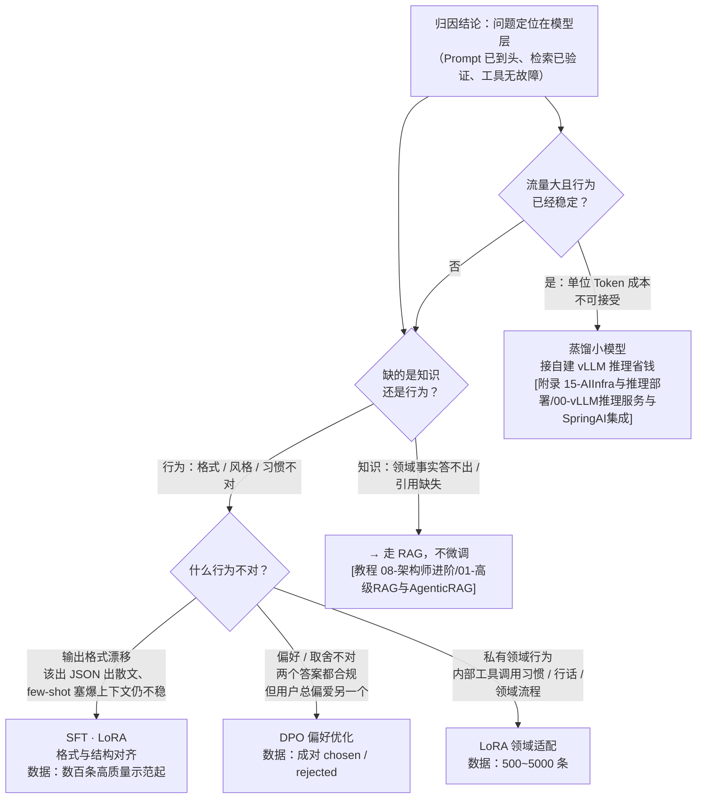
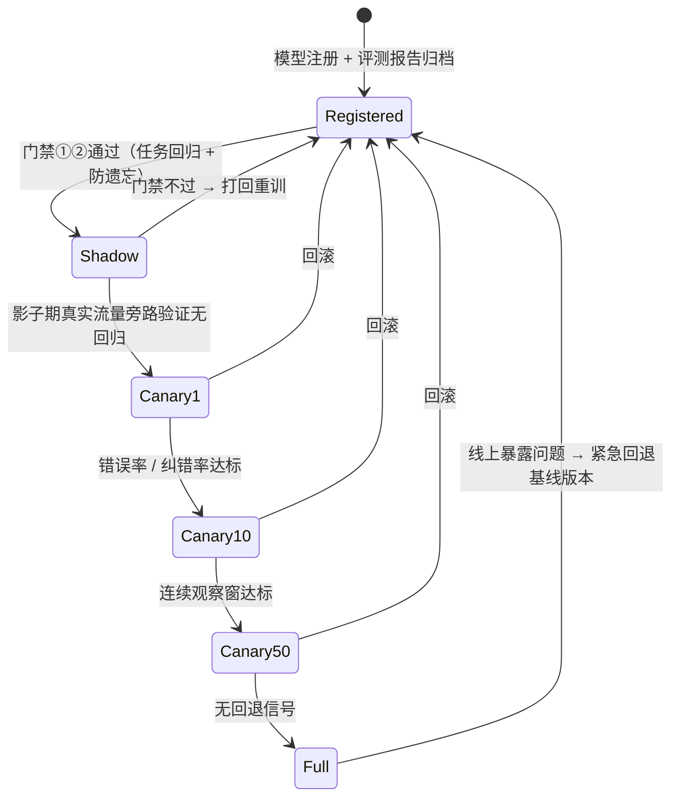

# 微调与数据回流决策

> **定位**：本文是对 [教程 08-架构师进阶/07-数据飞轮与持续改进 §6.2]「优化决策：微调 vs Prompt vs RAG」与 [教程 10-调优实战与方法论/05-架构调优] 的**训练侧下钻**——教程讲到"收集信号、决定优化路径"就收笔，本文补全决策之后的那一半：什么时候真的该微调、微调什么、拿什么数据微调、微调完怎么接回生产飞轮。读者画像：已运行生产 Agent、归因分析定位到"模型层问题"、正在评估是否自建训练管线的 Java 架构师。前置阅读：[教程 08-架构师进阶/07-数据飞轮与持续改进]（飞轮闭环与归因方法）、[教程 08-架构师进阶/03-自我反思与Agent评估]（评测集与回归方法）、[附录 15-AIInfra与推理部署/00-vLLM推理服务与SpringAI集成]（微调产物的落点：自建推理）。

---

## 1. 为什么飞轮停在"决策口"还不够

[教程 08-架构师进阶/07-数据飞轮与持续改进] 给出了完整的飞轮形状：交互日志 + 反馈信号 → 在线监控 → 离线回归 → 归因分析 → 优化决策 → 灰度发布。其中"优化决策"一步，教程给的是一张三选一对比表（微调 / Prompt / RAG 各自的成本、周期、效果），然后指向了 Prompt 调优（[教程 10-调优实战与方法论/02-Prompt调优工程]）与架构调优（[教程 10-调优实战与方法论/05-架构调优]）两条已经铺好的路。

问题在于第三条路——**微调**——在教程体系里只有一行结论，没有路。架构师走到这一步时会连续撞上四个没有答案的问题：

1. **判断题**：什么症状才说明"该微调了"？Prompt 还有没有压榨余地怎么判定？
2. **选题题**：微调是一个词，SFT、LoRA、QLoRA、蒸馏、DPO 是五种完全不同的工程投入，选哪个？
3. **数据题**：训练数据从哪来？生产流量里的反馈信号怎么变成合格的训练集？
4. **接回题**：训练是 Python 生态的离线管线，Java Agent 平台怎么和它缝合？新模型上线怎么不翻车？

本文按这四问组织。先立一条贯穿全文的铁律，再给路径对比与决策树，然后展开数据回流管线与 Java 接入面，最后是微调后验证与失败模式。

`★ Insight ─────────────────────────────────────`
- 归因先于微调：教程 08-07 的归因分析（Prompt 问题 / 检索问题 / 工具问题 / 模型能力问题）是本文决策树的总入口——归因没做完就开训，是微调项目失败的第一大原因。
- 微调解决的是"行为"，不是"知识"：这条铁律决定了数据回流管线采集什么、丢弃什么。
`─────────────────────────────────────────────────`

## 2. 三条优化路径：Prompt / RAG / 微调

### 2.1 铁律：微调不是知识注入

这是训练侧决策的第一性原理，直接决定三个工程选择：

| 问题类型 | 本质 | 正确路径 | 为什么不微调 |
|---------|------|---------|-------------|
| 模型答不出领域事实（产品参数、内部制度、最新政策） | **知识缺失** | RAG | 知识天天变，权重一训就冻结；微调注入的事实无法溯源、无法撤回、更新即重训 |
| 模型输出格式漂移（该出 JSON 时出散文、该调工具时不调） | **行为偏差** | 微调（SFT/LoRA） | 格式约束靠 Prompt 是"每次推理现场说服模型"，样本够多就能烧进权重，推理时零 Prompt 开销 |
| 模型语气 / 取舍 / 风格不合意（两个答案都对，但用户偏好另一个） | **偏好不对齐** | DPO 偏好优化 | 偏好没有"标准答案"可检索，只能从成对偏好数据里学 |
| 单位 Token 成本不可接受 | **容量问题** | 蒸馏 + 小模型部署 | 这不是能力问题，是把已稳定的能力搬进更便宜的容器 |

一句话版本：**知识 → RAG（可更新、可溯源、无训练成本）；行为 / 格式 / 风格 → 微调（把每次现场说服变成权重里的肌肉记忆）**。Prompt 工程则是两者共同的前置——任何一条路径启动前，Prompt 侧的余力必须先确认已榨干，因为它是唯一成本趋近于零、秒级可逆的杠杆。

### 2.2 四维对比：成本 - 效果 - 周期 - 可逆性

| 维度 | Prompt 工程 | RAG | 微调（LoRA 级） | 微调（全参 SFT） |
|------|-----------|-----|---------------|----------------|
| **成本** | 人力为主，趋近零 | 中：向量库 + 检索链路 + Embedding 计算常驻成本 | 高：GPU 时长 + 数据工程 + MLOps 全套 | 很高：多卡训练作业 + 调参专家 |
| **效果上限** | 受基座能力硬约束（基座不会的 Prompt 变不出来） | 解决知识缺失，不改变行为习惯 | 行为对齐效果显著，知识注入不可靠 | 上限最高但风险同级别 |
| **周期** | 分钟级 | 天级 | 周级（含数据准备） | 数周 |
| **可逆性** | 秒级回滚（改配置） | 高（换索引 / 知识源即可） | 中：模型版本回退 + 重新灰度 | 低：训练成本沉没 |
| **失效模式** | 长 Prompt 挤占上下文预算、指令互相冲突 | 检索质量差、知识库陈旧 | 灾难性遗忘、过拟合评测集（见 §6.3） | 同左且更猛 |

读这张表的架构师结论是：**微调不是三条路径里"更高级"的一条，而是最后一条**——它买的不是效果上限，是"行为稳定性 + 推理时零约束开销"这两样 Prompt 和 RAG 给不了的东西。如果你的问题用前两者能解决，微调就是负收益。

### 2.3 微调子技术适用场景

"微调"在工程上是五个不同决策：

| 子技术 | 一句话原理 | 适用场景 | 不适用 / 代价 |
|--------|-----------|---------|--------------|
| **SFT 全参** | 全部权重参与梯度更新 | 基座行为与需求差异巨大、有 >1 万条高质量数据、预算充足 | 贵、慢、灾难性遗忘风险最高；Agent 场景首选 LoRA 起步 |
| **LoRA** | 冻结基座，只训练低秩增量矩阵 | **默认选项**：私有领域行为适配、格式对齐、工具调用习惯，500~5000 条数据即可见效 | 任务与基座差异过大时容量不够，需升 rank 或转全参 |
| **QLoRA** | 基座 4-bit 量化 + LoRA | 显存受限（单卡 24~48G 也能训 7B~13B）、预算敏感的验证期 | 量化带来轻微精度损失；适合试点，生产大模型训练升 LoRA |
| **蒸馏** | 大模型（教师）生成示范数据 / 软标签，训练小模型（学生） | 行为已经稳定、流量大、成本压力高——把 70B 的能力烧进 7B，接自建推理（[附录 15-AIInfra与推理部署/00-vLLM推理服务与SpringAI集成]）省数量级的 Token 费 | 学生模型能力天花板受限于教师示范质量；复杂推理任务蒸馏损耗明显 |
| **DPO** | 直接偏好优化：从成对（chosen / rejected）回答学偏好，跳过奖励模型 | 有天然成对数据（用户在两个版本间的选择、标注员对比标注）、要做语气 / 风格 / 取舍对齐 | 只能"偏移相对基座的倾向"，教不会基座完全不会的能力；数据必须成对，采集成本高于 SFT |

（RLHF/PPO 一族效果上限最高，但需要训练奖励模型 + 在线采样，工程复杂度与算力成本都数倍于 DPO——Agent 业务场景 2026 年的主流实践是 DPO 替代。）

「评估方法（怎么知道微调起了作用）？→ [教程 08-架构师进阶/03-自我反思与Agent评估]」；「评测资产怎么建、怎么防过拟合？→ [附录 11-评估与可观测生态/02-评估数据集管理与版本化]」

## 3. 数据回流管线：从生产流量到训练集

决策树说"该微调"之后，立刻撞上数据题。数据回流管线的数据源头、清洗规则、质量门禁，决定了训练结果的上限——**垃圾进，垃圾出，而且是用 GPU 账单烧出来的垃圾**。

### 3.1 四类可采集信号

| 信号源 | 质量与成本特征 | 偏差 | 对应微调技术 |
|--------|--------------|------|-------------|
| **显式人工反馈**（点赞 / 点踩 / 修正 / 标注员标注） | 质量最高、量最小、标注有成本 | 幸存者偏差：只有极端满意 / 不满的用户才动手 | SFT 正样本 + DPO 偏好对（修正前 / 修正后天然成对） |
| **隐式反馈**（重试 / 改写 / 采纳 / 会话放弃） | 量大、免费、噪声大 | 需去偏：重试可能是用户表达差，不一定是模型差 | 负样本挖掘 + 候选筛选，须经评估器复核后才能入训练集 |
| **评估器标注**（LLM-as-Judge 离线批量打分） | 量大、标准一致、成本为 API 费 | Judge 自身的偏差会原样遗传给被训模型 | 大规模 SFT 数据质检 + 门禁打分（方法见 [附录 11-评估与可观测生态/01-LLM-as-Judge工程化]） |
| **蒸馏自举**（强模型对同一输入生成示范回答） | 量可控、质量取决于教师模型 | 教师的能力边界就是数据的天花板；注意商用 API 条款对"用输出训竞品模型"的限制 | 蒸馏小模型 / 领域 SFT 冷启动 |

### 3.2 管线全景



三个架构要点：

1. **采集网关是合规闸门，不是可选项**。用户对话数据用于训练，必须落在用户协议授权范围内（GDPR / 个人信息保护法约束，治理框架见 [教程 08-架构师进阶/09-Agent治理与合规框架]、留存与合规见 [教程 04-企业级架构主干/05-历史记录持久化与合规]）。PII 脱敏必须在数据离开生产域之前完成——训练数据一旦带着手机号进了训练集，它就被烧进权重，撤不回来。
2. **质量门禁必须双向**：不通过的样本不是静默丢弃，而是带原因打回采集侧——回流的失败原因本身是清洗规则的测试用例。门禁标准 = 机器线（Judge 分数阈值、长度、重复度）+ 人工线（按比例抽样人审，人工复核结果反过来校准 Judge）。
3. **切分与版本化接评估体系**：train / val / held-out 三分切分，held-out 集只用于最终验收、永不参与训练决策；每个数据集版本是不可变快照，配数据卡记录来源与质检报告——这样"模型 V3 是用数据集 v2026.08.12 训的"才是一个可复现、可审计的命题。工程规范全部在 [附录 11-评估与可观测生态/02-评估数据集管理与版本化]，本文不重复。

`★ Insight ─────────────────────────────────────`
- 数据集版本与模型版本的绑定关系，就是训练侧的"依赖锁定"——相当于 Maven 的 BOM 锁版本：没有它，评测报告无法复现，事故无法定位到"是数据坏了还是训练坏了"。
- DPO 的偏好对是这条管线上最贵的数据：它要求同一输入有两个版本的回答，生产上最便宜的来源是"修正前后"与"灰度 A/B 两侧"的自然成对，而不是专门标。
`─────────────────────────────────────────────────`

## 4. 微调决策树：症状 → 路径

把 §2 的路径对比压成一张可执行的决策图。入口不是"我想微调"，而是**归因分析的结论**——[教程 08-架构师进阶/07-数据飞轮与持续改进] 的归因步骤已经排除了 Prompt / 检索 / 工具层，问题确实落在模型层，才有资格进这棵树。



配套的症状速查表（含"先别微调"的否决项）：

| 症状 | 先检查（否决项） | 结论 |
|------|----------------|------|
| 领域事实答错、知识陈旧 | 知识库有没有？检索 top-k 命中没有？ | 命中但没答上 = 模型层；没命中 = RAG 问题，**不微调** |
| JSON / Schema 输出偶发漂移 | 输出约束用尽了吗（结构化输出 `entity(Class, Consumer<EntityParamSpec>)` + `useProviderStructuredOutput()`、few-shot 示例）？ | 全用了仍漂移，且漂移率 > 业务容忍线 → SFT（LoRA） |
| 答案正确但总被用户改写 | 改写样本攒够成对数据了吗？ | 攒 500+ 成对 → DPO |
| 工具该调不调、参数乱填 | 工具 Schema 描述清晰吗（[教程 10-调优实战与方法论/03-工具调优上：接口设计学]）？ | Schema 已优化仍乱 → LoRA 烧工具调用习惯 |
| Token 账单失控 | 行为在现模型上稳定吗（回归集通过率达标）？ | 稳定 + 流量大 → 蒸馏小模型；不稳定 → 先解决稳定性再谈蒸馏 |

数据量门槛（经验值，LoRA / 7B~32B 基座口径）：**< 300 条先别训**——样本太少时 LoRA 学到的更可能是噪声，用这几百条做 Prompt few-shot 的收益更高；300~1000 条可做格式对齐级 SFT；1000~5000 条是领域行为适配的舒适区；> 1 万条且预算充足才考虑全参。

## 5. Java 工程师的接入面

先建立一个认知边界：**训练是离线管线，活在 Python 生态里**（torch / peft / trl / LLaMA-Factory / DeepSpeed），本文不写训练侧 SDK 代码——那不是 Java 架构师的战场，也不是这个文档体系的技术栈。Java 侧（Spring Boot 4.1 + Spring AI 2.0 + WebFlux）的职责是把 Agent 平台与训练管线**缝合**成闭环，具体是四件事：

| 职责 | Java 侧做什么 | 对接的外部系统 |
|------|-------------|--------------|
| ① 数据导出管道 | 从生产存储读反馈数据 → 清洗 / 脱敏 / 去重 / 门禁 → 写出 JSONL 数据集 + 注册版本 | 反馈表（R2DBC）、对象存储、训练集仓库 |
| ② 训练作业触发 | 提交训练作业（数据集版本 + 配方 + 基座）、轮询状态 | 训练平台的 HTTP API（内层是 K8s Job / Kubeflow） |
| ③ 模型注册与版本管理 | 收训练产物 → 挂评测报告与模型卡 → 注册新模型版本，绑定数据集版本 | 模型注册中心（MLflow / 自建元数据服务） |
| ④ 灰度接入推理 | 把候选模型部署为 OpenAI 兼容端点，经模型路由按版本切流量 | vLLM（[附录 15-AIInfra与推理部署/00-vLLM推理服务与SpringAI集成]）、路由层（[教程 04-企业级架构主干/12-模型路由与降级]） |

### 5.1 数据导出管道（职责①）

纯 Java + Reactor 的变换管道，核心是门禁规则的可测试性：

```java
// Spring Boot 4.1 / Spring AI 2.0.0 / WebFlux / Java 21
package com.example.agent.flywheel.export;

import reactor.core.publisher.Flux;
import reactor.core.publisher.Mono;

import java.nio.file.Files;
import java.nio.file.Path;
import java.time.Instant;
import java.util.List;
import java.util.stream.Collectors;

/**
 * 数据飞轮训练侧接入面：生产反馈 → 训练 JSONL。
 * 输入 Flux<FeedbackEvent> 来自反馈表导出（R2DBC DatabaseClient，需引入
 * spring-boot-starter-data-r2dbc 依赖后 javap 实证）或 Kafka 消费。
 */
public class TrainingSampleExporter {

    /** 门禁机器线：LLM-as-Judge 离线打分的最低分（无 Judge 分的信号置 -1 跳过此线） */
    private static final double MIN_JUDGE_SCORE = 4.0;
    /** 门禁机器线：回答最小长度——太短的样本学不到稳定行为 */
    private static final int MIN_CONTENT_LENGTH = 20;

    public record FeedbackEvent(
            String conversationId,
            String userText,
            String assistantText,
            String signalType,       // THUMBS_UP / CORRECTED / JUDGE_SCORED / DISTILL
            double judgeScore,       // 无 Judge 分时为 -1
            Instant occurredAt) {}

    public record TrainingMessage(String role, String content) {}

    public record TrainingSample(List<TrainingMessage> messages) {}

    /** 清洗 → 脱敏 → 门禁 → 去重 → 构造训练样本（chat 格式） */
    public Flux<TrainingSample> toTrainingSamples(Flux<FeedbackEvent> events) {
        return events
                .filter(e -> e.assistantText() != null
                        && e.assistantText().length() >= MIN_CONTENT_LENGTH)
                .filter(e -> e.judgeScore() < 0 || e.judgeScore() >= MIN_JUDGE_SCORE)
                .map(this::redactPii)
                .map(e -> new TrainingSample(List.of(
                        new TrainingMessage("user", e.userText()),
                        new TrainingMessage("assistant", e.assistantText()))))
                .distinct();   // record equals 按字段精确去重；语义近似去重见正文说明
    }

    /** 聚合写出 JSONL（训练侧通用 chat 格式），返回落盘路径 */
    public Mono<Path> writeJsonl(Flux<FeedbackEvent> events, Path target) {
        return toTrainingSamples(events)
                .map(this::toJsonl)
                .collect(Collectors.joining("\n", "", "\n"))
                .flatMap(json -> Mono.fromCallable(() -> Files.writeString(target, json)));
    }

    /** 生产实现接入 DLP 规则引擎；此处以手机号正则示意脱敏必须在出生产域前完成 */
    private FeedbackEvent redactPii(FeedbackEvent e) {
        String user = e.userText() == null ? "" : e.userText().replaceAll("\\d{11}", "[PHONE]");
        String assistant = e.assistantText().replaceAll("\\d{11}", "[PHONE]");
        return new FeedbackEvent(e.conversationId(), user, assistant,
                e.signalType(), e.judgeScore(), e.occurredAt());
    }

    /** {"messages":[{"role":"user","content":"..."},{"role":"assistant","content":"..."}]} */
    private String toJsonl(TrainingSample s) {
        String messages = s.messages().stream()
                .map(m -> "{\"role\":\"" + m.role() + "\",\"content\":"
                        + quote(m.content()) + "}")
                .collect(Collectors.joining(","));
        return "{\"messages\":[" + messages + "]}";
    }

    private String quote(String content) {
        return "\"" + content.replace("\\", "\\\\").replace("\"", "\\\"")
                .replace("\n", "\\n") + "\"";
    }
}
```

两个工程注解：

- **精确去重用 `distinct()`**（record 字段级 equals）；**语义近似去重**（同一问题换个问法算不算重复）用 Spring AI 的 `EmbeddingModel.embed(List<String>)`（// Spring AI 2.0.0，`org.springframework.ai.embedding`）算向量后按余弦相似度阈值（如 0.95）聚簇保留一条——它防的是"重复样本让模型过拟合到固定话术"。
- **门禁规则全部是纯函数**，可以脱离数据库与 LLM 做单元测试——这是把质量门禁做成代码而不是"人工看一眼"的关键。

### 5.2 训练作业触发与状态跟踪（职责②③）

训练平台对外暴露 HTTP API，Java 侧用 WebClient 编排（// Spring WebFlux，`post()` / `bodyValue()` 已 javap 实证）：

```java
// Spring Boot 4.1 / WebFlux / Java 21
package com.example.agent.flywheel.training;

import org.springframework.beans.factory.annotation.Value;
import org.springframework.http.MediaType;
import org.springframework.stereotype.Component;
import org.springframework.web.reactive.function.client.WebClient;
import reactor.core.publisher.Mono;

import java.util.Map;

/** 训练作业客户端：Java 只做编排（提交 / 轮询 / 登记产物），训练本体在 Python 离线管线 */
@Component
public class TrainingJobClient {

    private final WebClient webClient;

    public TrainingJobClient(WebClient.Builder builder,
            @Value("${agent.training.platform.base-url}") String baseUrl) {
        this.webClient = builder.baseUrl(baseUrl).build();
    }

    /** 提交训练：recipe 是训练侧概念（sft-lora / dpo / distill），Java 不解释其内部 */
    public Mono<TrainingJob> submit(String datasetVersion, String recipe, String baseModel) {
        Map<String, String> request = Map.of(
                "dataset", datasetVersion,     // 必须是训练集仓库的不可变版本号
                "recipe", recipe,
                "base_model", baseModel);
        return this.webClient.post()
                .uri("/api/v1/training-jobs")
                .contentType(MediaType.APPLICATION_JSON)
                .bodyValue(request)
                .retrieve()
                .bodyToMono(TrainingJob.class);
    }

    public Mono<TrainingJob> status(String jobId) {
        return this.webClient.get()
                .uri("/api/v1/training-jobs/{id}", jobId)
                .retrieve()
                .bodyToMono(TrainingJob.class);
    }

    /** 训练产物登记：模型 ID 与评测报告 URL 绑定，进模型注册中心后才有资格进灰度 */
    public record TrainingJob(String jobId, String status,
                              String outputModelId, String evalReportUrl) {}
}
```

**版本绑定是这个类的隐藏职责**：提交训练时传的是数据集**版本号**而非临时文件，训练完 `TrainingJob` 里带出 `outputModelId` 与评测报告——"模型 ↔ 数据集 ↔ 评测报告"三元组在注册中心对齐，任何一次线上事故都能反查到训练数据快照（呼应 [教程 04-企业级架构主干/09-灰度发布与版本管理] 的版本管理主线）。

### 5.3 灰度接入推理（职责④）

微调产物（如 LoRA 合并后的模型权重）部署为 vLLM 的 OpenAI 兼容端点后，对 Spring AI 应用层**零改动**——模型路由把"基线商用 API"与"微调自建端点"抽象为同一种端点，切流即改路由权重（拓扑与配置见 [附录 15-AIInfra与推理部署/00-vLLM推理服务与SpringAI集成 §3]，路由与降级见 [教程 04-企业级架构主干/12-模型路由与降级]）。这正是 §2.2 表里"微调可逆性 = 中"的落点：**可逆性不来自训练本身，来自你已有的路由与灰度基础设施**。

`★ Insight ─────────────────────────────────────`
- Java 侧四职责没有一个在"训"模型——架构师的价值在于把训练管线当成一个**有 API 的黑盒外部系统**来集成，就像对待支付网关：定义清楚提交、状态、产物的契约，而不是重写它的内部。
- 数据导出管道用 Reactor 表达天然贴切：`Flux` 的 filter/map/distinct 正是"门禁即管道"的代码形状，且背压由框架接管——百万级反馈记录导出不会撑爆内存。
`─────────────────────────────────────────────────`

## 6. 微调后验证：放行之前的三道门

训练跑完 ≠ 可以上线。微调后验证是三道串联的门，任何一道不过都打回训练侧：

### 6.1 三道门

1. **任务回归门禁**：在目标任务 held-out 评测集（训练时从未见过的切片）上，候选模型通过率 ≥ 业务阈值（如 92%），且不低于基线模型——证明"该解决的问题解决了"。
2. **通用能力防遗忘门禁**：在通用能力回归集（指令遵循 / 常识推理 / 安全拒答，与训练数据零重叠）上，候选相对基线的跌幅 ≤ 允许线（如 2 个百分点）——证明"没把基座原本会的训丢"。
3. **线上灰度门禁**：影子流量 → 小流量 → 逐级放量，每级观察线上指标（错误率、人工纠错率、成本），异常即回滚。

### 6.2 灰度放量状态机



每一步"打回 / 回滚"都回到 `Registered` 而不是删除——模型版本与它的评测报告、数据集版本一起留在注册中心，成为下一次归因的证据链。灰度方法与放量节奏的通用规范在 [教程 04-企业级架构主干/09-灰度发布与版本管理]，线上观测指标（Token 用量、错误 Span、满意度）接入 [教程 04-企业级架构主干/02-全链路可观测性] 与教程 05-Observation 系列。

### 6.3 门禁的 Java 实现

门禁①②可以落成一段评测作业代码，用 Spring AI 官方 `Evaluator` 体系（// Spring AI 2.0.0，`RelevancyEvaluator(ChatClient.Builder)` 构造、`EvaluationRequest(String, List<Document>, String)` 三参构造均经 javap 实证）：

```java
// Spring Boot 4.1 / Spring AI 2.0.0 / WebFlux / Java 21
package com.example.agent.flywheel.gate;

import org.springframework.ai.chat.client.ChatClient;
import org.springframework.ai.chat.evaluation.RelevancyEvaluator;
import org.springframework.ai.document.Document;
import org.springframework.ai.evaluation.EvaluationRequest;
import org.springframework.ai.evaluation.EvaluationResponse;
import org.springframework.stereotype.Component;
import reactor.core.publisher.Flux;
import reactor.core.publisher.Mono;

import java.util.List;
import java.util.stream.Collectors;

/** 微调放行门禁：任务回归 + 通用能力防遗忘，两道都过才允许进影子流量 */
@Component
public class FineTunedModelGate {

    /** 门禁①：任务 held-out 集最低通过率 */
    private static final double MIN_TASK_PASS_RATE = 0.92;
    /** 门禁②：通用能力相对基线允许的最大回退（2 个百分点） */
    private static final double MAX_FORGETTING_DROP = 0.02;
    /** 评测对候选端点的并发上限：评测流量不能打爆待测服务 */
    private static final int EVAL_CONCURRENCY = 4;

    /** 由配置指向候选微调模型的 OpenAI 兼容端点（仅 base-url / model 与基线不同） */
    private final ChatClient candidateClient;
    /** LLM-as-Judge：官方 Evaluator，构造基于 ChatClient.Builder */
    private final RelevancyEvaluator judge;

    public FineTunedModelGate(ChatClient.Builder builder) {
        this.candidateClient = builder.build();
        this.judge = new RelevancyEvaluator(builder);
    }

    public record RegressionCase(String userText, String referenceAnswer) {}

    public record GateReport(double taskPassRate, double generalPassRate,
                             boolean approved, String verdict) {}

    public Mono<GateReport> check(List<RegressionCase> taskSet,
                                  List<RegressionCase> generalSet,
                                  double baselineGeneralRate) {
        Mono<Double> task = passRate(taskSet);
        Mono<Double> general = passRate(generalSet);
        return Mono.zip(task, general).map(tuple -> {
            double taskRate = tuple.getT1();
            double generalRate = tuple.getT2();
            boolean taskOk = taskRate >= MIN_TASK_PASS_RATE;
            boolean noForget = baselineGeneralRate - generalRate <= MAX_FORGETTING_DROP;
            String verdict = taskOk && noForget
                    ? "双门禁通过，允许进入影子流量"
                    : (taskOk ? "检测到通用能力遗忘，打回重训（混入通用回放数据 / 降学习率）"
                              : "任务回归不达标，禁止放量");
            return new GateReport(taskRate, generalRate, taskOk && noForget, verdict);
        });
    }

    /** 候选模型作答 + Judge 对照参考答案评分，返回通过率 */
    private Mono<Double> passRate(List<RegressionCase> cases) {
        return Flux.fromIterable(cases)
                .flatMap(c -> Mono.fromCallable(() -> evaluate(c)), EVAL_CONCURRENCY)
                .collect(Collectors.averagingInt(r -> r.isPass() ? 1 : 0));
    }

    private EvaluationResponse evaluate(RegressionCase c) {
        String answer = this.candidateClient.prompt()
                .user(c.userText())
                .call()
                .content();
        // 参考答案作为 supporting data 传给 Judge（Document(String) 构造，javap 实证）
        return this.judge.evaluate(new EvaluationRequest(
                c.userText(),
                List.of(new Document(c.referenceAnswer())),
                answer));
    }
}
```

**通用能力回归集从哪来**：不能从训练数据里切——它必须与训练分布零重叠，可以是公开基准的领域无关子集（指令遵循 / 推理 / 安全拒答）加自建的通用对话金标集。它的版本化管理与防污染策略同样遵循 [附录 11-评估与可观测生态/02-评估数据集管理与版本化]。

### 6.4 失败模式清单

| 失败模式 | 症状 | 根因 | 对策 |
|---------|------|------|------|
| **灾难性遗忘** | 目标任务涨了，通用能力（指令遵循 / 常识 / 拒答）断崖下跌 | 窄分布数据全参 / 高学习率训练覆盖了基座的通用权重 | 混入通用数据回放（replay）、降学习率、LoRA 替代全参、收缩训练轮数 |
| **过拟合评测集** | 离线评测分数暴涨，线上指标纹丝不动甚至变差 | val / held-out 泄漏进训练集；或评测集长期不换被间接记忆 | 严格三分切分 + 不可变快照 + 评测集定期换血（防污染细节见 [附录 11-评估与可观测生态/02-评估数据集管理与版本化]） |
| **数据污染** | 训练数据里混入 PII / 抄袭内容 / 与线上分布严重漂移的旧数据 | 采集网关缺位、清洗规则缺失、数据集跨年拼接 | 脱敏前移到采集网关（§3.2）；数据卡记录分布画像；拼版本前跑分布漂移检测 |
| **格式过拟合** | 格式 100% 稳了，但内容泛化变差（只会背模板句式） | 格式示范数据同质化，模型把"格式"和"句式"一起学了 | 示范数据多样化（同一格式配不同内容与长度）；格式与内容分开评测 |
| **DPO 奖惩偏移** | 回答变长 / 变谄媚，评分没升 | 偏好对里 chosen 系统性偏长，模型学到"长 = 好" | 成对数据做长度去偏（chosen / rejected 长度配平）；加长度惩罚的变体（如 IPO 类目标） |
| **成本倒挂** | 微调 + 自建的总成本高于直接调商用 API | 流量不大 / 行为还没稳定就急着蒸馏小模型 | 蒸馏前置条件 = 行为稳定 + 流量大（§4 决策树 Q3）；先租 GPU 后买（[附录 15-AIInfra与推理部署/01-GPU调度与K8s部署]） |

## 适用场景

- 生产 Agent 已有归因分析体系（教程 08-07 的飞轮已跑到"归因"一步），且确认问题落在模型层——需要决策是否投入训练侧。
- 平台需要把生产反馈流量转化为训练资产，要设计数据回流管线的合规闸门、清洗规则与质量门禁。
- 微调产物需要接回生产：设计 Java 平台与 Python 训练管线之间的集成契约（数据导出 / 作业触发 / 版本绑定 / 灰度接入）。
- 微调完成后需要设计放行门禁（任务回归 + 防遗忘 + 灰度）与失败模式的排查路径。

## 不适用场景

- 归因尚未完成、还不知道问题是 Prompt / 检索 / 工具哪一层——先回 [教程 08-架构师进阶/07-数据飞轮与持续改进 §5] 做归因，微调是最后选项。
- 缺的是领域知识（文档、事实、制度）——走 RAG，微调不注入知识（§2.1 铁律）。
- 训练数据 < 300 条——样本量不足以支撑 LoRA，先用 few-shot 与 Prompt 结构化约束。
- 想要本文给出训练超参、损失函数调优等训练侧实操——那是 Python 训练生态（PEFT / TRL / LLaMA-Factory）的领域，本文只负责"决策与接入面"。

## 总结

微调决策的四问收拢成四句话：

1. **该不该**：归因定位到模型层 + Prompt 已到头，才进决策树；知识缺失一律回 RAG——微调买的是行为稳定性，不是知识。
2. **选什么**：格式漂移 → SFT/LoRA；偏好取舍 → DPO；领域行为 → LoRA；成本倒逼 → 蒸馏。LoRA 是默认起点，全参是例外。
3. **拿什么训**：四类信号（人工 / 隐式 / Judge / 蒸馏自举）经合规闸门、脱敏、清洗、去重、质量门禁，落到版本化的不可变数据集快照——数据集版本与模型版本绑定，评测才可复现。
4. **怎么接回**：Java 侧不训模型，做四件事——数据导出管道、作业触发、模型注册与版本绑定、经路由灰度接入；放行前过三道门（任务回归、防遗忘、灰度放量），任何一道不过都带着证据链打回重训。

训练侧补全后，[教程 08-架构师进阶/07-数据飞轮与持续改进] 的飞轮才真正闭合：采集 → 归因 → 决策 → **（Prompt / RAG / 微调）三条执行路径** → 灰度 → 再采集。微调产物的推理落点（怎么部署、容量怎么算）见 [附录 15-AIInfra与推理部署/00-vLLM推理服务与SpringAI集成] 与 [附录 15-AIInfra与推理部署/02-vLLM调优与GPU容量规划]。

**外部来源**：[LoRA: Low-Rank Adaptation of Large Language Models (Hu et al., 2021)](https://arxiv.org/abs/2106.09685) · [QLoRA: Efficient Finetuning of Quantized LLMs (Dettmers et al., 2023)](https://arxiv.org/abs/2305.14314) · [Direct Preference Optimization (Rafailov et al., 2023)](https://arxiv.org/abs/2305.18290) · [Distilling the Knowledge in a Neural Network (Hinton et al., 2015)](https://arxiv.org/abs/1503.02531) · [Hugging Face PEFT 文档](https://huggingface.co/docs/peft) · [Hugging Face TRL 文档](https://huggingface.co/docs/trl)
