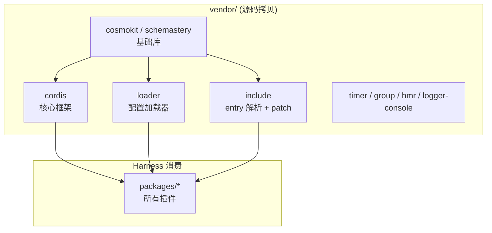
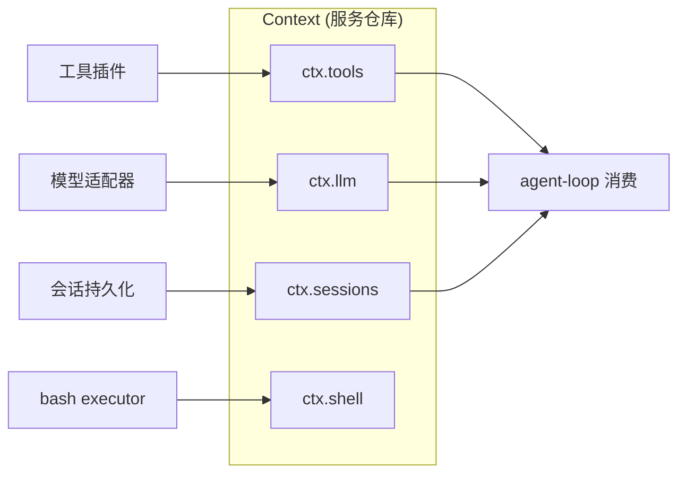
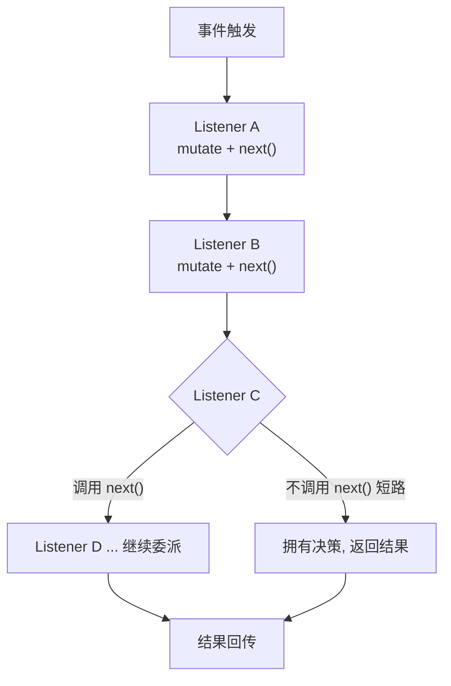
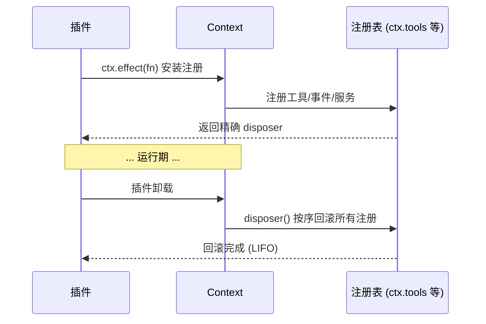
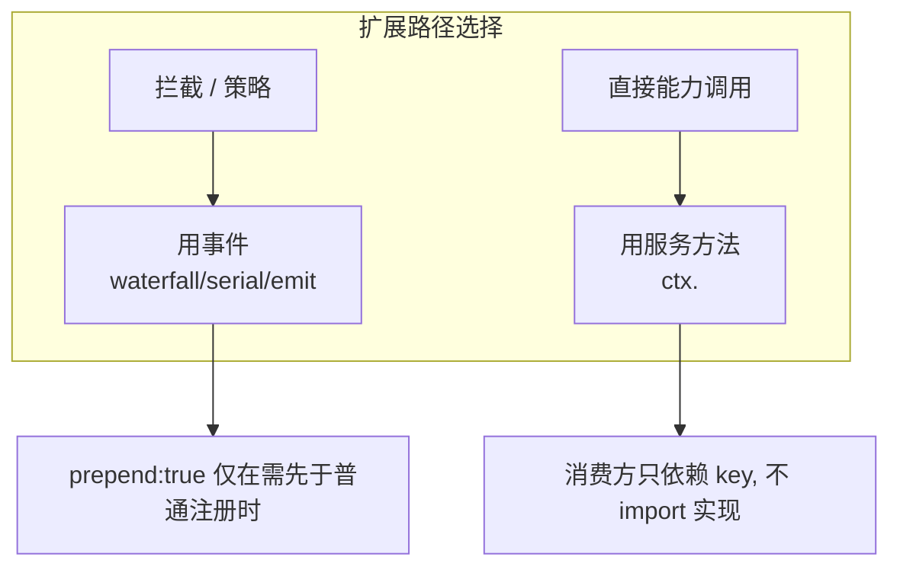

> **定位**：本文深入 DeepSeek Harness 的地基——vendored 的 Cordis 插件框架。读完你将理解「ctx 服务仓库、类型化事件、可逆效果、inject 依赖注入」这套插件范式，以及框架如何被以源码拷贝进仓库并完全拥有。这是理解其余所有分册的前提。前置阅读：[00-总览与架构解析]（设计哲学）、官方 `docs/cordis-primer.md`。
> **代码位置**：`vendor/cordis/`、`vendor/` 下其余依赖、`docs/cordis-primer.md`。

## 一、Cordis 是什么：插件范式在设计上回答什么问题

**设计问题**：插件化框架的头号难题是**「扩展点如何不变成补丁」**——常见失败是「核心 + 扩展」边界博弈（要的功能进不了核心，或核心被打补丁打烂）。Cordis 用「服务仓库 + 类型化事件 + 可逆效果」三机制回答：**让插件之间零静态依赖，一切扩展都是可逆效果**。

Cordis 是 DeepSeek Harness 底下 vendored 的插件框架，其设计哲学来自论文 *[A Programming Paradigm for Spatiotemporal Composability](https://github.com/cordiverse/paper)*（面向时空可组合性的编程范式）。官方 primer 一句话定位：

> **插件贡献服务、类型化事件与可逆副作用到一个共享 Context；产品的每一部分都是插件，包括模型适配器、工具注册表、会话日志与 Agent 主循环本身。**

### 本领域的设计哲学（Why）

1. **服务 key 解耦代替类引用**——插件通过 `ctx.<key>` 找服务，而不是 import 具体实现。**为什么**：插件之间零静态依赖，换实现不需要改引用方。**代价**：类型信息藏在 key 背后，靠声明合并补回。
2. **类型化事件 + 四分发模式作为扩展原语**——`emit`（观察）/`waterfall`（around 中间件）/`parallel`（扇出）/`serial`（顺序）。**为什么**：四种形态覆盖扩展的全部需求，被类型系统统一建模。**代价**：要理解四种模式的契约差异。
3. **可逆效果（reversible effects）**——每个注册都有 disposer，卸载按序回滚。**为什么**：热装/灰度/回滚成为内置能力，而非工程技巧。**代价**：每个注册都要返回 disposer 的纪律。
4. **`inject` 声明依赖，加载顺序由服务需求表达**——而非手工 boot 排序。**为什么**：依赖图自己决定加载顺序，新增插件不需要改 boot 顺序。**代价**：循环依赖需要运行时检测。

为什么 DeepSeek 团队选择 **vendoring（以源码拷贝）** 而非 npm 依赖？`vendor/README.md:3-5`：使 harness *fully owns its framework layer (auditable, patchable, pinned)*——完全拥有框架层（可审计、可打补丁、版本钉死）。代价是维护上游 diff 的成本，而仓库用 **18 条本地修改日志 + check-vendor-manifest.sh 门禁**把这份成本制度化（详见 [10-工程化体系与研发效能]）。



## 二、Cordis 五大理念

官方 `docs/cordis-primer.md` 用五个想法概括 Cordis：

### 1. 插件是一个实现 Service 的对象

一个插件可以是带可选 `inject` 和 `apply(ctx)` 字段的函数，也可以是 Cordis 把生命周期挂进当前 context 的 `Service` 子类。

```ts
// 函数式插件
export const name = 'my-plugin'
export const inject = ['tools']
export function apply(ctx: Context) {
  ctx.tools.register({
    name: 'current_time',
    description: '返回当前时间',
    execute: () => new Date().toISOString(),
  })   // 注册是 effect,可逆(unregister 可撤销)
}
```

### 2. Context 是服务仓库

一个服务在 ctx 上认领一个稳定的 `ctx.<key>`（如 `ctx.tools`、`ctx.llm`、`ctx.sessions`）；其它插件通过 key 找服务，而不是 import 具体实现。



### 3. 用 `inject` 声明服务依赖

一个插件命名它需要的服务，等到这些服务存在才加载——**加载顺序通过服务需求表达，而非手工 boot 排序**。

```ts
export const inject = ['agents', 'sessions', 'llm', 'tools', 'systemPrompt']
export class AgentLoop extends Service implements AgentFactory {
  // 最小可编译骨架:核心能力是"产出一个新 Agent 并运行"
  async create(ctx: Context, spec: AgentSpec): Promise<Agent> {
    const agent = new Agent(ctx, spec.scope)
    await agent.synthesize(spec.systemPrompt)   // 用系统提示合成 Agent
    return agent
  }
}
```

### 4. 类型化事件用于通信

服务通过 TS 声明合并声明事件名，然后按 `emit`/`waterfall`/`parallel`/`serial` 四种模式分发。

### 5. 注册是可逆效果

Prompt 片段、工具 schema、适配器、provider、监听器都通过 `ctx.effect()` 或 `ctx.on()` 安装，**插件卸载时按序回滚**。

## 三、四种分发模式

每个事件可以有如下一种分发模式，且只能用对应的方法分发（`cordis-primer.md`）：

| 模式 | 是否 await | 分发顺序 | 有返回值 | 语义 |
|---|---|---|---|---|
| `emit` | 否 | 按注册顺序观察 | 无 | 观察/通知 |
| `waterfall` | 否 | 按注册顺序观察（`next()` 委派） | 有 | around-中间件 |
| `parallel` | 是 | 全部并行 | 无 | 扇出 |
| `serial` | 是 | 按注册顺序 | 有 | 顺序处理 |

**dispatch 模式是事件公共契约的一部分**。Harness 新事件用 `@mode` tag 记录，生成目录校验声明与分发点一致。

## 四、Waterfall 语义（最重要的扩展机制）

`ctx.waterfall` 是 **around-中间件**。监听器收到 `(...args, next)`：

- 调用 `next()` 把「可能被包装的结果」委派给下一个服务；
- 不调用 `next()` 则**短路**。



关键语义：

- **协作式监听器**通常 mutate 一个共享的 request/decision 对象然后委派；也可以完全替换结果——downstream 只看到替换后的结果；
- **单个决策事件**：短路是设计。策略监听器短路（拥有决策权），观察/注解监听器必须委派；
- 用 `prepend: true` 只在需要先于普通注册运行时用。

> **与 Java 对照**：waterfall ≈ Spring AOP 的责任链 + WebFlux 的 `WebFilter` 链——但「不调 `next()` 即短路」把策略决策权显式化，比抛异常中断更可控。

## 五、可逆效果与生命周期

**每个注册都应该有 disposer**——要么从 `ctx.effect()` 返回一个，要么用 Cordis helper 自动完成。如果 teardown 顺序重要，把相关工作放在**同一个 effect** 里，让 disposal 按预期顺序回滚。



> **架构师视角**：这解决了 Java 生态里「Bean 卸载时无法回滚全部注册」的痛点。可逆效果让**热装插件、灰度替换**成为内置能力，而非工程技巧。对应 [教程 29-灰度发布与版本管理]。

## 六、Loader 配置：`!!js` 表达式

`@deepseek-ai/cordis-plugin-include` 解析 `!!js` 为表达式节点。`cordis-primer.md` 的 Loader 配置语义：

- Loader 插值一个 entry 的 **`config`**（在声明的 injections 激活后、对插件上下文求值）与 **`disabled`** 字段（在每次挂载决策时、对 loader 上下文求值）；
- Include 保留嵌套行表达式直到目标激活；
- 其它 entry 元数据保持字面量；
- 用 overlays 让环境选择插件。

> 这解释了 profile/bundle 组合的底层机制：`cordis.yml` 里的行经过 Loader 解析、`!!js` 动态求值、patch 层叠覆盖，最终成为挂载的插件树（见 [00-总览与架构解析] 的「profile/bundle/patch」一节）。

## 七、Cordis 在 Harness 中的实践规则

官方 primer 的「Practical Rules」：

1. **把行为封装进插件**：工具管线事件归 `ctx.tools`，模型流归 `ctx.llm`，实时 agent 协调归 `ctx.agents`；
2. **事件用于拦截与策略，服务方法用于直接能力调用**——这是两条互补的扩展路径；
3. **每个注册都要有 disposer**；teardown 顺序重要时放同一个 effect；
4. **scope 是 per-agent 注册的单位**（详见 [02-核心引擎与Agent生命周期] 的 scope 一节）——scoped 注册与全局注册通过同一套 effect 语义管理。



## 八、vendored 的组成

`vendor/` 下 9 个源拷贝（详见 [10-工程化] 第六节）：`cordis`、`loader`、`include`、`group`、`timer`、`hmr`、`logger-console`、`cosmokit`、`schemastery`。全部重命名到 `@deepseek-ai` scope（rescope 防 registry squat），保留目录名与版本号使 manifest 仍可读作上游快照，并记录了 18 条本地修改 divergence。

## 九、设计决策（Why / 代价 / 选择依据）

**D1. 服务 key 解耦代替类引用**
- **Why**：插件通过 `ctx.<key>` 找服务而非 import 实现——插件间零静态依赖，换实现不改引用方。
- **代价**：类型信息藏在 key 背后，靠 `declare module` 声明合并补回。
- **选择依据**：这是「无特权核心」的机制前提——没有它，插件必然 import 核心类，边界立刻腐化。

**D2. waterfall 的「不调 next() 即短路」**
- **Why**：策略监听器短路（拥有决策权），观察/注解监听器必须委派——把「决策权」与「观察权」在语义上区分开。
- **代价**：监听器必须理解自己属于哪一类，否则会意外短路。
- **选择依据**：比「抛异常中断」更可控的决策模型；比「回调返回布尔」更灵活的中间件模型。

**D3. 可逆效果 + 精确 disposer 身份**
- **Why**：每个注册从 `ctx.effect()` 返回精确 disposer，卸载按序回滚——热装/灰度/回滚成为内置能力。
- **代价**：每个注册都要有 disposer 的纪律；teardown 顺序重要时要把相关工作放同一 effect。
- **选择依据**：Java Bean 生命周期做不到「卸载即回滚全部注册」；可逆效果是插件化可治理性的地基。

**D4. vendoring 完全拥有框架层**
- **Why**：可审计、可打补丁、版本钉死；rescope 重命名防 registry squat。
- **代价**：维护 18 条本地 diff，需 check-vendor-manifest 制度化。
- **选择依据**：框架层是全产品根基——「完全拥有」比「依赖漂移」更可控，但只对「框架层是核心资产」的项目成立。

## 十、转译到 Spring AI / Java 生态

| Cordis | Java/Spring AI 对应物 | 启示 |
|---|---|---|
| `ctx.<key>` 服务仓库 | Spring 容器 + Bean 名 | 用「服务 key」而非类名查找，插件间零静态依赖 |
| `inject` 服务依赖声明 | 构造器注入 | 加载顺序用服务需求表达，而非手工 boot 排序 |
| `emit`/`waterfall`/`parallel`/`serial` 四分发 | ApplicationEvent / AOP 责任链 / 并行流 / 顺序 | 四种分发模式被类型系统统一建模 |
| `ctx.effect()` 可逆注册 | `@PreDestroy` | 「卸载即回滚全部注册」是热装/灰度的地基 |
| `!!js` Loader 配置 | SpEL / YAML 配置 | 声明式配置 + 表达式动态求值 |
| vendoring 完全拥有框架层 | shade 插件 / 内嵌依赖 | 「可审计、可打补丁、版本钉死」的框架层所有权权衡 |

> **适用场景**：要设计插件化 Agent 框架的扩展机制；要理解「服务仓库 + 事件 + 可逆效果」三角色如何解耦。
> **不适用场景**：单体应用、无需插件化的场景（成本高于收益）。

## 十一、总结

Cordis 用五个理念（插件、服务仓库、inject、类型化事件、可逆效果）构建了「一切皆插件」的地基。四种分发模式（emit/waterfall/parallel/serial）覆盖了观察、中间件、扇出、顺序四种扩展形态；waterfall 的「不调 `next()` 即短路」把策略决策权显式化；可逆效果让卸载可预测、热装可灰度；Loader 的 `!!js` 表达式让配置可动态求值。这套地基支撑了 [02] 起的全部子系统——理解它，就理解了为什么 DeepSeek Harness 敢说「没有需要打补丁的特权核心」。

> **定位回顾**：本文是系列的「范式」篇，也是阅读其余所有分册的钥匙。
