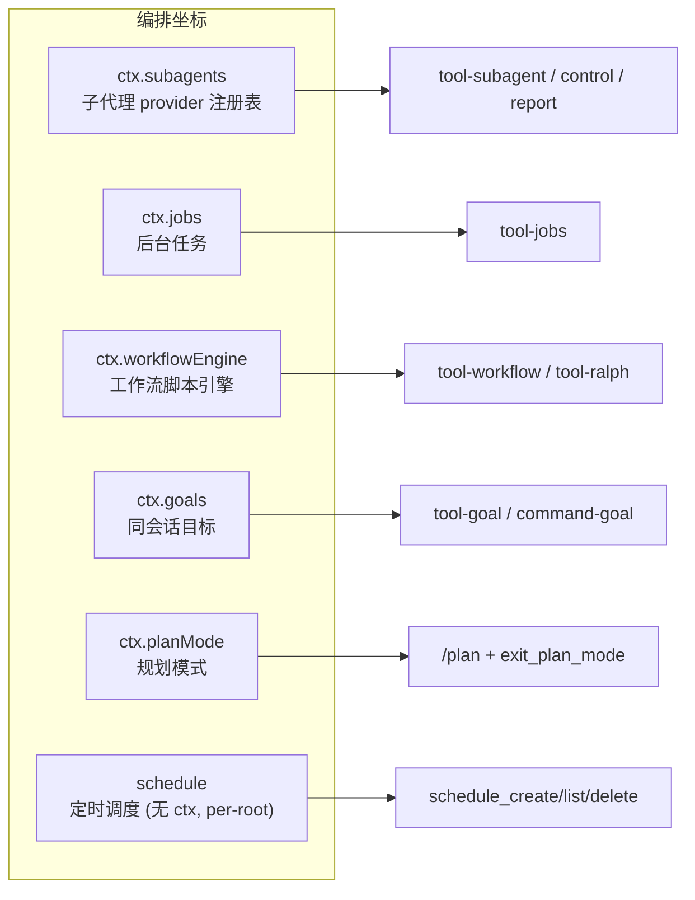
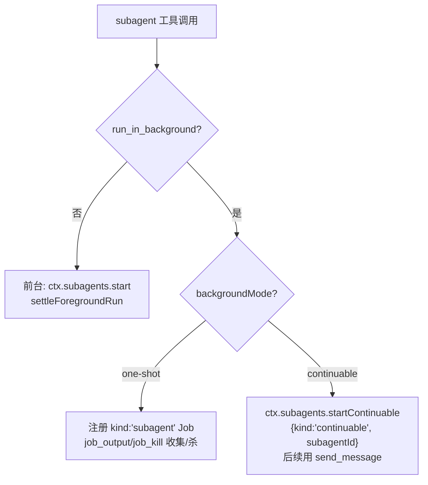
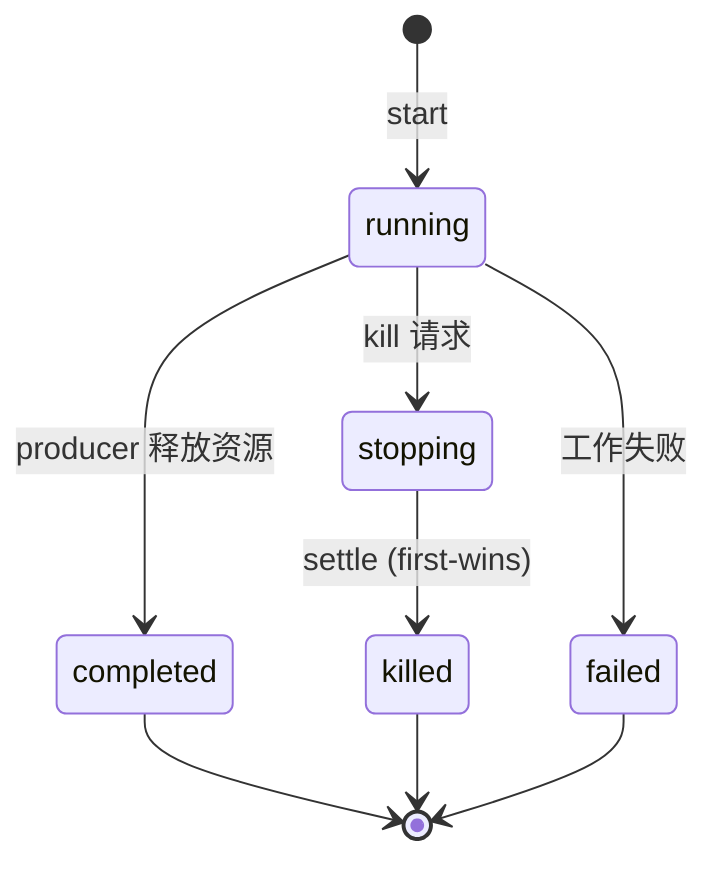
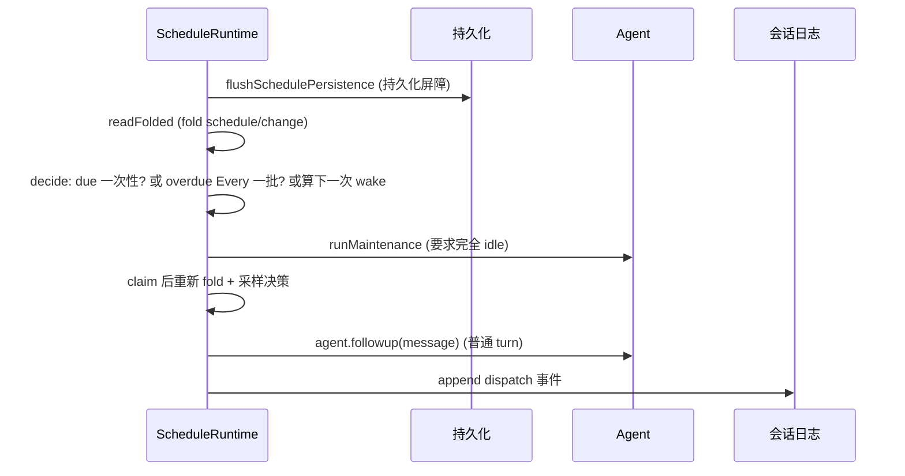
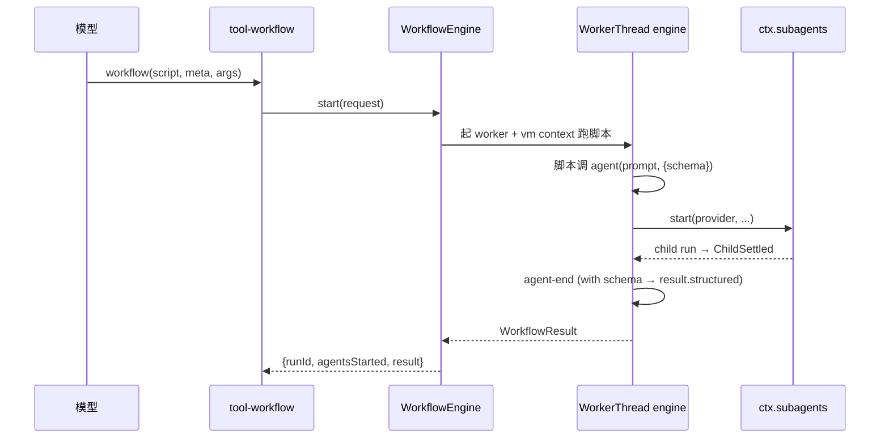
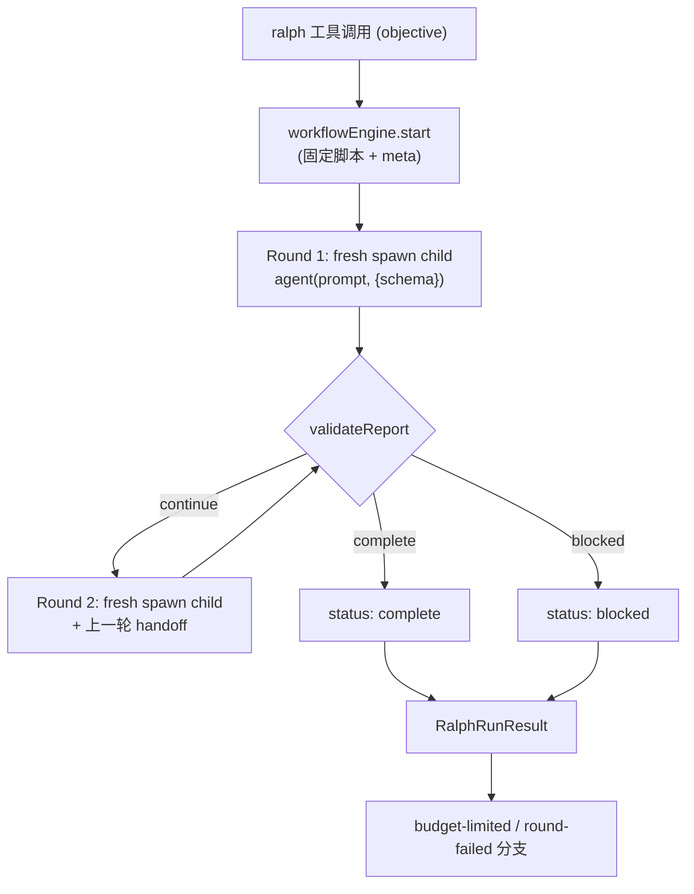
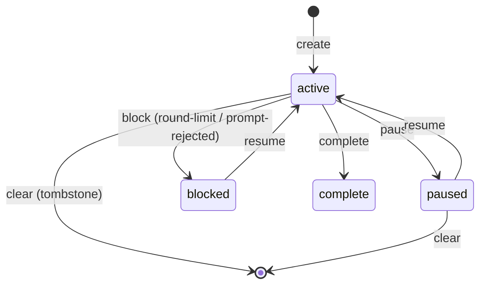

> **定位**：本文深入 DeepSeek Harness 的编排层——子代理 seam（六种 provider）、后台任务、定时调度、工作流引擎（Ralph）、同一会话目标、规划模式与待办。读完你将理解「一个 Agent 如何委托、续作、定时、编排、追逐目标」。前置阅读：[02-核心引擎与Agent生命周期]（turn/round 循环）、[08-LLM适配·设置·类型系统]。
> **代码位置**：`packages/subagent/`、`packages/jobs/`、`packages/schedule/`、`packages/workflow/`、`packages/goal/`、`packages/plan/`、`packages/todo/`。

## 一、领域概览：编排层在设计上回答什么问题

**设计问题**：单个 Agent 能完成任务，但真实任务需要**并行、委托、定时、长期目标**。编排层必须回答：**如何让 Agent 自主工作，同时保持人工可控？** 本领域的核心设计决策是——**编排全部是挂在 `agent/*` 事件与 inbox 之上的外层策略，不修改主循环**。主循环只做三件事：认领输入 → 驱动 step → 记录日志；委托/后台/定时/目标/规划都在事件层「从旁驾驶」。

### 本领域的设计哲学（Why）

本领域是「状态由数据推导」哲学（[11-设计哲学与架构模式 §二]）最典型的落地点，另有五条领域特有原则：

1. **编排不侵入主循环**——subagent/jobs/schedule/workflow/goal 全部监听 `agent/*` 事件或调用 `agent.followup()`，主循环零感知。**为什么**：编排可装卸、可替换，主循环保持极简。**代价**：编排方必须遵循事件契约。
2. **一次性 run vs 可续作 Activation 两条路彻底分开**——one-shot 走 `SubagentRun`（结果 promise + dispose）；continuable 没有 run/Task，manager 直接持有 `AgentHandle`、inbox 为唯一队列。**为什么**：避免「中间结果包装」二次状态机。**代价**：两个 API 面，学习成本略高。
3. **Activation 驻留态从数据推导**——running/waiting/settled 从「Agent quiescence + owned-child set」推导，**不维护第二套状态机**。**为什么**：重放自洽、不漂移。**代价**：推导逻辑要严谨。
4. **Ralph = workflow 脚本 + subagent 原语的组合**——不是 goal/scheduler/agent-loop 模式。**为什么**：复用已有原语，避免新概念。**代价**：Ralph 的行为取决于两者语义。
5. **goal 的 durable phase 与进程内 activation 分离**——激活 `armed/disarmed` 永不持久化，resume/fork 后必须人工授权。**为什么**：自动续作是危险操作，恢复后必须有人确认。**代价**：恢复流程多一步人工。

本领域是一条完整的「Agent 协作/编排能力栈」，七个子系统全部是 Cordis 插件：

## 二、subagent：子代理 seam

### 2.1 核心 Service Definition（`@deepseek-ai/dsh-subagent`）

`ctx.subagents`（`SubagentRuntime`，`src/index.ts:129`）：**具名 provider 注册表**——一个 agent 通过具名 provider 委托工作给 child agent。与 bash（单一 executor）不同，它允许多个 provider 按名字共存。

关键类型：

- `SubagentProvider`（`src/types.ts:285`）：`{name, capabilities, inheritsParentContext, start(request), prepareContinuable?}`。**`prepareContinuable` 方法存在即能力**（TS narrowing 作为发现机制）。
- `SubagentCapabilities`（`:86`）：`{outputSchema, depthLimit, toolFilter, persona}` 四个 boolean，仅描述 **one-shot** start 路径。
- `SubagentRun`（`:249`）：`{id: SessionId, localAgent, result: Promise<SubagentResult>, dispose()}`——one-shot 句柄，一次前台委托一个结果。
- `SubagentStopReasonMap`：`completed | aborted | error | max-tokens | refusal`（merge-extensible）。

### 2.2 六种 provider

| Provider | name | capabilities | inheritsParentContext | 机制 |
|---|---|---|---|---|
| **spawn**（in-process） | `spawn` | 全 true | false | 新 child，零 parent context |
| **fork**（in-process） | `fork` | 全 true | **true** | `completedTurnPrefix` 取最后一个 `turn/end` 的 balanced 前缀作 seed |
| **ACP** | `acp` | 全 false | false | 独立进程，只读 parent cwd；`permission` 自动应答（默认 reject） |
| **Claude Code** | `claude-code` | NO_START | false | 官方 Agent SDK 在委托 session 工作区跑真实 CLI |
| **Codex** | `codex` | NO_START | false | `codex app-server --stdio` 新进程 |
| **dsh-sdk** | `dsh-sdk` | NO_START | false | 完整 Harness runtime 子进程，stdio JSON-RPC 驱动 |

### 2.3 一次性 vs 可续作（Activation）

`tool-subagent` 把委托分成两条路（`execute`，`tool-subagent/src/index.ts:369`）：

**可续作的核心是 `SubagentContinuationManager`**（`src/continuation.ts`）：

- **Activation**（`:191`）：一个 durable child Session 至多一个进程内 Activation（驻留 epoch）。**Activation 不是 request/result/cancellation/Task 边界，可执行多个 FIFO turn**。
- **三种驻留状态**（`stateOf`，`:870`）：`running`（status==='running' 或 accepted.size>0）/ `waiting`（quiescent 但 ownedChildren 非空）/ `settled`（quiescent 且所有 child 已 dispose）。从 Agent quiescence + owned-child set 推导，**不维护第二套状态机**。
- **followup 路由只取决于驻留态**（`:476`）：`running` 直接 enqueue / `waiting` wake 同一 Agent / 无 Activation 则 `coldResume`。
- **冷恢复 `coldResume`**（`:883`）：`persistence.inspect(childId)` → `authorizeLineage`（精确 live parent）→ `foldSubagentDescriptor` → `ctx.agents.resume()` 重建。**冷恢复不经过 provider**。
- **interrupt**（`:528`）：唯一公开停止操作，`agent.cancel(cause, {keepInbox:true})`，不等待 quiescence。
- **报告通道 `reportFrom`**（`:583`）：child 是授权凭据，caller 不能指名收件人；收件人从 durable `parentSession` 推导。

## 三、jobs：后台任务

`ctx.jobs`（`JobRegistry`，`jobs/src/index.ts:29`）抽象后台任务注册表：**注册表拥有 identity/access/lifecycle，producer 拥有执行资源**。

- `JobKindMap`：`{bash, subagent}`（插件可 declaration merging 扩展）；`JobStatus = 'running'|'stopping'|'completed'|'killed'|'failed'`。
- `JobStart`（`:46`）：`{kind, label, outputLimitBytes?, owner?, run(): JobHooks}`；`JobHooks.done` 在 **producer 释放资源后** resolve（不是工作刚结束）。
- **授权靠 owner session 比较而非 id 保密**；**settlement first-wins**。
- `dsh-jobs-local`：`DEFAULT_MAX_CONCURRENT_TASKS_PER_OWNER = 10`；`start` 先 `servesOwner`（global controller 或 owner scope 链上有 controller）——**无 controller 服务 owner 时拒绝**。
- `dsh-tool-jobs` 三工具：`job_output`/`job_list`/`job_kill`。`attachController('tool-jobs')` 是 producer 能 start 的前置。`completionDelivery` 默认 `wakeup`、`maxConsecutiveWakes` 3（限制自激唤醒链）。

## 四、schedule：会话内定时调度

**定位**：会话内持久提醒，到点以普通后续 turn 回到原 Session；**无外部通知渠道、无冷会话调度器**（`ScheduleDeliveryMode = 'session-local'`）。无独立 ctx 服务；`apply` 监听 `agent/created` **只为 root agent** 建 `ScheduleRuntime`。

关键设计：

- **绝不 `steer()`、绝不打断当前 turn**（维护阶段只等 agent 完全 idle）；
- **Every 追赶**：每记录只贡献一个最新 due 事件，直接推进到创建锚定对齐的下一个目标，不枚举/持久化/重放错过的区间；
- `MIN_EVERY_INTERVAL_SECONDS = 300`；
- 工具三件套：`schedule_create`（`prompt` + 恰好一个 selector：`after_seconds`/`every_seconds`/`at`）、`schedule_list`、`schedule_delete`；错误码封闭 union 10 个。

## 五、workflow：工作流脚本引擎

`ctx.workflowEngine`（`WorkflowEngine`，`workflow/src/index.ts:157`）：模型编写编排脚本、脚本扇出 subagent。**每 context 只允许一个引擎**（与 bash 同，非具名注册表）。

- `WorkflowResult`：`{value, stopReason: 'completed'|'cancelled'|'error', error?, agentsStarted}`——**stopReason 是封闭 union**；`result` 永不 reject，`dispose` 绝不 hang。
- `dsh-workflow-worker-thread`：`WorkerThreadWorkflowEngine` 在 worker 线程的 **vm context** 里跑脚本。脚本 hooks：`agent`/`parallel`/`pipeline`/`phase`/`log`/`args`。
- **`agent()` 扇出**（`host.ts:349`）：worker → RPC ChildStart → host `subagents.start(provider, ...)` → child run → ChildSettled → worker `agent-end`。
- `WorkflowErrorCode` 11 个 fatal code；`WorkflowError.fatal` 驱动组合子纪律：`parallel()`/`pipeline()` **re-throw** fatal，每项 `null` 只保留给 child 失败和普通脚本错误。

### Ralph loop（`tool-ralph`）

**Ralph loop 是模型面工具策略**——前台 fresh-agent 工作流朝向不可变目标运行，由 workflow + subagent 原语组合（**不是 goal/scheduler**）。

- 固定脚本 `RALPH_SCRIPT`（`src/index.ts:90`）：每轮开一个 **fresh structured-output child**（`agent(prompt, {schema: reportSchema})`），prompt 含「Immutable objective」「Ralph round: N of maxRounds」「共享工作区是长期记忆和 source of truth」「previous structured handoff」。
- **Ralph round** = 一个 fresh child session，**无 parent/prior-child 会话种子**（`requireFreshProvider` 拒绝 `inheritsParentContext` provider）。
- **Ralph handoff** = `RalphRoundReport`：`{status: 'continue'|'complete'|'blocked', summary, evidence, nextSteps, blocker}`，作为下轮唯一结构化跨轮状态；共享工作区为权威、handoff 只是补充。
- `maxRounds` 默认 256、`maxHandoffChars` 16384、`subagentProvider` 默认 `spawn`。

## 六、goal：同一会话目标

`ctx.goals`（`GoalService extends TypertRemoteService`，`goal/src/index.ts:183`）：同一会话的持久完成目标，**事件溯源，CAS 变异，进程内激活分离**。

- `GoalPhase = 'active'|'paused'|'blocked'|'complete'`（durable phase）；`GoalActivation = 'armed'|'disarmed'`（**进程内、永不持久化**）。
- `defaultMaxGoalRounds = 256`。

**goal-round-driver**（`@deepseek-ai/dsh-goal-round-driver`）是同会话自动续作：goal 存在且 `phase==='active'` 且 `activation==='armed'` 时，`round = roundsStarted + 1`，`agent.followup(message)` 排入一个 goal round turn。**pre-step 拦截**（`:349`）校验 reservation 精确匹配，不匹配 reject 并恢复其它 claimed message。

关键语义：

- **goal round 上限** = 每个 goal 的 `maxGoalRounds`；**不相关的同会话人工 turn 不消耗** goal-round cap；
- 激活 `armed/disarmed` 刻意不出现在 durable replay——resume/fork 后需要人工授权 resume 才自动续作；
- `/goal` 命令：`/goal`（show）、`/goal <objective>`（create）、`/goal edit`、`/goal pause|resume|clear`；
- `tool-goal` 的 `update_goal` **authority 门控**：edit/pause/resume 需 direct top-level human；complete/blocked 在自动 goal-round 期间也允许。

## 七、plan-mode：规划模式

`ctx.planMode`（`PlanModeController`，`plan-mode/src/index.ts:184`）：按 agent 记录的协作状态；激活时把部署方 guidance 段加入每个模型请求。**软引导**——sandbox 与 approval policy 独立强制，不读不写 plan state。

- durable 状态：`plan/mode` session 事件 `{active}`，log-only、whole-value-replace；`foldPlanMode` 纯 fold 恢复，**无 live mirror**；
- **pending selection + pre-step append**：`set(agent, active)` 返回 `'committed'|'queued'|'cancelled'|'noop'`。有 open turn 时 pending，直到下一个被接受的 in-turn `agent/pre-step` 才 append；
- `exit_plan_mode` 工具：要求 `#` 开头的完整 markdown plan，经 `userQuestions` 呈现 review；Approve → 记录 silent pending exit，下一 accepted pre-step 才 append——**plan guidance 保持到当前 tool batch 结束**。

## 八、todo：待办

`todo_write` 工具**整表替换**（每 call 是完整列表，无部分更新）。`toTodoList` 校验：trim 非空、无重复、`allowParallelInProgress` 为 false 时最多一个 in_progress。append `todo/write` session 事件。`todos` projection unit：`todo/write` 取最新、`turn/start` 清为 null（next turn 前不可见）。

## 九、事件全景

| 事件 | 模式 | 位置 |
|---|---|---|
| `subagent/provider-added` / `provider-removed` | emit | `subagent/src/index.ts:140/:146` |
| `subagent/start` / `subagent/end` | emit (scoped) | `:157/:166` |
| `subagent/descriptor` | session event | `descriptor.ts:37` |
| `workflow/start` / `phase` / `log` / `agent-start` / `agent-end` / `end` | emit | `workflow/src/index.ts:43-89` |
| `goal/changed` | emit (scoped) | `goal/src/domain.ts:114` |
| `goal/change` | session event | `goal/src/domain.ts` |
| `schedule/change` | session event | `schedule/src/types.ts:105` |
| `plan/mode` | session event | `plan-mode/src/index.ts:46` |
| `todo/write` | session event | `tool-todo/src/index.ts:213` |

## 十、设计决策（Why / 代价 / 选择依据）

**D1. 具名多 provider 注册表 vs 单 executor**
- **Why**：subagent 用 `ctx.subagents` 注册表（多个 child 运输方式天然共存），workflow 用单引擎 `ctx.workflowEngine`（一个引擎即一个执行语义）。**决策依据是「能力是否可以并存」**——委托是「多运输方式共存」，编排是「单执行语义」。
- **代价**：两套模式都要理解。
- **选择依据**：先问「这个能力会同时有多个实现吗」，再决定注册表还是单例。

**D2. fail-loud，无静默降级**
- **Why**：缺能力 `UNSUPPORTED_CAPABILITY` 拒绝；provider 移除只阻止新 start 不撤销已接受 run。
- **代价**：调用方要处理更多错误码。
- **选择依据**：委托失败如果被悄悄降级，任务的正确性无从谈起——宁可 loud 拒绝。

**D3. 一次性 run vs 可续作 Activation 彻底分开**
- **Why**：one-shot 走 `SubagentRun`（结果 promise + dispose）；continuable 没有 run/Task，manager 直接持有 `AgentHandle`、inbox 为唯一队列——**避免「中间结果包装」二次状态机**。
- **代价**：两个 API 面。
- **选择依据**：续作不是「长的 run」，而是「多个 turn 的同一 Agent」——用不同的抽象表达不同的语义。

**D4. settlement 通知时机 = 所有权释放之前**
- **Why**：child 未释放时父在结构上不能 settled——**不靠运气保证可靠投递**。
- **代价**：生命周期顺序有严格约定。
- **选择依据**：可靠性靠「结构上不可能错」而非「运行时恰好对」。

**D5. 事件全 observe-only + 数据快照**
- **Why**：`workflow/*` payload 从不带 live run（不能获得 cancel/dispose）。
- **代价**：监听方只能观察，不能控制。
- **选择依据**：把「观察」与「控制」分开，控制走服务方法——防止事件监听器拥有控制权导致生命周期纠缠。

**D6. Ralph = workflow + subagent 的组合；goal 的 phase 与 activation 分离**
- **Why**：Ralph 是「workflow 脚本 + subagent 原语」的组合，不是新概念；Ralph handoff 与 goal round 是两种「round」——前者跨 fresh session，后者同会话。goal 的 activation 永不持久化，resume/fork 后必须人工授权。
- **代价**：需要区分两种「round」的语义。
- **选择依据**：自动续作是危险操作，恢复后必须有人确认——**安全边界比便利更重要**。

## 十一、转译到 Spring AI / Java 生态

| DeepSeek Harness | Spring AI 对应物 | 启示 |
|---|---|---|
| `ctx.subagents` 具名 provider 注册表 | Spring 多实现注入 | 「多个 child 运输方式共存」时用注册表，「一个执行语义」时用单引擎（对应 [教程 09-多Agent协作]） |
| Activation 可续作（inbox 唯一队列） | 会话状态机 | 续作不建第二套状态机，用 Agent quiescence + owned-child set 推导（对应 [教程 12-Agent状态管理]） |
| workflow worker + vm context 脚本 | 脚本引擎/DSL | 模型写脚本、host 执行扇出是 Agent 编排的高级形态（对应 [教程 36-Agent工作流编排]） |
| Ralph fresh-round + handoff | 多轮反思 | 「共享工作区为权威、handoff 只补充」防止上下文污染（对应 [教程 37-自我反思与Agent评估]） |
| goal durable phase + 进程内 activation | 长任务状态 | 「状态可重放、激活过程本地」兼顾恢复与安全（对应 [教程 35-长任务持久化]） |
| schedule 会话内定时 | 定时任务 | 到点以普通 turn 回到原 Session，无外部通知渠道——简单可靠 |

> **适用场景**：要设计多 Agent 协作、长任务编排、定时唤醒、目标驱动续作的系统。
> **不适用场景**：单 Agent 单轮对话。

## 十二、总结

本文覆盖了编排层的全部七个子系统。核心思想可以浓缩为三点：**委托**（`ctx.subagents` 具名 provider + 一次性/可续作两条路）、**编排**（workflow 脚本引擎 + Ralph 固定循环）、**驱动**（jobs 后台任务、schedule 定时唤醒、goal 目标续作、plan 规划模式）。它们共同构成「Agent 自主工作 + 人工可控」的协作底座，且每一处都贯彻了「事件溯源、fail-loud、无第二套状态机」的纪律。

> **定位回顾**：本文是系列的「编排」篇。下一站 [07-宿主·API·客户端与Web前端]，看浏览器、宿主、SDK 如何接入这套引擎。
