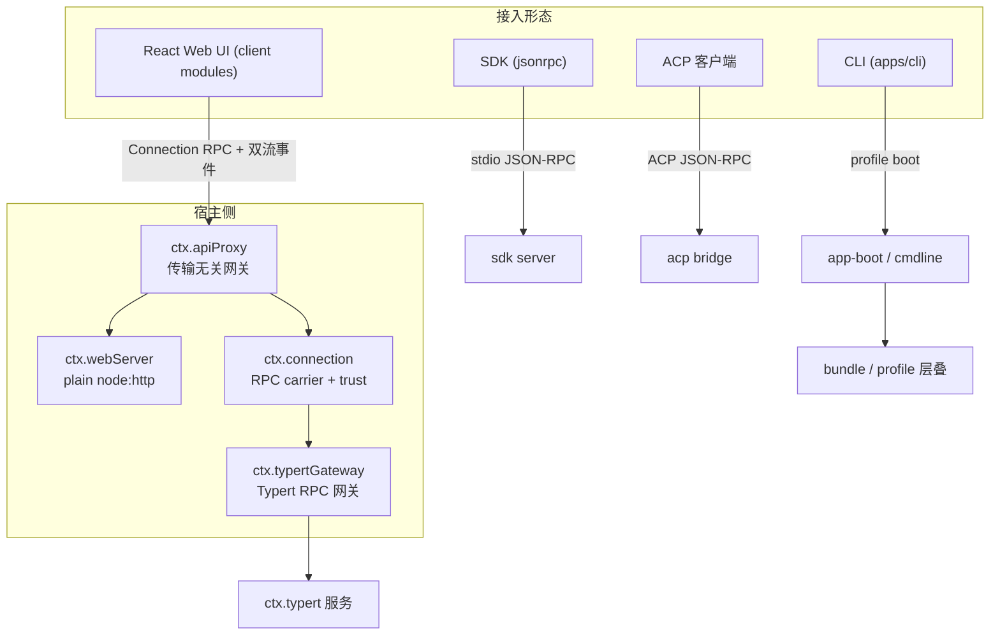
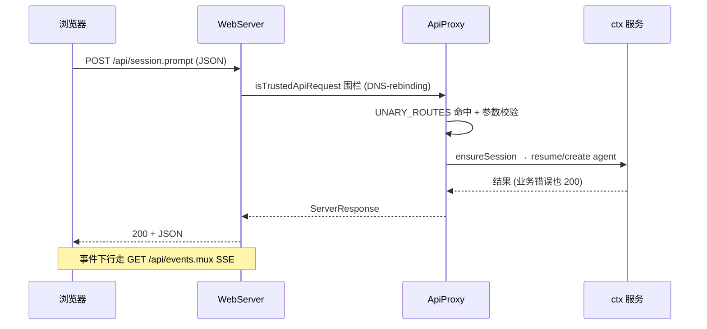
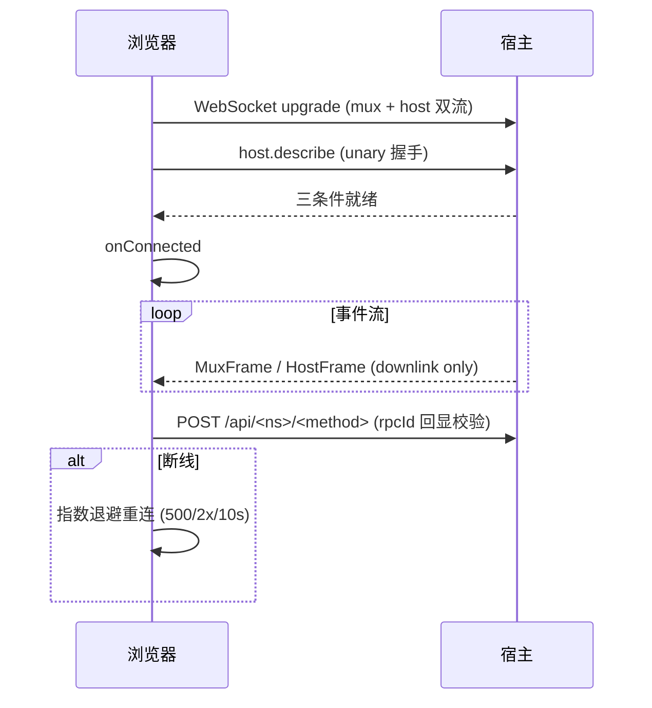

> **定位**：本文深入 DeepSeek Harness 的接入面——宿主网关（apiproxy/webserver）、启动组合（boot/bundle）、浏览器↔宿主 RPC（connection）、客户端模块与 HMR、Typert RPC 网关（api）、ACP 桥接、SDK 三件套与动态 Cordis 运行器。读完你将理解「一个浏览器 UI 如何驱动一个 Agent 运行时」。前置阅读：[00-总览与架构解析]（profile/bundle 组合）、[08-LLM适配·设置·类型系统]（Typert 类型系统）。
> **代码位置**：`packages/host/`、`packages/api/`、`packages/boot/`、`packages/bundle/`、`packages/client/`、`packages/acp/`、`packages/sdk/`、`packages/extensions/`。

## 一、领域概览：接入面在设计上回答什么问题

**设计问题**：引擎跑在宿主进程，但用户通过浏览器、CLI、SDK、ACP 与它交互——接入面必须回答：**一种能力如何同时服务多种接入形态，而不为每种形态各写一套 API？** 答案是「传输无关的宿主网关 + 多种物理载体」——能力契约（四象限消息）与传输（HTTP/WebSocket/stdio）解耦，加一种接入形态 = 加一种载体，不改能力层。

### 本领域的设计哲学（Why）

本领域是「Control/Data 平面 + 显式优先」哲学的落地，另有四条领域特有原则：

1. **契约层零 Node 依赖、浏览器可导入**——`api/` 四象限消息模型不依赖任何宿主能力。**为什么**：浏览器与宿主共享同一契约，跨进程调用被类型系统锁死。**代价**：契约层要做传输无关的抽象。
2. **事件下行、unary 上行**——WebSocket 是 downlink-only（客户端上行消息是协议违规），上行走 `POST /api/<method>`。**为什么**：事件只从事实源流向观察者，避免双向长连接的状态同步地狱。**代价**：上行多一次 HTTP 往返。
3. **profile/bundle 层叠用同一 `applyEntryPatches`**——composition、flag 派生、config dump 与真实 boot 用同一实现。**为什么**：dump = 实际 boot，不漂移；声明式组合 + 增量覆盖可审计可回滚。**代价**：组合机制较复杂。
4. **冷会话 preset 从日志解析，而非 header**——历史产生于何种组合，重建必须一致。**为什么**：header 可能过期，日志才是真相（呼应「日志即真相」哲学）。**代价**：解析日志多一步。

本领域回答：**浏览器、CLI、SDK、ACP 各以什么形态接入引擎？** 核心架构是「传输无关的宿主网关 + 多种物理载体」：

## 二、启动组合：profile / bundle / patch

- **bundle** 分发格式：三个 bundle 包都是纯 `dsh: { bundle: { patch: "./cordis.patch.yml" } }`，无运行时 API。`dsh-base` 是每个 profile 的第一层（模型适配器/工具/持久化/沙箱审批/设置/凭据/遥测），`dsh-web-app` 加浏览器应用，`dsh-headless` 加一次性 runner。
- **profile 机制**（`boot/app-boot/src/profile.ts`）：`PROFILE_TEMPLATES = { web: [dsh-base, dsh-web-app], headless: [dsh-base, dsh-headless] }`；首次使用自动 `initProfile`。
- **组合**（`composeEntries`，`:413`）：调 include 的 `applyEntryPatches([], ...)`——**composition、flag 派生、config dump 与真实 boot 用同一实现，不会漂移**。
- **层叠顺序**：bundle 列表顺序 → profile 的 `cordis.patch.yml` → home 级 → `--patch` overlay。patch 按 entry id 整行替换 config 或 insert 新行；**不做 deep-merge**，未命中的 id 是 stderr 警告。
- **`boot(binName, configPath, patches?, prepare?, bareModuleBaseUrl?)`**（`app-boot/src/index.ts:757`）：创建根 Context → `ctx.baseUrl = dirname(config)` → 装 Loader → 可选 `prepare` → mountRootInclude → 等 Loader 沉淀 → assertEntriesActivated；失败则 `ctx.fiber.dispose()` 后包一层带 bin 名的错误。
- **cmdline**：`parseCmdline` 用 commander 解析 app 自己的 flag 族，help/version/parse error 通过 `ctx.appExit` 退出。
- **CLI 三模式**（`apps/cli/src/args.ts:112`）：`profile`（boot 命名 profile）、`dump-config`（打印无用户层树）、`plugin`（转发 pnpm）。**`web` 是 `--profile web` 硬别名**。

## 三、apiproxy：传输无关主机网关

`ctx.apiProxy`（`ApiProxyService`，`host/apiproxy/src/index.ts:69`）：所有客户端形态共享的 API 网关；**`api/` 零 Node 依赖、浏览器可导入**；HTTP/WebSocket/进程内 SSE 只是物理载体。

- `ApiProxy` 接口：`sessions/subagents/host/workspace/skills/agentPresets/events/goals/settings/credentials/llm/downloads` + 特殊 `respond(message)`。
- **四象限消息模型**（`src/api/rpc.ts`）：`RpcMessage = ClientRequest | ServerResponse | ServerRequest | ClientResponse`。
- **事件流帧**（`src/api/events.ts`）：`MuxFrame`（`session/event`、`approval/requested|resolved`、`question/requested|resolved`、`session/queue`、`session/jobs`、`session/projection`…）+ `HostFrame`（`host/session-added|removed|status`、`host/remote-event` allowlist 逐字转发…）。
- **fetch 载体**（`src/fetch/handler.ts`）：`UNARY_ROUTES` 以 `RpcMethodMap` 键锁 route/schema/invoke 三件套（编译期锁）；`GET /api/events.mux|host` 走 SSE；`POST /api/<method>` unary；媒体类型非 `application/json` 强制 415（跨站写围栏）；**业务错误永远 200 + ServerResponse**。

关键机制：

- `ensureSession`（`:1618`）：live agent 复用、冷会话按 cwd 冲突检查 + `ctx.agents.resume`（`storedPreset` **从日志解析**，不是 header）、并发 create 去重、subagent 归属围栏；
- **mux 实现**（`:3430`）：打开时推每个 attached session 的 `session/subscribed` 基线 + pending approval/question 帧（**rpcId 原样复用 = 刷新恢复基线**）；
- **安全**：`PRIVILEGED_METHODS`（`client/connection/src/index.ts:89`）把 settings/credentials/host.pickDirectory/host.openPath/agentPreset 读写钉在 **loopback**（即使有 trustedHosts）；`isTrustedApiRequest` DNS-rebinding 围栏。

## 四、webserver：纯 node:http 命名路由

`ctx.webServer`（`WebServer`，`host/webserver/src/index.ts:59`）不认识任何 harness 概念，不服务文件：

- `register`（重复 (kind,path) 抛错）、`registerUpgrade`（WebSocket）、`registerFallback`（**唯一 fallback 座位**）、`tapIndex`（纯 html→html 变换，boot manifest 注入）；
- `[Service.init]`：立即监听，per-request 异常 log+400/销毁 socket，**绝不进程退出**；
- `match`：exact 表 → 最长前缀 → fallback；disposal 用 `closeAllConnections()` + 显式销毁升级 socket（SSE 连接不会自行结束）；
- `frontend-static`：traversal 403、miss→index.html 200（SPA 路由）、非 GET/HEAD 405。

## 五、connection：浏览器↔宿主 RPC carrier

`ctx.connection`（`client/connection/src/rpc-host.ts:35`）：

- `rpc.handle(channel, handler)` 注册通用 channel（`assertChannel` 拒绝 `/api` 保留名）；
- `createSharedFetchHandler('/api', fallback)` 让 **Typert Gateway 作为 interceptor** 插在共享 channel 前；
- **WebSocket downlink**（`src/websocket-downlink.ts`）：`WebSocketDownlinks` 把 `api.events.mux/host` AsyncIterable 泵成 ServerRequest 帧；**客户端上行消息是协议违规**（close 1008 'downlink only'）；
- **浏览器侧** `ConnectionController`（`src/client/connection.ts:61`）：双流（mux+host）`Promise.all` 就绪 + `host.describe` unary 三条件握手 → `onConnected`；**指数退避重连**（500/2x/10s cap）；`createWebConnectionRpc` POST `{channel}/{endpoint}`，校验 rpcId 回显。

## 六、client modules + HMR

- **Node 半**（`client/modules/src/index.ts:184`）：`ClientModuleRegistry` 扫描 host Loader entries 里声明 `dsh.client`（platform:'web'）且 `exports["./client"]` 的包；**增量扫描**：`internal/plugin` 发射→标脏→微任务 flush；`injectBootManifest` 把 `window.__DSH_BOOT__` 注入 `<head>` 首个脚本（`<` 转义防突破）；`/plugins/<id>/client.js` 路由（未知 id 大声 404 而非 SPA fallback HTML）。
- **浏览器半**（`src/client/index.ts`）：把内核预构建的 `window.__DSH_MODULES__` 提供为 `ctx.modules`——**模块系统在 cordis 存在前构建**（加载插件的机制不能通过自身到达）。
- **HMR**（`client/hmr/src/index.ts`）：node 半用 **statSync 轮询**（默认 500ms，网络挂载无 inotify 事件）检查每个 graph row 的 bundle，变化→`clientModules.rebuilt(id)`；`/plugins/events` SSE 推 `{type:'graph'|'rebuilt'}` 帧。

## 七、api gateway + remotes：Typert Remote RPC

- **Host 调度器**（`api/gateway/src/index.ts:90`）：`TypertGatewayService`（`ctx.typertGateway`）。`connection.rpc.intercept('/api', endpoint => claimsEndpoint(endpoint))`；`claimsEndpoint` 只认**两段** endpoint 且有 strict descriptor 或 SRC marker；`invoke`：解析 descriptor → `assertExactArguments`（严格参数匹配）→ 解析 receiver Context → `validateBinding` → 逐参数 lookup/Context 解析 → `Reflect.apply`。
- **Client 投影**（`api/src/client/index.ts:88`）：**无 JS Proxy**，方法用 `Object.defineProperty` getter 挂到 `remote.<namespace>` 子 Service；`$mount(contribution)` 安装生成贡献为具体方法，卸载反向注销 + abort 在途调用。
- **remotes 装配**：Host 侧 `agent-lookup.ts` 实现 `agent`/`session` lookup；`API_REMOTE_FORWARDED_EVENTS`（`remote-events.ts:17`）允许 `agent-preset/selected`、`commands/change`、`credentials/updated`、`cordis/*`、`llm/adapters-updated` 等逐字转发。
- **构建纪律**：`remotes → gateway → connection → webserver` 分层；host/client 两个 build 永不进同一 `ts.Program`；业务包写 `lib/typert.host.js` / `lib/typert.remote-client.js` 等生成物。

| 步骤 | 处理内容 |
|------|----------|
| 1 | 浏览器 ctx.remote.<ns>.<method> |
| 2 | Connection RPC：POST /api/<ns>/<method> |
| 3 | TypertGatewayService：claimsEndpoint + 解析 descriptor |
| 4 | assertExactArguments + validateBinding |
| 5 | 逐参数 lookup/Context 解析 |
| 6 | Reflect.apply Host Service |
| 7 | 解码结果返回 |

## 八、ACP：Agent Client Protocol 桥接

`@deepseek-ai/dsh-acp`：自动化专用 ACP server over JSON-RPC stdio；只带 prompt 文本、已提交 assistant 文本、取消、一次性权限决策，**不暴露 UI**（`inject=['agents']`）。

- `makeAgent`（`src/index.ts:231`）：`initialize`（单版本，capabilities image/audio/embeddedContext:false）、`authenticate`（空）、`newSession`（绝对 cwd + 拒绝 additionalDirectories/mcpServers）、`prompt`（排他 inflight；`agent.followup` 后 `agent.whenIdle()` 结算 stopReason，token-limit→`end_turn`）、`cancel`。
- **`approval/request` → `conn.requestPermission`** 一次性 allow-once/reject-once，不推断持久授权。
- 生产 stdio：`ndJsonStream(Writable.toWeb(stdout), Readable.toWeb(stdin))`；teardown：quiesce 先 cancel 再 `drainContinuableDescendants` 再 dispose。

## 九、SDK 三件套

`packages/sdk`：protocol / server / client 三层：

- **protocol**（`sdk/protocol/src/transport.ts`）：`JsonRpcLineTransport`——NDJSON JSON-RPC 2.0；`request(method, params, signal)` 带取消；错误码 `-32601`/`-32603`。
- **server**（`sdk/server/src/server.ts:53`）：`HarnessSdkJsonRpcServer`。构造订阅 `session/event`→`session.event`、`agent/status`→`session.status`、`session/created`（有 parent）→`subagent.started`、`subagent/end`（local only）→`subagent.finished`。方法 `initialize`/`prompt`/`shutdown`。
- **client**：`DeepSeekHarness`/`HarnessSession` 高层 run API + `HarnessClient` 底层协议客户端；spawn `dsh-jsonrpc-agent` 子进程驱动 turn。Python SDK 是其 design twin（见 [09-Python-SDK·原生沙箱与示例]）。

## 十、extensions：动态 Cordis 运行器

`ctx.dynamicCordisRunner`（`extensions/cordis-host-runner/src/index.ts`）+ `ctx.cordisInspect`：

- **host-runner sandbox**（`src/sandbox.ts`）：`createSandbox(id)` 构造 vm context——tagged console、`harness` 注册助手、**Node API 陷阱**（`NODE_API_REDIRECTS`：require/setTimeout/fetch 等调用即抛，指到 cordis 服务）；`evaluateHostCode` 把 host half 作为 async 函数体 `runInContext`。
- 事件：`cordis/dynamic-package`、`cordis/dynamic-retract`、`cordis/request-run`、`cordis/request-run-resolved`、`cordis/inspect-query`、`cordis/inspect-query-resolved`。
- `tool-cordis` 模型面对工具：`cordis_inspect_list`/`cordis_inspect_query`/`cordis_define`/`cordis_run`——**模型可以动态定义并运行 Cordis 插件**。

> **动态扩展姿态**：sandbox「可合作、不防逃逸」是明示信任姿态——`vmTimeoutMs` 只限同步段，防的是误伤而非恶意逃逸。

## 十一、设计决策（Why / 代价 / 选择依据）

**D1. api/ 契约层零 Node 依赖**
- **Why**：四象限消息解耦物理载体，浏览器可导入——浏览器与宿主共享同一契约，跨进程调用被类型系统锁死。
- **代价**：契约层要做传输无关抽象。
- **选择依据**：加一种接入形态 = 加一种载体，不改能力层。这是「一种能力服务多种形态」的唯一干净解。

**D2. profile 层叠用同一 `applyEntryPatches`**
- **Why**：composition、flag 派生、config dump 与真实 boot 用同一实现——**dump = 实际 boot，不漂移**。
- **代价**：组合机制较复杂。
- **选择依据**：「能看到的不等于实际跑的」是配置系统的头号隐患；同一实现消灭漂移。

**D3. 冷会话 preset 从日志解析，而非 header**
- **Why**：历史产生于何种组合，重建必须一致——header 可能过期，日志才是真相。
- **代价**：解析日志多一步。
- **选择依据**：与「日志即真相」哲学一致，恢复 = 重放而非猜 header。

**D4. Remote 客户端不用 Proxy**
- **Why**：`Object.defineProperty` getter + `$mount`，卸载即 withdraw 在途调用。
- **代价**：手动安装/卸载方法。
- **选择依据**：JS Proxy 让生命周期不可控；显式 getter 让「卸载 = 反向注销 + abort」可精确实现。

**D5. HMR 用 stat 轮询而非 inotify**
- **Why**：网络挂载（NFS 等）无 inotify 事件，stat 轮询是跨文件系统的可靠方案。
- **代价**：有轮询延迟（默认 500ms）。
- **选择依据**：可靠性优先于即时性——开发期 HMR 的 500ms 延迟可接受。

**D6. downlink-only WebSocket**
- **Why**：事件只下行，上行走 unary POST——避免双向长连接的状态同步地狱。
- **代价**：上行多一次 HTTP 往返。
- **选择依据**：把「事实流」与「请求-响应」分开，是 Web 实时架构的稳健选型。

## 十二、转译到 Spring AI / Java 生态

| DeepSeek Harness | Java/Spring AI 对应物 | 启示 |
|---|---|---|
| apiProxy 传输无关网关 + 四象限消息 | REST/WebSocket 网关 | 事件下行 + unary 上行的双工模型是 Agent UI 的标准（对应 [教程 10-SSE流式通信] [教程 24-多页面流式响应与会话管理]） |
| Connection RPC carrier + Typert 网关 | gRPC/WebFlux Router | 「类型系统驱动的跨进程 RPC」让前后端契约在编译期锁定 |
| profile/bundle/patch 层叠 | Spring Profiles + 配置覆盖 | 声明式组合 + 增量覆盖可审计可回滚（对应 [教程 29-灰度发布与版本管理]） |
| HMR + client modules | Vite HMR / 模块联邦 | 浏览器端插件热替换是 Agent UI 的动态扩展基础 |
| ACP 桥 | 标准协议适配 | 复用外部标准协议（Claude Code ACP）而非自造协议 |

> **适用场景**：要设计 Agent 前端接入、跨进程 RPC、动态插件扩展。
> **不适用场景**：纯后端、无 UI 接入的场景。

## 十三、总结

本文覆盖了接入面的全部组件：**apiproxy** 以传输无关的四象限消息服务所有客户端，**webserver** 提供纯 node:http 载体，**connection** 实现双流 RPC + trust 围栏 + 断线重连，**client modules + HMR** 支撑浏览器端插件热替换，**Typert gateway** 让类型系统驱动跨进程调用，**ACP/SDK** 提供标准协议接入，**动态 Cordis 运行器**让模型能现场定义插件。核心架构是「传输无关网关 + 多种物理载体 + 类型系统锁契约」的组合。

> **定位回顾**：本文是系列的「接入面」篇。下一站 [10-工程化体系与研发效能]，看这套庞大 monorepo 如何守质量。
