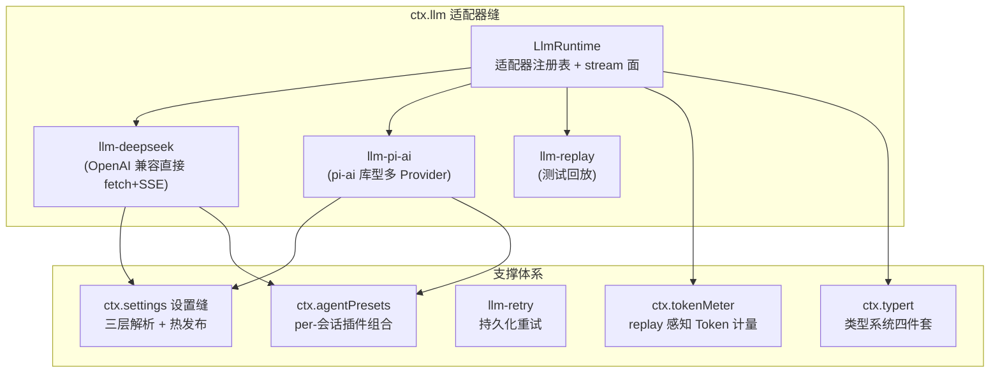
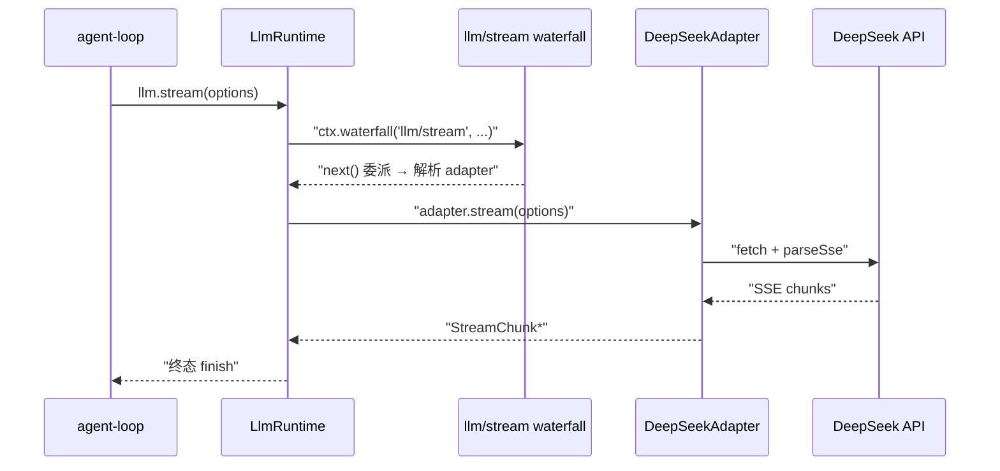
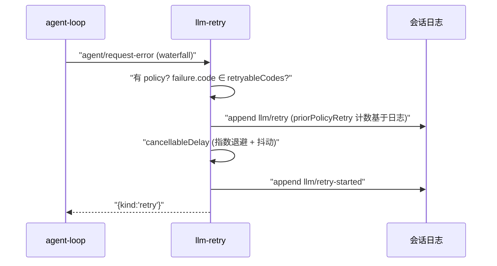
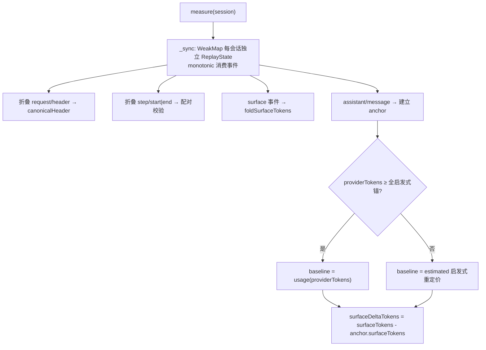
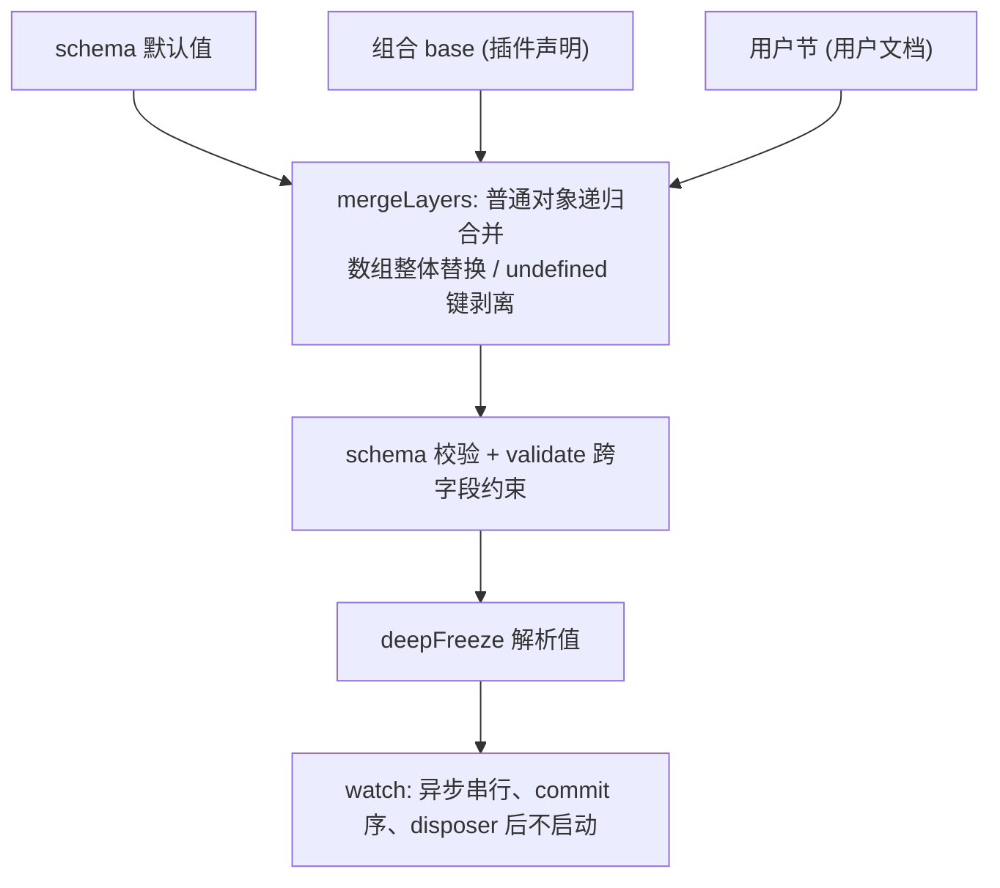
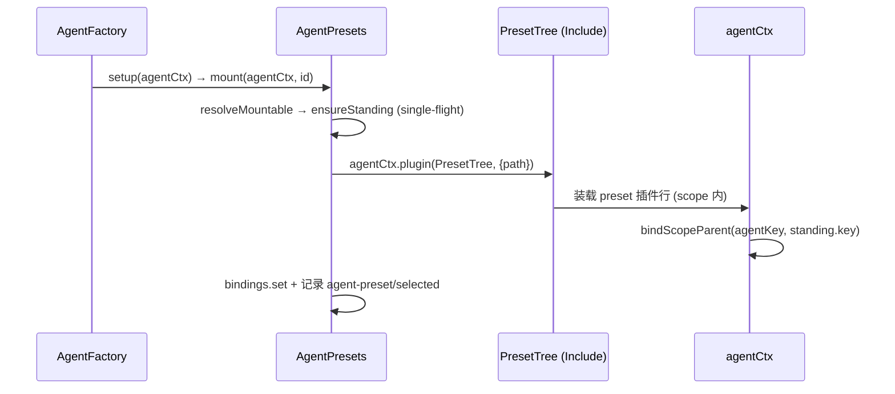

> **定位**：本文深入 DeepSeek Harness 的模型接入层与支撑体系——`ctx.llm` 适配器缝、DeepSeek/Pi AI 两个提供者、重试策略、Token 计量、设置缝、身份、Agent 预设、Typert 类型系统与 util 工具箱。读完你将理解「如何把一个模型提供者接进这个框架」以及「类型系统如何驱动跨进程 RPC」。前置阅读：[02-核心引擎与Agent生命周期]（模型请求在 step 中如何发起）。
> **代码位置**：`packages/llm/`、`packages/settings/`、`packages/identity/`、`packages/preset/`、`packages/typert/`、`packages/util/`、`packages/workspace/`。

## 一、领域概览：模型接入与支撑体系在设计上回答什么问题

**设计问题**：一个 Agent 框架可能接多个模型提供者、配置频繁变化、跨进程调用需要强类型——本领域必须回答：**如何让「接新模型」成为配置而非改代码？如何让「配置热更新」不重启进程？如何让「跨进程调用」有编译期保障？**

### 本领域的设计哲学（Why）

本领域是「能力缝 + 显式优先」哲学的落地，另有五条领域特有原则：

1. **单 provider 调用 = 单 provider 尝试**——适配器不做库级重试，重试交给 `llm-retry` 在更上层（`agent/request-error`）做。**为什么**：重试边界必须落在「请求未发出任何 chunk」处（发过 chunk 后无持久边界），上层事件才能保证重试语义。**代价**：重试逻辑与主循环耦合在上层。
2. **适配器只产良构 chunk，折叠归共享实现**——`LlmAdapter.stream()` 唯一必写，`BlockAssembler` 统一折叠 chunk→block。**为什么**：各适配器不需要各自实现消息组装，杜绝「一个适配器一个组装 bug」。**代价**：适配器要遵守 chunk 协议。
3. **配置存引用，provider 持值，每操作解析**——`CredentialRef` 进配置，`ctx.credentials.resolve` 每请求解析。**为什么**：凭证轮换零重启，下一请求即生效。**代价**：不能「启动时读一次」。
4. **设置三层解析 + path-op 脱敏写**——schema 默认 → 组合 base → 用户节；脱敏调用者用路径级写入。**为什么**：脱敏调用者不能整体 replace（会静默删 secret）。**代价**：路径操作比整体替换复杂。
5. **类型系统驱动跨进程 RPC（Typert）**——TS 源码 → 编译无关模型 → Remote 描述符 → 网关调用。**为什么**：前后端契约在编译期锁定，运行时零手写胶水。**代价**：需要生成器与构建集成。

本领域回答三个问题：**模型怎么接进来？配置怎么管？类型系统如何支撑跨进程调用？**



## 二、llm：模型词汇与适配器缝

### 2.1 词汇表

`@deepseek-ai/dsh-llm` 定义 Provider 无关的 `Message`/`ContentBlock`/`StreamChunk` 协议（`src/types.ts`）：

- **`ContentBlockMap`**（merge-extensible）：`text | reasoning | image | tool-call | tool-result`。`ToolCallBlock` 携带 raw JSON `arguments`；`ToolResultBlock` 嵌套 `content: ContentBlock[]` + `isError?`；
- **`FinishReasonMap`**：`stop | tool-calls | max-tokens | aborted{failure} | error{failure}`；
- **`TokenUsage`（不重叠）**：`inputTokens` 仅未命中缓存输入；`cacheReadTokens`/`cacheWriteTokens` 单列；`reasoningTokens` 已在 `outputTokens` 内；
- **`StreamChunk`（闭联合，`switch` 后必须 `assertNever`）**（`:291`）：`block-start{index,blockType}` / `text-delta` / `reasoning-delta` / `tool-call-delta{id,name?,argumentsDelta}` / `block-end{index,block}` / `usage` / `finish{reason,replayState?}`。

### 2.2 适配器契约与 stream 面

```ts
abstract class LlmAdapter {
  abstract stream(options: GenerateOptions): AsyncIterable<StreamChunk>  // 唯一必写
  providerInfo?: ...
  providerRetryPolicy?: ...
  listModels?: ...
  resolveModel?: ...
}
```

`LlmRuntime.stream()`（`src/index.ts:913`）走 `ctx.waterfall(this, 'llm/stream', ...)` → `adapterStream`（`:843`）。**waterfall 在终结 continuation 处才查 adapter**——所以 listener 可以短路或改发 one-shot 请求。失败归一化：`adapterFailureChunk`（`:931`）把 adapter 的 throw/迭代失败统一成 terminal `finish{error|aborted}`。



关键设计：

- **单 provider 调用 = 单 provider 尝试**（禁库级重试——重试交给 `llm-retry` 在更上层做）；
- **`PreparedLlmCall`**（`:155`）：`config` 深冻结、`retryPolicy` 不可变、`stream(options)` 一次性 dispatch（复用或改字段抛 `INVALID_PREPARED_CALL`）；
- `registerAdapter` 全有或全无（`DUPLICATE_ADAPTER`），返回带 `replace` 的 handle；
- `markAgentLoopRequest(deepFreeze({...}))`：loop 构建的请求深冻结，listener 只读不可改写；
- `BlockAssembler`（`assembler.ts:36`）：唯一共享的 chunk→block 折叠实现；`blocks()` 在 `max-tokens` 时丢弃无法安全执行的 tool-call。

## 三、llm-deepseek：OpenAI 兼容直连适配器

- 单 route：`PROVIDER='deepseek-official'`，默认目录 `deepseek-v4-flash`/`deepseek-v4-pro`。
- **凭据每请求解析**：`resolveApiKey`（`index.ts:225`）优先 `ctx.credentials.resolve(ref)`，无 seam 时回退 `launchEnvironmentOf(ctx).get(ref)`；缺失抛 `MISSING_CREDENTIAL`。凭据轮换无需重启，下一请求即生效。
- **baseURL 回退链**：`config.baseURL ?? $DEEPSEEK_BASE_URL(仅受信层) ?? https://api.deepseek.com`。
- **错误分类**（`httpErrorCode`）：401/403→AUTH、429→RATE_LIMIT、400+context 溢出→`CONTEXT_WINDOW_EXCEEDED`、≥500→SERVER。
- **SSE 语义**（`translate.ts`）：`mapUsage` 把 DeepSeek `prompt_tokens` 含缓存命中的计数**减回**成 disjoint 计数；`translate` 延迟到 `[DONE]` 才发 block-end/usage/finish；`stop` 且无块→`EMPTY_RESPONSE` error finish。
- **思考模式**：`thinking:'enabled'|'disabled'` + `reasoningEffort:'off'|'high'|'max'`；`resolveThinking` 处理 `purpose==='session-title'`→disabled。
- 配置字段（config-catalog.md:854）：`apiKeyEnv`（`role('credential-ref')`）、`baseURL`、`thinking`、`reasoningEffort`（默认 high）、`maxTokens`（默认 256000）、`defaultContextWindow`（默认 1,000,000）、`models`、`streamIdleTimeoutMs`（默认 300000）、`retryPolicy`。

## 四、llm-retry：把重试做成持久化的

**重试是持久化的（durable attempt boundary）**：不能包 `llm/stream` 中间件（发过 chunk 后无持久边界），必须挂在 agent loop 的 `agent/request-error` 失败恢复扩展点（`index.ts:210`）。



关键设计：

- **计数基于会话日志**：`priorPolicyRetry` 从 `agent.session.events` 中 `findLast` `llm/retry`（turn/step/provider/policyKey 匹配），而非内存计数——重放/恢复后语义一致；
- 退避：`min(initial*2^(retry-1), maxDelay) × 对称抖动`；`providerRetryAfterMs` 若 > maxDelay：normal 直接放弃，always 用本地退避；
- `mode:'always'` 先问 downstream，downstream 返回 retry 才放行；
- 默认可重试码：`EMPTY_RESPONSE | RATE_LIMIT | SERVER | TIMEOUT | TRANSPORT`；默认 `maxRetries=2`。

## 五、token-meter：replay 感知的 Token 计量

`ctx.tokenMeter.measure(session, requestHeader?)`（`src/index.ts:116`）：把 session 折叠到当前 durable tail，输出 `TokenMeasurement`（深冻结克隆）。



关键设计：

- **启发式**：`CHARS_PER_TOKEN=4`、`BLOCK_OVERHEAD=4`、`ROLE_OVERHEAD=4`；
- **Provider usage 仅在可信时复用**：最新成功调用的规范请求 envelope 与 `requestHeader` 匹配且 total ≥ 全启发式锚才用 `kind:'usage'`，否则整体启发式重定价；
- `logRevision` 使快照与重放进度解耦、不随底层折叠增长；
- 注册 3 个 `sessionProjections`：`tokenUsageProjection`/`contextPressureProjection`/`contextBreakdownProjection`。

> ⚠️ 澄清：`token-meter` **不发射 OpenTelemetry `gen_ai.*` 语义约定指标**（全仓 grep 无命中）。它是纯启发式/回放计量，用于请求压力判定与 surface 定价。

## 六、settings：设置缝的三层解析

`ctx.settings`（`SettingsProvider`，`index.ts:350`）——一个用户文档按命名空间分节，每命名空间按「schema 默认 → 组合 base → 用户节」三层解析（`resolve`：`schema(mergeLayers(base, section))`）。



关键设计：

- `register<T>(ns, schema, opts)`：`base?`、`applies?`、**`validate?: (value)=>void`**（schema 之外跨字段约束；抛出=拒绝产生该值的写入）；
- `update(patch)` 只合入 user 层；`replace(section)` 整节替换（=reset 路径）；
- **`SettingsPathOp`**：给持有脱敏描述符的调用者用的路径级写入（`{op:'set'|'unset',path}`）——脱敏调用者不能整体 replace（会静默删 secret）；
- **`SettingsConflictError`**：`expected/actual` revision 不符→拒绝（`code='SETTINGS_CONFLICT'`）；
- `settings-file` provider：harness home 下单个 YAML/JSON，外部编辑热发布（chokidar watcher + `awaitWriteFinish` debounce），每次写带跨进程写锁做 **leaf-level 注释保留 diff**（`patchNode`）。

## 七、agent-presets 与 persona：per-会话插件组合

### 7.1 `ctx.agentPresets`

每个会话从单个 preset `cordis.yml` 组合其 model-facing 插件集。**Standing mount**：preset 的 standing mount 只装一次并被所有命名它的 agent 共享（`ensureStanding`，`index.ts:491` single-flight）。



关键设计：

- **`isolate` realm 防泄漏**：发布进 root realm 的全局服务被拒绝（`leakedServices`，`mount.ts:189`）——preset 的行必须待在 agent scope 内；
- **`PresetTree.write()` 空实现**（`mount.ts:110`）：preset 是输入非持久化目标，防止 loader 回写把 shipped 组合截断成 `[]`；
- `compositionStamp`（mtime+size）检测文件变化→开新 generation；已加入会话不换代；
- `agent-preset/selected` SessionEvent（log-only），`resolveSessionPreset` 最新 selection 胜出——**重建不能只看 header**。

### 7.2 persona

per-agent persona 可组合行——**scope-only**，装在 preset 内为该会话 shadow 部署 persona（"影子"指 shadow 系统提示区段）。`Config.text`（`{{…}}` 模板严格插值）、`complete?`（成为完整 system prompt 抑制其它区段）、`includeRuntimeContext?`。复用 `PERSONA_SECTION`/`PERSONA_ORDER` 从 `@deepseek-ai/dsh-system-prompt` 导入（避免两份硬编码漂移）。**禁止全局挂载**（会与 registry 自身注册冲突 fail loud）。

## 八、identity：匿名用户 ID

`getOrCreateAnonymousUserId()`（`identity/anonymous-user-id/src/index.ts:68`）：per-harness-home 匿名用户 id——随机 UUID v4 持久化在 home 的 `.anonymous-user-id`，**绝不从 hostname/网络/git remote 派生**。`writeFileSync(flag:'wx')` 独占创建（并发首个启动的败者重读胜者）。同步 API（boot 期可用）。DeepSeek 适配器经 `x-deepseek-harness-user-id` 头携带。

## 九、typert：类型系统四件套

Typert 是本框架的「跨进程类型系统」——把 TS 源码分析成编译无关模型，驱动 host↔client 的 Remote RPC。四件套：

| 步骤 | 处理内容 |
|------|----------|
| 1 | typert-generator：WorkspaceAnalyzer → FaceModel + TypeGraph |
| 2 | 模型驱动产物发射：FaceModelEmitter → js/dts/remote |
| 3 | 包导出 ./typert + TYPERT manifest |
| 4 | typert-loader：发现/校验/注册 |
| 5 | typert-registry：ctx.typert 四 store |
| 6 | api-gateway：Typert 网关 + Connection RPC |

| 包 | 职责 | 关键点 |
|---|---|---|
| `protocol` | 编译无关协议类型 | `TypertLookup`（unique symbol 关联）+ `TypertLookupMap`（merge-extensible）；`InvocationDescriptor`（`:173`）含 `invocation: direct\|context{context,wire,codec}`、`parameters`、`cancellation?` |
| `registry` | 运行时注册表 | `ctx.typert`；四 store：`DescriptorStore`（local/remote、owner 键 withdraw）、`RemoteStore`、`LookupStore`（provider/resolver/definition 三分）、`ContextStore`；`typertKey='<pkg>#<name>'`、`typertEndpoint='<ns>/<method>'` |
| `loader` | Node-only Loader 集成 | 自动发现已挂载 loader entry 的 `./typert` 导出，校验 `TYPERT` manifest（`face==='host'`、schemas 为 zod v4）并注册；`internal/plugin` 标记 dirty，microtask flush |
| `generator` | 分析器 + 发射器 | `WorkspaceAnalyzer`（TS Program 提取，产出 `FaceModel`/`TypeGraph`）；`TypeNodeModel` 20 种 kind；构建接线在 `./tsdown` 子路径 |

> 注意：`typert/registry` 是唯一在 `package.json` 声明 `"dsh": {"client": {...}}` 的包（客户端 face 声明）——绝大多数据包通过源码导出 `name`/`inject`/`apply` 声明插件。

## 十、util 工具箱

| 包 | 作用 | 亮点 |
|---|---|---|
| `atomic-write` | 零依赖原子文件替换 | 随机后缀 `wx` 临时文件→`rename`；`withFileLock`（`<file>.lock` `wx` 独占、pid 内容、指数退避、2s 超时） |
| `brand` | type-only 名义类型 | `type Branded<B> = string & { readonly [BRAND]: B }`，各包自建工厂（cast 零运行时） |
| `home-paths` | DSH home 解析 | 优先级 显式→`$DSH_HOME`(空视为未设)→`~/.dsh`；`dshHomeDisplay` 永不返回绝对机器路径 |
| `launch-environment` | 不可变启动环境快照 | 记录每值来源层（`process > project-env > user-env` 信任序）；Windows 键折叠大写 |
| `native-command` | 无 shell 的 host 原生集成运行器 | `execFile`，目录选择器/open-with 用 |
| `output-retention` | 模型可见输出边界库 | `TextRetainer` head/tail、字节计、UTF-8 边界裁剪（`trimTrailingPartialUtf8`）、内存有界；spill-policy 消费它 |
| `timeout` | 共享超时算术 | `Deadline`/`IdleWatchdog`/`timeoutOf`（按 code 区分嵌套 deadline）；`MAX_TIMER_DELAY_MS`；库只通知、capability 自有停止机制 |

## 十一、事件汇总

| 事件 | 模式 | 位置 | 方向 |
|---|---|---|---|
| `llm/adapters-updated` | emit | `llm/src/types.ts:23` | 生产（拓扑变更通知，负载为空） |
| `llm/stream` | waterfall | `llm/src/index.ts:64` | 生产/消费 |
| `settings/updated(ns,next,prev,source)` | emit | `settings/src/types.ts:35` | 解析值变化后发射 |
| `settings/document-updated(ns,revision)` | emit | `settings/src/types.ts:48` | RAW 用户节变化（含 inherited→overridden） |
| `llm/retry`、`llm/retry-started` | 落盘 SessionEvent | `llm-retry/src/index.ts:150` | 生产 |
| `agent-preset/selected` | emit + SessionEvent | `agent-presets` | 生产 |

## 十二、设计决策（Why / 代价 / 选择依据）

**D1. 适配器只产良构 chunk，折叠归共享实现**
- **Why**：`LlmAdapter.stream()` 唯一必写，`BlockAssembler` 统一折叠 chunk→block——各适配器不需要各自实现消息组装，杜绝「一个适配器一个组装 bug」。
- **代价**：适配器要遵守 chunk 协议（`block-start`/`delta`/`block-end`/`usage`/`finish` 的顺序约定）。
- **选择依据**：把「方言」收敛到协议，把「共识」收敛到共享实现——多提供者场景的必选项。

**D2. 单 provider 尝试 + 上层持久化重试**
- **Why**：适配器不做库级重试，`llm-retry` 挂在 `agent/request-error` 做——**重试边界必须落在「请求未发出任何 chunk」处**（发过 chunk 后无持久边界）。
- **代价**：重试逻辑与主循环耦合在上层。
- **选择依据**：重试要可重放（计数基于会话日志），只能在事件层实现，不能包 `llm/stream`。

**D3. 凭据每操作解析，热轮换零重启**
- **Why**：`CredentialRef` 进配置，`ctx.credentials.resolve` 每请求解析——轮换后的下一请求即生效。
- **代价**：不能「启动时读一次」缓存。
- **选择依据**：密钥是高频变化资产，静态读取会让「改了没用」成为常见事故。

**D4. settings 三层解析 + path-op 脱敏写**
- **Why**：schema 默认 → 组合 base → 用户节；脱敏调用者用 `{op:'set'|'unset',path}` 路径级写入——**脱敏调用者不能整体 replace（会静默删 secret）**。
- **代价**：路径操作比整体替换复杂。
- **选择依据**：安全接口设计的细节——给「看过脱敏视图」的调用方一个不会误删密钥的写通道。

**D5. Typert：类型系统驱动跨进程 RPC**
- **Why**：TS 源码 → 编译无关模型 → Remote 描述符 → 网关调用——前后端契约在编译期锁定，运行时零手写胶水。
- **代价**：需要生成器 + 构建集成（[10-工程化 §四] 的 gen-* 闭环）。
- **选择依据**：跨进程调用若用手写胶水，契约漂移是必然；生成器把漂移变成编译期错误。

## 十三、转译到 Spring AI / Java 生态

| DeepSeek Harness | Spring AI 对应物 | 启示 |
|---|---|---|
| `LlmAdapter.stream()` + `llm/stream` waterfall | `ChatModel.stream()` | 适配器只负责「产出良构 chunk」，折叠由共享 `BlockAssembler` 做——单一实现防各适配器各自为政（对应 [教程 44-多模型协作与供应策略]） |
| 凭据每请求解析 + 轮换即生效 | `@Value` 静态配置 | 「配置存引用、provider 持值、每操作解析」让轮换零重启（对应 [附录 05-SpringAI2-API基准]） |
| `llm-retry` 持久化重试（基于日志计数） | `RetryTemplate` | 重试边界落盘，恢复后语义一致——比内存计数可靠（对应 [教程 30-容错与弹性设计]） |
| `token-meter` 启发式计量 | Micrometer token 计量 | 无 provider usage 时的回退定价 + surface 压力判定（对应 [教程 27-成本治理与Token计量]） |
| settings 三层解析 + path-op 脱敏写 | `@ConfigurationProperties` | 脱敏调用者用路径级写入避免静默删 secret——安全设计值得借鉴 |
| typert 四件套 | Java 侧 JVM 反射/代码生成 | 「源码分析→编译无关模型→跨进程 RPC」是强类型 RPC 的正解（对应 [附录 08-架构决策方法论]） |

> **适用场景**：要接入新模型提供者；要设计配置热更新与凭证管理；要理解跨进程强类型 RPC。
> **不适用场景**：只用单一固定模型、不关心多 Provider 编排的场景。

## 十四、总结

本文覆盖了模型接入到支撑体系的完整链路：`ctx.llm` 适配器缝用「单一必写 `stream()` + 共享 `BlockAssembler`」统一了多 Provider；`llm-deepseek` 演示了 OpenAI 兼容直连的完整工程细节（错误分类、SSE 语义、思考模式、凭据每请求解析）；`llm-retry` 把重试做成持久化边界；`token-meter` 用回放感知 + 启发式提供压力定价；`settings` 的三层解析与 path-op 脱敏写、`agent-presets` 的 standing mount、`typert` 的类型系统四件套、`util` 的七件工具箱，共同构成了生产级 Agent 框架的「模型与配置地基」。

> **定位回顾**：本文是系列的「模型与类型系统」篇。下一站 [05-安全·沙箱·权限与凭证]，看这套框架如何把沙箱、审批、凭证与防御模式落到实处。
