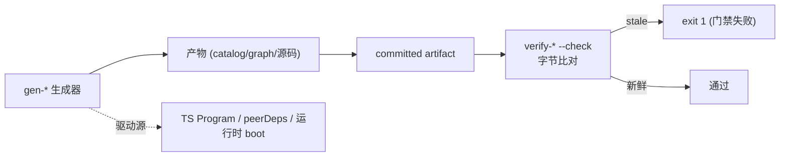

> **定位**：本文深入 DeepSeek Harness 的工程化基础设施——双栈构建、Host/Client 双聚合、门禁调度器、生成式文档闭环、供应商（vendoring）策略、测试矩阵与 CI。读完你将理解「一个 223 包的大型 monorepo 如何用脚本与门禁守住质量」。前置阅读：[00-总览与架构解析]（仓库结构）。
> **代码位置**：`package.json`、`scripts/`、`vendor/`、`vitest.*.config.ts`、`.gitlab-ci.yml`、`lefthook.yml`。

## 一、领域概览：工程化体系在设计上回答什么问题

**设计问题**：一个 223 包的 monorepo，如何让「质量、一致性、可审计」不靠人自觉？本领域的答案是四个工程化支柱——它们的共同设计哲学是：**把纪律写进脚本与门禁，而不是写在 README 里让人遵守**。

DeepSeek Harness 的工程化体系有四个鲜明特征：

1. **构建双栈**：`tsc -b`（Project Reference 发射 JS）+ `tsdown`（打包），分 host/client 双面；
2. **生成式文档**：约 10 个 `gen-*` 生成器 + 同等数量 `verify-*` 新鲜度校验器组成闭环；
3. **三层质量门禁**：lefthook 本地钩子 → `run-gates.ts` 聚合门禁 → GitLab/GitHub CI 矩阵；
4. **供应商（vendoring）**：把 Cordis 框架以源码拷贝进 monorepo，fully own 框架层。

### 本领域的设计哲学（Why）

1. **双 Program 隔离声明合并**——Host 和 Client 双方在同一批 key 下声明合并 Cordis `Context`，放进同一个 ts.Program 会报合并冲突。**为什么**：这是 TS 声明合并的类型系统必然，拆成两个 Program 是唯一干净解。**代价**：`api/remotes` 是唯一 split 的包，需 constraints 门禁守护。
2. **生成式文档 = 单一事实源**——catalog 由源码生成、字节比对新鲜度（stale 即失败）。**为什么**：「文档与代码不漂移」不是靠人校对，而是靠生成器从源码推导 + 校验器比对。**代价**：生成器本身要维护。
3. **三层门禁分工**——本地钩子只做轻量格式化；聚合门禁做全量；CI 矩阵做平台覆盖。**为什么**：把「反馈快慢」与「覆盖广度」分层，开发者本地快速、CI 全量兜底。**代价**：三层都要维护。
4. **vendoring 完全拥有框架层**——Cordis 以源码拷贝进仓库，可审计、可打补丁、版本钉死。**为什么**：框架层是全产品的根基，完全拥有比 npm 依赖更可控。**代价**：维护上游 diff 的成本，用 18 条修改日志 + check-vendor-manifest 制度化。

```mermaid
flowchart TD
    subgraph build["构建"]
        B1["tsc -b tsconfig.host.json"] --> B2["tsdown (host + Typert)"]
        B3["tsc -b tsconfig.client.json"] --> B4["tsdown (client)"]
        B2 --> B5["build:web"]
        B4 --> B5
    end
    subgraph gates["门禁"]
        G0["lefthook (本地)"] --> G1["run-gates.ts 聚合"]
        G1 --> G2["check:all / check:ci 系列"]
    end
    subgraph gen["生成式文档"]
        H1["gen-* 生成器"] --> H2["catalog / graph 产物"]
        H2 --> H3["verify-* --check (stale 即失败)"]
    end
    subgraph test["测试"]
        T1["vitest 单元/双 project"] --> T2["coverage (per-file 100%)"]
        T2 --> T3["snapshot (replay/record/refresh)"]
        T3 --> T4["e2e / web / stress / perf"]
    end
```



## 二、构建体系：双栈 + 双聚合

### 2.1 tsc 先发射 JS，tsdown 再打包

```
build → build:lib → build:lib:host → tsc -b tsconfig.host.json && tsdown --env.DSH_BUILD_FACE host
                    build:lib:client → tsc -b tsconfig.client.json && tsdown --env.DSH_BUILD_FACE client
       → build:web → pnpm --filter @deepseek-ai/dsh-web-frontend run build
```

- `tsc -b` 负责**类型发射**：每个包 Project Reference 把声明 + JS 发射到 `lib/types/`；
- `tsdown` 负责**运行时打包**：两次 tsdown 都消费 tsc 已发射的 `lib/types` JS；
- **`DSH_BUILD_FACE`** 环境变量驱动 Host/Client 两遍；Host 遍挂载 **Typert 插件**（`typertPlugin({mode:'workspace', faces:['host']})`）。

### 2.2 Host/Client 双聚合

`tsconfig.json` 是 solution root（`files:[]` + references），**不是 Program**；`tsconfig.host.json` 与 `tsconfig.client.json` 各是一个完整 Program。**为什么拆**：Host 和 Client 双方都在同一批 key 下声明合并 Cordis `Context` 接口——放进同一个 ts.Program 会报合并冲突（`docs/development.md:56`）。

三条纪律（`development.md:58-61`）：
1. `tsconfig.base.json` 永不设 `include/files`（保持 paths 门面 match-all）；
2. 任何 repo 级 ts.Program 显式以 host/client 之一为种子，绝不 seed solution root；
3. 新包只注册进一个聚合。

> **resolution 门面**：所有 vitest 配置都指向 `tsconfig.base.json` 的 `paths`，使裸 workspace 导入解析到 `src` 而非构建产物——避免 module singleton 双份加载。

## 三、门禁体系：run-gates.ts

### 3.1 调度器

核心抽象（`scripts/run-gates.ts:15`）：`Mode`（14 个命名聚合）、`Gate`（id/label/command/args/needs/env/allowFailure）、`GateResult`。

- **有依赖图的并行调度**：`runGates()` 在调度前 `validateGateGraph()`（查重复 id、未知依赖、环路）；执行时按 `needs` 拓扑就绪才启动，依赖失败则下游 `skipped`。
- **shell-free 子进程**：`pnpmInvocation` 用 `process.execPath` + `npm_execpath` 启动（Windows 无法直接 spawn pnpm.cmd shim）。
- **并发控制**：`check-all`/`doc-sync` 本地模式封顶 4 个 worker（避免多个 doc 门禁各自构建完整 ts.Program 撑爆内存）；可用 `DSH_GATE_CONCURRENCY` 覆盖。
- 最终退出码：任一非 allowFailure 的 failed/skipped 即返回 1。

### 3.2 主要聚合

| 聚合 | 内容 |
|---|---|
| `check:all` | runtime-closure → cordis-config → client-domain-graph → test → issue-management → duplication → snapshot → build → build:web → doc-sync 叶子 → module-graph |
| `ci-primary` | shared static + typert-contracts + typecheck + lint + duplication + coverage + node-compat smokes + snapshot + doc-sync + knip + build + publint + built-invariants |
| `ci-coverage` | 插桩 coverage gate 与 `coverage-exempt-heavy` 并行跑 |
| `ci-snapshot` | build + snapshot |
| `ci-windows-blocking` | build + `docs:build`（生产站点） |
| `node-compat` | typecheck + 4 个 compat smoke |

### 3.3 snapshot 三态

`DSH_SNAPSHOT` 三态（`vitest.snapshot.config.ts:24`）：**replay**（keyless 默认，只回放不写）、**record**（真实 API 更新 fixtures）、**refresh**（回放 committed scripts 更新 expected）。record/refresh 串行，replay 可并行。CI 强制 `DSH_SNAPSHOT=replay` 只读比对。

### 3.4 coverage：per-file 100%

**per-file 100%**（`vitest.config.ts:269`：`perFile: true, statements/branches/functions/lines: 100`）。有庞大的 exclude 列表（types.ts/bin.ts/worker.ts、client GUI 债务豁免（多个 `TODO(gui)`）、typert generator src 等）。自定义 istanbul reporter `coverage-uncovered-locations.cjs` 打印每个未覆盖语句的 `path:line:col`。豁免门禁 `coverage-exempt.ts` 列 4 个重套件。

## 四、生成器 → 校验器闭环

所有生成器共用模式：**`--check` 模式读取 committed artifact 字节比对**，stale 即 exit 1。

| 生成器 | 输出 | 驱动源 |
|---|---|---|
| `gen-module-graph.ts` | `docs/module-graph.md` | 各包 `peerDependencies` 中 `dsh-` 前缀依赖，`package-graph.ts` 拓扑排序 |
| `gen-cordis-catalog.ts` | subsystems 页 `cordis-surface` 区域 + `docs/cordis-api/` | Typert 类型图投影 |
| `gen-tool-catalog.ts` | `docs/tool-catalog.md` | **真实 boot 每个 tool plugin** 收集运行时 schema |
| `gen-config-catalog.ts` | `docs/config-catalog.md` | 入口、config 类型、JSDoc、静态 Schemastery schema |
| `gen-persistence-catalog.ts` | `docs/persistence-catalog.md` + `session/src/known-event-types.ts` | 每个 `SessionEventMap` 声明合并 |
| `gen-third-party-notices.ts` | `THIRD_PARTY_NOTICES.md` | workspace manifests + vendor manifest + pyproject.toml |



设计亮点：

- `gen-tool-catalog.ts` **真实 boot 每个 tool plugin** 收集运行时 schema——「运行时注册是计算 schema 的事实来源」；
- `gen-persistence-catalog.ts` 额外生成**可编译的 TS 源码** `known-event-types.ts`——「文档与运行时共享同一份事实」；
- `gen-client-catalog.ts` 的 `validateSlotContracts` **fail-closed**：不可教的 slot 直接 break gate。

## 五、校验器逐项

| 校验器 | 规则 |
|---|---|
| `verify-mermaid` | 用 mdast 提取所有 ```mermaid``` fence，在 jsdom 里 `mermaid.parse()` 真解析；`maxEdges: 2000`（module graph 合法超过 mermaid 默认 500 边） |
| `verify-runtime-closure` | 校验 Python sdk-runtime 的部署 manifest 含每个 workspace peer 的闭包（BFS） |
| `verify-type-equiv` | ```ts type-equiv``` fence vs manifest 1:1；`normalizeStructure`（逐字）+ `normalizeJSDoc`（每条注释相等）双维比对 |
| `verify-cordis-config` | Loader entry 根必须是数组；元数据字段必须全静态，`!!js` 只允许在 `config`/`disabled`；source-plane resolution 必须经 tsconfig.base paths 解析到 `.ts/.tsx` |
| `verify-md-links` | 相对链接目标存在 + `#fragment` 命中真实 heading slug |
| `verify-package-invariants` | 每个包必须有 `src/invariant.ts` 伴生，命名导出 name/inject/apply、无 default export |

## 六、供应商体系（vendoring）

`vendor/README.md:3-5`：把 Cordis 框架及其基础库**以源码拷贝**进 monorepo，而非 npm 依赖，使 harness *fully owns its framework layer (auditable, patchable, pinned)*。

| 目录 | npm 名 | 上游 | 版本 |
|---|---|---|---|
| cordis | `@deepseek-ai/cordis` | cordis | 4.0.0-rc.7 |
| loader | `@deepseek-ai/cordis-plugin-loader` | @cordisjs/plugin-loader | 1.0.0-rc.5 |
| include | `@deepseek-ai/cordis-plugin-include` | @cordisjs/plugin-include | 1.0.4 |
| group / timer / hmr / logger-console | 同名 | @cordisjs/plugin-* | 各版本 |
| cosmokit / schemastery | 同名 | 上游 | 1.8.1 / 3.18.0 |

**rescope 机制**（`rescope-vendor.ts` codemod）：所有包重命名为 `@deepseek-ai` scope——发布即连带发布这一框架层，用上游名字发布会在 registry squat 上游名。目录名与版本号保持不变，manifest 仍可读作上游快照。

**本地修改日志**：`README.md:31-50` 记录 **18 条**逐条 divergence（如 `cordis/src/fiber.ts` 生命周期加固、`include` 的 `applyPatches` 导出 + patch 语义、Schemastery 特殊 `exports` 映射）。**check-vendor-manifest.sh** 把「改 vendor src 必须同步改 README」变成 staged diff 强制。

> **架构师视角**：vendoring 是「完全拥有框架层」的激进选择——可审计、可打补丁、版本钉死，代价是维护上游 diff 的成本。**check-vendor-manifest.sh** 把这份维护成本制度化。

## 七、测试体系

### 7.1 vitest 配置矩阵

- **`vitest.config.ts`**（unit）：**双 project**——`thread-safe`（默认）+ `process-bound`（涉进程全局状态/时序 I/O，单独隔离）；全部 `pool:'forks'`（Node 24 worker 线程 CJS lexer 崩溃规避）；Windows 排除 bash 系与 subprocess 套件。
- **`vitest.snapshot.config.ts`**：`scripts/**/*.snapshot.ts` + apps/cli + examples 快照。
- **`vitest.e2e.config.ts`**：real-API，`retry: 2`、`testTimeout 120s`。
- **`vitest.web.config.ts`**：apps/web 的 e2e + snapshot，串行共享一个 browser。
- **stress / perf**：opt-in 手工诊断，不进 CI。

### 7.2 测试层级

```
Unit → Coverage gate (per-file 100%) → Real-API e2e → Snapshot → Web browser → stress/perf (手工)
```

### 7.3 test-support 包

- `llm-mock-server`：可脚本化的 OpenAI 兼容 HTTP/SSE 假服务器（每请求消费一条配置行为）；
- `llm-replay`：从 session JSONL 重建模型流（keyless 快照的核心）；
- `agent-loop-testkit`：按依赖序装载 LLM/session/system-prompt/tool/agent 服务；
- `acp-snapshot`：ACP 快照套件工厂。

## 八、CI

### 8.1 GitHub Actions（`.github/workflows/ci.yml`）

PR 必过 7 个 job，由 `all-checks-passed`（`if: always()`）聚合，**分支保护只要求这一个检查**：

1. **node-24**（static）：`check:ci:static`
2. **node-24-coverage**：`check:ci:coverage`
3. **node-24-consumers**：`check:ci:consumers`（唯一 Linux build，含 Playwright）
4. **node-compat**：matrix 22.19 / 26
5. **python-sdk**：uv pytest keyless 全量
6. **python-runtime**：Linux x64 release-shape
7. **windows**（**Wine 门禁**）：真实 win-x64 Node 在 Linux + Wine 下跑 build + docs:build

另有 `windows-native`（真实 Windows runner，**故意不在 `all-checks-passed.needs`**——独立结论、不拖延 verdict）、`failover`（托管池 ↔ 自托管池一键切换）、`benchmark`（4→96 核 runner 容量）。

### 8.2 GitLab CI（`.gitlab-ci.yml`）

仅 **Python SDK 发布**（tag 匹配 `python-v*` 才触发）：sdk-wheel → 三平台 runtime wheel → publish-python（twine 上传 GitLab PyPI）。含 GLIBC ≤ 2.28 检查与 macOS deployment target 校验。

### 8.3 lefthook 本地钩子

pre-commit：translation-pairing → archived agent notes → lint（`--fix` + `stage_fixed`）→ **third-party notices 重新生成**（regenerate 而非 reject）→ whitespace → vendor manifest guard。pre-push 只跑 `typecheck`。**钩子刻意不跑测试/快照/构建**——由 CI 兜底。

## 九、文档工程

### 9.1 生成式文档分层

- **generated**：module-graph、tool-catalog（纯生成）；
- **hybrid generated**：capability-seams、app composition、event matrix（source + 手写 manifest）；
- **curated**：agent-lifecycle、tool-execution-pipeline。

识别法：文件头 `<!-- Generated by scripts/XXX.ts — do not edit by hand -->`。

### 9.2 doc-typecheck

编译 Markdown 的 ```ts``` fence（`doc-typecheck.ts`）。fence info 分 5 类：`ts`(check)、`ts ignore-check`、`ts type-equiv/public-api`、`ts cordis-catalog`、`ts persistence-catalog/config-catalog`。**ignore 比例守卫**：`denominator≥4 且 ratio>0.5` 即失败——「逃生舱不得成为常态」。

### 9.3 i18n 中英配对

**一对三文件**：`foo.md` + `foo.zh.md` + `foo.i18n.yaml`（记录两侧 git blob hash）。`verify-translation-pairing` 机械强制：三件齐全、当前 blob == 记录、语言切换器、结构签名镜像（heading 深度/列表类型/表格行列/链接目标逐对匹配）。

## 十、设计决策（Why / 代价 / 选择依据）

**D1. 双 Program 隔离声明合并**
- **Why**：Host/Client 双方在同一批 key 下声明合并 Cordis `Context`，放进同一个 ts.Program 报合并冲突——拆成两个 Program 是 TS 声明合并的类型系统必然。
- **代价**：`api/remotes` 是唯一 split 包，需 constraints 门禁守护「新包只注册进一个聚合」。
- **选择依据**：不是「想拆」，而是「必须拆」——理解类型系统约束是架构决策的前提。

**D2. 生成式文档 = 单一事实源**
- **Why**：catalog 由源码生成、字节比对新鲜度（stale 即失败）——「文档与代码不漂移」靠机制而非校对。
- **代价**：生成器本身要维护、要进门禁。
- **选择依据**：文档与代码的漂移是长期项目最大的隐性技术债；生成器 + 字节比对是治本方案。

**D3. vendoring 完全拥有框架层**
- **Why**：Cordis 以源码拷贝进仓库——可审计、可打补丁、版本钉死；rescope 重命名防 registry squat。
- **代价**：维护 18 条本地 diff 的成本，需 check-vendor-manifest 制度化「改 vendor src 必须同步 README」。
- **选择依据**：框架层是全产品根基，「完全拥有」比「依赖漂移」更可控——激进但自洽。

**D4. snapshot 三态 + CI 只读**
- **Why**：replay（回放）在 CI 强制、record（记录）仅本地——防止快照被悄悄更新。
- **代价**：开发者要理解三态语义。
- **选择依据**：快照测试的经典陷阱是「改实现顺便更新快照」；CI 只读 + 本地记录把「故意更新」与「意外漂移」区分开。

**D5. coverage per-file 100%**
- **Why**：比整体阈值更硬——每个文件的每行都必须被覆盖到，只有显式豁免白名单可逃。
- **代价**：重套件要进豁免门禁。
- **选择依据**：整体覆盖率能被「覆盖好的文件」掩盖「完全没测的文件」；per-file 把「没测的文件」暴露出来。

## 十一、转译到 Spring AI / Java 生态

| DeepSeek Harness | Java/Spring AI 对应物 | 启示 |
|---|---|---|
| 生成式文档（gen-* → verify-* 闭环） | Asciidoc 文档生成 | 「文档由代码生成、stale 即失败」让文档与代码同源 |
| run-gates 有依赖图并行调度 | Maven/Gradle 多模块门禁 | 拓扑就绪才启动、依赖失败则跳过——比线性脚本可控 |
| per-file 100% coverage | JaCoCo 行覆盖 | per-file 阈值 + 显式豁免白名单比整体阈值更硬 |
| snapshot replay/record/refresh | 黄金文件测试 | 「CI 只读回放、本地记录」防止快照漂移 |
| vendoring + rescope | 内嵌依赖 / shade 插件 | 完全拥有框架层的成本与收益权衡（对应 [附录 10-架构决策方法论]） |
| verify-mermaid 本地解析 | 文档校验脚本 | Mermaid 也能进 CI 门禁——图表正确性可自动验证 |

> **适用场景**：要设计大型 monorepo 的质量体系（构建/门禁/生成式文档/CI）。
> **不适用场景**：单模块、小型项目（这套体系成本过高）。

## 十二、总结

本文拆解了 DeepSeek Harness 的工程化四支柱：**双栈构建**（tsc 发射 + tsdown 打包、Host/Client 双 Program）、**聚合门禁**（run-gates 有依赖图并行调度、per-file 100% 覆盖率、snapshot 三态）、**生成式文档闭环**（gen-* → verify-* stale 即失败、doc-typecheck 编译文档中的代码）、**供应商策略**（vendoring + rescope + 18 条本地修改日志制度化）。这套体系回答了「223 个包的 monorepo 如何保持高质量、可审计、不漂移」——答案是**把纪律写进脚本与门禁，而不是靠人自觉**。

> **定位回顾**：本文是系列的「工程化」篇，也是收尾篇。至此，从 [00-总览] 到 [10-工程化]，DeepSeek Harness 的全量代码分析闭环完成。
