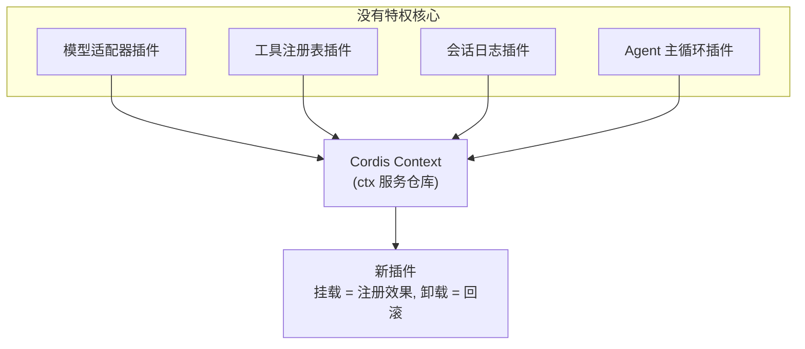
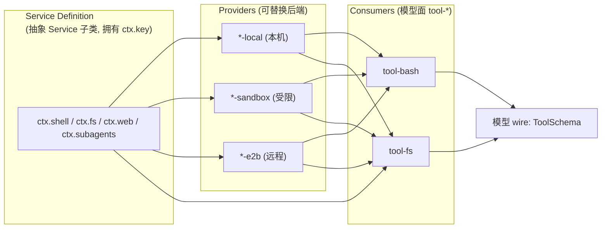
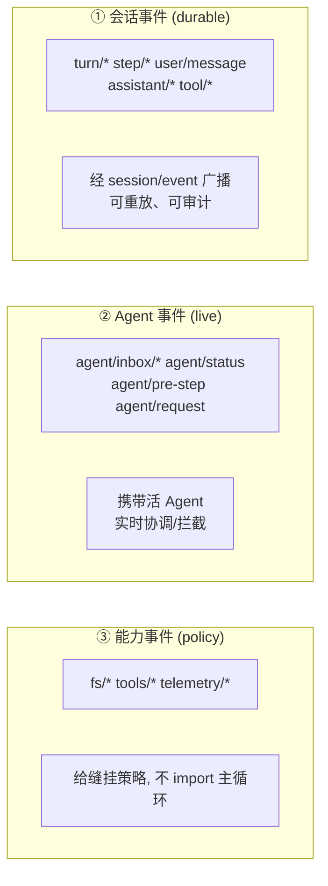
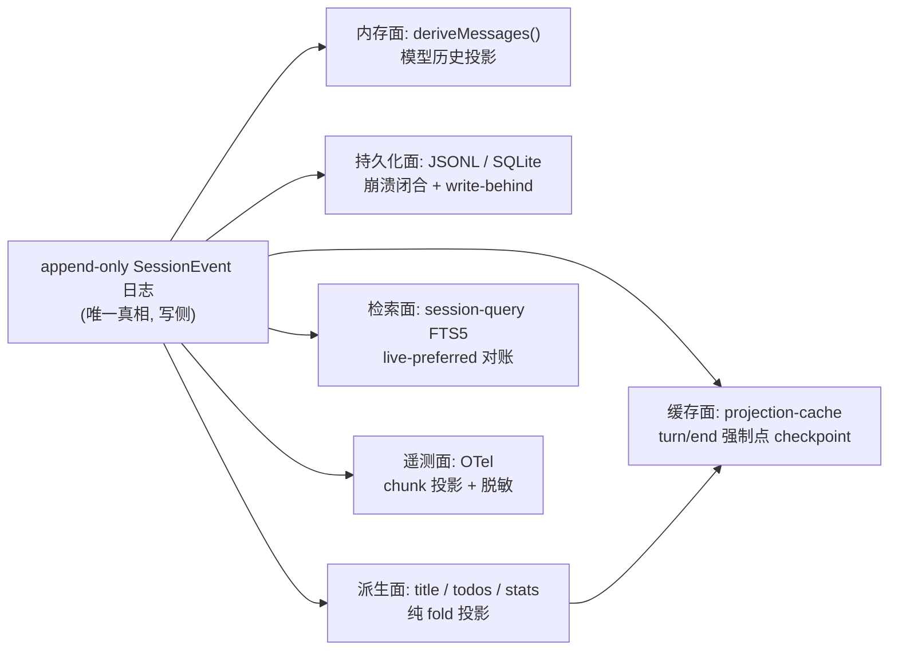
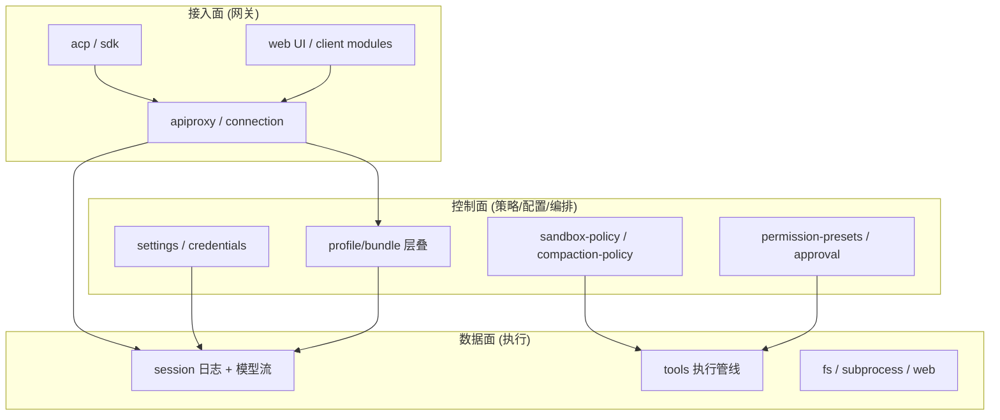
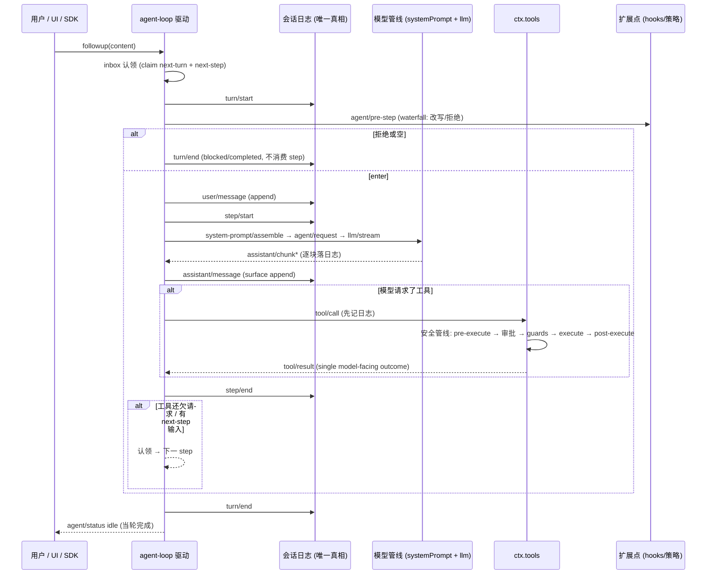
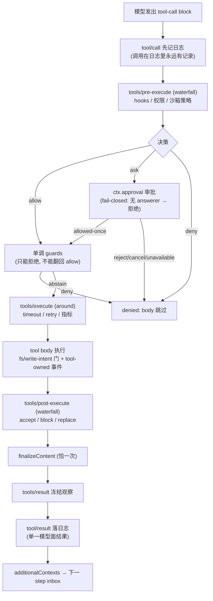
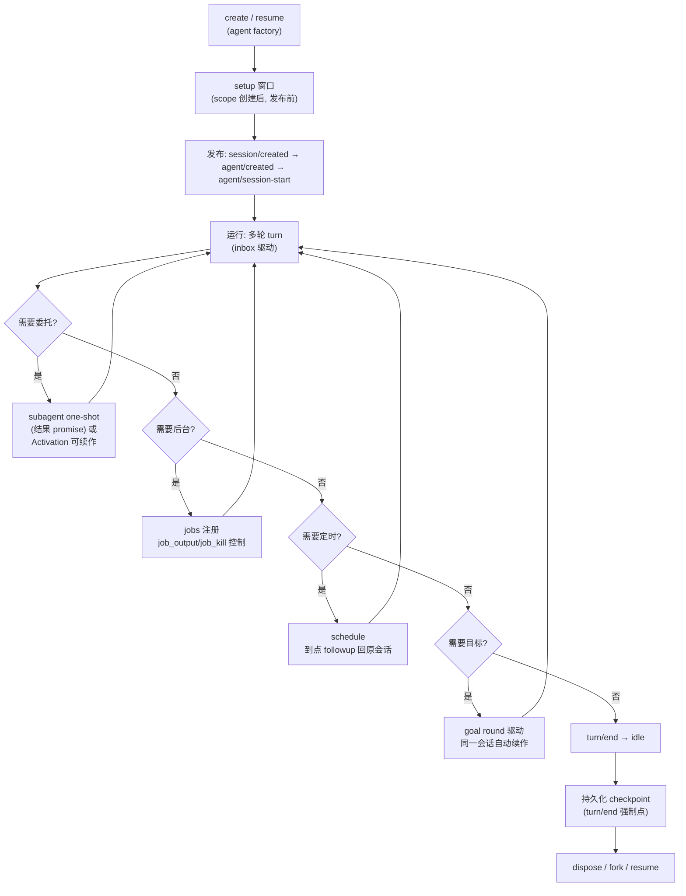

> **定位**：本文是 DeepSeek Harness 代码分析系列的**收尾合成篇**。前 11 篇（00-10）按子系统横向展开，本文把它们纵向拧成一条设计叙事——**五条核心设计哲学（Why）、四大架构模式（How）、一条完整旅程（实现逻辑 What）**。读完你会获得「这套系统为什么这样设计、架构如何组织、一条消息如何跑完」的整体心智。前置阅读：建议先读 [00-总览与架构解析] 至 [10-工程化体系与研发效能] 中的任一篇，让抽象原则有具体参照物；但本文自洽，直接读亦可。
> **一句话核心**：DeepSeek Harness 用「**一切皆插件 + 会话日志即真相 + 能力可整体替换 + 状态由数据推导 + fail-closed**」五条哲学，把「可扩展、可重放、可治理、可编排」做进了系统骨架，而不是靠人自觉。

## 一、这套系统在回答什么问题

先退一步问：Agent 框架为什么难做生产级？因为要同时满足四个互相拉扯的诉求：

| 诉求 | 含义 | 冲突点 |
|---|---|---|
| **可扩展** | 加模型、加工具、加策略，都不动核心 | 扩展点越多，核心越容易被「打补丁」式污染 |
| **可重放** | 会话状态能完整重建（崩溃恢复、审计、回放） | 状态一多，重建就不可信 |
| **可治理** | 安全、审批、成本、合规全程可控 | 治理插桩越多，主流程越笨重 |
| **可编排** | 子代理、后台任务、定时、工作流、目标 | 编排能力与单 Agent 循环纠缠 |

DeepSeek Harness 的答案不是「在每个诉求上加一个模块」，而是用**一套相互咬合的哲学**同时解决四个诉求。理解这套系统，本质是理解这套咬合关系，而不是记住 223 个包。

## 二、五条核心设计哲学（Why）

### 哲学一：一切皆插件——没有特权核心

> 「There is no privileged core to patch: you extend dsh by mounting a plugin beside the others, and registrations are effects that unwind when their plugin unloads.」—— `docs/architecture.md:11`

**为什么**：模型适配器、工具注册表、会话日志、Agent 主循环本身都是插件。这消灭了「核心 + 扩展」的边界博弈——不存在「我要的功能进不了核心」或「核心被补丁打烂」的问题。扩展 dsh = 在旁边挂一个插件。

**代价**：抽象成本陡峭。新人要同时理解 Cordis（ctx/inject/事件/effect）才能写任何插件。**选择依据**：对于「框架层高度复用 + 能力极多」的产品，把扩展成本前置是划算的；对小型应用则过度设计。

**如何落地**（详见 [01-Cordis插件范式与运行时]）：
- `ctx.<key>` 服务仓库——插件通过 key 找服务，零静态依赖；
- `inject` 声明服务依赖——加载顺序由服务需求表达，而非手工 boot 排序；
- `ctx.effect()` 可逆注册——卸载即回滚，热装/灰度成为内置能力。

### 哲学二：会话日志即真相——Model-visible means logged

> 「Anything that reaches a model request must be reconstructable from the log, and a runtime invariant asserts it.」—— `docs/architecture.md:94`

**为什么**：所有模型可见的输入都能由日志重建，且这条铁律被**运行时不变式守护**（`ctx.invariants`）。这意味着：崩溃恢复、审计回放、会话 fork、标题生成、统计、搜索、遥测——**一切派生状态都是日志的投影，而不是第二份真相**。

**代价**：追加式 + 不可变日志，删除/修改必须用 surface `replace` 语义；读取要 fold。**选择依据**：当「可重放、可审计、可恢复」是硬需求时（生产 Agent 几乎总是），事件溯源是正解；如果只是单轮对话，这是过度设计。

**如何落地**（详见 [02-核心引擎与Agent生命周期] [03-会话·上下文·记忆与持久化]）：
- `SessionEvent` 追加日志 + `deriveMessages()` 投影模型历史；
- `surface` 层把「模型看到的」与「用户看过的」分离（append vs replace）；
- 持久化三后端、投影缓存、标题、统计、遥测全部从日志 fold。

### 哲学三：能力缝——定义/提供者/消费者三分离，可整体替换

**为什么**：一个能力（Shell、文件系统、子进程、Web、子代理）有三类关注点——接口定义、具体实现、模型面暴露。把它们分到三个角色（且通常是三个包），换来的是：**换一个提供者，整个产品的执行世界随之改变，而模型提问方式不变**。文件系统与子进程共享同一执行世界，把它们指向远程 E2B 沙箱，Bash、PTY、LSP 全跟着移过去，无需为每个消费者 fork 实现。

**为什么定义是抽象类而非 interface**：Cordis 服务需要把 `ctx.<key>` 挂到运行时 context 上并携带生命周期，抽象类承载这些；且词汇表类型随定义发布，实现者无法私下改契约。

**代价**：一个简单能力也被拆成三个角色三套包。**选择依据**：「提供者会变」的能力才值得缝；一成不变的能力拆了纯属增加体积。

### 哲学四：状态由数据推导——绝不维护第二套状态机

**为什么**：这是本系统最容易被忽视、却最能体现工程成熟度的一条。多处关键状态**不单独存储，而是从日志/数据折叠推导**：

- Agent 的 inbox 状态从 `agent/inbox/*` 持久事件重建；
- 子代理的 Activation 驻留态（running/waiting/settled）从「Agent quiescence + owned-child set」推导，**不维护第二套状态机**；
- 沙箱模式、审批策略、权限预设都是 log-only 会话事件，折叠=重放；
- compaction 的锁用「无配对的 `compaction/start`」从日志检测。

**为什么**：第二套状态机是「状态不一致」的温床——内存态和日志态漂移，崩溃后无法恢复。**让数据当唯一权威**，状态只是数据的投影，重放即自洽。

**代价**：折叠有计算成本；因此系统配套了「投影缓存、写缓冲、冷读阶梯」来摊薄（详见 [03-会话·上下文·记忆与持久化]）。

### 哲学五：fail-closed + 敌意 peer 心态 + 显式优先

**为什么**：Agent 框架天然面对不可信输入（模型输出、子进程输出、远端文件、MCP 工具）。三条子原则贯穿所有子系统：

| 子原则 | 含义 | 例子 |
|---|---|---|
| **fail-closed** | 无法保证安全就拒绝执行，绝不静默直通 | 沙箱无 backend → 抛 `SANDBOX_UNAVAILABLE`；Landlock 内核不执行 → 不 exec；审批无 answerer → `unavailable` |
| **敌意 peer 心态** | 把外部进程/消息当作可能伪造的来源 | code-runtime 逐字段重建 worker 消息；subprocess env 先 scrub 再显式合并；PID 校验拒绝 `<=1` |
| **显式优先** | 默认值属于实现，spec 全必填 | `ShellExecSpec` 全必填；凭据空值处处视为不存在；沙箱升级必须先变宽校验 |

**代价**：安全第一意味着「更多拒绝」——模型偶尔需要走审批/升级才能完成操作。**选择依据**：对于「模型可能执行任意代码」的生产 Agent，这是不可妥协的地板。

## 三、四大架构模式（How）

### 模式一：事件驱动——三事件域 + 四分发模式

事件是扩展点。系统把事件分成三个域（`docs/architecture.md:53`）：

而每个事件又按 **`emit`（观察）/ `waterfall`（around 中间件）/ `parallel`（扇出）/ `serial`（顺序）** 四种模式分发——四种模式覆盖了扩展的全部形态，被类型系统统一建模（详见 [01-Cordis插件范式与运行时]）。

**架构含义**：这条主线的两端——`durable` 与 `live`——是系统最核心的分工：**SDK 重放读 `session/event`，实时协调用 `agent/*`**。UI/hooks/orchestrator 全部以事件为契约，不 import 主循环。

### 模式二：事件溯源 + CQRS 读取面

会话日志是唯一真相（CQRS 的写侧），所有读取都是投影（CQRS 的读模型）：

**架构含义**：写侧只有一个入口（`Session.append`），读侧可以有任意多个投影。三个关键保证：

1. **缓存永不超前日志**（先 checkpoint 再 flush）；
2. **提交即成功**（observer 失败不影响 append）；
3. **崩溃安全优先于实时**（孤儿 turn 合成 `interrupted` 闭合而非截断）。

这套「单写多读 + 投影」正是事件溯源 + CQRS 在生产级 Agent 会话上的完整落地（详见 [03-会话·上下文·记忆与持久化]）。

### 模式三：缝（端口-适配器）——能力的可替换性

能力缝是「端口-适配器」架构的 Cordis 化：定义是端口，提供者是适配器，消费者通过端口依赖适配器。关键纪律：

- **一个角色不足以构成缝**——只写一个抽象类不算设计了一个能力；
- **提供者注册「能力」而非工具**——模型面 schema 唯一归属 `tool-*` 消费者，所以换提供者不改变模型提问方式；
- **事件门替代方法注入**——fs 策略以 `fs/*` waterfall 存在，删掉策略插件工具仍能裸跑。

### 模式四：Control/Data 平面思想

虽然 dsh 没有 Java 语境下严格的「管控分离」微服务（它大部分是单体进程），但它内部确实贯彻了控制面与数据面的思想：

| 平面 | dsh 对应物 | 说明 |
|---|---|---|
| **控制面** | profile/bundle 组合、settings、credentials、permission-presets、approval、sandbox-policy | 配置/治理/编排/策略，全部 log-only 事件溯源 |
| **数据面** | session 日志、llm stream、tools 执行、fs/subprocess | 推理/执行/检索 |
| **接入面** | host/apiproxy、web、client、acp、sdk | 网关与引擎分离，传输无关 |

## 四、实现逻辑全景：一条消息的完整旅程

这是本文最重要的部分——把 [02] 的状态机、[03] 的持久化、[04] 的工具、[05] 的安全、[06] 的编排、[07] 的接入**纵向串起来**。

### 旅程一：一次完整回合（turn）

**读懂这张图的三个关键**：

1. **凡模型可见必落日志**——`user/message`、`assistant/chunk`、`tool/result` 都是 durable 事件；`agent/*` 只是实时控制信号，重放只信日志；
2. **turn 是「零或多个 step」**——模型要工具，就再开一个 step；工具结果带 `concludesTurn` 或模型自然停止才关 turn；
3. **扩展点全在事件上**——`agent/pre-step`（模型看到什么）、`tools/*`（工具执行）、`agent/turn-stopping`（终止检查）都不 import 主循环。

### 旅程二：一次工具调用的安全管线

工具调用是「模型发出 → 安全决策 → 执行 → 后处理 → 结果落日志」的完整纵深：

**读懂这张图的关键**：工具的**安全与策略完全外置**——pre/post 是 waterfall（可 ask/deny/allow/block），guards 是单调的（deny 不可翻回），approval 是一次性决策。工具本身不关心策略，策略插件不 import 工具。这就是「治理不污染执行」的实现方式。

### 旅程三：Agent 的完整生命周期

**读懂这张图的关键**：编排（委托/后台/定时/目标）全部是**挂在 `agent/*` 事件与 inbox 之上的外层策略**，不修改主循环。主循环只做一件事：**认领输入 → 驱动 step → 记录日志**。

## 五、跨包设计模式库（实现逻辑的通用手法）

这些模式在多个子系统反复出现，是「实现逻辑」层面的通用语法：

| 模式 | 含义 | 出现位置 |
|---|---|---|
| **双轨事件** | durable 事实走 `session/event`（可重放），live 控制走 `agent/*` | 全程 |
| **提交即成功** | observer 失败逐监听器记日志，不改变已提交操作 | session/credentials/settings |
| **包含式回调** | 一个 listener 抛错不饿死后续监听 | `agentEvents`、`commands/change` |
| **durability → memory → event** | 写先落介质，再改内存，最后发事件 | storage-domain |
| **缓存永不超前日志** | 先 checkpoint 再 flush，读侧绝不领先写侧 | projection-cache、message-feedback |
| **shadow-price 协议** | 紧邻替换事件定价被影范围，纯消费者零状态扣减 | compaction |
| **正交结果独立上报** | `timedOut`/`signal`/`exitCode` 各自独立，永不嵌套 | subprocess/shell |
| **prepend 不绕过铁律** | `never` 策略在 waterfall 之前判定 | approval |
| **状态引用即变化信号** | `Object.is` 门控变化通知 | projection |

## 六、与 Spring AI / Java 生态的架构对照

| 维度 | DeepSeek Harness | Spring AI | 架构师启示 |
|---|---|---|---|
| 扩展机制 | 事件 + 可逆注册 | Bean + Advisor 链 + `@Tool` | 事件化扩展比 AOP 链更细粒度、更可逆 |
| 会话真相 | 事件溯源日志（Model-visible means logged） | ChatMemory 内存态 | 把「可重放」做进不变式，是生产级会话的地基（[教程 25-历史记录持久化与合规]） |
| 能力组织 | 缝三分离（定义/提供者/消费者） | SPI + `@ConditionalOnProperty` | 换提供者不换模型面（[教程 20-管控分离架构]） |
| 治理插桩 | 工具管线外置（pre/guards/execute/post） | Advisor 链 | 「治理不污染执行」的实现范式（[教程 14-Advisor链与拦截器]） |
| 编排 | inbox + 事件上的外层策略 | 手写循环 / agentic 模块 | 主循环只认领-驱动-记录，编排全在事件上（[教程 36-Agent工作流编排]） |
| 安全 | fail-closed + allow-list 沙箱 | 需自行设计 | 沙箱黄金法则是「未授予即拒绝」（[教程 31-安全与权限控制]） |

> **适用场景**：想系统性学习「生产级 Agent 框架的设计哲学与架构模式」的架构师；想把自己的 Spring AI 系统从「API 用法」提升到「架构决策」。
> **不适用场景**：只想快速了解某个包的 API 细节（应读 [02]-[10] 对应分册）。

## 七、总结

本文把 11 篇横向的子系统分析拧成了一条纵向的设计叙事：

- **五条哲学（Why）**：一切皆插件、日志即真相、能力可整体替换、状态由数据推导、fail-closed——它们互相咬合，共同回答了「可扩展、可重放、可治理、可编排」四个生产级诉求；
- **四大模式（How）**：事件驱动（三域 + 四分发）、事件溯源 + CQRS 读取面、缝（端口-适配器）、Control/Data 平面；
- **一条旅程（What）**：一条消息 → turn → step → 模型 → 工具 → 安全 → 编排 → 持久化，全链路如何跑通，扩展点全在事件上、真相全在日志里。

回到开头的问题：**dsh 为什么这么设计？** 因为它的目标不是「让写 Agent 更简单」，而是「让 Agent 系统的复杂度可扩展、可审计、可治理」。五条哲学是这套复杂度的「约束器」——没有特权核心，所以扩展不乱；日志即真相，所以恢复可信；能力可替换，所以演进不破；状态由数据推导，所以重放自洽；fail-closed，所以默认安全。

> **定位回顾**：本文是系列收尾。至此你已拥有两套视图：横向（[00]-[10] 按子系统的百科全书）与纵向（本文按设计主线的合成叙事）。学习建议：先读本文建立整体，再按需下钻到对应分册。
