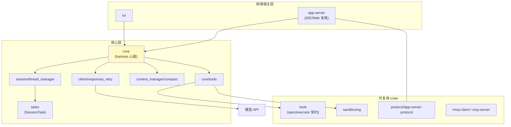
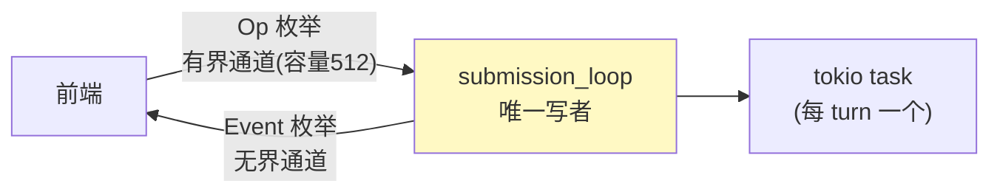
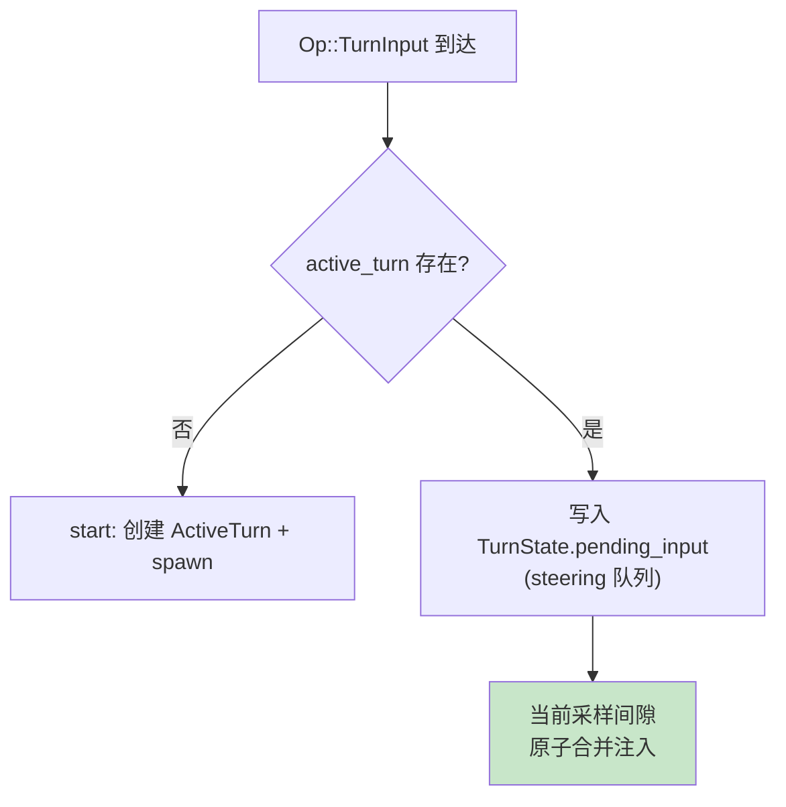
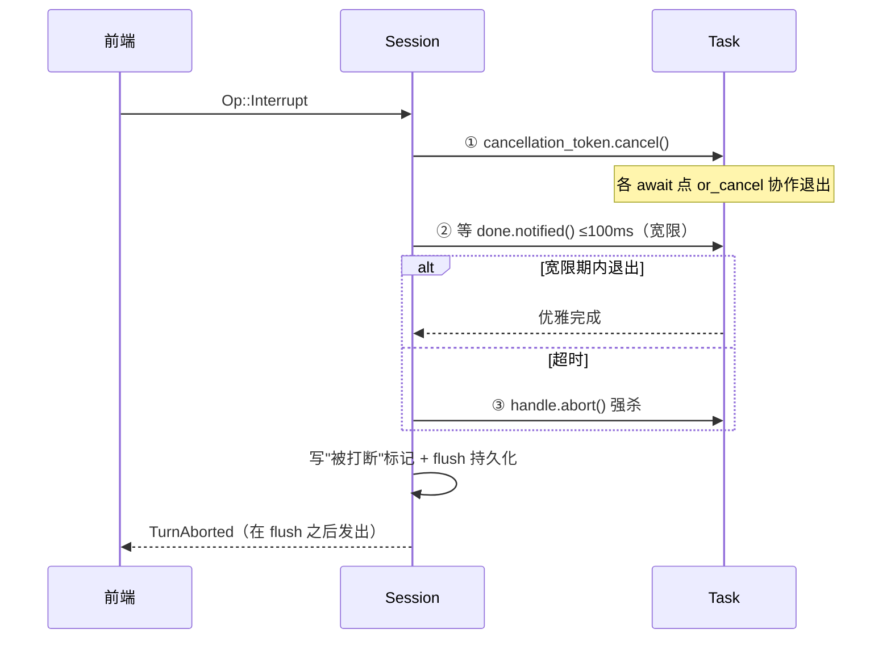

# 00-Codex Harness 总体架构与会话 Actor：harness 的最小正确骨架

> **定位**：codex harness（`codex-rs/`，Rust 实现）是包裹 LLM 的运行时骨架——模型只决定"下一次说什么"，驱动循环/执行工具/管上下文/保安全/上报状态的全部机制都是 harness。本系列逐层解析并**转译到 Spring AI / Java 生态**。本篇讲总体架构与"心脏"：单写者会话 Actor 与 Turn 生命周期。读者画像：要设计 Agent 会话引擎的 Java 架构师。锚点：[教程 12-Agent状态管理]、[教程 40-长任务持久化与中断恢复]、[教程 19-流式工具调用与事件协议]。分析来源：codex-rs 源码行级分析（行号文内标注，基于分析时版本，升级后以实测为准）。

---

## 一、什么是 harness：职责边界

模型 API 的语义只有一件事：给定消息序列，返回下一段输出（文本或工具调用意图）。**其余一切都是 harness 的责任**：

| harness 职责 | codex 对应模块 | 本系列篇目 |
|-------------|---------------|-----------|
| 驱动主循环（采样→工具→回填→再采样） | `core/src/tasks/regular.rs` | 00/03 |
| 会话状态与并发管理 | `core/src/session/` | 本篇 |
| 工具定义/装配/执行 | `core/src/tools/` + `tools/` crate | 01 |
| 审批与沙箱 | `core/src/tools/orchestrator.rs` 等 | 01 |
| 上下文管理与压缩 | `core/src/context_manager/`、`compact*.rs` | 02 |
| 持久化与崩溃恢复 | rollout（JSONL） | 02 |
| 模型客户端/重试/多 provider | `core/src/client.rs` 等 | 03 |
| 前端协议（多宿主复用） | `app-server-protocol` | 03 |

**为什么值得 Java 架构师学**：这套职责切分对任何形态（Web 后端/CLI/IDE 插件/多 Agent 平台）都成立——Spring AI 给了你 ChatClient 和工具调用，但会话引擎、取消语义、审批缓存、上下文压缩这些"骨架"，框架不管，全要自建。

## 二、crate 拓扑（分层职责）



分层要点：**宿主（TUI/IDE/Web）只通过协议层消费事件**，核心层不依赖任何宿主——一个后端进程服务多前端，这正是"管控分离"思想在单机尺度上的体现（对照 [教程 20-管控分离架构]）。

## 三、会话 Actor：单写者 + 双通道

`Session::spawn`（`session/mod.rs:466`）的三步：



1. **命令通道有界（512）**：前端提交过快时 `send().await` 挂起而非 OOM——天然反压；
2. **事件通道无界**：UI 状态不能缺块，事件绝不因背压丢失；
3. 前端只握有 `SessionIo`（`mod.rs:367`）= `Sender<Submission> + Receiver<Event>`——**封装边界即并发边界**，前端摸不到内部状态。

`submission_loop`（`handlers.rs:515`）串行 match 分发 `Op` 枚举（Interrupt/UserInput/各类审批应答/Compact/Rollback/Shutdown…）。**单消费者**让"读 active_turn → 决定 start/steer → 写 turn state"天然原子——不需要锁。

## 四、SessionTask：异构工作的统一生命周期

对话、压缩、review、shell 四类异构任务实现同一 trait（`tasks/mod.rs:187`）：

```rust
trait SessionTask {
    fn kind(&self) -> SessionTaskKind;   // Regular/Compact/Review/UserShell
    async fn run(self);
    fn abort(&mut self, reason: AbortReason);
}
```

**所有任务在同一个 spawn 点收尾**（`on_task_finished`，`tasks/mod.rs:571`）：统计、历史落盘、终态事件、idle 钩子零遗漏。加一种任务类型只需实现 run/abort，生命周期事件"免费"获得——这是开闭原则在会话引擎上的直接应用。

## 五、Steering：第三条路

用户在模型思考中途补充输入（"改成用 Rust"），harness 怎么办？



（`session/turn_input.rs:141`）Steering 比"打断重开"（丢工作）和"排队忽略"（丢输入）都好：**不打断也不丢失**。配套的 `MailboxDeliveryPhase`（CurrentTurn/NextTurn）状态机裁决"子代理来信到达时本轮还能不能吸收"——答案已展示给用户后的迟到消息归下一轮，避免模型行为与用户所见不一致（`state/turn.rs`）。另有**自动唤醒**：空闲会话被队列中带 trigger 的消息自动开新 turn（`tasks/mod.rs:490+`）。

## 六、三段式取消（interrupt 语义的工程答案）

`Op::Interrupt` → `interrupt_task`（`session/mod.rs:4149`）：



三条纪律：**全链路 await 点套 or_cancel**（否则协作取消形同虚设）；**AbortOnDropHandle** 防任务泄漏；**持久化先于终态事件**——崩溃后重放转录时不会出现"被中止了却查无此事"的不一致。

## 七、转译到 Spring AI / Java 生态

| codex 机制 | Java/Spring AI 对应 | 转译要点 |
|-----------|--------------------|---------| 
| 单写者 actor + 双通道 | WebFlux 下用 `Sinks.Many`（事件）/`阻塞有界队列`或 Reactor `Flux.create(requestN)` 反压（命令）；单写者=串行化的 `flatMap(i -> ..., 1)` 或 dedicated scheduler 上的循环 | 命令通道有界可用 `ArrayBlockingQueue` + 单消费者线程（虚拟线程承载）；Op/Event 枚举 = sealed interface（Java 21），与 [教程 19] 的 AgentEvent 同构 |
| SessionTask trait | Java 接口 `SessionTask { Kind kind(); Mono<Void> run(); Mono<Void> abort(AbortReason); }` | 收尾单点：所有任务经同一 `doFinally` 统一钩子 |
| 三段式取消 | Reactor 无 CancellationToken：① `Disposable.dispose()`/`takeUntil(cancelSignal)` ② `block(Duration.ofMillis(100))` 宽限 ③ dispose 强停 | 持久化先于终态事件 → `concat(persist(), emitFinal())` 保序 |
| Steering | 会话级 pendingInput 队列 + 工具回填间隙合并（`concatMap` 内检查） | Spring AI 的 stream 工具循环间隙是注入点 |
| AbortOnDrop | Java 无 RAII：用 try-with-resources 包 Disposable，或 PhantomReference 兜底（通常省略） | — |

**最小骨架清单**（新会话引擎 cold start，转译版）：Op/Event 枚举 → 有界命令+无界事件+单写者 → SessionTask 接口+单点收尾 → 三段取消 → 持久化先于终态。

## 八、检验方式

- 对照自查：你现有系统的"取消"是哪一段？（多数项目只有第③段强杀）
- Steering PoC：流式回答中途追加输入，验证不打断且下一间隙合并。

**下一篇**：[01-工具子系统与审批沙箱](01-工具子系统与审批沙箱.md)。
