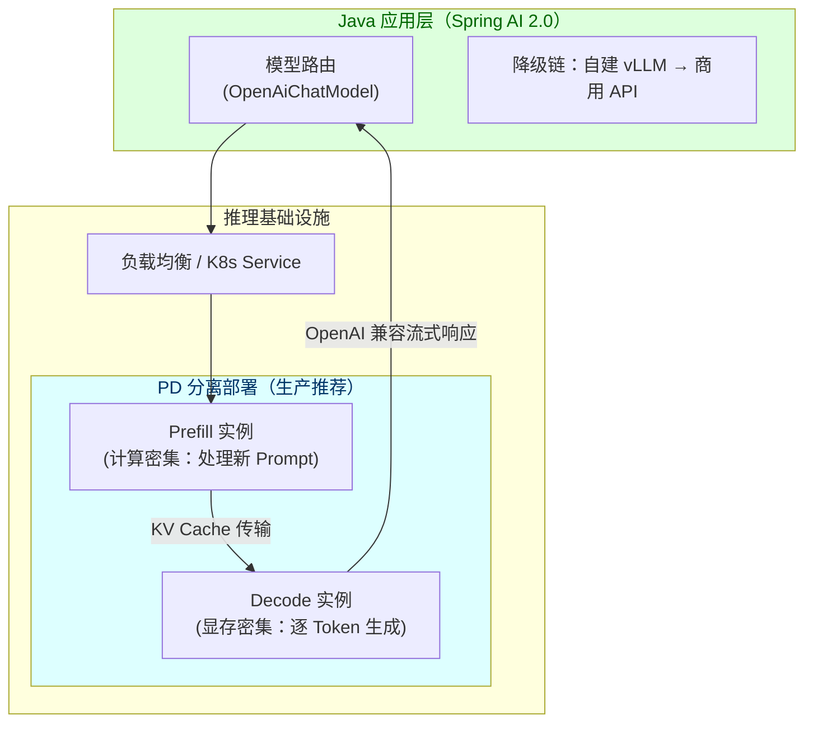

# vLLM 推理服务与 Spring AI 集成

> **定位**：本文是 [教程 44-多模型协作与供应策略]「自建 vs 商用」决策的自建侧下钻：如何用 vLLM 部署自有推理服务，并通过 OpenAI 兼容 API 无缝接入 Spring AI。读者画像：正在做模型供应策略架构决策、或需要控制推理成本的架构师。前置阅读：[教程 32-模型路由与降级]、[教程 44-多模型协作与供应策略]、[教程 27-成本治理与Token计量]。

---

## 1. 为什么 Java 架构师要懂 vLLM

自建推理不是"自己训模型"，而是**把开源权重（DeepSeek、Qwen、Llama）部署成自己的 API 服务**。它出现在架构师决策清单上的三个时机：

1. **成本拐点**：商用 API 月账单超过自建 GPU 折旧 + 运维成本（通常在高稳定负载下出现，典型拐点是日均千万 Token 级）
2. **数据合规**：金融/政企/医疗场景数据不能出域（呼应 [教程 26-多租户隔离与资源治理]）
3. **低延迟/定制**：需要 KV Cache 策略、量化版本、批参数的完全控制

vLLM 是当前事实标准推理引擎（SGLang、TensorRT-LLM 为替代品），核心优势是 **PagedAttention**（把 KV Cache 当操作系统页表管理，显存利用率大幅提升）与**连续批处理**（Continuous Batching，请求动态进出批次，不再等整批完成）。

「想深入 Prompt/KV Cache 原理？→ [附录 10-语义缓存与性能/01-Prompt缓存与KVCache]」

## 2. 部署拓扑：从单卡到 PD 分离



**PD 分离的架构逻辑**：Prefill（首 Token 前的计算）吃算力，Decode（逐 Token 生成）吃显存带宽——两类负载特征相反，混部署互相拖累；分离后各自独立扩缩容。这与你学过的 [教程 21-微服务拆分与Agent部署]「按负载特征拆分」是同一条架构原则在 GPU 领域的投影。

## 3. 接入 Spring AI：OpenAI 兼容是关键

vLLM 暴露 OpenAI 兼容 API，因此 Spring AI 的 OpenAI starter 可以直接指向自建端点——**应用层代码零改动**，只换 base-url：

```yaml
spring:
  ai:
    openai:
      api-key: ${VLLM_API_KEY}           # vLLM 启动时设置的鉴权 Key
      base-url: ${VLLM_BASE_URL}         # 如 http://vllm-gateway.internal:8000
      chat:
        options:
          model: deepseek-r1-distill-qwen-32b   # vLLM 加载的模型名
          temperature: 0.7
```

```java
// Spring AI 2.0.0 —— 与调商用 API 完全同构
import org.springframework.ai.chat.client.ChatClient;
import org.springframework.http.MediaType;
import org.springframework.web.bind.annotation.*;
import reactor.core.publisher.Flux;

@RestController
@RequestMapping("/api/chat")
public class SelfHostedChatController {

    private final ChatClient chatClient;

    public SelfHostedChatController(ChatClient.Builder builder) {
        this.chatClient = builder.build();
    }

    @PostMapping(value = "/stream", produces = MediaType.TEXT_EVENT_STREAM_VALUE)
    public Flux<String> stream(@RequestBody ChatRequest req) {
        return this.chatClient.prompt()
                .user(req.message())
                .stream()
                .content();
    }

    public record ChatRequest(String message) {}
}
```

**这正是自建路线最大的工程红利**：模型路由层（[教程 32-模型路由与降级]）把「商用 API」和「自建 vLLM」抽象为同一种 OpenAI 兼容端点，降级链就是改一个 base-url 的事。

## 4. 容量与成本测算（架构师必备）

自建决策必须算三笔账（示例为量级估算，实际以压测为准）：

| 参数 | 含义 | 量级参考 |
|------|------|----------|
| TTFT (Time To First Token) | 首 Token 延迟，Prefill 决定 | 单卡 32B 模型、4K 输入：约 1~3s |
| TPOT (Time Per Output Token) | 每 Token 生成时间，Decode 决定 | 约 20~50ms |
| 吞吐 | 总 Token/s，批处理决定 | 单卡（80GB）可达数千 Token/s |

**关键结论**：商用 API 按 Token 计费，自建按卡时计费。负载越平稳、越高频，自建单位成本越低；负载尖刺明显则自建浪费（卡闲着也在烧钱）——所以生产上主流是**混合编排**：基线流量走自建、溢出流量走商用 API（呼应 [教程 44-多模型协作与供应策略 §边缘部署]）。

## 5. 常见坑

- **上下文长度≠免费**：长上下文吃 KV Cache 显存，并发数会骤降——上下文预算管理见 [教程 34-上下文工程]
- **量化换质量**：INT8/INT4 量化省显存但伤推理质量，先在评测集上量化对比再上生产（评测方法见 [教程 37-自我反思与Agent评估]）
- **流式背压**：vLLM 流式输出速度可能快于前端消费，WebFlux 侧要有背压策略「想深入？→ [附录 06-WebFlux与响应式编程/01-背压与流量控制]」

## 6. 小结

vLLM 自建的本质是把「模型供应」从采购问题变成架构问题：PD 分离对应微服务按负载拆分、OpenAI 兼容对应防腐层、混合编排对应降级链——全部是你已有的架构武器。GPU 调度与 K8s 部署实操见下一篇 [01-GPU调度与K8s部署]。
