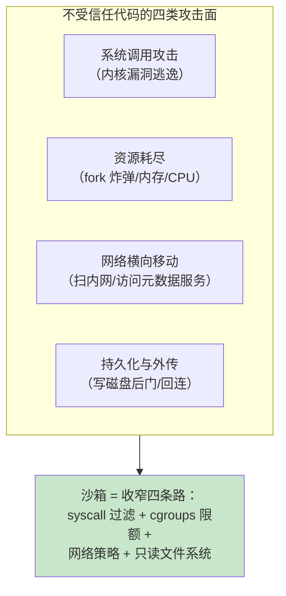
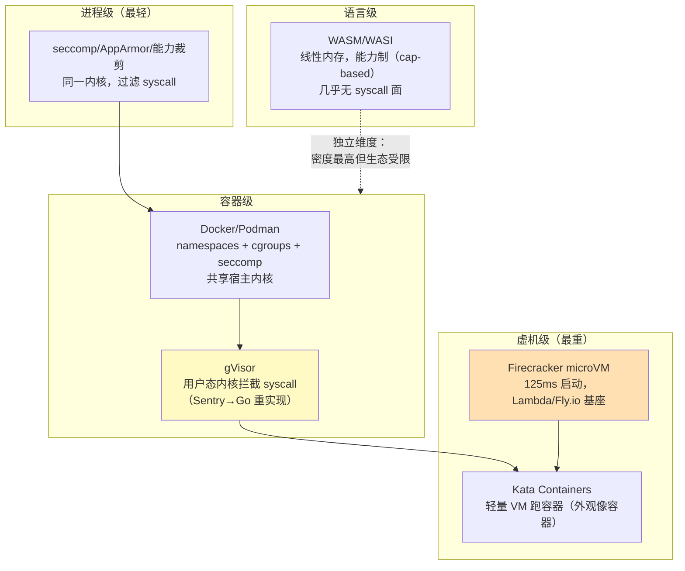
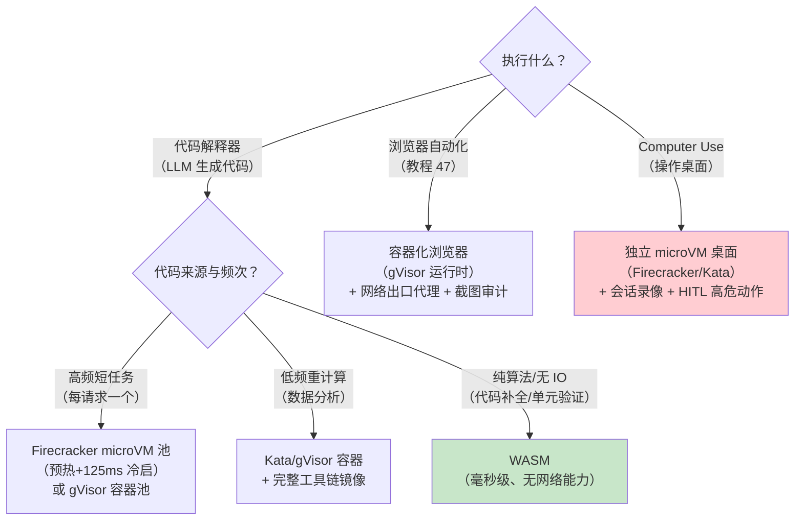

# 沙箱技术对比与选型

> **定位**：Agent 要执行的代码与工具是**不受信任的输入**——沙箱是"爆炸半径"的设计。[附录 06-企业级架构模式/01-Agent沙箱与隔离机制]（同主题的模式篇）讲了为什么要隔离与架构位置；本文补齐**技术选型层**——Docker/gVisor/Kata/Firecracker/WASM 五类隔离技术的机制、隔离强度-启动-密度三维对比、Agent 三类场景（代码执行/浏览器/Computer Use）的选型决策树与 K8s 集成方式、安全基线清单。服务 [教程 90-ComputerUse与浏览器Agent] 与 [项目 12-研发效能DevOps平台]。
>
> **读者画像**：要给 Agent 工具执行（尤其代码解释器、浏览器自动化、Computer Use）设计运行时的工程师；需要回答"Docker 隔离够不够"的架构师。
>
> **前置阅读**：[附录 06-企业级架构模式/01-Agent沙箱与隔离机制]；[教程 90-ComputerUse与浏览器Agent]。
>
> **版本基准**：各技术以 2026 稳定版为准（Firecracker/Kata/gVisor 均为 CNCF/开源成熟项目）。

---

## 1. 问题定义：隔离的是什么威胁

**先明确信任级别再选技术**：纯内部代码（自己写的工具）不需要重型沙箱；**LLM 生成的代码、第三方 MCP 工具产物、浏览器抓回的内容**才是敌意输入（间接注入的执行面，[附录 08-Agent安全深度]）。

## 2. 五类技术：机制与取舍

| 维度 | 进程过滤 | Docker | gVisor | Kata | Firecracker | WASM |
|------|---------|--------|--------|------|------------|------|
| 隔离边界 | syscalls 黑名单 | 内核 namespace | 用户态内核 | 硬件虚拟化 | 硬件虚拟化 | 内存沙箱 |
| 内核暴露面 | 大（共享） | 大（共享内核，逃逸=内核洞） | **小**（syscall 被拦截重写） | 极小 | 极小 | 近零（WASI 白名单） |
| 启动延迟 | ~ms | ~100ms | ~100ms+ | ~1s | **~125ms** | **~ms** |
| 单机密度 | 极高 | 高 | 中（CPU 开销 5-20%） | 低（每 VM 开销） | 高（microVM） | 极高 |
| 生态兼容 | 好 | **最好** | 好（多数容器可直接跑） | 好（OCI 兼容） | 需组合（配 containerd） | 受限（需 WASI 化/编译目标） |
| 典型用途 | 加固层 | 默认档 | 多租户容器/敌意负载 | 金融级容器隔离 | Serverless/高密度租户 | 插件/边缘函数 |

**"Docker 够不够"的架构师答案**：容器共享宿主内核——**容器逃逸本质是内核漏洞利用**。对内部低风险负载，Docker+rootless+seccomp 足够；对执行 LLM 生成代码/第三方产物的多租户平台，**gVisor（生态兼容好、syscall 面小）或 Firecracker（隔离最硬、密度高）才是正解**；Docker 层还要叠 cgroups 限额、只读根文件系统、无特权用户三件套。

## 3. Agent 三类场景的选型决策树

补充：[项目 12-研发效能DevOps平台] 的代码评审 Agent 执行的是仓库代码+构建——按 CI 的信任模型走（隔离网络+资源限额的容器即够），不必上 microVM。

## 4. K8s 集成形态

- **RuntimeClass**：`runtimeClassName: gvisor` / `kata`——同一 Pod 语义，换隔离底座；节点池按 runtime 分组调度
- **池化预热**：Agent 场景的启动延迟敏感——预启动池（warm pool）+ 心跳保活 + 任务即取即还（Firecracker 的设计范式）
- **配额**：每沙箱 Pod 限 CPU/内存（cgroups 由 K8s 落地），**设置时限 TTL**（任务超时自动回收，[教程 83] 预算的时间维度）
- **网络策略**：默认 deny-all 出口；白名单放行目标域（工具需要的 API）；**严禁访问云元数据服务（169.254.169.254）**——凭据窃取的第一跳

## 5. 安全基线清单（无论选哪种技术）

| # | 项 | 标准 |
|---|----|------|
| 1 | 权限 | 非特权用户运行；no-new-privileges；裁剪 capabilities |
| 2 | 文件系统 | 只读 rootfs + tmpfs 工作区；产物经对象存储引用回传（[教程 71-日志存储与高可用复制] §6] 索据分离同构） |
| 3 | 网络 | 默认拒绝；出站走审计代理（URL 日志进审计管道，[教程 32]） |
| 4 | 资源 | CPU/内存/进程数三限额 + 硬超时 |
| 5 | 密钥 | 沙箱内零凭据；需要的外部调用由宿主侧代理完成（工具结果回传而非凭据下发） |
| 6 | 审计 | 输入/输出/退出码全记录；浏览器/桌面场景加截图/录像（[教程 90] 回放审计） |
| 7 | 生命周期 | 一次性使用（用完即焚）而非复用——状态污染与持久化后门一起消灭 |

## 6. 适用场景与不适用场景

### 适用场景

- 代码解释器/数据分析工具的执行底座（microVM 或 gVisor 池）
- 多租户平台跑第三方/MCP 工具产物（隔离强度按租户信任分级）
- 浏览器与桌面自动化（容器化浏览器、桌面 microVM + 录像）

### 不适用场景

- 内部自研工具的常规部署——隔离成本无收益；按普通服务治理
- 毫秒级响应的同步工具——沙箱启动/网络开销不适合同步路径（改为预热池或非沙箱白名单工具）
- 单机 Demo 上全套 microVM——先用 rootless Docker+限额跑通，隔离等级随信任需求升级

## 7. 常见误区与反模式

1. **"我们有 Docker 所以安全"**——容器不是安全边界，内核共享是根本限制；敌意负载要 gVisor/microVM。
2. **沙箱里放了 API Key**——零凭据原则（§5.5）被违反，沙箱被逃逸=凭据泄漏。
3. **沙箱复用以省启动**——状态污染 + 持久化后门；一次性 + 池化预热才是正确组合。
4. **只限 CPU 不限进程数**——fork 炸弹打挂节点；三限额缺一不可。
5. **忘记元数据服务**——容器内访问 169.254.169.254 拿云凭据是真实攻击路径；网络策略显式封禁。

## 8. 总结

沙箱选型一句话：**按威胁分级——内部负载普通容器三件套（非特权/只读/限额）；LLM 代码与第三方产物上 gVisor（生态兼容）或 Firecracker（最硬+高密度）；无 IO 算法验证用 WASM；浏览器/桌面场景容器化+录像+HITL**。基线七条（非特权/只读/默认拒绝/三限额/零凭据/全审计/一次性）与技术无关，先于技术成立。回到模式层看它在架构中的位置：[附录 06-企业级架构模式/01-Agent沙箱与隔离机制]；浏览器场景落地见 [教程 90]。

**外部来源**：[gVisor](https://gvisor.dev/) · [Firecracker](https://firecracker-microvm.github.io/) · [Kata Containers](https://katacontainers.io/) · [Kubernetes RuntimeClass](https://kubernetes.io/docs/concepts/containers/runtime-class/) · [WASI](https://wasi.dev/)
