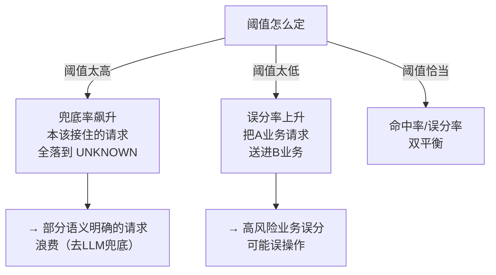

# 00-路由表与语义路由

> **定位**：教程 [93-意图路由与路由编排](../../教程/93-意图路由与路由编排.md) 的下钻层。深挖两条贯穿实践的主题：**① 路由表（Route Table）怎么设计**——路由目标注册、降级链、配置解耦；**② 语义路由的阈值怎么标定**——命中率/误分率/兜底率如何权衡，示例句怎么维护。读完你能把教程50的"概念路由"落成可上线、可调参、可灰度的一套工程实践。
>
> **前置阅读**：[93-意图路由与路由编排](../../教程/93-意图路由与路由编排.md)、[附录 01-LLM基础理论/01-Embedding原理](../01-LLM基础理论/01-Embedding原理.md)、[教程 33-最小闭环：Agent各阶段输出打印到控制台](../../教程/33-最小闭环：Agent各阶段输出打印到控制台.md)。

---

## 1. 路由表：把"分发给谁"做成数据，而不是代码

教程50 里 `RouteTable` 用了枚举 + 构造注入，这只是最小形态。生产级路由表要考虑**三件事**：路由目标是"可执行链"而非裸 ChatClient、路由配置要和代码解耦、要有降级优先级。

### 1.1 路由目标：一条可执行链，不是一个模型

路由目标应该是一个带**完整上下文**的执行器，而不是一个裸 `ChatClient`。每个目标封装：专属 System Prompt、白名单工具、记忆策略、前置校验、HITL 闸门、限流配额（呼应 [59-多租户隔离与资源治理](../../教程/59-多租户隔离与资源治理.md)）。

```java
// Spring AI 2.0.0 / Java 21 —— 概念代码：路由目标 = 可执行链
public record RouteTarget(
        String name,
        ChatClient chat,
        Predicate<String> preGuard,        // 前置校验：如"审批意图需带单号"
        boolean requiresHitl,              // 是否强制人工复核（高风险业务）
        Predicate<String> quota) {         // 租户配额
}
```

**要点**：路由目标是**声明式的**，因此可以存储成 JSON 配置，由配置中心或管理后台动态下发（呼应 [16-企业级Agent服务网格](../../项目/16-企业级Agent服务网格/00-需求分析与架构设计.md) 的 xDS 动态下发思想）。

### 1.2 路由配置解耦（可灰度、可回滚）

```json
{
  "routes": [
    { "intent": "order",  "target": "orderChain",  "threshold": 0.72, "risk": "HIGH" },
    { "intent": "rag",    "target": "ragChain",    "threshold": 0.65, "risk": "LOW" },
    { "intent": "approval","target": "approvalChain","threshold": 0.8, "risk": "HIGH" },
    { "intent": "*",      "target": "fallbackChain","threshold": 0.0, "risk": "LOW" }
  ]
}
```

路由配置从代码中抽离后，**改阈值、加意图、换目标实例都不需要发版**，配合灰度切流（教程 [62-灰度发布与版本管理](../../教程/62-灰度发布与版本管理.md)）与秒级回滚。

## 2. 语义路由的阈值标定

语义路由的命门是**置信度阈值**。阈值是三难：



### 2.1 标定方法：带标注的语料回放

用**真实历史请求**（已人工标注真意图）回放，画出每个候选阈值下的**命中率-误分率曲线**，取两者交叉的甜点。这是标准的 ROC/PR 思路在意图路由上的应用，呼应 [附录 11-评估与可观测生态/03-在线实验与AB统计](../11-评估与可观测生态/03-在线实验与AB统计.md)。

```
阈值   命中率   误分率
0.50   82%      6.1%
0.60   79%      3.4%
0.70   74%      1.8%   ← 甜点：误分率可控，命中尚可
0.80   61%      0.9%
0.90   43%      0.3%
```

- **低风险业务**（如 RAG 查询）可接受更高误分率 → 阈值可低，多接住。
- **高风险业务**（支付/审批/删除）必须低误分率 → 阈值设高，宁可兜底到 HITL/人工，不可误放行。

### 2.2 不同意图用不同阈值

不要全平台一个阈值。"帮我转账"和"搜个文档"的容错完全不同，天然需要**按意图独立阈值**（上表 `routes[].threshold` 已体现）。这也是"多租户/多业务线隔离"（[教程26](../../教程/59-多租户隔离与资源治理.md)）在路由侧的延伸。

## 3. 示例句的维护与意图漂移

语义路由的覆盖度**完全取决于示例句**。三条维护原则：

1. **每意图 15~30 个代表句**：覆盖该意图的高频变体、同义词、口语、缩写。
2. **从兜底日志反哺（数据飞轮）**：定期捞出误兜底的样本，人工标注后补成新示例句——这是 [84-数据飞轮与持续改进](../../教程/84-数据飞轮与持续改进.md) 在路由侧的具体落地。
3. **意图漂移监控**：某意图命中率随时间跌破基线 = 用户话术变了，触发补示例告警（呼应教程50 §4.2）。

## 4. 与模型路由的关系矩阵

| 场景 | 意图路由 | 模型路由 | 处理 |
|------|---------|---------|------|
| 客服订单请求，量大限成本 | order 意图 | 便宜模型 | 意图定链 + 模型省钱 |
| 数据分析需求，复杂推理 | data 意图 | 大模型/推理模型 | 意图定链 + 强推理 |
| 审批请求，需严谨 | approval 意图 | 中模型 + HITL | 意图定链 + 强制复核 |
| 模糊请求，意图两端都像 | UNKNOWN | 兜底模型 | 语义兜底 + 降级链 |

两者是**正交的两层**：意图路由决定"走哪条链路"，模型路由决定"链路上用什么模型"。生产平台两者串接（教程50 §1.2 的"可叠加"）。

---

## 总结

本项目把教程50的三根支柱，深挖成三条可落地的工程纪律：

1. **路由表数据化**：路由目标 = 带上下文的可执行链（非裸 ChatClient），配置抽离 JSON，可灰度可回滚。
2. **阈值按意图标定**：命中率-误分率曲线找甜点，高风险业务宁可兜底不可误放行，每意图独立阈值。
3. **示例句飞轮维护**：兜底日志反哺补样本 + 意图漂移告警，让语义路由持续进化。

> **实操建议**：先给低风险意图低阈值跑通，用两周兜底日志补一批示例句，回落误分率后再逐步放开高风险意图并强制 HITL。落地完整平台见 [项目23-企业级Agent意图路由网关](../../项目/23-企业级Agent意图路由网关/00-需求分析与架构设计.md)。
