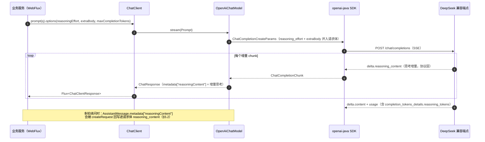
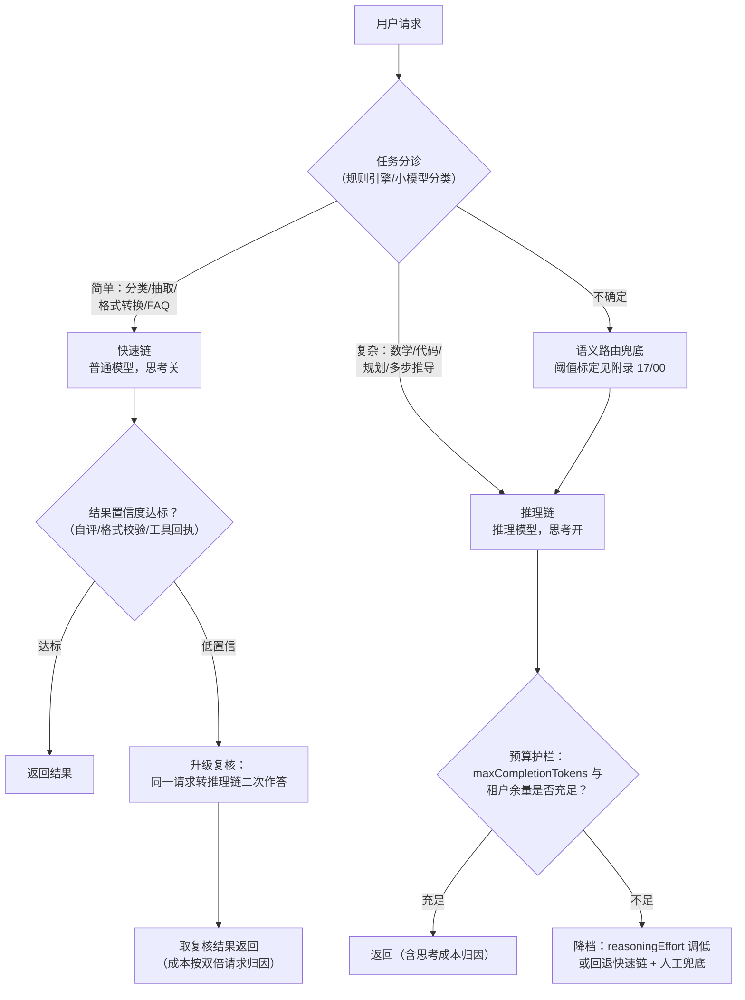
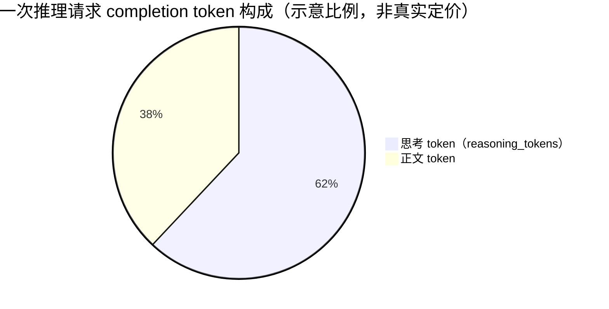

# 01-推理模型与思考预算编程

> **定位**：本文是对 [教程 04-企业级架构主干/12-模型路由与降级](../../教程/04-企业级架构主干/12-模型路由与降级.md) 的**推理模型下钻**。教程路由篇解决了"多个模型怎么选、怎么切、怎么降级"，但没有回答一个 2026 年生产环境绕不开的问题：**DeepSeek-R1 / Qwen-Thinking / o 系列这类"会思考"的推理模型，在 Spring AI 2.0 里怎么控制、什么时候该用、成本怎么算、有哪些工程陷阱**。读者画像：已读完教程路由篇与 [附录 17-路由与推理策略/00-路由表与语义路由](00-路由表与语义路由.md)，正在把推理模型接入生产链路的中高级 Java 开发者。前置阅读：[教程 04-企业级架构主干/12-模型路由与降级](../../教程/04-企业级架构主干/12-模型路由与降级.md)、[附录 17-路由与推理策略/00-路由表与语义路由](00-路由表与语义路由.md)、[附录 05-SpringAI2-API基准/00-Advisor与ChatMemory](../05-SpringAI2-API基准/00-Advisor与ChatMemory.md)。
>
> **API 实证声明**：本文所有 Spring AI API 均经本地 jar `javap`/字节码实证（spring-ai-openai 2.0.0、openai-java-core 4.39.1，2026-08-29）；供应商协议层概念（`reasoning_content`、`thinking` 参数、模型名）单独标注「协议层」，以各供应商现行文档为准。

---

## 1. 推理模型是什么：test-time compute 的机理

### 1.1 思考 token 换质量：把"一次答对"变成"草稿演算后作答"

普通模型（如 DeepSeek-V3、GPT-4o mini 这类"直答型"模型）的行为模式是：读完输入，**直接逐 token 生成答案**。它的"思考"只发生在前向传播的内部计算里，不产出任何文本。

推理模型（Reasoning Model）引入了第三个阶段：在"读题"与"作答"之间，先**生成一段可见的思维链文本**——自我拆解问题、列举候选方案、验证中间步骤、发现矛盾后回溯重来——然后才输出最终答案。这个阶段产出的就是**思考 token**（thinking tokens / reasoning tokens）。

这背后的经济学概念叫 **test-time compute**（测试时计算）：模型的质量不再只由训练阶段的算力决定，还可以在**推理时刻用更多计算换取更高质量**。对用户而言，这个"更多计算"直接体现为更多的输出 token、更长的等待时间、更高的单次调用费用——**思考 token 是真实计费的**，这是本文第 4 节成本治理的前提。

`★ Insight ─────────────────────────────────────`
- 推理模型与普通模型的差异**不在模型接口，而在行为**：两者走完全相同的 HTTP 协议（chat/completions），只是推理模型会在响应里多一个思考字段、在 usage 里多一个思考 token 计数——所以接入是"参数与解析"问题，不是"换协议"问题。
- "草稿演算"之所以能提升质量，是因为 Transformer 的每一步生成都会条件化后续所有 token：先在思考段里"写出"中间结论，最终答案就能引用这些已固化的结论，等效于把一次前向传播的难度摊薄到多步。
`─────────────────────────────────────────────────`

### 1.2 能力-成本-延迟三维对比

以同一类问题喂给"普通模型（思考关）"与"推理模型（思考开）"，典型差异如下（定性对比，具体数值随供应商与版本变化，上生产前务必用你自己的评测集实测）：

| 维度 | 普通模型（直答） | 推理模型（思考开） | 架构含义 |
|------|----------------|------------------|---------|
| **输出质量**（复杂任务） | 多步推导易在中途"跑偏"且无法回溯 | 能自我验证、回溯，复杂数学/代码/规划正确率显著更高 | 高难任务值得付思考溢价 |
| **输出质量**（简单任务） | 足够 | 与普通模型持平甚至略降（过度思考、答案绕远） | 简单任务付思考溢价是浪费 |
| **输出 token 成本** | 基准 | 思考 token 常常是正文的数倍（简单题也不例外） | completion 成本可能 3~10 倍起跳 |
| **首字延迟（TTFT）** | 快 | 明显变慢（思考先于正文输出） | 流式首屏体验下降，需超时与前端策略 |
| **总时延** | 秒级 | 十秒级甚至分钟级（难任务长思考） | 同步调用易超时，长任务需预算护栏 |
| **结果确定性** | 较稳定 | 思考路径多样，同题多次作答的路径与耗时波动大 | 容量规划与 P99 时延评估都要按推理模型口径重做 |
| **指令遵从** | 直接 | 思考阶段可能"消化"掉格式指令，导致输出格式漂移 | 结构化输出场景要加校验与重试 |

### 1.3 适用任务矩阵

把任务丢进"思考换质量是否划算"的坐标系里，可以得到一张工程上直接可用的分诊表：

| 任务类型 | 例子 | 思考开？ | 理由 |
|---------|------|:---:|------|
| 数学求解 | 竞赛题、单位换算链、数值校验 | ✅ 强烈建议 | 多步推导 + 自我验算收益最大 |
| 代码生成与调试 | 算法实现、复杂 bug 定位、重构推演 | ✅ 建议 | 需要在头脑中模拟执行 |
| 复杂规划 | 多约束行程编排、Agent 任务分解 | ✅ 建议 | 组合爆炸需要枚举与回溯 |
| 多文档综合推理 | 跨文档对比、矛盾检测 | ✅ 可选 | 取决于文档间关系复杂度 |
| 简单分类/抽取 | 意图分类、实体抽取、情感判断 | ❌ 禁用 | 普通模型又快又准，思考纯烧钱 |
| 格式转换/润色 | 翻译、摘要、Markdown 清洗 | ❌ 禁用 | 无推导链可走 |
| 高频短问答 | FAQ 命中、模板回复 | ❌ 禁用 | 延迟与成本双输 |
| 工具调用密集型 | 一次性调用明确的 API | ⚠️ 谨慎 | 见 §5.4，思考与工具循环叠加会放大时延 |

这张表是第 3 节"混合推理路由"的领域知识基础：**路由的本质就是把这张表变成代码**。

---

## 2. Spring AI 2.0 编程面：怎么接入、怎么控制

### 2.1 接入通道：spring-ai-starter-model-openai 走 OpenAI 兼容协议

DeepSeek、Qwen、Kimi 等主流推理模型供应商都提供 OpenAI 兼容端点，因此 Spring AI 侧**不需要引入任何新 starter**——用既有的 `spring-ai-starter-model-openai`，把 `base-url` 指向兼容端点即可：

```yaml
spring:
  ai:
    openai:
      api-key: ${DEEPSEEK_API_KEY}          # 密钥一律走环境变量，禁止硬编码
      base-url: https://api.deepseek.com    # OpenAI 兼容端点（以供应商现行文档为准）
      chat:
        options:
          model: deepseek-reasoner          # 协议层概念：供应商模型名，示例
          reasoning-effort: medium          # javap 实证：真实配置键（值域由供应商协议定义）
```

一个 2026 年必须知道的底层事实：**Spring AI 2.0.0 的 `spring-ai-openai` 底层已切换为 OpenAI 官方 Java SDK**（本地仓库实证为 `openai-java-core 4.39.1`，`OpenAiChatModel.createRequest` 直接构造 `com.openai.models.chat.completions.ChatCompletionCreateParams`）。这对本文有两点直接影响：

1. 请求体的强类型字段由 OpenAI 官方 SDK 决定，Spring AI 自己的 `OpenAiChatOptions` 字段会被逐一映射过去；
2. **协议里的"额外字段"（供应商私有参数）有官方逃生门**——这就是下一节的 `extraBody`。

### 2.2 唯一原生实证旋钮：reasoning-effort

对本地 `spring-ai-openai-2.0.0.jar` 执行 `javap`，可以确认 `OpenAiChatOptions` 上**真实存在**推理相关字段（以下均为实证结果，非记忆）：

```text
public java.lang.String getReasoningEffort();
// Builder 侧（AbstractBuilder 上，可从 OpenAiChatOptions.builder() 链式调用）：
public OpenAiChatOptions$AbstractBuilder reasoningEffort(java.lang.String);
// 配置绑定侧（spring-ai-autoconfigure-model-openai 2.0.0）：
// OpenAiChatProperties$Options 同时存在 getReasoningEffort()/setReasoningEffort(String)
// → spring.ai.openai.chat.options.reasoning-effort 是真实可绑定的配置键
```

也就是说，**当前 2.0.0 的 `OpenAiChatOptions` 有原生的 `reasoningEffort` 字段（String 类型），但没有原生的 `thinking`/`thinkingBudget` 字段**。`reasoningEffort` 对应 OpenAI 协议的 `reasoning_effort` 请求参数（协议层值域如 `minimal/low/medium/high`，具体以供应商为准；兼容端点是否识别、忽略或报错该参数，由供应商协议决定，接入前务必实测一次）。

编程式设置（推荐放路由层，按请求动态决定）：

```java
// Spring AI 2.0.0 / Java 21
import org.springframework.ai.chat.client.ChatClient;
import org.springframework.ai.openai.OpenAiChatModel;
import org.springframework.ai.openai.OpenAiChatOptions;

@Service
public class ReasoningChatService {

    private final ChatClient chatClient;

    public ReasoningChatService(OpenAiChatModel chatModel) {
        this.chatClient = ChatClient.builder(chatModel).build();
    }

    public String solveHardProblem(String question) {
        return this.chatClient.prompt()
                .user(question)
                .options(OpenAiChatOptions.builder()
                        // .model(...) 在 DefaultChatOptionsBuilder 上（javap 实证，可链式）
                        .reasoningEffort("high")     // javap 实证：AbstractBuilder.reasoningEffort(String)
                        .maxCompletionTokens(16384)  // 正文+思考的总输出硬顶，预算护栏的关键
                        .temperature(0.3)
                        .build())                    // ChatClient.options(ChatOptions.Builder) 实证可用
                .call()
                .content();
    }
}
```

### 2.3 供应商私有参数：extraBody 通道

**当前 2.0.0 的 `OpenAiChatOptions` 无原生 `thinking` 字段**（javap 实证字段清单中不存在）。但 DeepSeek 这类供应商的混合推理开关（协议层的 `thinking` 参数，形如 `{"thinking": {"type": "enabled"}}`，属**协议层概念**，以供应商现行 API 文档为准）怎么传？

实证给出的答案是 `extraBody`：`OpenAiChatOptions$AbstractBuilder` 上有 `extraBody(Map<String, Object>)`，且字节码确认 `createRequest` 内三处调用 `getExtraBody()` 并经 `JsonValue.from(...)` 把整个 Map **作为额外属性并入请求体**。这是官方设计的"协议逃生门"，正是为供应商私有参数准备的：

```java
// Spring AI 2.0.0 —— extraBody 字段与并入请求体的行为均为 javap/字节码实证；
// 但写入的键值（thinking.type）是供应商协议层概念，写入前对照供应商现行文档
import java.util.Map;
import org.springframework.ai.openai.OpenAiChatOptions;

OpenAiChatOptions options = OpenAiChatOptions.builder()
        .model("deepseek-chat")                       // 协议层示例：混合推理模型的基础名
        .extraBody(Map.of(
                "thinking", Map.of("type", "enabled") // 协议层概念：DeepSeek 思考开关（示例）
        ))
        .maxCompletionTokens(16384)
        .build();
```

等价的 YAML 写法（`Options` 类实证存在 `setExtraBody(Map<String,Object>)`，Spring Boot 松散绑定 `extra-body`）：

```yaml
spring:
  ai:
    openai:
      chat:
        options:
          extra-body:
            thinking:
              type: enabled   # 协议层概念示例；多余参数是否被端点容忍由供应商决定
```

`★ Insight ─────────────────────────────────────`
- 顺带一个反向实证结论：**官方 `spring-ai-deepseek` 2.0.0 的 `DeepSeekChatOptions` 同样没有 thinking/reasoning 字段**（javap 实证其字段清单仅含 model/temperature/maxTokens 等常规项）。所以在 2.0.0 时间点，无论走 openai 兼容通道还是 deepseek 官方 starter，思考开关都只能靠 `extraBody`（兼容通道）或等待 SDK 升级。
- `extraBody` 的价值不止思考开关：它是所有"供应商先于 SDK 发布的新参数"的统一过渡通道，架构上应把它封装进你的模型网关，避免散落在业务代码里。
`─────────────────────────────────────────────────`

### 2.4 思考内容读出来：metadata["reasoningContent"]

推理模型返回的思考内容（DeepSeek 协议层的 `reasoning_content` 响应字段）去哪了？这是本文**最有价值的字节码实证**。对 `OpenAiChatModel` 反编译可见：

- 私有方法 `getReasoningContent(ChatCompletion.Choice)`：从底层消息的 `_additionalProperties()` 里先取 `reasoning_content`（DeepSeek 风格），取不到再兜底取 `reasoning`（其他供应商风格），都没有则返回空串；
- 非流式（`lambda$internalCall$1`）与流式（`lambda$internalStream$8`）都会把结果以 **`"reasoningContent"` 为 key 放进 `AssistantMessage` 的 metadata Map**。

也就是说，**Spring AI 2.0.0 原生解析并搬运了思考内容**，读取不需要任何自定义拦截器：

```java
// Spring AI 2.0.0
import org.springframework.ai.chat.messages.AssistantMessage;
import org.springframework.ai.chat.model.ChatResponse;

ChatResponse response = this.chatClient.prompt()
        .user(question)
        .options(options)
        .call()
        .chatResponse();                       // CallResponseSpec.chatResponse() 实证

AssistantMessage output = response.getResult().getOutput();
String answer = output.getText();              // AbstractMessage.getText() 实证
Object thinking = output.getMetadata().get("reasoningContent"); // 字节码实证的 metadata key
```

### 2.5 一次推理调用的完整数据流

把 §2.2–§2.4 串起来，一次推理模型调用在 Spring AI 2.0 内部的完整旅程如下（含多轮回传，见 §5.2）：



---

## 3. 混合推理路由：按难度分配思考预算

### 3.1 三种落地形态

"什么时候用推理模型"在工程上有三种落地形态，投入递增、收益也递增：

1. **静态绑定**：业务线 A（数学批改）全量走推理模型，业务线 B（FAQ）全量走普通模型。最简单，实现于多 `ChatClient` 配置（见 [教程 04-企业级架构主干/12-模型路由与降级 §4](../../教程/04-企业级架构主干/12-模型路由与降级.md)），缺点是粒度太粗——同一个业务线内部也有难易之分。
2. **前路由（动态分诊）**：每个请求先经轻量分类器（规则或小模型）判断难度与类型，再决定投给哪条链。这正是 [附录 17-路由与推理策略/00-路由表与语义路由](00-路由表与语义路由.md) 的路由表思想：**把"谁接这个请求"做成带阈值的数据配置**，推理模型只是路由表里多出来的一个目标。
3. **升级复核（Escalation）**：默认全走普通模型（便宜、快），仅当结果被判定为"低置信"时，把同一请求转投推理模型二次作答。思考预算花在**最需要的少数请求**上，是成本上最优的形态，代价是要定义"低置信"的判定器。

### 3.2 路由决策与升级复核

三种形态组合起来的完整决策流（含难度分支、置信度升级支路、预算护栏支路——这是一个有真实分支结构的决策，不是流水线）：



升级复核的"低置信"判定信号，工程上常用的有四类（按实现成本排序）：

| 信号 | 实现 | 适用 |
|------|------|------|
| 格式/Schema 校验失败 | 结构化输出 `validateSchema()` 失败次数 | 抽取、生成类 |
| 自我评分 | 用普通模型对答案做 1~10 分评审（LLM-as-Judge，工程化实践见 [附录 11-评估与可观测生态/01-LLM-as-Judge工程化](../11-评估与可观测生态/01-LLM-as-Judge工程化.md)） | 开放式生成 |
| 自洽性投票 | 同题采样 N 次答案一致性不足 | 数学/选择题 |
| 工具回执异常 | 工具执行报错、空结果、超时 | Agent 工具链路 |

升级复核要配**升级预算**：单请求最多升级一次（防死循环：普通模型不行→推理模型也不行→再升级就没有意义了，应转 HITL），并且升级后的双份成本要在计费系统里归因到同一 trace（见 §4.3）。

---

## 4. 成本治理：思考 token 也计费

### 4.1 计费口径的变化

普通模型时代，输出成本 ≈ 正文长度，你对账单的直觉是"答案越长越贵"。推理模型打破了这个直觉：**思考 token 计入 completion 侧计费**，而且往往是"大头"。一次典型推理调用的输出 token 构成（示意比例，非真实定价）：



三个架构层面的后果：

1. **成本预估模型失效**：按"平均答案长度 × 单价"预估的容量模型，在推理模型下会系统性低估数倍。成本预测必须引入"思考 token 系数"，且该系数随任务难度剧烈波动——**按任务类型分桶统计**，而不是全局平均。
2. **"答案很短 ≠ 成本很低"**：一个 200 token 的简短答案背后可能藏着 8000 token 的思考。账单审计时不要被输出长度迷惑，要看 `reasoning_tokens`。
3. **对比评测必须同口径**：推理模型 vs 普通模型的 A/B（见 [附录 11-评估与可观测生态/03-在线实验与AB统计](../11-评估与可观测生态/03-在线实验与AB统计.md)）必须以"**每正确答案的成本**"（cost per correct answer）为准，而不是"每请求成本"——否则推理模型的溢价会被错误记为纯亏损，而它带来的正确率提升没有被计价。

### 4.2 reasoning_tokens 计量：getNativeUsage 读法

Spring AI 的 `Usage` 接口（`getPromptTokens/getCompletionTokens/getTotalTokens`）是**跨供应商抽象**，不暴露思考 token 细分。但 2.0.0 的 `Usage.getNativeUsage()` 返回底层原始 usage 对象——在 openai 兼容通道下就是 OpenAI SDK 的 `CompletionUsage`，其 `completionTokensDetails().reasoningTokens()`（javap 实证，`Optional<Long>`）正是思考 token 数：

```java
// Spring AI 2.0.0（底层 openai-java-core 4.39.1，javap 实证）
import com.openai.models.completions.CompletionUsage;
import org.springframework.ai.chat.metadata.Usage;

Usage usage = response.getMetadata().getUsage();   // ChatResponseMetadata.getUsage() 实证
long reasoningTokens = 0;
if (usage.getNativeUsage() instanceof CompletionUsage cu
        && cu.completionTokensDetails().isPresent()) {
    reasoningTokens = cu.completionTokensDetails().get()
            .reasoningTokens().orElse(0L);          // Optional<Long>，协议层字段
}
```

拿到 `reasoningTokens` 后，把它挂进你的指标体系（Micrometer 计量器或 Observation tag，链路规范见 [教程 04-企业级架构主干/02-全链路可观测性](../../教程/04-企业级架构主干/02-全链路可观测性.md)），成本仪表盘才能回答"这个租户这个月为思考付了多少钱"（成本归因框架见 [教程 04-企业级架构主干/07-成本治理与Token计量](../../教程/04-企业级架构主干/07-成本治理与Token计量.md)）。

### 4.3 预算护栏

思考 token 不可预估、随难度波动，所以护栏必须**全部用硬上限表达**，不能用"提示模型少想一点"这类软约束：

1. **输出硬顶**：`maxCompletionTokens` 是正文+思考的**总**上限（javap 实证字段；语义为 OpenAI 协议层 `max_completion_tokens`）。设得过小会导致思考被截断、正文没机会输出——设置原则是"预期最长思考 × 2 + 预期正文"。
2. **推理力度分档**：把 `reasoningEffort` 纳入路由表配置（§3.2 的路由目标描述里），按任务难度分 `low/medium/high` 三档，而不是全局一档。
3. **租户配额联动**：推理请求消耗配额的速率按"含思考 token 的 completion 数"计，租户余量不足时自动降档（§3.2 的 BUD 分支），配额框架见 [教程 04-企业级架构主干/06-多租户隔离与资源治理](../../教程/04-企业级架构主干/06-多租户隔离与资源治理.md)。
4. **轮次预算**：Agent 多轮循环中，推理模型每轮都付一遍思考溢价，轮次上限要按"普通模型的 1/3~1/2"收紧，防死循环思路见 [教程 10-调优实战与方法论/05-架构调优](../../教程/10-调优实战与方法论/05-架构调优.md)。

---

## 5. 工程陷阱清单

### 5.1 流式下思考内容的展示策略

流式场景下，思考增量先于正文到达（§2.5 时序）。前端直接渲染会得到"答案之前刷一大屏草稿"的糟糕体验。生产上有三种策略，按场景选：

| 策略 | 做法 | 适用 |
|------|------|------|
| **不展示**（默认推荐） | 服务端直接过滤掉 `metadata["reasoningContent"]` 非空的数据，只透传正文 | 面向终端用户的 C 端产品 |
| **可折叠展示** | 思考走独立的 SSE 事件（如 `event: reasoning`），正文走 `event: message`，前端默认折叠、可展开 | 技术型用户、教育/调试场景 |
| **完整过程透明** | 思考全程实时展示 | 内部工具、评估标注平台 |

WebFlux 侧的分流写法（`Flux<ChatClientResponse>` 按 metadata 判空后映射为不同 SSE 事件）：

```java
// Spring AI 2.0.0 / WebFlux / Java 21 —— 概念代码：SSE 事件分流骨架
import org.springframework.ai.chat.client.ChatClient;
import org.springframework.http.codec.ServerSentEvent;
import reactor.core.publisher.Flux;

public Flux<ServerSentEvent<String>> stream(ChatClient chatClient, String question) {
    return chatClient.prompt()
            .user(question)
            .stream()
            .chatClientResponse()   // StreamResponseSpec.chatClientResponse() 实证
            .map(cri -> cri.chatResponse())
            .filter(cr -> cr.getResult() != null)
            .map(cr -> {
                var output = cr.getResult().getOutput();
                Object thinking = output.getMetadata().get("reasoningContent");
                if (thinking instanceof String t && !t.isBlank()) {
                    return ServerSentEvent.<String>builder(t).event("reasoning").build();
                }
                return ServerSentEvent.<String>builder(output.getText()).event("message").build();
            });
}
```

注意两个协议层细节：思考增量是**逐 chunk 到达**的（每 chunk 的 `metadata["reasoningContent"]` 是该 chunk 的增量而非全程累计），前端要么逐块 append，要么自行累积；流式 usage 统计需开启 `streamUsage(true)`（Builder 方法 javap 实证）才会在流末尾携带 usage。

### 5.2 思考内容进不进对话历史：Spring AI 的真实行为是"回传"

这是推理模型接入最隐蔽的一个坑。行业惯例是：**下一轮请求不应携带上一轮的思考内容**（它属于过程草稿，携带会浪费输入 token，部分供应商协议也明确忽略）。但字节码实证显示 Spring AI 2.0.0 的行为是：

- `OpenAiChatModel` 在构造多轮请求时（`lambda$createRequest$25`），会读取 `AssistantMessage.getMetadata().get("reasoningContent")`，**若非空则回写为请求体的 `reasoning_content` 附加属性**（`putAdditionalProperty` 字节码实证）；
- `AssistantMessage` 的 metadata 里带着 `reasoningContent`，而 `MessageWindowChatMemory` + `InMemoryChatMemoryRepository` 是**对象直存**——metadata 原样保留，于是**只要记忆里有推理模型的回复，下一轮就会自动回传思考内容**。

工程对策两条（按你的记忆架构选）：

1. **自研记忆仓库时顺手解决**：如果你因持久化需求自研了 `ChatMemoryRepository`（存 `Map` 再重建 `Message` 的范式，见 [附录 05-SpringAI2-API基准/00-Advisor与ChatMemory](../05-SpringAI2-API基准/00-Advisor与ChatMemory.md) 的序列化铁律），重建 `AssistantMessage` 时**不放入 `reasoningContent` metadata**，回传自然断绝，历史里也不再携带草稿——这是最干净的做法。
2. **显式改写历史**：在记忆写入路径（自定义 Advisor 的 `before` 阶段，或记忆保存前的装饰层）把 metadata 中的 `reasoningContent` 剥离。

无论选哪条，**不要依赖"框架默认行为是对的"**——本节就是实证出来的反例：框架默认行为恰恰把草稿回传了。

### 5.3 长思考导致的超时配置

推理模型的总时延可达普通模型的十倍以上，三处超时要按新口径重配：

1. **HTTP 客户端层**：`OpenAiChatOptions$AbstractBuilder.timeout(Duration)`（javap 实证）控制底层请求超时；走 Spring Boot 自动装配时用既有的 `spring.ai.openai` 相关超时配置项。推理链建议单独一组 options（路由目标本来就是独立 ChatClient，见 §3.1）。
2. **Reactor 层**：WebFlux 侧对流做 `timeout(Duration)` 时，语义是"**相邻信号的间隔超时**"而非总时长——推理模型思考期**持续有思考增量流出**，通常不会触发该超时；真正危险的是 `.block(timeout)` 与网关层（Nginx 的 `proxy_read_timeout`）按普通模型口径配的几十秒——长思考会被网关先掐断。
3. **前端体验层**：首屏等待以"思考期"为主，要么用 §5.1 的思考流式展示填充等待，要么在路由层对同步接口设总时长预算、超时降级到快速链。

### 5.4 推理模型与工具调用

推理模型 + 工具循环是双刃剑。有利面：思考阶段可以推演"该调哪个工具、参数怎么填"，复杂工具编排正确率更高。风险面有三个：

1. **时延叠乘**：每轮工具循环都附带一次完整思考，5 轮循环 = 5 份思考溢价。工具密集型 Agent 的推理模型轮次要设硬上限（§4.3 第 4 条）。
2. **并非所有供应商都支持推理模式下的工具调用**：协议层兼容度随供应商与版本变化，接入前必须用你的真实工具集冒烟验证（当前 2.0.0 的工具执行控制点见 [附录 05-SpringAI2-API基准/02-Tool与Observation真实API](../05-SpringAI2-API基准/02-Tool与Observation真实API.md)，`internalToolExecutionEnabled` 在 2.0.0 不存在，工具循环由 `ToolCallingAdvisor` 驱动）。
3. **思考内容里可能"泄露"工具全貌**：思考文本会复述工具列表与参数，若 §5.1 选择向前端展示思考，等于把工具 Schema 暴露给终端用户——权限敏感场景务必选择"不展示"策略，并复查思考内容是否进入了日志与审计存储的数据分级（数据分级治理见 [教程 04-企业级架构主干/11-安全与权限控制](../../教程/04-企业级架构主干/11-安全与权限控制.md)）。

---

## 适用场景

- 生产环境已确定要接入 DeepSeek-R1 类推理模型，需要在 Spring AI 2.0 里**控制思考行为**（开/关/力度/预算）的架构设计与编码落地；
- 需要在**同一系统内同时运营**普通模型与推理模型，设计混合路由与升级复核机制；
- 推理模型上线后**账单异常**，需要建立思考 token 的计量、归因与护栏体系；
- 评估推理模型"值不值"：需要设计**同口径的成本-质量对比实验**。

## 不适用场景

- 全部请求都是简单分类/抽取/格式转换的高 QPS 服务——直接用普通模型，本文的复杂度全是负资产；
- 供应商只有私有非 OpenAI 兼容协议、且无兼容端点——本文的 openai 通道不适用，应改用该供应商的官方 starter 或自写 `ChatModel` 实现；
- 追求极致首字延迟的实时语音/交易场景——推理模型的思考期与该场景根本冲突，路由层应直接排除推理链；
- 需要严格确定性输出的合规场景（如受监管的固定话术生成）——思考路径的多样性是风险而非特性，除非配合强校验与 HITL 兜底。

## 总结

推理模型不是"又一个模型选项"，而是**把"质量-成本-延迟"三角里"用成本换质量"这个角显式化**的新变量。本文的工程结论浓缩为五条：

1. **接入是参数问题**：spring-ai-starter-model-openai + 兼容端点即可；思考力度的原生旋钮是 `reasoningEffort`（javap 实证），供应商私有开关走 `extraBody` 通道（字节码实证会并入请求体）。
2. **思考内容可读**：`AssistantMessage.getMetadata().get("reasoningContent")`（字节码实证 key），流式按 chunk 增量到达。
3. **路由分诊是成本的分水岭**：静态绑定 → 前路由 → 升级复核，三种形态投入递增；复核机制接 [附录 17-路由与推理策略/00-路由表与语义路由](00-路由表与语义路由.md) 的阈值标定方法。
4. **成本治理要看 reasoning_tokens**：经 `Usage.getNativeUsage()` 读 OpenAI SDK 的 `completionTokensDetails().reasoningTokens()`（实证），护栏用 `maxCompletionTokens` 硬顶 + 推理力度分档 + 租户配额联动。
5. **三个默认行为要主动覆盖**：流式思考的展示策略（默认过滤）、思考内容的历史回传（实证：Spring AI 默认会回传，需在记忆层剥离）、三处超时按推理口径重配。

下一步深入方向：推理服务的自托管与吞吐调优见 [附录 15-AIInfra与推理部署/00-vLLM推理服务与SpringAI集成](../15-AIInfra与推理部署/00-vLLM推理服务与SpringAI集成.md) 与 [附录 15-AIInfra与推理部署/02-vLLM调优与GPU容量规划](../15-AIInfra与推理部署/02-vLLM调优与GPU容量规划.md)（自托管场景下思考 token 直接转化为 GPU 秒成本，治理口径一致但计量对象从账单变为 GPU 利用率）；语义缓存对推理请求的收益评估见 [附录 09-语义缓存与性能/00-语义缓存实现](../09-语义缓存与性能/00-语义缓存实现.md)（思考开销越大，缓存命中省得越多——推理模型反而是语义缓存的最佳搭档之一）。
