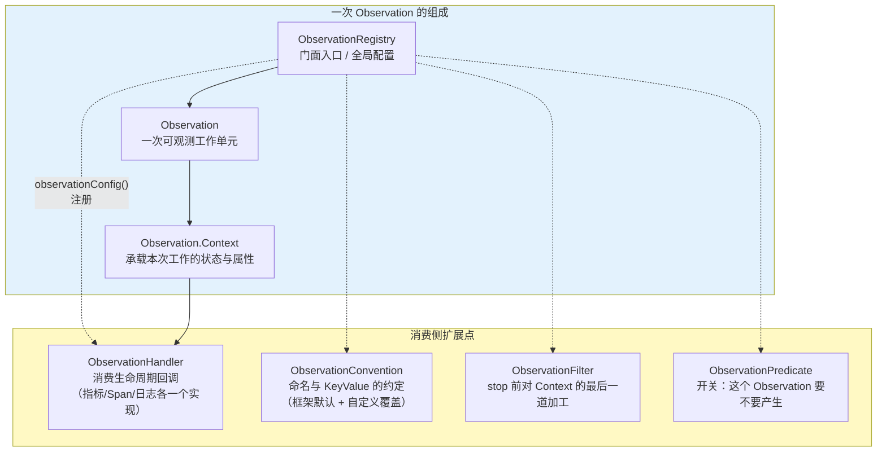
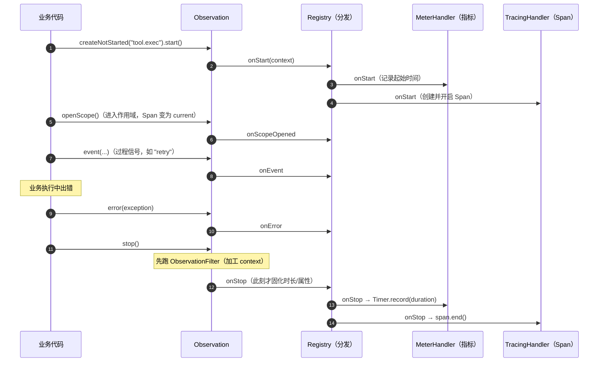
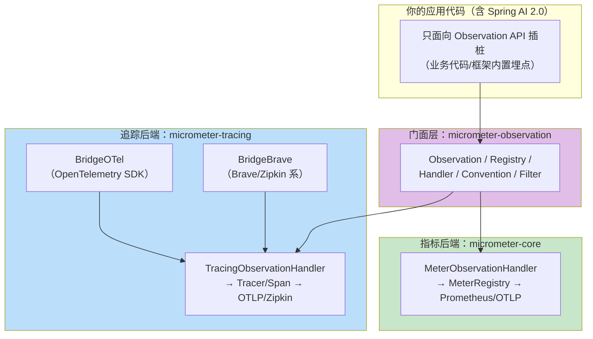
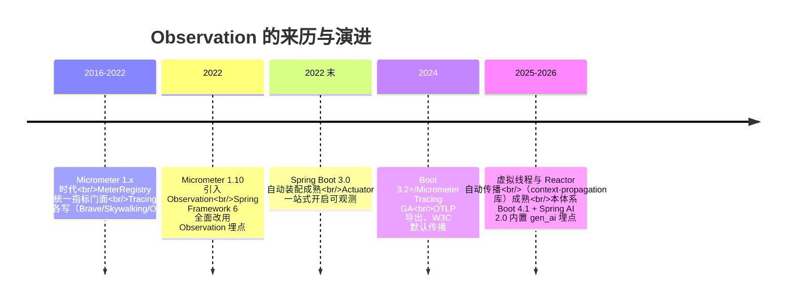
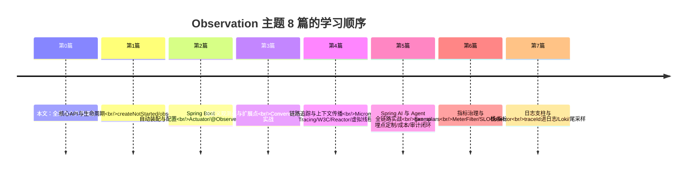

# Observation 全景与核心概念

> **定位**：本文是 Observation 主题的第 0 篇——回答"Observation 到底是什么、为什么存在"：一个**插桩一次、产出 Metrics + Tracing + Logs 三类数据**的统一门面。建立 Observation/Registry/Context/Handler/Convention/Filter 的完整心智模型，以及与 Micrometer Metrics、Micrometer Tracing、OpenTelemetry 的关系图谱。后续 5 篇（核心 API / Spring Boot 集成 / 自定义扩展 / 链路传播 / Agent 实战）都在这张图上展开。
>
> **读者画像**：读过 [教程 22-全链路可观测性]（知道 gen_ai Span 树长什么样）但想搞懂底层机制的中高级 Java 开发者；或从未接触过 Micrometer、直接被 Spring Boot 的"可观测自动配置"包围的新手。
>
> **前置阅读**：[教程 22-全链路可观测性 §1-§2]（为什么 Agent 需要专属可观测性）；[附录 05-SpringAI2-API基准/02-Tool与Observation真实API §3]（本主题遵循的 API 真实性基准）。
>
> **版本基准**：Micrometer 1.1x（Observation 自 1.10 引入）、Spring Boot 4.1（Actuator 自动装配）、Spring Framework 7/WebFlux。

---

## 1. Observation 是什么：一句话与一个类比

**一句话**：Observation 是 Micrometer 提供的**可观测门面 API**——你用同一套代码标记"这里开始了一次工作、这里结束了、它失败了"，注册到 `ObservationRegistry` 的各类 Handler 决定这些信号最终变成指标、Span 还是日志。

**类比**：它就是可观测世界的**事件总线**。你的业务代码只负责"发布事件"（Observation 的生命周期），至于谁来消费（Prometheus 计时器？Zipkin Span？日志行？审计库？），由 Handler 决定——**业务代码与可观测后端彻底解耦**。

### 1.1 没有它会怎样：双重插桩的黑暗时代

```mermaid
graph TB
    subgraph OLD["Observation 之前：一段业务写两遍插桩"]
        B["业务方法<br/>executeTool()"] --> M["Metrics 插桩<br/>Timer timer = registry.timer(...)<br/>timer.record(...)"
        B --> T["Tracing 插桩<br/>Span span = tracer.nextSpan()...<br/>span.start() / span.end()"
        M -.->|"重复的 try-finally<br/>重复的异常处理<br/>重复的标签赋值"| T
    end
    subgraph NEW["Observation 之后：插桩一次"]
        B2["业务方法<br/>executeTool()"] --> O["Observation.createNotStarted(...)<br/>.lowCardinalityKeyValue(...)<br/>.observe(() -> ...)"
        O --> H1["Handler A → Timer/Counter"]
        O --> H2["Handler B → Span"]
        O --> H3["Handler C → 日志/审计"]
    end
    OLD -.->|"Micrometer 1.10（2022）"| NEW

    style OLD fill:#ffcdd2
    style NEW fill:#c8e6c9
```

双重插桩的三大痛点：**代码重复**（同一段逻辑包两层 try-finally）、**语义漂移**（指标叫 `tool.exec`、Span 叫 `tool-execute`，标签各写各的）、**后端耦合**（想从 Brave 换 OTel，全部插桩代码重写）。Observation 把"**信号的产生**"与"**信号的消费**"分开——这正是它被 Spring Framework 6 / Boot 3 选为可观测底座的原因：框架只面向 Observation API 插桩，用户按需挂后端。

## 2. 核心概念六件套



| 概念 | 一句话职责 | 关键认知 |
|------|-----------|---------|
| **ObservationRegistry** | 门面与配置容器，持有全部 Handler/Convention/Filter/Predicate | Boot 自动装配成 Bean，业务代码只注入它；`ObservationRegistry.NOOP` 是空实现（测试中静音） |
| **Observation** | 一次工作单元（一次 HTTP 请求、一次工具调用、一次 Kafka 消费） | 不可变式 Builder 风格创建，`start()` 后开始计时，`stop()` 触发消费 |
| **Observation.Context** | 本次单元的状态袋：KeyValue 属性 + 任意对象（如请求、响应、工具定义） | 子类化它是"领域观测上下文"的做法（如 Spring AI 的 ToolCallingObservationContext，javap 实证，[附录 05-02 §3.1]） |
| **ObservationHandler** | 生命周期回调消费者：`onStart/onStop/onError/onEvent/onScopeOpened...` | 多个 Handler 各取所需：`MeterObservationHandler` 出指标、`TracingObservationHandler` 出 Span、你写的做审计 |
| **ObservationConvention** | 命名约定：`getName()/getContextualName()/getLow/highCardinalityKeyValues()` | 替换框架默认命名/标签而不改业务代码的核心机制 |
| **ObservationFilter / Predicate** | stop 前加工（脱敏/补标签）/ 创建时拦截（降噪） | Filter 改 Context；Predicate 直接掐掉不想要的 Observation |

## 3. 一次 Observation 的完整生命周期

理解生命周期回调顺序，是后面写自定义 Handler 的地基：



四个容易踩空的细节：

1. **属性在 stop 时快照**：`onStop` 之前对 Context 的一切修改（含 Filter）都生效，之后不再消费——"结束时才补的标签"必须走 Filter，而不是 stop 后再改。
2. **error 不是 stop 的替代**：`error(t)` 记录失败（异常名进指标 tag / Span 事件），`stop()` 仍然要调用（finally 里），否则计时器永不落账、Span 悬空泄漏。
3. **父子关系靠 Scope**：`openScope()` 让当前 Observation 成为"现行"，此后新建的 Observation 自动成为它的子级（Timer 侧无感，Span 侧形成 [教程 22 §3] 的 Span 树）。
4. **Scope 是 ThreadLocal 语义**——这正是 WebFlux 下有一堆纪律的原因（[附录 18-Observation/04-链路追踪与上下文传播 §4]，[附录 06-WebFlux与响应式编程] 铁律）。

## 4. 三类数据的同源产出

同一次 Observation，三个 Handler 各自产出什么：

| Handler（实现方） | 产出 | Observation 名 → 数据名的映射 |
|-------------------|------|------------------------------|
| `MeterObservationHandler`（micrometer-core，Boot 自动注册） | **Timer**（时长分布）+ 错误计数 | 观测名即指标名；低基数 KeyValue → 指标 tag |
| `TracingObservationHandler`（micrometer-tracing 桥接，装了 bridge 才有） | **Span**（traceId/spanId/父子） | `contextualName` 作 Span 展示名；低/高基数 KeyValue 全进 Span 属性 |
| `LoggingHandler` / 自定义（你写的） | **日志行/审计记录/事件流** | 自由——这正是 [教程 23] 审计 Handler 与 [17-Kafka/09 §5] 事件转发的挂点 |

由此得到 Observation 最重要的一条**基数纪律**：

> **低基数 KeyValue（lowCardinality）→ 指标 tag**：取值必须有界（method、status、tool.name、gen_ai.system）。
> **高基数 KeyValue（highCardinality）→ 只进 Span**：取值可以无界（sessionId、userId、traceId、完整参数）。
> 把 userId 放进低基数，Prometheus 时间序列按用户数爆炸——这是 [教程 22] 审计指出的基数治理问题的机制级根因。

## 5. 与 Micrometer / Tracing / OTel 的关系图谱



三个必须分清的问题：

- **Micrometer Tracing 不是 OpenTelemetry**——它是 Micrometer 自家的 `Tracer/Span` 门面（API 极简），通过 **bridge** 委托给 Brave 或 OTel SDK（实现）。换后端 = 换 bridge 依赖，插桩零改动。
- **OTel javaagent 与手写 SDK 二选一**（[附录 05-02 §3.2] 纪律）：用 javaagent 全自动埋点就删掉手写 `SdkTracerProvider`；用 Observation 体系（本主题主线）就通过 BridgeOTel 管理自己的 SDK，不挂 agent——同用会双重注册。
- **Metrics 与 Tracing 可以只开一个**：不装 tracing 依赖时，同一套 Observation 照样只出指标；`ObservationRegistry.NOOP` 或 Predicate 可以整体静音——门面天然支持降级。

## 6. 演进时间线



## 7. 适用场景与不适用场景

### 适用场景

- 任何要同时看"耗时分布（Metrics）+ 调用链路（Trace）+ 审计记录（日志/事件）"的边界：HTTP 出入口、工具执行、LLM 调用、Kafka 消费
- 想写一次插桩、后端可换（Brave→OTel、Prometheus→OTLP）的平台工程
- 为框架内置埋点（Spring AI 的 gen_ai.*、WebFlux 的 http.server.requests）做定制：Convention 改标签、Filter 脱敏、Predicate 降噪
- 审计/成本类衍生消费：Handler 里把 Observation 结果转成事件发 Kafka（[17-Kafka/09 §5]）

### 不适用场景

- 纯计数/纯状态类指标（当前队列长度、缓存命中率）——直接用 `MeterRegistry.gauge/counter` 更简单，Observation 是"围绕一段执行"的抽象
- 一次性脚本、无后端可接——`NOOP` registry 即可，别搭全家桶
- 需要**同步返回观测结果给调用方**的场景（如把 traceId 放进响应头）——那走 `Tracer.currentSpan()`（[附录 18-Observation/04 §3]），不是 Observation 的职责

## 8. 常见误区与最佳实践

1. **把 Observation 当 Micrometer 的替代**——它是上层门面；`MeterRegistry` 仍是指标的第一公民（[教程 22 §7.4] 的自定义业务指标直接用 MeterRegistry 是对的），Observation 只接管"围绕执行单元"的插桩。
2. **混淆 observation 名与 contextualName**——观测名是指标名（稳定、含命名空间），contextualName 是 Span 展示名（可随上下文变化，如 `GET /chat/{id}`）。两者用反，指标名会漂移。
3. **高基数进低基数**——见 §4 纪律；上线前 review 每个低基数 tag 的取值空间。
4. **忘了 stop**——异常路径也必须在 finally 里 stop；用 `observe(Supplier)` 函数式风格可以从结构上杜绝（[附录 18-Observation/01-核心API与生命周期 §2]）。
5. **在 Handler 里做重活**——onStop 在业务线程上同步执行，Handler 里写库/调外部服务等于把可观测变成性能税；异步化有纪律（缓冲 + 独立线程，参考 [教程 23] 的异步落库设计）。

## 9. 本主题学习地图



**外部来源**：[Micrometer Observation 官方文档](https://micrometer.io/docs/observation) · [Spring Boot Observability 参考文档](https://docs.spring.io/spring-boot/reference/actuator/observability.html) · [Micrometer Context Propagation](https://micrometer.io/docs/contextPropagation)

## 10. 总结

Observation = **插桩一次、按需产出指标/Span/日志的统一门面**；Registry 持配置，Context 载状态，Handler 消费生命周期，Convention 定命名，Filter 补加工，Predicate 管降噪。低/高基数是指标与追踪的分界线，Scope 的 ThreadLocal 语义是响应式纪律的根源。下一篇把这个模型落到 API 层：[附录 18-Observation/01-核心API与生命周期]。
