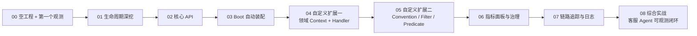

# 00 从空工程起步：第一个最小观测

> **定位**：这是 Observation 学习之旅的**第 0 关**——目标只有一个：**在你的 demo01 工程上写第一行观测代码，在控制台亲眼看到一次观测的生命周期**。本篇不贪多，不一次抛概念，只做最小闭环：写代码 → 跑 → 看到 `START→…→STOP`。你走通这一关，就有了继续进阶的地基工程。
>
> **读者画像**：在 Spring Boot 4.1.0 里开发、从未接触过 Micrometer Observation 的工程师；或想用"动手"而不是"看概念"来入门的人。本文默认你已跑通 demo01 基础工程（WebFlux 能起、`/demo01/stream` 能通）。
>
> **前置**：Java 21、Maven、能跑 Spring Boot 4.1.0 的环境、已 clone 的 demo01 工程。
>
> **版本基准**：Spring Boot 4.1.0 + WebFlux + micrometer-observation 1.17（Boot 4.1 管理）。本篇代码已在该版本实测可运行。

---

## 0.1 为什么从"空工程"开始，为什么用 demo01 的习惯

Observation（可观测）不是一门"读会了就会写"的知识，它是**动手型**的——你只有亲眼看到 `START/CLOSE/STOP` 打出来、看到低/高基数的标签、看到指标怎么涨，才算真正理解它。所以这一整个 18-Observation 系列，全部基于**你手头这一个逐步长大的工程**（demo01）——你从这一关建起，之后每一关都在它上面加一块：



每一关都**在上一篇的工程上加一层新能力**。到 08 你手里就是一个完整、可观测的 Agent 服务。今天先在 00 把地基打稳：**一个能跑观测的工程 + 第一个观测**。

> **demo01 的工程习惯（全系列遵守）**：观测能力用的是 **Maven profile 开关**，不是把依赖全塞进 main 的 `<dependencies>`。
> - **默认 demo 态**（webflux + spring-ai + lombok）跑业务，**不需要**任何观测依赖；
> - 要搞可观测了，用 `-Ddemo.observation=observation` 激活 `observation` profile，把 **Actuator**（`spring-boot-starter-actuator`）拉进来——它就是可观测的钥匙，传递引入 `micrometer-observation` / `micrometer-core` 并自动装配 `ObservationRegistry`；
> - 后续你再要 Redis（`demo.redis`）、PGVector（`demo.pgvector`）同理，一个需求一个 profile，各自独立、互不污染。
>
> 这套"按需开关依赖"的隔离习惯，正是你从 demo 走向多模块/多租户时管控需求的雏形（呼应 [附录 00] 项目体系）。本系列后续每关都用这个开关。

> **学习方法提示**：每一关都按"在当前工程加代码 → 跑起来 → 看输出 → 我该体会到的知识点"的顺序进行。**不要跳关**，因为后面的代码都假定你前面跑通过。

---

## 0.2 让工程具备"可观测"能力：打开 observation profile

### step1 检查/打开 profile（对应 demo01 的 pom.xml）

demo01 的 `pom.xml` 已经按 profile 组织好依赖。观测这一关你要用到的就是 `observation` profile——它引入 Actuator。查看你的 `pom.xml`，确认有这一段（没有就照抄加上）：

```xml
<!-- pom.xml：observation profile，观测能力的开关 -->
<profile>
    <id>observation</id>
    <activation>
        <property>
            <name>demo.observation</name>
            <value>observation</value>
        </property>
    </activation>
    <dependencies>
        <!-- Actuator：可观测自动装配（ObservationRegistry / metrics）-->
        <dependency>
            <groupId>org.springframework.boot</groupId>
            <artifactId>spring-boot-starter-actuator</artifactId>
        </dependency>
    </dependencies>
</profile>
```

> **为什么 Actuator 是"钥匙"**：它负责两件事——① 传递带上 `micrometer-observation`（你写观测要用的类）；② **自动装配一个 `ObservationRegistry` 作为 Spring Bean**。这一关你先用得到"①的类"，第 03 关你会真切体会到"②的自动装配"省了多少事。

### step2 主应用类（你已经有了：`ApplicationDemo01`）

demo01 的主类已经就位，不用改：

```java
package demo.demo01;   // 你实际的包

@SpringBootApplication
public class ApplicationDemo01 {
    public static void main(String[] args) {
        SpringApplication.run(ApplicationDemo01.class, args);
    }
}
```

> 说明：本系列是 WebFlux（响应式），`spring-boot-starter-webflux` 已在 demo01 里，`SpringApplication.run` 会自动走响应式栈。**主类保持常驻即可**（Ctrl+C 结束），不要加 `Thread.sleep` 阻塞——那是给纯脚本工程凑常驻用的，Spring Boot 应用不需要。

### step3 用 observation profile 跑起来

```bash
# 业务 profile + 观测 profile 一起开（两个开关是"与"关系，互不冲突）
mvn spring-boot:run -Ddemo.demo=demo -Ddemo.observation=observation --server.port=18080
```

看到 `Netty started on port 18080` + `Started ApplicationDemo01` 就成功了。**此刻你的应用一行观测代码都没有，但可观测的底座已经就位**（`ObservationRegistry` 已是 Bean，Actuator 端点也活了）。

> **验证一下 Actuator 在**：浏览器打开 `http://localhost:18080/actuator/health`，应该返回 `{"status":"UP"}`。这说明 Actuator 正常。

---

## 0.3 写第一个最小观测

### 开局先立一条铁律（这篇最重要的一句）

> **观测要用"Spring 容器注入的 `ObservationRegistry`"，不要自己 `ObservationRegistry.create()` 造一个。**
>
> 为什么？因为你下面会声明一个 `ObservationTextPublisher` 的 `@Bean`（把观测的一生打到控制台的"镜子"）。Spring Boot 通过一个 `BeanPostProcessor`（`ObservationRegistryPostProcessor`），**只会把所有 `ObservationHandler` Bean 挂到"容器管理的那个 `ObservationRegistry` 上"**。
>
> 如果你在业务代码里用 `ObservationRegistry.create()` 造一个**自己私有的注册表**，那这个注册表跟容器那个**彻底没关系**——你的 `ObservationTextPublisher` Bean 挂在容器注册表上，你的观测跑在私有注册表上，**两者永远碰不上一面 → 控制台什么都打不出来**。这并不是观测没执行，而是"观测的链"断在你手里。见下文的 **坑 0**，本系列最容易白忙一场的地方就是这儿。

### 一个能触发观测的接口（就用你的 `@RestController`）

你不必手撸 `RouterFunction`——生产里也不会那样注册路由。**直接用你已有的 `ChatController`**，用标准的 `@GetMapping` 注解，把观测包在方法体里。改 `src/main/java/demo/demo01/controller/ChatController.java`：

```java
package demo.demo01.controller;

import io.micrometer.observation.Observation;          // 观测对象
import io.micrometer.observation.ObservationRegistry;  // 注册表（门面）——注入 Boot 的 Bean
import org.springframework.web.bind.annotation.GetMapping;
import org.springframework.web.bind.annotation.RequestMapping;
import org.springframework.web.bind.annotation.RestController;

@RestController
@RequestMapping("/demo01")
public class ChatController {

    private final ObservationRegistry registry;   // ★ 注入 Boot 自动装配的注册表

    public ChatController(ObservationRegistry registry) {
        this.registry = registry;                 // 依赖注入，生产可直接用
    }

    @GetMapping("/stream")
    public String stream(String prompt) {
        // ★ 这就是"一个最小观测"：把一段业务包进观测
        return Observation.createNotStarted(
                        "hello.request",                         // ① 观测名（将来指标名/观测名）
                        () -> new Observation.Context(),         // ② 上下文（状态袋，第 03 关详讲）
                        registry)                                 // ③ 注入的注册表
                .lowCardinalityKeyValue("path", "/hello")         // ④ 低基数标签
                .highCardinalityKeyValue("session.id", "s-demo")  // ⑤ 高基数标签
                .observe(() -> "hello");                          // ⑥ 被测观测的业务（returns 值透传）
    }
}
```

再把"镜子"`ObservationTextPublisher` 声明成一个 Bean（放你已有的 `config` 包下的 `ObsConfig.java`）：

```java
package demo.demo01.config;

import io.micrometer.observation.ObservationTextPublisher; // 文本打印器：把观测的一生打印到控制台
import org.springframework.context.annotation.Bean;
import org.springframework.context.annotation.Configuration;

@Configuration
public class ObsConfig {

    @Bean
    ObservationTextPublisher textPublisher() {   // 控制台逐行打印生命周期（本地调试神器）
        return new ObservationTextPublisher();
    }
}
```

> **为什么能直接用 `@RestController` 而不用 `RouterFunction`**：Boot 4.1 的 `http.server.requests` 观测挂在 **HTTP 服务器过滤器层**（`ServerHttpObservationFilter`），它拦的是**进来的请求本身**，跟你的端点是注解式 `@Controller` 还是函数式 `RouterFunction` **无关**。实测注解式 `@GetMapping("/stream")` 请求照常产生 `http.server.requests`（见 0.3 结尾"对比一锤定音"）。所以生产姿势（注解式 Controller）和观测能力两者兼得。
>
> **对比**：如果你手头（或抄过旧写法）在 `ObsConfig` 里写死了 `private static final ObservationRegistry REGISTRY = ObservationRegistry.create();`，然后观测第三参用 `REGISTRY`——**立刻删掉它，改为在 `ChatController` 构造器注入 `ObservationRegistry`**。一字之差，输出天差地别（实测对照见下文"对比一锤定音"）。

### 跑起来，看第一次生命周期

```bash
# 重启（如果之前启动着）：Ctrl+C 停掉，再
mvn spring-boot:run -Ddemo.demo=demo -Ddemo.observation=observation --server.port=18080
# 另开终端（用你 controller 上的路径）
curl "http://localhost:18080/demo01/stream?prompt=hi"
```

控制台出现（**这就是一次观测的一生**）：

```
INFO   ObservationTextPublisher : START - name='hello.request', low=[path='/hello'], high=[session.id='s-demo'], ...
INFO   ObservationTextPublisher :  OPEN - name='hello.request', ...
INFO   ObservationTextPublisher : CLOSE - name='hello.request', ...
INFO   ObservationTextPublisher :  STOP - name='hello.request', ...
```

你还会看到 **外层多了一条 `http.server.requests`**（这是 Boot 的 Actuator 自动替你埋的 HTTP 出入口观测——你的请求进来时，框架帮你也观测了；注意它出现在**注解式 `@RestController` 上**也一样有，第 03 关专门讲它）：

```
INFO   ObservationTextPublisher : START - name='http.server.requests', low=[method='GET', status='200', uri='UNKNOWN'], high=[http.url='/demo01/stream']
INFO   ObservationTextPublisher :  STOP - name='http.server.requests', low=[method='GET', status='200', uri='/demo01/stream'], ...
```

### 对比一锤定音（为什么"别人的能跑你的没输出"）

用**同一个** `ObservationTextPublisher` Bean、**同一个** `hello.request` 观测，只改注册表来源，结果就是天壤之别（本机 Spring Boot 4.1.0 实测）：

| 注册表来源 | 控制台 `START/OPEN/CLOSE/STOP` | 外层 `http.server.requests` |
|---|---|---|
| `ObservationRegistry.create()` 私有静态字段 | ❌ 一行都没有 | ❌ 也没有 |
| 方法参数**注入** Boot Bean | ✅ 完整四行 | ✅ 也有 |

道理就一句话：**handler（你的"镜子"）只被挂到容器管理的注册表上**。你私有 `create()` 的注册表上空空如也，观测再怎么执行也没有任何东西帮它"喊出来"。

> **顺带实锤**：上面表格里 `http.server.requests` 那栏，本机就是在**注解式 `@RestController`** 的 `/demo01/stream` 请求上测出来的——既证明了"注册表来源决定输出"，也顺带证明了"注解式 Controller 一样有 HTTP 层观测，你不用为了观测去写 `RouterFunction`"。

---

## 0.4 我该体会到的知识点（这一个只有四件，别贪多）

**① `Observation.createNotStarted(名字, () -> 上下文, 注册表)` 是入口**
你在业务代码里用它包住一段执行。记住签名的**三要素**：观测名、上下文（第 02 关详）、注册表（门面）。名字将来会变成**指标名**（第 06 关你会看到 `hello_request` 指标）。**第三参必须是容器注入的注册表**，理由见 0.3 的开局铁律。

**② `observe(...)` 一次 = 完整生命周期**
它在内部自动做：`start()` → 执行业务 → `stop()`，业务抛异常还会自动 `error()` 再重抛。你**不需要**手写 `start/stop`——这是刻意的设计（第 01 关你会看到手写的后果：容易漏 stop）。

**③ 低基数 vs 高基数（第一次遇见）**
```
lowCardinalityKeyValue  "path" = "/hello"   ← 取值有限 → 低基数
highCardinalityKeyValue "session.id"="s-demo" ← 每次请求不同 → 高基数
```
这一关你只要知道**它俩"看起来不同"**：一个会进指标 tag，一个只进 Span（第 02 关讲透为什么分家，第 06 关你会看到实际后果）。

**④ `ObservationTextPublisher` 是你的镜子**
它把每个观测的一生育 `INFO` 打到控制台。整个学习过程最重要的调试工具——**对看不懂的观测，挂它就看到了**。但前提是"镜子"和"观测"挂在**同一个注册表**（见 0.3 坑 0）。

---

## 0.5 这一关你会踩的坑

**坑 0（最常见，先看它）：观测写了、curl 通了，控制台却一行都没有。**
原因几乎总是"注册表用错了"：你 `ObservationRegistry.create()` 造了私有注册表，而 `ObservationTextPublisher` 是 Bean、被挂到容器注册表上。两条链永远不碰头。**修法**：在 `ChatController` 构造器注入 `ObservationRegistry`（Spring 自动注入那个 Bean），删掉私有 `create()`。自检口诀：**"我的注册表是注入来的，还是自己 new 出来的？"**——后者必踩。

**坑 1：在 `observe` 外手写 `start()...stop()`**——现阶段不要这样做。`observe()` 的函数式写法从结构上保证你不会忘记 `stop()`。等你第 01 关理解了生命周期，再考虑自己控制。漏 `stop()` 的后果：Timer 永不落账（指标缺数）、Span 悬空（追踪泄漏）。

**坑 2：`createNotStarted` 第二参数直接传 Context 实例**（如 `createNotStarted("x", new Context(), reg)`）——编译**报错**。真实签名第二参数是 `Supplier<Context>`（`() -> new Observation.Context()`）。这是初学者必踩，后面几关我会再强调。

**坑 3：`Netty started` 没出来？** 检查 `server.port` 是否被占用、是不是忘了同时带 `-Ddemo.demo=demo`（没有 webflux 起不了 Web 服务）。

**坑 4：curl 能通但控制台没输出？** 除了坑 0（最可能），还要确认 `ObservationTextPublisher` 那个 `@Bean` 在、`mvn spring-boot:run` 日志看的是 `INFO` 级别（默认就是）。

---

## 0.6 适用场景与不适用场景（这一关）

**适用**：第一次接触 Observation、想先建立"能跑、能看到效果"的信心；作为后面所有关卡（01-08）的工程起点。

**不适用**：已经会 Observation、想直接在工程里用——那你应该跳到 [03 Boot 自动装配]，或直接看更高关卡。这一关是"打地基"，不是"上房梁"。

---

## 0.7 总结

这一关你完成了三件事：**让 demo01 具备观测底座（打开 `observation` profile）、写了第一行注入式 `createNotStarted().observe()` 观测、在控制台亲眼看到了一次 `START→…→STOP` 以及外层 `http.server.requests`**。你现在有两个法宝：

1. **开通了观测的工程**（demo01 + observation profile）——之后每一关都在这上面加；
2. **`ObservationTextPublisher` 镜子**——看清任何观测（记得它只认**容器注册表**）。

下一关 [01 生命周期深挖] 我们把这面镜子对准观测本身——把上次 `observe()` 自动帮你做的事，拆开一件件看清楚，并学会何时该自己控制。

**外部来源**：[Micrometer Observation 官方文档](https://micrometer.io/docs/observation) · [Spring Boot Observability](https://docs.spring.io/spring-boot/reference/actuator/observability.html)
