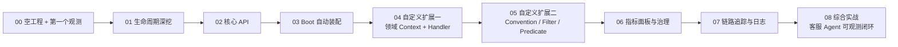

# 00 从空工程起步：第一个最小观测

> **定位**：这是 Observation 学习之旅的**第 0 关**——目标只有一个：**把一个 Spring Boot 4.1.0 工程跑起来，写第一行观测代码，在控制台亲眼看到一次观测的生命周期**。本篇不贪多，不一次抛概念，只做最小闭环：写代码 → 跑 → 看到效果。你走通这一关，就有了继续进阶的地基工程。
>
> **读者画像**：在 Spring Boot 4.1.0 里开发、从未接触过 Micrometer Observation 的工程师；或想用"动手"而不是"看概念"来入门的人。
>
> **前置**：Java 21、Maven、能跑 Spring Boot 4.1.0 的环境。
>
> **版本基准**：Spring Boot 4.1.0 + WebFlux + micrometer-observation 1.17（Boot 4.1 管理）。本篇代码已在该版本实测可运行。

---

## 0.1 为什么从"空工程"开始

Observation（可观测）不是一门"读会了就会写"的知识，它是**动手型**的——你只有亲眼看到 `START/STOP` 打出来、看到低/高基数的标签、看到指标怎么涨，才算真正理解它。所以这一整个 18-Observation 系列，全部基于**同一个逐步长大的工程**（你从这一关建起，之后每一关都在它上面加一块）：



每一关都**在上一篇的工程上加一层新能力**。到 08 你手里就是一个完整、可观测的 Agent 服务。今天先在 00 把地基打稳：**一个能跑的工程 + 第一个观测**。

> **学习方法提示**：每一关都按"建工程/加代码 → 跑起来 → 看输出 → 我该体会到的知识点"的顺序进行。**不要跳关**，因为后面的代码都假定你前面跑通过。

---

## 0.2 建工程：空 Spring Boot 4.1.0

### step1 建 Maven 工程 `pom.xml`

只需要两个依赖：

- **WebFlux**：这一系列用 WebFlux（响应式）写代码载体，反映真实生产形态（Spring AI 2.0 + Reactor）。
- **Actuator**：可观测的钥匙——它传递引入 `micrometer-observation` / `micrometer-core`，并自动装配 `ObservationRegistry`（第 03 关你会真切体会到它省了什么）。

```xml
<?xml version="1.0" encoding="UTF-8"?>
<project xmlns="http://maven.apache.org/POM/4.0.0"
         xmlns:xsi="http://www.w3.org/2001/XMLSchema-instance"
         xsi:schemaLocation="http://maven.apache.org/POM/4.0.0 https://maven.apache.org/xsd/maven-4.0.0.xsd">
    <modelVersion>4.0.0</modelVersion>

    <parent>
        <groupId>org.springframework.boot</groupId>
        <artifactId>spring-boot-starter-parent</artifactId>
        <version>4.1.0</version>
        <relativePath/>
    </parent>

    <groupId>com.example</groupId>
    <artifactId>obs-series</artifactId>
    <version>1.0-SNAPSHOT</version>

    <properties>
        <java.version>21</java.version>
    </properties>

    <dependencies>
        <!-- WebFlux：响应式 Web 载体 -->
        <dependency>
            <groupId>org.springframework.boot</groupId>
            <artifactId>spring-boot-starter-webflux</artifactId>
        </dependency>
        <!-- Actuator：可观测自动装配（ObservationRegistry / metrics）-->
        <dependency>
            <groupId>org.springframework.boot</groupId>
            <artifactId>spring-boot-starter-actuator</artifactId>
        </dependency>
    </dependencies>
</project>
```

### step2 主应用类

```java
package com.example.obsdemo;

import org.springframework.boot.WebApplicationType;
import org.springframework.boot.autoconfigure.SpringBootApplication;
import org.springframework.boot.builder.SpringApplicationBuilder;

@SpringBootApplication
public class ObsSeriesApplication {

    public static void main(String[] args) {
        // 用 REACTIVE（WebFlux）而非默认，明确走响应式栈
        new SpringApplicationBuilder(ObsSeriesApplication.class)
                .web(WebApplicationType.REACTIVE)
                .run(args);
        // 常驻，供后面的 curl 访问；由外部 Ctrl+C 结束（不要改成自动退出）
        try {
            Thread.sleep(Long.MAX_VALUE);
        } catch (InterruptedException ignored) {
        }
    }
}
```

### step3 跑起来

```bash
mvn spring-boot:run --server.port=18080
```

看到 `Netty started on port 18080` + `Started ObsSeriesApplication` 就成功了。**此刻你的应用一行观测代码都没有，但可观测的底座已经就位**（`ObservationRegistry` 已是 Bean，Actuator 端点也活了）。

> **验证一下 Actuator 在**：浏览器打开 `http://localhost:18080/actuator/health`，应该返回 `{"status":"UP"}`。这说明 Actuator 正常工作。

---

## 0.3 写第一个最小观测

### 一个能触发观测的接口

在工程里新建配置类 `ObsStep1Config.java`（包 `com.example.obsdemo.step1`）：

```java
package com.example.obsdemo.step1;

import io.micrometer.observation.Observation;          // 观测对象
import io.micrometer.observation.ObservationRegistry;  // 注册表（门面）
import io.micrometer.observation.ObservationTextPublisher; // 文本打印器：把观测的一生打印到控制台
import io.micrometer.common.KeyValue;                  // 标签（key-value）
import org.springframework.context.annotation.Bean;
import org.springframework.context.annotation.Configuration;
import org.springframework.web.reactive.function.server.*;
import static org.springframework.web.reactive.function.server.RequestPredicates.GET;

@Configuration
public class ObsStep1Config {

    // 一个演示用的注册表，加"文本打印器"：任何观测的一生都会逐行打在控制台
    // 第 03 关会换成"注入 Boot 的 Bean"，这里先用 create() 好理解原理
    private static final ObservationRegistry REGISTRY = ObservationRegistry.create();

    @Bean
    RouterFunction<ServerResponse> step1Routes() {
        return RouterFunctions.route(GET("/hello"), req -> {
            // ★ 这就是"一个最小观测"：把一段业务（Math.random()*100）包进观测
            double v = Observation.createNotStarted(
                            "hello.request",                        // ① 观测名（将来指标名/观测名）
                            () -> new Observation.Context(),        // ② 上下文（状态袋，第 03 关详讲）
                            REGISTRY)                               // ③ 注册表
                    .lowCardinalityKeyValue("path", "/hello")       // ④ 低基数标签
                    .highCardinalityKeyValue("session.id", "s-demo")// ⑤ 高基数标签
                    .observe(() -> Math.random() * 100);            // ⑥ 被测观测的业务（returns 值透传）
            return ServerResponse.ok().bodyValue("hello=" + v);
        });
    }

    @Bean
    ObservationTextPublisher textPublisher() {
        return new ObservationTextPublisher();   // 控制台逐行打印生命周期（本地调试神器）
    }
}
```

### 跑起来，看第一个生命周期

```bash
# 重启（如果之前启动着）：Ctrl+C 停掉，再
mvn spring-boot:run --server.port=18080
# 另开终端
curl http://localhost:18080/hello
```

控制台出现（**这就是一次观测的一生**）：

```
START - name='hello.request', contextualName='null', error='null', lowCardinalityKeyValues=[path='/hello'], highCardinalityKeyValues=[session.id='s-demo'], map=[], parentObservation=null
  OPEN - name='hello.request', contextualName='null', error='null', lowCardinalityKeyValues=[path='/hello'], highCardinalityKeyValues=[session.id='s-demo'], map=[], parentObservation=null
  CLOSE - name='hello.request', ...
  STOP - name='hello.request', ...
```

你还会看到 **外层多了一条 `http.server.requests`**（这是 Boot 的 Actuator 自动替你埋的 HTTP 出入口观测——你的请求进来时，框架帮你也观测了；第 03 关专门讲它）：

```
START - name='http.server.requests', low=[method='GET', status='200', uri='UNKNOWN'], high=[http.url='/hello']
  STOP - name='http.server.requests', low=[method='GET', status='200', uri='/hello'], ...
```

---

## 0.4 我该体会到的知识点（这一个只有四件，别贪多）

**① `Observation.createNotStarted(名字, () -> 上下文, 注册表)` 是入口**
你在业务代码里用它包住一段执行。记住签名的**三要素**：观测名、上下文（第 02 关详）、注册表（门面）。名字将来会变成**指标名**（第 06 关你会看到 `hello_request` 指标）。

**② `observe(...)` 一次 = 完整生命周期**
它在内部自动做：`start()` → 执行业务 → `stop()`，业务抛异常还会自动 `error()` 再重抛。你**不需要**手写 `start/stop`——这是刻意的设计（第 01 关你会看到手写的后果：容易漏 stop）。

**③ 低基数 vs 高基数（第一次遇见）**
```
lowCardinalityKeyValue  "path" = "/hello"   ← 取值有限 → 低基数
highCardinalityKeyValue "session.id"="s-demo" ← 每次请求不同 → 高基数
```
这一关你只要知道**它俩"看起来不同"**：一个会进指标 tag，一个只进 Span（第 02 关讲透为什么分家，第 06 关你会看到实际后果）。

**④ `ObservationTextPublisher` 是你的镜子**
它把每个观测的一生育 `INFO` 打到控制台。整个学习过程最重要的调试工具——**对看不懂的观测，挂它就看到了**。

---

## 0.5 这一关你会踩的坑

**坑1：在 `observe` 外手写 `start()...stop()`**——现阶段不要这样做。`observe()` 的函数式写法从结构上保证你不会忘记 `stop()`。等你第 01 关理解了生命周期，再考虑自己控制。漏 `stop()` 的后果：Timer 永不落账（指标缺数）、Span 悬空（追踪泄漏）。

**坑2：`createNotStarted` 第二参数直接传 Context 实例**（如 `createNotStarted("x", new Context(), reg)`）——编译**报错**。真实签名第二参数是 `Supplier<Context>`（`() -> new Observation.Context()`）。这是初学者必踩，后面几关我会再强调。

**坑3：`TargetNetty started` 没出来？** 检查 `server.port` 是否被占用、pom 是否真的引入了 webflux。

**坑4：curl 能通但控制台没输出？** 确认 `ObservationTextPublisher` 那个 `@Bean` 在；`mvn spring-boot:run` 的日志要看 `INFO` 级别（默认就是）。

---

## 0.6 适用场景与不适用场景（这一关）

**适用**：第一次接触 Observation、想先建立"能跑、能看到效果"的信心；作为后面所有关卡（01-08）的工程起点。

**不适用**：已经会 Observation、想直接在工程里用——那你应该跳到 [03 Boot 自动装配]，或直接看更高关卡。这一关是"打地基"，不是"上房梁"。

---

## 0.7 总结

这一关你完成了三件事：**建起一个能跑的 Spring Boot 4.1.0 空工程、写了第一行 `createNotStarted().observe()` 观测、在控制台亲眼看到了一次 `START→...→STOP`**。你现在有两个法宝：

1. **地基工程**（`obs-series`）——之后每一关都在这上面加；
2. **`ObservationTextPublisher` 镜子**——看清任何观测。

下一关 [01 生命周期深挖] 我们把这面镜子对准观测本身——把上次 `observe()` 自动帮你做的事，拆开一件件看清楚，并学会何时该自己控制。

**外部来源**：[Micrometer Observation 官方文档](https://micrometer.io/docs/observation) · [Spring Boot Observability](https://docs.spring.io/spring-boot/reference/actuator/observability.html)
