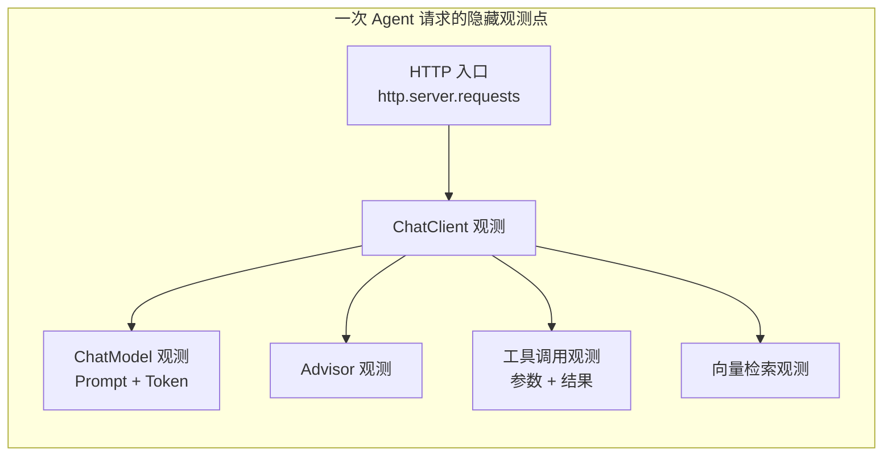

# 00 最小闭环：让 Agent 的每次思考与工具调用打印到控制台

> **定位**：本系列的起点不是"Observation 概念课"，而是一个你在工业场景里真实关心的问题——**我的 Agent 到底经历了哪些阶段？LLM 收到了什么？工具带了什么参数、返回了什么？** 这一篇先把这些"看见"，最朴素地落在 console 上。跑通它，你就拥有了整个系列的实验田。
>
> **读者画像**：已经在用 Spring AI 2.0 写 Agent（ChatClient + @Tool），想让调用过程可观测的 Java 工程师。默认你已跑通 demo01 基础工程（demo profile：webflux + spring-ai-openai + lombok）。
>
> **前置阅读**：[教程 02-ChatClient与对话模型]、[教程 03-工具调用]。
> **版本基准**：Spring Boot 4.1.0 + Spring AI 2.0.0 + WebFlux + Java 21，全部 API 经本地 jar javap 实证（铁律 0）。

---

## 0.1 为什么 Observation 是你在 Spring AI 2.0 里"捡到的宝"

你在学 Spring AI 2.0 时无意撞见 Observation——这不是偶然。Spring AI 2.0 在**每一个关键阶段都预埋了观测点**（本地 jar 实证）：

| 观测点 | 所在 jar | 领域 Context（真实类名） | 你能看到什么 |
|---|---|---|---|
| ChatClient 调用 | spring-ai-client-chat | `ChatClientObservationContext` | 一次 `.prompt().call()` 的整体耗时、请求参数 |
| ChatModel 调用 | spring-ai-model | `ChatModelObservationContext` | 发给 LLM 的完整 Prompt、返回的 ChatResponse、**Token 用量** |
| 工具调用 | spring-ai-model | `ToolCallingObservationContext` | `getToolDefinition()`（工具名/描述/Schema）、`getToolCallArguments()`（入参 JSON）、`getToolCallResult()`（返回值） |
| Advisor | spring-ai-client-chat | `AdvisorObservationContext` | 每个 Advisor 的执行耗时 |
| 向量检索 | spring-ai-vector-store | `VectorStoreObservationContext` | 检索维度、TopK、命中文档数 |



关键认知：**你一行观测代码都不用写，这些观测点已经在框架里**。你要做的只是"接上收音机"——注册一个 `ObservationHandler`，把观测事件收下来。工业场景里这意味着：巡检 Agent 调了哪个设备的接口、参数对不对、LLM 幻觉前收到了什么上下文——全部有据可查。

> 「想深入 Micrometer Observation 通用原理？→ [教程 22-全链路可观测性 §2]」

## 0.2 本系列的演进主线（先看清全貌）

整个系列在 demo01 **一个不断长大的工程**上推进，主线严格遵循你要的路径：**先 console → 再自定义 → 再前端 → 再 trace → 再治理**：

```mermaid
graph LR
    A["00 console看见<br/>框架原生观测"] --> B["01 读懂输出<br/>span与生命周期"]
    B --> C["02 组件交互<br/>Registry/Handler/Convention"]
    C --> D["03 自定义Handler<br/>收集Agent阶段事件"]
    D --> E["04 Convention/Filter<br/>班次标签+收尾加工"]
    E --> F["05 前端展示<br/>SSE推送时间线"]
    F --> G["06 Trace<br/>traceId全链路贯穿"]
    G --> H["07 指标治理<br/>Token计量+基数熔断"]
    H --> I["08 流式观测<br/>span闭合与中断"]
    I --> J["09 RAG观测<br/>检索质量可观测"]
    J --> K["10 测试与传播<br/>TestRegistry+traceparent"]
    K --> L["11 深度整合<br/>SpringAI2×Observation全景"]
    L --> M["12 综合实战<br/>工业巡检Agent闭环"]
```



业务载体统一为**工业现场巡检 Agent**：工具集从 `TimeTool` 起步（时间/班次感知），09 关再补 RAG 知识库检索——工具面刻意精简，观测面才能聚焦。

## 0.3 Step 1：打开 observation profile

demo01 的 pom.xml 已经用 profile 管理依赖（你的编程习惯）。观测需要**同时**激活 demo 与 observation 两个 profile：

```xml
<!-- 已存在于 pom.xml，无需改动 -->
<profile>
    <id>observation</id>
    <activation>
        <property>
            <name>demo.observation</name>
            <value>observation</value>
        </property>
    </activation>
    <dependencies>
        <dependency>
            <groupId>org.springframework.boot</groupId>
            <artifactId>spring-boot-starter-actuator</artifactId>
        </dependency>
    </dependencies>
</profile>
```

Actuator 是钥匙：传递引入 `micrometer-observation`，并自动装配 `ObservationRegistry` Bean——Spring AI 的所有观测点都往这个 Registry 里发事件。

## 0.4 Step 2：装上"收音机"——ObservationTextPublisher

`ObsConfig` 只加一个 Bean（一行生效的 console 输出）：

```java
// src/main/java/demo/demo01/config/ObsConfig.java
package demo.demo01.config;

import io.micrometer.observation.ObservationTextPublisher;
import org.springframework.context.annotation.Bean;
import org.springframework.context.annotation.Configuration;

@Configuration
public class ObsConfig {

    /** 最朴素的观测消费者：把每个观测事件 toString 后打到 console */
    @Bean
    public ObservationTextPublisher observationTextPublisher() {
        return new ObservationTextPublisher();
    }
}
```

**为什么是它**：`ObservationTextPublisher` 是 Micrometer 自带的 `ObservationHandler`，在观测的 stop/error 时机打印整段观测。它就是后面所有自定义 Handler 的"原型"——你现在用它，03 关会自己写一个。

## 0.5 Step 3：写最小工业 Agent（一个工具类 + 一个配置类）

```java
// src/main/java/demo/demo01/tools/TimeTool.java（完整文件）
package demo.demo01.tools;

import org.springframework.ai.tool.annotation.Tool;

import java.time.LocalDateTime;
import java.time.format.DateTimeFormatter;

public class TimeTool {

    @Tool(description = "获取当前系统时间，格式 yyyy-MM-dd HH:mm:ss。巡检、工单、报告都需要时间戳时必须先调用此工具")
    public String getCurrentTime() {
        return LocalDateTime.now().format(DateTimeFormatter.ofPattern("yyyy-MM-dd HH:mm:ss"));
    }
}
```

**为什么从 TimeTool 起步**：LLM 自己没有时钟，问它"现在几点"必幻觉。给它 `getCurrentTime` 后，结论里的时间戳才是真的——这也是工业场景的经典坑（工单时间错误会导致追溯错位）。更妙的是，它是**最干净的观测实验对象**：无参数、执行快、结果确定，正好用来观察"LLM 何时决定调工具"（问时间才调，不问不调）。整个系列就用这一个工具类贯穿——01 关它会长出第二个方法（班次查询），业务面足够，观测面反而更聚焦。

按 demo01 习惯：**工具类不挂 `@Component`**（`new TimeTool()` 注册进 Builder 即可），ChatClient 统一在 `ChatConfig` 里用 Boot 自动装配的 `ChatClient.Builder` 建，controller 只注入现成 Bean：

```java
// src/main/java/demo/demo01/config/ChatConfig.java（完整文件）
package demo.demo01.config;

import demo.demo01.tools.TimeTool;
import org.springframework.ai.chat.client.ChatClient;
import org.springframework.context.annotation.Bean;
import org.springframework.context.annotation.Configuration;

@Configuration
public class ChatConfig {
    @Bean
    public ChatClient chatClient(ChatClient.Builder builder) {
        return builder
                .defaultTools(new TimeTool())   // ★ 注册时间工具；Builder 已带 ObservationRegistry，观测自动生效
                .build();
    }
}
```

```java
// src/main/java/demo/demo01/controller/InspectionController.java（完整文件）
package demo.demo01.controller;

import org.springframework.ai.chat.client.ChatClient;
import org.springframework.beans.factory.annotation.Autowired;
import org.springframework.web.bind.annotation.GetMapping;
import org.springframework.web.bind.annotation.RequestMapping;
import org.springframework.web.bind.annotation.RestController;

@RestController
@RequestMapping("/demo01")
public class InspectionController {
    @Autowired
    private ChatClient client;

    @GetMapping("/inspect")
    public String inspect(String prompt) {          // ★ 隐式参数绑定（demo01 习惯）
        return client.prompt().user(prompt).call().content();
    }
}
```

application.yaml 的 `spring.ai` 段配置如下（api-key 用环境变量占位，观测三开关默认全关、本系列学习期打开；Spring AI 2.0.0 真实配置键）：

```yaml
# src/main/resources/application.yaml
spring:
  ai:
    openai:
      api-key: ${DEEPSEEK_API_KEY}
      base-url: ${DEEPSEEK_BASE_URL}
      chat:
        options:
          model: deepseek-chat
    chat:
      observations:
        log-prompt: true        # Prompt 内容进入观测上下文
        log-completion: true    # 模型回复内容进入观测上下文
    tools:
      observations:
        include-content: true   # 工具参数与结果进入观测上下文
```

## 0.6 Step 4：跑起来，亲眼看

```bash
mvn spring-boot:run -Ddemo.demo=demo -Ddemo.observation=observation
```

## 0.7 用 Postman 测试

| 项 | 内容 |
|---|---|
| 方法 | `GET` |
| URL | `http://localhost:8080/demo01/inspect?prompt=现在几点了？给今天的巡检记录写个带时间戳的开头` |
| Headers | 无特殊要求 |

**预期现象**：

1. Postman 返回一段自然语言结论，**时间部分是真实系统时间**（非模型幻觉）；
2. **IDEA console 打出多段观测文本**，按时间顺序你会看到类似：
   - `name='http.server.requests'`（HTTP 入口观测）
   - `name='spring.ai.chat.client'`（ChatClient 层）
   - `name='spring.ai.chat.client.chat_model' ... ContextualName=chat "deepseek..."`（第 1 次 LLM 调用，带 `gen_ai.*` 标签与 prompt 内容）
   - `name='spring.ai.tool'`（工具调用，标签里有 `gen_ai.tool.call.name='getCurrentTime'` 与结果时间戳）
   - 再一段 `chat_model`（第 2 次 LLM 调用，拿工具结果生成结论）
3. 把 prompt 换成不含时间诉求的闲聊（如"你好"），对比发现**没有 tool 观测**——LLM 没决定调工具时，观测如实反映。

**这几行 console 输出就是本篇的全部目标**：Agent 的"思考（LLM）→ 决策（选工具）→ 行动（执行）→ 总结（再调 LLM）"每一步都被框架观测点捕获了。

## 0.8 本关沉淀

- Spring AI 2.0 已埋好五类观测点，你只需注册 Handler 消费；
- `ObservationTextPublisher` 是最小"收音机"，Actuator 提供 `ObservationRegistry`；
- 三个配置键控制内容暴露（`log-prompt/log-completion/include-content`），默认全关——生产环境要谨慎打开（脱敏见 04 关）。

**下一关**：这些输出每一行什么意思？`Observation.Context` 是什么？→ [附录 18-Observation/01]
