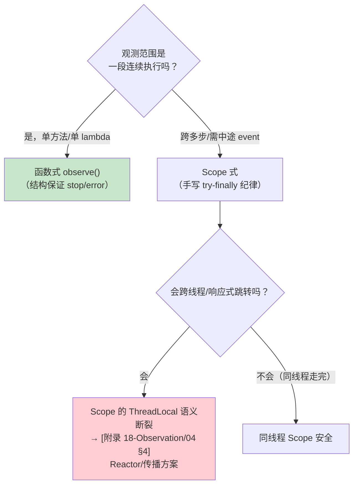
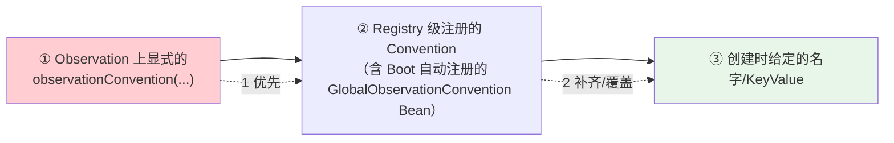

# 核心 API 与生命周期

> **定位**：本文把 [附录 18-Observation/00] 的概念落到代码——Observation 的三种创建方式、两种使用风格（函数式 vs Scope 式）、KeyValue 与基数、Context 的状态袋语义、Convention 的解析顺序、Handler 的回调矩阵，以及离线调试（ObservationTextPublisher）与单元测试（TestObservationRegistry）。全部示例基于真实 Micrometer API，与 [附录 05-SpringAI2-API基准/02] 的真实性基准一致。
>
> **读者画像**：要在业务代码里动手写插桩、写自定义 Handler、或读懂 Spring AI 源码里 Observation 用法的工程师。
>
> **前置阅读**：[附录 18-Observation/00-Observation全景与核心概念]。**依赖**：micrometer-observation 随 spring-boot-starter-actuator 传递引入（[附录 18-Observation/02 §1]）；单独使用时**需在 pom.xml 中添加依赖**：

```xml
<dependency>
    <groupId>io.micrometer</groupId>
    <artifactId>micrometer-observation</artifactId>
</dependency>
<!-- 单元测试支持（真实模块） -->
<dependency>
    <groupId>io.micrometer</groupId>
    <artifactId>micrometer-observation-test</artifactId>
    <scope>test</scope>
</dependency>
```

---

## 1. 创建 Observation：三个工厂

```java
// ① 最常用：名字 + Registry（Context 自动创建）
Observation obs1 = Observation.createNotStarted("tool.exec", registry);

// ② 携带自定义 Context（领域观测上下文的入口——Handler 用 supportsContext 分流）
MyToolContext ctx = new MyToolContext(toolDefinition, toolCall);
Observation obs2 = Observation.createNotStarted("tool.exec", ctx, registry);

// ③ 全约定式：命名与 KeyValue 全部委托给 Convention（框架内置埋点的形态）
Observation obs3 = Observation.createNotStarted(
        new ToolObservationConvention(), toolContext, registry);
```

创建后、`start()` 前是**配置窗口**——Builder 风格链式设置（全部返回自身，可自由组合）：

```java
Observation obs = Observation.createNotStarted("tool.exec", toolCtx, registry)
        .contextualName("tool-exec getWeather")        // Span 展示名（不影响指标名）
        .lowCardinalityKeyValue("tool.name", "getWeather")   // 有界 → 指标 tag + Span
        .highCardinalityKeyValue("tool.args", "{\"city\":\"北京\"}") // 无界 → 仅 Span
        .observationConvention(customConvention);      // 交给约定补齐命名/标签
```

## 2. 两种使用风格：函数式优先，Scope 式按需

### 2.1 函数式（推荐）：结构上杜绝忘记 stop

```java
// Supplier 版：返回值透传；异常自动 error() + 重抛；stop 由框架保证
String result = Observation.createNotStarted("tool.exec", registry)
        .lowCardinalityKeyValue("tool.name", "getWeather")
        .observe(() -> weatherClient.fetch(city));   // 一行 = 全生命周期

// Runnable 版：无返回值
observation.observe(() -> auditSink.write(record));

// observe(Function)：入参透传（少一层闭包）
Observation.createNotStarted("llm.call", registry)
        .observe(prompt -> chatModel.call(prompt), userPrompt);
```

函数式的本质：`observe` 内部就是 try-with-resources 的 `openScope()` + try-catch-finally（异常 → `error(t)`，最终 → `stop()`）。**只要能用函数式就不要手写生命周期**。

### 2.2 Scope 式：需要"跨多行、跨对象"持有现行观测时

```java
Observation obs = Observation.createNotStarted("saga.step", registry)
        .contextualName("saga-extract")
        .start();
try (Observation.Scope scope = obs.openScope()) {
    // 在此线程内，obs 是"现行"：新建的 Observation 自动成为它的子级
    step1();
    step2();
    obs.event(new Observation.Event("step.progress"));  // 过程信号（onEvent 回调）
} catch (Exception e) {
    obs.error(e);          // 记录失败（异常名进 tag / Span 事件）
    throw e;
} finally {
    obs.stop();            // 必须：stop 触发 Filter → 全部 Handler 的 onStop
}
```

选择判据（不是偏好，是结构）：



## 3. KeyValue 与基数：一次讲透

```java
KeyValue low = KeyValue.of("tool.name", "getWeather");      // 有界：工具名集合有限
KeyValue high = KeyValue.of("session.id", sessionId);       // 无界：随会话增长
KeyValues both = KeyValues.of("status", "ok", "retry", "false");  // 批量
```

| 通道 | lowCardinality | highCardinality |
|------|---------------|-----------------|
| 指标（MeterObservationHandler） | ✅ 变成 tag（每唯一值一条时间序列） | ❌ 不进指标 |
| Span（TracingObservationHandler） | ✅ | ✅ |
| 检索/成本归因 | 聚合维度（按工具/模型/状态分组） | 单条定位（这一会话/这一次调用） |

工程纪律（[教程 22] 基数治理的机制层）：每个低基数 tag 上线前回答"取值空间有没有上界"；租户/用户/会话一律高基数；`gen_ai.system`、`gen_ai.request.model`、`spring.ai.tool.definition.name` 这类天然有界的是低基数（[教程 22 §4] 属性表已按此分类）。

## 4. Context：状态袋，而不只是属性袋

`Observation.Context` 同时干两件事：

1. **装 KeyValue**（上面 §3，stop 时被 Handler 消费）；
2. **装任意对象**（`put(key, value)` / `get(key)`，key 是 `Object` 引用，常以静态常量或 Class 做 key）——Handler 与 Filter 之间传递"请求对象、响应对象、工具定义"的通道：

```java
// Spring AI 真实领域上下文（javap 实证）：org.springframework.ai.tool.observation.ToolCallingObservationContext
// 是 final 类 extends Observation.Context，构造走 builder()——不存在 "ToolObservationContext" 这个类
ToolCallingObservationContext ctx = ToolCallingObservationContext.builder()
        .toolDefinition(toolDefinition)   // ToolDefinition
        .toolCallId(callId)               // String
        .toolCallArguments(argsJson)      // String（参数 JSON）
        .toolCallResult(resultJson)       // String（结果 JSON）
        .build();
// 真实 getter：getToolDefinition()/getToolCallId()/getToolType()/getToolCallArguments()/getToolCallResult()/getOperationMetadata()
// Handler 通过强转拿到领域字段（[附录 05-02 §3.1] 基准用法）
```

**父子链**：Context 上能拿到 `getParentObservation()`——Span 树（[教程 22 §3]）在 API 层的呈现。**不要**往 Context 塞大对象引用后忘记生命周期：Context 的存活期 = Observation 存活期，塞进去的引用会阻止 GC。

## 5. Convention：不改业务代码的定制层

`ObservationConvention` 四个方法：`getName()`、`getContextualName(ctx)`、`getLowCardinalityKeyValues(ctx)`、`getHighCardinalityKeyValues(ctx)`。解析顺序（谁覆盖谁）：



实践含义：**想改框架默认埋点的标签 → 写 Convention 注册进 Registry，而不是去改框架代码**。这就是 [教程 23 §] 编程式控制工具 Observation 内容记录的机制——自定义 `ToolObservationConvention` 补充业务标签（如租户、审批状态），业务零侵入。

## 6. Handler 回调矩阵

`ObservationHandler<T extends Observation.Context>` 的七个回调，以及典型实现各自关心哪些：

| 回调 | 时机 | MeterHandler 用途 | TracingHandler 用途 | 你的审计 Handler 典型用途 |
|------|------|-------------------|--------------------|--------------------------|
| `supportsContext(ctx)` | 分发前 | 类型过滤 | 同左 | **只认领域 Context**（`instanceof ToolCallingObservationContext`，javap 实证） |
| `onStart(ctx)` | `start()` | 记起始时间 | 创建并开启 Span | 补充起始状态进 ctx |
| `onScopeOpened/ Closed/ Reset(ctx)` | Scope 开关 | 少用 | 切换 current Span | 一般不用 |
| `onEvent(event, ctx)` | `event(...)` | 少用 | Span 事件 | 记录过程节点（retry/approved） |
| `onError(ctx)` | `error(t)` | error tag 素材 | Span 异常状态 | 错误分类审计 |
| `onStop(ctx)` | `stop()`（Filter 之后） | Timer.record | span.end | **主战场：落审计记录** |

两条纪律：`supportsContext` 必须实现且尽量廉价（每个 Observation 都会问一遍所有 Handler）；**`Observation.Context` 没有 `getDuration()`**（javap 实证）——时长由 `MeterHandler` 的 `Timer`/`span.end()` 记录；你的 Handler 若需要时长，用 `ctx.put(Object, T)` 在 `onStart` 存 `System.nanoTime()`、`onStop` 计算（或直接用框架指标/链路时长）。[教程 23 §9.1] 的自记起止写法同理。

## 7. 调试与测试

### 7.1 ObservationTextPublisher：五分钟看清生命周期

```java
@Bean
ObservationTextPublisher observationTextPublisher() {
    return new ObservationTextPublisher();   // 控制台逐行打印每个 Observation 的完整信息
}
```

本地开发挂上它，任何埋点（含 Spring AI 的 gen_ai.*）的生命周期、KeyValue、时长直接打到控制台——**比翻文档快**。生产环境不要注册（System.out 是性能税与噪音）。

### 7.2 TestObservationRegistry：单测断言埋点

```java
// test 依赖：micrometer-observation-test
TestObservationRegistry registry = TestObservationRegistry.create();

new ToolExecutor(registry).execute(weatherTool);

ObservationRegistryAssert.assertThat(registry)
        .hasObservationWithNameEqualTo("tool.exec")   // 产生了观测
        .that()
        .hasLowCardinalityKeyValue("tool.name", "getWeather")
        .hasHighCardinalityKeyValue("session.id", "s-123");
```

这个测试能力直接支撑 [附录 04-测试策略/00-单元测试] 的可观测性用例：**埋点也是代码，也要测**——"审计 Handler 记下了失败工具的异常类型"完全可以用 TestObservationRegistry 断言，而不必等到联调环境看 Zipkin。

## 8. 适用场景与不适用场景

### 适用场景

- 服务/组件边界的标准插桩（工具执行、任务步骤、外部调用包装）
- 领域观测上下文（子类 Context + 类型化 Handler）——Spring AI 同款机制
- 埋点的单元测试（TestObservationRegistry + 断言）

### 不适用场景

- 高频内层循环（每次循环一个 Observation → Handler 开销线性放大）：观测打在批次层，循环次数做 KeyValue
- 纯状态量（Gauge 语义）：直接 MeterRegistry（[附录 18-Observation/00 §8]）
- 需要拿到"观测对象本身"传递给异步任务的场景：Scope 断了，得走传播机制（[附录 18-Observation/04]）

## 9. 常见误区与反模式

1. **手写 start/stop 不用函数式、还没有 finally**——异常路径漏 stop，指标/ Span 泄漏；能 observe() 就 observe()。
2. **stop 之后再补 KeyValue**——晚了，onStop 已快照；补标签走 ObservationFilter（stop 前、Handler 前执行，[附录 18-Observation/03 §3]）。
3. **Context.get(key) 与 KeyValue 混淆**——`get()` 拿的是 `put()` 进去的状态对象；KeyValue 用 `getLowCardinalityKeyValue`?（不存在单值 getter，[附录 05-02 §3.1] 审计基准：遍历 KeyValues 或走 Context 专用 getter）。写 Handler 时用领域 Context 的 getter，别做字符串找标签。
4. **在 supportsContext 里做重逻辑**——每个 Observation × 每个 Handler 都会调；反射/IO 是灾难。
5. **测试只测业务不测埋点**——埋点坏了静默无声（指标消失、审计缺失），TestObservationRegistry 把它变成显式失败。

## 10. 总结

API 层的肌肉记忆：**创建（createNotStarted + 链式配置）→ 用（函数式优先）→ 定制（Convention 改名/标签，Filter 补加工）→ 消费（Handler 矩阵，onStop 主战场）→ 验证（TextPublisher 本地看 + TestObservationRegistry 单测断言）**。下一篇看 Spring Boot 如何把这套 API 自动装配成开箱即用：[附录 18-Observation/02-SpringBoot自动装配与配置]。

**外部来源**：[Micrometer Observation API](https://micrometer.io/docs/observation) · [Observation Javadoc](https://javadoc.io/doc/io.micrometer/micrometer-observation) · [Micrometer Tracing API](https://docs.micrometer.io/tracing/reference/api.html)
