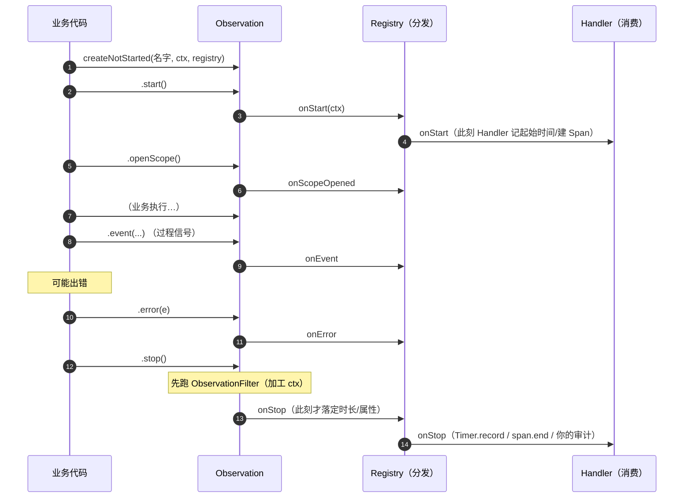
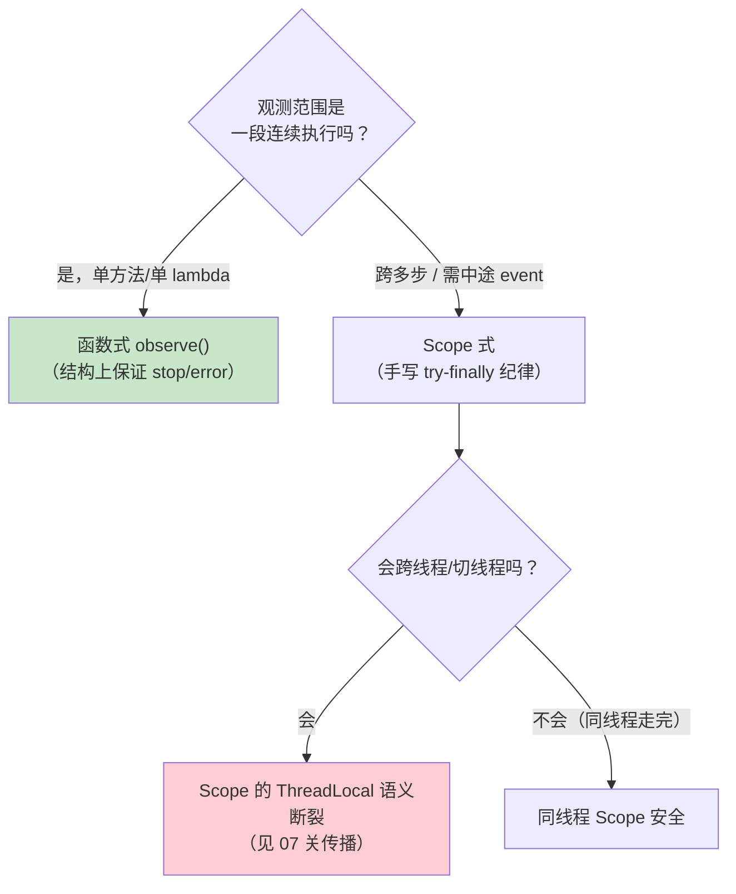

# 01 生命周期深挖：一次观测的一生

> **定位**：第 00 关你用 `observe()` 写了一次观测、看到了 START/STOP。这一关我们把 `observe()` 自动做的事**拆开**，把一次观测的一生（生命周期回调）逐一讲清，并用接口触发观察。**这是整个 Observation 最核心的机制**——后面所有扩展点（Handler/Filter/Convention/Predicate）都挂在生命周期的某个节点上。
>
> **进阶路径**：在 00 的工程基础上，新增"生命周期深挖"这一层。你会用到上一关的 `ObsStep1Config`，再加新的接口。
>
> **前置**：[00 从空工程起步] 已跑通。
>
> **版本基准**：Spring Boot 4.1.0 + micrometer-observation 1.17。代码已实测。

---

## 1. 为什么这一关最重要

第 00 关你看到了一次观测的 `START→OPEN→(业务)→CLOSE→STOP`。但你可能没意识到：**这几个节点是"钩子"**——框架/你可以在每个节点挂 Handler 做点事。理解了这一点，你就理解了 Observation 的整个骨架：

- 想让观测**顺便出个指标**？→ 在 onStop 挂指标 Handler
- 想让观测**顺便成个 Span**？→ 在 onStart 挂 tracing Handler
- 想让观测**顺便做个审计**？→ 在 onStop 挂审计 Handler

**同一份观测，挂了几个 Handler 就产出几类数据**——这就是门面模型。这一关我们把"有哪些回调、各自什么时候触发"讲死，下一关起你就知道往哪挂东西。

---

## 2. 一次观测的一生：完整生命周期图

先看这张图（这是骨干，下面每一个节点都会讲到）：



**七个回调**（`ObservationHandler` 接口）与时机：

| 回调 | 触发时机 | 典型用途 |
|------|---------|---------|
| `supportsContext(ctx)` | 分发前（每个观测×每个 Handler 都会问） | 判断"这是不是我要的那种观测"（类型过滤） |
| `onStart` | `start()` | 记起始时间、建 Span |
| `onScopeOpened` / `onScopeClosed` / `onScopeReset` | `openScope()` 开关 | 切换"现行"观测 |
| `onEvent` | `event(...)` | 记录过程节点（如 retry、首 token）|
| `onError` | `error(e)` | 记录异常 |
| `onStop` | `stop()`（Filter 之后） | **主战场**：落指标 / span / 审计 |

> **核心认知：`onStop` 是所有 Handler 消费数据的时刻**。属性在 stop 时快照、Filter 在 stop 前加工、你的审计 Handler 在 onStop 落库——都在"STOP"这一个节点收口。

---

## 3. 动手：用函数式 vs Scope 式，看两种生命周期的差异

第 00 关你用了 `observe()`（函数式）。这一关我们还需要能"跨多行 + 打事件"的 **Scope 式**。在工程新增 `ObsStep2Config.java`（包 `demo.demo01.step2`），**沿用 `@RestController` 的方式注册接口**（和你的 `ChatController` 同一套编码习惯）：

```java
package demo.demo01.step2;

import io.micrometer.observation.Observation;
import io.micrometer.observation.Observation.Event;
import io.micrometer.observation.ObservationRegistry;
import io.micrometer.observation.Observation.Scope;
import org.springframework.web.bind.annotation.GetMapping;
import org.springframework.web.bind.annotation.RestController;

@RestController
public class ObsStep2Config {

    private final ObservationRegistry registry;   // 注入 Boot 的注册表（00 关铁律）

    public ObsStep2Config(ObservationRegistry registry) {
        this.registry = registry;
    }

    // ---------- ① 函数式（推荐）：observe() 自动 start+stop，返回值透传 ----------
    @GetMapping("/life/functional")
    public String functional() {
        return Observation.createNotStarted("life.fn", () -> new Observation.Context(), registry)
                .lowCardinalityKeyValue("style", "functional")
                .observe(() -> {                  // observe(Supplier)：返回值透传
                    doWork(30);                   // 业务执行（模拟耗时）
                    return "fn done";             // 这个返回值会作为 curl 的响应
                });
    }

    // ---------- ② Scope 式（需要自己控制时） ----------
    @GetMapping("/life/scoped")
    public String scoped() {
        Observation obs = Observation.createNotStarted("life.sc", () -> new Observation.Context(), registry)
                .lowCardinalityKeyValue("style", "scoped")
                .contextualName("scoped-work")    // Span 展示名（不影响指标名）
                .start();                          // 显式 start（函数式已帮你做）
        try (Scope scope = obs.openScope()) {      // OPEN / CLOSE 时刻由此控制
            doWork(30);
            obs.event(Event.of("step1"));          // onEvent：过程节点1
            doWork(20);
            obs.event(Event.of("step2"));          // onEvent：过程节点2
            return "scoped done";
        } catch (Exception e) {
            obs.error(e);                          // onError：记录失败
            throw e;
        } finally {
            obs.stop();                            // ★ 必须：finally 里 stop（否则泄漏）
        }
    }

    // ---------- ③ 异常路径 ----------
    @GetMapping("/life/error")
    public String errorFlow() {
        try {
            Observation.createNotStarted("life.err", () -> new Observation.Context(), registry)
                    .lowCardinalityKeyValue("style", "error")
                    .observe(() -> {               // observe 内部：异常→error()→重抛→stop()
                        doWork(10);
                        throw new IllegalStateException("故意出错");
                    });
            return "不会到这里";
        } catch (IllegalStateException e) {
            return "err caught: " + e.getMessage();
        }
    }

    private void doWork(long ms) {
        try { Thread.sleep(ms); } catch (InterruptedException ignored) {}
    }
}
```

### 跑起来，对比三种接口的控制台输出

```bash
curl http://localhost:18080/life/functional
curl http://localhost:18080/life/scoped
curl http://localhost:18080/life/error
```

**`/life/functional`**——函数式，一条 `observe()` 就打出完整生命周期，**没有手写的痕迹**：

```
START - name='life.fn', low=[style='functional'], ...
  OPEN - name='life.fn', ...
  CLOSE - name='life.fn', ...
  STOP - name='life.fn', ...
```

**`/life/scoped`**——Scope 式，你能在两个事件之间看到生命周期被"切开"：

```
START - name='life.sc', contextualName='scoped-work', low=[style='scoped'], ...
  OPEN - name='life.sc', ...
（第一次 event → onEvent）
（第二次 event → onEvent）
  CLOSE - name='life.sc', ...
  STOP - name='life.sc', ...
```

**`/life/error`**——业务抛异常，`observe()` 自动 `error(e)` + 重抛 + `stop()`：

```
START - name='life.err', low=[style='error'], ...
  STOP - name='life.err', error='IllegalStateException'    ← 异常名被记进观测
```

> 你看到 `STOP` 行里多了 `error='IllegalStateException'`——异常名被记录成了观测的一个属性。它到底是进指标 tag 还是只进 Span，属于第 02 关的"基数"话题，但你先记住：**Exception 是会"进观测的"。**

---

## 4. 函数式 vs Scope 式：什么时候用哪个

这一关你亲手体验了两种写法的差异。**选型不是偏好，是结构**——两种写法对应两种不同的观测范围：



**三句话记住**：
1. **能函数式就函数式**——`observe()` 从结构上杜绝你忘记 `stop()`。漏 stop 的代价：Timer 永不落账（指标缺数）、Span 悬空（追踪泄漏）。
2. **要跨多行/打事件才 Scope 式**——手动 `try(openScope()){...}catch{error}finally{stop}` 纪律。结构上你亲眼看到 `start/stop`、`event` 出现在哪。
3. **Scope 是 ThreadLocal 语义**——同一线程内"现行"；一旦跨线程/响应式就断（这就是 [07 链路与传播] 的地基，也是 WebFlux 铁律的根源）。

---

## 5. 手动写 Handler 看回调矩阵：不止于 TextPublisher

`ObservationTextPublisher` 是框架给的"打印器"。这一关你写一个**自己的 Handler**，亲眼看看七个回调各自什么时候触发——这比背矩阵有用：

```java
package demo.demo01.step2;

import io.micrometer.observation.Observation.Context;
import io.micrometer.observation.ObservationHandler;
import org.springframework.context.annotation.Bean;
import org.springframework.context.annotation.Configuration;

@Configuration
public class CallbackSpyConfig {

    @Bean
    ObservationHandler<Context> callbackSpy() {
        return new ObservationHandler<>() {
            // 只对 /life 系列观测感兴趣（廉价短路）
            @Override public boolean supportsContext(Context ctx) {
                return ctx.getName() != null && ctx.getName().startsWith("life");
            }
            @Override public void onStart(Context ctx)       { log(ctx, "onStart"); }
            @Override public void onStop(Context ctx)        { log(ctx, "onStop"); }
            @Override public void onError(Context ctx)       { log(ctx, "onError"); }

            private void log(Context ctx, String when) {
                System.out.println("[spy] " + when + " name=" + ctx.getName()
                        + " error=" + (ctx.getError()==null?"none":ctx.getError().getClass().getSimpleName()));
            }
        };
    }
}
```

> `supportsContext` **必须实现且尽量廉价**——每个观测 × 每个 Handler 都会问一遍（[02 §Context]）。别在里面做反射/IO。

把这个 Handler 注册进工程后，再调 `life/scoped`，控制台会同时出现 `[spy] onStart/onStop` 和 TextPublisher 的输出。**你看到了吗：onStop 时 `ctx.getError()` 能拿到异常**——这是后面做失败分类审计的关键（[04]）。

---

## 6. 接口测试：把生命周期固化下来

"埋点（lifecycle 也是）是代码，要能测。" 给工程加 `spring-boot-starter-test` + `micrometer-observation-test`（[00] 的 pom 没含测试依赖，需补）：

```xml
<dependency>
    <groupId>org.springframework.boot</groupId>
    <artifactId>spring-boot-starter-test</artifactId>
    <scope>test</scope>
</dependency>
<dependency>
    <groupId>io.micrometer</groupId>
    <artifactId>micrometer-observation-test</artifactId>
    <scope>test</scope>
</dependency>
```

测试代码（`src/test/java/demo/demo01/step2/LifecycleTest.java`）：

```java
package demo.demo01.step2;

import io.micrometer.observation.Observation;
import io.micrometer.observation.tck.TestObservationRegistry;
import io.micrometer.observation.tck.TestObservationRegistryAssert;
import org.junit.jupiter.api.Test;

class LifecycleTest {

    @Test
    void scoped_flow_emits_start_and_event() {
        TestObservationRegistry reg = TestObservationRegistry.create();
        Observation obs = Observation.createNotStarted("life.sc", () -> new Observation.Context(), reg).start();
        try (Observation.Scope scope = obs.openScope()) {
            obs.event(Observation.Event.of("step1"));
        } finally {
            obs.stop();
        }
        TestObservationRegistryAssert.assertThat(reg)
                .hasObservationWithNameEqualTo("life.sc");   // 断言"产生了这个观测"
    }

    @Test
    void observe_wraps_exception_and_marks_error() {
        TestObservationRegistry reg = TestObservationRegistry.create();
        try {
            Observation.createNotStarted("life.err", () -> new Observation.Context(), reg)
                    .observe(() -> { throw new IllegalStateException("boom"); });
        } catch (IllegalStateException ignored) {}
        // 异常被 error() 记录了（这里可通过遍历 ctx 或断言观测存在）
        TestObservationRegistryAssert.assertThat(reg)
                .hasObservationWithNameEqualTo("life.err");
    }
}
```

> **⚠ 类型名要准（实测）**：断言类是 `io.micrometer.observation.tck.TestObservationRegistryAssert`（**不是** `ObservationRegistryAssert`——那个类没有 `hasObservationWithNameEqualTo`）。`TestObservationRegistry.create()` 得到的就是它。

**AssertionError 的实测消息**（如果你断言了一个不存在的标签值）：

```
Observation should have a low cardinality tag with key <style> and value <xxx>.
The key is correct but the value is <functional>
```

这消息精确到"哪个 key、期望 vs 实际"——排障埋点问题不用猜。

---

## 7. 这一关我该体会到的知识点（关联展开）

这一关你真正理解了 Observation 的骨架：

1. **生命周期的七个回调**：`supportsContext / onStart / onScope* / onEvent / onError / onStop`。每个都是"钩子"。
2. **`onStop` 是所有消费的收口**：Filter 在前加工、Handler 在 onStop 落定。你后面写审计 Handler（[04]）、成本 Handler（[06]）都挂这里。
3. **`error` 不是 `stop` 的替代**：`error(e)` 记录失败，`stop()` 照要在 finally 里调，否则泄漏。
4. **函数式 > Scope 式（默认）**：`observe()` 结构上保证 stop/error；Scope 式把控制权交给你但要守纪律。
5. **写测试**：`TestObservationRegistry` 让你不用联调就能断言埋点对了没。

---

## 8. 适用场景与不适用场景（这一关）

**适用**：理解单个观测的生命周期、选择函数式/Scope 式、写埋点测试。这是第 02-05 关的地基。

**不适用**：生命周期已懂、想要"观测之间怎么组织/串联"——那是 [02 核心 API] 的 Context 和 [05] 的扩展点。

---

## 9. 常见误区与反模式（这一关）

1. **手写 start/stop 却忘了 finally**——异常路径漏 stop，指标/Span 泄漏；能 `observe()` 就 `observe()`。
2. **把 `error` 当 `stop` 用**——`error(e)` 只记录失败，`stop()` 还要调。
3. **`supportsContext` 里做重逻辑**——每个观测 × 每个 Handler 都调；反射/IO 是灾难。
4. **在 `openScope()` 的 try 外面 stop，没放进 finally**——异常时 stop 不执行。
5. **断言类写错 `ObservationRegistryAssert`**——要 `TestObservationRegistryAssert`。

---

## 10. 总结

一次观测的一生是 `START→OPEN→(业务/event/error)→CLOSE→STOP`，**`onStop` 是消费收口**。`observe()` 函数式从结构上保证正确，Scope 式把控制权交给你。你还亲手写了一个 Handler（`callbackSpy`）和测试（`TestObservationRegistry`）。

下一关（[02 核心 API]）给这个一次性观测装上**大脑与口袋**——Context（状态袋）和 KeyValue（标签），看观测之间、观测与业务之间怎么传递状态。

**外部来源**：[Micrometer Observation Javadoc](https://javadoc.io/doc/io.micrometer/micrometer-observation) · [Micrometer Observation 官方文档](https://micrometer.io/docs/observation)
