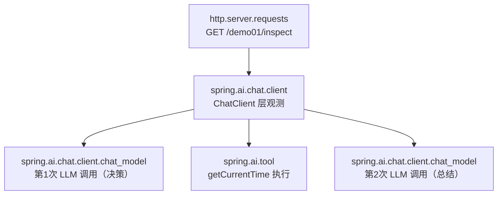
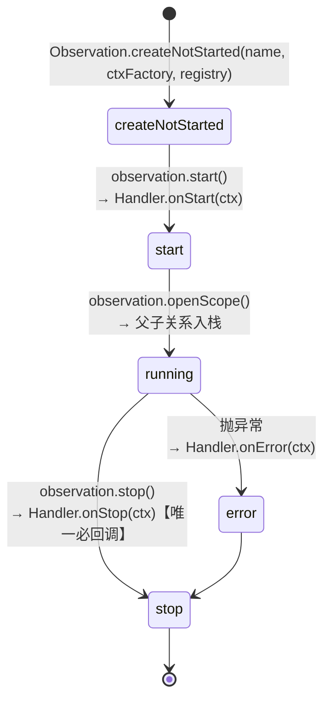

# 01 读懂输出：span 树、gen_ai 标签与一次观测的一生

> **定位**：00 关你看到了一堆 console 输出，但"看不懂"等于没看见。这一关教你**逐行解读**：每段输出是一个 span（观测单元），span 之间的父子关系构成一棵树；再拆开 `observe()` 的生命周期，讲清 Handler 在什么时机被回调——这是后面自定义 Handler/Convention 的地基。
>
> **前置阅读**：[附录 18-Observation/00]（工程已能打印观测）。

---

## 1.1 span 树：一次 inspect 请求的真实结构

把 00 关的 console 输出按"谁包含谁"重排，你会得到一棵树：



三件事值得体会：

1. **观测是嵌套的，不是并列的**——工具观测是 ChatClient 观测的"孩子"。Micrometer 靠"当前观测入栈/出栈"（scope）自动建立父子；同线程内嵌套调用天然成树。
2. **一轮工具调用 = 两次 LLM 调用**——第 1 次模型决定调工具，第 2 次拿到工具结果后生成答案。console 里看到两个 `chat_model` span 是正常的，不是 bug。
3. **每段输出都带 KeyValues**——形如 `gen_ai.operation.name='chat'`、`gen_ai.system.provider='deepseek'`、`gen_ai.tool.call.name='getCurrentTime'`。这是 Spring AI 遵循的 **gen_ai 语义约定**（OpenTelemetry GenAI Semantic Conventions），换成任何遵循该约定的后端（Jaeger/Grafana/LangSmith 类）都能统一解读。

> 「想深入 gen_ai 语义约定全景？→ [教程 22-全链路可观测性 §3]」

## 1.2 低基数与高基数：工业系统的第一条纪律

console 里标签分两类（javap 实证 `DefaultToolCallingObservationConvention` 的方法划分）：

| 类别 | 例子 | 能否进指标（Prometheus） | 工业含义 |
|---|---|---|---|
| LowCardinality | `tool.name`、`ai.operation.type`、`shift`（04 关加） | 能 | 按"工具名"聚合：getCurrentTime 平均耗时多少 |
| HighCardinality | `tool.call.arguments`、`tool.call.id`、`tool.call.result` | **不能**（基数爆炸） | 只进 trace/日志：这次调用返回的具体时间戳 |

判据一句话：**取值可枚举且总数 < 数百 → 低基数；含业务流水号/自由文本 → 高基数**。工业场景设备编号动辄上万，`deviceId` 一律当高基数处理——这是 07 关基数熔断的伏笔。

## 1.3 拆开 observe()：一次观测的一生

你手写的第一个观测（00 关 controller 里如果有 `Observation.createNotStarted(...).observe(...)`）和框架内部埋点走的是同一条生命周期：



关键结论（决定你怎么写 Handler）：

- **onStop 是信息最全的时机**——此时 Context 里 response/result 都已 `set` 进来。审计/收集类 Handler 都写在 `onStop`。
- **onError 独立于 onStop**——出错时先 `onError` 再 `onStop`，异常对象通过 `ctx.getError()` 可取。
- **Context 是"状态袋"**——`Observation.Context` 本质是个线程安全的 Map + 领域字段。Spring AI 的五类观测点各把自己的领域字段放进去（如 `ToolCallingObservationContext.getToolCallArguments()`），Handler 用 `supportsContext()` 认领。

## 1.4 实践：手动埋一个"业务阶段"观测

框架观测点只知道"有个工具被调了"，不知道你的业务阶段语义（如"班次判定要走排班表"）。给 `TimeTool` 长出第二个方法 `getCurrentShift`（当前班次），并给它的内部业务逻辑手动埋观测。本关后 `TimeTool` 的**完整文件**如下（v2：新增 `ObservationRegistry` 注入 + `getCurrentShift`）：

```java
// src/main/java/demo/demo01/tools/TimeTool.java（本关完整版 v2）
package demo.demo01.tools;

import io.micrometer.observation.Observation;
import io.micrometer.observation.ObservationRegistry;
import org.springframework.ai.tool.annotation.Tool;
import org.springframework.beans.factory.annotation.Autowired;

import java.time.LocalDateTime;
import java.time.format.DateTimeFormatter;

public class TimeTool {

    @Autowired   // ★ demo01 习惯：字段注入；工具对象虽是 new 出来的，但作为 @Bean 方法参数注入容器后仍可被装配
    private ObservationRegistry registry;   // Boot 自动装配的注册表（01 关起）

    @Tool(description = "获取当前系统时间，格式 yyyy-MM-dd HH:mm:ss。巡检、工单、报告都需要时间戳时必须先调用此工具")
    public String getCurrentTime() {
        return LocalDateTime.now().format(DateTimeFormatter.ofPattern("yyyy-MM-dd HH:mm:ss"));
    }

    @Tool(description = "获取当前班次（morning/afternoon/night），用于巡检排班和交接记录")
    public String getCurrentShift() {
        // 手动埋"业务阶段"观测：start() + openScope() + error() + stop() 四步走完整个生命周期
        Observation obs = Observation.start("shift.resolve", Observation.Context::new, registry);
        try (Observation.Scope scope = obs.openScope()) {
            // 模拟查排班表（真实场景是 REST 到排班服务，耗时不可忽略——值得观测）
            int hour = LocalDateTime.now().getHour();
            String shift = hour < 8 ? "morning" : hour < 16 ? "afternoon" : "night";
            return "{\"shift\":\"" + shift + "\",\"hour\":" + hour + "}";
        } catch (Exception e) {
            obs.error(e);          // 出错：onError 回调（先于 stop）
            throw e;
        } finally {
            obs.stop();            // 恰好 stop 一次：try 正常/异常都收口
        }
    }
}
```

> 装配说明（demo01 习惯的关键一环）：`new TimeTool()` 出来的对象默认**不会**被 Spring 处理 `@Autowired`——本关起 `ChatConfig` 升级，把 TimeTool 也声明为 Bean（Spring 会对 `@Bean` 返回的对象执行注解注入，registry 字段才生效）：
>
> ```java
> // src/main/java/demo/demo01/config/ChatConfig.java（本关完整版 v2）
> package demo.demo01.config;
>
> import demo.demo01.tools.TimeTool;
> import org.springframework.ai.chat.client.ChatClient;
> import org.springframework.context.annotation.Bean;
> import org.springframework.context.annotation.Configuration;
>
> @Configuration
> public class ChatConfig {
>     @Bean
>     public TimeTool timeTool() {
>         return new TimeTool();   // ★ @Bean 返回的对象会被 Spring 做注解注入，@Autowired registry 生效
>     }
>
>     @Bean
>     public ChatClient chatClient(ChatClient.Builder builder, TimeTool timeTool) {
>         return builder
>                 .defaultTools(timeTool)   // ★ 用被容器处理过的同一个 Bean
>                 .build();
>     }
> }
> ```
>
> **这是"new 出来的工具也要观测"的工程细节，教材不说、生产必踩。**

> javap 实证注记：`Observation` 上有实例方法 `error(Throwable)`/`stop()`/`openScope()`，静态方法 `start(String, Supplier<Context>, ObservationRegistry)`——**没有** `isStopped()`，也没有静态 `Observation.error(e, registry)`。所以"恰好 stop 一次"靠 try/finally 结构保证，不靠查询状态。日常业务更推荐一步式：`Observation.createNotStarted("shift.resolve", Observation.Context::new, registry).observe(() -> doResolve())`——`observe()` 自动 start/stop；上面走四步是为了让你亲眼对应 1.3 的生命周期。

## 1.5 Postman 测试

| 项 | 内容 |
|---|---|
| 方法 | `GET` |
| URL | `http://localhost:8080/demo01/inspect?prompt=现在几点？当前是什么班次？给交接记录写一句总结` |

**预期现象**：

1. console 中出现两个 tool span（`getCurrentTime` + `getCurrentShift`），且 `getCurrentShift` 之内**嵌套着你手动埋的业务观测** `name='shift.resolve'`——框架观测与业务观测混排成一棵树；
2. 对比两次调用（一次只问时间、一次问时间+班次），观察 span 树差异：**span 树就是 Agent 行为的指纹**；
3. 人为在班次逻辑里抛 `RuntimeException`，再调一次：console 出现 `error='java.lang.RuntimeException...'` 字段，验证 `onError` 时机。

## 1.6 本关沉淀

- span 树 = 请求的行为指纹；一轮工具调用 = 两次 LLM 调用；
- 低/高基数分流是指标与 trace 的分水岭，工业编号一律高基数；
- 生命周期 `start → openScope → (error) → stop`，`onStop` 信息最全，是 Handler 的主战场。

**下一关**：Registry 如何把观测事件分发给 Handler？Convention 在哪个环节注入标签？→ [附录 18-Observation/02]
